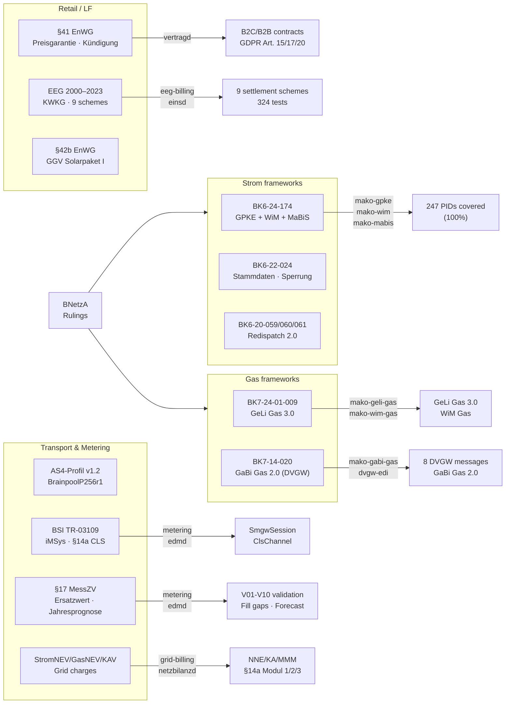

# Regulatory

BDEW market role model and identifier formats, BNetzA ruling index (BK6 / BK7),
business-level process catalog, APERAK Fristen, and the complete
Prüfidentifikator (PID) reference covering all 17 EDI@Energy message types.

| Page | Content |
|---|---|
| [Domain Model](domain-model) | Party roles (LF, NB, MSB, BKV, …), market objects (MaLo, MeLo, NeLo, NeBe), identifier formats, EDIFACT encoding |
| [BNetzA Regulatory Reference](bnetza) | BK6 / BK7 rulings, APERAK Fristen, process scopes |
| [Process Catalog](processes) | Business-level catalog of all MaKo processes — GPKE, WiM, GeLi Gas, MaBiS, Redispatch 2.0 — with message flows and implementation status |
| [PID Reference](pid-reference) | Complete Prüfidentifikator table for all process families, including DVGW synthetic PIDs |

---

## Regulatory framework coverage

---

## Implemented regulatory frameworks

| Regulation | Domain | Implementation |
|---|---|---|
| **BK6-24-174** (GPKE + WiM + MaBiS, in force 06.06.2025) | Strom | `mako-gpke`, `mako-wim`, `mako-mabis` |
| **BK6-22-024** (GPKE Teil 4 — Stammdaten, Sperrung) | Strom | `mako-gpke` |
| **BK7-24-01-009** (GeLi Gas 3.0, BK7 Beschluss 12.09.2025) | Gas | `mako-geli-gas`, `mako-wim-gas` |
| **BK7-14-020** (GaBi Gas 2.0 — Kapazitätsabrechnung, DVGW) | Gas | `mako-gabi-gas`, `dvgw-edi` |
| **PARTIN AHB 1.0f** (Kommunikationsdaten Strom + Gas) | Both | `mako-gpke` (37000–37006), `mako-geli-gas` (37008–37014) |
| **§42b Abs. 5 EnWG** (Solarpaket I — GGV Gemeinschaftliche Gebäudeversorgung) | Strom | `metering` crate (`GgvConstantAllocation`, `GgvProportionalAllocation`), `edmd` |
| **§42a EEG** (Residuallast) | Strom | `metering` crate (`Residual` rule), `edmd` |
| **EEG 2000–2023 / KWKG** (Feed-in settlement) | Strom | `eeg-billing` crate (9 schemes), `einsd` |
| **§17 MessZV** (Ersatzwertbildung, Jahresprognose, Substitution) | Both | `metering` crate (V01–V10 validation, `fill_gaps`, `project_annual_consumption`), `edmd` |
| **BSI TR-03109** (iMSys / SMGW lifecycle, §14a CLS channels) | Strom | `metering` (`SmgwSession`, `ClsChannel`), `edmd` |
| **StromNEV / GasNEV / KAV** (grid charge settlement) | Both | `grid-billing` crate, `netzbilanzd` |
| **§14a EnWG** (Steuerbare Verbrauchseinrichtungen — Modul 1/2/3) | Strom | `grid-billing` (`Sect14aModule`), `processd` (produktcode check BK6-24-174) |
| **§41 EnWG** (Preisgarantie, §41 Abs. 3 Preisanpassung, Kündigung) | Both | `vertragd` |
| **§41a EnWG** (Dynamic tariffs — EPEX Spot day-ahead) | Strom | `tarifbd` (EPEX prices), `billingd` (§41b iMSys guard) |
| **GDPR Art. 15/17/20** (data export, pseudonymization, portability) | — | `vertragd` (`/export`, `/anonymize`), `accountingd` (`/anonymize`) |
| **XRechnung 3.0 / ZUGFeRD 2.3** (EN16931 e-invoice) | — | `billingd` |
| **BK6-20-059/060/061** (Redispatch 2.0) | Strom | `mako-redispatch` (placeholder), `redispatch-xml` |
| **BDEW AS4-Profil v1.2** (BrainpoolP256r1, sign+encrypt, ECDH-ES AES128-GCM) | — | `mako-as4` |
| **§20 EnWG** (Diskriminierungsfreiheit, §20 Abs. 1 S. 3) | Both | `obsd` (`bnetza-report`), Cedar ABAC |
| **MsbG §29 Abs. 3** (SMGW certificate expiry monitoring) | Strom | `edmd` (SMGW cert sweep worker) |

> **Format version coexistence.** `FV2025-10-01` (production) and `FV2026-10-01` (next)
> coexist in the same running instance. A process started under the old format version
> continues under those rules until it completes — no data migration required.
>
> **PID coverage.** `cargo xtask validate-pruefids` verifies all 247 Prüfidentifikatoren
> in the workspace are correctly registered. CI enforces 100% coverage.

