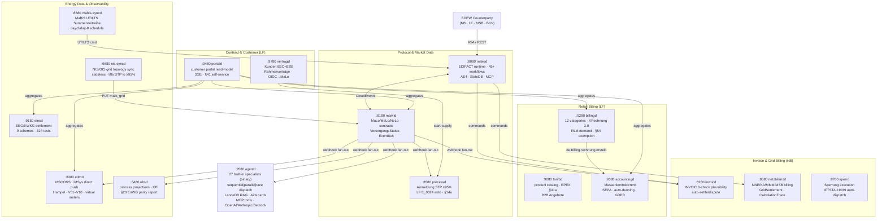

# Services

mako consists of **17 independently deployable services**, each built as a self-contained Docker image with:
- TOML configuration with `_FILE` suffix for Kubernetes secrets
- Cedar ABAC authorization
- OIDC/JWT + API-key authentication  
- OpenTelemetry traces and metrics
- Built-in MCP server at `/mcp` (Streamable HTTP 2025-11-25)
- Structured health endpoints (`/health`, `/health/ready`)

All services are built on **[`mako-service`](https://github.com/hupe1980/mako/tree/main/crates/mako-service)** — the shared SDK that provides `shutdown::token/serve` (SIGINT+SIGTERM graceful drain), `OidcConfig::build_verifier`, `McpAuth`+`McpAuthConfig`, `init_tracing_from_env`, `DatabaseConfig`, `HttpConfig`, `CedarEnforcer`, `EventBus`, and more. This means zero copy-pasted infrastructure code across the 17 daemons.

---

## Service Map



---

## Protocol & Market Data

| Service | Port | Role | Purpose |
|---|---|---|---|
| [makod](./makod) | `:8080` · `:4080` · `:8090` | All | Protocol daemon — 45+ GPKE/WiM/GeLi Gas/MABIS/GaBi Gas workflows, AS4/REST/iMS |
| [marktd](./marktd) | `:8180` | All | Market Data Hub — MaLo/MeLo/contracts, VersorgungsStatus, typed BO4E API, EventBus fan-out, MMMA monthly import worker |
| [processd](./processd) | `:8580` | NB + LF + MSB | Process Decision Engine — Anmeldung STP ≥95%, LF E_0624 45-min auto-response, MSB REQOTE auto-response, §14a Steuerungsauftrag produktcode check |

## Invoice & Billing (NB)

| Service | Port | Role | Purpose |
|---|---|---|---|
| [invoicd](./invoicd) | `:8280` | LF | INVOIC plausibility-check — 6 checks (incl. ToU band routing via `zaehlzeitregister`), auto-settle/dispute, §22 MessZV receipts |
| [netzbilanzd](./netzbilanzd) | `:8680` | NB | NNE/KA/MMM/MSB/AWH billing — generates INVOIC 31001/31002/31005/31009/31011, full REMADV lifecycle, §14a Modul 2 ToU, §42a GGV, Redispatch 2.0 Kostenblatt, 13-tool MCP server |
| [sperrd](./sperrd) | `:8780` | NB | Sperrung execution tracking — IFTSTA 21039 auto-dispatch on field confirmation; `GET /stats` compliance snapshot; tenant isolation; 5-tool MCP server |

## Energy Data & Observability

| Service | Port | Role | Purpose |
|---|---|---|---|
| [edmd](./edmd) | `:8380` | All | Energy Data Management — MSCONS, iMSys direct push, Hampel quality scoring, V01–V10 validation, virtual meters (§42b GGV), §17 MessZV Jahresprognose forecasting, Resampling, Ablesesteuerung (INSRPT auto-order), Iceberg/S3 OLAP |
| [mabis-syncd](./mabis-syncd) | `:8880` | ÜNB/NB | MaBiS UTILTS synchronisation — aggregates per-MaLo Lastgang via `SummenzeitreiheBuilder`, submits to BIKO; vorläufig day 3 + endgültig day 8 schedule; per-MaLo contribution log |
| [einsd](./einsd) | `:9180` | NB/LF | Einspeiser Registry + EEG/KWKG settlement — 9 settlement schemes |
| [obsd](./obsd) | `:8480` | All | Business-process observability — KPI reports, §20 EnWG parity, automated deadline computation (GPKE 24h/WiM 5WT/GeLi Gas 10WT), `completed_at` cycle-time tracking, `GET /api/v1/audit/bnetza-report`, 6-tool MCP server |
| [nis-syncd](./nis-syncd) | `:9680` | NB | NIS/GIS grid topology import — concurrent `tokio::task::JoinSet` sync, drift CloudEvents, `check_malo_grid` MCP tool, lifts Anmeldung STP ~80% → ≥95% (stateless) |

## Retail Billing (LF)

| Service | Port | Role | Purpose |
|---|---|---|---|
| [tarifbd](./tarifbd) | `:9080` | LF | Product & Tariff Catalog — user-defined energy products, EPEX Spot for §41a, B2B Angebote/quotations |
| [billingd](./billingd) | `:9280` | LF | Energy Billing Engine — 12 categories, §41a dynamic, §42a GGV community solar, XRechnung 3.0 / ZUGFeRD 2.3 |
| [accountingd](./accountingd) | `:9380` | LF | Customer Account Ledger — Massenkontokorrent, SEPA pain.008+pain.001 (sepa 0.3.0, typed `SequenceType`, hard IBAN validation), N-5 pre-notification scheduler, FIFO open-item management (`/open-items`), auto-dunning rule engine (Mahnstufe 1–3), GDPR Art. 17 pseudonymization (`/anonymize`), balance reconciliation (`/reconcile`), **71 tests** |

## B2C & AI

| Service | Port | Role | Purpose |
|---|---|---|---|
| [vertragd](./vertragd) | `:9780` | LF | Contract & Customer Management — Kunden (B2C+B2B), Rahmenverträge, Versorgungsverträge, kunden_identitaeten (N portal users per company), Tarifwechsel, Kündigung, OIDC→MaLo auth gateway for portald |
| [portald](./portald) | `:9480` | LF | Customer Portal gateway — aggregates all LF services, REST + SSE, §41 EnWG self-service write API (Tarifwechsel, Kündigung, SEPA, GDPR Art. 16), 8-tool MCP server |
| [agentd](./agentd) | `:9580` | All | Multi-agent LLM orchestration — **27 built-in specialists compiled into binary**, activated via `[bundled_agents]`; `sequential`/`parallel`/`race` dispatch modes; A2A agent cards at `/.well-known/agents/{name}`; builtin catalog at `GET /api/v1/agents/catalog`; LanceDB RAG; MCP tools across all 17 services |

---

## Deployment

All services are available as multi-stage Docker images built with `cargo-chef`:

```bash
# Single all-in-one daemon (makod only)
docker pull ghcr.io/hupe1980/makod:latest

# NB STP demo — UTILMD 55001 Lieferbeginn end-to-end
git clone https://github.com/hupe1980/mako
cd mako/demos/nb-stp
docker compose up

# EEG billing demo — solar plant registration + §21 EEG 2023 settlement
cd mako/demos/eeg-billing
docker compose up
```

See the [Getting Started](../getting-started) guide for the full deployment walkthrough.
