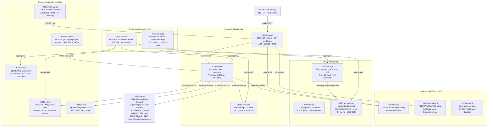
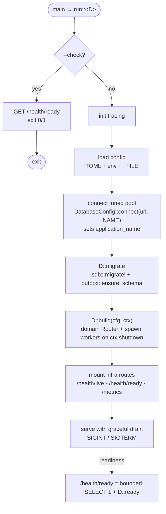

# Services

mako consists of **17 independently deployable services**, each built as a self-contained Docker image with:
- TOML configuration with `_FILE` suffix for Kubernetes secrets
- Cedar ABAC authorization
- OIDC/JWT + API-key authentication  
- OpenTelemetry traces and metrics
- Built-in MCP server at `/mcp` (Streamable HTTP 2025-11-25)
- Structured health endpoints (`/health`, `/health/ready`)

All services are built on **[`mako-service`](https://github.com/hupe1980/mako/tree/main/crates/mako-service)** — the shared SDK that provides `shutdown::token/serve` (SIGINT+SIGTERM graceful drain), `OidcConfig::build_verifier`, `McpAuth`+`McpAuthConfig`, `init_tracing_from_env`, `DatabaseConfig`, `HttpConfig`, `CedarEnforcer`, `EventBus`, and more. This means zero copy-pasted infrastructure code across the 17 daemons.

`DatabaseConfig::connect(url, service_name)` is the single PostgreSQL pool builder every daemon uses: it applies the configured `pool_size` plus `acquire_timeout_secs` / `idle_timeout_secs` / `max_lifetime_secs` (so a pool never queues unboundedly or pins a connection across a failover) and tags each connection with the service name in `pg_stat_activity`. Tuning lives in one place rather than being re-derived per service.

---

## Service Map


```mermaid
graph TB
    ext["BDEW Counterparty<br/>(NB · LF · MSB · BKV)"]

    subgraph protocol ["Protocol & Market Data"]
        makod[":8080 makod\nEDIFACT runtime · 67+ workflows\nAS4 · SlateDB · MCP"]
        marktd[":8180 marktd\nMaLo/MeLo/NeLo · contracts\nVersorgungsStatus · EventBus"]
        processd[":8580 processd\nAnmeldung STP ≥95%\nLF E_0624 auto · §14a"]
    end

    subgraph nb_billing ["Invoice & Grid Billing (NB)"]
        invoicd[":8280 invoicd\nINVOIC 6-check plausibility\nauto-settle/dispute"]
        netzbilanzd[":8680 netzbilanzd\nNNE/KA/MMM/MSB billing\nGridSettlement · CalculationTrace"]
        sperrd[":8780 sperrd\nSperrung execution\nIFTSTA 21039 auto-dispatch"]
    end

    subgraph data ["Energy Data & Observability"]
        edmd[":8380 edmd\nMSCONS · iMSys direct push\nHampel · V01–V10 · virtual meters"]
        obsd[":8480 obsd\nprocess projections · KPI\n§20 EnWG parity report"]
        nis[":9680 nis-syncd\nNIS/GIS grid topology sync\nstateless · lifts STP to ≥95%"]
        mabis[":8880 mabis-syncd\nMaBiS Summenzeitreihe\nMSCONS 13003 · 10. Werktag"]
        einsd[":9180 einsd\nEEG/KWKG settlement\n10 schemes · §14 UStG Gutschrift"]
    end

    subgraph lf_billing ["Retail Billing (LF)"]
        tarifbd[":9080 tarifbd\n14 categories · §42d feed\nEPEX §41a · B2B Angebote"]
        billingd[":9280 billingd\n13 categories · XRechnung 3.0\nRLM demand · §54 exemption"]
        accountingd[":9380 accountingd\nMassenkontokorrent\nSEPA FRST/RCUR · GLN ID · Aging · §288 BGB"]
    end

    subgraph b2c ["Contract & Customer (LF)"]
        vertragd[":9780 vertragd\nKunden B2C+B2B · Rahmenverträge\nOIDC→MaLo · 16 MCP tools"]
        portald[":9480 portald\ncustomer portal read-model\nSSE · §41 self-service"]
    end

    agentd[":9580 agentd\n29 built-in specialists (binary)\nsequential|parallel|race dispatch\nLanceDB RAG (tenant-isolated) · A2A cards\nOIDC · HMAC · DLQ · OpenAI/Anthropic/Bedrock"]

    ext -->|AS4 / REST| makod
    makod <-->|CloudEvents| marktd
    marktd -->|webhook fan-out| processd & invoicd & edmd & obsd & agentd
    makod -->|commands| netzbilanzd & invoicd
    nis -->|PUT malo_grid| marktd
    mabis -->|UTILTS cmd| makod
    billingd -->|de.billing.rechnung.erstellt| accountingd
    vertragd -->|start-supply| processd
    portald -->|aggregates| billingd & accountingd & edmd & einsd & marktd
```

---

## Protocol & Market Data

| Service | Port | Role | Purpose |
|---|---|---|---|
| [makod](./makod) | `:8080` · `:4080` · `:8090` | All | Protocol daemon — 67+ GPKE/WiM/GeLi Gas/MaBiS/GaBi Gas workflows, AS4/REST/iMS |
| [marktd](./marktd) | `:8180` | All | Market Data Hub — MaLo/MeLo/contracts, VersorgungsStatus, typed BO4E API, EventBus fan-out, MMMA monthly import worker |
| [processd](./processd) | `:8580` | NB + LF + MSB | Process Decision Engine — Anmeldung STP ≥95%, LF E_0624 45-min auto-response, MSB REQOTE auto-response, §14a Steuerungsauftrag produktcode check |

## Invoice & Billing (NB)

| Service | Port | Role | Purpose |
|---|---|---|---|
| [invoicd](./invoicd) | `:8280` | LF | INVOIC plausibility-check — 6 checks (incl. ToU band routing via `zaehlzeitregister`), auto-settle/dispute, § 147 AO / GoBD receipts |
| [netzbilanzd](./netzbilanzd) | `:8680` | NB | NNE/KA/MMM/MSB/AWH billing — generates INVOIC 31001/31002/31005/31009/31011, full REMADV lifecycle, §14a Modul 2 ToU, §42a GGV, Redispatch 2.0 Kostenblatt, 13-tool MCP server |
| [sperrd](./sperrd) | `:8780` | NB | Sperrung execution tracking — IFTSTA 21039 auto-dispatch on field confirmation; `GET /stats` compliance snapshot; tenant isolation; 5-tool MCP server |

## Energy Data & Observability

| Service | Port | Role | Purpose |
|---|---|---|---|
| [edmd](./edmd) | `:8380` | All | Energy Data Management — MSCONS, iMSys direct push, Kafka batch ingest, Hampel quality scoring, V01–V10 validation, virtual meters (§42b GGV), § 60 Abs. 2 MsbG Jahresprognose forecasting, Resampling, Ablesesteuerung (INSRPT auto-order), meterstore hot/cold tiering (PostgreSQL + Apache Iceberg) with cross-tier OLAP + a read-only Iceberg REST catalog; Cedar write actions role-gated (MSB/NB/admin); 15-tool MCP server |
| [mabis-syncd](./mabis-syncd) | `:8880` | ÜNB/NB | MaBiS synchronisation — aggregates quarter-hourly Lastgang per Bilanzierungsgebiet via `SummenzeitreiheBuilder`, files with the BIKO as MSCONS 13003 on the 10. Werktag; records the BIKO-assigned Datenstatus and open Korrekturbedarf |
| [einsd](./einsd) | `:9180` | NB/LF | Einspeiser Registry + EEG/KWKG settlement — 10 settlement schemes; issues the **§14 UStG Gutschrift** (Gutschriftverfahren) per billable settlement as a BO4E `Rechnung` with per-rate USt breakdown; 18-tool MCP server |
| [obsd](./obsd) | `:8480` | All | Business-process observability — KPI reports, §20 EnWG parity, automated deadline computation (GPKE 24h/WiM 5WT/GeLi Gas 10WT), `completed_at` cycle-time tracking, `GET /api/v1/audit/bnetza-report`, 6-tool MCP server |
| [nis-syncd](./nis-syncd) | `:9680` | NB | NIS/GIS grid topology import — concurrent `tokio::task::JoinSet` sync, drift CloudEvents, `check_malo_grid` MCP tool, lifts Anmeldung STP ~80% → ≥95% (stateless) |

## Retail Billing (LF)

| Service | Port | Role | Purpose |
|---|---|---|---|
| [tarifbd](./tarifbd) | `:9080` | LF | Product & Tariff Catalog — user-defined energy products, EPEX Spot for §41a, B2B Angebote/quotations |
| [billingd](./billingd) | `:9280` | LF | Energy Billing Engine — 13 categories, §41a dynamic, §42a GGV community solar, EN 16931 e-invoicing (XRechnung 3.0 CII / PEPPOL UBL) |
| [accountingd](./accountingd) | `:9380` | LF | Customer Account Ledger — tamper-evident double-entry ledger (the `doubleentry` crate: Merkle proofs + period seals for GoBD/§146 AO Festschreibung); per-MaLo Kontokorrent + GL contras; FIFO open-item clearing; Summen- und Saldenliste §238 HGB; aging analysis; Verzugszinsen §288 BGB; Zahlungsvereinbarung; SEPA pain.008 (FRST/RCUR separated, Gläubiger-ID EPC AT-02); CAMT.054 dedup; keyed-BLAKE3 IBAN hash; OIDC/JWT + inbound HMAC; auto-dunning; GDPR Art. 17 |

## B2C & AI

| Service | Port | Role | Purpose |
|---|---|---|---|
| [vertragd](./vertragd) | `:9780` | LF | Contract & Customer Management — Kunden (B2C+B2B), Rahmenverträge, Versorgungsverträge, kunden_identitaeten (N portal users per company), Tarifwechsel, Kündigung, OIDC→MaLo auth gateway for portald |
| [portald](./portald) | `:9480` | LF | Customer Portal gateway — aggregates all LF services, REST + SSE, §41 EnWG self-service write API (Tarifwechsel, Kündigung, SEPA, GDPR Art. 16), 8-tool MCP server |
| [agentd](./agentd) | `:9580` | All | Multi-agent LLM orchestration — **29 built-in specialists compiled into binary**, activated via `[bundled_agents]`; `sequential`/`parallel`/`race` dispatch; OIDC auth on `/api/v1/run`; inbound HMAC; DLQ with exponential-backoff retry; LanceDB RAG (tenant-isolated, cosine distance score filtering); A2A agent cards; MCP tools across all 17 services |

---

## Shared foundation — the `mako-service` SDK

Every daemon is built on the [`mako-service`](https://github.com/hupe1980/mako/tree/main/crates/mako-service)
crate, so the operational surface — health, config, auth, tracing, shutdown, event delivery — is
identical across all 17. A service's `main` is a single line:

```rust
#[tokio::main]
async fn main() -> anyhow::Result<()> {
    mako_service::run::<Billingd>().await   // Billingd: Daemon impl
}
```

`run::<D>()` owns the whole lifecycle. A `Daemon` implementation supplies only what is
service-specific — the config type, the migrations, and a `build()` that assembles the domain
router and spawns background workers:


```mermaid
flowchart TD
    start(["main → run::&lt;D&gt;"]) --> check{"--check?"}
    check -->|yes| probe["GET /health/ready<br/>exit 0/1"] --> done([exit])
    check -->|no| trace["init tracing"]
    trace --> cfg["load config<br/>TOML + env + _FILE"]
    cfg --> pool["connect tuned pool<br/>DatabaseConfig::connect(url, NAME)<br/>sets application_name"]
    pool --> migrate["D::migrate<br/>sqlx::migrate! + outbox::ensure_schema"]
    migrate --> build["D::build(cfg, ctx)<br/>domain Router + spawn workers on ctx.shutdown"]
    build --> infra["mount infra routes<br/>/health/live · /health/ready · /metrics"]
    infra --> serve["serve with graceful drain<br/>SIGINT / SIGTERM"]
    serve -.->|readiness| ready["/health/ready = bounded SELECT 1 + D::ready"]
```

What every service gets for free from the runner:

| Concern | Provided by `run::<D>()` |
|---|---|
| **Tracing** | Structured logs + optional OTLP export (`RUST_LOG`, `[otel]`) |
| **Config** | `[database]` + service blocks, `env:`/`_FILE` substitution, `<SVC>_CONFIG` path |
| **Pool** | Tuned sizing with a per-service `application_name` for `pg_stat_activity` |
| **Migrations** | Applied at startup before the first request |
| **Readiness** | Real `/health/ready` — a bounded `SELECT 1` DB ping, not a static `true` |
| **Shutdown** | SIGINT/SIGTERM graceful drain; workers observe `ctx.shutdown` |
| **Health probe** | `--check` in-container HEALTHCHECK (no shell, no curl) |

Event-emitting services (billingd, einsd, accountingd, netzbilanzd, vertragd, invoicd) add a
**transactional outbox**: each outbound CloudEvent is written to `event_outbox` *in the same
transaction* as the business change and drained by a background `OutboxWorker` with retry and a
status-column dead-letter queue. Because the event is committed atomically with the data that
justifies it, a crash between "commit" and "deliver" can never drop or duplicate it —
persist-before-dispatch. Emission always goes through one builder and one signer
(`CloudEvent::new` + `post_ce_with_retry`; `X-Mako-Signature: sha256=<hex>`).

> `makod`, `marktd`, `agentd`, and `portald` keep bespoke `main`s — `makod`/`marktd` for their
> non-standard runtimes (SlateDB event store, `marktd`'s durable fan-out worker), `agentd`/`portald`
> because they hold no database. All four still use the same SDK building blocks (config, auth,
> tracing, shutdown, HMAC).

---

## Deployment

All services are available as multi-stage Docker images built with `cargo-chef`:

```bash
# Single all-in-one daemon (makod only)
docker pull ghcr.io/hupe1980/makod:latest

# NB STP demo — UTILMD 55001 Lieferbeginn end-to-end
git clone https://github.com/hupe1980/mako
cd mako/demos/nb-stp
docker compose up

# EEG billing demo — solar plant registration + §21 EEG 2023 settlement
cd mako/demos/eeg-billing
docker compose up
```

See the [Getting Started](../getting-started) guide for the full deployment walkthrough.
