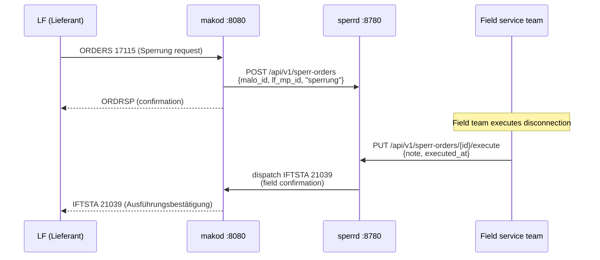
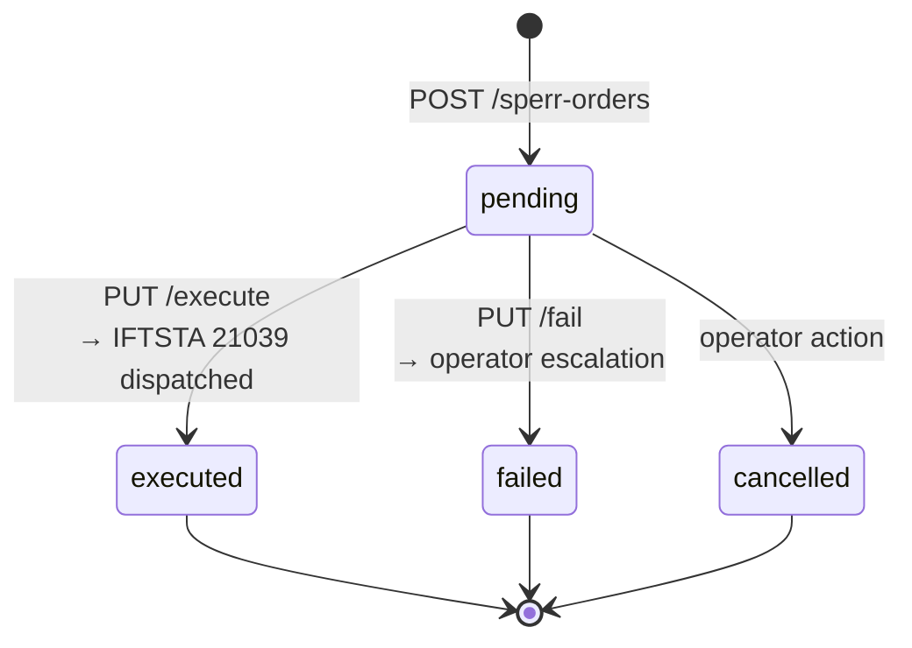

# `sperrd` Operator Guide
{: .no_toc }

`sperrd` bridges the gap between the BDEW ORDERS Sperrung process and the
physical field-service execution. Without `sperrd`, a missed IFTSTA 21039
leaves the Sperrung permanently unresolved in the LF system — a GPKE protocol
violation under BK6-22-024.

**Port:** `:8780`  
**Storage:** PostgreSQL (`sperr_orders` table)  
**Role:** NB (Netzbetreiber) role only

{: .toc }
1. TOC
{:toc}

---

## Why `sperrd` exists



Without `sperrd`, the field team would need to manually trigger IFTSTA 21039
through another system, creating a compliance risk if that step is missed.
`sperrd` captures the execution confirmation and automatically ensures the
IFTSTA reaches `makod` for outbound delivery.

---

## HTTP API

### `POST /api/v1/sperr-orders`

Register a new Sperrung or Entsperrung order.

```json
{
  "malo_id":      "51238696780",
  "lf_mp_id":     "9900012345678",
  "order_type":   "sperrung",
  "process_id":   "550e8400-e29b-41d4-a716-446655440000",
  "planned_date": "2025-02-20"
}
```

`order_type`: `"sperrung"` (disconnect) or `"entsperrung"` (reconnect).

Response `201 Created`: `{ "id": "<uuid>" }`

### `GET /api/v1/sperr-orders`

Query parameters: `status`, `malo_id`, `limit` (default 100).

### `GET /api/v1/sperr-orders/{id}`

Returns full order including `status`, `executed_at`, `iftsta_ref`, and `fail_reason`.

### `PUT /api/v1/sperr-orders/{id}/execute`

Reports successful field execution. Triggers IFTSTA 21039 dispatch to `makod`.

```json
{
  "note":        "Disconnected at main fuse panel, ref: TW-2025-0220-001",
  "executed_at": "2025-02-20T09:47:00+01:00"
}
```

Response `204 No Content`.

### `PUT /api/v1/sperr-orders/{id}/fail`

Reports a field failure. Escalates to operator review (status → `failed`).

```json
{
  "reason": "Meter not accessible — locked gate. Rescheduled for next week."
}
```

Response `204 No Content`.

---

## Order lifecycle



### Status meanings

| Status | Description |
|---|---|
| `pending` | Order registered, awaiting field execution |
| `executed` | Field team confirmed execution; IFTSTA 21039 dispatched to `makod` |
| `failed` | Field team reported failure; no IFTSTA sent; operator must take action |
| `cancelled` | Order cancelled before field execution (e.g. customer paid) |

---

## Configuration

```toml
# sperrd.toml
database_url   = "env:DATABASE_URL"
port           = 8780

makod_url      = "http://makod:8080"
makod_api_key  = "env:MAKOD_API_KEY"
```

---

## PostgreSQL schema

```sql
-- sperr_orders: tracks Sperrung/Entsperrung execution.
-- status: pending → executed | failed | cancelled
CREATE TABLE sperr_orders (
    id               UUID        PRIMARY KEY DEFAULT gen_random_uuid(),
    malo_id          TEXT        NOT NULL,
    lf_mp_id         TEXT        NOT NULL,
    order_type       TEXT        NOT NULL CHECK (order_type IN ('sperrung', 'entsperrung')),
    process_id       TEXT,                    -- makod ORDERS process UUID
    planned_date     DATE,
    status           TEXT        NOT NULL DEFAULT 'pending',
    executed_at      TIMESTAMPTZ,
    execution_note   TEXT,
    fail_reason      TEXT,
    iftsta_ref       TEXT,                    -- dispatched IFTSTA 21039 command ID
    created_at       TIMESTAMPTZ NOT NULL DEFAULT now(),
    updated_at       TIMESTAMPTZ NOT NULL DEFAULT now()
);

CREATE INDEX ON sperr_orders (malo_id, status);
CREATE INDEX ON sperr_orders (planned_date) WHERE status = 'pending';
```

---

## Overdue pending orders

Orders that remain `pending` past their `planned_date` are a compliance risk.
Query them with:

```sql
SELECT * FROM sperr_orders
WHERE status = 'pending'
  AND planned_date < CURRENT_DATE
ORDER BY planned_date;
```

Expose this as a monitoring query or connect `obsd` to alert when the count > 0.

---

## Regulatory basis

| Regulation | Requirement |
|---|---|
| GPKE BK6-22-024 | IFTSTA 21039 (Ausführungsbestätigung) must be sent after physical Sperrung/Entsperrung execution |
| BK6-22-024 §6.2 | Failure to send IFTSTA 21039 leaves the process permanently unresolved in the LF system |
| BDEW ORDERS AHB PIDs 17115–17117 | Sperrung/Entsperrung order + confirmation message flow |

> **Integration note:** Inbound ORDERS 17115 from the LF triggers the order creation in `sperrd`.
> Outbound IFTSTA 21039 is dispatched to `makod`, which serializes it as EDIFACT and delivers
> it to the LF via AS4.
