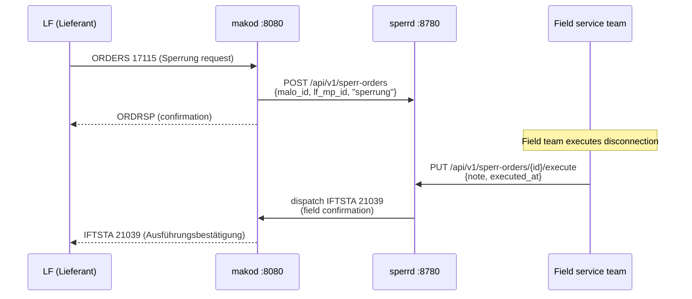
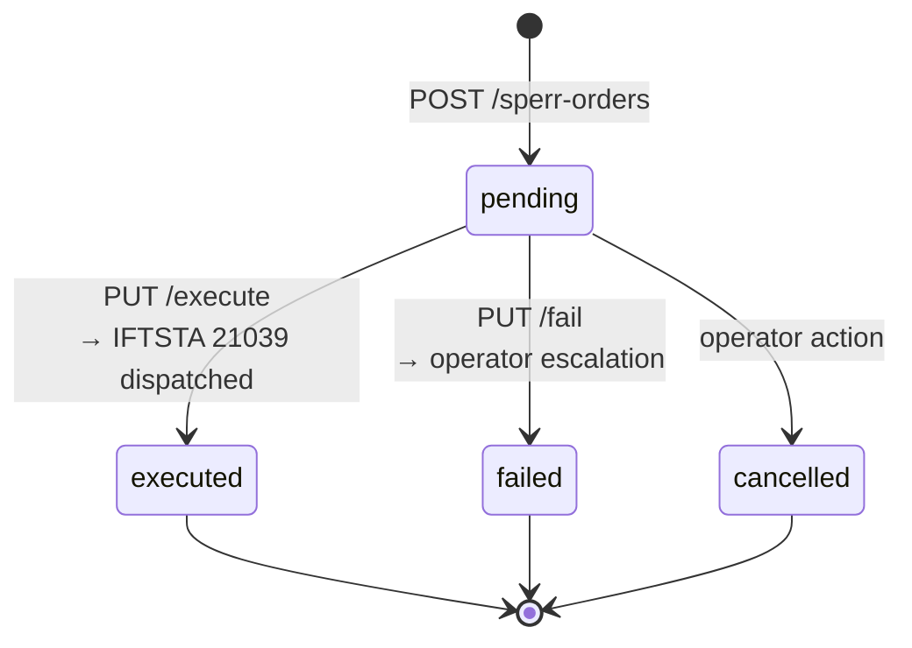

# `sperrd` Operator Guide
{: .no_toc }

`sperrd` bridges the gap between the BDEW ORDERS Sperrung process and the
physical field-service execution. Without `sperrd`, a missed IFTSTA 21039
leaves the Sperrung permanently unresolved in the LF system — a GPKE protocol
violation under BK6-22-024.

**Port:** `:8780`  
**Storage:** PostgreSQL (`sperr_orders` table)  
**Role:** NB (Netzbetreiber) role only

{: .toc }
1. TOC
{:toc}

---

## Why `sperrd` exists



Without `sperrd`, the field team would need to manually trigger IFTSTA 21039
through another system, creating a compliance risk if that step is missed.
`sperrd` captures the execution confirmation and automatically ensures the
IFTSTA reaches `makod` for outbound delivery.

---

## HTTP API

### `POST /api/v1/sperr-orders`

Register a new Sperrung or Entsperrung order.

```json
{
  "malo_id":      "51238696780",
  "lf_mp_id":     "9900012345678",
  "order_type":   "sperrung",
  "process_id":   "550e8400-e29b-41d4-a716-446655440000",
  "planned_date": "2025-02-20"
}
```

`order_type`: `"sperrung"` (disconnect) or `"entsperrung"` (reconnect).

Response `201 Created`: `{ "id": "<uuid>" }`

### `GET /api/v1/sperr-orders`

Query parameters:

| Parameter | Description |
|-----------|-------------|
| `status` | Filter by status: `pending`, `executed`, `failed`, `cancelled` |
| `malo_id` | Filter by Marktlokations-ID |
| `older_than_hours` | Return only orders created more than N hours ago — use `48` in the daily BK6-22-024 compliance sweep to detect stuck orders past the 2-Werktage window |
| `limit` | Maximum results (default 100, max 1000) |

### `GET /api/v1/sperr-orders/{id}`

Returns full order including `status`, `executed_at`, `iftsta_ref`, and `fail_reason`.

### `PUT /api/v1/sperr-orders/{id}/execute`

Reports successful field execution. Triggers IFTSTA 21039 dispatch to `makod`.

```json
{
  "note":        "Disconnected at main fuse panel, ref: TW-2025-0220-001",
  "executed_at": "2025-02-20T09:47:00+01:00"
}
```

Response `204 No Content`.

### `PUT /api/v1/sperr-orders/{id}/fail`

Reports a field failure. Escalates to operator review (status → `failed`).

```json
{
  "reason": "Meter not accessible — locked gate. Rescheduled for next week."
}
```

Response `204 No Content`.

---

### `PUT /api/v1/sperr-orders/{id}/cancel`

Operator-initiated cancellation of a `pending` order. Only pending orders can
be cancelled — `executed` and `failed` orders are terminal.

No IFTSTA 21039 is dispatched for cancelled orders (the Sperrung was never
physically executed). Inform the LF if the order had already been communicated
to their system.

Response `204 No Content`.

---

### `GET /api/v1/sperr-orders/stats`

Aggregate statistics for the BK6-22-024 compliance sweep.

```json
{
  "total": 42,
  "pending": 3,
  "executed": 36,
  "failed": 2,
  "cancelled": 1,
  "overdue_pending": 1,
  "executed_missing_iftsta": 0
}
```

| Field | Regulatory meaning |
|-------|--------------------|
| `overdue_pending` | Pending orders whose `planned_date` is in the past — **BK6-22-024 violation risk** |
| `executed_missing_iftsta` | Executed orders where IFTSTA 21039 was NOT dispatched — **GPKE protocol violation** |

---

## Order lifecycle



### Status meanings

| Status | Description |
|---|---|
| `pending` | Order registered, awaiting field execution |
| `executed` | Field team confirmed execution; IFTSTA 21039 dispatched to `makod` |
| `failed` | Field team reported failure; no IFTSTA sent; operator must take action |
| `cancelled` | Order cancelled before field execution (e.g. customer paid) |

---

## Configuration

```toml
# sperrd.toml
database_url   = "env:DATABASE_URL"
port           = 8780
tenant         = "9900357000004"   # data-isolation key (BDEW-/DVGW-Codenummer)

makod_url      = "http://makod:8080"
makod_api_key  = "env:MAKOD_API_KEY"
```

---

## PostgreSQL schema

```sql
-- sperr_orders: tracks Sperrung/Entsperrung execution.
-- status: pending → executed | failed | cancelled
CREATE TABLE sperr_orders (
    id                   UUID        PRIMARY KEY DEFAULT gen_random_uuid(),
    malo_id              TEXT        NOT NULL,
    lf_mp_id             TEXT        NOT NULL,
    order_type           TEXT        NOT NULL CHECK (order_type IN ('sperrung', 'entsperrung')),
    process_id           TEXT,                    -- makod ORDERS process UUID
    planned_date         DATE,
    status               TEXT        NOT NULL DEFAULT 'pending',
    executed_at          TIMESTAMPTZ,
    execution_note       TEXT,
    fail_reason          TEXT,
    iftsta_ref           TEXT,                    -- dispatched IFTSTA 21039 command ID
    iftsta_dispatched_at TIMESTAMPTZ,             -- when IFTSTA 21039 was sent (SLA tracking)
    tenant               TEXT        NOT NULL DEFAULT '', -- data-isolation key
    created_at           TIMESTAMPTZ NOT NULL DEFAULT now(),
    updated_at           TIMESTAMPTZ NOT NULL DEFAULT now()
);

CREATE INDEX ON sperr_orders (malo_id, status);
CREATE INDEX ON sperr_orders (tenant, status);
CREATE INDEX ON sperr_orders (planned_date) WHERE status = 'pending';
CREATE INDEX ON sperr_orders (id) WHERE status = 'executed' AND iftsta_dispatched_at IS NULL;
```

`iftsta_dispatched_at` tracks the exact moment IFTSTA 21039 was dispatched.
Any row with `status = 'executed'` and `iftsta_dispatched_at IS NULL` represents
a **GPKE protocol violation** — the LF has not yet received execution confirmation.

---

## Overdue pending orders

Orders that remain `pending` past their `planned_date` are a compliance risk.
Query them via the REST API:

```bash
# Overdue orders past planned_date (BK6-22-024 violation risk)
curl http://sperrd:8780/api/v1/sperr-orders/stats

# All stuck pending orders older than 48 hours
curl "http://sperrd:8780/api/v1/sperr-orders?status=pending&older_than_hours=48"
```

Or the MCP tool `list_overdue_orders` surfaces all orders with `planned_date < CURRENT_DATE`
including `days_overdue` — the sperrd-agent calls this in its daily compliance sweep.

---

## Regulatory basis

| Regulation | Requirement |
|---|---|
| GPKE BK6-22-024 | IFTSTA 21039 (Ausführungsbestätigung) must be sent after physical Sperrung/Entsperrung execution |
| BK6-22-024 §6.2 | Failure to send IFTSTA 21039 leaves the process permanently unresolved in the LF system |
| BK6-22-024 §9 | Failed Sperrung must be reported to the LF within 3 Werktage |
| BDEW ORDERS AHB PIDs 17115–17117 | Sperrung/Entsperrung order + confirmation message flow |
| BDEW GeLi Gas 3.0 (BK7-24-01-009) | Gas Sperrprozesse — ORDERS 17115/17117 + INVOIC 31011 (AWH) |

> **Integration note:** Inbound ORDERS 17115 from the LF triggers the order creation in `sperrd`.
> Outbound IFTSTA 21039 is dispatched to `makod`, which serializes it as EDIFACT and delivers
> it to the LF via AS4.

---

## MCP server

`sperrd` exposes an MCP server at `/mcp` for LLM-based compliance automation.

### Tools (5)

| Tool | Description |
|---|---|
| `list_sperr_orders(status, older_than_hours, limit)` | List orders filtered by status and/or age |
| `get_sperr_order(id)` | Full order with timestamps, IFTSTA dispatch status, and process reference |
| `get_sperr_stats` | Aggregate compliance snapshot: pending, executed, overdue, missing IFTSTA |
| `list_overdue_orders` | All pending orders past `planned_date`, with `days_overdue` computed |
| `cancel_sperr_order(id)` | Cancel a pending order (operator-only; `destructive_hint = true`) |

### Prompts (2)

| Prompt | Description |
|---|---|
| `execute-sperrung` | Confirm field execution → IFTSTA 21039 dispatch workflow |
| `compliance-sweep` | Daily BK6-22-024 sweep: overdue + missing IFTSTA + AWH billing gaps |

### Daily compliance sweep with `sperrd-agent`

The `sperrd-agent` in `agentd` runs the compliance check automatically. The pattern:

```
1. get_sperr_stats → check overdue_pending + executed_missing_iftsta
2. If overdue_pending > 0 → list_overdue_orders → escalate field team + notify LF
3. If executed_missing_iftsta > 0 → list_sperr_orders(status=executed) → re-trigger dispatch
4. Cross-reference executed Sperrungen with netzbilanzd INVOIC 31011 drafts (AWH billing)
```
