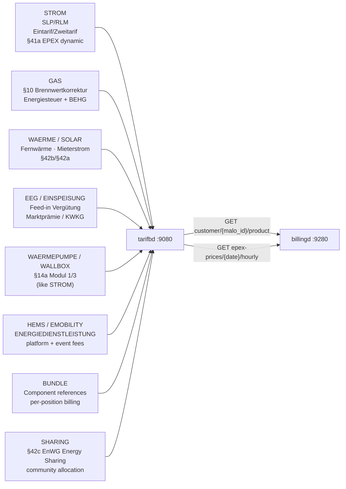

# `tarifbd` — Product & Tariff Catalog

`tarifbd` is the single source of truth for **everything the LF sells** to end customers.
`billingd` and the customer portal query it exclusively for pricing — `marktd` is never used
for retail product pricing.

Port: **`:9080`**

---

## Why a separate catalog?

`marktd` is a B2B MaKo grid communication data hub. Retail tariffs evolve weekly; grid
data is annual (BDEW format versions). Mixing them violates the single-responsibility
principle and makes §20 EnWG audits harder.

`tarifbd` mirrors the product catalog pattern of every mature energy billing platform
(SAP IS-U FI-CA, powercloud, Wilken ENER:GY): a separate service, its own lifecycle,
queried only by billing engines and portals.

---

## Product categories



---

## Endpoints

| Method | Path | Description |
|--------|------|-------------|
| `PUT` | `/api/v1/products/{lf_mp_id}/{product_code}` | Upsert product; archives previous version in `product_history`; validates `_typ`, `_version`, enum fields, 30-value `preistyp` whitelist |
| `GET` | `/api/v1/products/{lf_mp_id}/{product_code}` | Fetch latest product |
| `DELETE` | `/api/v1/products/{lf_mp_id}/{product_code}` | **Soft-delete** — sets `valid_to = today`; product retained for billing history; excluded from comparison feed |
| `GET` | `/api/v1/products/{lf_mp_id}` | List products (`?category=&sparte=&kundentyp=&include_drafts=&include_expired=`) |
| `GET` | `/api/v1/products/{lf_mp_id}/{product_code}/history` | Immutable version audit log (includes `energiemix` history for §42 audit trail) |
| `GET/PUT` | `/api/v1/customer/{malo_id}/product` | Active product for a MaLo / Tarifwechsel (PUT validates product exists, is PUBLISHED, not expired, and `assigned_from >= product.valid_from`) |
| `GET` | `/api/v1/customer/{malo_id}/product/history` | Full product-assignment history — auditors use this to verify Tarifwechsel Wirksamkeit |
| `PUT/GET/DELETE` | `/api/v1/products/{lf_mp_id}/{product_code}/energiemix` | §42 EnWG Energiemix sub-resource — does NOT archive product or trigger billing-period changes |
| `GET` | `/api/v1/comparison-feed` | **Comparison portal feed** — ETag-cached, cursor-paginated tariff listing (PUBLISHED non-expired only); `jahreskosten_supply_*` for `verbrauch_kwh` |
| `GET` | `/api/v1/comparison-feed/bo4e` | **BO4E Tarifinfo array** — §42d EnWG canonical form; direct import by Verivox / Check24 / BNetzA MTS |
| `PUT` | `/api/v1/epex-prices/{date}` | Import EPEX day-ahead prices (24-entry array, idempotent) |
| `GET` | `/api/v1/epex-prices/{date}/hourly` | 24-hour ct/kWh array |
| `GET` | `/api/v1/epex-prices/{year}/{month}/average` | Monthly average — used by `einsd` Direktvermarktung |
| `POST/GET` | `/api/v1/angebote` | B2B Angebot (quotation) — ANGELEGT→VERSANDT→ANGENOMMEN/ABGELEHNT/ABGELAUFEN |
| `GET` | `/health` | Liveness |
| `GET` | `/health/ready` | Readiness |

---

## Registering a product

```http
PUT /api/v1/products/9910000000002/STROM-H0-2026
Content-Type: application/json

{
  "category": "STROM",
  "name": "Strom Zuhause Classic",
  "sparte": "STROM",
  "register_count": "Eintarif",
  "kundentyp": "Haushalt",
  "valid_from": "2026-01-01",
  "data": {
    "_typ": "TARIFPREISBLATT",
    "bezeichnung": "Strom Zuhause Classic 2026",
    "gueltigkeit": { "startdatum": "2026-01-01" },
    "tarifpreispositionen": [
      { "leistungstyp": "GRUNDPREIS",   "preisstaffeln": [{ "preis": "0.20" }] },
      { "leistungstyp": "ARBEITSPREIS", "preisstaffeln": [{ "preis": "0.32" }] }
    ]
  }
}
```

`billingd` extracts `grundpreis_ct_per_day` (20 ct/day) and `arbeitspreis_ct_per_kwh`
(32 ct/kWh) by traversing `data.tarifpreispositionen` keyed on `leistungstyp`.

---

## Assigning a product to a MaLo (Tarifwechsel)

```http
PUT /api/v1/customer/51238696781/product
Content-Type: application/json

{ "product_code": "STROM-H0-2026", "assigned_from": "2026-07-01" }
```

The previous assignment is automatically closed (`assigned_to = 2026-07-01`).
`GET /api/v1/customer/{malo_id}/product` returns the active product with the full
`data` JSONB — `billingd` calls this at the start of every billing run.

---

## §41a EPEX Spot feed

Import the ENTSO-E day-ahead prices daily (D-1):

```bash
# Import 2026-07-15 prices from netztransparenz.de / ENTSO-E
curl -s -X PUT "http://tarifbd:9080/api/v1/epex-prices/2026-07-15" \
  -H "Content-Type: application/json" \
  -d '{
    "prices": [6.2, 5.8, 5.5, 5.3, 5.1, 5.4, 6.0, 7.2,
               9.1, 10.5, 11.2, 11.8, 12.1, 11.9, 11.5, 10.8,
               11.2, 12.5, 13.1, 12.8, 10.2, 8.5, 7.1, 6.5],
    "source": "entsoe-transparency"
  }'
```

For `billingd` dynamic billing: `GET /api/v1/epex-prices/2026-07-15/hourly` returns
the 24-hour array for 15-min Lastgang × EPEX multiplication (§41a pipeline).

For `einsd` Direktvermarktung: `GET /api/v1/epex-prices/2026/7/average` returns the
monthly average used in `max(0, AW − EPEX)`.

---

## Comparison portal feed

`GET /api/v1/comparison-feed` returns a machine-readable tariff listing for **Verivox,
Check24**, BNetzA Markttransparenzstelle, and similar integrators. The feed is also
compliant with §42d EnWG (mandatory machine-readable tariff publication since 2024).

Each entry now includes a `tarifinfo` field — a pre-built **BO4E `Tarifinfo` Business
Object** that portals can import directly without custom ETL.  For portals that require
a pure BO4E array, use `GET /api/v1/comparison-feed/bo4e`.

### BO4E Tarifinfo endpoint (§42d EnWG canonical form)

`GET /api/v1/comparison-feed/bo4e` returns the same products but wrapped entirely in
standard BO4E `Tarifinfo` objects — the format Verivox, Check24, and the BNetzA
Markttransparenzstelle can import schema-validated without any custom transformation.

```bash
curl -s "http://tarifbd:9080/api/v1/comparison-feed/bo4e?sparte=STROM&kundentyp=Haushalt" | jq .
```

```json
{
  "meta": { "generated_at": "...", "total_returned": 3 },
  "tarife": [
    {
      "_typ": "TARIFINFO",
      "_version": "v202607.0.0",
      "_id": "STROM-PREMIUM-2026",
      "bezeichnung": "Mako Strom Premium",
      "anbietername": "9900357000004",
      "sparte": "STROM",
      "kundentypen": ["Privat"],
      "registeranzahl": "Eintarif",
      "tariftyp": "SONDERTARIF",
      "tarifmerkmale": ["FESTPREIS"],
      "energiemix": { "anteilErneuerbareEnergien": 100, "co2Emission": 0 },
      "zeitlicheGueltigkeit": { "startdatum": "2026-01-01" },
      "vertragskonditionen": { "laufzeit": { "wert": 12, "einheit": "MONAT" } }
    }
  ]
}
```

#### TarifInfo field mapping

| BO4E field | Source in tarifbd |
|---|---|
| `bezeichnung` | `product.name` |
| `anbietername` | `lf_mp_id` |
| `_id` | `product.product_code` |
| `sparte` | `product.sparte` → `rubo4e::Sparte` |
| `kundentypen` | `product.kundentyp` → `[rubo4e::Kundentyp]` |
| `registeranzahl` | `product.register_count` → `rubo4e::Registeranzahl` |
| `tariftyp` | `data.tariftyp` → `rubo4e::Tariftyp` |
| `tarifmerkmale` | Derived: `FESTPREIS` if preisgarantie set; `PAKET` if BUNDLE; `ONLINE` if dynamic |
| `energiemix` | `product.energiemix` → `rubo4e::Energiemix` |
| `zeitlicheGueltigkeit` | `product.valid_from/valid_to` → `rubo4e::Zeitraum` |
| `vertragskonditionen` | `data.vertragskonditionen` → `rubo4e::Vertragskonditionen` |

Both endpoints accept identical query parameters and return the same ETag/caching headers.

### Query parameters

| Parameter | Type | Default | Description |
|---|---|---|---|
| `sparte` | string | all | Filter: `STROM` \| `GAS` \| `WAERME` |
| `kundentyp` | string | all | Filter: `Haushalt` \| `Gewerbe` \| `Waermepumpe` \| `Ladesaeule` |
| `verbrauch_kwh` | decimal | `3500` | Annual consumption for `jahreskosten` estimation |
| `oekolabel` | string | — | Show only products with this label (e.g. `OK_POWER`) |
| `include_dynamic` | bool | `true` | Include §41a EPEX-linked dynamic tariffs |
| `only_dynamic` | bool | `false` | Return only §41a dynamic tariffs |
| `limit` | integer | `100` | Page size (1–500) |
| `cursor` | string | — | Pagination cursor from `meta.next_cursor` |
| `lf_mp_id` | string | `cfg.tenant` | Override operator ID |

### Example: Household electricity tariffs

```bash
curl -s "http://tarifbd:9080/api/v1/comparison-feed?sparte=STROM&kundentyp=Haushalt&verbrauch_kwh=3500" | jq .
```

```json
{
  "meta": {
    "generated_at": "2026-07-17T12:00:00Z",
    "lf_mp_id": "9900357000004",
    "verbrauch_kwh": "3500",
    "sparte_filter": "STROM",
    "kundentyp_filter": "Haushalt",
    "total_returned": 3,
    "next_cursor": null
  },
  "tarife": [
    {
      "product_code": "STROM-PREMIUM-2026",
      "name": "Mako Strom Premium",
      "category": "STROM",
      "sparte": "STROM",
      "kundentyp": "Haushalt",
      "register_count": "Eintarif",
      "ist_oekostrom": true,
      "ist_dynamisch": false,
      "valid_from": "2026-01-01",
      "valid_to": null,
      "preise": {
        "grundpreis_ct_per_day": "5.50",
        "arbeitspreis_ct_per_kwh": "28.40",
        "arbeitspreis_ht_ct_per_kwh": null,
        "arbeitspreis_nt_ct_per_kwh": null,
        "leistungspreis_ct_per_kw_month": null
      },
      "jahreskosten_supply_netto_eur": "1014.08",
      "jahreskosten_supply_brutto_eur": "1206.75",
      "mwst_pct": "19",
      "laufzeit_monate": 12,
      "kuendigungsfrist_wochen": 4,
      "mindestlaufzeit_monate": 12,
      "preisgarantie_bis": "2027-06-30",
      "bonus_rabatt_eur": "50.00",
      "energiemix": { "anteil": [...], "co2Emission": 42.0 },
      "oekolabel": ["OK_POWER"],
      "tarifpreisblatt": { "...": "full BO4E payload" },
      "updated_at": "2026-07-17T10:00:00Z"
    }
  ]
}
```

### Caching and efficiency

Responses include `ETag` and `Cache-Control: public, max-age=300` (5-minute cache).
**Comparison portals should send `If-None-Match` on every poll** — the server returns
`304 Not Modified` (no body) when no products have changed since the last request.

The ETag changes whenever any product in the result set is updated (`PUT /products`),
so changes propagate to portals within 5 minutes of the next poll.

### What `jahreskosten_supply_*` includes and excludes

`jahreskosten_supply_netto_eur` = Grundpreis (EUR/a) + Arbeitspreis (EUR/a) **only**.

**Excluded:** NNE, Konzessionsabgabe, Stromsteuer, and MwSt — these vary by DSO/PLZ
and must be added by the portal integrator:

```
Jahresgesamtkosten = jahreskosten_supply_brutto_eur
                   + NNE_brutto (from marktd PreisblattNetznutzung by PLZ)
                   + Stromsteuer (2.05 ct/kWh × verbrauch_kwh / 100)
```

### Pagination

The feed is ordered `(updated_at DESC, product_code ASC)`. When `meta.next_cursor`
is non-null, pass it as `?cursor=<value>` in the next request. New products always
appear on page 1; existing pages remain stable.

```bash
# Page 1
curl "http://tarifbd:9080/api/v1/comparison-feed?limit=2"
# → meta.next_cursor: "2026-07-17T10:00:00Z,STROM-BASIC"

# Page 2
curl "http://tarifbd:9080/api/v1/comparison-feed?limit=2&cursor=2026-07-17T10:00:00Z,STROM-BASIC"
```

---

## B2B Angebot as BO4E

`tarifbd` emits typed BO4E for its tariff data (`Tarifinfo`, `Tarifpreisblatt`),
and a B2B quotation is emitted the same way — a quotation is the natural CPQ/ERP
interchange payload, which is the point of the format.

`GET /api/v1/angebote/{id}/comparison` prices the scenarios, returns the BO4E
document under `bo4e`, and persists it to `angebote.bo4e`.

### Structure

BO4E nests one level deeper than the internal breakdown, and the extra level
carries real meaning:

```text
Angebot                     one quotation      — angebotsnummer, bindefrist, sparte
└── Angebotsvariante        one scenario       — angebotsstatus, gesamtkosten, gesamtmenge
    └── Angebotsteil        one supply point   — lieferstellenangebotsteil (Marktlokation),
        │                                        lieferzeitraum, gesamtkostenangebotsteil
        └── Angebotsposition  one cost line    — positionsbezeichnung, positionskosten,
                                                 positionsmenge, positionspreis
```

The internal `PositionCostBreakdown` conflated the supply point with its cost
lines. Splitting them is what makes the payload interchangeable: a receiving ERP
reads `lieferstellenangebotsteil` for the Marktlokation and `positionen` for what
was charged against it.

### Field mapping

| Internal | BO4E |
|---|---|
| `angebotsnummer` | `Angebot.angebotsnummer` |
| `gueltig_bis` | `Angebot.bindefrist` — BO4E's own term for the binding period |
| `status` | `Angebotsvariante.angebotsstatus` |
| `jahreskosten_netto_eur` | `Angebotsvariante.gesamtkosten` (`Betrag`, EUR) |
| `jahresverbrauch_kwh` | `Angebotsteil.gesamtmengeangebotsteil` (`Menge`, kWh) |
| `malo_id` | `Angebotsteil.lieferstellenangebotsteil[].marktlokationsId` |
| supply / NNE / KA / levies | one `Angebotsposition` each |

`ANGELEGT` maps to `Angebotsstatus::Konzeption`, not `Unverbindlich`: it has not
been sent, so it is not yet an offer to the counterparty at all.

### Extension points

`Angebotsvariante` has no discount or label field and `Angebotsteil` has no
product code, so those ride in `zusatz_attribute` — BO4E's sanctioned extension
point, rather than a parallel private blob:

| Attribute | Carries |
|---|---|
| `mako.angebot.variante.label` | scenario name |
| `mako.angebot.variante.rabattProzent` | discount applied to the Arbeitspreis |
| `mako.angebot.variante.istBasis` | marks the base scenario |
| `mako.angebot.teil.produktCode` | internal product code |
| `mako.angebot.teil.standortBezeichnung` | free-text site label |

### Two deliberate omissions

A **zero cost line is omitted**, not sent as `0.00`: BO4E cannot express "this
levy does not apply here", and a receiving ERP cannot tell an exemption from an
unpriced position.

An **invalid MaLo-ID yields no `lieferstellenangebotsteil`** rather than a
Marktlokation carrying a bad key — `MaloId` validates the BDEW check digit.

## Database schema

### `products`

| Column | Type | Notes |
|--------|------|-------|
| `id` | UUID | Primary key |
| `lf_mp_id` | TEXT | Operator BDEW-Codenummer |
| `product_code` | TEXT | Operator-assigned product identifier |
| `category` | TEXT | 13 values: `STROM`/`GAS`/`WAERME`/`SOLAR`/`EEG`/`EINSPEISUNG`/`WAERMEPUMPE`/`WALLBOX`/`HEMS`/`EMOBILITY`/`ENERGIEDIENSTLEISTUNG`/`BUNDLE`/`SHARING` |
| `product_status` | TEXT | `PUBLISHED` (default) — visible to billingd and portals; `DRAFT` — staged, invisible until published |
| `name` | TEXT | Human-readable name |
| `sparte` | TEXT | `STROM` / `GAS` / `WAERME` / NULL |
| `register_count` | TEXT | `Eintarif` / `Zweitarif` / `Mehrtarif` |
| `kundentyp` | TEXT | `Haushalt` / `Gewerbe` / `Waermepumpe` / `Ladesaeule` |
| `dyn_source` | TEXT | `"epex-spot-day-ahead"` for §41a; NULL for fixed. Only this value is accepted — all others are rejected with 422 |
| `valid_from` | DATE | Tariff validity start |
| `valid_to` | DATE | Tariff validity end (soft-delete via `DELETE` sets this to today) |
| `data` | JSONB | `Tarifpreisblatt` / `Preisblatt` BO4E payload (validated on PUT: `_typ`, `_version = v202607.0.0`, enum fields, 30-value `preistyp` whitelist) |
| `energiemix` | JSONB | §42 EnWG `Energiemix` COM — CO₂ emissions, fuel mix, certification labels |
| `oekolabel` | TEXT[] | Extracted from energiemix for GIN `@>` filter queries |

### `customer_products`

Temporal assignment: one row per `(malo_id, lf_mp_id, assigned_from)`.
`assigned_to IS NULL` = currently active. Tarifwechsel closes the old row and inserts a new one.

### `epex_prices`

One row per `(price_date, hour)`. 24-entry array per day. Indexed on `price_date DESC`.

---

---

## Product lifecycle — DRAFT vs. PUBLISHED

Products support a two-stage publishing workflow:

| `product_status` | Visible to | Use case |
|---|---|---|
| `DRAFT` | Operators only | Stage a price change before go-live; `billingd` never sees DRAFT products |
| `PUBLISHED` (default) | billingd, portald, comparison feed, customer assignments | Live tariff |

```http
# Stage a new price version (operator-only preview)
PUT /api/v1/products/9910000000002/STROM-PREMIUM-2027
Content-Type: application/json

{ "category": "STROM", "product_status": "DRAFT", "name": "...", "data": {...} }

# Publish when ready (makes it live instantly)
PUT /api/v1/products/9910000000002/STROM-PREMIUM-2027
Content-Type: application/json

{ "category": "STROM", "product_status": "PUBLISHED", "name": "...", "data": {...} }
```

---

## MCP tools

`tarifbd` ships a built-in MCP server at `/mcp` (Streamable HTTP 2025-11-25) with
**14 read-only tools** and **3 prompts**.

| Tool | Description |
|---|---|
| `list_products` | List products for an LF MP-ID (filter by category / sparte) |
| `get_product` | Full Tarifpreisblatt JSONB including Preisstaffeln and Energiemix |
| `get_product_history` | Version history including Energiemix changes (§42 audit trail) |
| `get_customer_product` | Currently active product for a MaLo |
| `get_epex_price` | Hourly EPEX day-ahead prices for a date (§41a compliance check) |
| `list_expiring_contracts` | MaLo→product assignments ending within N days (churn prevention) |
| `list_angebote` | B2B quotations by status (ANGELEGT/VERSANDT/ANGENOMMEN/…) |
| `get_angebot` | Full Angebot with enriched positions and variant comparisons |
| — | The BO4E `Angebot` document is returned by `GET /angebote/{id}/comparison` and stored in `angebote.bo4e` |
| `get_angebot_summary` | Plain-text Angebot summary for sales staff review |
| `check_41a_epex_status` | §41a compliance: are tomorrow's EPEX prices imported? CRITICAL/WARNING/OK |
| `get_product_energiemix` | §42 EnWG Energiemix disclosure (CO₂, fuel mix, certification) |
| `validate_tariff_config` | Validate Tarifpreisblatt JSONB before PUT (same logic as REST) |
| `explain_invoice_position` | How a `preistyp` maps to a billingd invoice output + formula |
| `get_comparison_feed` | Retrieve the §42d comparison portal feed (proxies the REST endpoint) |

**Prompts:**
- `configure-41a-tariff` — Step-by-step: configure a §41a EPEX dynamic tariff product (iMSys requirement, §41b guard)
- `assign-product` — Step-by-step: assign a tariff to a MaLo and verify the assignment
- `create-b2b-quotation` — Step-by-step: create a formal B2B Angebot for a C&I customer

---
## Configuration

```toml
# tarifbd.toml
database_url = "postgresql://tarifbd:secret@db:5432/tarifbd"
port         = 9080
tenant       = "9910000000002"   # operator LF BDEW-Codenummer
```
