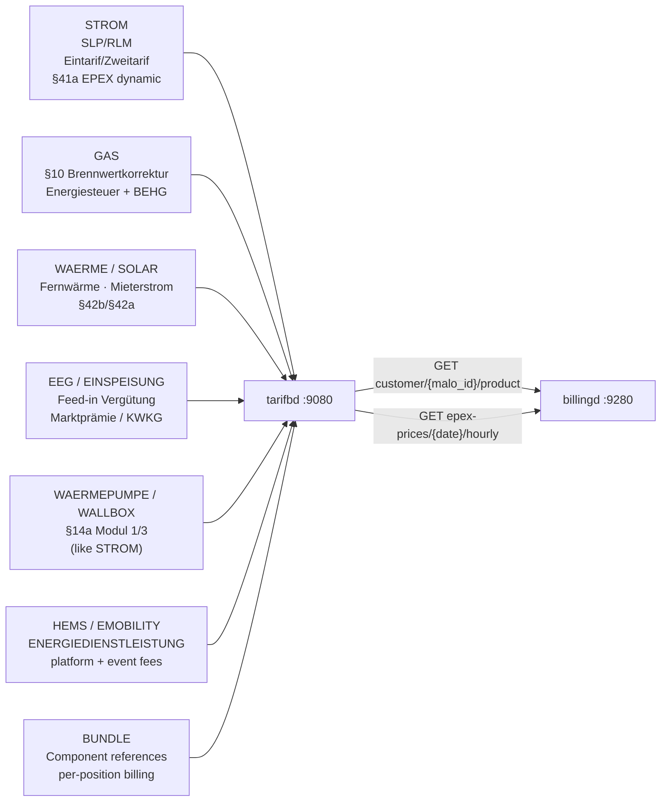

# `tarifbd` — Product & Tariff Catalog

`tarifbd` is the single source of truth for **everything the LF sells** to end customers.
`billingd` and the customer portal query it exclusively for pricing — `marktd` is never used
for retail product pricing.

Port: **`:9080`**

---

## Why a separate catalog?

`marktd` is a B2B MaKo grid communication data hub. Retail tariffs evolve weekly; grid
data is annual (BDEW format versions). Mixing them violates the single-responsibility
principle and makes §20 EnWG audits harder.

`tarifbd` mirrors the product catalog pattern of every mature energy billing platform
(SAP IS-U FI-CA, powercloud, Wilken ENER:GY): a separate service, its own lifecycle,
queried only by billing engines and portals.

---

## Product categories



---

## Endpoints

| Method | Path | Description |
|--------|------|-------------|
| `PUT` | `/api/v1/products/{lf_mp_id}/{product_code}` | Upsert product; archives previous version |
| `GET` | `/api/v1/products/{lf_mp_id}/{product_code}` | Fetch latest product |
| `GET` | `/api/v1/products/{lf_mp_id}` | List products (`?category=&sparte=&kundentyp=`) |
| `GET` | `/api/v1/products/{lf_mp_id}/{product_code}/history` | Immutable version audit log |
| `GET/PUT` | `/api/v1/customer/{malo_id}/product` | Active product for a MaLo / Tarifwechsel |
| `PUT` | `/api/v1/epex-prices/{date}` | Import EPEX day-ahead prices (24-entry array) |
| `GET` | `/api/v1/epex-prices/{date}/hourly` | 24-hour ct/kWh array |
| `GET` | `/api/v1/epex-prices/{year}/{month}/average` | Monthly average — used by `einsd` Direktvermarktung |
| `GET` | `/health` | Liveness |
| `GET` | `/health/ready` | Readiness |

---

## Registering a product

```http
PUT /api/v1/products/9910000000002/STROM-H0-2026
Content-Type: application/json

{
  "category": "STROM",
  "name": "Strom Zuhause Classic",
  "sparte": "STROM",
  "register_count": "Eintarif",
  "kundentyp": "Haushalt",
  "valid_from": "2026-01-01",
  "data": {
    "_typ": "TARIFPREISBLATT",
    "bezeichnung": "Strom Zuhause Classic 2026",
    "gueltigkeit": { "startdatum": "2026-01-01" },
    "tarifpreispositionen": [
      { "leistungstyp": "GRUNDPREIS",   "preisstaffeln": [{ "preis": "0.20" }] },
      { "leistungstyp": "ARBEITSPREIS", "preisstaffeln": [{ "preis": "0.32" }] }
    ]
  }
}
```

`billingd` extracts `grundpreis_ct_per_day` (20 ct/day) and `arbeitspreis_ct_per_kwh`
(32 ct/kWh) by traversing `data.tarifpreispositionen` keyed on `leistungstyp`.

---

## Assigning a product to a MaLo (Tarifwechsel)

```http
PUT /api/v1/customer/51238696781/product
Content-Type: application/json

{ "product_code": "STROM-H0-2026", "assigned_from": "2026-07-01" }
```

The previous assignment is automatically closed (`assigned_to = 2026-07-01`).
`GET /api/v1/customer/{malo_id}/product` returns the active product with the full
`data` JSONB — `billingd` calls this at the start of every billing run.

---

## §41a EPEX Spot feed

Import the ENTSO-E day-ahead prices daily (D-1):

```bash
# Import 2026-07-15 prices from netztransparenz.de / ENTSO-E
curl -s -X PUT "http://tarifbd:9080/api/v1/epex-prices/2026-07-15" \
  -H "Content-Type: application/json" \
  -d '{
    "prices": [6.2, 5.8, 5.5, 5.3, 5.1, 5.4, 6.0, 7.2,
               9.1, 10.5, 11.2, 11.8, 12.1, 11.9, 11.5, 10.8,
               11.2, 12.5, 13.1, 12.8, 10.2, 8.5, 7.1, 6.5],
    "source": "entsoe-transparency"
  }'
```

For `billingd` dynamic billing: `GET /api/v1/epex-prices/2026-07-15/hourly` returns
the 24-hour array for 15-min Lastgang × EPEX multiplication (§41a pipeline).

For `einsd` Direktvermarktung: `GET /api/v1/epex-prices/2026/7/average` returns the
monthly average used in `max(0, AW − EPEX)`.

---

## Database schema

### `products`

| Column | Type | Notes |
|--------|------|-------|
| `id` | UUID | Primary key |
| `lf_mp_id` | TEXT | Operator BDEW-Codenummer |
| `product_code` | TEXT | Operator-assigned product identifier |
| `category` | TEXT | `STROM`/`GAS`/`WAERME`/`SOLAR`/`EEG`/`EINSPEISUNG`/`WAERMEPUMPE`/`WALLBOX`/`HEMS`/`EMOBILITY`/`ENERGIEDIENSTLEISTUNG`/`BUNDLE` |
| `name` | TEXT | Human-readable name |
| `sparte` | TEXT | `STROM` / `GAS` / `WAERME` / NULL |
| `register_count` | TEXT | `Eintarif` / `Zweitarif` / `Mehrtarif` |
| `kundentyp` | TEXT | `Haushalt` / `Gewerbe` / `Waermepumpe` / `Ladesaeule` |
| `dyn_source` | TEXT | `"epex-spot-day-ahead"` for §41a; NULL for fixed |
| `valid_from` | DATE | Tariff validity start |
| `valid_to` | DATE | Tariff validity end |
| `data` | JSONB | `Tarifpreisblatt` / `Preisblatt` BO4E payload |

### `customer_products`

Temporal assignment: one row per `(malo_id, lf_mp_id, assigned_from)`.
`assigned_to IS NULL` = currently active. Tarifwechsel closes the old row and inserts a new one.

### `epex_prices`

One row per `(price_date, hour)`. 24-entry array per day. Indexed on `price_date DESC`.

---

## Configuration

```toml
# tarifbd.toml
database_url = "postgresql://tarifbd:secret@db:5432/tarifbd"
port         = 9080
tenant       = "9910000000002"   # operator LF BDEW-Codenummer
```
