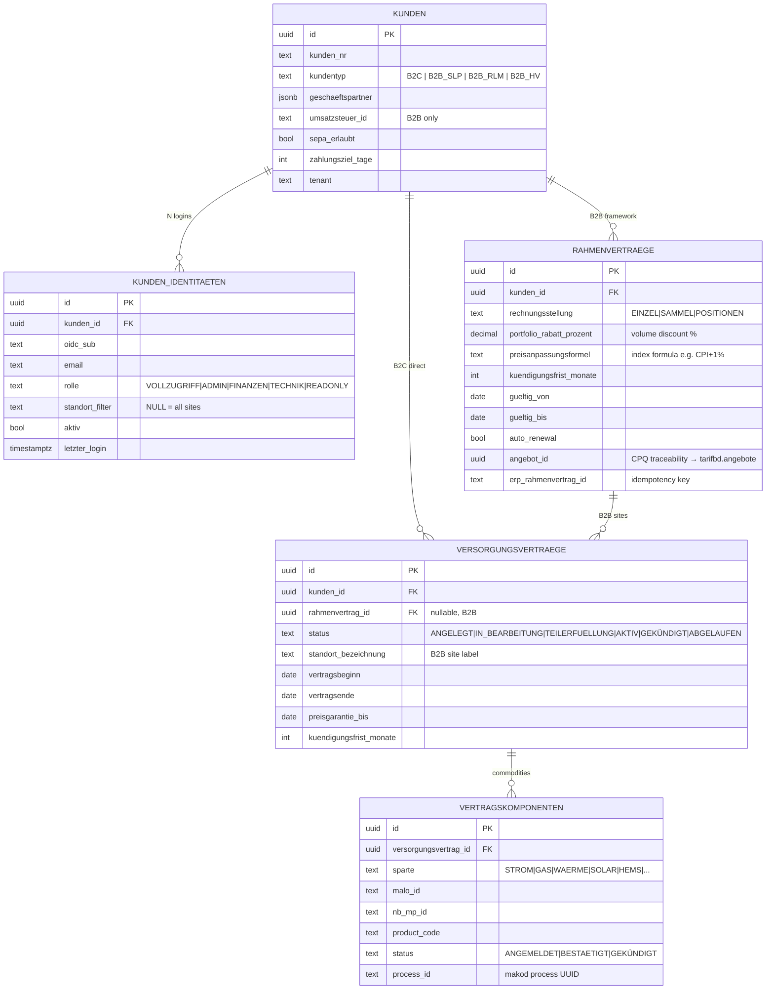
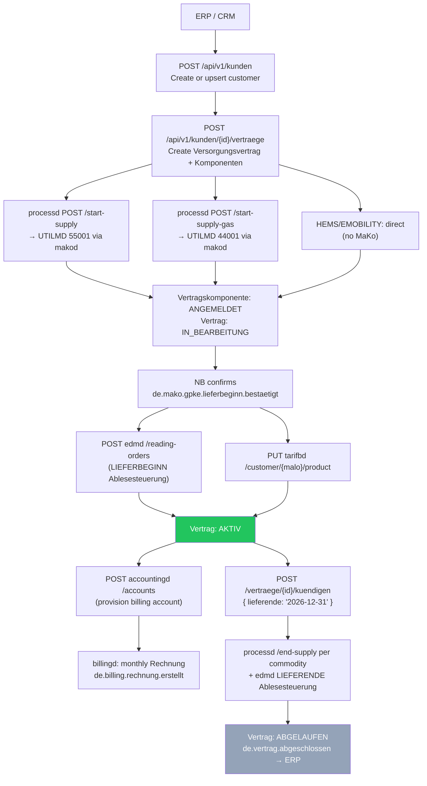
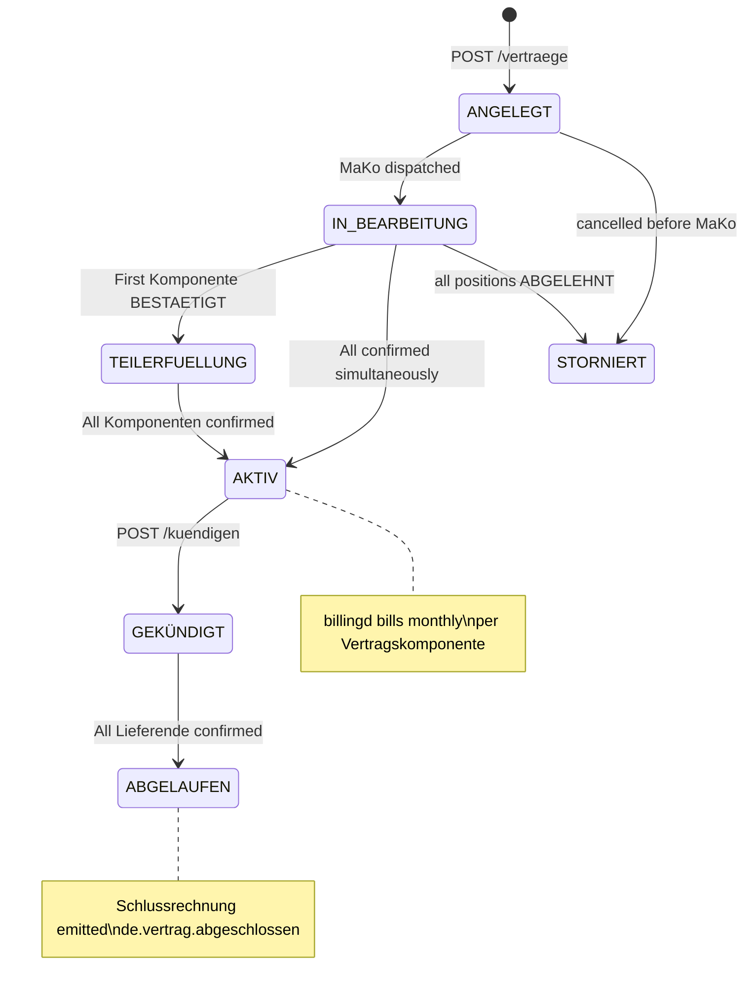
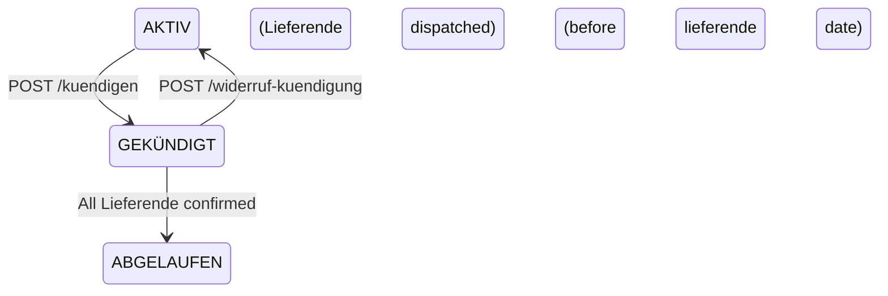

# `vertragd` — Contract & Customer Management

`vertragd` is the **customer registry and retail contract lifecycle engine** for both
B2C (private households) and B2B (commercial, RLM) customers. It owns the complete
chain from customer identity to supply contract to billing account provisioning —
and serves as the single authorization gateway between OIDC identities and MaLo IDs.

Port: **`:9780`** · PostgreSQL · OIDC/JWT + API-key auth

---

## Core responsibilities

| Responsibility | Description |
|---|---|
| **Customer registry** | `Kunden` (B2C persons + B2B companies); `Geschaeftspartner` typed with schema validation |
| **B2B portal access** | `kunden_identitaeten` — N OIDC logins per company; role-based + site-scoped |
| **Framework contracts** | `Rahmenverträge` for B2B — portfolio pricing, indexation, Sammelrechnung |
| **Supply contracts** | `Versorgungsverträge` per site/commodity with status lifecycle |
| **MaKo triggering** | `POST processd /start-supply` per commodity on contract creation |
| **Tarifwechsel** | Changes product code without new UTILMD — §41 EnWG notification boundary; **Preisgarantie guard** blocks changes within a price-lock window |
| **Kündigung** | Coordinated Lieferende + Schlussablesung across all commodities |
| **portald auth** | `GET /kunden/authenticate?malo_id=` — OIDC sub → MaLo ownership check |
| **Billing provisioning** | Auto-provisions `tarifbd` product + `accountingd` account on NB confirmation |
| **Preisgarantie** | Typed BO4E `Preisgarantie` COM — `PUT/GET /api/v1/vertraege/{id}/preisgarantie`; blocks `tarifwechsel` within the guarantee window |
| **Person (B2C)** | `PUT/GET /api/v1/kunden/{id}/person` — `rubo4e::current::Person` BO (GDPR Art. 15) |

---

## Data model



---

## B2C vs B2B model

### B2C (private household)

One customer → one `Versorgungsvertrag` → N `Vertragskomponenten` (STROM, GAS, HEMS, …).
Typically one `KundenIdentitaet` (the customer's own OIDC login).

### B2B (commercial / RLM)

One `Kunde` (the legal entity) → one `Rahmenvertrag` → N `Versorgungsverträge` (one per site).
Multiple employees each have their own `KundenIdentitaet` with role-based access:

```
Unternehmen GmbH (Kunde)
  │
  ├── KundenIdentitaet: CEO         (rolle=ADMIN,    standort_filter=NULL → all sites)
  ├── KundenIdentitaet: Accountant  (rolle=FINANZEN, standort_filter=NULL → invoices only)
  ├── KundenIdentitaet: Site Mgr 1  (rolle=TECHNIK,  standort_filter="Werk Nord")
  └── KundenIdentitaet: Site Mgr 2  (rolle=TECHNIK,  standort_filter="Büro Hamburg")
  │
  └── Rahmenvertrag (portfolio discount 5%, SAMMEL billing, 3-month notice)
       ├── Versorgungsvertrag "Werk Nord"    → STROM 55001, GAS 44001
       └── Versorgungsvertrag "Büro Hamburg" → STROM 55001
```

---

## Supply contract lifecycle



---

## Vertrag status machine



---

## Portal authorization (OIDC → MaLo)

`vertragd` is the **sole authorization gateway** between OIDC identities and energy data.
`portald`, `billingd`, and `accountingd` never decode JWTs independently.

```
1.  Customer logs in → portald receives JWT
2.  portald: GET vertragd /api/v1/kunden/by-sub/{sub}
    → { kunde, identity: { rolle, standort_filter }, active_malo_ids: [...] }
3.  portald scopes all requests to returned malo_ids

Per-request check (for sensitive data):
    GET vertragd /api/v1/kunden/authenticate?malo_id=51238696781
    → 200 OK   (sub owns this MaLo within standort_filter scope)
    → 403      (no matching active KundenIdentitaet or site out of scope)
```

| `rolle` | Portal access |
|---|---|
| `VOLLZUGRIFF` | Full read/write to all portal features |
| `ADMIN` | All data + identity management (add/remove portal users) |
| `FINANZEN` | Invoices, account balance, SEPA mandates only |
| `TECHNIK` | Lastgang, meter readings, device status — no billing data |
| `READONLY` | Read-only view within standort scope |

---

## Tarifwechsel

Changes the product/pricing of an existing `Vertragskomponente` without triggering a
new UTILMD Lieferbeginn. The MaKo supply relationship stays intact.

```http
POST /api/v1/vertraege/{id}/tarifwechsel
Content-Type: application/json

{
  "komp_id":          "...",
  "new_product_code": "STROM-PREMIUM-2027",
  "wirksamkeit":      "2027-01-01"
}
```

`vertragd` responds by updating `vertragskomponenten.product_code` and calling
`PUT tarifbd /customer/{malo_id}/product`. It then emits `de.vertrag.tarifwechsel`
for ERP-side customer notification (§41 Abs. 3 EnWG: ≥ 6 weeks notice required before
price increases).

### Preisgarantie guard

If the contract has an active price guarantee (`preisgarantie_bis ≥ today`), the
`tarifwechsel` endpoint **rejects requests whose `wirksamkeit` falls within the guarantee
window** with `HTTP 422` and a structured error body:

```json
{
  "error": "Tarifwechsel blocked by Preisgarantie",
  "preisgarantie_bis": "2027-06-30",
  "wirksamkeit": "2027-01-01",
  "hint": "Set override_preisgarantie=true to bypass (operator use only)"
}
```

Operators can bypass with `"override_preisgarantie": true` — use only with documented
customer consent (contractual waiver of price-lock).

The `Preisgarantie` itself is stored as a typed `rubo4e::current::Preisgarantie` BO via:

```http
PUT /api/v1/vertraege/{id}/preisgarantie
Content-Type: application/json

{
  "_typ": "PREISGARANTIE",
  "preisgarantietyp": "ALLE_PREISBESTANDTEILE",
  "zeitlicheGueltigkeit": {
    "_typ": "ZEITRAUM",
    "startdatum": "2025-01-01",
    "enddatum":   "2027-06-30"
  },
  "beschreibung": "3-Jahres-Preisgarantie laut Rahmenvertrag"
}
```

---

## Person sub-object (B2C customers)

B2C customers have an optional `rubo4e::current::Person` sub-object for natural-person
details (GDPR Art. 15 right-to-access and correct Anrede in correspondence):

```http
PUT /api/v1/kunden/{id}/person
Content-Type: application/json

{
  "_typ": "PERSON",
  "vorname":     "Max",
  "nachname":    "Mustermann",
  "geburtstag":  "1985-03-15",
  "anrede":      "HERR",
  "titel":       null
}
```

Returns `HTTP 422` with a precise error if any field violates the BO4E schema.
Returns `HTTP 404` for B2B `Geschaeftspartner` records that have no Person stored.

---

## Zahlungsinformation (IBAN / SEPA)

Payment details are stored as a typed `rubo4e::current::Zahlungsinformation` COM. IBAN is
validated with ISO 13616 mod-97 checksum on every `PUT`.

```http
PUT /api/v1/kunden/{id}/zahlungsinformation
Content-Type: application/json

{
  "_typ": "ZAHLUNGSINFORMATION",
  "iban":           "DE89370400440532013000",
  "bic":            "COBADEFFXXX",
  "kontoinhaber":   "Max Mustermann",
  "sepaReferenz":   "MAKO-2025-001",
  "zahlungsart":    "SEPA_LASTSCHRIFT"
}
```

The stored `zahlungsart` controls `accountingd` SEPA batch generation:
- `SEPA_LASTSCHRIFT` — included in pain.008 direct-debit runs when `sepa_erlaubt = true`
- `UEBERWEISUNG` / `BAR` — invoice-only; excluded from SEPA batches

---

## GDPR compliance

### Art. 15 — Right of access

`GET /api/v1/kunden/{id}/export` returns a complete structured JSON export of all stored PII:
Kunde, Person, Zahlungsinformation, KundenIdentitaeten, Versorgungsverträge, and
Vertragskomponenten. Suitable for the statutory data-subject access request.

### Art. 17 — Right to erasure

`POST /api/v1/kunden/{id}/anonymize` pseudonymizes all PII while retaining contract
records for the 10-year legal retention period (§147 AO):

```http
POST /api/v1/kunden/{id}/anonymize
Content-Type: application/json

{ "requested_by": "operator-1" }
```

**What is anonymized:**
- `kunden.geschaeftspartner` — replaced with an opaque pseudonym token
- `kunden.person` — nulled
- `kunden.zahlungsinformation` — IBAN/BIC replaced with `ANONYMIZED`
- `kunden.umsatzsteuer_id` — nulled
- `kunden_identitaeten.oidc_sub` — replaced with `anon:{uuid}` (portal access revoked)
- `kunden_identitaeten.email` / `display_name` — nulled

**Retention:** Contract history (Versorgungsverträge, Vertragskomponenten, Rechnungen)
is retained unmodified for §147 AO compliance (10-year obligation).

**Audit trail:** Every anonymization is written to the immutable `anonymization_log`
table with `requested_by`, `anonymized_at`, and the list of affected fields.
Required by GDPR Art. 5(2) accountability principle.

The operation is **irreversible**. Returns `HTTP 200` on success, `HTTP 404` when the
customer does not exist.

---

---

## Kündigung Widerruf

When a Kündigung was dispatched but the customer changes their mind before `lieferende`,
operators can revoke it via `POST /api/v1/vertraege/{id}/widerruf-kuendigung`:

- Contract reverts from `GEKÜNDIGT` → `AKTIV`
- BEENDET components revert to `AKTIV`
- Emits `de.vertrag.kuendigung_widerrufen` CloudEvent
- **Caller must separately cancel the in-flight Lieferende UTILMD via processd** — `vertragd` does not send a UTILMD cancellation automatically



---

## B2B Cascade Kündigung

`POST /api/v1/rahmenvertraege/{id}/kuendigen` terminates all active Versorgungsverträge
under a Rahmenvertrag in one operation:

- Each child contract's `kuendigungsfrist_monate` is respected individually
- Contracts that fail the notice-period check are **skipped** (returned in `skipped_details`)
- Returns a summary: `{ dispatched, skipped, skipped_details }`

This is the standard path for B2B portfolio termination — faster than calling
`/kuendigen` per site for large C&I customers with 10–100 delivery points.

---

## Background workers

| Worker | Schedule | Emit | Regulatory basis |
|---|---|---|---|
| Tarifwechsel apply | Daily | `de.vertrag.tarifwechsel` | §41 Abs. 3 EnWG |
| Preisanpassungsbenachrichtigung | Daily (42-day window) | `de.vertrag.preisaenderung.ankuendigung` | §41 Abs. 3 EnWG ≥ 6 weeks notice |
| Auto-renewal | Daily | `de.vertrag.autoerneuerung.ankuendigung` (30 days before) | §13 GasGVV / §14 StromGVV |
| Expiry notification | Daily | `de.vertrag.ablauf.ankuendigung` (30-day lookahead) | §13 GasGVV / §41 EnWG |

All workers run on a **23-hour DST-safe interval** (not 24h) to prevent phase drift.
Initial startup delay staggers workers to avoid DB contention.

---


## REST API

| Method | Path | Description |
|---|---|---|
| `POST` | `/api/v1/kunden` | Create / upsert customer (idempotent on `erp_kunde_id`) |
| `GET` | `/api/v1/kunden` | List customers (`?kundentyp=&limit=`) |
| `GET` | `/api/v1/kunden/{id}` | Customer + active identities + malo_ids |
| `PUT` | `/api/v1/kunden/{id}` | Update customer (name, address, SEPA, …) |
| `GET` | `/api/v1/kunden/by-sub/{sub}` | Resolve OIDC sub → Kunde + scoped malo_ids |
| `GET` | `/api/v1/kunden/authenticate` | `?malo_id=` auth check for portald; 200 / 403 |
| `GET\|PUT` | `/api/v1/kunden/{id}/person` | `rubo4e::current::Person` BO — B2C natural-person details (GDPR Art. 15) |
| `GET\|PUT` | `/api/v1/kunden/{id}/zahlungsinformation` | `rubo4e::current::Zahlungsinformation` COM — IBAN mod-97 validated |
| `GET` | `/api/v1/kunden/{id}/export` | **GDPR Art. 15/20** — full PII export |
| `POST` | `/api/v1/kunden/{id}/anonymize` | **GDPR Art. 17** — right to erasure (irreversible pseudonymization) |
| `POST` | `/api/v1/kunden/{id}/identitaeten` | Add portal user (idempotent on `oidc_sub`) |
| `GET` | `/api/v1/kunden/{id}/identitaeten` | List active portal users |
| `DELETE` | `/api/v1/kunden/{id}/identitaeten/{sub}` | Revoke portal access for a user |
| `GET` | `/api/v1/kunden/{id}/portfolio` | B2B portfolio: all active MaLo/Sparte pairs |
| `POST` | `/api/v1/kunden/{id}/rahmenvertraege` | Create B2B Rahmenvertrag |
| `GET` | `/api/v1/kunden/{id}/rahmenvertraege` | List Rahmenverträge |
| `POST` | `/api/v1/kunden/{id}/vertraege` | Create Versorgungsvertrag (idempotent on `erp_contract_id`) |
| `GET` | `/api/v1/kunden/{id}/vertraege` | List supply contracts for customer |
| `GET` | `/api/v1/vertraege` | All active contracts (`?tenant=&status=`) |
| `GET` | `/api/v1/vertraege/expiring` | Near-expiry contracts (`?days=30`) — §13 GasGVV / §41 EnWG |
| `GET` | `/api/v1/vertraege/{id}` | Contract + Komponenten + status |
| `POST` | `/api/v1/vertraege/{id}/tarifwechsel` | Change product code; blocked within Preisgarantie window |
| `POST` | `/api/v1/vertraege/{id}/stornieren` | Cancel pre-activation contract (`ANGELEGT`/`IN_BEARBEITUNG` only) |
| `POST` | `/api/v1/vertraege/{id}/kuendigen` | Initiate Lieferende for all commodities (§14 StromGVV / §13 GasGVV notice enforced) |
| `POST` | `/api/v1/vertraege/{id}/widerruf-kuendigung` | **Revoke Kündigung** — revert to AKTIV before lieferende; caller must cancel in-flight Lieferende UTILMD via processd |
| `POST` | `/api/v1/rahmenvertraege/{id}/kuendigen` | **Cascade Kündigung** — terminate all child Versorgungsverträge; individual notice periods respected; returns dispatched/skipped summary |
| `GET` | `/api/v1/rahmenvertraege` | List all Rahmenverträge for tenant (`?status=&limit=`) |
| `GET` | `/api/v1/rahmenvertraege/{id}` | Single Rahmenvertrag with all child Versorgungsverträge |
| `GET\|PUT` | `/api/v1/vertraege/{id}/preisgarantie` | Typed `rubo4e::current::Preisgarantie` COM |
| `POST` | `/api/v1/events` | Inbound CloudEvents from `makod` / `processd` |
| `POST` | `/api/v1/webhooks/angebot` | CPQ: `de.angebot.angenommen` → auto-create Rahmenvertrag + Versorgungsverträge from Angebot |
| `GET` | `/health` | Liveness |
| `GET` | `/health/ready` | Readiness |

---

## CloudEvents emitted

All events are delivered as CloudEvents 1.0 JSON to `erp.webhook_url` with an
`X-Mako-Signature: <HMAC-SHA256-hex>` header when `erp.hmac_secret` is configured.

| Event type | When |
|---|---|
| `de.vertrag.aktiv` | All commodity Komponenten confirmed by NB |
| `de.vertrag.teilerfuellung` | First Komponente confirmed, others still pending |
| `de.vertrag.tarifwechsel` | Product change committed (immediate or on `wirksamkeit`) |
| `de.vertrag.tarifwechsel_geplant` | Future Tarifwechsel stored (applied by background worker) |
| `de.vertrag.preisaenderung.ankuendigung` | 42 days before `wirksamkeit` (§41 Abs. 3 EnWG ≥ 6 weeks notice) |
| `de.vertrag.autoerneuerung.ankuendigung` | 30 days before auto-renewal (§13 GasGVV / §14 StromGVV) |
| `de.vertrag.ablauf.ankuendigung` | 30 days before `vertragsende` or `preisgarantie_bis` expiry (§13 GasGVV / §41 EnWG) |
| `de.vertrag.abgeschlossen` | All Lieferende confirmed; Schlussrechnung trigger |
| `de.vertrag.kuendigung_widerrufen` | Kündigung revoked via `POST /widerruf-kuendigung`; contract returned to AKTIV |
| `de.vertrag.position.abgelehnt` | NB rejected a commodity (ERC A02 / A05 / A97) |

---

## Configuration

```toml
# vertragd.toml
database_url  = "postgresql://..."
port          = 9780
tenant        = "9900357000004"   # data-isolation key (operator tenant; value = BDEW-Codenummer in this example)
lf_mp_id      = "9900357000004"

max_identitaeten_per_kunde = 50   # default; prevents resource exhaustion from unbounded identity creation

processd_url    = "http://processd:8580"
tarifbd_url     = "http://tarifbd:9080"
accountingd_url = "http://accountingd:9380"
edmd_url        = "http://edmd:8380"

# OIDC/JWT — required in production; omit for dev mode (all write endpoints open)
[oidc]
issuer   = "https://auth.example.com"
audience = "vertragd"

[erp]
webhook_url   = "http://erp:8000/events"   # optional; CloudEvents 1.0 + HMAC-SHA256
hmac_secret   = "${ERP_HMAC_SECRET}"       # env-var interpolation; omit = header not sent

mako_timeout_werktage = 10   # operator escalation after N Werktage without NB response
```

---

## MCP tools

`vertragd` ships a built-in MCP server at `/mcp` (Streamable HTTP 2025-11-25) with
**16 read-only tools** and **4 prompts**.

| Tool | Annotations | Description |
|---|---|---|
| `get_vertrag_status` | `read_only` | Full contract + Komponenten + pending MaKo process IDs |
| `list_offene_vertraege` | `read_only` | All AKTIV/IN_BEARBEITUNG/TEILERFUELLUNG/GEKÜNDIGT (`limit` param) |
| `get_kunde` | `read_only` | Customer profile by UUID (Geschaeftspartner, malo_ids, identities) |
| `get_kunde_by_sub` | `read_only` | OIDC sub → Kunde + scoped MaLo IDs (portald auth path) |
| `get_rahmenvertrag` | `read_only` | B2B framework contract with all child Versorgungsverträge |
| `list_expiring_contracts` | `read_only` | Near-expiry by `vertragsende` or `preisgarantie_bis` (`days` param, default 30) |
| `list_pending_tarifwechsel` | `read_only` | Upcoming Tarifwechsel + `preisanpassung_notif_sent` flag (§41 Abs. 3 EnWG) |
| `list_pending_kuendigungen` | `read_only` | GEKÜNDIGT contracts with future lieferende — prep Schlussrechnung |
| `check_preisgarantie` | `read_only` | Is a Tarifwechsel blocked for this contract on a given `wirksamkeit`? BLOCKED/ALLOWED + `preisgarantie_bis` |
| `check_mako_trigger_status` | `read_only` | Did Lieferbeginn UTILMD fire? Component breakdown by status; stuck detection |
| `find_stuck_workflows` | `read_only` | ANGEMELDET > N Werktage — requires operator escalation (§20 EnWG) |
| `get_customer_portfolio` | `read_only` | B2B portfolio: all active MaLo/Sparte for one Kunde |
| `get_zahlungsinformation` | `read_only` | SEPA/IBAN payment details for `accountingd` reconciliation |
| `list_auto_renewal_due` | `read_only` | Contracts eligible for auto-renewal within N days (§13 GasGVV / §14 StromGVV) |
| `list_alle_kunden` | `read_only` | All Kunden for CRM/ERP sync (`kundentyp` filter, max 500) |
| `compute_kuendigungsfrist` | `read_only` | Earliest valid Kündigung date (§14 StromGVV / §13 GasGVV) |

**Prompts:**
- `o2c_review` — full Order-to-Cash pipeline review: stuck contracts, expiring prices, pending Tarifwechsel
- `b2b_onboarding` — step-by-step Rahmenvertrag + N Versorgungsverträge onboarding guide
- `gdpr_erasure_workflow` — GDPR Art. 17 right-to-erasure: verify, anonymize PII, document audit trail (§147 AO retention)
- `preisgarantie_dispute` — §41 EnWG Preisgarantie conflict: wait vs. operator override with customer consent
