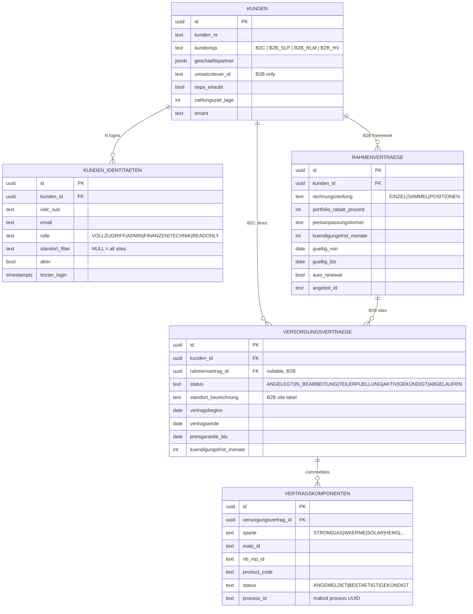
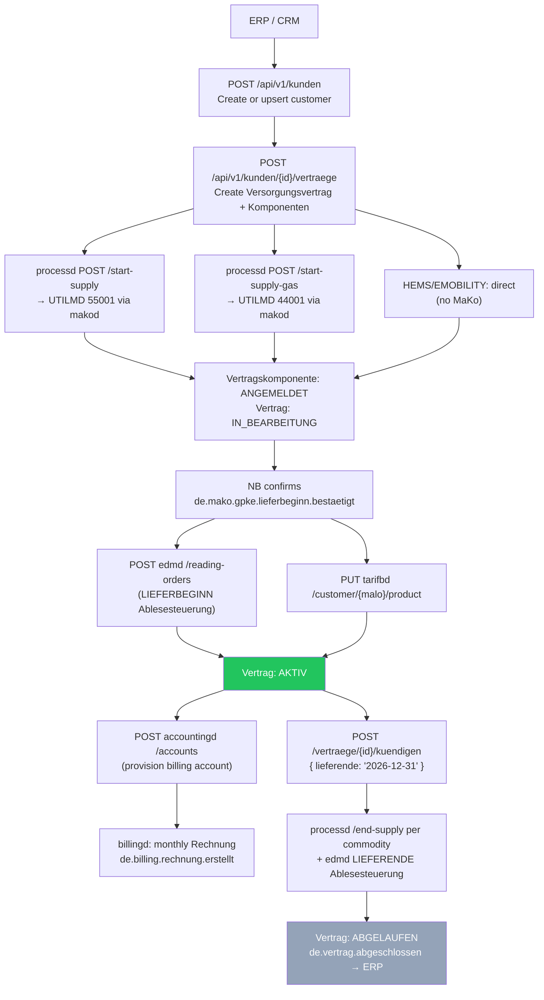
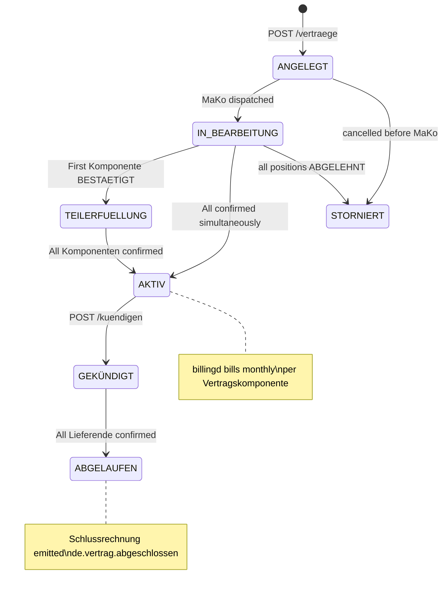

# `vertragd` — Contract & Customer Management

`vertragd` is the **customer registry and retail contract lifecycle engine** for both
B2C (private households) and B2B (commercial, RLM) customers. It owns the complete
chain from customer identity to supply contract to billing account provisioning —
and serves as the single authorization gateway between OIDC identities and MaLo IDs.

Port: **`:9780`** · PostgreSQL · OIDC/JWT + API-key auth

---

## Core responsibilities

| Responsibility | Description |
|---|---|
| **Customer registry** | `Kunden` (B2C persons + B2B companies); `Geschaeftspartner` typed with schema validation |
| **B2B portal access** | `kunden_identitaeten` — N OIDC logins per company; role-based + site-scoped |
| **Framework contracts** | `Rahmenverträge` for B2B — portfolio pricing, indexation, Sammelrechnung |
| **Supply contracts** | `Versorgungsverträge` per site/commodity with status lifecycle |
| **MaKo triggering** | `POST processd /start-supply` per commodity on contract creation |
| **Tarifwechsel** | Changes product code without new UTILMD — §41 EnWG notification boundary; **Preisgarantie guard** blocks changes within a price-lock window |
| **Kündigung** | Coordinated Lieferende + Schlussablesung across all commodities |
| **portald auth** | `GET /kunden/authenticate?malo_id=` — OIDC sub → MaLo ownership check |
| **Billing provisioning** | Auto-provisions `tarifbd` product + `accountingd` account on NB confirmation |
| **Preisgarantie** | Typed BO4E `Preisgarantie` COM — `PUT/GET /api/v1/vertraege/{id}/preisgarantie`; blocks `tarifwechsel` within the guarantee window |
| **Person (B2C)** | `PUT/GET /api/v1/kunden/{id}/person` — `rubo4e::current::Person` BO (GDPR Art. 15) |

---

## Data model



---

## B2C vs B2B model

### B2C (private household)

One customer → one `Versorgungsvertrag` → N `Vertragskomponenten` (STROM, GAS, HEMS, …).
Typically one `KundenIdentitaet` (the customer's own OIDC login).

### B2B (commercial / RLM)

One `Kunde` (the legal entity) → one `Rahmenvertrag` → N `Versorgungsverträge` (one per site).
Multiple employees each have their own `KundenIdentitaet` with role-based access:

```
Unternehmen GmbH (Kunde)
  │
  ├── KundenIdentitaet: CEO         (rolle=ADMIN,    standort_filter=NULL → all sites)
  ├── KundenIdentitaet: Accountant  (rolle=FINANZEN, standort_filter=NULL → invoices only)
  ├── KundenIdentitaet: Site Mgr 1  (rolle=TECHNIK,  standort_filter="Werk Nord")
  └── KundenIdentitaet: Site Mgr 2  (rolle=TECHNIK,  standort_filter="Büro Hamburg")
  │
  └── Rahmenvertrag (portfolio discount 5%, SAMMEL billing, 3-month notice)
       ├── Versorgungsvertrag "Werk Nord"    → STROM 55001, GAS 44001
       └── Versorgungsvertrag "Büro Hamburg" → STROM 55001
```

---

## Supply contract lifecycle



---

## Vertrag status machine



---

## Portal authorization (OIDC → MaLo)

`vertragd` is the **sole authorization gateway** between OIDC identities and energy data.
`portald`, `billingd`, and `accountingd` never decode JWTs independently.

```
1.  Customer logs in → portald receives JWT
2.  portald: GET vertragd /api/v1/kunden/by-sub/{sub}
    → { kunde, identity: { rolle, standort_filter }, active_malo_ids: [...] }
3.  portald scopes all requests to returned malo_ids

Per-request check (for sensitive data):
    GET vertragd /api/v1/kunden/authenticate?malo_id=51238696781
    → 200 OK   (sub owns this MaLo within standort_filter scope)
    → 403      (no matching active KundenIdentitaet or site out of scope)
```

| `rolle` | Portal access |
|---|---|
| `VOLLZUGRIFF` | Full read/write to all portal features |
| `ADMIN` | All data + identity management (add/remove portal users) |
| `FINANZEN` | Invoices, account balance, SEPA mandates only |
| `TECHNIK` | Lastgang, meter readings, device status — no billing data |
| `READONLY` | Read-only view within standort scope |

---

## Tarifwechsel

Changes the product/pricing of an existing `Vertragskomponente` without triggering a
new UTILMD Lieferbeginn. The MaKo supply relationship stays intact.

```http
POST /api/v1/vertraege/{id}/tarifwechsel
Content-Type: application/json

{
  "komp_id":          "...",
  "new_product_code": "STROM-PREMIUM-2027",
  "wirksamkeit":      "2027-01-01"
}
```

`vertragd` responds by updating `vertragskomponenten.product_code` and calling
`PUT tarifbd /customer/{malo_id}/product`. It then emits `de.vertrag.tarifwechsel`
for ERP-side customer notification (§41 Abs. 3 EnWG: ≥ 6 weeks notice required before
price increases).

### Preisgarantie guard

If the contract has an active price guarantee (`preisgarantie_bis ≥ today`), the
`tarifwechsel` endpoint **rejects requests whose `wirksamkeit` falls within the guarantee
window** with `HTTP 422` and a structured error body:

```json
{
  "error": "Tarifwechsel blocked by Preisgarantie",
  "preisgarantie_bis": "2027-06-30",
  "wirksamkeit": "2027-01-01",
  "hint": "Set override_preisgarantie=true to bypass (operator use only)"
}
```

Operators can bypass with `"override_preisgarantie": true` — use only with documented
customer consent (contractual waiver of price-lock).

The `Preisgarantie` itself is stored as a typed `rubo4e::current::Preisgarantie` BO via:

```http
PUT /api/v1/vertraege/{id}/preisgarantie
Content-Type: application/json

{
  "_typ": "PREISGARANTIE",
  "preisgarantietyp": "ALLE_PREISBESTANDTEILE",
  "zeitlicheGueltigkeit": {
    "_typ": "ZEITRAUM",
    "startdatum": "2025-01-01",
    "enddatum":   "2027-06-30"
  },
  "beschreibung": "3-Jahres-Preisgarantie laut Rahmenvertrag"
}
```

---

## Person sub-object (B2C customers)

B2C customers have an optional `rubo4e::current::Person` sub-object for natural-person
details (GDPR Art. 15 right-to-access and correct Anrede in correspondence):

```http
PUT /api/v1/kunden/{id}/person
Content-Type: application/json

{
  "_typ": "PERSON",
  "vorname":     "Max",
  "nachname":    "Mustermann",
  "geburtstag":  "1985-03-15",
  "anrede":      "HERR",
  "titel":       null
}
```

Returns `HTTP 422` with a precise error if any field violates the BO4E schema.
Returns `HTTP 404` for B2B `Geschaeftspartner` records that have no Person stored.

---

## REST API

| Method | Path | Description |
|---|---|---|
| `POST` | `/api/v1/kunden` | Create / upsert customer |
| `GET` | `/api/v1/kunden` | List customers (`?tenant=&limit=`) |
| `GET` | `/api/v1/kunden/{id}` | Customer + active identities + malo_ids |
| `PUT` | `/api/v1/kunden/{id}` | Update customer (name, address, SEPA, …) |
| `GET` | `/api/v1/kunden/by-sub/{sub}` | Resolve OIDC sub → Kunde + scoped malo_ids |
| `GET` | `/api/v1/kunden/authenticate` | `?malo_id=` auth check; 200 / 403 |
| `POST` | `/api/v1/kunden/{id}/identitaeten` | Add portal user (idempotent on `oidc_sub`) |
| `GET` | `/api/v1/kunden/{id}/identitaeten` | List active portal users |
| `POST` | `/api/v1/kunden/{id}/rahmenvertraege` | Create B2B Rahmenvertrag |
| `GET` | `/api/v1/kunden/{id}/rahmenvertraege` | List Rahmenverträge |
| `POST` | `/api/v1/kunden/{id}/vertraege` | Create Versorgungsvertrag |
| `GET` | `/api/v1/kunden/{id}/vertraege` | List supply contracts for customer |
| `GET` | `/api/v1/vertraege` | All active contracts (`?tenant=&status=`) |
| `GET` | `/api/v1/vertraege/{id}` | Contract + Komponenten + status |
| `POST` | `/api/v1/vertraege/{id}/tarifwechsel` | Change product code (no new UTILMD); blocked within Preisgarantie window |
| `POST` | `/api/v1/vertraege/{id}/kuendigen` | Initiate Lieferende for all commodities |
| `GET\|PUT` | `/api/v1/vertraege/{id}/preisgarantie` | Typed `rubo4e::current::Preisgarantie` COM |
| `GET\|PUT` | `/api/v1/kunden/{id}/person` | `rubo4e::current::Person` BO for B2C customers (GDPR Art. 15) |
| `POST` | `/api/v1/events` | Inbound CloudEvents from `makod` / `processd` |
| `GET` | `/health` | Liveness |
| `GET` | `/health/ready` | Readiness |

---

## CloudEvents emitted

| Event type | When |
|---|---|
| `de.vertrag.aktiv` | All commodity Komponenten confirmed by NB |
| `de.vertrag.tarifwechsel` | Product change committed |
| `de.vertrag.tarifwechsel_geplant` | Future Tarifwechsel stored (applied by background worker on `wirksamkeit`) |
| `de.vertrag.preisaenderung.ankuendigung` | Emitted 42 days before `wirksamkeit` (§41 Abs. 3 EnWG ≥ 6 weeks notice) |
| `de.vertrag.preisgarantie.updated` | Preisgarantie COM stored or replaced |
| `de.vertrag.abgeschlossen` | All Lieferende confirmed; Schlussrechnung trigger |
| `de.vertrag.position.abgelehnt` | NB rejected a commodity (ERC A02 / A05 / A97) |

---

## Configuration

```toml
# vertragd.toml
database_url  = "postgresql://..."
port          = 9780
tenant        = "9900357000004"   # data-isolation key (operator tenant; value = BDEW-Codenummer in this example)
lf_mp_id      = "9900357000004"

processd_url    = "http://processd:8580"
tarifbd_url     = "http://tarifbd:9080"
accountingd_url = "http://accountingd:9380"
edmd_url        = "http://edmd:8380"

[erp]
webhook_url   = "http://erp:8000/events"   # optional
hmac_secret   = "${ERP_HMAC_SECRET}"       # env-var interpolation

mako_timeout_werktage = 10   # operator escalation after N Werktage without NB response
```

---

## MCP tools

`vertragd` ships a built-in MCP server at `/mcp` (Streamable HTTP 2025-11-05):

| Tool | Description |
|---|---|
| `get_vertrag` | Get contract status, Komponenten, and pending MaKo process IDs |
| `list_active_vertraege` | List AKTIV contracts, filterable by MaLo, customer, product |
| `get_kunde` | Customer profile + identity list + active MaLo IDs |
| `get_identitaeten` | List portal users for a Kunde with roles and site scopes |

**Prompt:** `contract-review` — guided analysis of stuck contracts with NB ERC escalation advice.
