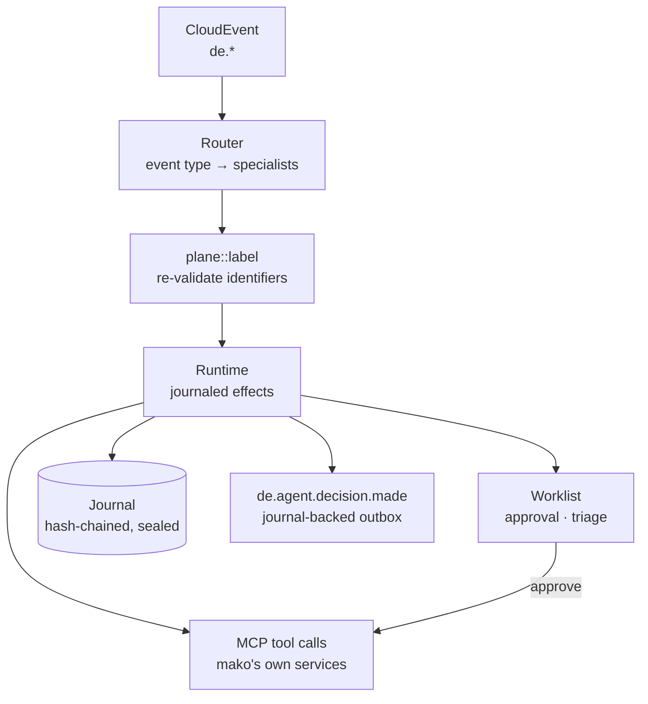

# agentd — the multi-agent plane

`agentd` (`:9580`) connects large language models to mako's production services
over MCP: automated analysis, compliance checking and deadline triage, with
every model call and tool call written down **before** it happens.

Each specialist is a declarative manifest run by
[agentplane](https://github.com/hupe1980/agentplane), a journal-first durable
agent runtime. A run survives a crash, replays for audit, and stops for a named
human before it changes anything.

| | |
|---|---|
| **HTTP port** | `:9580` |
| **Specialists** | 28 manifests in [`agents/`](agents/) — 26 `tool-calling`, 1 `planned`, 1 model-free coded skill |
| **Runtime** | agentplane — journaled effects, strict replay, Cedar gate, sealed at rest |
| **Model providers** | Anthropic · OpenAI · Gemini · any OpenAI-compatible endpoint (TGI, vLLM, Ollama, llama.cpp) · AWS Bedrock behind `--features bedrock` |
| **Tool transport** | one MCP client per `[mcp_servers]` entry, routed by the server component of each `tool://` grant |
| **Journal** | redb *or* Postgres — the § 147 AO / GoBD record, sealed by a Vault-held key, signed under the workload identity |
| **Witnessing** | checkpoints cosigned over C2SP `tlog-witness` — the one control that is not a check on ourselves |
| **Case layer** | every run joins a case keyed on its MaLo/MeLo/process — the unit of approval, obligation and **erasure** |
| **Oversight** | `/api/v1/oversight/*` — worklist, run views, case history, four-eyes decisions |
| **Role scoping** | `role-lf` · `role-nb` · `role-msb` — a role build contains no other arm's specialists (§ 9 EnWG) |

## How a run happens



Routing is the one thing agentplane has no notion of, so it stays in Rust
([`src/builtin/mod.rs`](src/builtin/mod.rs)) — a subscription table and nothing
else. Everything after admission is the runtime's: the turn loop, the journal,
the policy gate, the case layer.

## The manifest is the agent

`agents/<name>.yaml` declares the procedure, the model, every tool the agent may
call, the ceilings it runs under and the schema its result must satisfy. It is
digest-covered: editing a procedure changes the digest, which is a version bump
a reviewer sees in a diff. There are consequently **no per-agent config
overrides** — moving a regulated decision onto a different model is a manifest
edit, on the reviewable path.

Every file opens with a schema modeline:

```yaml
# yaml-language-server: $schema=https://hupe1980.github.io/agentplane/agent.schema.json
```

agentplane publishes the manifest format as a draft-07 JSON Schema generated
from the types its parser deserializes into, so an editor gives autocomplete,
hover documentation and inline unknown-field errors while a manifest is being
written. The parser stays authoritative — its semantic refusals (an unstated
budget, a declared control nothing performs) run only there — and a test reads
the URL off `Manifest::json_schema()` so no file can point at a document that
has moved.

Two properties decide how a specialist can be built:

- **The payload is not trusted because mako emitted it.** A CloudEvent field is
  promoted to `trusted` only if [`plane::label`](src/plane/label.rs)
  re-validates it against the format that identifier is defined to have — MaLo
  11 digits, MP-ID 13, PID 5. Everything else stays untrusted and carries the
  event it arrived on as its source. An 11-digit MaLo has no room for an
  instruction; that is what makes the promotion honest.
- **Authority-bearing arguments are bound to trusted sources.**
  `protected_fields` marks `/malo_id`, `/pid` and `/mp_id` as `require_trusted`,
  so a value derived from counterparty free text cannot reach `submit_command`.

## Three execution shapes

| | `tool-calling` (26) | `planned` (1) | coded skill (1) |
|---|---|---|---|
| Control flow | the model chooses each next call | fixed before untrusted input is read | Rust |
| Input | whole payload, per-field labels | only re-validated identifiers | whole payload, per-field labels |
| May dispatch a mutating tool | **no** | yes, after human approval | no grant declared |
| Model spend | per event, up to the budget | one privileged call plus parses | none (`models: {}`) |

> A `tool-calling` agent **cannot** dispatch a mutating call. Its arguments come
> out of a model completion, agentplane labels every completion `untrusted` by
> construction, and the taint gate refuses a mutating sink with untrusted
> arguments — even after a human approves. A `planned` agent can, because its
> step arguments are `$input/…` references the runtime resolves itself: they
> arrive carrying the run input's own labels, having never passed through a
> model's context.

So the 26 advisory specialists declare no mutating grant and no `oversight`
block — both absences are the same fact, and `cargo xtask check-tool-grants`
refuses a manifest that claims otherwise. Regaining dispatch means converting a
specialist to `planned`, not adding a grant.

The deterministic boundary is unchanged: **an agent may prepare and may wait,
`makod` still dispatches.** An approved decision becomes an ordinary command
through the command API, so what goes on the wire stays a pure function of a
recorded command.

### The model-free specialist

`deadline-alert-agent` declares `models: {}` — agentplane's spelling of *no
inference, on purpose* — and no `execution` block, so its behaviour is a
registered skill in [`src/skills/`](src/skills/). Its procedure is a subtraction
and three comparisons; in Rust the severity bands are unit tests at every
boundary rather than a threshold a model re-applies each time.

Governance is identical: the tool call is still a journaled effect through the
policy gate, the clock read is still an effect so a replay classifies against
the instant the original run saw, and the manifest still binds the grant, the
ceilings and the egress. Governance was never what a model was buying.

A specialist belongs in `skills/` when its procedure is a total function of what
the tools return. It does not when the task is judgement over open-ended input.

> A model-free agent declares **no** `max_tokens`. A zero ceiling reads as
> parsimony but means "exhausted before the first effect of any kind" — the tool
> call included. `max_steps`, `max_effects` and `max_wallclock_secs` are what
> bind it.

## Every answer is a shape

All 28 specialists declare `output.schema`, and every schema is **closed**
(`additionalProperties: false`). A prose `OUTPUT FORMAT` block inside a prompt
is a contract in the one place nothing can enforce it; as a schema the model is
held to it, the runtime folds it into the effect key — so editing the schema
reports divergence on replay rather than reinterpreting a stored answer — and it
is covered by the manifest digest. Closed, the declared shape is the whole
shape, which is also what keeps a triage rule's `path` total over what the model
can return.

## Two ways a human enters the loop

| | **Approval** — in front of the answer | **Triage** — beside the answer |
|---|---|---|
| Declared as | `approval: tools-only` + `requires_approval` | `approval: none` + `oversight.triage` |
| What waits | the run suspends before the tool call | nothing; the run completes |
| Who is asked | `oversight.approvers` | the rule's `audience` |
| Fires on | reaching a mutating tool | an answer matching a predicate over `output.schema` |
| When nobody answers | `on_expiry: deny` — fails closed, nothing is sent | `on_expiry: escalate` — widens the audience and keeps waiting |
| Used by | `gabi-gas-agent` | 14 specialists, on a terminal finding |

Triage exists because most specialists cannot act, so gating their answer would
gate nothing while suspending a run per finding. A triage rule changes nothing
about the run — same answer, same validation, same memories — and its only
effect is a worklist row.

**That is also why the two expire differently.** An approval gates a real market
message, so a window that closes unanswered must send nothing. A triage row
gates nothing — it *is* the finding — so expiring it deletes the delivery of
something the agent correctly detected. Escalation is the only disposition under
which an unanswered §20 EnWG parity deviation or an out-of-compliance §§41f/41g
sequence stays findable: the `escalate_to` roles **join** the audience (the
original reviewers stay eligible), the stale reservation is cleared, and the row
keeps waiting. A test pins the two dispositions apart.

Eligibility is two layers: Cedar decides who may use the worklist at all, and
the task store narrows per task by `candidate_roles`. The Cedar set admits the
union of every `oversight.approvers` entry, every `triage[].audience` **and
every `escalate_to` role**, and a test parses the manifests and fails when one
names a role the policy does not admit — without it the two drift apart
silently, and a row whose audience is refused at the door is worse than no row.
The escalation audience most needs the check: it arrives hours late, from the
sweeper, and a widening to somebody Cedar refuses looks — from the worklist —
exactly like the row having been answered.

A second test walks `agentplane::api::action::ALL` and fails when any verb the
oversight surface asks about is granted to no role. That is the quietest
authorization failure there is: a permanent `403` on a route, with a policy set
that compiles clean.

Who is acting comes from the OIDC token, never from the request body. Four-eyes
is enforced in the task store. **Without OIDC the surface is not mounted at
all**: every other dev-mode relaxation in mako accepts an unauthenticated
request and warns, but an approval is a signature on a regulated dispatch.

## Knowledge is granted, not copied

mako's MCP servers publish step-by-step prompts for their own procedures.
26 specialists declare `context.prompts` grants against their own service rather
than carrying a hand-typed paraphrase that drifts the first time either side
changes. A context grant is not a tool grant — reading a prompt authorises no
action — but it does cross a trust and data-egress boundary, so it is declared
where a reviewer sees it.

## Memory, scoped to the party the run is about

`memory_formation.subject` is the unit `forget_subject` erases, so its scope is
a GDPR decision. Seven specialists form memories: **five bind
`$correlation/malo`**, so the subject resolves per run to the Marktlokation the
run was correlated on and an Art. 17 erasure destroys exactly one person's pile;
**two carry a literal** because their subject genuinely is the operator itself
(§ 7a Abs. 5 EnWG parity posture, per-PID KPI history).

A lint holds the line — a literal subject is refused unless it is one of those
two operator-wide scopes, and a binding to a correlation namespace the labeller
does not produce is refused too. A binding that cannot resolve **fails the run**
rather than falling back: a memory filed under the wrong scope is worse than no
memory. Formation reads the agent's own answer, which is model output and
therefore untrusted, so every remembering specialist declares a **quarantined**
model to do it.

## Build-time guards

| Guard | Refuses |
|---|---|
| `cargo xtask check-tool-grants` | A grant naming a tool no server declares; a `mutates` flag disagreeing with the server's `read_only_hint`; a mutating grant on a `tool-calling` agent |
| `cargo xtask check-prompt-tools` | A procedure instructing the model to call a tool the manifest never granted |
| `cargo xtask check-wire-timestamps` | A `time` value reaching a JSON wire as its component array |
| `plane::` unit tests | An unsubscribed specialist, an open answer schema, a customer-pooling memory subject, a terminal finding no triage rule reports, a role the policy set does not admit, an oversight verb the policy set grants to nobody, a triage row that expires instead of escalating, a manifest on disk that nobody embedded, a manifest with no schema modeline |

The prompt guard is the least obvious. agentplane reports an unknown tool name
back to the model as a failed call rather than ending the run, so a procedure
naming an ungranted tool does not crash — the model asks, is refused,
improvises, and the step silently does not happen.

## Tests

Eight suites run on real stores with `FakeProvider`, so the agent layer is tested
the way the engine workflows are — deterministically, and for free.

| Suite | What it pins |
|---|---|
| `plane_golden_run.rs` | The golden run and its **strict replay**, asserted with `assert_replay_was_not_backstopped()`; that the model is asked with the manifest's own procedure; where a step input lands; that a key ring seals personal data |
| `oversight.rs` | Plan → suspend → approve → dispatch, end to end: the call lands **exactly once, after** the decision; a rejection stops it; an ineligible actor cannot decide |
| `regulatory.rs` | Provenance refusal (a counterparty-shaped MaLo never reaches `submit_command`, even after approval) and in-doubt discipline (a `TimedOut` mutating call is attempted exactly once) |
| `durability.rs` | A journal append that commits while the caller sees an error duplicates no effect — model not re-asked, tool not re-dispatched, no second attempt recorded |
| `specialist_smoke.rs` | **Every** specialist completes a run, answered from its own `output.schema` |
| `evidence.rs` | Records verify under the workload's public key with `require_signature` **on**, a different key rejects them, an unattested plane fails honestly, the checkpoint carries mako's own origin, and a failed run's delivery carries its `reason` while a successful one omits the field |
| `ingest.rs` | A redelivery is answered with the first call's run **the instant that call returns** — the observable consequence of admitting before acknowledging — and a refusal leaves the key free for a corrected retry |
| `plane::` unit tests | Routing, labelling, policy, manifest invariants |

## Configuration

```toml
# agentd.toml
#
# Every top-level key comes first. TOML binds a bare key to the most recent
# table header, so anything written after `[policy]` would be read as
# `policy.<key>` — which the parser refuses, because every config type here is
# `deny_unknown_fields`.
tenant           = "9900357000004"
public_base_url  = "https://agentd.internal:9580"   # what an A2A card advertises
session_timeout_secs = 300   # bounds a *manual* run's wait; /webhook waits for nothing
sweep_interval_secs  = 60    # warns, breaches, escalates, expires, wakes, recovers

mcp_api_key         = "env:AGENTD_MCP_API_KEY"            # SecretString — never logged
inbound_hmac_secret = "env:AGENTD_INBOUND_HMAC_SECRET"

# Where a completed run's decision is delivered, durably. Standard Webhooks,
# the same scheme every other mako outbound carries, so a receiver verifies an
# agentd delivery with `mako_service::webhook::verify_request` like any other.
audit_webhook_url = "https://erp.example/hooks/agent-decisions"
audit_hmac_secret = "env:AGENTD_AUDIT_HMAC"
# Mid-rotation only: the retiring key, presented *beside* the current one so a
# receiver holding either verifies. Remove once every receiver has the new key.
# Setting it alone is a startup failure — "also" with no primary key signs nothing.
# audit_hmac_secret_previous = "env:AGENTD_AUDIT_HMAC_OLD"

# How long an admission key is kept. Absent means forever, which is the only
# setting that cannot admit a duplicate on a timer. 30 days is sized for an
# operator replaying a dead-lettered delivery, not for the retry schedule.
# admission_retention_days = 30

# ── Back-pressure ─────────────────────────────────────────────────────────────
# Per-tenant, reserved in the store at admission — so it holds across instances
# and survives a restart — a per-process counter fails open on scale-out.
# A slot is released when a run seals, fails or *suspends*, so a hundred runs
# parked on approvals do not stop new work. Absent means unbounded; every run is
# still held to its manifest's mandatory `budgets`.
# Exceeding it answers /webhook with 429, which an at-least-once emitter retries.
[quota]
# max_concurrent_runs  = 64
# max_tokens_per_month = 200_000_000

# ── Who wrote each record ─────────────────────────────────────────────────────
# Without this the chain says *what happened* and nothing says *which workload
# wrote it*, and no checkpoint can be submitted to a witness. The key comes from
# you and cannot be minted here: a plane that generated its own identity would
# produce records that look attested and prove nothing.
# `openssl rand -base64 32` produces a seed. Publish the public half.
# [attestation]
# required = true
# key_id   = "spiffe://mako/agentd"
# seed     = "env:AGENTD_SIGNING_SEED"

# ── Somebody else who saw the log grow ────────────────────────────────────────
# A hash chain proves nobody edited *this* history. It cannot show that a second
# history does not exist, because both can be internally perfect and you control
# every input to that check. A witness cosigns a checkpoint only when it
# provably extends the last one it saw, so two histories cannot both be cosigned.
# Requires [attestation]. A witness you host yourself proves nothing about you.
# [witness]
# quorum        = 1     # zero is refused; above the witness count is refused
# interval_secs = 3600
# [[witness.witnesses]]
# name       = "witness.example.org"
# url        = "https://witness.example.org"
# public_key = "..."    # 32 bytes, standard base64 — without it a cosignature
#                       # is a 200 with a base64 string in it

# The journal, the cases, the tasks, the timers and the events — one backend.
[journal]
backend = "redb"                                  # single instance
path    = "/var/lib/agentd/journal.redb"
# backend = "postgres"                            # several instances, one store
# url     = "env:AGENTD_JOURNAL_URL"

# The key is the name a manifest's `spec.models` refers to; `backend` is the
# wire it speaks. `[providers.anthropic]` backed by `chat-completions` against
# your own vLLM changes no manifest.
[providers.anthropic]
backend = "anthropic"
api_key = "env:ANTHROPIC_API_KEY"

# [providers.local]
# backend  = "chat-completions"
# api_base = "http://vllm:8000/v1"  # required: there is no default for your server

# Which specialists this deployment runs. A name matching no compiled
# specialist is a startup failure, not an inactive agent.
[bundled_agents]
enable_all = true
# enable = ["mako-agent", "billing-anomaly-agent"]

# Required for the oversight surface: no identity, no worklist.
[oidc]
issuer   = "https://keycloak:8080/realms/mako"
audience = "agentd"

# Envelope encryption. The wrapping key is created inside Vault and never
# leaves it, so erasure is something mako asks for and cannot undo.
[keyring]
required = true
[keyring.vault]
address = "https://vault.internal:8200"
mount   = "transit"
token   = "env:VAULT_TOKEN"

# Cedar rules. Omit to use mako's own, embedded from policy/agentd.cedar.
# A file here *replaces* them — Cedar allows on any matching permit, so a
# least-privilege file cannot narrow one it inherited.
[policy]
# path = "/etc/agentd/policy.cedar"

# A key may not contain `-` (agentplane reserves hyphens so the model-facing
# wire rendering stays injective), so a hyphenated service is keyed with an
# underscore.
[mcp_servers]
makod       = "http://makod:8080/mcp"
marktd      = "http://marktd:8180/mcp"
billingd    = "http://billingd:9280/mcp"
mabis_syncd = "http://mabis-syncd:8880/mcp"
```

## Operating notes

**Durability instead of retries.** A failed run is not a message with nowhere to
go: its effects are journaled, so it resumes from the last completed effect
rather than being replayed from the top. There is no dead-letter queue.

**A `202` means the message will be acted on.** Admission commits *inside the
request* — the policy gate, the quota reservation, the case binding and the claim
on the admission key — and only then does `POST /webhook` answer, with the run
ids in the body. The work continues afterwards and is durable by a different
mechanism: a run holds a lease, and one that lapses without release is taken over
and resumed by the sweeper's recovery pass. Every CloudEvent ingest door in mako
completes its work before it answers, for the same reason: an acknowledgement
that returns before anything durable is written turns a deploy into a lost event.

`POST /api/v1/run` is the door that *waits*, because an operator asked for an
answer. `session_timeout_secs` bounds that wait and nothing else.

**The status code is a retry instruction.** mako's emitter treats 429 and 5xx as
transient and every other 4xx as permanent, so the code chosen here decides
whether a message is resent or dead-lettered:

| Answer | When | What the emitter does |
|---|---|---|
| `202` | at least one specialist admitted | done — a retry meets the runs already holding its keys |
| `204` | nothing subscribes to this type | done |
| `429` | nothing admitted, something transient (a quota ceiling) | resends |
| `422` | nothing admitted and resending cannot help — no subscribing specialist can act on this payload | dead-letters **now**, where an operator sees it |

Unknown refusals count as transient. `RuntimeError` is `#[non_exhaustive]`, and
the asymmetry is deliberate: losing a market message is not recoverable, while
spending five attempts on one that was never going to succeed is.

**Admission is at-most-once, in the store.** Inbound delivery is at-least-once,
so `POST /webhook` admits each run under a key built from the CloudEvent's
`(source, id)` and the specialist's name, claimed **inside the transaction that
appends the run's first record**. A redelivery is answered with the run it
already started — across instances and across a restart — and a refused
admission spends no key, so a corrected redelivery is still admitted. The key is
per specialist because one event fans out to several independent runs. An event
missing `id`, `source` or `type` is `400`, not a default: an unset attribute
arrives as `""`, which is a perfectly good admission key.

`POST /api/v1/run` takes the same path and honours an `Idempotency-Key`;
without one, every request is its own event.

Retiring a key reopens the door it closed, so nothing retires one by default.
`admission_retention_days` turns on a daily pass; 30 days is sized for an
operator replaying a dead letter, not for the emitter's retry schedule.

**What the ERP receives.** `de.agent.decision.made` is projected from the run's
sealed record: `{run, case, outcome, chain_head}` under a `tenantid` extension.
The answer is deliberately not in it — a run's output is domain data with a
label on it, and shipping it by default would be an egress decision made by a
default. A **failed** run additionally carries `reason` — the refusal in the runtime's own
words, absent rather than `null` on a success. `GET /api/v1/oversight/runs/{run}`
is where an operator reads the reasoning behind either, and there is deliberately
no second in-memory view beside it: a per-process ring buffer is lost on a restart
and holds only what one instance handled.

**Fan-out.** Several specialists may subscribe to one event; they are
independent opinions, so each gets its own run and its own journal. There is
deliberately no first-wins mode — cancelling a losing branch can leave a started
effect with no terminal record, which for a mutating call is an unrecoverable
unknown outcome.

**The case is the erasure unit.** Every run is admitted with correlation keys
from the event's re-validated identifiers, so all runs about one Marktlokation
share one case. With a key ring configured, everything the plane writes is
sealed under that case's wrapping key: a GDPR Art. 17 request is answered by
destroying one key — live store, replicas and backups at once — while the hash
chain still verifies. Without a key ring the plane starts and says so loudly;
`[keyring] required = true` turns that into a refusal to start.

**Who wrote each record.** `[attestation]` signs every journal record under the
workload identity, on the store and on the runtime from one key — so an auditor
holding the public half can tell mako's plane from anything else that reached the
same database. The key comes from the deployment and cannot be minted here: a
plane that generated its own identity would produce records that look attested
and prove nothing. Unset, the plane starts and warns; `required = true` refuses.
History written unattested stays unattested.

**Somebody else who saw the log grow.** Everything above protects the record from
*edits*. None of it detects showing a different history to each auditor, because
both can be internally perfect and we control every input to that check.
`[witness]` submits each checkpoint over C2SP `tlog-witness` to parties that
cosign only a history that provably extends the one they last saw. It runs off
the run path — evidence gathered after sealing, never a dependency of
availability — and reports an integrity refusal *even when the quorum was met*,
because the other cosigners may never have seen the history the refusing one
remembers. A witness you host yourself proves nothing about you.

**Verifying the journal offline.** The chains, signatures and Merkle checkpoints
are only *checkable* — and the checker must not be the plane itself, or the party
under examination is the party running the examination. So it is an operational
procedure, not a route: copy the journal, run agentplane's verifier against the
copy with a **prior checkpoint** held outside the operator's infrastructure and
the public key from `[attestation]`, and keep that checkpoint somewhere the
operator cannot rewrite. The same offline path re-executes a run against its
journal in strict replay mode.

## Specialists

Each row is a subscription paired with a manifest. The capability is what a run
is addressed to.

| Specialist | Capability | Shape | Subscribes to |
|---|---|---|---|
| `mako-agent` | `mako` | `tool-calling` | `de.mako.process.failed`, `de.mako.aperak.timeout`, `de.mako.aperak.*` |
| `deadline-alert-agent` | `deadline.alert` | **coded skill** (no model) | `de.mako.process.failed`, `de.mako.aperak.timeout`, `de.obs.deadline.approaching` |
| `billing-agent` | `billing` | `tool-calling` | `de.invoic.receipt.disputed`, `de.accounting.mahnung.issued` |
| `netzbilanz-agent` | `netzbilanz` | `tool-calling` | `de.netzbilanz.invoic.drafted`, `de.netzbilanz.invoic.dispatched`, `de.netzbilanz.invoic.dispatch-overdue` |
| `invoice-reconciliation-agent` | `invoice.reconciliation` | `tool-calling` | `de.invoic.payment.overdue`, `de.invoic.receipt.*` |
| `billing-anomaly-agent` | `billing.anomaly` | `tool-calling` | `de.billing.rechnung.erstellt` |
| `billing-regulatory-guard-agent` | `billing.regulatory.guard` | `tool-calling` | `de.billing.rechnung.erstellt` |
| `jahresabrechnung-agent` | `jahresabrechnung` | `tool-calling` | _manual / scheduled_ |
| `eeg-agent` | `eeg` | `tool-calling` | `de.eeg.anlage.foerderung-auslaufend`, `de.messwert.reading.direct.stored` |
| `eeg-compliance-agent` | `eeg.compliance` | `tool-calling` | `de.eeg.anlage.*`, `de.eeg.verguetung.*`, `de.eeg.marktpraemie.*`, `de.eeg.compliance.*` |
| `payment-reconciliation-agent` | `payment.reconciliation` | `tool-calling` | `de.accounting.payment.due`, `de.accounting.bankruecklast` |
| `compliance-agent` | `compliance` | `tool-calling` | `de.obs.stp.parity.alert` |
| `msb-history-agent` | `msb.history` | `tool-calling` | `de.messwert.reading.quality.warning`, `de.messwert.reading.direct.stored`, `de.mako.process.completed` |
| `meter-data-agent` | `meter.data` | `tool-calling` | `de.messwert.reading.quality.warning`, `de.mako.process.completed` |
| `grid-anomaly-agent` | `grid.anomaly` | `tool-calling` | `de.markt.nb-contract.updated`, `de.markt.malo.updated` |
| `tariff-optimization-agent` | `tariff.optimization` | `tool-calling` | `de.billing.rechnung.erstellt`, `de.mako.process.completed` |
| `vertragd-agent` | `vertragd` | `tool-calling` | `de.vertrag.*`, `de.mako.aperak.rejected`, `de.mako.process.failed`, `de.vertrag.ablauf.ankuendigung`, `de.vertrag.preisaenderung.ankuendigung` |
| `productd-agent` | `productd` | `tool-calling` | `de.tarif.product.updated`, `de.tarif.angebot.abgelaufen`, `de.tarif.epex.missing` |
| `processd-agent` | `processd` | `tool-calling` | `de.mako.process.initiated`, `de.mako.aperak.rejected`, `de.mako.process.failed` |
| `sperrd-agent` | `sperrd` | `tool-calling` | `de.accounting.sperrauftrag`, `de.sperr.*`, `de.mako.process.completed` |
| `portald-agent` | `portald` | `tool-calling` | `de.billing.rechnung.erstellt`, `de.eeg.anlage.foerderung-auslaufend`, `de.accounting.mahnung.issued`, `de.vertrag.*` |
| `regulatory-reporting-agent` | `regulatory.reporting` | `tool-calling` | _manual / scheduled_ |
| `replacement-value-agent` | `replacement.value` | `tool-calling` | `de.messwert.reading.quality.warning`, `de.mako.process.completed` |
| `mabis-syncd-agent` | `mabis.syncd` | `tool-calling` | `de.mabis.submission.failed`, `de.mabis.korrekturbedarf.opened`, `de.messwert.reading.quality.warning` |
| `smgw-diagnostics-agent` | `smgw.diagnostics` | `tool-calling` | `de.messwert.cls.compliance-issue`, `de.messwert.smgw.cert.expiry-warning`, `de.messwert.reading.quality.warning`, `de.messwert.reading.direct.stored`, `de.mako.process.initiated`, `de.markt.geraet.konfiguration.updated` |
| `vpp-billing-agent` | `vpp.billing` | `tool-calling` | `de.vpp.dispatch.confirmed`, `de.vpp.settlement.berechnet` |
| `gabi-gas-agent` | `gabi.gas.balancing` | **`planned`** | `de.gabi.imbalance.*`, `de.gabi.alocat.missing`, `de.gabi.nomination.*`, `de.netzbilanz.invoic.drafted` |
| `einsd-batch-agent` | `einsd.batch` | `tool-calling` | `de.eeg.settlement.batch-due`, `de.eeg.compliance.*`, `de.eeg.anlage.foerderung-auslaufend` |
Two specialists carry no subscription on purpose: `jahresabrechnung-agent` and
`regulatory-reporting-agent` are batch shapes an operator or scheduler starts,
because no CloudEvent marks "the reporting period ended". Anything else without
a trigger fails the build.

See the [operator guide](https://hupe1980.github.io/mako/docs/services/agentd/)
for the architecture diagrams, role scoping, the erasure model and the full
configuration reference.
