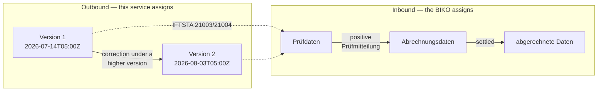
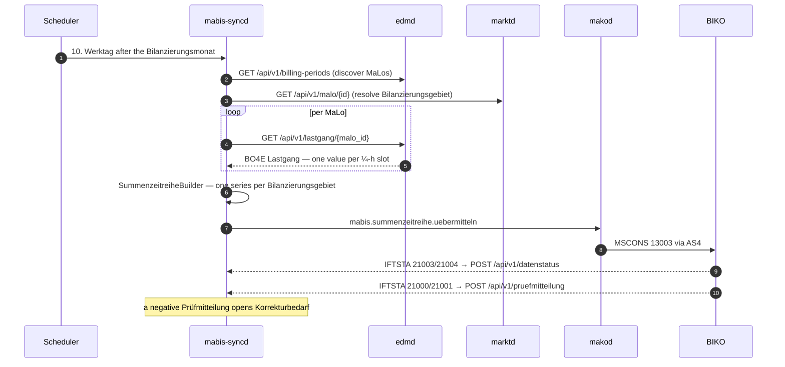

# mabis-syncd — MaBiS Summenzeitreihe synchronisation daemon

`mabis-syncd` is the **ÜNB/NB side of MaBiS**: it aggregates per-MaLo quarter-hourly Lastgang data from `edmd` into one **Summenzeitreihe per Bilanzierungsgebiet**, files it with the **BIKO** (Bilanzkoordinator) as an MSCONS message through `makod`, and tracks what the BIKO does with it.

A Summenzeitreihe is **MSCONS Prüfidentifikator 13003** ("Übertragung Summenzeitreihe"). UTILTS carries Berechnungsformel and Zählzeit-/Schaltzeitdefinitionen and has no Summenzeitreihe use case.

| Feature | Detail |
|---|---|
| HTTP port | `:8880` |
| Database | PostgreSQL 15+ (sqlx 0.8, schema from `src/migrations/0001_initial.sql`) |
| Schema | `submission_runs` — one row per submission attempt, keyed `(tenant, Bilanzierungsgebiet, period, version)`; `submission_malo_log` — per-MaLo contribution; `pruefmitteilung` — inbound BIKO objections |
| Outbound | `makod` command `mabis.summenzeitreihe.uebermitteln` (Marktrolle `NB`/`ÜNB`) → MSCONS 13003 via AS4 |
| Inbound | `POST /api/v1/datenstatus` (IFTSTA 21003/21004) · `POST /api/v1/pruefmitteilung` (IFTSTA 21000/21001) |
| Aggregation | `mako-mabis::SummenzeitreiheBuilder` on a **quarter-hourly** grid; rejects any interval that does not match the settlement slot length |
| Territory resolution | Per-MaLo lookup in `marktd` (`GET /api/v1/malo/{id}` → `bilanzierungsgebiet`) |
| Schedule | 10. Werktag after the Bilanzierungsmonat (last day of the Erstaufschlag window) |
| Auth | OIDC/JWT + Cedar ABAC — `read-mabis-run`, `trigger-mabis-run` (NB/ÜNB only) |
| Health | `GET /health/live`, `GET /health/ready` (PostgreSQL ping) |
| Regulatory | BK6-24-174 Anlage 3 (MaBiS); MSCONS AHB 3.2 §8.3.1; IFTSTA AHB 2.1 |

---

## Quick Start

```bash
mabis-syncd mabis-syncd.toml
```

Migrations run automatically at startup. The service **refuses to start without an `[oidc]` section** unless `allow_insecure_no_auth = true` is set explicitly — `POST /api/v1/sync` files a binding Summenzeitreihe with the BIKO, so running it unauthenticated must be a decision someone wrote down.

---

## The two axes: Version and Datenstatus

MaBiS identifies a Summenzeitreihe by the 3-tuple **(MaBiS-Zählpunkt, Bilanzierungsmonat, Version)**. These are two independent axes, and conflating them is the most common modelling error.



**Version** is not a lifecycle state. §3.8.2: *"Die Version einer Summenzeitreihe ist jeweils aufsteigend zu vergeben und ist über die gesamte BKA beizubehalten."* It is a timestamp — MSCONS carries it as `SG6 DTM+293` (Fertigstellungsdatum/-zeit, `CCYYMMDDHHMMSSZZZ`) — which is what makes "ascending" well defined. A correction is the same series resent under a higher version, so a period may hold arbitrarily many. `BGM` DE 1225 is always `9` (Original); there is no replace qualifier, so the version is the only thing distinguishing a correction from the first filing.

**Datenstatus** is assigned exclusively by the BIKO (§3.8.3: *"Der Datenstatus wird ausschließlich vom BIKO vergeben"*) and arrives inbound via IFTSTA `SG7 STS+Z04`. This service records it and never derives one.

| Datenstatus | Meaning |
|---|---|
| `Prüfdaten` | received, not yet accepted for settlement |
| `Abrechnungsdaten` | accepted for the ordinary BKA |
| `Abrechnungsdaten KBKA` | accepted for the Korrekturbilanzkreisabrechnung |
| `abgerechnete Daten` | settled in the BKA |
| `abgerechnete Daten KBKA` | settled in the KBKA |

Settlement uses the **highest version carrying `Abrechnungsdaten`** — not simply the newest version.

---

## Fristen (§3.10, Tabelle 2)

Werktage after the end of the Bilanzierungsmonat, for a BG-SZR (Kategorie B):

| Phase | BKA | KBKA |
|---|---|---|
| Erstaufschlag | 1.–10. WT | — |
| Clearingphase | 11.–30. WT | 31. WT – end of month 7 |
| Abrechnungsstichtag | 42. WT | end of month 8 |

Within the Erstaufschlag a new version is assigned `Abrechnungsdaten` automatically; afterwards it starts as `Prüfdaten` and needs a positive Prüfmitteilung to be promoted. The scheduler therefore submits on the **10. Werktag** by default, which maximises the input data while the automatic assignment still applies.

---

## Pipeline



### What fails a run

A Summenzeitreihe that is short is indistinguishable from a correct one once the BIKO has acked it, so the run fails rather than filing silently:

- **No MaLos discovered** — an empty series would settle a Bilanzierungsgebiet at zero.
- **A MaLo could not be fetched** — its energy would simply be absent.
- **An interval does not match the ¼-h grid** — the total would be right and the shape wrong, which the BIKO cannot detect from the message.

Incomplete coverage (slots no MaLo reported) is logged at `WARN` with the missing-slot count.

---

## Endpoints

| Method | Path | Cedar action | Description |
|---|---|---|---|
| `POST` | `/api/v1/sync` | `trigger-mabis-run` | Trigger an aggregation and submission |
| `GET` | `/api/v1/runs` | `read-mabis-run` | Recent submission runs |
| `GET` | `/api/v1/runs/{id}` | `read-mabis-run` | One run with status and Datenstatus |
| `PUT` | `/api/v1/runs/{id}/retry` | `trigger-mabis-run` | Retry a failed run (new version) |
| `POST` | `/api/v1/datenstatus` | `trigger-mabis-run` | Record the BIKO-assigned Datenstatus |
| `POST` | `/api/v1/pruefmitteilung` | `trigger-mabis-run` | Record an inbound Prüfmitteilung |
| `GET` | `/api/v1/korrekturbedarf` | `read-mabis-run` | Negative Prüfmitteilungen with no correction yet |

Triggering is separated from reading and restricted to the **NB** and **ÜNB** roles — the roles that aggregate a Bilanzierungsgebiet and have standing to file in the tenant's name. Read access is tenant-scoped because run history discloses which territories a tenant settles.

---

## Configuration

```toml
[http]
addr = "0.0.0.0:8880"

[database]
url = "env:MABIS_SYNCD_DATABASE_URL"

[identity]
tenant                  = "env:MABIS_SYNCD_TENANT"                  # BDEW Codenummer of the ÜNB/NB
sender_mp_id            = "env:MABIS_SYNCD_SENDER_MP_ID"            # NAD+MS in MSCONS
receiver_mp_id          = "env:MABIS_SYNCD_RECEIVER_MP_ID"          # NAD+MR (BIKO)
bilanzierungsgebiet_id  = "env:MABIS_SYNCD_BILANZIERUNGSGEBIET_ID"  # fallback only

[edmd]
url     = "http://edmd:8380"
api_key = "env:MABIS_SYNCD_EDMD_API_KEY"

[marktd]                    # required — per-MaLo Bilanzierungsgebiet lookup
url     = "http://marktd:8180"
api_key = "env:MABIS_SYNCD_MARKTD_API_KEY"

[makod]
url     = "http://makod:8080"
api_key = "env:MABIS_SYNCD_MAKOD_API_KEY"

[oidc]                      # required unless allow_insecure_no_auth = true
issuer   = "https://login.microsoftonline.com/{tenant-id}/v2.0"
audience = "api://mako-mabis-syncd"

[schedule]
erstaufschlag_werktag = 10   # Werktag after the Bilanzierungsmonat to submit on
run_hour_utc          = 5    # 05:00 UTC = 06:00 CET / 07:00 CEST
```

Every value may be written as `env:VARNAME` and is resolved at startup. A referenced variable that is not set fails the process with the variable named — unresolved, the placeholder would be sent as the literal bearer token and every upstream call would 401.

`identity.bilanzierungsgebiet_id` is only a **fallback** for MaLos whose master data names no territory, and those MaLos are logged rather than folded in silently: energy filed against the wrong territory is a settlement error the BIKO cannot detect.

---

## Related

- [`mako-mabis`](../../crates/mako-mabis) — aggregation domain and the BKV-side Bilanzkreisabrechnung workflow
- [`edmd`](../edmd) — source of the quarter-hourly Lastgang
- [`makod`](../makod) — MSCONS rendering and AS4 transport
- [Operator guide](https://hupe1980.github.io/mako/mabis-syncd) — full documentation
