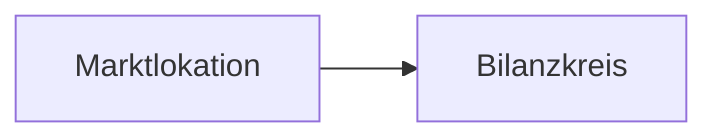

# mako documentation site

The published documentation at <https://hupe1980.github.io/mako> — a [Zola]
static site. Content lives in `content/docs/`, templates in `templates/`.

[Zola]: https://www.getzola.org

## Local development

```sh
cd site && zola serve      # http://127.0.0.1:1111, live reload
just check-site            # diagrams + link check, what CI runs
```

`zola check` validates internal links (`internal_level = "error"`, so a dead
`@/docs/…#anchor` fails the build). It does **not** look at diagrams — that is
`just check-mermaid`.

## Diagrams

Diagrams are [Mermaid], written as fenced blocks in Markdown:

````markdown

````

`templates/index.html` embeds `<pre class="mermaid">` directly instead, because
the landing page is a template rather than content.

[Mermaid]: https://mermaid.js.org

### Two rules

**Write line breaks in node labels as `<br/>`.**

```
A["AS4 / ebMS3<br/>sign · encrypt · receipt"]
```

Mermaid 11 also accepts a literal newline inside the quotes, so this is a
consistency rule rather than a correctness one — but every diagram on the site
uses `<br/>`, and mixing the two makes a label look broken in review when it
renders fine, and vice versa.

**The renderer must call `mermaid.run()` explicitly.** `static/js/mermaid-init.js`
sets `startOnLoad: false` and drives rendering itself. This is not a style
preference:

> Mermaid attaches its auto-run to `window.load` at *module evaluation* time.
> The site imports it dynamically from a CDN, so when the network is cold the
> module evaluates *after* `load` has already fired, the listener is registered
> too late, and no diagram on the page renders. A warm cache usually wins the
> race, which is what makes this fail intermittently and look like "some
> diagrams don't render".

`tools/check-mermaid.mjs` enforces both rules — it parses every diagram with the
real Mermaid parser and fails if the renderer regresses to `startOnLoad`. It runs
in `.github/workflows/site.yml` before the build.

The init script also re-renders on a theme switch, because Mermaid bakes the
palette into the generated SVG.

## Structure

| Path | Contents |
|---|---|
| `content/docs/architecture/` | Engine, domain model, ERP integration, AS4 |
| `content/docs/services/` | One page per service |
| `content/docs/regulatory/` | BNetzA, BDEW, DVGW obligations |
| `content/docs/reference/` | Processes, PIDs, validation |
| `templates/` | Zola templates; `index.html` is the landing page |
| `static/js/mermaid-init.js` | Diagram renderer |
| `tools/check-mermaid.mjs` | Diagram + renderer validation |

`package.json` exists only for that checker. The published site is static and
loads Mermaid from a CDN at runtime; nothing here is bundled or shipped.
