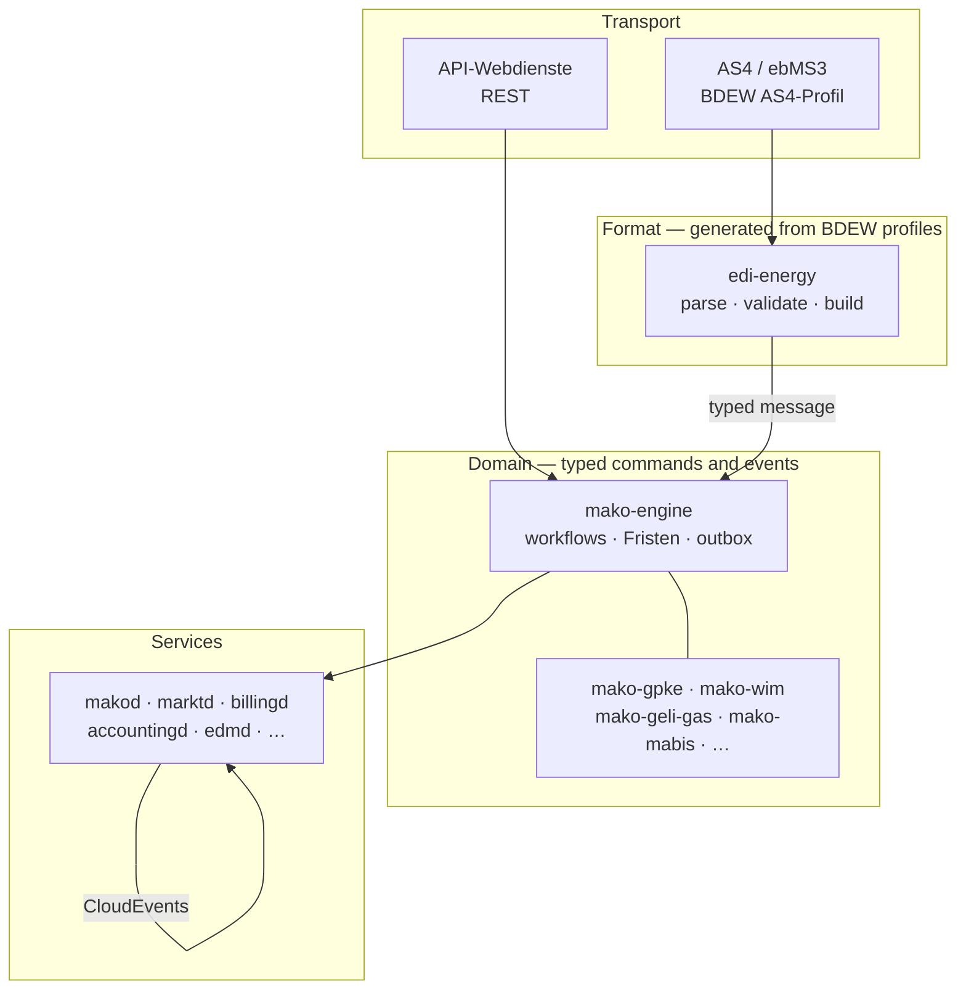

+++
title = "Documentation"
description = "Complete documentation for mako — the open-source German energy-market platform in Rust. Guides, service operator manuals, EDIFACT reference, regulatory mapping and the annual BDEW release workflow."
sort_by = "weight"
template = "section.html"
[extra]
mermaid = true
+++

Everything needed to build, run and extend mako — grouped by what you are trying
to do.

## Start here

| If you want to… | Go to |
|---|---|
| See it work end to end in a few minutes | [Getting started](@/docs/guide/getting-started.md) |
| Understand how a message becomes a process | [Architecture](architecture/) |
| Run a service in production | [Services](services/) |
| Parse, validate or build EDIFACT yourself | [Reference](reference/) |
| Trace a rule back to its Festlegung or § | [Regulatory](regulatory/) |
| Take on a new annual BDEW release | [Release & compliance](compliance/) |

## Find it by market role

A deployment is scoped to the roles it plays — a role build contains no other
arm's code (§ 9 EnWG). `makod`, `marktd`, `edmd`, `obsd` and `agentd` are
role-neutral and run everywhere; the rest are role-specific.

| Role | Also runs | Starts at |
|---|---|---|
| **NB** — Netzbetreiber | `processd` · `netzbilanzd` · `sperrd` · `einsd` · `mabis-syncd` | [processd](@/docs/services/processd.md) — the STP auto-responder |
| **LF** — Lieferant | `processd` · `vertragd` · `productd` · `billingd` · `invoicd` · `accountingd` · `outputd` · `portald` · `einsd` | [billingd](@/docs/services/billingd.md) — retail billing and EN 16931 |
| **MSB** — Messstellenbetreiber | `processd` · `vertragd` | [edmd](@/docs/services/edmd.md) — metering and SMGW lifecycle |
| **ESA** — Energieserviceanbieter | — | [makod](@/docs/services/makod.md#esa-messages) — the §34 MsbG Wertebestellung |

## How the layers fit together

The split is deliberate. The domain layer never sees EDIFACT, and the format
layer never knows what a Lieferantenwechsel is — so an annual BDEW release is a
codegen run against new profiles rather than a change to process logic.

## Sections

- **[Guide](guide/)** — install, run the demo stack, submit your first message.
- **[Architecture](architecture/)** — the domain model, the workflow engine, ERP
  integration and the API-Webdienste transition.
- **[Services](services/)** — one operator manual per service: endpoints,
  configuration, emitted events, deployment.
- **[Reference](reference/)** — EDIFACT parsing, validation, builders, the AS4
  profile, process catalogue, and the `makotest` Python toolkit.
- **[Regulatory](regulatory/)** — BNetzA Festlegungen and the full
  Prüfidentifikator table with the crate and workflow that owns each one.
- **[Release & compliance](compliance/)** — the annual release workflow, schema
  versioning, and licence inventory.

## Common tasks

| Task | Page |
|---|---|
| Parse an interchange and read its typed fields | [Parsing](@/docs/reference/parsing.md) |
| Find which workflow owns a Prüfidentifikator | [PID reference](@/docs/regulatory/pid-reference.md) |
| Look up an answer Frist | [Process catalogue](@/docs/reference/processes.md) |
| Configure AS4 against a counterparty | [makod — `[as4]`](@/docs/services/makod.md#as4-as4-ebms3-inbound-and-outbound) |
| Submit a command from an ERP | [ERP integration](@/docs/architecture/erp-integration.md) |
| Take on a new BDEW release | [Annual release workflow](@/docs/compliance/annual-release-workflow.md) |
| Write a test against the real Fristen | [makotest](@/docs/reference/makotest.md) |
