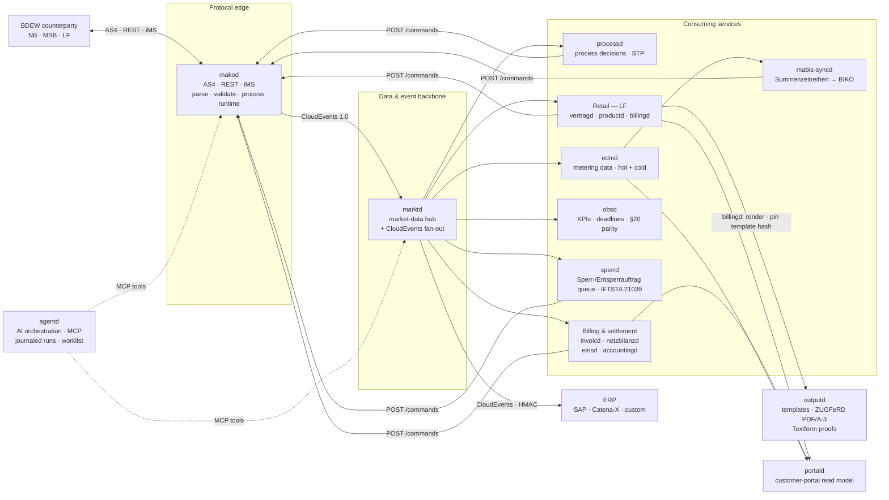
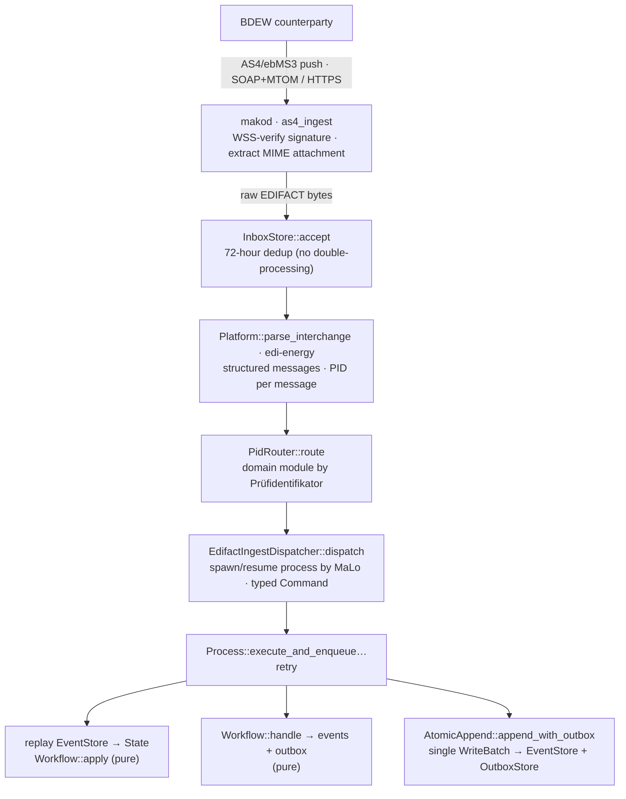
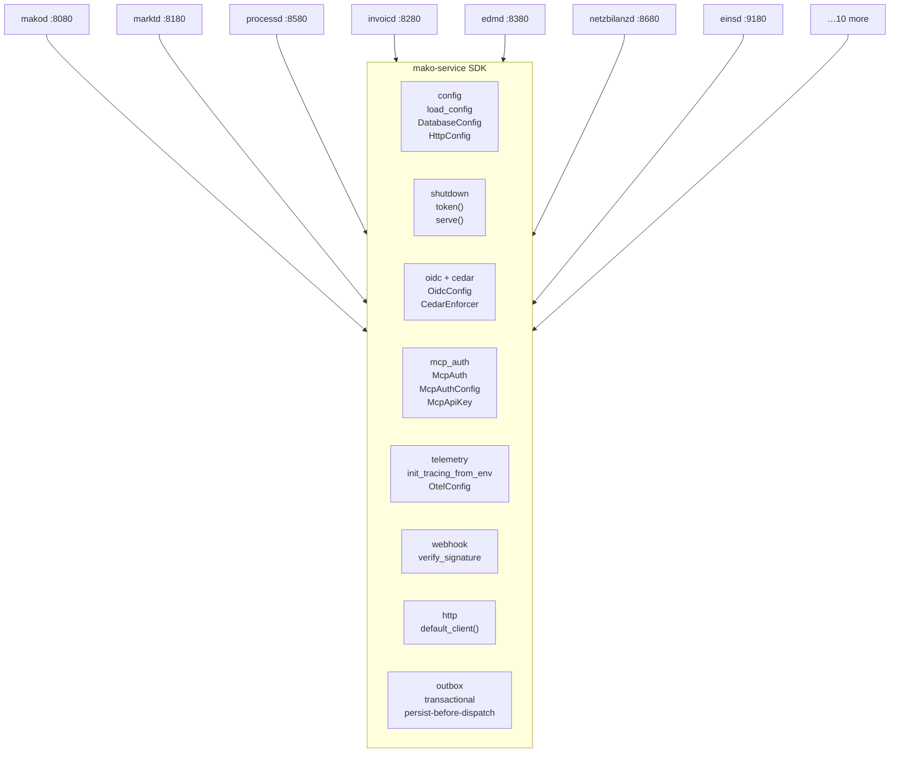
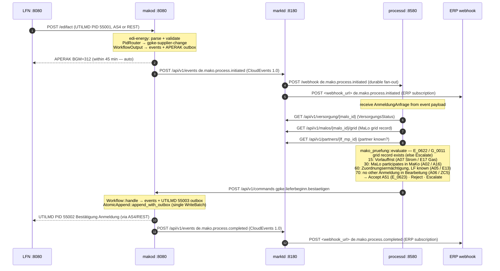

+++
title = "Architecture"
description = "How the platform fits together: the event-sourced engine, domain model, deadlines, and ERP/API integration."
weight = 2
sort_by = "weight"
template = "section.html"
page_template = "page.html"
[extra]
mermaid = true
+++
# Architecture

This document covers the design of `mako-engine` and the full service mesh:
event-sourced process runtime, inbound/outbound transport channels, ERP
integration via BO4E + CloudEvents 1.0, and the SlateDB persistence layer.
It also describes the **seventeen** production daemons and the `mako-service` shared
infrastructure library they build on.

---

## Design principles

| Principle | Consequence |
|---|---|
| **Protocol processor, not a business system** | `makod` handles EDIFACT, BDEW rules, AS4 delivery, and regulatory deadlines. Contract data and billing logic live in your ERP. |
| **`Workflow::handle` and `Workflow::apply` are pure functions** | All I/O, parsing, and clock access happens at the transport boundary before a command is constructed. This makes processes deterministic, replayable, and trivially testable. |
| **Atomic dual-write** | Events and outbox entries are written in a single `WriteBatch` via `AtomicAppend::append_with_outbox`. There is no two-phase commit, no compensation path for a lost APERAK. |
| **Event sourcing** | State is rebuilt by replaying the append-only event log. Audit trails, bug reproductions, and format-version migrations are a consequence of the model, not bolt-ons. |
| **Format-version coexistence** | `FV2025-10-01` and `FV2026-10-01` coexist in the same running instance. A process started under the old format version continues under those rules until it completes. |
| **Persist before dispatch** | Every event-emitting service writes the outbound CloudEvent in the **same transaction** as the business row that produced it, then a background worker delivers it (at-least-once, retried, dead-lettered). `makod` does this with a SlateDB `WriteBatch`; the PostgreSQL services (`billingd`, `einsd`, `accountingd`, `netzbilanzd`, `vertragd`, `invoicd`) share one implementation — `mako_service::outbox` (`enqueue(&mut tx, &ce)` + `OutboxWorker`). A crash between persist and dispatch is therefore never a data-loss event; the receiver dedups the duplicates on the CloudEvent `id`. |
| **One deployment, one operator** | A mako deployment serves a single market operator; isolation between operators is per-deployment (separate processes, databases, and AS4 identities), not row-level SaaS tenancy. Where a `tenant` column or `TenantId` appears (`mako-engine` streams, `edmd`, `productd`), it carries the operator's own MP-ID — it scopes data to the configured party (e.g. multiple LF brands sharing one `productd`), it does not implement cross-operator multi-tenancy. Provisioning for managed hosting is a control-plane concern of the hosted offering. |
| **Capabilities are grouped by regulatory domain, not by generic function** | There is no `notificationd`, `documentd`, `forecastd` or `anomalyd`, and their absence is deliberate. Forecasting (§ 40a Abs. 2 EnWG Verbrauchsschätzung) and anomaly detection (Hampel scoring, V01–V09/V11/V12) live in `edmd` because both operate on the same metering series under the same legal basis; payments (SEPA pain.008/pain.001, camt.05x) live in `accountingd` because they are one side of the Kontokorrent. Documents are split along the same seam rather than against it: document *content* — the amounts, the VAT breakdown, the legal basis, the EN 16931 CII/UBL payload — stays with the billing service that computes it and answers for it, while document *rendering* — the template store, the ZUGFeRD PDF/A-3 carrier, the Textform proofs — is `outputd`, because one brand has one template store and a logo change must reach the invoice *and* the Mahnung alike. Splitting a capability out by technical function anywhere else would put one regulated obligation across two services and force a distributed transaction where today there is a row and an outbox entry. Notification is not a service at all — it is `mako_service::webhook` plus marktd's durable CloudEvents fan-out. |
| **No API gateway; each service owns its port and its policy** | Every daemon terminates its own OIDC/JWT and evaluates its own Cedar decision against a resource it fully understands (`MaKo::Command` carries `marktrolle` and `pid`; `MaKo::ProcessRecord` carries `workflow`). A gateway would have to re-derive that domain context to make the same decisions, and would become a second place where authorisation can be wrong. Cross-cutting concerns that genuinely belong at the edge — TLS termination, rate limiting beyond the per-peer GCRA each port already applies, IP allowlisting — are the deployment's ingress to provide. |

---

## Service topology

Every inbound message enters through **makod** (the protocol edge), which turns it
into a CloudEvent. **marktd** is the data-and-event backbone: it owns the market
master data and fans those events out to the consuming services. Commands flow back
to makod, which renders and dispatches the outbound EDIFACT. Each service is detailed
in its own section below.



### Inbound message pipeline

How a single AS4 EDIFACT interchange becomes committed process state inside makod:



The parse → route → dispatch → append chain is deterministic and idempotent: the
same interchange, redelivered, dedups at the inbox and no-ops at the event store.

---

## Domain library crates

These are the pure, zero-I/O library crates that domain logic is extracted into.
Each is independently testable and suitable for crates.io publication.

| Crate | Role | Key API |
|---|---|---|
| `edi-energy` | EDIFACT parse / validate / build | `parse()`, `Platform`, `Validator` |
| `mako-engine` | Event-sourced process runtime | `Workflow`, `EventStore`, `OutboxStore`, `DeadlineStore` |
| `mako-markt` | Market data domain types + repo traits | `MaloId`, `MeloId`, `MarktpartnerId`, `VersorgungsStatus` |
| `grid-billing` | NNE/KA/MMM/MSB grid **settlement** engine | `calculate_nne_invoice`, `GridSettlement` (+ `CalculationTrace`, `LegalReference`); `Sparte` drives Gas/Strom refs; `calculate_reversal()`; rubo4e-free core, opt-in `bo4e` feature → `into_rechnung()` |
| `energy-billing` | Pure multi-product retail energy billing (LF) | `Product` typed enum (13 categories, serde-tagged); `BillingEngine`/`BillingProvider` pipeline; `ControllableLoadProvider` (§14a); `validate()` + `bill_batch()`; `Invoice.warnings` + `§41a Abs. 1` guard; `StromsteuerBefreiung` typed enum; `EnergieQuellen` CO₂ label; HT/NT (`billing::TimeOfUsePricing`); block tariffs (`billing::RateSchedule`); **RLM demand charge**; **gas §54 exemption**; **historic levy rates**; §41a EPEX; `Invoice::merge()`, `Invoice::allocate_proportionally()`; `eeg` optional feature; rubo4e-free core, opt-in `bo4e` feature → `Invoice::to_rechnung()`; zero I/O |
| `eeg-billing` | Pure EEG/KWKG feed-in settlement (NB) | `calculate_settlement`, 10 settlement schemes, §51/§52 rules, `InbetriebnahmeTyp`, proptest invariants; opt-in `bo4e` feature → **§14 UStG Gutschrift** (`settlement_to_gutschrift` → BO4E `Rechnung` with per-rate USt breakdown) |
| `invoic-checker` | INVOIC plausibility 6-check pipeline | `InvoicCheckEngine::check`, `CheckOutcome` |
| `mako-pruefung` | NB Anmeldung 6-check validation | `check_anmeldung`, ERC A02/A05/A06/A07/E17 |
| `mako-obs` | Process observability types | `ProcessProjection`, `KpiReport`, `DeadlineRisk` |
| `mako-service` | **Service SDK** — cross-cutting infrastructure for all 17 daemons | `load_config`, `DatabaseConfig`, `HttpConfig`, `shutdown::token/serve`, `OidcConfig::build_verifier`, `McpAuth`, `McpAuthConfig`, `init_tracing_from_env`, `CedarEnforcer`, `outbox`, `ServiceBuilder` |
| `mako-plugin` | Operator CloudEvent extension point | `CloudEventPlugin`, `PluginRegistry`, re-exported by `mako-service`. No daemon runs a registry today — it is an integration seam, not an active hook |

### Billing crate hierarchy


### `energy-billing` — LF retail billing engine

The `energy-billing` crate uses a **typed `Product` enum** as the primary dispatch mechanism.
Each product category has its own struct — no flat god-struct with 50 optional fields:

```
Product::Strom(ElectricityProduct)           → ElectricityProvider / DynamicElectricityProvider
Product::Waermepumpe(ControllableLoadProduct) → ControllableLoadProvider (§14a)
Product::Wallbox(ControllableLoadProduct)     → ControllableLoadProvider (§14a)
Product::Gas(GasProduct)                      → GasProvider
Product::Waerme(HeatProduct)                  → HeatProvider
Product::Wasser(WaterProduct)                 → WaterProvider (Trinkwasser + Abwasser)
Product::Solar(SolarProduct)                  → SolarProvider
Product::Eeg(EegProduct)                      → EegProvider
Product::Einspeisung(EinspeisungProduct)       → EinspeisungProvider
Product::Hems(HemsProduct)                     → HemsProvider
Product::Emobility(EmobilityProduct)           → EmobilityProvider
Product::Energiedienstleistung(ServiceProduct) → ServiceProvider
Product::Sharing(SharingProduct)               → ElectricityProvider + EnergyShareProvider
```

`ControllableLoadProduct` uses `#[serde(flatten)] base: ElectricityProduct` — the standard
electricity billing is delegated to `ElectricityProvider`, then §14a credit positions are appended.


The engine runs in passes:

```
Pass 0  validate_warnings()      §41a iMSys guard · StromsteuerBefreiung checks
Pass 1  commodity / levy providers   (per-variant provider)
Pass 2  tax provider                 (MwStProvider — groups by applicable_tax_rate)
Pass 3  Abschlag deductions          (Final invoice reconciliation)
Pass 4  Minimum invoice top-up       (B2B Mindestabnahmeverpflichtung)
Pass 5  Cancellation sign reversal   (Stornorechnung)
```

### External crates.io dependencies

| Crate | Version | Purpose |
|---|---|---|
| [`billing`](https://crates.io/crates/billing) | `0.13` | Generic billing engine — `PricingModel` document assembly (one trait; a usage-free model sets `type Usage = ()`), graduated/volume/block/capacity pricing (`RateSchedule`), HT/NT (`TimeOfUsePricing`), EPEX intervals (`DynamicPricing`), typed `Quantity`/`UnitPrice`, exact `Amount<P>` money (`checked_from_decimal`), VAT breakdown (EN 16931 BG-23) with `FixedRateTax::exempt`/`zero_rated`, `AmountScale::EN16931`, `AdvancePayment`, `prorate`/`merge_period_documents`; the shared money engine under `energy-billing`, `grid-billing` and `eeg-billing` |
| [`sepa`](https://crates.io/crates/sepa) | `0.5` | SEPA payment utilities — IBAN (ISO 13616, full 89-entry registry, BBAN structure checks), BIC (SEPA pattern + country validation), `CreditorId` (EPC AT-02, correct EPC262-08 check digits), typed `IsoDate`/`IsoDateTime`, pain.008 SDD CORE+B2B (`Pain008Builder` + `DirectDebitGroup`, multi-`PmtInf` messages, mandatory `CdtrSchmeId`), pain.001 SCT+SCT Instant (`Pain001Builder` + `CreditTransferGroup`), config-selectable schema version (`DirectDebitSchema` / `CreditTransferSchema`), pain.002 parser, camt.052/053/054 XML + simplified-JSON parsers (shared `CashEntry` model, `signed_ct()`), EPC217-08 transliteration, located `build()`/`validate()` errors; used by `accountingd` and `vertragd` |
| [`metering`](https://crates.io/crates/metering) | `0.16` | German energy metering domain — `MeterInterval`, `aggregate`, `fill_gaps` / `fill_gaps_with_config` (§ 60 Abs. 2 MsbG — `FillGapsConfig` supports `PriorPeriodAverage`), `gas_m3_to_kwh_hs` (§ 25 Nr. 4 MessEV / DVGW G 685), `score_intervals` (Hampel A/B/C/F), SLP/RLM/iMSys classification, BDEW 2025 load profiles; pure computation, no storage — used by `edmd`, `marktd`, `mabis-syncd`, `mako-gabi-gas` and `mako-mabis` |
| [`meterstore`](https://crates.io/crates/meterstore) | `0.2` | Metering time-series store — the persistence layer beneath `edmd`: PostgreSQL hot window + Apache Iceberg/S3 settled history, version-resolved reads, and `as_known_at` transaction-time reads across both tiers (what backs `edmd`'s `?as_of=` reproducible settlement snapshots) |
| [`doubleentry`](https://crates.io/crates/doubleentry) | `0.6` | General-purpose double-entry ledger — append-only BLAKE3 Merkle log with `O(log n)` inclusion, consistency and balance proofs (all verified against a tree head, never a bare root), period seals over the journal, the trial balance and the account bindings; deliberately domain-neutral, with the energy and SEPA specifics kept in `accountingd` |
| [`rubo4e`](https://crates.io/crates/rubo4e) | `0.10` | BO4E business-object types — the `rubo4e::current` versioned schema, validated at every read/write boundary |

---

## Companion daemons

All **17** daemons share a common operational model:
- **TOML configuration** — loaded from a file (`makod.toml`, `marktd.toml`, …) with `env:VAR_NAME` secret interpolation
- **Cedar ABAC** — all HTTP endpoints gated by Cedar attribute-based access control
- **OIDC/JWT** — asymmetric algorithm only; JWKS cached with background refresh; omit `[oidc]` for dev mode
- **OpenTelemetry** — OTLP traces on all workflow commands, event appends, and webhook deliveries

**MCP server** — a `POST|GET /mcp` endpoint (MCP Streamable HTTP) for
LLM tooling — is exposed by **15 of the 17**: all except `outputd`
and `agentd`, which is the MCP *host* that calls the others.

| Daemon | Port | Role | Config file |
|--------|------|------|-------------|
| `makod` | `:8080` / `:4080` / `:8090` | Protocol gateway — EDIFACT ↔ BO4E, 69 workflows, AS4 ingest, deadlines | `makod.toml` |
| `marktd` | `:8180` | Market Data Hub — MaLo/MeLo/NeLo/TR/SR, Lokationszuordnung graph, preisblaetter, VersorgungsStatus, `event_log` replay, durable fan-out; **Geraet** typed konfigurationen sub-resource (16-variant `Konfigurationsparameter` enum, GIN-indexed); **Zaehlzeitdefinition** typed endpoint; ZaehlzeitRegister auto-population from WiM Stammdaten | `marktd.toml` |
| `processd` | `:8580` | Process decision engine — NB STP (`mako-pruefung`), LF answers to the NB-initiated GPKE processes, MSB REQOTE/ORDRSP, EoG gap closure; role-gated binaries (§ 7 EnWG) | `processd.toml` |
| `invoicd` | `:8280` | INVOIC plausibility — REMADV, selbstausstellen, overdue-REMADV, § 147 AO / GoBD audit | `invoicd.toml` |
| `netzbilanzd` | `:8680` | NNE/KA/MMM billing daemon (NB role) — generates INVOIC 31002 (NN-Rechnung) / 31005 (MMM) / 31009 (MSB) / 31011 (AWH), invoice draft lifecycle | `netzbilanzd.toml` |
| `sperrd` | `:8780` | Sperr-/Entsperrauftrag execution queue (NB role) — ORDERS 17115/17117 ingest, field dispatch, IFTSTA 21039 with a retry queue | `sperrd.toml` |
| `edmd` | `:8380` | Energy data management — MSCONS meter readings, BO4E `Energiemenge` deliveries, `Lastgang` + `Zeitreihe` time-series, `MeterBillingPeriod`; **§14a SMGW compliance** (MsbG §21c): `smgw_sessions` + `cls_compliance_log` tables, daily `check_session_compliance()` sweep, `de.messwert.cls.compliance-issue` CloudEvents | `edmd.toml` |
| `obsd` | `:8480` | Process observability — KPI reports, deadline-risk alerts, §20 EnWG parity | `obsd.toml` |
| `einsd` | `:9180` | Einspeiser Registry + EEG/KWKG Settlement (NB/LF role) — **10 settlement schemes** (Vergütung, Mieterstrom §21 Abs. 3 EEG, Direktvermarktung MarketPremium, sonstige Direktvermarktung, Ausschreibung, Post-EEG Spot, Eigenverbrauch, KWKG-Zuschlag §7 KWKG 2023, Flexibilitätsprämie §50 EEG, Flexibilitätszuschlag §50b EEG); Repowering §22 EEG; KWKG Förderdauer; built-in rate table EEG 2000–2023 + KWKG 2023; **§14 UStG Gutschrift** issued per billable settlement (Gutschriftverfahren — NB issues the document; BO4E `Rechnung` in `rechnung_json`, VAT breakdown per plant tax status); CloudEvents `de.eeg.verguetung.berechnet` (net + USt + brutto) + `de.eeg.marktpraemie.berechnet` + `de.eeg.anlage.foerderung-auslaufend` | `einsd.toml` |
| `productd` | `:9080` | Product & Tariff Catalog (LF role) — user-defined energy products (STROM/GAS/WAERME/SOLAR/EEG/EINSPEISUNG/WAERMEPUMPE/WALLBOX/HEMS/EMOBILITY/ENERGIEDIENSTLEISTUNG/BUNDLE); all prices in `Tarifpreisblatt` JSONB; version history; MaLo→product assignment; EPEX Spot for §41a | `productd.toml` |
| `billingd` | `:9280` | Energy Billing Engine (LF role) — all prices user-defined in `productd`; 13 categories (STROM/GAS/WAERME/SOLAR/EEG/EINSPEISUNG/WAERMEPUMPE/WALLBOX/HEMS/EMOBILITY/ENERGIEDIENSTLEISTUNG/BUNDLE/VPP); §41a dynamic; VPP auto-billing webhook (`de.vpp.dispatch.confirmed` → `Rechnung`); `/preview` dry-run; EN 16931 e-invoicing (XRechnung 3.0 CII / PEPPOL UBL); ZUGFeRD PDF via `outputd`, template hash pinned per issued invoice; `de.billing.rechnung.erstellt` | `billingd.toml` |
| `outputd` | `:9880` | Customer Communications — operator-owned Typst templates in a no-I/O sandbox (content-addressed, append-only store; publish gated by proof); ZUGFeRD PDF/A-3 carrier (Factur-X XMP by incremental update) around the caller's CII payload; Textform kinds (MAHNUNG § 126b BGB render-proven; PREISANPASSUNG parse-only — it has no render view); `POST /api/v1/render/{kind}` → PDF + `X-Mako-Template-Hash` | `outputd.toml` |
| `accountingd` | `:9380` | Customer Account Ledger (LF role) — **tamper-evident double-entry ledger** on the `doubleentry` crate (Merkle inclusion proofs, period seals for GoBD/§146 AO **Festschreibung**, store-level idempotent CE ingest); per-MaLo Kontokorrent + GL contras; **FIFO open-item clearing** (`/open-items`); **Summen- und Saldenliste** §238 HGB (`/trial-balance`); camt.052/053/054 XML + flat-export import (booked entries only, IBAN → EndToEndId → remittance-token resolution ladder); SEPA pain.008 XML (multi-group single message, hard `creditor_iban`/`creditor_id` validation, ISO 20022 `Purp/Cd` per Sparte, structured `PstlAdr` for the EPC 2026-11-15 cut-over); pain.001 SCT credit-transfer; **pain.007 creditor reversal**; **pain.002 status ingest incl. Verification of Payee**; **auto-dunning rule engine** (Mahnstufe 1–3, background worker); **balance reconciliation** (`/reconcile`); keyed-BLAKE3 IBAN hash; **GDPR Art. 17 pseudonymization** (`/anonymize`) | `accountingd.toml` |
| `portald` | `:9480` | Customer Portal read-model gateway (LF role, stateless) — aggregates Lastgang, invoices, account ledger, VersorgungsStatus, EEG settlement and the §41 EnWG self-service writes; `/dashboard` fetches every upstream concurrently; every route resolves customer ownership through `vertragd` | `portald.toml` |
| `vertragd` | `:9780` | Contract & Customer Management (LF role) — Kunden (B2C + B2B), portal identities, Rahmen- and Versorgungsverträge, the valid-time MaLo→product assignment, and the statutory Kündigungs-/Preisanpassungsfristen as pure rules. OIDC → MaLo authorization gateway for `portald`; DSGVO Art. 15/17 | `vertragd.toml` |
| `mabis-syncd` | `:8880` | MaBiS synchronisation daemon (ÜNB/NB role) — aggregates per-MaLo quarter-hourly Lastgang from `edmd` via `mako-mabis::SummenzeitreiheBuilder`, submits Summenzeitreihen to the BIKO as MSCONS PID 13003 through `makod`; ascending version per (Bilanzierungsgebiet, Bilanzierungsmonat) and BIKO-assigned Datenstatus per BK6-24-174 Anlage 3; submits on the 10. Werktag (Erstaufschlag); `submission_runs`, `submission_malo_log` and `pruefmitteilung` tables | `mabis-syncd.toml` |
| `agentd` | `:9580` | Multi-agent LLM orchestration daemon — **28 declarative manifests** run on the agentplane durable runtime (journaled effects, strict replay, Cedar gate, sealed at rest, four-eyes worklist at `/api/v1/oversight`); Anthropic / OpenAI / Gemini / self-hosted (TGI, vLLM, Ollama) / AWS Bedrock; MCP tool calls across the production services; **28 bundled specialists** incl. `billing-regulatory-guard-agent` (§41/§41a compliance), `jahresabrechnung-agent` (annual settlement), `replacement-value-agent` (§ 60 Abs. 2 MsbG), `mabis-syncd-agent` (UTILTS deadlines), `smgw-diagnostics-agent` (BSI TR-03109 + §14a CLS) | [agentd guide](@/docs/services/agentd.md) |

### `marktd` — Market Data Hub (`:8180`)

`marktd` is the single source of truth for all market entity state.
It stores Marktlokationen (MaLo) with typed columns (`netzebene`, `bilanzierungsgebiet`,
`gasqualitaet`, `energierichtung`, `bilanzierungsmethode`, `regelzone`, `fallgruppe`)
and **typed `rubo4e::current::Marktlokation`** API responses (schema validated on every `PUT` — wrong `_typ`, or any out-of-schema enum value anywhere in the tree, → 422; the strict check is `rubo4e`'s `Bo4eStrict::ensure_known_enums`, which reports each offending JSON-path instead of silently decoding it to `Unknown`),
Messlokationen (MeLo) with typed `netzebene_messung`, `regelzone`, `standorteigenschaften JSONB`,
and **typed `rubo4e::current::Messlokation`** responses,
contracts, trading partners, network contracts (`NbContractRecord`),
price sheets (NNE, Messung, KA, Dienstleistung, Hardware),
**VersorgungsStatus per MaLo** (with full history and `?at=YYYY-MM-DD` point-in-time queries),
**MaLo grid topology** (`malo_grid`, provisioned via the NB-role `PUT /api/v1/malos/{malo_id}/grid` endpoint),
**Netz-Element-Lokationen (NeLo)** with typed Redispatch 2.0 columns
(`steuerkanal`, `eigenschaft_msb_lokation`, `grundzustaendiger_msb_codenr`),
**TechnischeRessource** (E-mobility, generation, storage for iMS and Redispatch 2.0),
**SteuerbareRessource** with `konfigurationsprodukte JSONB` (contracted iMS control products),
**Zaehler** (meter registry) returning typed `rubo4e::current::Zaehler`, with
`GET /api/v1/zaehler/{id}/zaehlwerke` for `Vec<Zaehlwerk>` OBIS register access,
**ZaehlzeitRegister + ZaehlzeitSaison** for iMSys Time-of-Use (TOU) register definitions:
`GET/PUT /api/v1/zaehler/{id}/register` stores HT/NT/EINZEL register records;
`GET/PUT /api/v1/zaehler-register/{id}/saisons` stores seasonal time windows (SOMMER/WINTER/GESAMT)
with ISO weekday bitmasks and local-time HH:MM bounds (PostgreSQL JSONB `@>` containment);
`GET /api/v1/zaehler/{id}/tariff-zone?datetime=ISO` resolves the active zone with a single
JOIN query — enabling `billingd` to automatically classify 15-min Lastgang intervals into
HT/NT bands for §14a Modul 2 ToU billing without per-meter manual configuration.

**ZaehlzeitRegister auto-population from WiM Stammdaten:** when `makod` receives a WiM
ORDERS response (PIDs 17102–17133) from the MSB, the `extract_zak_ze_zaehlwerke()` adapter
parses ZAK+ZE+ZD segments and emits a `de.mako.process.completed` event carrying the parsed
register data. `marktd`'s `event_ingest` handler upserts `ZaehlzeitRegister` +
`ZaehlzeitSaison` rows automatically — operators do not need to configure TOU registers
manually for meters where the MSB sends Stammdaten responses.
**Geraete** returning typed `rubo4e::current::Geraet`,
and the full **`Lokationszuordnung` location graph** (temporal `valid_from`/`valid_to` edges,
recursive-CTE BFS traversal via `GET /api/v1/malos/{id}/lokationen`).

`makod` pushes `de.mako.process.*` CloudEvents to `marktd`'s ingest endpoint.
Fan-out is **persist-before-fan-out**: every produced event is written to the
durable `event_log` outbox (the full envelope) in the same step that accepts it,
and a two-phase worker drains it — Phase 1 snapshots the matching subscriber set
into an `event_delivery` ledger, Phase 2 delivers each row (claim-with-lease,
`FOR UPDATE SKIP LOCKED`). A crash at any point is recoverable from those tables —
there is no in-memory relay channel an event could be lost in. `event_log` also
backs full replay via `GET /admin/events?from=&to=&type=&limit=`.
W3C Trace Context (`traceparent`, `tracestate`) from the originating `makod` event is
forwarded unchanged in every outbound webhook, enabling end-to-end distributed traces.

`marktd` fans events out to all registered subscribers via HMAC-SHA256-signed HTTP webhooks.
The `VersorgungsStatus` is derived automatically on `de.mako.process.completed`
(PIDs 55003/44003 → Beliefert, 55005/44005 → Unbeliefert; 55013/44013 → Ersatz-/Grundversorgung via `begin_eog_supply`). Every supply-state change is written
to `versorgungsstatus_history`, enabling both full audit logs and bitemporal
"as-of" queries by date.

Per-subscriber deliveries are retried with exponential back-off and, after
exhausting all attempts, marked `dead_lettered_at` in `event_delivery` (a
status-column DLQ) rather than silently dropped. This durable path ensures § 147
AO / GoBD compliance — a silent drop of a `de.mako.process.initiated` event to
`invoicd` would prevent the INVOIC plausibility check from running. Operators
inspect and retry via
`GET|POST|DELETE /admin/fanout/dlq`.

`marktd` is a **pure data hub** — it stores market entity state and fans out
CloudEvents to subscribers but contains no domain policy. Automated Anmeldung
decisions live in `processd`'s NB module.

See [`marktd` Operator Guide](@/docs/services/marktd.md).

### `processd` — Process Decision Engine (`:8580`)

`processd` consumes `de.mako.process.initiated` CloudEvents from `marktd` and
makes automated decisions within regulatory deadlines.

**NB module** (`--features nb-only` or `integrated`):
- Handles GPKE Lieferbeginn (55001/55016) and GeLi Gas Lieferbeginn (44001)
- Fetches `VersorgungsStatus` + `MaloGridRecord` from `marktd`
- Evaluates 6 objective checks via the pure `mako-pruefung` library
- Dispatches `bestaetigen`/`ablehnen` to `makod` with §20 EnWG parity logging
- STP improves when the `malo_grid` record is present (provisioned via marktd's NB-role `PUT /api/v1/malos/{malo_id}/grid` endpoint — manual/ERP provisioning)

**LF module** (`--features lf-only` or `integrated`):
- Answers the NB-initiated GPKE processes (inbound 55007 and 55010) within their 24 h business Frist
- Auto-consents clean Abmeldungen; auto-rejects Einzug (A32) scenarios
- Queues ambiguous cases in `approval_queue` for ERP operator review

See [`processd` Operator Guide](@/docs/services/processd.md).

### `invoicd` — Automated Billing Settlement (`:8280`)

`invoicd` is the autonomous INVOIC plausibility-check pipeline for the
Lieferant role. It subscribes to `de.mako.process.initiated` events from `marktd`,
runs seven checks (period validity, position arithmetic, document total,
**Umsatzsteuer** — including that the per-rate `steuerbetraege` breakdown sums to
`gesamtsteuer`, which is what the recipient's Vorsteuerabzug is computed from —
tariff match against the applicable **Preisstaffel**, Zahlungsziel, and MMM
settlement price), persists the receipt to PostgreSQL, then issues
`gpke.abrechnung.annehmen` or `gpke.abrechnung.ablehnen` back to `makod`.

The PostgreSQL persistence provides a durable audit trail of all received
invoices, plausibility outcomes, and check findings — satisfying the 8-year
Buchungsbelege retention under § 147 AO / GoBD and the §41 EnWG
invoice-content requirements.

**Supported PIDs:** 31001, 31002, 31005, 31006 (GPKE MMM-Rechnung); 31009
(WiM MSB-Rechnung).

**Payment lifecycle:**
- `POST /api/v1/receipts/{id}/confirm-payment` — ERP calls when bank transfer confirmed; sets `payment_confirmed_at`
- `GET /api/v1/zahlungsstatus/{malo_id}` — pending / settled / overdue counts per MaLo for AR reconciliation
- `POST /api/v1/selbstausstellen` — self-issued Mehrmengen-Rechnung, INVOIC 31006
- `GET /api/v1/overdue-remadv` — receipts approaching Zahlungsziel without REMADV
- `de.invoic.payment.overdue` CloudEvent emitted every 6 h by `payment_overdue` worker for overdue receipts
- MCP tools: `get_receipt`, `list_disputes`, `list_overdue_remadv`, `get_zahlungsstatus`

### `edmd` — Energy Data Management (`:8380`)

`edmd` stores MSCONS meter readings received from `marktd` and makes them
queryable via a REST time-series API. It is the authoritative source of
LF-side metered consumption data for Mehr-/Mindermengen (MMM) imbalance
calculations and billing plausibility.

Key facts:
- Subscribes to `de.mako.process.completed` events from `marktd` where `makopid`
  is in the MSCONS PID set (`edmd::domain::MSCONS_PIDS`).
- Stores typed kWh interval reads with `(malo_id, dtm_from, dtm_to)` primary key.
- `GET /api/v1/deliveries/{malo_id}` returns **BO4E `Energiemenge` objects** —
  each read mapped to `{ obisKennzahl, menge: { wert, einheit: KWH }, zeitraum }`,
  ready for direct ERP billing-import without EDIFACT parsing.
- `GET /api/v1/lastgang/{malo_id}` (BO4E `Lastgang`, grouped by OBIS register),
  `GET /api/v1/zeitreihe/{malo_id}` (BO4E `Zeitreihe`, commodity metadata), and
  `GET /api/v1/billing-period/{malo_id}?from=&to=`.
- `MeterBillingPeriod` provides `arbeitsmenge_kwh`, `spitzenleistung_kw` (RLM Strom),
  `brennwert_kwh_per_m3` + `zustandszahl` (Gas) for billing plausibility
  and NNE invoice generation.
- Pre-aggregated `meter_billing_periods` table  for fast billing queries.

### `obsd` — Business-Process Observability (`:8480`)

`obsd` projects all `de.mako.*` CloudEvents from `marktd` into a queryable CQRS
read-model of running and completed MaKo processes. It has no authoritative
state — the projection is fully rebuildable by replaying the event stream.

Key facts:
- Wildcard subscription to all `de.mako.*` events from `marktd`.
- One `process_projections` row per MaKo process, with state, deadline, and
  pre-computed `deadline_risk` (`green` / `amber` / `red` / `overdue`).
- `GET /obs/processes`, `GET /obs/kpis`, `GET /obs/overdue` REST endpoints.
- BNetzA KPI report via `GET /obs/kpis?pid=55001&period=2025-10`.
- Integrates with Alertmanager: `GET /obs/overdue` as a Prometheus alert target.

See [`obsd` Operator Guide](@/docs/services/obsd.md).

### `netzbilanzd` — NNE/KA/MMM Billing Daemon (`:8680`)

`netzbilanzd` automates the outbound billing cycle for the NB role: generating
Netznutzungsentgelt (NNE), Konzessionsabgabe (KA), Mehr-/Mindermengen (MMM), and
MSB-Rechnung invoices, running `invoic-checker` self-validation, and dispatching
via `makod` as INVOIC 31001/31002/31005/31009.

Key facts:
- **`grid-billing` pure library** — all monetary arithmetic uses `rust_decimal::Decimal` via `EuroAmount`,
  zero floating-point money. Returns `GridSettlement` (`GridInvoice` is a backward-compatible alias) — no `rubo4e` dependency.
  Every position carries `CalculationTrace { explanation, legal_refs, tariff_source, … }` for full audit.
  `Sparte::Gas` automatically selects `GasNEV §14` legal references; the NN-Rechnung PID is 31002 for both Sparten. `KaKundengruppe` annotates the KAV tier.
  The service layer (`netzbilanzd`, `invoicd`) owns the `into_rechnung()` conversion.
  The same library is used by `invoicd` for LF selbstausstellen (PID 31006).
- **Operator-supplied inputs** — `POST /api/v1/billing/run` accepts meter readings and tariff data
  directly in the request body. `netzbilanzd` does not query `marktd` or `edmd` autonomously,
  making each billing run idempotent by design.
- **Self-validation before draft** — checks 1–3 (period, arithmetic, total) run immediately
  after generation. A `CheckReport { outcome: Dispute }` never reaches `invoice_drafts`.
- **Operator review step** — generated invoices land in `invoice_drafts` with status `draft`.
  An explicit `PUT /api/v1/billing/drafts/{id}/dispatch` is required to send via `makod`.
  Pre-dispatch re-validation blocks erroneous invoices from reaching counterparties.
- **`invoice_drafts` lifecycle**: `draft → dispatched` (on operator approval) or `rejected`
  (on operator rejection or pre-dispatch `Dispute`).

See [`netzbilanzd` Operator Guide](@/docs/services/netzbilanzd.md).

### `sperrd` — Sperr-/Entsperrauftrag Execution Queue (`:8780`)

The Netzbetreiber's work queue for the physical acts GPKE orders it to perform.
An ORDERS **17115 Sperrauftrag** or **17117 Entsperrauftrag** from a Lieferant
becomes a job for the field team; the outcome goes back as **IFTSTA 21039**
(Auftragsstatus Sperren `STS+Z37` / Entsperren `STS+Z38`). Without that message
the LF's `gpke-sperrung-lf` process never terminates.

Key facts:
- **Market inbox** — `POST /webhook` consumes `de.mako.process.initiated` for PIDs
  17115/17117 and creates the work order, keyed on the `makod` process so an AS4
  redelivery cannot queue a second disconnection. 17116 (Anfrage Sperrung, NB→MSB)
  is deliberately not queued: it is a question, not an order.
- **The row is the ORDERS** — `DTM+203` fixed date *or* `DTM+469` earliest start
  (mutually exclusive), `IMD+7081` Arbeitszeit, and the `SG2 NAD+Z24` Treffpunkt
  the technician actually travels to.
- **Lifecycle**: `pending → executed | failed | cancelled`. The transition is a
  single guarded `UPDATE`, so a concurrent execute and fail cannot both put a
  message on the wire.
- **The IFTSTA is a queue, not a one-shot** — a failed dispatch keeps the field
  report and schedules a retry under the same idempotency key; exhausting the
  budget announces `de.sperr.iftsta.ausstehend` once. `/stats` separates
  `iftsta_outstanding` (in flight) from `iftsta_stuck` (needs a human).
- **Three published clocks** (BK6-24-174 GPKE Teil 2 §§ 3.5.1.2 / 3.5.2.2): the
  ORDRSP is due the 1. WT nach dem ÜT (`makod`); the physical act within
  **6 Werktage** after the frühestmöglicher Sperrtermin; the IFTSTA 21039 the
  1. WT nach dem Abschluss des Auftrags. The Lieferant's `DTM+203`/`DTM+469` is a
  fourth date — what the LF asked for, not what the Festlegung requires.
- **Two Sperrversuche** per Sperrauftrag (§ 3.5.1.2 Nr. 5): the first failed
  visit is recorded and the order stays queued.

See [`sperrd` Operator Guide](@/docs/services/sperrd.md).

### `mako-service` — Service SDK (library)

`mako-service` is the **shared SDK** that every mako daemon builds on. It eliminates
cross-cutting boilerplate so service code focuses exclusively on domain logic.



| Module | Key exports |
|---|---|
| `config` | `load_config`, `DatabaseConfig`, `HttpConfig` — layered TOML + env-var + `_FILE` secrets |
| `shutdown` | `token()` (SIGINT + SIGTERM), `serve()` — graceful connection drain |
| `oidc` | `OidcConfig`, `OidcVerifier`, `OidcConfig::build_verifier()` — JWKS refresh, dev bypass |
| `mcp_auth` | `McpAuth`, `McpAuthConfig`, `McpApiKey` (SecretString), `McpIdentity` — JWT routing + Cedar + API key |
| `telemetry` | `init_tracing_from_env`, `init_tracing`, `OtelConfig` — structured JSON + OTel OTLP |
| `cedar` | `CedarEnforcer` — Cedar ABAC policy evaluation |
| `health` | `health_routes` — `/health/live` + `/health/ready` |
| `http` | `default_client()` — `reqwest::Client` with 5 s connect + 30 s request timeout |
| `webhook` | `verify_signature` — constant-time HMAC-SHA256 |
| `builder` | `ServiceBuilder` — composable Axum router with health, metrics, trace layer |
| `outbox` | Transactional outbox — persist-before-dispatch + drain worker with retry and dead-lettering |

See the [`mako-service` README](https://github.com/hupe1980/mako/tree/main/crates/mako-service)
for code examples covering every module.

---

## EDM reference architecture mapping

Classic German EDM platforms (Robotron ecount, SAP IS-U EDM, Kisters BelVis)
bundle the whole energy-data value chain into one system. mako distributes
the same layers across single-purpose daemons around one metered-data spine
(`edmd`). The mapping, layer by layer:

| EDM reference layer | Home | Notes |
|---|---|---|
| Data acquisition | `edmd` — MSCONS via marktd webhook, direct iMSys/RLM/Gas push, IoT push, bulk, optional Kafka consumer | All paths converge on the same V01–V09/V11/V12 validation; SMGW registry handles compliance, not transport |
| Time-series database | `edmd` over a `meterstore` hot/cold tier — PostgreSQL recent window + Apache Iceberg/S3 settled history, version-resolved reads, `as_of` reproducible settlement snapshots | `?as_of=` reconstruction; `allocation_version` INITIAL/CORRECTION/FINAL |
| Validation engine (VEE) | `metering::validation` (pure V01–V09/V11/V12) invoked on every ingest path | Annotate-only by design: suspect readings are stored with `quality_warnings`, never discarded — billing blockage is a separate decision |
| Substitute values (§ 60 Abs. 2 MsbG) | `metering::substitute` + `edmd` REST/MCP — linear interpolation, prior-period average, carry-forward, zero-fill; full `substitute_value_log` audit | Manual values enter via the §22 corrections endpoint |
| Calculation engine | `metering` (pure): aggregation, HT/NT, Spitzenleistung, G685 gas conversion, virtual meters, § 13 StromNZV imbalance, §22 EnWG Netzverlust indicator | Fixed typed rules instead of a free-form formula editor — deterministic by construction |
| Forecasting | `edmd /forecast` — § 40a Abs. 2 EnWG Verbrauchsschätzung (daily-average projection with prior-year seasonal correction) | Deliberately no ML runtime in-core; see non-goals |
| Balancing / settlement | `mabis-syncd` (MaBiS Summenzeitreihen, PID 13003, 10-Werktage Erstaufschlag), `netzbilanzd` (NNE/KA/MMM/MSB settlement), `mako-gabi-gas` in makod (GaBi Gas) | edmd serves `/summenzeitreihe` and `/billing-period` to both |
| Market communication | `makod` — 17 EDIFACT message types incl. MSCONS/UTILMD/APERAK/INVOIC/CONTRL, deadline scheduler, CONTRL/APERAK auto-acknowledgement | Protocol processor by design; business state lives in the daemons |
| Billing interface | `billingd` (LF retail, §40–§42 EnWG) and `invoicd` (INVOIC plausibility via `invoic-checker`) consume edmd's `MeterBillingPeriod` and Lastgang | edmd stays billing-free: it answers "what flowed", never "what it costs" |
| Reporting & analytics | `obsd` (BNetzA KPI, §20 EnWG parity report), edmd OLAP (`/archive/*`, `/query/sql`, Arrow IPC), `portald` (customer dashboard), `agentd` (LLM analytics over MCP) | Headless: cockpit rendering is a frontend concern |
| Workflow automation | Config-gated workers per daemon: edmd meterstore archival (via the meterstore maintenance loop) + CLS/SMGW compliance, billingd §40b billing runs, accountingd Abschlag/SEPA/dunning, mabis-syncd submission windows | mmma-worker pattern: hourly tick, gated, idempotent via SQL claim |

**Deliberate non-goals** (differences to the monolithic reference, by design):

- **No SCADA/Leittechnik acquisition** — mako is a market-communication and
  metering platform; grid operation systems stay upstream and can push via
  the IoT/bulk APIs.
- **No in-core ML forecasting** — `metering` is pure and deterministic; an
  ML runtime (ONNX/PyTorch) would belong in a dedicated service that reads
  edmd and writes forecast series back as `CALCULATED` quality.
- **No weather ingestion** — Redispatch 2.0 meteorological MSCONS (PID
  13021) is stored as time series; a weather-driven forecaster would join
  the ML service above.
- **Water has no market process** — `Sparte::WASSER` reads are stored and
  validated in `metering`/`edmd`, and multi-utility retail invoicing is
  covered by the `energy-billing` WASSER category (Trinkwasser +
  gesplittete Abwassergebühr). There is no water market communication —
  no EDIFACT, no MaKo processes.
- **No operator cockpit UI** — every layer is API/MCP-first; obsd and
  portald serve machine-readable projections for whatever frontend the
  operator runs.

## End-to-end: UTILMD 55001 Lieferbeginn

This sequence traces a complete GPKE supplier-switch from the LF submitting the
Anmeldung to the NB Bestätigung being delivered back.



**Key timing guarantees:**
- APERAK BGM+312 (step 2): within 45 minutes per APERAK AHB §2.4.1
- `processd` decision (steps 7–11): typically < 500 ms from event delivery
- Total LF→NB confirmation: measured in seconds, not minutes

---

## Outbound flows

### AS4 EDIFACT delivery

`OutboxWorker` polls `OutboxStore` every 5 seconds. For each pending message:

1. Render EDIFACT interchange via `edi-energy` builders.
2. Look up trading partner AS4 endpoint in `PartnerStore`.
3. Sign + encrypt with operator BrainpoolP256r1 credentials (`asx-rs` v0.13 — ECDSA-SHA256 + ECDH-ES key agreement via `with_signing_material(cert, key)`).
4. POST via `asx-rs` AS4 sender.
5. On HTTP 200: delete outbox entry. On 4xx/5xx: back-off and retry.

**Self-addressed messages** (`recipient == tenant_party_id`) bypass the AS4
transport entirely.  `BdewAs4Sender` renders the EDIFACT bytes, re-parses
them via `Platform::parse_interchange`, and passes each message to
`EdifactIngestDispatcher::dispatch` for in-process delivery to the correct
workflow.  See [Integrated operators](@/docs/services/makod.md#integrated-operators-nb-msb-same-mp-id)
for the full dispatch table and configuration notes.

### ERP CloudEvents delivery

`OutboxErpWorker` polls `OutboxStore` every 5 seconds. For each ERP-targeted message:

1. Build a [CloudEvents 1.0](https://cloudevents.io) envelope from the `ErpEvent`.
2. Set `Content-Type: application/cloudevents+json`.
3. Sign with `HMAC-SHA256` over the raw body (when `--erp-webhook-secret` is set).
4. POST to the configured `--erp-webhook-url`.
5. On `2xx`: acknowledged. On `429`/`5xx`: exponential back-off. On `4xx`: dead-letter immediately.

See [ERP Integration](@/docs/architecture/erp-integration.md) for the full CloudEvents schema and receiver implementation guide.

### Deadline scheduler

`DeadlineScheduler` ticks every **30 seconds** by default (configurable via
`--deadline-poll-interval-secs`; minimum 1 second). For each due entry in `DeadlineStore`:

1. Reconstruct the `ProcessIdentity` from the deadline record.
2. Dispatch a `TimeoutExpired` command to the workflow.
3. The workflow produces a `DeadlineExpired` event and an `AperakTimeout` outbox entry.
4. The outbox entry routes to `OutboxErpWorker`, which delivers the `de.mako.aperak.timeout` CloudEvent to the ERP.

---

## Domain crate layering

Each domain crate is a thin wrapper that:
- Defines `Command`, `Event`, and `State` enums specific to its regulatory process family.
- Implements `Workflow` with pure `handle` and `apply` functions.
- Registers itself in the `PidRouter` via a `register_*` function called from `makod`.

`makod` wires the domain modules, transport adapters, and the ingest dispatcher
at startup:

```
makod (binary)
├── registers mako-gpke    → PIDs 55001–55024, 55555, 55607–55609, 17115–17117 (Strom NB),
│                            17134/17135, 19001/19002, 31001–31002, 31005–31006, 37000–37006
├── registers mako-wim     → PIDs 55039/55042/55051/55168 + Gas 44039/44042/44051/44168/44183,
│                            31009/31003/31004, 23001–23012,
│                            17001/17002/17009, 19001/19002 (nMSB role), 35001/35002/35004/35005, 15001/15002/15004/15005,
│                            27001–27003, 17011/17118/17121 (Technik-Änderung),
│                            ESA Wertebestellung (Msb role): 35003, 15003, 17007/17008,
│                            39002, 19011–19014
├── registers mako-geli-gas → PIDs 44001–44021, 44022* (Nb role), 44023–44024* (Lf role),
│                             37008–37014, 31011, 17115–17117 (Gas NB)
├── registers mako-mabis   → PIDs 13003, 13010–13012, 55065/55069/55070 (Clearingliste)
├── registers mako-gabi-gas → PIDs 31007, 31008, 31010, ORDERS 17110, ORDRSP 19110,
│                             MSCONS 13013, DVGW PIDs 70001–70039 (gas transport)
├── registers mako-redispatch → Redispatch 2.0 XML workflows
│
└── wires EdifactIngestDispatcher
         ├── called by: AS4 inbound (as4_ingest), REST ingest (edifact_api)
         └── called by: AS4 sender loopback (BdewAs4Sender, recipient == own MP-ID)
```

`*` PIDs 44022–44024 route by **which side of the exchange** the deployment is
on, not by Use-Case: one Stornierung workflow serves the GeLi Gas
Lieferbeginn/-ende and the WiM Gas Kündigung Messstellenbetrieb alike, because
it resolves the Ursprungsprozess from `RFF+ACW`.
- `mako-geli-gas` `geli-gas-stornierung`: any `Nb` role (44022 inbound as GNB)
- `mako-geli-gas` `geli-gas-stornierung-lf`: any `Lf` role (44023/44024 inbound as LFN/LFA)

See [PID Reference](@/docs/regulatory/pid-reference.md) for the complete table.

---

## Billing crate family

Four crates, cut by **legal regime and counterparty pair** — not by technique:

| Crate | Regime | Parties | Core |
|---|---|---|---|
| [`billing`](https://crates.io/crates/billing) (crates.io) | none — generic | any | `Amount<P>` fixed-point money, `RoundingStrategy`, tariff schedules, proration, penny-exact allocation, period documents |
| `energy-billing` | §§40–41b EnWG, StromStG, EnergieStG, BEHG | LF → end customer | retail invoices for 13 product categories (incl. municipal WASSER) |
| `grid-billing` | StromNEV/GasNEV, KAV, MsbG, §§13a/14a EnWG | NB ↔ LF/MSB/ANB | regulated network settlement (NNE/KA/MMM/MSB/AWH, §13a Redispatch-Vergütung) |
| `eeg-billing` | EEG (2000–2024), KWKG 2023 | NB → Anlagenbetreiber | statutory subsidy settlement, 10 schemes |

The domain crates share **no billing logic with each other** — everything
reusable (money arithmetic, schedules, allocation) already lives in `billing`.
That is why there is no `utilities-billing` umbrella crate: merging three
unrelated regulatory cores would couple their release cadence and feature
flags while extracting nothing new. Conversely, splitting further (per
product category, per PID family) would break the invariant each crate
enforces internally — one legal regime, one warning/trace vocabulary, one
test corpus per regime.

**Water** has no market-communication regime — no MaKo, no EDIFACT, no
BNetzA — so it is not a crate but a **product category in `energy-billing`**
(`WASSER`, like the equally non-MaKo WAERME): Trinkwasser Grundpreis +
Mengenpreis at 7 % USt (§12 Abs. 2 Nr. 1 UStG, Anlage 2 Nr. 34) and the
gesplittete Abwassergebühr (Schmutzwasser on the Frischwassermaßstab minus
metered Absetzungen such as Gartenwasser or Schleppwasser, plus
Niederschlagswasser per m² sealed surface), with the public-law fee outside
USt and private-law charges at 19 %. Metering stays in `metering`/`edmd`
(`Sparte::WASSER`).
**Telco** is a different industry (TKG) and stays out of this workspace
entirely; the generic `billing` crate on crates.io is the piece a telco
biller would reuse.

### Money types — the `Decimal` / `Amount` split

The calculation pipelines run on `rust_decimal::Decimal`; monetary *results*
pass through `EuroAmount` (= `Amount<5>`, an `i64` scaled by 10⁻⁵):

- **Pipelines need non-money operands** — kWh, kW, months, percentage
  factors, ct→EUR divisions, pro-rata day fractions. A fixed-point money
  type cannot represent a quantity or a factor, and forcing every
  intermediate product through `Amount<P>` would demand a precision
  commitment at each step. `Decimal` is exact (28 significant digits, no
  binary float), so nothing is lost in the pipeline.
- **Results must be representable money.** Every EUR amount that leaves a
  billing crate is rounded and range-checked through `EuroAmount` — the
  settle functions in `grid-billing` (incl. `redispatch_verguetung`), the
  position builder in `eeg-billing`, and the tax lines in `energy-billing`
  all refuse or reject values outside the `Amount<5>` range instead of
  letting a downstream consumer truncate them.
- **Statutory-precision paths use `Amount<5>` directly.** Where the
  regulation fixes the arithmetic unit — §41a EPEX hourly pricing in
  `energy-billing` — the computation itself runs in `Amount<5>` with the
  canonical kaufmännische `RoundingStrategy::MidpointAwayFromZero`.

---

## SlateDB key schema

All state is stored in a single SlateDB column family. Keys are byte-sortable
to enable efficient range scans per tenant and stream.

| Prefix | Content | Key pattern |
|--------|---------|-------------|
| `e/` | Event log | `e/<tenant>/<stream_id>/<seq_u64_big_endian>` |
| `sv/` | Stream version (optimistic lock) | `sv/<tenant>/<stream_id>` |
| `om/` | Outbox messages | `om/<tenant>/<ulid>` |
| `dl/` | Deadlines | `dl/<tenant>/<due_timestamp_secs>/<id>` |
| `pr/` | Process registry | `pr/<tenant>/<conversation_id>` |
| `pt/` | Partner directory | `pt/<tenant>/<mp_id>` |
| `ib/` | Inbox dedup | `ib/<tenant>/<message_ref>` |
| `sn/` | Snapshots | `sn/<tenant>/<stream_id>` |

The `dl/` prefix sorts by due timestamp, so `range_scan(prefix, now_key)` is
the entire scheduler implementation.

---

## Testing strategy

Every service is structured as a **lib + binary crate**: `src/lib.rs` re-exports all
modules as `pub`, and `src/main.rs` is a thin driver. This enables `tests/` integration
test files that `use {service_name}::*` without any database or HTTP infrastructure.

| Layer | Test type | Tooling |
|---|---|---|
| EDIFACT parse/validate | Unit + property | `edi-energy` tests, `cargo-fuzz` (1 373+ corpus entries) |
| Workflow logic | Unit (sync) | `InMemoryEventStore`, `InMemoryOutboxStore`, `NoopErpAdapter` |
| End-to-end process flows | Async integration | `mako-engine` integration tests; `makod` e2e AHB conformance test |
| Deadline arithmetic | Unit | `fristen` crate with Germany public holiday fixtures |
| CloudEvents delivery | Integration | `OutboxErpWorker` test with mock HTTP server |
| AS4 inbound routing | Integration | `e2e_ahb_conformance.rs` — real fixture EDIFACT → full pipeline |
| EEG settlement formulas | Unit (no DB) | `cargo test -p einsd --test settlement_tests` |
| IBAN mod-97 algorithm | Unit (no DB) | `cargo test -p accountingd --test unit_tests` (IBAN, FIFO open-items, period seal, Merkle proof, GDPR anonymization, decimal precision) |
| Billing arithmetic | Unit (no DB) | `cargo test -p energy-billing --all-features` (unit + proptest + golden master) |

Run all pure-logic tests without a database:

```bash
cargo test -p energy-billing --all-features  # all categories, §41a guard, §54 EnergieStG, historic rates
           -p accountingd --test unit_tests \
           -p einsd --test settlement_tests
```

---

## Related documentation

| Topic | File |
|---|---|
| Getting started | [Getting started](@/docs/guide/getting-started.md) |
| Engine internals | [Engine internals](@/docs/architecture/engine.md) |
| `makod` operator guide | [makod](@/docs/services/makod.md) |
| `marktd` operator guide | [marktd](@/docs/services/marktd.md) |
| `processd` operator guide | [processd](@/docs/services/processd.md) |
| `invoicd` operator guide | [invoicd](@/docs/services/invoicd.md) |
| `netzbilanzd` operator guide | [netzbilanzd](@/docs/services/netzbilanzd.md) |
| `sperrd` operator guide | [sperrd](@/docs/services/sperrd.md) |
| `edmd` operator guide | [edmd](@/docs/services/edmd.md) |
| `obsd` operator guide | [obsd](@/docs/services/obsd.md) |
| ERP integration | [erp-integration](@/docs/architecture/erp-integration.md) |
| PID reference | [pid-reference](@/docs/regulatory/pid-reference.md) |
| Compensation flows | [compensation](@/docs/architecture/compensation.md) |
