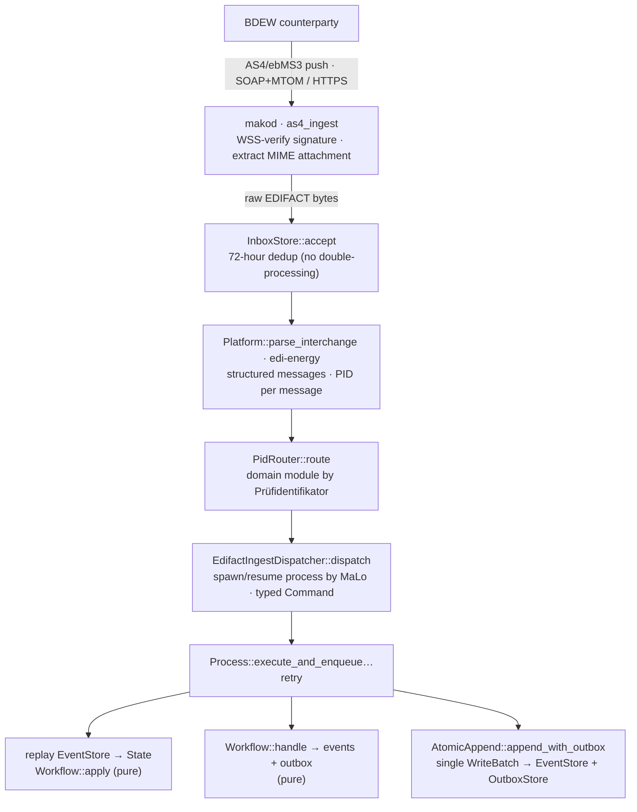
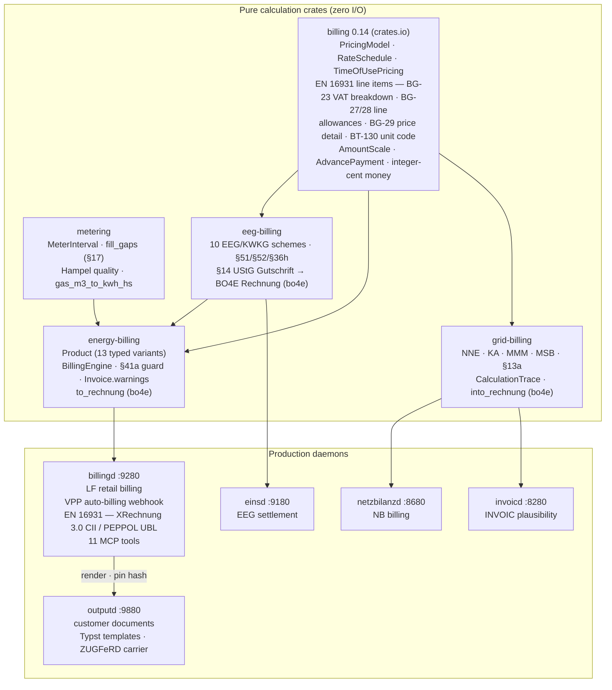
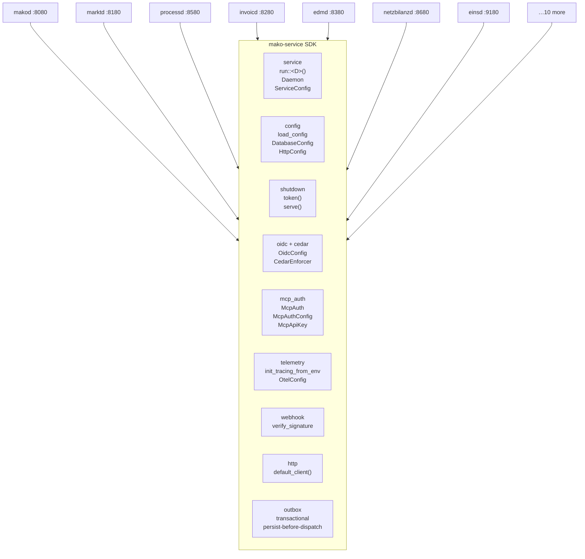
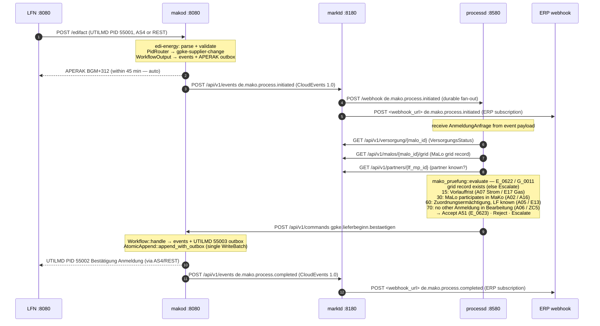

+++
title = "Architecture"
description = "How the platform fits together: the event-sourced engine, domain model, deadlines, and ERP/API integration."
weight = 2
sort_by = "weight"
template = "section.html"
page_template = "page.html"
+++
This document covers the design of `mako-engine` and the full service mesh:
event-sourced process runtime, inbound/outbound transport channels, ERP
integration via BO4E + CloudEvents 1.0, and the SlateDB persistence layer.
It also describes the **seventeen** production daemons and the `mako-service` shared
infrastructure library they build on.

---

## Design principles

| Principle | Consequence |
|---|---|
| **Protocol processor, not a business system** | `makod` handles EDIFACT, BDEW rules, AS4 delivery, and regulatory deadlines. Contract data and billing logic live in your ERP. |
| **`Workflow::handle` and `Workflow::apply` are pure functions** | All I/O, parsing and clock access happens at the transport boundary, before a command is constructed — so processes are deterministic, replayable and trivially testable |
| **Atomic dual-write** | Events and outbox entries go into one `WriteBatch` via `AtomicAppend::append_with_outbox`. No two-phase commit, no compensation path for a lost APERAK |
| **Event sourcing** | State is rebuilt by replaying the append-only log, so audit trails, bug reproductions and format-version migrations fall out of the model |
| **Format-version coexistence** | Two Formatversionen run in one instance; a process started under the old one finishes under its rules |
| **Persist before dispatch** | The outbound CloudEvent is written in the same transaction as the business row, and a worker delivers it afterwards |
| **One deployment, one operator** | Isolation between market operators is per-deployment, not row-level SaaS tenancy |
| **Capabilities grouped by regulatory domain** | No `notificationd`, `documentd`, `forecastd` or `anomalyd` — a capability sits with the obligation it answers for |
| **No API gateway** | Each daemon terminates its own OIDC/JWT and, where it authorises, evaluates Cedar itself |

### Persist before dispatch

`makod` writes the event and its outbox entry in one SlateDB `WriteBatch`; the
PostgreSQL services share `mako_service::outbox` (`enqueue(&mut tx, &ce)` plus
`OutboxWorker`). Delivery is at-least-once, retried and dead-lettered, so a crash
between persisting and dispatching is never a data-loss event — the receiver
dedups on the CloudEvent `id`.

### One deployment, one operator

Where a `tenant` column or `TenantId` appears, it carries the operator's own
MP-ID. It scopes data to the configured party — several LF brands may share one
`productd` — but it does not implement cross-operator multi-tenancy. Isolation
between operators means separate processes, databases and AS4 identities.

### Capabilities grouped by regulatory domain

Forecasting (§ 40a Abs. 2 EnWG) and anomaly detection live in `edmd` because both
operate on the same metering series under the same legal basis; payments live in
`accountingd` because they are one side of the Kontokorrent.

Documents split along that seam rather than against it. The *content* — amounts,
VAT breakdown, legal basis, the EN 16931 payload — stays with the billing service
that computes it and answers for it. The *rendering* — template store, ZUGFeRD
carrier, Textform proofs — is `outputd`, because one brand has one template store
and a logo change must reach the invoice and the Mahnung alike.

Splitting by technical function instead would put one regulated obligation across
two services and force a distributed transaction where today there is a row and
an outbox entry. Notification is not a service at all: it is
`mako_service::webhook` plus marktd's durable fan-out.

### No API gateway

A daemon that authorises evaluates Cedar against a resource it fully understands
— `MaKo::Command` carries `marktrolle` and `pid`, `MaKo::ProcessRecord` carries
`workflow`. A gateway would have to re-derive that domain context to make the
same decisions, and would become a second place where authorisation can be
wrong. What genuinely belongs at the edge — TLS termination, rate limiting beyond
the per-peer GCRA each port already applies, IP allowlisting — is the
deployment's ingress to provide.

Three daemons do not hold a Cedar policy of their own, and each has a reason:

| Daemon | Gate | Why |
|---|---|---|
| `makod` | its own `CedarAuthorizer` over `src/cedar/default.cedar` (or the shipped `conservative.cedar`) | predates the SDK's `CedarEnforcer` and carries MaKo-specific resource types (`MaKo::Command`, `MetricsResource`, `PartnerResource`) |
| `agentd` | agentplane's policy, embedded from `policy/agentd.cedar` | the agent plane owns the tool-grant decision, so re-deciding it in an HTTP layer would be a second answer |
| `portald` | `vertragd`'s Cedar policy, relayed | `portald` forwards the customer's own token to `vertragd`, which owns the customer record; `src/auth.rs` is the single gate and `tests/authorization_guard.rs` drives every route against a refusing `vertragd` |

`productd`'s § 41c EnWG comparison feed (`GET /api/v1/comparison-feed`) is
deliberately unauthenticated: the law obliges publication to independent
comparison instruments, and an obligation discharged only behind a bearer token
is not discharged. The exemption is bounded by the query rather than by a second
credential — the feed reads only `PUBLISHED` rows in an allow-listed set of
categories, and a guard asserts that exactly those two routes are exempt. See
[`productd` Operator Guide](@/docs/services/productd.md).

---

## Service topology

Every inbound message enters through **makod** (the protocol edge), which turns it
into a CloudEvent. **marktd** is the data-and-event backbone: it owns the market
master data and fans those events out to the consuming services. Commands flow back
to makod, which renders and dispatches the outbound EDIFACT. Each service is detailed
in its own section below.


### Inbound message pipeline

How a single AS4 EDIFACT interchange becomes committed process state inside makod:



The parse → route → dispatch → append chain is deterministic and idempotent: the
same interchange, redelivered, dedups at the inbox and no-ops at the event store.

---

## Domain library crates

These are the pure, zero-I/O library crates that domain logic is extracted into.
Each is independently testable and suitable for crates.io publication.

| Crate | Role | Key API |
|---|---|---|
| `edi-energy` | EDIFACT parse / validate / build | `parse()`, `Platform`, `Validator` |
| `mako-engine` | Event-sourced process runtime | `Workflow`, `EventStore`, `OutboxStore`, `DeadlineStore` |
| `mako-markt` | Market data domain types + repo traits | `MaloId`, `MeloId`, `MarktpartnerId`, `VersorgungsStatus` |
| `mako-fristen` | The German market calendar — every Frist, and what "today" means | `heute`/`berlin_date`/`berlin_midnight`; `add_werktage`, `deadline_at_werktage`, the BDEW holiday table; `antwort`/`meldung`/`vorlauf` per-Prüfidentifikator windows |
| `grid-billing` | NNE/KA/MMM/MSB grid **settlement** engine | `settle_nne`, `SettlementResult` (+ `CalculationTrace`, `LegalReference`); `Sparte` drives Gas/Strom refs; `reverse()`; rubo4e-free core, opt-in `bo4e` feature → `into_rechnung()` |
| `energy-billing` | Pure multi-product retail energy billing (LF) | `Product` (13 categories) through `BillingEngine`; §14a controllable loads; Strom-/Energiesteuer Tarife with Entlastung kept out of the amounts; HT/NT, block tariffs, RLM demand charge; calendar-exact proration; EN 16931 category `O`; §41a EPEX; `Invoice::merge` / `allocate_proportionally`; optional `eeg` and `bo4e` features; zero I/O |
| `eeg-billing` | Pure EEG/KWKG feed-in settlement (NB) | `calculate_settlement`, 10 settlement schemes, §51/§52 rules, `InbetriebnahmeTyp`, proptest invariants; statutory anzulegende Werte per §§40–45 with each Erzeugungsart's own annual Absenkung; opt-in `bo4e` feature → **§14 UStG Gutschrift** (`settlement_to_gutschrift` → BO4E `Rechnung` with per-rate USt breakdown) |
| `mako-invoic` | The INVOIC settle/dispute process, once — shared by all four billing families (GPKE, WiM, GaBi Gas, GeLi Gas) | `InvoicFamily` (PID set · deadline label · the two role capabilities), `InvoicWorkflow<F>`, `InvoicState`/`InvoicEvent`/`InvoicCommand` |
| `invoic-checker` | INVOIC plausibility — the eight-stage pipeline (Storno reference · period · Zahlungsziel · currency · arithmetic · total · Umsatzsteuer · tariff) | `InvoicCheckEngine::check`, `CheckOutcome` |
| `mako-pruefung` | The published **Antwortcode** decision trees, executable | `nb`/`lf`/`msb`/`mabis` modules behind `role-*` features; `codes::lookup` resolves a code **within** its EBD; `Cluster` (8 variants incl. MaBiS `Abweisung` / list / `Reklamation`) picks the answer PID; unknown facts escalate, never guess |
| `mako-obs` | Process observability types | `ProcessProjection`, `KpiReport`, `DeadlineRisk` |
| `mako-events` | Compile-time catalog of every CloudEvents `type` in the workspace — zero dependencies | one `pub const` per type across 16 bounded-context modules (`mako`, `markt`, `billing`, `invoic`, `gabi`, `vertrag`, …); `all()` enumerates them; `matches()` is the one glob matcher every subscription mechanism uses |
| `mako-service` | **Service SDK** — cross-cutting infrastructure for all 17 daemons | `run::<D>()` with the `Daemon` / `ServiceConfig` traits, `load_config`, `DatabaseConfig`, `HttpConfig`, `shutdown::token/serve`, `OidcConfig::build_verifier`, `McpAuth`, `McpAuthConfig`, `init_tracing_from_env`, `CedarEnforcer`, `outbox`, `ServiceBuilder` |

### `mako-events` — one catalog, no transport

`mako-events` is a leaf: constants and logic *about* CloudEvents types, and
nothing else. Emitters and subscribers reference the constants instead of inline
string literals, so a rename is a one-line change and a producer/consumer
mismatch is a compile error rather than an event nobody receives. It carries no
envelope type, no HTTP client and no serialisation — `mako_service::CloudEvent`
is the envelope, `mako_service::outbox` the transport.

Naming is enforced by tests in the crate: every type is lowercase reverse-DNS
starting `de.`, and a multi-word segment joins its words with `-`, never `_`.
One namespace is held to German participles — `de.vertrag.*`, so
`de.vertrag.gekuendigt` rather than `.cancelled`. The rule is about the
*participle*, not the noun, and it does not make `.updated` and `.geaendert`
synonyms: in `de.markt.*` they name different facts, any master-data write
against a regulated GPKE Stammdatenänderung that carries its patch.

A constant's doc comment carries its delivery status, and it is worth grepping
before building against one: `⚠ phantom:` means the type is subscribed but has
no emitter yet — ten of the fourteen `de.gabi.*` types are in that state —
and `orphan emit:` means the reverse.

Glob patterns are not catalogued — only concrete types are — but `matches()` is
where a pattern is *evaluated*: `*` matches any (possibly empty) sequence, `?`
exactly one character, everything else is literal. Before it existed, marktd's
subscription filter and agentd's trigger patterns each carried their own matcher
with silently different semantics (exact-plus-prefix against full glob), so a
mid-pattern glob such as `de.*.rechnung.*` matched in one and not the other.

### Billing crate hierarchy



### `energy-billing` — LF retail billing engine

The `energy-billing` crate uses a **typed `Product` enum** as the primary dispatch mechanism.
Each product category has its own struct — no flat god-struct with 50 optional fields:

```
Product::Strom(ElectricityProduct)           → ElectricityProvider / DynamicElectricityProvider
Product::Waermepumpe(ControllableLoadProduct) → ControllableLoadProvider (§14a)
Product::Wallbox(ControllableLoadProduct)     → ControllableLoadProvider (§14a)
Product::Gas(GasProduct)                      → GasProvider
Product::Waerme(HeatProduct)                  → HeatProvider
Product::Wasser(WaterProduct)                 → WaterProvider (Trinkwasser + Abwasser)
Product::Solar(SolarProduct)                  → SolarProvider
Product::Eeg(EegProduct)                      → EegProvider
Product::Einspeisung(EinspeisungProduct)       → EinspeisungProvider
Product::Hems(HemsProduct)                     → HemsProvider
Product::Emobility(EmobilityProduct)           → EmobilityProvider
Product::Energiedienstleistung(ServiceProduct) → ServiceProvider
Product::Sharing(SharingProduct)               → ElectricityProvider + EnergyShareProvider
```

`ControllableLoadProduct` uses `#[serde(flatten)] base: ElectricityProduct` — the standard
electricity billing is delegated to `ElectricityProvider`, then §14a credit positions are appended.


The engine runs in passes:

```
Pass 0  validate_warnings()      §41a iMSys guard · KEIN_ARBEITSPREIS · § 42a cap
Pass 1  commodity / levy providers   (per-variant provider)
Pass 2  tax provider                 (MwStProvider — groups by applicable_tax_rate)
Pass 3  Abschlag deductions          (Final invoice reconciliation)
Pass 4  Minimum invoice top-up       (B2B Mindestabnahmeverpflichtung)
Pass 5  Cancellation sign reversal   (Stornorechnung)
```

### External crates.io dependencies

| Crate | Version | Purpose |
|---|---|---|
| [`billing`](https://crates.io/crates/billing) | `0.14` | Generic billing engine — fixed-point `Amount`, pricing models, document assembly, sum-exact allocation |
| [`en16931`](https://crates.io/crates/en16931) | `0.6` | EN 16931 semantic invoice model and business-rule validation |
| [`en16931-formats`](https://crates.io/crates/en16931-formats) | `0.6` | EN 16931 renderers over that model — XRechnung/CII, PEPPOL UBL and the ZUGFeRD carrier |
| [`sepa`](https://crates.io/crates/sepa) | `0.6` | SEPA payment utilities — IBAN/BIC validation, pain.001/008/007 generation, camt.05x and pain.002 parsing |
| [`metering`](https://crates.io/crates/metering) | `0.22` | German energy metering domain — intervals, aggregation, gap filling, quality scoring, GGV allocation |
| [`meterstore`](https://crates.io/crates/meterstore) | `0.9` | Metering time-series store beneath `edmd` — hot PostgreSQL window, settled Iceberg V2 history, version resolution |
| [`doubleentry`](https://crates.io/crates/doubleentry) | `0.7` | Double-entry ledger — append-only BLAKE3 Merkle log, inclusion and consistency proofs, period seals |
| [`rubo4e`](https://crates.io/crates/rubo4e) | `0.13` | BO4E business-object types — the `rubo4e::current` versioned schema with validation |
| [`agentplane`](https://crates.io/crates/agentplane) | `0.25` | Durable agent runtime behind `agentd` — journaled effects, typed manifests, human triage |
| [`asx-rs`](https://crates.io/crates/asx-rs) | `0.13` | AS4/ebMS3 stack under the BDEW MaKo profile |
| [`edifact-rs`](https://crates.io/crates/edifact-rs) | `~0.17` | EDIFACT syntax layer beneath `edi-energy` — parse, serialise, directory validation |

---

## Companion daemons

All **17** daemons share a common operational model:
- **TOML configuration** — loaded from a file (`makod.toml`, `marktd.toml`, …) with `env:VAR_NAME` secret interpolation
- **Cedar ABAC** — attribute-based authorisation on the HTTP surface. Fourteen daemons hold their own policy file and evaluate it through `mako_service::cedar::CedarEnforcer`; `makod` and `agentd` evaluate their own embedded policies, and `portald` relays `vertragd`'s verdict. See [No API gateway](#no-api-gateway)
- **OIDC/JWT** — asymmetric algorithm only; JWKS cached with background refresh; omit `[oidc]` for dev mode
- **OpenTelemetry** — OTLP traces on all workflow commands, event appends, and webhook deliveries

**MCP server** — a `POST|GET /mcp` endpoint (MCP Streamable HTTP) for
LLM tooling — is exposed by **15 of the 17**: all except `outputd`
and `agentd`, which is the MCP *host* that calls the others.

Every daemon's port, market role and purpose is maintained once, in the
[Services section](@/docs/services/_index.md) — one operator guide per daemon.
`makod` is the protocol gateway the rest of the platform sits behind:
EDIFACT ↔ BO4E, 71 workflows over 469 Prüfidentifikatoren, AS4 ingest and the
deadline scheduler. The sections that follow describe only the daemons whose
internal design this page has to explain.

### `marktd` — Market Data Hub (`:8180`)

`marktd` is the single source of truth for market entity state. Every `PUT`
crosses [the BO4E gate](@/docs/architecture/domain-model.md#the-bo4e-gate) and
every refusal is a 422 with the same `code`; reads return typed
`rubo4e::current` objects.

| Entity | Stored beyond the BO4E object |
|---|---|
| **Marktlokation** | `netzebene`, `bilanzierungsgebiet`, `gasqualitaet`, `energierichtung`, `bilanzierungsmethode`, `regelzone`, `fallgruppe` |
| **Messlokation** | `netzebene_messung`, `regelzone`, `standorteigenschaften` |
| **VersorgungsStatus** | one row per MaLo with full history; `?at=YYYY-MM-DD` answers point-in-time |
| **MaLo-Netztopologie** | `malo_grid`, written through the NB-role `PUT /api/v1/malos/{malo_id}/grid` |
| **Netz-Element-Lokation** | Redispatch 2.0 columns `steuerkanal`, `eigenschaft_msb_lokation`, `grundzustaendiger_msb_codenr` |
| **Technische / Steuerbare Ressource** | E-Mobilität, Erzeugung, Speicher; `konfigurationsprodukte` holds the contracted iMS control products |
| **Zähler** | the register list at `GET /api/v1/zaehler/{id}/zaehlwerke` |
| **Zählzeitregister + Saison** | HT/NT/EINZEL definitions with ISO weekday bitmasks and local-time bounds |
| Contracts, Marktpartner, `NbContractRecord`, Preisblätter | NNE, Messung, KA, Dienstleistung, Hardware |

`GET /api/v1/zaehler/{id}/tariff-zone?datetime=ISO` resolves the active zone in
one join, which is what lets `billingd` classify quarter-hour intervals into
HT/NT bands for §14a Modul 2 without per-meter configuration.

**ZaehlzeitRegister auto-population from WiM Stammdaten:** when `makod` receives a WiM
ORDERS response (PIDs 17102–17133) from the MSB, the `extract_zak_ze_zaehlwerke()` adapter
parses ZAK+ZE+ZD segments and emits a `de.mako.process.completed` event carrying the parsed
register data. `marktd`'s `event_ingest` handler upserts `ZaehlzeitRegister` +
`ZaehlzeitSaison` rows automatically — operators do not need to configure TOU registers
manually for meters where the MSB sends Stammdaten responses.
**Geraete** returning typed `rubo4e::current::Geraet`,
and the full **`Lokationszuordnung` location graph** (temporal `valid_from`/`valid_to` edges,
recursive-CTE BFS traversal via `GET /api/v1/malos/{id}/lokationen`).

`makod` pushes `de.mako.process.*` CloudEvents to `marktd`'s ingest endpoint.
Fan-out is **persist-before-fan-out**: every produced event is written to the
durable `event_log` outbox (the full envelope) in the same step that accepts it,
and a two-phase worker drains it — Phase 1 snapshots the matching subscriber set
into an `event_delivery` ledger, Phase 2 delivers each row (claim-with-lease,
`FOR UPDATE SKIP LOCKED`). A crash at any point is recoverable from those tables —
there is no in-memory relay channel an event could be lost in. `event_log` also
backs full replay via `GET /admin/events?from=&to=&type=&limit=`.
W3C Trace Context (`traceparent`, `tracestate`) from the originating `makod` event is
forwarded unchanged in every outbound webhook, enabling end-to-end distributed traces.

`marktd` fans events out to all registered subscribers via HMAC-SHA256-signed HTTP webhooks.
The `VersorgungsStatus` is derived automatically from the process events, and the
derivation keys on **which answer PID arrived**, not merely on the process
completing:

| Event + PID | Action | Effect |
|---|---|---|
| `initiated` + 55001/55077/44001 | `announce_lf_next` | inserts an `Angekuendigt` row; the **first** announcement wins |
| `completed` + 55002/55078/44002 (Bestätigung Anmeldung) | `confirm_supply` | the `Angekuendigt` row becomes `Aktiv` |
| `completed` + 55003/55080/44003 (**Ablehnung** Anmeldung) | `clear_lf_next` | deletes the `Angekuendigt` rows — a rejection retires the announcement, it does not begin supply |
| `completed` + 55005/44005 (Bestätigung Lieferende) | `end_supply` | deletes the `Aktiv` rows → `Unbeliefert`; any `Angekuendigt` row survives for the pending transition |
| `completed` + 55013/44013 (Zuordnung EOG) | `begin_eog_supply` | `Ersatzversorgung`/`Grundversorgung` per `data.eog_art`; `eog_seit` anchors the §38 Abs. 2 three-month clock |

When 55005/44005 ends a supply and **no successor is announced**, `marktd` emits
`de.markt.versorgung.gap-detected` — the §38 EnWG gap-closure trigger `processd`
consumes. A successful EOG start emits `de.markt.versorgung.eog-begonnen`.

Every supply-state change is written to `versorgungsstatus_history`, enabling
both full audit logs and bitemporal "as-of" queries by date. Each action is
idempotent under at-least-once delivery, and a failure rolls back the whole
transaction — the idempotency marker included — so `makod` redelivers rather than
leaving the projection behind.

Per-subscriber deliveries are retried with exponential back-off and, after
exhausting all attempts, marked `dead_lettered_at` in `event_delivery` (a
status-column DLQ) rather than silently dropped. This durable path ensures § 147
AO / GoBD compliance — a silent drop of a `de.mako.process.initiated` event to
`invoicd` would prevent the INVOIC plausibility check from running. Operators
inspect and retry via `GET /admin/fanout/dlq`,
`POST /admin/fanout/dlq/{event_id}/{subscriber_id}/retry` and
`DELETE /admin/fanout/dlq/{event_id}/{subscriber_id}`.

`marktd` is a **pure data hub** — it stores market entity state and fans out
CloudEvents to subscribers but contains no domain policy. Automated Anmeldung
decisions live in `processd`'s NB module.

See [`marktd` Operator Guide](@/docs/services/marktd.md).

### `processd` — Process Decision Engine (`:8580`)

`processd` consumes `de.mako.process.initiated` CloudEvents from `marktd` and
makes automated decisions within regulatory deadlines.

**NB module** (`--features nb-only` or `integrated`):
- Handles GPKE Lieferbeginn (55001/55016) and GeLi Gas Lieferbeginn (44001)
- Fetches `VersorgungsStatus` + `MaloGridRecord` from `marktd`
- Evaluates 6 objective checks via the pure `mako-pruefung` library
- Dispatches `bestaetigen`/`ablehnen` to `makod` with § 7a Abs. 5 EnWG Gleichbehandlung logging
- STP improves when the `malo_grid` record is present (provisioned via marktd's NB-role `PUT /api/v1/malos/{malo_id}/grid` endpoint — manual/ERP provisioning)

**LF module** (`--features lf-only` or `integrated`):
- Answers the NB-initiated GPKE processes (inbound 55007 and 55010) within their published Frist — a clock time on the 1. Werktag nach dem ÜT, resolved per PID from `mako_fristen::antwort`, never a flat 24 h
- Auto-consents clean Abmeldungen; auto-rejects Einzug (A32) scenarios
- Queues ambiguous cases in `approval_queue` for ERP operator review

See [`processd` Operator Guide](@/docs/services/processd.md).

### `invoicd` — Automated Billing Settlement (`:8280`)

`invoicd` is the autonomous INVOIC plausibility-check pipeline for the
Lieferant role. It subscribes to `de.mako.process.initiated` events from `marktd`,
runs the eight-stage pipeline (Storno reference, period validity, Zahlungsziel,
currency agreement, position arithmetic, document total, **Umsatzsteuer** —
including that the per-rate `steuerbetraege` breakdown sums to `gesamtsteuer`,
which is what the recipient's Vorsteuerabzug is computed from — and the tariff
match against the applicable **Preisstaffel**), persists the receipt to
PostgreSQL, then issues the accept or reject command of the answering PID's own
family back to `makod` — `gpke.abrechnung.*`, `wim.rechnung.*`, `gabi.rechnung.*`
or `invoic.*`, per the routing table below.

The PostgreSQL persistence provides a durable audit trail of all received
invoices, plausibility outcomes, and check findings — satisfying the 8-year
Buchungsbelege retention under § 147 AO / GoBD and the §41 EnWG
invoice-content requirements.

**Supported PIDs** — one pipeline, one routing table (`src/routing.rs`), ten
inbound INVOIC PIDs across four answer-command families. A PID with no route is
ignored, never answered with a default command, and the subscription filter is
derived from the same table:

| PID | Meaning | Answer commands |
|---|---|---|
| 31001 | Abschlagsrechnung Netznutzung | `gpke.abrechnung.*` |
| 31002 | NN-Rechnung — both Sparten | `gpke.abrechnung.*` |
| 31003 | WiM-Rechnung Dienstleistungen im Messwesen — both Sparten | `wim.rechnung.*` |
| 31004 | Stornorechnung — Sparte-neutral, any process | `invoic.stornorechnung.*` |
| 31005 | MMM-Rechnung Strom | `gpke.abrechnung.*` |
| 31006 | MMM Mehrmenge, selbst ausgestellt | `gpke.abrechnung.*` |
| 31007 | GaBi Gas MMM-Rechnung | `gabi.rechnung.*` |
| 31008 | GaBi Gas MMM, selbst ausgestellt | `gabi.rechnung.*` |
| 31009 | WiM MSB-Rechnung | `wim.rechnung.*` |
| 31011 | Rechnung sonstige Leistung — Sparte-neutral | `invoic.sonstige-leistung.*` |

31003 is **not** a Gas Netznutzungsrechnung: it bills the Dienstleistungen the
abgebender MSB rendered — temporäre Fortführung, Geräteübernahme, Zwischen- oder
Kontrollablesung — so it prices against `PreisblattMessung` like 31009 does.

**Payment lifecycle:**
- `POST /api/v1/receipts/{id}/confirm-payment` — ERP calls when bank transfer confirmed; sets `payment_confirmed_at`
- `GET /api/v1/zahlungsstatus/{malo_id}` — pending / settled / overdue counts per MaLo for AR reconciliation
- `POST /api/v1/selbstausstellen` — self-issued Mehrmengen-Rechnung, INVOIC 31006
- `GET /api/v1/overdue-remadv` — receipts approaching Zahlungsziel without REMADV
- `de.invoic.payment.overdue` CloudEvent emitted every 6 h by `payment_overdue` worker for overdue receipts
- MCP tools: `get_receipt`, `get_check_result`, `list_disputes`, `list_exceptions`, `list_overdue_remadv`, `get_zahlungsstatus`, `summarize_billing_month`

### `edmd` — Energy Data Management (`:8380`)

`edmd` stores MSCONS meter readings received from `marktd` and makes them
queryable via a REST time-series API. It is the authoritative source of
LF-side metered consumption data for Mehr-/Mindermengen (MMM) imbalance
calculations and billing plausibility.

Key facts:
- Subscribes to `de.mako.process.completed` events from `marktd` where `makopid`
  is in `edmd::domain::ALL_MSCONS_PIDS` — the Messwesen set `MSCONS_PIDS`
  (13005–13027, excluding 13003 MaBiS and 13013 GaBi Gas) plus the Redispatch 2.0
  Ausfallarbeit/meteorological PIDs 13020–13023 and 13026. Those last are stored
  here for OLAP and archive even though `mako-redispatch` owns their workflow
  routing; the two concerns are orthogonal.
- Stores typed kWh interval reads with `(malo_id, dtm_from, dtm_to)` primary key.
- `GET /api/v1/deliveries/{malo_id}` returns **BO4E `Energiemenge` objects** —
  each read mapped to `{ obisKennzahl, menge: { wert, einheit: KWH }, zeitraum }`,
  ready for direct ERP billing-import without EDIFACT parsing.
- `GET /api/v1/lastgang/{malo_id}` (BO4E `Lastgang`, grouped by OBIS register),
  `GET /api/v1/zeitreihe/{malo_id}` (BO4E `Zeitreihe`, commodity metadata), and
  `GET /api/v1/billing-period/{malo_id}?from=&to=`.
- `MeterBillingPeriod` provides `arbeitsmenge_kwh`, `spitzenleistung_kw` (RLM Strom),
  `brennwert_kwh_per_m3` + `zustandszahl` (Gas) for billing plausibility
  and NNE invoice generation.
- Pre-aggregated `meter_billing_periods` table  for fast billing queries.

### `obsd` — Business-Process Observability (`:8480`)

`obsd` projects all `de.mako.*` CloudEvents from `marktd` into a queryable CQRS
read-model of running and completed MaKo processes. It has no authoritative
state — the projection is fully rebuildable by replaying the event stream.

Key facts:
- Wildcard subscription to all `de.mako.*` events from `marktd`.
- One `process_projections` row per MaKo process, with state, deadline, and
  pre-computed `deadline_risk` (`green` / `amber` / `red` / `overdue`).
- `GET /obs/processes`, `GET /obs/kpis`, `GET /obs/overdue` REST endpoints.
- BNetzA KPI report via `GET /obs/kpis?pid=55001&period=2025-10`.
- Integrates with Alertmanager: `GET /obs/overdue` as a Prometheus alert target.

See [`obsd` Operator Guide](@/docs/services/obsd.md).

### `netzbilanzd` — NNE/KA/MMM Billing Daemon (`:8680`)

`netzbilanzd` automates the outbound billing cycle for the NB role: generating
Netznutzungsentgelt (NNE), Konzessionsabgabe (KA), Mehr-/Mindermengen (MMM), and
MSB-Rechnung invoices, running `invoic-checker` self-validation, and dispatching
via `makod` as INVOIC 31001/31002/31005/31009.

Key facts:
- **`grid-billing` pure library** — all monetary arithmetic uses `rust_decimal::Decimal` via `EuroAmount`,
  zero floating-point money. Returns `SettlementResult` — no `rubo4e` dependency.
  Every position carries `CalculationTrace { explanation, legal_refs, tariff_source, … }` for full audit.
  `Sparte::Gas` automatically selects `GasNEV §14` legal references; the NN-Rechnung PID is 31002 for both Sparten. `KaKundengruppe` annotates the KAV tier.
  The service layer (`netzbilanzd`, `invoicd`) owns the `into_rechnung()` conversion.
  The same library is used by `invoicd` for LF selbstausstellen (PID 31006).
- **Operator-supplied inputs** — `POST /api/v1/billing/run` accepts meter readings and tariff data
  directly in the request body. `netzbilanzd` does not query `marktd` or `edmd` autonomously,
  making each billing run idempotent by design.
- **Self-validation before draft** — checks 1–3 (period, arithmetic, total) run immediately
  after generation. A `CheckReport { outcome: Dispute }` never reaches `invoice_drafts`.
- **Operator review step** — generated invoices land in `invoice_drafts` with status `draft`.
  An explicit `PUT /api/v1/billing/drafts/{id}/dispatch` is required to send via `makod`.
  Pre-dispatch re-validation blocks erroneous invoices from reaching counterparties.
- **`invoice_drafts` lifecycle** — five states, because the row keeps living after
  it goes on the wire: `draft → dispatched` (operator approval) or `→ rejected`
  (operator rejection, or a pre-dispatch `Dispute`); a dispatched invoice then
  reaches `paid` on a REMADV 33001 or `disputed` on a REMADV 33002/33003/33004.
  The counterparty's dispute and the operator's own rejection are deliberately
  different states with different columns — `remadv_ref` and the ERC code against
  `reject_reason` — because they are different events with different consequences.
- **Corrections never modify the original.** `rechnungsart` is
  `RECHNUNG`/`STORNORECHNUNG`/`KORREKTURRECHNUNG`, and a non-`RECHNUNG` row must
  carry both `original_draft_id` and a `korrektur_grund`
  (`grid_billing::KorrekturGrund`) — a CHECK constraint, not a convention.

See [`netzbilanzd` Operator Guide](@/docs/services/netzbilanzd.md).

### `sperrd` — Sperr-/Entsperrauftrag Execution Queue (`:8780`)

The Netzbetreiber's work queue for the physical acts GPKE orders it to perform.
An ORDERS **17115 Sperrauftrag** or **17117 Entsperrauftrag** from a Lieferant
becomes a job for the field team; the outcome goes back as **IFTSTA 21039**
(Auftragsstatus Sperren `STS+Z37` / Entsperren `STS+Z38`). Without that message
the LF's `gpke-sperrung-lf` process never terminates.

Key facts:
- **Market inbox** — `POST /webhook` consumes `de.mako.process.initiated` for PIDs
  17115/17117 and creates the work order, keyed on the `makod` process so an AS4
  redelivery cannot queue a second disconnection. 17116 (Anfrage Sperrung, NB→MSB)
  is deliberately not queued: it is a question, not an order.
- **The row is the ORDERS** — `DTM+203` fixed date *or* `DTM+469` earliest start
  (mutually exclusive), `IMD+7081` Arbeitszeit, and the `SG2 NAD+Z24` Treffpunkt
  the technician actually travels to.
- **Lifecycle**: `pending → executed | failed | cancelled`. The transition is a
  single guarded `UPDATE`, so a concurrent execute and fail cannot both put a
  message on the wire.
- **The IFTSTA is a queue, not a one-shot** — a failed dispatch keeps the field
  report and schedules a retry under the same idempotency key; exhausting the
  budget announces `de.sperr.iftsta.ausstehend` once. `/stats` separates
  `iftsta_outstanding` (in flight) from `iftsta_stuck` (needs a human).
- **Three published clocks** (BK6-24-174 GPKE Teil 2 §§ 3.5.1.2 / 3.5.2.2): the
  ORDRSP is due the 1. WT nach dem ÜT (`makod`); the physical act within
  **6 Werktage** after the frühestmöglicher Sperrtermin; the IFTSTA 21039 the
  1. WT nach dem Abschluss des Auftrags. The Lieferant's `DTM+203`/`DTM+469` is a
  fourth date — what the LF asked for, not what the Festlegung requires.
- **Two Sperrversuche** per Sperrauftrag (§ 3.5.1.2 Nr. 5): the first failed
  visit is recorded and the order stays queued.

See [`sperrd` Operator Guide](@/docs/services/sperrd.md).

### `mako-service` — Service SDK (library)

`mako-service` is the **shared SDK** that every mako daemon builds on. It eliminates
cross-cutting boilerplate so service code focuses exclusively on domain logic.



| Module | Key exports |
|---|---|
| `service` | `run::<D>()`, `Daemon`, `ServiceConfig`, `ServiceContext` — the daemon lifecycle runner |
| `config` | `load_config`, `DatabaseConfig`, `HttpConfig` — layered TOML + env-var + `_FILE` secrets |
| `shutdown` | `token()` (SIGINT + SIGTERM), `serve()` — graceful connection drain |
| `oidc` | `OidcConfig`, `OidcVerifier`, `OidcConfig::build_verifier()` — JWKS refresh, dev bypass |
| `mcp_auth` | `McpAuth`, `McpAuthConfig`, `McpApiKey` (SecretString), `McpIdentity` — JWT routing + Cedar + API key |
| `telemetry` | `init_tracing_from_env`, `init_tracing`, `OtelConfig` — structured JSON + OTel OTLP |
| `cedar` | `CedarEnforcer` — Cedar ABAC policy evaluation |
| `health` | `health_routes` — `/health/live` + `/health/ready` |
| `http` | `default_client()` — `reqwest::Client` with 5 s connect + 30 s request timeout |
| `webhook` | `verify_signature` — constant-time HMAC-SHA256 |
| `builder` | `ServiceBuilder` — composable Axum router with health, metrics, trace layer |
| `outbox` | Transactional outbox — persist-before-dispatch + drain worker with retry and dead-lettering |
| `cloudevent` | `CloudEvent`, `post_ce_with_retry`, `source` — the envelope and the publish helper; the type *names* come from `mako-events` |
| `metrics` | `init_metrics` — Prometheus registry and the `/metrics` route |
| `rate_limit` | `RateLimitConfig` — the per-peer GCRA every port applies |
| `worker_lock` | PostgreSQL **session-level** advisory lock — a periodic worker runs on one replica, not once per replica. Held by the connection, so a dead replica releases it with no lease to expire |

#### The daemon runner

Sixteen of the seventeen daemons are `mako_service::run::<D>()` in `main`. The
runner owns the spine every service repeats — init tracing, load `NAME.toml`
plus `NAME_…` env vars, connect a tuned PostgreSQL pool with
`application_name = NAME`, run `Daemon::migrate`, wire the shutdown token,
mount health/metrics/trace routes, bind and serve with graceful drain:

```rust
struct Productd;

impl Daemon for Productd {
    type Config = ProductdConfig;   // impls ServiceConfig: database() + bind_addr()
    const NAME: &'static str = "productd";

    async fn migrate(pool: &PgPool) -> anyhow::Result<()> { /* sqlx::migrate! */ }

    async fn build(cfg: Arc<ProductdConfig>, ctx: ServiceContext) -> anyhow::Result<Router> {
        // ctx.pool() · ctx.http · ctx.shutdown — spawn workers, build the domain router
    }
}

#[tokio::main]
async fn main() -> anyhow::Result<()> { mako_service::run::<Productd>().await }
```

`ServiceConfig::database()` returning `None` marks a stateless daemon: no pool
is connected, no migrations run, and readiness is `Daemon::ready` alone.
`ServiceContext::pool()` panics for such a daemon rather than handing back a
placeholder.

What the runner deliberately does **not** own is what needs the daemon's own
config and state — domain routes, background workers, the OIDC verifier, MCP
auth, the event-bus wiring. Those live in `Daemon::build`.

`makod` is the one daemon outside this shape: it predates the runner and drives
its own `main`, taking `mako-service` piecemeal (`http::default_client`,
`oidc::OidcVerifier`, `telemetry::init_tracing_from_env`).

See the [`mako-service` README](https://github.com/hupe1980/mako/tree/main/crates/mako-service)
for code examples covering every module.

---

## EDM reference architecture mapping

Classic German EDM platforms (Robotron ecount, SAP IS-U EDM, Kisters BelVis)
bundle the whole energy-data value chain into one system. mako distributes
the same layers across single-purpose daemons around one metered-data spine
(`edmd`). The mapping, layer by layer:

| EDM reference layer | Home | Notes |
|---|---|---|
| Data acquisition | `edmd` — MSCONS via marktd webhook, direct iMSys/RLM/Gas push, IoT push, bulk, optional Kafka consumer | All paths converge on the same V01–V09/V11/V12 validation; SMGW registry handles compliance, not transport |
| Time-series database | `edmd` over a `meterstore` hot/cold tier — PostgreSQL recent window + Apache Iceberg/S3 settled history, version-resolved reads, `as_of` reproducible settlement snapshots | `?as_of=` reconstruction; `allocation_version` INITIAL/CORRECTION/FINAL |
| Validation engine (VEE) | `metering::validation` (pure V01–V09/V11/V12) invoked on every ingest path | Annotate-only by design: suspect readings are stored with `quality_warnings`, never discarded — billing blockage is a separate decision |
| Substitute values (§ 60 Abs. 1 MsbG) | `metering::substitute` + `edmd` REST/MCP — linear interpolation, prior-period average, carry-forward, zero-fill; full `substitute_value_log` audit | Manual values enter via the §22 corrections endpoint |
| Calculation engine | `metering` (pure): aggregation, HT/NT, Spitzenleistung, G685 gas conversion, virtual meters, § 13 StromNZV imbalance, §22 EnWG Netzverlust indicator | Fixed typed rules instead of a free-form formula editor — deterministic by construction |
| Forecasting | `edmd /forecast` — § 40a Abs. 2 EnWG Verbrauchsschätzung (daily-average projection with prior-year seasonal correction) | Deliberately no ML runtime in-core; see non-goals |
| Balancing / settlement | `mabis-syncd` (MaBiS Summenzeitreihen, PID 13003, 10-Werktage Erstaufschlag), `netzbilanzd` (NNE/KA/MMM/MSB settlement), `mako-gabi-gas` in makod (GaBi Gas) | edmd serves `/summenzeitreihe` and `/billing-period` to both |
| Market communication | `makod` — 17 EDIFACT message types incl. MSCONS/UTILMD/APERAK/INVOIC/CONTRL, deadline scheduler, CONTRL/APERAK auto-acknowledgement | Protocol processor by design; business state lives in the daemons |
| Billing interface | `billingd` (LF retail, §40–§42 EnWG) and `invoicd` (INVOIC plausibility via `invoic-checker`) consume edmd's `MeterBillingPeriod` and Lastgang | edmd stays billing-free: it answers "what flowed", never "what it costs" |
| Reporting & analytics | `obsd` (BNetzA KPI, § 7a Abs. 5 EnWG Gleichbehandlung report), edmd OLAP (`/archive/*`, `/query/sql`, Arrow IPC), `portald` (customer dashboard), `agentd` (LLM analytics over MCP) | Headless: cockpit rendering is a frontend concern |
| Workflow automation | Config-gated workers per daemon: edmd meterstore archival (via the meterstore maintenance loop) + CLS/SMGW compliance, billingd §40b billing runs, accountingd Abschlag/SEPA/dunning, mabis-syncd submission windows | mmma-worker pattern: hourly tick, gated, idempotent via SQL claim |

**Deliberate non-goals** (differences to the monolithic reference, by design):

- **No SCADA/Leittechnik acquisition** — mako is a market-communication and
  metering platform; grid operation systems stay upstream and can push via
  the IoT/bulk APIs.
- **No in-core ML forecasting** — `metering` is pure and deterministic; an
  ML runtime (ONNX/PyTorch) would belong in a dedicated service that reads
  edmd and writes forecast series back as `CALCULATED` quality.
- **No weather ingestion** — Redispatch 2.0 meteorological MSCONS (PID
  13021) is stored as time series; a weather-driven forecaster would join
  the ML service above.
- **Water has no market process** — `Sparte::WASSER` reads are stored and
  validated in `metering`/`edmd`, and multi-utility retail invoicing is
  covered by the `energy-billing` WASSER category (Trinkwasser +
  gesplittete Abwassergebühr). There is no water market communication —
  no EDIFACT, no MaKo processes.
- **No operator cockpit UI** — every layer is API/MCP-first; obsd and
  portald serve machine-readable projections for whatever frontend the
  operator runs.

## End-to-end: UTILMD 55001 Lieferbeginn

This sequence traces a complete GPKE supplier-switch from the LF submitting the
Anmeldung to the NB Bestätigung being delivered back.



**Key timing guarantees:**
- APERAK BGM+312 (step 2): within 45 minutes per APERAK AHB §2.4.1
- `processd` decision (steps 7–11): typically < 500 ms from event delivery
- Total LF→NB confirmation: measured in seconds, not minutes

---

## Outbound flows

### AS4 EDIFACT delivery

`OutboxWorker` polls `OutboxStore` every 5 seconds. For each pending message:

1. Render EDIFACT interchange via `edi-energy` builders.
2. Look up trading partner AS4 endpoint in `PartnerStore`.
3. Sign + encrypt with operator BrainpoolP256r1 credentials (`asx-rs` v0.13 — ECDSA-SHA256 + ECDH-ES key agreement via `with_signing_material(cert, key)`).
4. POST via `asx-rs` AS4 sender.
5. On HTTP 200: delete outbox entry. On 4xx/5xx: back-off and retry.

**Self-addressed messages** (`recipient == tenant_party_id`) bypass the AS4
transport entirely.  `BdewAs4Sender` renders the EDIFACT bytes, re-parses
them via `Platform::parse_interchange`, and passes each message to
`EdifactIngestDispatcher::dispatch` for in-process delivery to the correct
workflow.  See [Integrated operators](@/docs/services/makod.md#integrated-operators-nb-msb-same-mp-id)
for the full dispatch table and configuration notes.

### ERP CloudEvents delivery

`OutboxErpWorker` polls `OutboxStore` every 5 seconds. For each ERP-targeted message:

1. Build a [CloudEvents 1.0](https://cloudevents.io) envelope from the `ErpEvent`.
2. Set `Content-Type: application/cloudevents+json`.
3. Sign with `HMAC-SHA256` over the raw body (when `--erp-webhook-secret` is set).
4. POST to the configured `--erp-webhook-url`.
5. On `2xx`: acknowledged. On `429`/`5xx`: exponential back-off. On `4xx`: dead-letter immediately.

See [ERP Integration](@/docs/architecture/erp-integration.md) for the full CloudEvents schema and receiver implementation guide.

### Deadline scheduler

`DeadlineScheduler` ticks every **30 seconds** by default (configurable via
`--deadline-poll-interval-secs`; minimum 1 second). For each due entry in `DeadlineStore`:

1. Reconstruct the `ProcessIdentity` from the deadline record.
2. Dispatch a `TimeoutExpired` command to the workflow.
3. The workflow produces a `DeadlineExpired` event and an `AperakTimeout` outbox entry.
4. The outbox entry routes to `OutboxErpWorker`, which delivers the `de.mako.aperak.timeout` CloudEvent to the ERP.

---

## Domain crate layering

Each domain crate is a thin wrapper that:
- Defines `Command`, `Event`, and `State` enums specific to its regulatory process family.
- Implements `Workflow` with pure `handle` and `apply` functions.
- Registers itself in the `PidRouter` via a `register_*` function called from `makod`.

`makod` wires the domain modules, transport adapters, and the ingest dispatcher
at startup:

```
makod (binary)
├── registers mako-gpke    → PIDs 55001–55024, 55555, 55607–55609, 17115–17117 (Strom NB),
│                            17134/17135, 19001/19002, 31001–31002, 31005–31006, 37000–37006
├── registers mako-wim     → PIDs 55039/55042/55051/55168 + Gas 44039/44042/44051/44168/44183,
│                            31009/31003/31004, 23001–23012,
│                            17001/17002/17009, 19001/19002 (nMSB role), 35001/35002/35004/35005, 15001/15002/15004/15005,
│                            27001–27003, 17011/17118/17121 (Technik-Änderung),
│                            ESA Wertebestellung (Msb role): 35003, 15003, 17007/17008,
│                            39002, 19011–19014
├── registers mako-geli-gas → PIDs 44001–44021, 44022* (Nb role), 44023–44024* (Lf role),
│                             37008–37014, 31011, 17115–17117 (Gas NB)
├── registers mako-mabis   → MSCONS 13001/13003/13010–13012/13020–13023/13026,
│                            IFTSTA 21000–21007, ORDERS 17211,
│                            55065–55067/55069/55070/55073 (Clearingliste, MaBiS-ZP),
│                            55235–55237 (Zuordnung ZP der NGZ zur NZR)
├── registers mako-gabi-gas → PIDs 31007, 31008, 31010, ORDERS 17110, ORDRSP 19110,
│                             MSCONS 13013, DVGW PIDs 70001–70039 (gas transport)
├── registers mako-emob    → NZR-EMob / Modell 2: UTILMD 55238–55243, the three
│                            Modellwechsel legs (Anmeldung · Zuordnungsende · Abmeldung)
├── registers mako-redispatch → Redispatch 2.0 XML workflows
│
└── wires EdifactIngestDispatcher
         ├── called by: AS4 inbound (as4_ingest), REST ingest (edifact_api)
         └── called by: AS4 sender loopback (BdewAs4Sender, recipient == own MP-ID)
```

`*` PIDs 44022–44024 route by **which side of the exchange** the deployment is
on, not by Use-Case: one Stornierung workflow serves the GeLi Gas
Lieferbeginn/-ende and the WiM Gas Kündigung Messstellenbetrieb alike, because
it resolves the Ursprungsprozess from `RFF+ACW`.
- `mako-geli-gas` `geli-gas-stornierung`: any `Nb` role (44022 inbound as GNB)
- `mako-geli-gas` `geli-gas-stornierung-lf`: any `Lf` role (44023/44024 inbound as LFN/LFA)

See [PID Reference](@/docs/regulatory/pid-reference.md) for the complete table.

---

## Billing crate family

Four crates, cut by **legal regime and counterparty pair** — not by technique:

| Crate | Regime | Parties | Core |
|---|---|---|---|
| [`billing`](https://crates.io/crates/billing) (crates.io) | none — generic | any | `Amount<P>` fixed-point money, `RoundingStrategy`, tariff schedules, proration, penny-exact allocation, period documents |
| `energy-billing` | §§40–41b EnWG, StromStG, EnergieStG, BEHG | LF → end customer | retail invoices for 13 product categories (incl. municipal WASSER) |
| `grid-billing` | StromNEV/GasNEV, KAV, MsbG, §§13a/14a EnWG | NB ↔ LF/MSB/ANB | regulated network settlement (NNE/KA/MMM/MSB/AWH, §13a Redispatch-Vergütung) |
| `eeg-billing` | EEG (2000–2024), KWKG 2023 | NB → Anlagenbetreiber | statutory subsidy settlement, 10 schemes |

The domain crates share **no billing logic with each other** — everything
reusable (money arithmetic, schedules, allocation) already lives in `billing`.
That is why there is no `utilities-billing` umbrella crate: merging three
unrelated regulatory cores would couple their release cadence and feature
flags while extracting nothing new. Conversely, splitting further (per
product category, per PID family) would break the invariant each crate
enforces internally — one legal regime, one warning/trace vocabulary, one
test corpus per regime.

**Water** has no market-communication regime — no MaKo, no EDIFACT, no
BNetzA — so it is not a crate but a **product category in `energy-billing`**
(`WASSER`, like the equally non-MaKo WAERME): Trinkwasser Grundpreis +
Mengenpreis at 7 % USt (§12 Abs. 2 Nr. 1 UStG, Anlage 2 Nr. 34) and the
gesplittete Abwassergebühr (Schmutzwasser on the Frischwassermaßstab minus
metered Absetzungen such as Gartenwasser or Schleppwasser, plus
Niederschlagswasser per m² sealed surface), with the public-law fee outside
USt and private-law charges at 19 %. Metering stays in `metering`/`edmd`
(`Sparte::WASSER`).
**Telco** is a different industry (TKG) and stays out of this workspace
entirely; the generic `billing` crate on crates.io is the piece a telco
biller would reuse.

### Money types — the `Decimal` / `Amount` split

The calculation pipelines run on `rust_decimal::Decimal`; monetary *results*
pass through `EuroAmount` (= `Amount<5>`, an `i64` scaled by 10⁻⁵):

- **Pipelines need non-money operands** — kWh, kW, months, percentage
  factors, ct→EUR divisions, pro-rata day fractions. A fixed-point money
  type cannot represent a quantity or a factor, and forcing every
  intermediate product through `Amount<P>` would demand a precision
  commitment at each step. `Decimal` is exact (28 significant digits, no
  binary float), so nothing is lost in the pipeline.
- **Results must be representable money.** Every EUR amount that leaves a
  billing crate is rounded and range-checked through `EuroAmount` — the
  settle functions in `grid-billing` (incl. `redispatch_verguetung`), the
  position builder in `eeg-billing`, and the tax lines in `energy-billing`
  all refuse or reject values outside the `Amount<5>` range instead of
  letting a downstream consumer truncate them.
- **Statutory-precision paths use `Amount<5>` directly.** Where the
  regulation fixes the arithmetic unit — §41a EPEX hourly pricing in
  `energy-billing` — the computation itself runs in `Amount<5>` with the
  canonical kaufmännische `RoundingStrategy::MidpointAwayFromZero`.

---

## SlateDB key schema

One `slatedb::Db` handle underpins every store type; they share the database
while keeping logically separate key spaces. Keys are byte-sortable, which is
what makes the time-ordered scans below a range read rather than a filter.

| Prefix | Content | Key pattern | Value |
|--------|---------|-------------|---|
| `e/` | Event log | `e/<stream_id>/<seq:016x>` | `JSON(EventEnvelope)` |
| `sv/` | Stream version (optimistic lock) | `sv/<stream_id>` | `u64` LE |
| `si/` | Stream existence index | `si/<stream_id>` | `""` |
| `sn/` | Snapshots | `sn/<stream_id>` | `JSON(Snapshot)` |
| `om/` | Outbox payloads | `om/<message_id>` | `JSON(OutboxMessage)` |
| `ot/` | Outbox **time index** | `ot/<ts_nanos:016x>/<id>` | `""` |
| `dl/` | Deadline payloads | `dl/<deadline_id>` | `JSON(Deadline)` |
| `dt/` | Deadline **time index** | `dt/<due_nanos:016x>/<id>` | `""` |
| `ds/` | Deadlines by stream | `ds/<stream_id>/<id>` | `""` |
| `pr/` | Process registry (1:1 routing) | `pr/<tenant_id>/<routing_key>` | `JSON(ProcessIdentity)` |
| `ci/` | Correlated index (1:many) | `ci/<tenant_id>/<tag>/<process_id>` | `JSON(ProcessIdentity)` |
| `pt/` | Partner directory | `pt/<tenant_id>/<mp_id>` | `JSON(PartnerRecord)` |
| `ib/` | Inbox dedup sentinel | `ib/<inbox_key>` | `""` |
| `it/` | Inbox time index (TTL purge) | `it/<ts_nanos:016x>/<nonce>` | `"<inbox_key>"` |
| `dr/` | Durable dead-letter queue | `dr/<ts_nanos:016x>/<uuid>` | `JSON(DeadLetterRecord)` |
| `cp/` | Projection cursor per stream | `cp/<projection_name>/<stream_id>` | `u64` LE |

**The payload and the index are two prefixes, not one.** `dl/` is keyed by
deadline id, so it answers „what is this deadline"; the scheduler's „what is due
now" is a range scan over `dt/`, whose key *starts* with the due timestamp in
zero-padded hex. The outbox has the same pair (`om/` payload, `ot/` due time),
and so does the inbox (`ib/` sentinel, `it/` for the TTL purge). Sorting a
payload prefix by time instead would make the id unaddressable.

**Tenant scoping is not uniform, and deliberately so.** `pr/`, `ci/` and `pt/`
carry the tenant because they are looked up *by* a tenant-scoped business key —
a conversation id, a correlation tag, an MP-ID — which is not unique across
operators. The event, outbox, deadline and inbox spaces are keyed on values that
already are unique (a `StreamId`, a ULID, a message id), so a tenant segment
would add a level to every scan and separate nothing.

Writes that maintain a counter or a version — `append`, `append_with_outbox`,
and the outbox/deadline/registry writes — run in **Serializable Snapshot
Isolation** transactions, pinned explicitly rather than taken from
`IsolationLevel::default()`. A write-write conflict on a shared key such as
`sv/<stream_id>` rejects the second commit, which surfaces as
`EngineError::VersionConflict`.

---

## Testing strategy

Every service is structured as a **lib + binary crate**: `src/lib.rs` re-exports all
modules as `pub`, and `src/main.rs` is a thin driver. This enables `tests/` integration
test files that `use {service_name}::*` without any database or HTTP infrastructure.

| Layer | Test type | Tooling |
|---|---|---|
| EDIFACT parse/validate | Unit + property | `edi-energy` tests, `cargo-fuzz` (`just check-fuzz` per push, weekly run) |
| Workflow logic | Unit (sync) | `InMemoryEventStore`, `InMemoryOutboxStore`, `NoopErpAdapter` |
| End-to-end process flows | Async integration | `mako-engine` integration tests; `makod` e2e AHB conformance test |
| Deadline arithmetic | Unit | `fristen` crate with Germany public holiday fixtures |
| CloudEvents delivery | Integration | `OutboxErpWorker` test with mock HTTP server |
| AS4 inbound routing | Integration | `e2e_ahb_conformance.rs` — real fixture EDIFACT → full pipeline |
| EEG settlement formulas | Unit (no DB) | `cargo test -p einsd --test settlement_tests` |
| IBAN mod-97 algorithm | Unit (no DB) | `cargo test -p accountingd --test unit_tests` (IBAN, FIFO open-items, period seal, Merkle proof, GDPR anonymization, decimal precision) |
| Billing arithmetic | Unit (no DB) | `cargo test -p energy-billing --all-features` (unit + proptest + golden master) |

Run all pure-logic tests without a database:

```bash
cargo test -p energy-billing --all-features  # all categories, §41a guard, §54 EnergieStG, historic rates
           -p accountingd --test unit_tests \
           -p einsd --test settlement_tests
```

---

## Related documentation

| Topic | File |
|---|---|
| Getting started | [Getting started](@/docs/guide/getting-started.md) |
| Engine internals | [Engine internals](@/docs/architecture/engine.md) |
| `makod` operator guide | [makod](@/docs/services/makod.md) |
| `marktd` operator guide | [marktd](@/docs/services/marktd.md) |
| `processd` operator guide | [processd](@/docs/services/processd.md) |
| `invoicd` operator guide | [invoicd](@/docs/services/invoicd.md) |
| `netzbilanzd` operator guide | [netzbilanzd](@/docs/services/netzbilanzd.md) |
| `sperrd` operator guide | [sperrd](@/docs/services/sperrd.md) |
| `edmd` operator guide | [edmd](@/docs/services/edmd.md) |
| `obsd` operator guide | [obsd](@/docs/services/obsd.md) |
| ERP integration | [erp-integration](@/docs/architecture/erp-integration.md) |
| PID reference | [pid-reference](@/docs/regulatory/pid-reference.md) |
| Compensation flows | [compensation](@/docs/architecture/compensation.md) |
