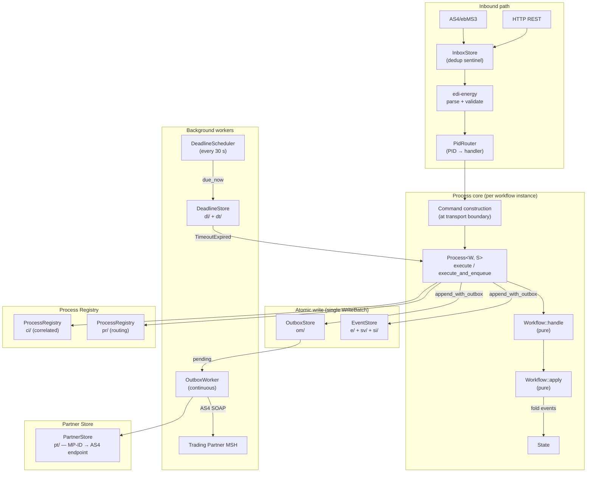
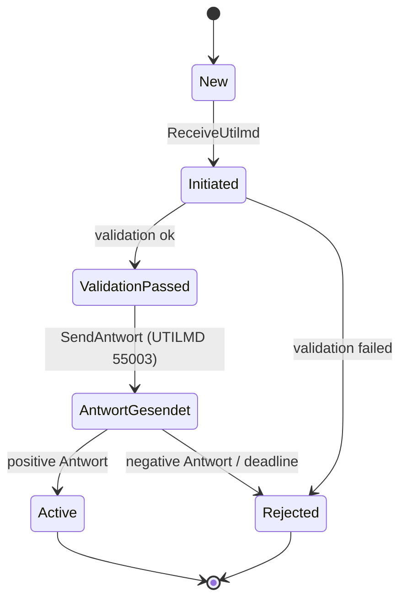
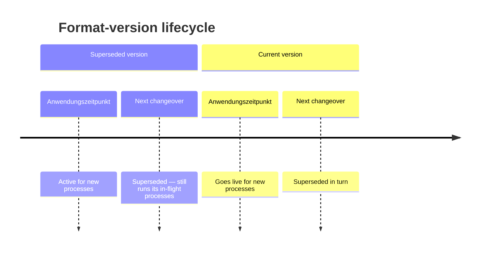
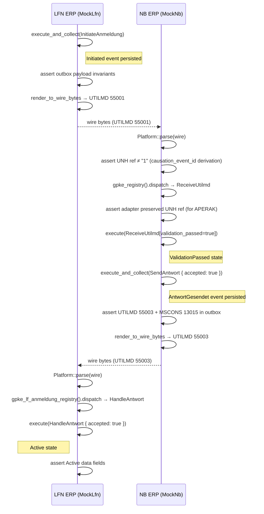

+++
title = "Process Engine"
description = "mako-engine architecture: event-sourced Workflow FSMs, atomic dual-write, DeadlineStore, OutboxWorker, PidRouter, ProcessRegistry, SlateDB backend, format-version coexistence, and ForwardCompatible policy."
weight = 14
+++
`mako-engine` is an event-sourced process runtime for long-running German energy
market workflows. It handles the stateful side of MaKo: tracking in-flight
Lieferbeginn, Gerätewechsel, and billing processes as append-only event streams,
enforcing regulatory deadlines, and delivering outbound EDIFACT messages
atomically with domain events.

---

## Architecture Overview



**Key invariants:**
- `Workflow::handle` and `Workflow::apply` are **pure functions** — no I/O, no clock, no global state mutation.
- All parsing, validation, and external lookups happen at the transport boundary, **before** the command is constructed.
- Events and outbox messages are always written in a **single `WriteBatch`** via `AtomicAppend::append_with_outbox`. Separate writes are not permitted on the production path.

---

## Core concepts

### `Workflow` trait

The central trait. Implementors define:

```rust
pub trait Workflow: Sized {
    type State:   Default + Clone;
    type Command: Send;
    type Event:   EventPayload;

    /// Produce events from the current state and a command.
    /// Must be pure — no I/O, no clock access.
    fn handle(
        state: &Self::State,
        command: Self::Command,
    ) -> Result<WorkflowOutput<Self::Event>, WorkflowError>;

    /// Fold one event into the current state.
    /// Must be pure — must never fail.
    fn apply(state: Self::State, event: &Self::Event) -> Self::State;
}
```

`WorkflowOutput<E>` carries both `events: Vec<E>` and `outbox: Vec<PendingOutbox>`. The `outbox` field holds lightweight descriptors for outbound EDIFACT messages; the engine stamps them with IDs, tenant, and timestamps during materialisation.

### `Process`

A handle to a specific workflow instance (one delivery point, one meter change, …):

```rust
// Spawn: creates a new empty stream
let process = ctx.spawn::<MyWorkflow>(tenant_id, workflow_id);

// Execute: replay → handle → atomic append
let envelopes = process.execute(command).await?;

// Execute with retry on VersionConflict (up to N attempts):
let envelopes = process.execute_with_retry(command, 3).await?;

// Execute and enqueue outbox atomically:
let envelopes = process.execute_and_enqueue(command).await?;
let envelopes = process.execute_and_enqueue_with_retry(command, 3).await?;

// Execute and get outbox messages back (for tests / rendering):
let (envelopes, outbox) = process.execute_and_collect(command).await?;

// Read the current state (full replay):
let state = process.state().await?;

// Read state with snapshot (O(k) replay from checkpoint):
let state = process.state_with_snapshot(&snapshot_store).await?;
```

`execute_with_retry` reloads the full event stream on each attempt — stale state is never carried forward into a retry.

`execute_and_collect` returns the fully-stamped [`OutboxMessage`] entries produced by `Workflow::handle`, with `causation_event_id` set to the `event_id` of the first persisted event — identical to what `execute_and_enqueue` writes into the `OutboxStore` atomically.  Use this in tests and render pipelines where you need the outbox messages after persisting without calling `handle()` a second time.

### Workflow state lifecycle

Each workflow is an event-sourced FSM: `apply` folds events into a state enum,
and `handle` gates which command is valid in each state. Nothing but the
append-only event stream is durable — the state value is always reconstructed
by replay. The GPKE supplier-change workflow (NB inbound side, PID 55001 →
55003) is representative:



These variants are `SupplierChangeState` in `mako-gpke`, serialised as a tagged
`status`/`data` object inside each event payload.

### `EngineBuilder`

Type-state builder that enforces a store is registered before `build()`:

```rust
use mako_engine::{builder::EngineBuilder, store_slatedb::SlateDbStore};

let store = SlateDbStore::open("/data/mako").await?;
let ctx   = EngineBuilder::new()
    .with_event_store(store)
    .with_dead_letter_sink(LogDeadLetterSink::new())
    .build();
```

`build()` is only callable when the `ES` type parameter implements `EventStore` — a missing store is a compile-time error.

---

## Event payload design

### Why `serde_json::Value` at the store boundary

`EventEnvelope::payload` is `serde_json::Value`. This is an intentional trade-off:

| Concern | Decision | Rationale |
|---|---|---|
| Schema evolution | `Value` — untyped at rest | Adding a field to `*Data` is backward-compatible: old events simply lack the key; `#[serde(default)]` fills in the default. Removing a key does not fail deserialization of new code against old events. |
| In-process type safety | Enforced by `apply()` | `apply()` deserializes the `Value` payload into the strongly-typed `*Event` enum via `serde_json::from_value`. Compile-time type checks apply within the domain crate. |
| Tamper detection | `deny_unknown_fields` on `*Data` | All domain `*Data` structs (carrier of business fields through state variants) are annotated with `#[serde(deny_unknown_fields)]`. This means `apply()` will return an error if a stored payload contains unrecognized keys, catching accidental field renames early. |
| Performance | Acceptable for current event depths | A benchmark for 10,000-event replay would quantify the allocation cost vs. a `Bytes`-based design. At current BDEW process depths (< 20 events per stream), the overhead is negligible. |

### Type safety guarantee

The guarantee is: **business correctness is enforced in `apply()`**, not at the store boundary.

```rust
// ✓ Type safety is enforced here — if the payload JSON is malformed
//   for the expected event type, apply() propagates the serde error.
fn apply(state: Self::State, event: &Self::Event) -> Self::State {
    // event was deserialized from Value by the engine before calling apply()
    match event {
        MyEvent::Initiated { location_id, .. } => { /* typed */ }
    }
}
```

Fields not present in a stored event payload (due to being added in a later schema version) are silently filled with their `#[serde(default)]` value. This is the supported upgrade path. Downgrade (removing a field from a newer schema and reading events written with the field) is handled by `deny_unknown_fields` failing loudly — a schema migration is required.

---

## Stores

All engine store concerns are backed by one SlateDB database, exposed through per-concern store types: `SlateDbStore` implements `EventStore`, `AtomicAppend`, `OutboxStore` and `ProjectionCheckpointStore` directly, while `DeadlineStore`, `ProcessRegistry`, `InboxStore`, `SnapshotStore` and `PartnerStore` are served by dedicated sub-stores (`SlateDbDeadlineStore`, `SlateDbProcessRegistry`, …) reached via accessors. In tests, swap in the `InMemoryEventStore` (and related noop/in-memory impls) via the `testing` feature flag.

### `EventStore`

Append-only stream of `EventEnvelope`s with optimistic concurrency via `ExpectedVersion`:

```rust
// Append at an exact version — returns VersionConflict if the stream moved:
store.append(&stream_id, ExpectedVersion::Exact(3), events).await?;

// Load from a sequence number:
store.load_from(&stream_id, from_sequence).await?;

// Constant-memory fold:
store.fold_stream(&stream_id, init, |acc, env| acc).await?;
```

Concurrent writers use SlateDB snapshot-isolation transactions: both writers stamp the `sv_key`, triggering a write-write conflict at commit time. Exactly one succeeds.

### `AtomicAppend`

Extends `EventStore` with a single method that writes events **and** outbox messages in one `WriteBatch`:

```rust
store.append_with_outbox(&stream_id, version, events, outbox).await?;
```

This is the only safe way to enqueue outbound EDIFACT — never write events first and outbox second.

### `OutboxStore`

FIFO delivery queue with exponential backoff and per-message jitter:

```rust
// Enqueue outbound messages (batch):
store.enqueue(&[outbox_msg]).await?;

// Poll the next batch for the delivery worker (messages due at `now`;
// `pending_now(limit)` uses OffsetDateTime::now_utc() for you):
let batch = store.pending(limit, now).await?;

// Acknowledge delivery:
store.acknowledge(message_id).await?;

// Reschedule after a transient failure (with backoff):
store.reschedule(message_id, next_attempt_at).await?;
```

### `DeadlineStore`

Time-indexed store for regulatory Fristen:

```rust
// Register a deadline. Every window comes from `mako_fristen::antwort`, keyed
// by Prüfidentifikator — GPKE clock times on the 1. Werktag, WiM Strom
// 3/5/7/1 Werktage, GeLi Gas 4/3/2 Werktage. There is no flat 24 h window.
store.register(&deadline).await?;

// Poll deadlines due now (returns a DueNowResult with a truncation flag):
let due = store.due_now(limit).await?;

// Cancel after successful dispatch or process termination:
store.cancel(deadline_id).await?;
```

Deadlines that fire with a `VersionConflict` are **not cancelled** — the scheduler leaves them due for retry on the next poll cycle.

### `ProcessRegistry`

Reverse lookup from EDIFACT conversation ID → `ProcessIdentity`:

```rust
// Register when a new process is spawned:
registry.register(tenant, &conv_id, &process.identity()).await?;

// Look up on every subsequent inbound message for the same conversation:
let identity = registry.lookup(tenant, &conv_id).await?;
```

### `InboxStore`

Per-key deduplication for AS4 inbound messages. `accept` returns `true` only the first time a message ID is seen:

```rust
let is_new = inbox.accept(&message_id).await?;
```

Within a single process the store uses a per-key `DashMap<_, Arc<Mutex<()>>>` to serialise concurrent `accept` calls. Multi-instance deployments partition ownership so that each aggregate key is driven by exactly one `makod` instance; the optimistic-concurrency `VersionConflict` check remains the backstop against concurrent appends.

---

## Regulatory Fristen (`fristen` module)

**`mako_fristen::antwort::antwort_deadline(pid, received)` is the one resolver.**
It answers for every family below, keyed on the inbound PID, and returns `None`
for a PID the Festlegungen do not quantify — *unknown*, never *unbounded*. The
per-family entries differ only in the `FristShape` they carry.

| Process family (`Family`) | Shape | Windows |
|---|---|---|
| `Gpke` | wall-clock time on the *n*-th Werktag after the ÜT, or **am ÜT** | 11:00 (55001, 55077) · 06:00 (55004) · 05:00 (55007) · 09:00 (55010) · 15:00 am ÜT (55013, 55607) |
| `Wim` | Werktage per PID | 3 (55039) / 5 (55042) / 7 (55051) / 1 (55168) |
| `WimGas` | the same four on the Gas twins | 3 (44039) / 5 (44042) / 7 (44051) / 1 (44168) |
| `GeliGas` | Ablauf des *n*-ten Werktags nach Eingang | 4 (44001) / 3 (44004, 44007, 44010, 44016) / 2 (44013) |
| `Emob` | Ablauf des *n*-ten Werktags | 7 (55238) / 3 (55240, 55242) |

Two obligations sit outside that catalogue because they are not keyed on an
inbound PID:

| Obligation | Resolver |
|---|---|
| INVOIC — zum Zahlungsziel der Rechnung; der NB bei 31009 zum 4. WT davor | `mako_fristen::vorlauf::rechnung_antwort_spaetester_uet` |
| MaBiS — **no response Frist is published**; the Kap. 3.10 Tabelle 2 clearing window bounds it instead | `mako_mabis::Bilanzierungsmonat::clearing(zeitreihe, lauf)` |

`mako_wim::antwort_frist_werktage(pid)` returns the bare Werktage count for a WiM
PID, for callers that need the number rather than a resolved instant.

**Saturday is not a Werktag.** GPKE (BK6-24-174) Teil 1 Kap. 7: *"alle Tage ..., die kein Samstag, Sonntag oder gesetzlicher Feiertag sind"*. A holiday observed in any single Bundesland counts nationwide, and 24.12. and 31.12. count as holidays. Allgemeine Festlegungen 6.1d states the same definition under *WT*.

**The count starts on the day of receipt, whatever weekday it is.** The same Kapitel defines the Übertragungstag as *"der Tag des Empfangs der Übertragungsdatei ... aus der AS4-Zustellquittung"* and attaches no rule deeming a weekend arrival received on the next Werktag — only the Werktage *counted* skip weekends and holidays. What it does attach is a condition on the acknowledgement: the ÜT counts *"nur ..., sofern es sich um eine positive Zustellquittung bzw. Response-Nachricht handelt"*, so a negative acknowledgement starts no Frist.

Deadlines are always expressed as `17:00 Europe/Berlin` on the due date (not UTC), and the day of receipt is read as a Berlin calendar date — see [Dates and days](@/docs/architecture/domain-model.md#dates-and-days). The `fristen` module uses `time_tz::assume_timezone(Europe/Berlin)` and the Anonymous Gregorian Easter algorithm for public holiday detection (valid for all years).

---

## Format-version coexistence

`makod` serves every registered format version at once; which one applies to a
message is a function of its date, not of what is deployed.

Selection is `ReleaseRegistry::profile_on(message_type, release, date)`, which
returns the profile with the greatest `valid_from ≤ date`. The date comes from
`ParseConfig::with_reference_date` or `validate_on_date`, and `makod` supplies
`mako_fristen::heute()` — the German calendar date, because a Formatversion
takes effect at German midnight. `edi-energy` reads no clock of its own: given
no date it disambiguates nothing, and the last registered profile for the wire
code wins. The wire release code
in `UNH DE 0057` narrows the candidates but cannot decide alone — two
Formatversionen can share one MIG.

Releases ship on 01.04. and 01.10., six months after the documents are
published; `profiles/<type>/<fv>/mig.json` carries `publikationsdatum`,
`valid_from` and `valid_until`. See
[Formatversion effective dates](@/docs/compliance/annual-release-workflow.md#appendix-c-formatversion-effective-dates).

A process that **starts** under one format version continues under those rules
until it completes, even past a cutover.



### `WorkflowVersionPolicy`

A workflow declares how it handles a message encoded under a different format
version than the one it was started with. `ForwardCompatible` carries
`#[default]`, so a workflow that overrides nothing already has it — the override
below is what a *deviation* looks like:

```rust
impl Workflow for MyWorkflow {
    fn version_policy() -> WorkflowVersionPolicy {
        WorkflowVersionPolicy::Pinned   // ← a deliberate narrowing, not the default
    }
}
```

`WorkflowVersionPolicy::accepts(fv, creation_fv)` decides:

| Policy | Acceptance | When to use |
|---|---|---|
| `ForwardCompatible` | **always** — every FV is acceptable | **The default for all MaKo workflows.** A FV2025 process can receive a FV2026-encoded APERAK |
| `Pinned` | `fv == creation_fv` | Only a workflow guaranteed to complete inside one release cycle (< 6 months), so no counterparty message can cross an April-1 or October-1 boundary |
| `Explicit(list)` | `fv` is in `list` | When the acceptable set is fixed and known at compile time (e.g. a billing process handling exactly FV2025-10-01 and FV2026-10-01) |

> **Do not default to `Pinned`.** A `Pinned` policy on any GPKE/WiM/GeLi Gas
> workflow will cause the process to reject APERAKs sent by counterparties that
> have already migrated to the next format version, silently breaking the workflow.

---

## Format-version migration (`migration` module)

When a new BDEW annual release (e.g. `FV2026-10-01`) changes a workflow's state
schema, in-flight processes that started under `FV2025-10-01` must be migrated
before the new rules can apply. The `MigrationRunner` handles this:

```rust
use mako_engine::migration::{MigrationRunner, StateMigration, MigrationReport};
use mako_engine::version::WorkflowId;

struct UpgradeSupplierChange2025to2026 {
    source: WorkflowId, // "supplier-change" @ FV2025-10-01
    target: WorkflowId, // "supplier-change" @ FV2026-10-01
}

impl StateMigration for UpgradeSupplierChange2025to2026 {
    type FromWorkflow = SupplierChangeWorkflowFV2025;
    type ToWorkflow   = SupplierChangeWorkflowFV2026;

    fn source_workflow_id(&self) -> &WorkflowId { &self.source }
    fn target_workflow_id(&self) -> &WorkflowId { &self.target }

    fn migrate(&self, state: OldState) -> Result<NewState, String> {
        Ok(NewState {
            // Map old fields to new schema
            status: state.status,
            new_field: Default::default(),
        })
    }
}

let runner = MigrationRunner::new(
    UpgradeSupplierChange2025to2026,
    event_store.clone(),
    snapshot_store.clone(),
);
let report: MigrationReport = runner.run().await;
println!(
    "Migrated {} processes, skipped {}, errors: {}",
    report.migrated, report.skipped, report.errors.len()
);
```

Migrations are intentionally **not fatal** — errors are collected in
`MigrationReport::errors` and the runner continues with the next stream.
Run migrations as an `xtask` or startup check before enabling the new workflow
version in production.

---

## Trading-partner master data (`PartnerStore`)

The `PartnerStore` trait provides a durable, PARTIN-aware registry of trading
partners. It replaces the static `HashMap<MpId, Url>` that config-only solutions
provide and survives restarts, runtime updates, and inbound PARTIN messages.

```rust
use mako_engine::partner::{PartnerRecord, CommunicationChannel, PartnerStore};
use mako_engine::store_slatedb::SlateDbStore;

let store = SlateDbStore::open("/data/mako").await?;
let partners = store.as_partner_store();

// Bootstrap from config (called by makod at startup):
for record in PartnerRecord::from_cli_pairs(&config.as4.partners)? {
    partners.upsert(tenant_id, &record).await?;
}

// Update from inbound PARTIN:
let incoming = parse_partin_message(edifact_bytes)?;
partners.upsert(tenant_id, &incoming).await?;

// Look up an AS4 endpoint before delivering:
let record = partners.get(tenant_id, &recipient_gln).await?
    .ok_or_else(|| EngineError::Partner(format!("no endpoint for {recipient_gln}")))?;
let endpoint = record.as4_endpoint()
    .ok_or_else(|| EngineError::Partner(format!("{recipient_gln} has no AS4 endpoint")))?;
```

### Partner record data model

```
PartnerRecord {
    mp_id:        MarktpartnerCode,     // 13-digit Marktpartner-ID (lookup key within a tenant)
                                        // May be BDEW-Codenummer (99…), DVGW-Codenummer (98…),
                                        // or GS1 GLN
    display_name: Option<Box<str>>,     // NAD company name
    channels:     Vec<CommunicationChannel>,  // COM segments
      ├── qualifier "AK" → AS4 endpoint URL  (PARTIN AHB 1.0f DE 3155)
      ├── qualifier "EM" → email address
      ├── qualifier "TE" → telephone
      └── qualifier "FX" → fax
    roles:        Vec<Marktrolle>,      // serialised as BDEW codes: "LF", "NB", "MSB", …
    valid_from:   Option<OffsetDateTime>, // DTM+137
    contacts:     Vec<ContactPerson>,   // CTA/NAD/COM groups
    country_code: Option<Box<str>>,     // NAD country (e.g. "DE")
    updated_at:   OffsetDateTime,       // last write timestamp
}
```

`merge_from_partin` merges an incoming PARTIN record into the existing one. A
newer `valid_from` wins; config-bootstrapped records (no `valid_from`) are
always overwritten by PARTIN data.

Partners are managed at runtime via the REST admin API — see
[`makod` Operator Guide](@/docs/services/makod.md#partner-management-admin-partners).

---

## Domain crates

| Crate | Process family | Key inbound PIDs | APERAK Frist |
|---|---|---|---|
| `mako-gpke` | GPKE — Lieferbeginn/-ende Strom, NB-Abmeldeanfrage (Beendigung der Zuordnung), Ersatz-/Grundversorgung, Neuanlage, ORDERS Sperrung (NB role), INVOIC billing, Konfiguration | 55001–55002, 55010 (55011/55012 out), 55013–55015, 55016–55018, 55555, 55600/55601, 55607–55609, 17115–17117 (NB inbound), **INVOIC 31001/31002/31005/31006** (`GPKE_INVOIC_PIDS`) + REMADV 33001–33004, 17134/17135, 19001/19002 | per PID, from `mako_fristen::antwort` |
| `mako-wim` | WiM **Strom und Gas** — Messstellenwechsel, Geräteübernahme, Weiterverpflichtung, INSRPT, WiM-Rechnung | 55039/55042/55051/55168 · 44039/44042/44051/44168 · 44183, 17001/17002/17009, 19001–19004/19015/19016, 23001–23012, 31009/31003/31004 | **3 / 5 / 7 / 1 Werktage**, per PID, in beiden Sparten |
| `mako-geli-gas` | GeLi Gas — Lieferbeginn/-ende Gas, Stornierung (44022–44024, beide Use-Cases), Gas Sperrung (LF role), Gas Datenabruf, INVOIC 31011 | 44001–44024, 17103, 17104, 19103, 19104, 19116, 19117, 19128, 19129, 31011 | per PID, from `mako_fristen::antwort` |
| `mako-mabis` | MaBiS — Bilanzkreisabrechnung Strom, the MaBiS-ZP lifecycle, Clearingliste und Listenabgleich | MSCONS 13001/13003/13010–13012, IFTSTA Datenstatus 21000–21007, ORDERS 17211, UTILMD 55065–55067/55069/55070/55073, and 55235–55237 (Zuordnung des ZP der NGZ zur NZR — MaBiS, not NZR-EMob) | none published — the Kap. 3.10 clearing window bounds it |
| `mako-gabi-gas` | GaBi Gas 2.1 — allocation, nomination and Mehr-/Mindermengenmeldung (ALOCAT/NOMINT/NOMRES/SSQNOT) + Kapazitäts-/Mehr-Mindermengen-INVOIC | INVOIC 31007/31008/31010, ORDERS 17110, ORDRSP 19110, MSCONS 13013, DVGW 70001–70039, 70095–70096 | KoV deadlines (GasDay D-1 14:00 etc.) |
| `mako-emob` | NZR-EMob / Modell 2 — the three Modellwechsel legs (Anmeldung, Zuordnungsende, Abmeldung) | 55238/55239, 55240/55241, 55242/55243 | 7 / 3 Werktage, per PID; an unanswered leg **escalates** rather than confirming |
| `mako-redispatch` | Redispatch 2.0 — activation, Stammdaten and the six acknowledge-and-forward document families | XML document types; IFTSTA 21035–21038, MSCONS 13020–13023/13026 (Ausfallarbeit + meteorologische Daten), ORDERS 17209, ORDRSP 19204, 19301/19302 | 3 min ACK (FB 1.0g); the rest are operator-set |

### The module contract

A domain crate reaches the engine as an `EngineModule`, and it names its
workflows **twice** — once by routing a Prüfidentifikator to a name, once by
declaring the name:

```rust
impl EngineModule for GpkeModule {
    fn workflow_names(&self) -> &'static [&'static str] {
        &[wechselprozesse::WORKFLOW_NAME, eog::WORKFLOW_NAME, /* … */]
    }

    fn register_pids(&self, router: &mut PidRouter) {
        router.register(55001, wechselprozesse::WORKFLOW_NAME);
        // …
    }
}
```

The declaration is the load-bearing one. `EngineContext::registered_workflows`
collects it, and three of `makod`'s startup checks read only that list: whether
a workflow has a deadline-dispatch arm, whether it has a format-version
migration decision, and the workflow count it reports. So **every name
`register_pids` routes to must also be declared** — `EngineBuilder::build`
panics per module otherwise, because a routed but undeclared workflow runs while
being exempt from all three.

The converse is allowed and not checked: a command-initiated workflow, started
by an ERP over the command API, declares a name and routes no inbound PID.

### MABIS architecture note

MABIS workflows are fundamentally different from supplier-switch workflows: instead of one stream per delivery point, MABIS aggregates meter data across thousands of MaLo streams for a billing period. This is driven by `ProjectionRunner::catch_up_persistent` rather than a per-MaLo `Process`. See [Projections and Read Models](#projections-and-read-models) below.

---

## Projections and Read Models

Projections build read models from the event stream. They are asynchronous, disposable (rebuildable), and eventually consistent. Projection failures must **never** affect event persistence.

### `catch_up_persistent` — the mandatory production API

`ProjectionRunner::catch_up_persistent` is the **only** projection entry point suitable for production background workers. It:

1. Loads the named checkpoint from `store` (cursor per stream from a previous run).
2. Performs incremental catch-up — feeds only events **newer** than the saved cursor.
3. Saves the updated checkpoint back atomically, writing only streams whose cursors advanced (O(changed_streams) writes).

On restart, only events appended since the last run are processed — **no full replay**. Over a live deployment with millions of events, full replay would be prohibitively expensive.

```rust,ignore
use mako_engine::{
    projection::{Projection, ProjectionRunner},
    store_slatedb::SlateDbStore,
};

// Implement the read-model builder:
struct BillingProjection { /* ... */ }
impl Projection for BillingProjection {
    fn name(&self) -> &'static str { "mabis-billing" }
    fn handle_event(&mut self, env: &EventEnvelope) { /* update read model */ }
    fn last_sequence(&self) -> Option<u64> { /* return cursor or None */ }
}

// Run the worker loop:
let store: Arc<SlateDbStore> = /* ... */;
let mut proj = BillingProjection::default();
loop {
    let _checkpoint = ProjectionRunner::catch_up_persistent(
        &mut proj,
        &store,
        Some("process/"),      // stream prefix — all process streams
        "mabis-billing",       // checkpoint name (unique per projection)
    ).await?;
    tokio::time::sleep(Duration::from_secs(30)).await;
}
```

### API surface

| Function | When to use |
|---|---|
| `catch_up_persistent(proj, store, prefix, name)` | **Production workers** — incremental, checkpoint-backed, restart-safe |
| `catch_up_all_streams(proj, store, streams, cp)` | In-process catch-up when you manage the checkpoint yourself |
| `run_all_streams(proj, store, streams)` | One-shot full replay (tests, diagnostic tools) |
| `run_from_store(proj, store, stream)` | Single-stream full replay (unit tests) |
| `catch_up_from_store(proj, store, stream)` | Single-stream incremental catch-up using `Projection::last_sequence` |

> **Warning**: `run_all_streams`, `run_matching_streams`, and `run_from_store` perform **full replays** from sequence 0. Never use them in a long-running production worker — use `catch_up_persistent` instead.

### Checkpoint store

`SlateDbStore` implements `ProjectionCheckpointStore`. The key space is:

```
cp/{checkpoint_name}/{stream_id}  →  u64 LE (8 bytes)
```

Each call to `catch_up_persistent` only writes streams whose cursors advanced, keeping write amplification at O(active_streams), not O(total_streams).

### `GlobalProjectionCheckpoint`

`GlobalProjectionCheckpoint` is a `BTreeMap<StreamId, u64>` — a per-stream sequence-number cursor. A cursor value of `0` means "never seen; replay from the beginning". The checkpoint is automatically serialised and deserialised by `catch_up_persistent`.

---

## `makod` production daemon

`makod` assembles all modules into a production-ready process. For the complete
configuration reference — all CLI flags, environment variables, TOML config,
Docker/Kubernetes deployment, secrets management, and health checks — see the
dedicated operator guide:

**[`makod` Operator Guide →](@/docs/services/makod.md)**

Quick start (development, volatile in-memory):

```bash
cargo run -p makod -- --config makod.toml --allow-volatile --http-addr 127.0.0.1:8080
```

`makod.toml` needs at least one `[[party]]` entry (`mp_id` + `roles`) — the
operator identity that scopes all process streams.

Omitting `--data-dir` starts in volatile in-memory mode — all process state is
lost on restart. A `WARN` is emitted at startup.

---

## Testing

Use the `testing` feature to swap in in-memory stores:

```rust
use mako_engine::{
    builder::EngineBuilder,
    event_store::InMemoryEventStore,
    dead_letter::NoopDeadLetterSink,
};

let ctx = EngineBuilder::new()
    .with_event_store(InMemoryEventStore::new())
    .with_dead_letter_sink(NoopDeadLetterSink)
    .build();
```

Each test should create its own `EngineBuilder` instance for isolation — in-memory stores share no global state.

### Bilateral E2E tests

For end-to-end pipeline tests that exercise the full
render → wire bytes → parse → adapt → execute chain, model each market
participant as a **mock ERP backend** struct that owns its own `Process` and
exposes protocol-level methods.

The key primitive is `Process::execute_and_collect` — it persists the command **and**
returns the stamped `OutboxMessage` entries in one call, ready to pass to
`render_to_wire_bytes` without any manual ID stitching:

```rust
// One call: persist + get outbox (no double handle() invocation).
let (_, outbox) = self.process
    .execute_and_collect(LfAnmeldungCommand::InitiateAnmeldung { .. })
    .await?;

// outbox[0] is already a fully-stamped OutboxMessage:
let wire = render_to_wire_bytes(&outbox[0], LFN_ID)?;
```

The returned `OutboxMessage` has `causation_event_id` set to the real
`event_id` of the persisted `Initiated` event — identical to what the
production `OutboxWorker` reads from the store when it delivers the message
over AS4.

#### Protocol sequence (Lieferbeginn Strom, PID 55001)



See `services/makod/tests/e2e_lieferbeginn.rs` for the complete bilateral
implementation covering both the acceptance and rejection paths.

---

## See Also

- [Getting Started](@/docs/guide/getting-started.md) — first steps for both layers
- [Platform Guide](@/docs/reference/platform.md) — multi-tenant `edi-energy` usage
- [Parsing Guide](@/docs/reference/parsing.md) — EDIFACT parsing
- [API-Webdienste Strom](@/docs/architecture/api-webdienste.md) — REST/JSON channel for iMS processes
- [Release Lifecycle](@/docs/compliance/release-lifecycle.md) — annual BDEW profile updates
