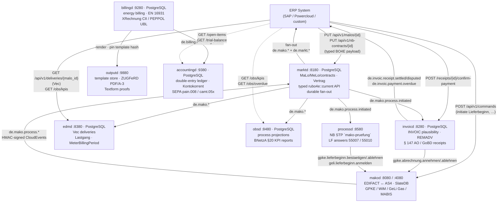
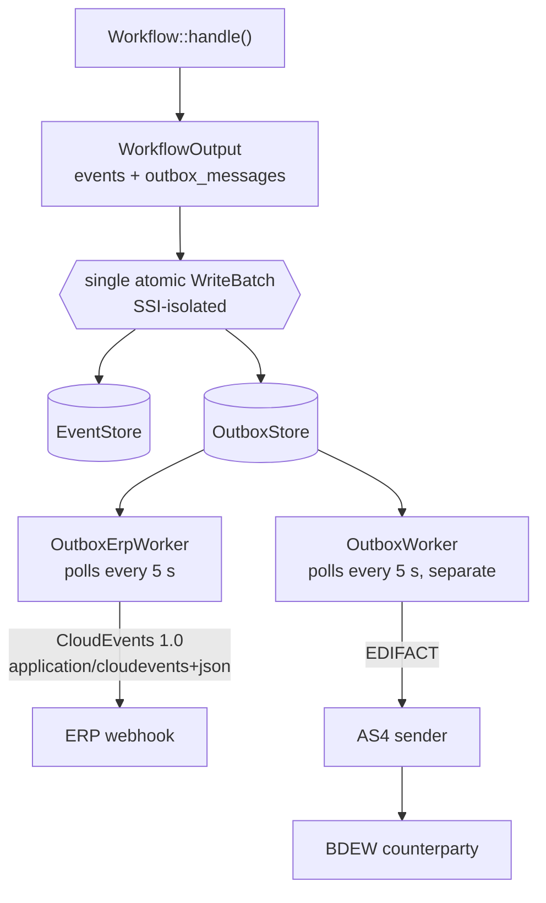

+++
title = "ERP Integration"
description = "Integrate with your ERP using CloudEvents 1.0 JSON webhooks, the Command API, and typed BO4E market data. Covers HMAC-SHA256 signature verification, idempotency keys, payment lifecycle CloudEvents, and the full integration topology diagram."
weight = 10
[extra]
mermaid = true
+++
# ERP Integration

`makod` is a protocol processor, not a business system. It handles EDIFACT
parsing, BDEW process rules, AS4 delivery, and regulatory deadlines. All
contract data, billing logic, and master data live in your ERP.

The integration contract between the two is **BO4E** — not raw EDIFACT. Your
ERP never sees EDIFACT format versions or segment codes. When BDEW releases a
new format version (`FV2026-10-01`), the BO4E payload your ERP receives is
unchanged.

```
ERP  ←─────────── BO4E JSON ───────────→  makod
                (ErpAdapter / POST /api/v1/commands)
                        ↕
              EDIFACT / AS4 / BDEW network
```

> **Master data management via `marktd`** — if you deploy the companion
> [`marktd`](@/docs/services/marktd.md) service, configure `makod` to push process lifecycle
> events to `marktd`'s ingest endpoint (`POST /api/v1/events`). `marktd` then
> fans out to your registered ERP subscribers, eliminating the need to
> configure a webhook endpoint directly in `makod`.

Outbound webhook events are delivered as **[CloudEvents 1.0](https://cloudevents.io)**
structured-mode JSON. CloudEvents is a CNCF-graduated vendor-neutral standard
for event metadata. It is natively supported by SAP BTP, AWS EventBridge, Azure
Event Grid, Google Eventarc, and Knative — making makod events directly
routeable by any cloud event bus without custom glue code.

---

## Quick-start: wire the ERP webhook in 5 minutes

This is the minimum configuration to get outbound ERP notifications working.
`makod` will POST a JSON event to your ERP endpoint every time a MaKo process
reaches a significant state (APERAK received, process completed, etc.).

**Step 1 — Generate a shared secret**

```bash
openssl rand -hex 32
# → e.g. a3f8c1d2...  (64 hex chars)
```

**Step 2 — Start makod with the webhook configured**

```bash
makod \
  --config /etc/makod/makod.toml \
  --data-dir /var/lib/makod \
  --erp-webhook-url https://erp.example.com/mako/events \
  --erp-webhook-secret a3f8c1d2...
```

Or via `makod.toml`:

```toml
[erp]
webhook_url    = "https://erp.example.com/mako/events"
webhook_secret = "a3f8c1d2..."
```

**Step 3 — Implement the ERP endpoint**

Your ERP must accept `POST` requests at the configured URL:

```
POST /mako/events
Content-Type: application/cloudevents+json
webhook-id:        01932a4f-7b3e-4c5d-8f6a-9e0b1c2d3e4f
webhook-timestamp: 1786012800
webhook-signature: v1,K5oT9r8GKYqrTwjUPD8ILPZIo2LaLaSw…
```

Body (CloudEvents 1.0 structured-mode JSON):

```json
{
  "specversion": "1.0",
  "id": "01932a4f-7b3e-4c5d-8f6a-9e0b1c2d3e4f",
  "source": "urn:mako:makod:tenant:9900357000004",
  "type": "de.mako.aperak.accepted",
  "time": "2026-10-01T10:15:00+02:00",
  "subject": "018f3a2b-...",
  "dataschema": "https://raw.githubusercontent.com/BO4E/BO4E-Schemas/v202607.1.0/src/bo4e_schemas/bo/Marktlokation.json",
  "datacontenttype": "application/json",
  "makoconvid": "...",
  "makocausationid": "...",
  "makopid": 55001,
  "data": {
    "_typ": "MARKTLOKATION",
    "_version": "202501",
    "marktlokationsId": "51238696799",
    "sparte": "STROM",
    "bilanzierungsmethode": "SLP",
    "energierichtung": "VERBRAUCH",
    "netzbetreibercodenr": "9900357000004"
  }
}
```

`webhook-id` is the CloudEvent's own `id`. It is the signature's message
identity **and** your idempotency key — one value, not two headers that can
disagree.

**Step 4 — Verify the signature**

mako signs with [Standard Webhooks]. **Use a library** — there is one for every
language an ERP is written in, and it will get the parts below right. The manual
implementation is here so you can see what it does, not as a recommendation.

Three things must all hold:

1. The signature matches `base64(HMAC-SHA256(secret, "{id}.{timestamp}.{body}"))`.
   Note it covers the id and the timestamp, **not the body alone**.
2. `webhook-timestamp` is within **5 minutes** of now, in either direction.
   Without this a captured request replays forever.
3. `webhook-id` has not been seen before. Reject or ignore the duplicate.

```python
import base64, hmac, hashlib, time

TOLERANCE = 300  # seconds, each way

def verify_mako_webhook(body: bytes, secret: str, headers) -> str:
    """Returns the webhook id to deduplicate on; raises on refusal."""
    msg_id = headers["webhook-id"]
    ts     = int(headers["webhook-timestamp"])
    if abs(time.time() - ts) > TOLERANCE:
        raise ValueError("stale or future timestamp — possible replay")

    signed  = f"{msg_id}.{ts}.".encode() + body
    digest  = hmac.new(secret.encode(), signed, hashlib.sha256).digest()
    expected = "v1," + base64.b64encode(digest).decode()

    # The header is a space-separated list, so a key rotation presents both.
    if not any(hmac.compare_digest(expected, part)
               for part in headers["webhook-signature"].split()):
        raise ValueError("no signature matched")
    return msg_id   # ← persist this; reject a repeat
```

```typescript
import { createHmac, timingSafeEqual } from "crypto";

const TOLERANCE = 300; // seconds, each way

function verifyMakoWebhook(body: Buffer, secret: string, headers: Record<string, string>): string {
  const id = headers["webhook-id"];
  const ts = Number(headers["webhook-timestamp"]);
  if (Math.abs(Date.now() / 1000 - ts) > TOLERANCE) {
    throw new Error("stale or future timestamp — possible replay");
  }

  const signed = Buffer.concat([Buffer.from(`${id}.${ts}.`), body]);
  const expected = "v1," + createHmac("sha256", secret).update(signed).digest("base64");

  const ok = headers["webhook-signature"].split(" ").some((part) =>
    part.length === expected.length &&
    timingSafeEqual(Buffer.from(part), Buffer.from(expected)));
  if (!ok) throw new Error("no signature matched");
  return id; // ← persist this; reject a repeat
}
```

> CloudEvents deliberately excludes signing from its specification — signing
> semantics vary by use case. [Standard Webhooks] is the security layer mako
> puts on top of it.

> **Key rotation.** `webhook-signature` is a space-separated list, so during a
> rollover mako can present the old and the new signature at once. Accept the
> request if **any** entry matches, and a secret can be changed without a
> flag-day across every integration.

[Standard Webhooks]: https://www.standardwebhooks.com/

**Step 5 — Return `HTTP 200` for duplicates**

`makod` retries on any non-2xx response. Your endpoint **must** persist
`idempotency_key` and return `200 OK` for duplicate deliveries without
re-processing. Any `4xx` except `429` is treated as a permanent error and the
message is dead-lettered.

---

## Integration surfaces

| Direction | Mechanism | Description |
|-----------|-----------|-------------|
| makod → ERP | `--erp-webhook-url` / `WebhookErpAdapter` | POST BO4E JSON on every process event |
| ERP → makod | `POST /api/v1/commands` | Initiate a MaKo process (Lieferbeginn, Gerätewechsel, …) |
| ERP → makod | `PUT /admin/malo/{malo_id}` | Push MaLo master data to the local cache |
| ERP → makod | `PUT /admin/partners/{mp_id}` | Register or update a trading-partner endpoint |
| ERP → makod | `ErpCommandSource` trait | Fully event-driven inbound (Kafka, SFTP, CDC, …) |
| marktd → invoicd | `POST /webhook` CloudEvents | GPKE/WiM billing notifications for automatic plausibility check |
| invoicd → makod | `POST /api/v1/commands` | the answering PID's accept/reject command (`gpke.abrechnung.*`, `wim.*`, `gabi.*`, `geli.*`, `invoic.*`) |
| invoicd → ERP | `de.invoic.receipt.settled/disputed` CloudEvents | Durable at-least-once payment notifications |
| invoicd → ERP | `de.invoic.payment.overdue` CloudEvents | Announced once per receipt when `pay_by` passes without `confirm-payment` |
| ERP → invoicd | `POST /api/v1/receipts/{id}/confirm-payment` | Close § 147 AO / GoBD payment audit trail when bank transfer confirmed |
| ERP → invoicd | `GET /api/v1/zahlungsstatus/{malo_id}` | AR reconciliation — settled / pending / overdue counts |
| edmd API → ERP | `GET /api/v1/deliveries/{malo_id}` | BO4E `Vec<Energiemenge>` — typed meter readings for billing import |
| edmd API → ERP | `GET /api/v1/lastgang/{malo_id}` | BO4E `Lastgang` — interval time series grouped by OBIS register |
| edmd API → ERP | `GET /api/v1/billing-period/{malo_id}` | `MeterBillingPeriod` — arbeitsmenge, spitzenleistung, brennwert |
| ERP → marktd | `PUT /api/v1/nb-contracts/{id}` | Upsert NB contract with full BO4E `Vertrag` payload |
| obsd API → ERP | `GET /obs/kpis` | BNetzA KPI report — §20 EnWG parity, STP rates, decision times |

### ERP-facing integration topology

The services below are the ones an ERP integration touches directly. They are a
selection, not the whole platform — see [Architecture — Service
topology](@/docs/architecture/_index.md#service-topology) for all 17 services and
how they relate.



Every `de.mako.*` event from `makod` flows through `marktd`'s durable fan-out,
which is persist-before-fan-out: the event lands in the durable `event_log`
outbox before any delivery, and each per-subscriber delivery is tracked (retried,
then dead-lettered) in `event_delivery` so no regulatory notification is lost —
even across a crash.

### Delivery pipeline



Events and outbox entries are written atomically. If `makod` crashes between
the two writes, the event is replayed on restart and the outbox entry is
re-enqueued — no lost APERAK.

The two workers are independent on purpose: an ERP that is down cannot delay an
APERAK to a market partner, and a counterparty that is unreachable cannot stall
the ERP feed.

### Event types

See the event type table in the [CloudEvents envelope schema](#cloudevents-envelope-schema)
section below.

### PID → event mapping

| PID family | Process | CloudEvents `type` sequence |
|---|---|---|
| GPKE 55001 | Lieferbeginn LF-AN | `de.mako.process.initiated` → `de.mako.aperak.accepted` → `de.mako.process.completed` |
| GPKE 55004 | Lieferende / Abmeldung (LFN → NB) | same |
| GPKE 55016 | Kündigung Lieferbeginn (LFN → LFA) | same |
| GPKE 31001–31005 | Abrechnung INVOIC | `de.mako.process.initiated` → `de.mako.process.completed` + `de.invoic.receipt.settled`/`disputed` |
| WiM 31009 | MSB-Rechnung (LF payer) | `de.mako.process.initiated` → REMADV → `de.invoic.receipt.settled`/`disputed` |
| WiM 55039, 55042, 55051, 55168 | Gerätewechsel / MSB-Wechsel | `de.mako.process.initiated` → `de.mako.aperak.accepted` → `de.mako.process.completed` |
| WiM 55168 (Konfiguration confirmed) | Steuerungsauftrag positive Endantwort | `de.mako.process.completed` + **`de.vpp.dispatch.confirmed`** → auto-billing in `billingd` |
| GeLi Gas 44001–44006 | Lieferbeginn Gas (LFN-initiated) | `de.mako.process.initiated` → `de.mako.aperak.accepted` → `de.mako.process.completed` |
| GeLi Gas 44016–44018 | Kündigung Lieferbeginn Gas (LFN ↔ LFA) | same |
| GeLi Gas 17103 | Gas Datenabruf (Brennwert/Zustandszahl) | `de.mako.process.initiated` → `de.mako.process.completed` |
| GeLi Gas 17115, 17117 | Sperr-/Entsperrauftrag Gas (LF-initiated) | `de.mako.process.initiated` → `de.mako.process.completed` or `de.mako.process.failed` |
| MABIS 13003 | Bilanzkreisabrechnung Strom | `de.mako.process.initiated` → `de.mako.process.completed` or `de.mako.process.failed` |

### `invoicd` payment CloudEvents

After each validated INVOIC, `invoicd` emits **payment CloudEvents** directly to
your ERP webhook when `[erp] webhook_url` is configured in `invoicd.toml`.
These events enable **accounts-payable automation** without polling the REST API.

| Type | Trigger | Use case |
|---|---|---|
| `de.invoic.receipt.settled` | Invoice accepted | Book received invoice |
| `de.invoic.receipt.disputed` | Invoice rejected | Flag for manual review |
| `de.invoic.receipt.dispatched` | Self-issued 31006 sent | Track self-issued invoice |

Every checked invoice is announced, accepted or disputed. The `dispatched` field
says whether the market answer actually went out — a settled invoice whose
REMADV never left is not one to pay against.

Payment events use `source: "urn:mako:invoicd:tenant:{tenant}"` and `subject: "{process_id}"`.

**Delivery guarantee — durable at-least-once:**
The first attempt runs inline after the market answer is dispatched. On any
failure (transport error, HTTP 5xx), the outbox worker retries with backoff
(30 s → 5 min → 30 min → 2 h → dead-letter after 5 attempts). HTTP 4xx is
dead-lettered immediately — the ERP rejected these exact bytes. Batches are
claimed with a lease, so replicas do not double-deliver. Track delivery via
`invoic_receipts.erp_notified_at` and the `invoicd_erp_dead_lettered_total`
gauge.

**Request signing:** when `[erp] hmac_secret` is configured, every POST includes
[Standard Webhooks] headers computed over `{webhook-id}.{webhook-timestamp}.{body}`.

### Request format

```
POST <erp_webhook_url>
Content-Type: application/cloudevents+json
webhook-id:        <event.id>                     ← dedup key; always sent
webhook-timestamp: <unix seconds>                 ← only when a secret is set
webhook-signature: v1,<base64>                    ← only when a secret is set
```

Body is a **CloudEvents 1.0 structured-mode JSON** object (see below).

### CloudEvents envelope schema

All outbound webhook events are **[CloudEvents 1.0](https://cloudevents.io)
structured-mode JSON** with `Content-Type: application/cloudevents+json`.

**Required CloudEvents attributes:**

| Attribute | Value | Notes |
|---|---|---|
| `specversion` | `"1.0"` | Always |
| `id` | `<idempotency_key>` | Stable dedup key — persist in ERP |
| `source` | `"urn:mako:makod:tenant:<tenant_id>"` | Operator MP-ID |
| `type` | `"de.mako.<domain>.<action>"` | See event type table below |
| `time` | RFC 3339 with timezone offset | Wall-clock time of domain event |
| `subject` | `<process_id>` UUID | The mako process that fired the event |

**Optional CloudEvents attributes:**

| Attribute | Value | Notes |
|---|---|---|
| `dataschema` | BO4E JSON Schema URL | Present when `data` carries a BO4E object |
| `datacontenttype` | `"application/json"` | Always present when `data` is non-null |

**mako extension attributes** (lowercase alphanumeric per CloudEvents spec §3.3):

| Extension | Type | Description |
|---|---|---|
| `makoconvid` | string | BDEW Vorgangsnummer |
| `makocausationid` | string | mako domain event UUID that caused this notification |
| `makopid` | integer | Prüfidentifikator |
| `makofailreason` | string | Only present on `de.mako.process.failed` |

**`data` field:**

BO4E-typed JSON object. Deserialise using the ERP's own BO4E library.
`null` when no primary BO4E object applies (e.g. `de.mako.contrl.received`).

**Event type → CloudEvents `type` mapping:**

| CloudEvents `type` | Trigger | Primary BO4E payload |
|---|---|---|
| `de.mako.process.initiated` | New inbound UTILMD received | `Marktlokation` |
| `de.mako.aperak.accepted` | Counterparty accepted our UTILMD | `Marktlokation` |
| `de.mako.aperak.rejected` | Counterparty rejected our UTILMD | `Marktlokation` + rejection reason |
| `de.mako.aperak.timeout` | No APERAK within regulatory SLA | `Marktlokation` |
| `de.mako.contrl.received` | CONTRL syntax acknowledgement | — (null data) |
| `de.mako.process.completed` | Lieferbeginn/Lieferende confirmed | `Marktlokation` + `Vertrag` |
| `de.mako.process.failed` | Fatal error / regulatory deadline exceeded | `Marktlokation` |
| `de.mako.malo.identified` | MaLo-ID lookup resolved | `Marktlokation` |
| `de.vpp.dispatch.confirmed` | WiM Steuerungsauftrag (PID 55168) positively confirmed by MSB — triggers VPP auto-billing in `billingd` | `{tx_id, location_id, max_power_kw, execution_time_from, execution_time_until, command_type, sender_mp_id, produkt_code}` |
| `de.gabi.alocat.missing` | KoV §6.4 final-allocation window closed with no binding final ALOCAT — the gas day's imbalance cannot be settled; open a Clearingfall with the FNB/MGV | `{gas_day, deadline_label, sender_eic, receiver_eic, pruefidentifikator}` |
| `de.gabi.nomination.curtailed` | The FNB/MGV confirmed less than was nominated — NOMRES states no status, so the shortfall shows up only as a reduced quantity; the portfolio is short until the BKV re-nominates or buys the gap | `{gas_day, nominated_kwh, confirmed_kwh, curtailed_kwh, sender_eic, receiver_eic, pruefidentifikator, nomination_ref}` |
| `de.gabi.nomination.rejected` | The FNB/MGV refused the nomination; nothing flows on it | `{gas_day, reason, nominated_kwh, sender_eic, receiver_eic, pruefidentifikator, nomination_ref}` |
| `de.gabi.nomres.missing` | The KoV NOMRES window closed unanswered, so the nomination's status is unknown at gas-day start | `{gas_day, deadline_label, sender_eic, receiver_eic, pruefidentifikator, nomination_ref}` |

**Full example:**

```json
{
  "specversion": "1.0",
  "id": "01932a4f-7b3e-4c5d-8f6a-9e0b1c2d3e4f",
  "source": "urn:mako:makod:tenant:9900357000004",
  "type": "de.mako.aperak.accepted",
  "time": "2026-10-01T10:15:00+02:00",
  "subject": "018f3a2b-...",
  "dataschema": "https://raw.githubusercontent.com/BO4E/BO4E-Schemas/v202607.1.0/src/bo4e_schemas/bo/Marktlokation.json",
  "datacontenttype": "application/json",
  "makoconvid": "...",
  "makocausationid": "...",
  "makopid": 55001,
  "data": {
    "_typ": "MARKTLOKATION",
    "_version": "202501",
    "marktlokationsId": "51238696799",
    "sparte": "STROM",
    "bilanzierungsmethode": "SLP",
    "energierichtung": "VERBRAUCH",
    "netzbetreibercodenr": "9900357000004"
  }
}
```

### Retry and back-off

`makod` retries failed webhook deliveries with **exponential back-off**:

| Attempt | Delay |
|---|---|
| 1st failure | 5 min |
| 2nd failure | 10 min |
| 3rd failure | 20 min |
| 4th failure | 40 min |
| 5th+ failure | 60 min (capped) |
| After 10 failures | Dead-lettered; `WARN` logged |

HTTP response codes:

| Code | Interpretation |
|---|---|
| `2xx` | Success — message acknowledged |
| `4xx` except `429` | Permanent error — message dead-lettered immediately |
| `429` | Transient — rescheduled with back-off |
| `5xx` | Transient — rescheduled with back-off |
| Network timeout / error | Transient — rescheduled with back-off |

### Signature verification

When `--erp-webhook-secret` is set, every POST includes:

```
webhook-signature: v1,<base64 HMAC-SHA256 of {id}.{timestamp}.{raw body}>
```

The header is a space-separated list — accept if any entry matches, which is what
makes key rotation possible. The key is the UTF-8 encoding of the
shared secret. **Always use a constant-time comparison** (e.g. `hmac.compare_digest`
in Python, `crypto.timingSafeEqual` in Node.js) to prevent timing attacks.

### No-secret mode

If `--erp-webhook-secret` is omitted, the signature and timestamp headers are
not sent. `webhook-id` still is, so your deduplication works either way.
**Do not use no-secret mode in production.** Use it only in local development
with loopback-only ERP endpoints.

### `LogErpAdapter` (development / logging only)

When `--erp-webhook-url` is not set, `makod` falls back to `LogErpAdapter`
which emits every event at `INFO` level. Useful for verifying event flow
during development without a running ERP.

```
INFO mako::erp: ErpAdapter: event logged (no delivery configured)
    idempotency_key=01932a4f-...
    event_type=aperak_accepted   ← short label for structured logs/metrics
    process_id=018f3a2b-...
    tenant_id=9900357000004
    pid=55001
```

> `event_type` in the log line is `ErpEventType::label()` — a short snake_case
> key intended for log filters and metric labels. The CloudEvents wire `type`
> (`de.mako.aperak.accepted`) is only set when delivering via `WebhookErpAdapter`.

---

## Inbound: ERP initiates a MaKo process

### REST (`POST /api/v1/commands`)

Submit a **command envelope** to trigger a MaKo process: the dotted command
name, the Marktrolle issuing it, and a command-specific `payload`. `makod`
resolves the PID from the command and the process context.

The envelope is *not* a bare BO4E object. Most GPKE/GeLi commands need only the
MaLo-ID and the process date — the engine resolves the NB, the MSB and the MeLo
data from its own master-data cache, so an ERP does not repeat them:

```http
POST /api/v1/commands
Content-Type: application/json
Idempotency-Key: erp-order-991234
Authorization: Bearer <token>

{
  "command": "gpke.lieferbeginn.anmelden",
  "marktrolle": "LF",
  "payload": {
    "malo_id":            "51238696799",
    "lieferbeginn_datum": "2026-10-01"
  }
}
```

`marktrolle` is required only for a command more than one role may issue (such
as `wim.geraetewechsel.beauftragen`, permitted for `NB` and `MSB`); for a
single-role command it is inferred from the name. Never include
`sender_party_id`, `receiver_party_id`, `pruefidentifikator` or `message_ref` —
those are engine-owned.

A **billing** command carries a BO4E object in `payload` instead, because there
the invoice *is* the master data and there is no cache entry to resolve it
from:

```json
{
  "command": "invoic.netznutzungsrechnung.senden",
  "marktrolle": "NB",
  "payload": {
    "_typ": "RECHNUNG",
    "_version": "202607.1.0",
    "rechnungsnummer": "NN-2026-000123",
    "gesamtnetto":  { "_typ": "BETRAG", "wert": "300.00", "waehrung": "EUR" },
    "gesamtsteuer": { "_typ": "BETRAG", "wert": "57.00",  "waehrung": "EUR" },
    "gesamtbrutto": { "_typ": "BETRAG", "wert": "357.00", "waehrung": "EUR" }
  }
}
```

`_version` is the wire spelling — `202607.1.0`, with no `v`. mako reads the
**series** (`202607`), so a producer one BO4E patch ahead is accepted rather
than refused; it is not required in the payload at all, because mako parses with
its own generated types regardless of what a request claims.

**Response** — `202 Accepted`:

```json
{
  "idempotency_key": "erp-order-991234",
  "command": "gpke.lieferbeginn.anmelden",
  "marktrolle": "LF",
  "status": "accepted",
  "process_id": "018f3a2b-..."
}
```

#### What `Idempotency-Key` does

The header is **required** — a request without one is rejected with `422
missing_idempotency_key`. Use one stable value per business request (your ERP
order or correlation ID), not one per attempt and not one per session.

`makod` stores the accepted response under the key for **24 hours** and replays
it verbatim on a retry: the same `202`, the same `process_id`, and no second
dispatch. A client that lost the reply to a timeout can simply send the request
again.

The key is bound to the request it was first used with. Sending the same key
with a *different* command or payload is refused with `422
idempotency_key_reuse` rather than answered with the first request's
`process_id` — which is what catches an ERP that generates one key per session
instead of one per order.

```json
// 422 — the key already belongs to a different request.
{ "error": "idempotency_key_reuse", "detail": "…" }
```

A storage failure on the lookup answers `503 idempotency_unavailable`: "I could
not tell whether this already ran" is not a licence to run it again. Retry.

The record covers **exact retries**. The stronger guard is the business-level
one underneath it, which no idempotency scheme can replace: a second `anmelden`
while a process is still active for the same business key is refused with `409
duplicate_process` even under a *fresh* key, and that response carries the
existing `process_id`.

The practical consequence for a client: **treat `409 duplicate_process` as
success.** It means your earlier attempt took effect and names the process it
created — adopt the `process_id` and carry on. Distinguish it from the other
409, `invalid_state`, which means the command is not legal in the process's
current state and carries no `process_id`; that one is a real error and
retrying it will fail identically.

```json
// 409 — your retry already succeeded. Adopt the process_id.
{ "error": "duplicate_process", "malo_id": "51238696799", "process_id": "018f3a2b-..." }

// 409 — genuine rejection. Do not retry.
{ "error": "invalid_state", "detail": "cannot bestaetigen a process in state Abgeschlossen" }
```

The guard is scoped to a process that is still **running**, and to one process
family. A GPKE Lieferbeginn the NB rejected is finished, so the corrected
Anmeldung that follows is accepted as a new process — a rejection never retires
the MaLo. The same holds across the other families: an executed Sperrung does
not block the Entsperrung that follows, a completed Gerätewechsel does not block
the next meter change, and a delivered or cancelled ESA Wertebestellung does not
block a new order. A concurrent process of a *different* family on the same MaLo
was always allowed and still is.

Whether a given state still holds the MaLo is declared per workflow, so the two
answers a client can get — `202` or `409 duplicate_process` — follow from the
process's replayed state rather than from bookkeeping.

Keys are per-command-instance, not per-lifetime: derive them from the business
event (MaLo *and* the process date), not from the MaLo alone, so that a genuine
second Lieferbeginn is not mistaken for a replay of the first.

The separate `InboxStore` dedup window applies to inbound **AS4** messages, not
to this API.

**BO4E `_typ` → PID mapping:**

| BO4E `_typ` | `marktrolle` / context | PID family |
|---|---|---|
| `VERTRAG` (Beginn, Strom) | `LIEFERANT` | GPKE 55001 |
| `VERTRAG` (Ende, Strom) | `LIEFERANT` | GPKE 55004 |
| `VERTRAG` (Beginn, Gas) | `LIEFERANT` | GeLi Gas 44001 |
| `ZAEHLER` (Geräteübernahme) | `MESSSTELLENBETREIBER` | WiM ORDERS 17001/17002 |
| `RECHNUNG` | `BKV` | MABIS 13003 |

### Event-driven inbound (`ErpCommandSource`)

For ERP systems with a message bus, implement `ErpCommandSource` to feed BO4E
business objects into the engine without polling:

```rust
pub trait ErpCommandSource: Send + Sync + 'static {
    async fn next(&self) -> Result<Option<InboundErpCommand>, ErpAdapterError>;
    async fn ack(&self, id: &str) -> Result<(), ErpAdapterError>;
    async fn nack(&self, id: &str, reason: &str) -> Result<(), ErpAdapterError>;
}
```

Register at startup:

```rust
EngineBuilder::new()
    .with_erp_command_source(Arc::new(MyKafkaSource::new(&config)))
    .build()
```

---

## MaLo master data cache

`makod` answers `POST /maloId/request/v1` (BDEW API-Webdienste Strom) from a
local cache. The ERP is the authoritative master — keep the cache current.

### Upsert a MaLo

```http
PUT /admin/malo/51238696799
Authorization: Bearer <token>
Content-Type: application/json

{
  "malo_id": "51238696799",
  "metering_point_operator": "9904357000003",
  "grid_operator": "9900357000004",
  "network_area": "DE-NET-001",
  "address": {
    "street": "Musterstraße", "house_number": "42",
    "postal_code": "10115", "city": "Berlin", "country_code": "DE"
  }
}
```

Trigger this from the ERP on contract activation, address change, and contract
end. Call on every grid assignment change — wrong grid-operator routing is a
common source of APERAK rejections.

### Cache admin

```http
GET    /admin/malo/stats            ← record count + last-upsert timestamp per tenant
DELETE /admin/malo/51238696799      ← remove on contract end
```

---

## Trading-partner directory

```http
PUT /admin/partners/9900000000001
Authorization: Bearer <token>
Content-Type: application/json

{
  "gln": "9900000000001",
  "display_name": "Stadtwerke Beispiel GmbH",
  "channels": [
    { "qualifier": "AK", "address": "https://partner.example/as4/inbox" }
  ],
  "roles": ["NB"]
}
```

Or bulk-import from a PARTIN EDIFACT interchange:

```http
POST /admin/partners/import
Authorization: Bearer <token>
Content-Type: text/plain; charset=utf-8

<raw PARTIN interchange>
```

---

## Receiving CloudEvents — ERP implementation guide

This section shows how to implement the receiver side of the webhook in common
languages. The same pattern works regardless of your ERP stack.

### Checklist

1. Accept `POST` from `makod`'s IP or via your load balancer.
2. **Verify the [Standard Webhooks] signature** before touching the body — and
   with it the `webhook-timestamp`, or a captured request replays forever.
3. Deserialise the CloudEvents envelope.
4. **Persist `webhook-id`** (identical to the envelope's `id`) before acting.
5. Check it against your dedup log — discard duplicates without error.
6. Dispatch on `type` to your business logic.
7. Return `200 OK` (or any `2xx`) — `makod` retries on `429`/`5xx`.

### Python (FastAPI)

```python
import json
from fastapi import FastAPI, Request, HTTPException, status
# In production use a Standard Webhooks library; `verify_mako_webhook` from
# Step 4 is shown so you can see what it checks.

app     = FastAPI()
SECRET  = "your-shared-secret"           # same as --erp-webhook-secret

@app.post("/mako/events")
async def receive(request: Request):
    body = await request.body()

    # 1. Signature + timestamp freshness, in one call. Returns the id.
    try:
        msg_id = verify_mako_webhook(body, SECRET, request.headers)
    except ValueError:
        raise HTTPException(status_code=status.HTTP_401_UNAUTHORIZED)

    event = json.loads(body)

    # 2. Idempotency — `webhook-id` is the envelope's `id`, so either works.
    if already_processed(msg_id):
        return {"ok": True}          # return 2xx; makod won't retry

    mark_as_processed(msg_id)

    # 3. Dispatch on CloudEvents type
    match event["type"]:
        case "de.mako.process.initiated":
            await on_process_initiated(event)
        case "de.mako.aperak.accepted":
            await on_aperak_accepted(event)
        case "de.mako.aperak.rejected":
            await on_aperak_rejected(event)
        case "de.mako.aperak.timeout":
            await on_aperak_timeout(event)
        case "de.mako.process.completed":
            await on_process_completed(event)
        case "de.mako.process.failed":
            await on_process_failed(event, reason=event.get("makofailreason"))
        case _:
            pass  # forward-compatible: ignore unknown types

    return {"ok": True}
```

### TypeScript / Node.js (Express)

```typescript
import express, { Request, Response } from "express";
// In production use a Standard Webhooks library; `verifyMakoWebhook` from
// Step 4 is shown so you can see what it checks.

const app    = express();
const SECRET = process.env.MAKO_WEBHOOK_SECRET!;

app.post(
  "/mako/events",
  express.raw({ type: "application/cloudevents+json" }),
  async (req: Request, res: Response) => {
    // 1. Signature + timestamp freshness, in one call. Returns the id.
    let msgId: string;
    try {
      msgId = verifyMakoWebhook(req.body, SECRET, req.headers as Record<string, string>);
    } catch {
      return res.status(401).end();
    }

    const event = JSON.parse(req.body.toString());

    // 2. Idempotency — `webhook-id` is the envelope's `id`, so either works.
    if (await alreadyProcessed(msgId)) return res.json({ ok: true });
    await markAsProcessed(msgId);

    // 3. Dispatch
    switch (event.type) {
      case "de.mako.process.initiated":  await onInitiated(event);  break;
      case "de.mako.aperak.accepted":    await onAccepted(event);   break;
      case "de.mako.aperak.rejected":    await onRejected(event);   break;
      case "de.mako.aperak.timeout":     await onTimeout(event);    break;
      case "de.mako.process.completed":  await onCompleted(event);  break;
      case "de.mako.process.failed":     await onFailed(event);     break;
    }
    res.json({ ok: true });
  }
);
```

### SAP BTP / Cloud Integration

SAP Business Technology Platform can consume CloudEvents 1.0 natively via
[SAP Event Mesh](https://help.sap.com/docs/event-mesh) or the
[SAP Integration Suite](https://help.sap.com/docs/cloud-integration). Configure
a webhook receiver channel with:

- **Channel type**: HTTP-based receiver
- **Authentication**: [Standard Webhooks] (`webhook-signature`)
- **Content type**: `application/cloudevents+json`
- **Format**: JSON

The `type` attribute (`de.mako.*`) maps to an SAP Event Mesh topic; you can
route events to different integration flows using the topic filter.

### AWS EventBridge

Register `makod` as a [partner event source](https://docs.aws.amazon.com/eventbridge/latest/userguide/eb-saas.html)
or configure a direct API Gateway → EventBridge target. CloudEvents `type`
maps to an EventBridge `detail-type`. Set the HMAC verification in an API
Gateway Lambda authorizer.

---

## Idempotency implementation notes

`makod` guarantees **at-least-once delivery**: the same event may be delivered
more than once (e.g. after a crash before the delivery was acknowledged, or
during back-off retry). Your receiver must be idempotent.

**Recommended dedup table schema (PostgreSQL):**

```sql
CREATE TABLE mako_webhook_dedup (
  id         TEXT PRIMARY KEY,          -- CloudEvents `id` = idempotency key
  received_at TIMESTAMPTZ DEFAULT now(),
  type       TEXT NOT NULL
);

-- Expire after 30 days (beyond any realistic retry window)
CREATE INDEX ON mako_webhook_dedup (received_at)
  WHERE received_at < now() - INTERVAL '30 days';
```

```sql
-- Check + insert atomically; return whether this is new
INSERT INTO mako_webhook_dedup (id, type)
VALUES ($1, $2)
ON CONFLICT (id) DO NOTHING
RETURNING id;
-- Rows returned = 1 → new event; 0 → duplicate, skip
```

---

## Writing a custom `ErpAdapter`

If the built-in `WebhookErpAdapter` does not fit (e.g. you need mTLS, a
message-bus sink, or a proprietary ERP SDK), implement the trait directly:

```rust
use mako_engine::erp::{ErpAdapter, ErpAdapterError, ErpEvent};

struct MySapAdapter { client: SapHttpClient }

impl ErpAdapter for MySapAdapter {
    async fn notify(&self, event: ErpEvent) -> Result<(), ErpAdapterError> {
        // event.payload contains the BO4E object (same as CloudEvents `data`).
        let malo: MyMalo = serde_json::from_value(event.payload)
            .map_err(ErpAdapterError::payload)?;

        // event.idempotency_key = CloudEvents `id` — use for dedup.
        self.client
            .post_event(&event.idempotency_key, malo.id, event.event_type.label())
            .await
            .map_err(|e| {
                if e.is_retryable() {
                    ErpAdapterError::transport(e)
                } else {
                    ErpAdapterError::permanent(e)
                }
            })
    }
}
```

Wire it in `makod/src/core/erp_adapter.rs` alongside `WebhookErpAdapter`, or inject
it into a custom `makod` binary.

### Error classification contract

| Return | Worker behaviour |
|---|---|
| `Ok(())` | Acknowledged — removed from outbox |
| `Err(ErpAdapterError::Transport(_))` | Retried with exponential back-off |
| `Err(ErpAdapterError::Permanent(_))` | Dead-lettered immediately |
| `Err(ErpAdapterError::Payload(_))` | Dead-lettered immediately |

---

## Configuration reference

All options can be set via CLI flag, environment variable, or `makod.toml`.

| CLI flag | Env var | TOML key | Default | Description |
|---|---|---|---|---|
| `--erp-webhook-url` | `MAKOD_ERP_WEBHOOK_URL` | `erp.webhook_url` | — | ERP endpoint URL (enables HTTP delivery) |
| `--erp-webhook-secret` | `MAKOD_ERP_WEBHOOK_SECRET` | `erp.webhook_secret` | — | HMAC-SHA256 signing key |

`makod.toml` example:

```toml
[erp]
webhook_url    = "https://erp.internal/mako/events"
webhook_secret = "env:ERP_WEBHOOK_SECRET"   # read from environment at startup
```

---

## Testing

`mako-engine` ships test helpers gated behind `feature = "testing"`:

```toml
[dev-dependencies]
mako-engine = { path = "...", features = ["testing"] }
```

Available types:

| Type | Purpose |
|---|---|
| `NoopErpAdapter` | Succeeds without delivering; use in unit tests |
| `LogErpAdapter` | Logs at INFO; use when you want to see events in test output |
| `NoopErpCommandSource` | Always idle; no inbound commands |

Integration test pattern:

```rust
use mako_engine::erp::NoopErpAdapter;

#[tokio::test]
async fn aperak_accepted_triggers_erp_notification() {
    let store     = InMemoryEventStore::new();
    let outbox    = InMemoryOutboxStore::new();
    let erp       = NoopErpAdapter;

    // Build engine under test.
    let ctx = EngineBuilder::new()
        .with_event_store(store.clone())
        .with_outbox_store(outbox.clone())
        .build();

    // Execute workflow step.
    ctx.execute(tenant, workflow_id, receive_aperak_cmd()).await.unwrap();

    // Assert outbox contains an ERP-targeted message.
    let pending = outbox.pending_now(10).await.unwrap();
    let erp_msg = pending.iter().find(|m| m.payload_schema.is_some()).unwrap();
    assert_eq!(erp_msg.message_type, "AperakAccepted");
}
```

---

## Why BO4E (not EDIFACT)

BO4E (*Business Objects for Energy*, [bo4e.de](https://www.bo4e.de/)) is the
open standard for energy market data models in Germany. Implementations exist
for Python, C#, Go, Kotlin, TypeScript, and PHP — all MIT-licensed.

Without BO4E an ERP adapter must understand `D_7143` segment positions,
maintain identity translation tables, re-implement status code mappings per
vendor, and update on every BDEW format release.

With BO4E:
- `makod` absorbs EDIFACT format changes internally.
- The ERP receives `Marktlokation.marktlokationsId` — already the canonical
  German MaLo ID; no translation table needed.
- CloudEvents `type` carries reverse-DNS semantic identifiers
  (`de.mako.aperak.accepted`, `de.mako.process.completed`) — not raw EDIFACT codes.
- `ErpEventType::label()` provides short snake_case labels (`aperak_accepted`)
  for structured logging and metric dimensions.
- BO4E versioning is independent of BDEW format versions. The schema **tag**
  is `v202607.1.0`; the `_version` a payload carries is `202607.1.0`, without the
  `v`, and dispatch keys on the series `202607` alone.

---

## The integration surface

| Component | Where | Role |
|---|---|---|
| `ErpAdapter` / `ErpEvent` traits | `mako-engine/src/erp.rs` | Outbound event contract |
| `ErpCommandSource` trait | `mako-engine/src/erp.rs` | Inbound command contract |
| `WebhookErpAdapter` (HMAC-SHA256 signed) | `makod/src/core/erp_adapter.rs` | Delivers CloudEvents to the ERP webhook |
| `OutboxErpWorker` (exponential back-off) | `makod/src/core/erp_adapter.rs` | At-least-once delivery with retry + dead-letter |
| `POST /api/v1/commands` | `makod/src/orchestrator/commands_api/` | ERP-initiated process commands |
| `PUT /admin/malo/{malo_id}` · `PUT /admin/partners/{mp_id}` | `makod` | Master-data cache sync |
| BO4E typed model (`rubo4e`) | workspace dependency | `rubo4e = "0.13"`, BO4E schema v202607.1.0; typed BOs at every API boundary, strict-decoded on ingest (`Bo4eStrict::ensure_known_enums`) and checked against BO4E's own rules (`.validate()`) |

---

## Related documentation

| Topic | File |
|---|---|
| `makod` operator reference | [makod](@/docs/services/makod.md) |
| `marktd` operator reference | [marktd](@/docs/services/marktd.md) |
| `invoicd` operator guide | [invoicd](@/docs/services/invoicd.md) |
| `edmd` operator guide | [edmd](@/docs/services/edmd.md) |
| `obsd` operator guide | [obsd](@/docs/services/obsd.md) |
| Engine architecture | [Engine](@/docs/architecture/engine.md) |
| API-Webdienste Strom (MaLo-ID) | [API-Webdienste](@/docs/architecture/api-webdienste.md) |
| Annual release workflow | [Annual release workflow](@/docs/compliance/annual-release-workflow.md) |

---

## Automated Billing Settlement

For the Lieferant (LF) role, received INVOIC messages (PIDs 31001, 31002, 31005,
31006) require a plausibility check before settlement. Rather than routing every
invoice through the ERP, deploy [`invoicd`](@/docs/services/invoicd.md) as
an autonomous sidecar. It subscribes to `de.mako.process.initiated` events from
`marktd`, runs the `invoic-checker` pipeline, **persists every receipt to PostgreSQL**
(a received INVOIC is a Buchungsbeleg — 8-year retention under § 147 Abs. 3 AO / § 14b UStG), and
issues the settlement command — all without any ERP involvement.

### Full billing flow

```
NB (counterparty)
    │  INVOIC (PID 31001/31002/31005/31006)
    │  AS4/EDIFACT push
    ▼
makod :8080
    │  GpkeAbrechnungWorkflow.handle(ReceiveInvoic)
    │  emits: de.mako.process.initiated
    │  outbox: invoice_ref, Rechnung BO4E object
    ▼
marktd :8180
    │  fan-out to registered subscribers
    ▼
invoicd :8280
    │  InvoicCheckEngine::check(tariff_store, check_config, &rechnung)
    │  upsert_receipt(pool, row)  ← persist to PostgreSQL BEFORE dispatching
    │
    ├─ no dispute findings ──► POST /api/v1/commands
    │                              {"command": "gpke.abrechnung.annehmen",
    │                               "payload": {"invoice_ref": "..."}}
    │                              ↓  mark_dispatched(pool, process_id)
    │                          makod emits REMADV (PID 33001/33002)
    │                          AS4 → NB
    │
    └─ dispute findings ─────► POST /api/v1/commands
                                   {"command": "gpke.abrechnung.ablehnen",
                                    "payload": {"invoice_ref": "...",
                                                "ablehnungsgrund": "..."}}
                                   ↓  mark_dispatched(pool, process_id)
                               makod emits COMDIS (PID 29001)
                               AS4 → NB
```

### Six plausibility checks

| Check | What it verifies |
|---|---|
| Period validity | `rechnungsperiode.startdatum` ≤ `enddatum`; line-item periods via `lieferungszeitraum` |
| Zahlungsziel | `faelligkeitsdatum` is not before `rechnungsdatum` (dispute) and does not exceed `max_zahlungsziel_days` — 30 days by default (warn). Source: §7 Allgemeine Festlegungen V6.1d |
| Position arithmetic | `position.positions_menge × einzelpreis` ≈ `gesamtpreis` (within `arithmetic_tolerance`) |
| Document total | Sum of `rechnungspositionen[*].gesamtpreis` ≈ `gesamtnetto` (within `total_tolerance`) |
| Tariff match | Each position's unit price falls within the registered tariff band ± `tariff_tolerance`; a missing tariff entry for the MaLo + period is a finding whose severity follows `require_tariff` |
| MMM settlement price | For MMM invoices (PIDs 31005, 31006, 31007, 31008), `mehr_preis` / `minder_preis` positions match the MMMA reference prices held in `marktd`, within tolerance |

A Stornorechnung (`ist_storno = true`) must reference the original invoice via
`original_rechnungsnummer`, and the tariff check is skipped for it — a Storno
carries the negated original amounts, not tariff positions.

> **BO4E v202607 field names:** `Rechnungsposition` uses `gesamtpreis` (line total)
> and `lieferungszeitraum` (delivery period) instead of the v202501 `teilsumme_netto`
> and flat `lieferung_von` / `lieferung_bis` fields. Convenience methods
> `.gesamtpreis_decimal()`, `.lieferung_von_date()`, and `.lieferung_bis_date()`
> bridge the structural access.

### Payment deadline tracking (`pay_by`)

`invoicd` extracts the `faelligkeitsdatum` from each `Rechnung` and stores it as
`pay_by TIMESTAMPTZ` in `invoic_receipts`.

**Approaching REMADV deadline** (`GET /api/v1/overdue-remadv`) — receipts where
`pay_by < now() + 3 days` and the REMADV has not yet been dispatched. Poll this
from your ERP for a rolling Zahlungsziel alert:

```http
GET http://invoicd:8280/api/v1/overdue-remadv
Authorization: Bearer ${TOKEN}
```

**Overdue payment** (`de.invoic.payment.overdue` CloudEvent) — after REMADV is
dispatched, the `payment_overdue` background worker (runs every 6 h) emits a
CloudEvent to the ERP webhook when `pay_by` passes without ERP payment confirmation.
Subscribe to trigger your accounts-payable dunning flow automatically:

```json
{
  "type":    "de.invoic.payment.overdue",
  "data":    { "receipt_id": "...", "malo_id": "...", "pay_by": "2026-10-15" }
}
```

**Payment confirmation** — when the bank transfer clears, POST to close the
§ 147 AO / GoBD audit trail:

```http
POST http://invoicd:8280/api/v1/receipts/{id}/confirm-payment
```

### Tariff seeding

Price sheets (`PreisblattNetznutzung`) are managed in `marktd`, not in `invoicd`.
Upload a price sheet to make it available for the plausibility check:

```bash
curl -X PUT http://marktd:8180/api/v1/preisblaetter/9904234560001 \
  -H "Authorization: Bearer ${TOKEN}" \
  -H "Content-Type: application/json" \
  -d @preisblatt_netznutzung.json   # rubo4e::current::PreisblattNetznutzung (BO4E v202607)
```

`invoicd` fetches the price sheet from `marktd` at check time (1-hour TTL cache,
circuit breaker: 3 failures → 30 s open). No static tariff file or in-process
store is needed.

### ERP involvement

With `invoicd` deployed, the ERP's billing integration is narrowed to:

1. Uploading the price sheet to `marktd` when rates change — `invoicd` fetches it
   from there at check time.
2. Receiving `de.mako.process.completed` (settlement confirmed) or
   `de.mako.process.failed` (manual review required) events from `marktd`
   to update the ERP's payment status.

No ERP webhook response is required for the settlement decision itself — that is
handled end-to-end between `invoicd`, `makod`, and the counterparty AS4 channel.
