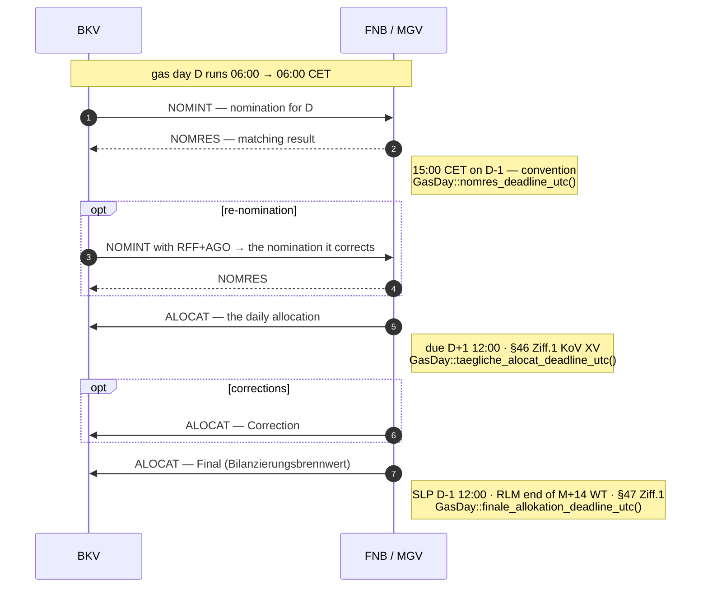

+++
title = "DVGW EDI"
description = "dvgw-edi: parsing, validating and writing ALOCAT, NOMINT, NOMRES and SSQNOT for GaBi Gas 2.1. Covers message identity (carrier vs. document code), the Prüfidentifikator catalogue, DTM format codes, the position model, validation rules, and GaBi Gas workflow integration."
weight = 14
+++
# DVGW EDI

The `dvgw-edi` crate implements EDIFACT parsing, validation and writing for the
German gas transport and balancing market (GaBi Gas 2.1, BNetzA BK7-24-01-008).
It is the DVGW counterpart to `edi-energy`, which covers the BDEW EDI@Energy
retail-market layer.

---

## 1. Regulatory Basis

### 1.1 Statutory framework

| Document | Significance |
|---|---|
| **§20 Abs. 3 EnWG** | Festlegungskompetenz for gas network access and balancing; exercised through the BK7 Festlegungen (GasNZV was repealed with effect from the end of 31.12.2025) |
| **GaBi Gas 2.1** (BNetzA **BK7-24-01-008**) | Current ruling. Introduced the two-market-area model, simplified exit-zone products, and mandatory DVGW-format electronic exchange. |
| **Kooperationsvereinbarung Gas** (KoV) | Industry agreement between all German gas network operators (§ 20 Abs. 1b EnWG), mandating the DVGW EDIFACT formats for balancing and transport processes |
| **DVGW G 685** | Technical standard for gas metering and allocation calculations |

### 1.2 Governance authority

The DVGW Projektkreis Datenaustausch develops and publishes the message
descriptions; DVGW Service & Consult GmbH hosts them:

> <https://www.dvgw-sc.de/leistungen/it-dienstleistungen/datenaustausch-gas>

**Key distinction from EDI@Energy:** BDEW EDI@Energy governs retail gas market
communication (UTILMD G, GeLi Gas, WiM Gas). DVGW governs the *transport and
balancing* layer — the wholesale NB/MGV/BKV processes BDEW does not cover.

---

## 2. Message Identity

### 2.1 The carrier is not the message

Every DVGW format is a **subset of a UN/EDIFACT D.07A message**. `UNH` therefore
names the carrier, never the DVGW message:

```text
UNH+1+ORDERS:D:07A:UN:DVGW18'          ← the carrier
BGM+01G::332+NOMINT00052'              ← this is what says NOMINT
DTM+Z05:0:805'                         ← the timestamps below are UTC
DTM+137:201801042056:203'              ← message date/time
DTM+Z01:201801050400201801060400:719'  ← Gültigkeitszeitraum = the gas day
RFF+Z13:70030'                         ← Prüfidentifikator
NAD+MS+9870009700005::332'
NAD+MR+9870009700005::332'
LIN+1'
LOC+Z19+ABCD1234::332'
DTM+2:201801050400201801060400:719'
QTY+Z03:6782:KW1'
NAD+ZEU+BK-CODE-1::332'
NAD+ZES+BK-CODE-2::332'
UNS+S'
UNT+19+1'
```

Identity is resolved from `BGM` C002 DE 1001 (`DvgwDocument`), with the carrier
used only as a cross-check: a `01G` arriving on `ORDRSP` is refused as
`Error::CarrierMismatch` because the two identifying fields disagree.

### 2.2 The catalogue

| Message | Carrier | Document codes (`BGM` DE 1001) | Prüfidentifikatoren |
|---|---|---|---|
| **ALOCAT** — Allokationsnachricht | `ORDRSP` | `X1G` SLP-Allokation · `X2G` korr. Mengenmeldung NKP · `X3G` SLP-Ersatzwerte · `X4G` untertägig · `X5G` endgültig · `X6G`/`X7G` korr. Allokation · `XBG` tägl. Mengenmeldung NKP | 70001–70023 |
| **NOMINT** — Nominierung | `ORDERS` | `01G` Transportkunde · `55G` VHP · `Y1G` Flexibilitätsübertragung · `Y6G` gebündelte Kapazität · `Y7G` Weitergabe zwischen NB | 70030–70034 |
| **NOMRES** — Nominierungsantwort | `ORDRSP` | `07G` Matching · `08G` Bestätigung · `19G` VHP-Matching · `20G` VHP-Bestätigung · `Y2G` Bestätigung FlexÜbertragung | 70035–70039 |
| **SSQNOT** — Mehr-/Mindermengenmeldung | `ORDRSP` | `BAG` Mehr-/Mindermengenmeldung zur Führung des Netzkontos | 70095 (SLP), 70096 (RLM) |

DE 3055 is `332` (DVGW Service & Consult) on every DVGW-coded value; a party
identified by a GLN carries `9` (GS1), which the `NAD` rows admit beside it.

### 2.3 Acknowledgement layer

DVGW adopted the BDEW CONTRL/APERAK pattern. Those are BDEW formats, specified
in `edi-energy` profiles and **not** reimplemented in `dvgw-edi`. See
"Ergänzungsblatt zur APERAK und CONTRL für die Nutzung in GaBi Prozessen".

The CONTRL Empfangsbestätigung obligation (CONTRL AHB 1.0 §2.3.1, six wall-clock
hours) is keyed on Sparte, so it applies to a DVGW interchange unconditionally —
the DVGW formats *are* the gas transport layer. `makod` discharges it from the
DVGW ingest path; the AS4 `eb:Receipt` is a protocol acknowledgement and does not.

### 2.4 Test interchanges

`UNB` DE 0035 = `1` marks a test interchange. Allgemeine Festlegungen V6.1d §3
forbids processing one as production, and DVGW rides the same `UNB` envelope, so
`makod` refuses a flagged DVGW interchange at the ingest boundary and records a
dead-letter entry — the same treatment both BDEW doors give it. Without that,
a counterparty's test ALOCAT would allocate quantities against a real gas day.

### 2.5 Formats not implemented

SCHEDL, IMBNOT, TRANOT, DELORD, DELRES, CHACAP, NUEVOR, SLPASP and TSIMSG are
not parsed, and `mako-gabi-gas` carries no workflow and no Prüfidentifikator
for them. Implementing one starts with its Nachrichtenbeschreibung: the shape
is predictable — the four implemented formats share a header and a
`LIN`/`LOC`/`QTY` body — but which `BGM` DE 1001 codes and which
Prüfidentifikatoren a format publishes is not derivable from the others.

---

## 3. Version Management

DVGW publishes twice a year, with implementation cutovers on **1 April** and
**1 October, 06:00 CET**.

`UNH` S009 DE 0057 carries the Anwendungscode, and DVGW puts two different things
in it without distinguishing them syntactically:

| Message | DE 0057 | Meaning |
|---|---|---|
| NOMINT 4.6, NOMRES 4.7, SSQNOT 5.7 | `DVGW17` | Nachrichtentypen-Paket 17 |
| ALOCAT 5.11a | `5.11a` | the message version itself |

It is therefore **not** a uniform version key. `DvgwVersion` captures it verbatim
so it round-trips and operators can see what a counterparty claims, and nothing
in the crate selects behaviour from it; the builder writes the family's value
(`DvgwMessageType::anwendungscode`) unless told otherwise.

A *Fehlerkorrektur* (`FK`) is an editorial correction: the version string is
unchanged and no parser change is required.

---

## 4. Dates

Every DVGW `DTM` is a triple — qualifier, value, **format code** — and the format
code says how to read the value:

| Segment | Meaning | Format |
|---|---|---|
| `DTM+Z05` | Zeitzonen-Definition (`0` = UTC) | `805` whole hours |
| `DTM+137` | Datum und Zeit der Nachricht | `203` `CCYYMMDDHHMM` |
| `DTM+Z01` | Gültigkeitszeitraum der Nachricht — **the gas day** (SSQNOT: the Abrechnungszeitraum) | `719` `CCYYMMDDHHMMCCYYMMDDHHMM` |
| `DTM+9` | Bearbeitungsdatum of the original nomination, beside `RFF+AGO` (NOMINT) | `203` |
| `DTM+2` | period for the quantity that follows it | `719` |

`DTM+137` is the moment the message was written, not the day it reports on. The
gas day is `DTM+Z01`, and it is a *period*: `201801010500201801020500` is 05:00
UTC to 05:00 UTC, the 06:00 CET gas-day boundary in winter.

`dvgw-edi` decodes each value against its own format code and **refuses** a value
that does not match, surfacing `DVGW-DTM-UNDECODABLE` rather than guessing. A
lenient reader that tries a couple of shapes and falls back to "today" books the
whole message against the wrong gas day, silently.

---

## 5. The Position Model

```text
BGM DTM×3 RFF+ NAD+MS NAD+MR
└─ LIN                          ← LineItem (Positionsnummer)
   ├─ IMD                       ← NOMRES: 16G gematcht / 12G–15G akzeptiert, verarbeitet / 17G nominiert / 18G Gegenseite
   ├─ LOC                       ← LocationGroup, repeats — one per period
   │  ├─ DTM+2                  ← the period of the quantity that follows
   │  └─ QTY (+STS)             ← Quantity; STS = Zeitreihentyp (ALOCAT) / Verfahren (SSQNOT)
   └─ NAD+ZEU / NAD+ZSH / …     ← Bilanzkreis, Netzkonto, VHP
```

Four properties of this shape are easy to get wrong:

- **A profile is a run of `LOC` groups.** The DVGW column of every
  Nachrichtenstruktur caps `DTM+2` and `SG37 QTY` at one per `LOC`, so an hourly
  profile repeats the `LOC` per hour. The reader keeps every `QTY` it meets
  under a `LOC` all the same — a counterparty that packs a series under one
  `LOC` loses nothing — and `DVGW-LOC-MAX` reports the excess; the builder
  writes the conformant shape.
- **A `LOC` may carry no code.** ALOCAT and SSQNOT send `LOC+Z99` when the
  message needs no specific place. Requiring an identifier drops the whole
  position.
- **NOMRES positions are only separable by their `IMD`.** Without it the
  counterparty's quantity is indistinguishable from your own — same location,
  same period, often the same number.
- **The Zeitreihentyp is the `STS`.** `LIN` C212 DE 7143 is `Z01` „allokiert"
  on every ALOCAT position; the Zeitreihentyp the Zuordnungstupel name is the
  `STS` DE 9015 under the quantity (`09G` SLP synthetisch, `14G` RLM, …).

### 5.1 A quantity is a rate — unless its unit says otherwise

`KW1` is **kWh/h** and `KW2` **kWh/d**, so such a `QTY` states a rate over the
period its own `DTM+2` names, and the energy is `Σ(rate × duration)`. Summing
the values of a profile adds rates together — a number in no unit at all, and
one that happens to be correct whenever every step is an hour long. `KWH` is
the energy itself. Which units a family admits is the Segmentlayout's
(`DvgwMessageType::admitted_units`): ALOCAT `KW1`/`KW2`, NOMINT and NOMRES
`KW1`/`KWH`, SSQNOT `KWH` only.

| Accessor | Returns |
|---|---|
| `Quantity::energy_kwh()` | one quantity's energy, `None` if it cannot be integrated |
| `DvgwMessage::energy_by_qualifier()` | totals per `QTY` qualifier, in kWh |
| `DvgwMessage::energy_by_qualifier_where(keep)` | the same, over selected positions |
| `DvgwMessage::single_energy_kwh(keep)` | one total, or `None` when there is no single answer |

Totals stay **per qualifier** because the qualifier is the direction: `Z02` in,
`Z03` out, and a VHP nomination states a purchase and a sale in one interchange.
One scalar across them is a net position, so `single_energy_kwh` refuses — as it
does when any quantity could not be integrated, since a partial total
understates the gas day.

The position filter is for NOMRES, which reports **both** sides of a match:
`IMD` `17G` is what the recipient nominated, `18G` the counterparty's mirror,
`16G` the matched result, `12G`/`13G` what the (neighbouring) Netzbetreiber
accepted and `14G`/`15G` what it processed. A message may carry several for the
same position, so exactly one label may be counted — `16G` first when present,
since the matched quantity is what flows.

### 5.2 SSQNOT as one record

`dvgw_edi::ssqnot::MehrMindermengenmeldung::from_message` reads a SSQNOT as
its business record — Netzkonto (`SG39 NAD+ZSH`), Netzbetreiber (`NAD+MS`),
Abrechnungszeitraum (`DTM+Z01`), Verfahren (`STS` `A1G` SLP / `A2G` RLM) and
the Mehrmenge (`QTY+ZY0`) and Mindermenge (`QTY+ZY2`) in kWh — and refuses a
message the Segmentlayout refuses rather than booking a partial figure.

Values are `Decimal`, since gas settles to at least three decimal places (DVGW
G 685 §7) and binary floating point cannot hold those fractions exactly.

---

## 6. Prüfidentifikator Routing and Zuordnung

DVGW messages **do** carry a Prüfidentifikator. `SG1 RFF+Z13` DE 1153 is named
„Prüfidentifikator" in every Nachrichtenbeschreibung, and DE 1154 holds the code:

```text
RFF+Z13:70001'      ← ALOCAT: Allokation anhand von SLP (NB an MGV)
```

DVGW allocates from `70000–79999`, which does not overlap the BDEW ranges, so one
PID router carries both markets with no synthetic encoding. `dvgw_edi::catalogue`
ships the published Anwendungsfälle with their description and direction, and
`mako-gabi-gas` pins its routing lists to it by test.

Two neighbouring references are *not* the PID and are easy to confuse with it:

| Segment | Meaning |
|---|---|
| `RFF+ANX` | Clearingnummer (ALOCAT) |
| `RFF+AGO` | Referenz auf die Original-Nominierung (NOMINT) — the chain a re-nomination corrects |

### 6.0 The cycle around one gas day

ALOCAT, NOMINT and NOMRES are one loop: the BKV nominates, the FNB/MGV
matches and answers, and the allocation lands three times — preliminary, then
corrected, then final — each with its own deadline out of the
Kooperationsvereinbarung.



`AllocationVersion` (`Initial`/`Correction`/`Final`) is the typed form of the
three landings, and each deadline is registered as a `mako_engine::deadline`
when the preceding event is persisted — so a missed one surfaces as an alert
rather than as a silent gap.

### 6.1 How a message finds its process

DVGW does not leave this to the implementer. ALOCAT 5.11a §3.3 publishes, per
Prüfidentifikator, which *Zuordnungstupel* the receiver applies — and names the
exact segments each element is read from:

| Tuple | Elements | Segments | Assigns to |
|---|---|---|---|
| `ZO-T1` | Bilanzkreis, Netzbetreiber, Zeitreihentyp | `SG39 NAD+ZEU`, `SG39 NAD+ZSO`, `SG36 SG37 STS` | an object |
| `ZO-T2` | Verantwortlicher Absender, vorgelagerter NB, nachgelagerter NB | `SG3 NAD+MS`, `SG39 NAD+ZET`, `SG39 NAD+ZSZ` | an object |
| `ZO-T3` | Bilanzkreis, Netzkontonummer, Zeitreihentyp | `SG39 NAD+ZEU`, `SG39 NAD+ZSH`, `SG36 SG37 STS` | an object |
| `ZO-T4` | Bilanzkreis, Virtueller Handelspunkt, Zeitreihentyp | `SG39 NAD+ZEU`, `SG39 NAD+VHP`, `SG36 SG37 STS` | an object |
| `ZG-T1` | Clearingnummer | `SG1 RFF+ANX` | a Geschäftsvorfall |
| `ZO-T1:SSQNOT` | Netzkonto, Netzbetreiber | `SG39 NAD+ZSH`, `SG3 NAD+MS` (SSQNOT 5.7 §3.3) | an object |

`DvgwMessage::correlation_key()` resolves the tuple its Prüfidentifikator is
assigned and reads its values; a code with no published assignment yields `None`
rather than a guessed key. SSQNOT names its 2-Tupel `ZO-T1` as well; the label
keeps the family so the two cannot collide in one registry.

The last column is load-bearing. A `ZO-T*` tuple identifies an **object** — an
account, not one day of it — while `ZG-T1` identifies an open **Clearingfall**.
So `DvgwMessage::process_key()` composes the tuple with the gas day for the
`ZO-T*` cases — with the whole Abrechnungszeitraum for a SSQNOT, which reports
a month rather than a day — and leaves `ZG-T1` alone: an allocation process
holds one gas day's record and one § 47 KoV XV deadline, so a key without the day
would let the second day overwrite both of the first's, while a clearing case
legitimately spans several days under one number.

Nominations have no published tuple, because a NOMRES carries no reference back
to the NOMINT it answers — its single `RFF` is the Prüfidentifikator. They are
paired on the business key both messages carry: (Gastag, Ort, Bilanzkreis intern,
Bilanzkreis extern).

---

## 7. Validation

`DvgwPlatform::validate` checks a message against the Segmentlayout of its
Nachrichtenbeschreibung. Findings are `DvgwIssue` values with a typed `Severity`
and a stable rule id; only failures that prevent the message being *identified*
are returned as `Err`.

| Rule id | Applies to | Severity | Row it enforces |
|---|---|---|---|
| `DVGW-BGM-AGENCY` | all | Warning | `BGM` C002 DE 3055 = `332` |
| `DVGW-BGM-DOCNO` | all | Error | `BGM` C106 DE 1004 Dokumentennummer |
| `DVGW-DTM-Z05` / `-137` / `-Z01` | all | Error | the three mandatory header `DTM` rows |
| `DVGW-DTM-UNDECODABLE` | all | Error | value contradicts its own DE 2379 format |
| `DVGW-PERIOD-INVERTED` | all | Error | a period must run forwards |
| `DVGW-RFF-Z13` / `-RANGE` | all | Error | Prüfidentifikator present and in `70000–79999` |
| `DVGW-PID-FAMILY` | all | Warning | the `RFF+Z13` code belongs to this family |
| `DVGW-PID-DOCUMENT` | all | Error | `BGM` DE 1001 is the code the Anwendungsfall publishes (`DvgwDocument::for_pid`) |
| `DVGW-PID-RETIRED` | SSQNOT | Warning | 70096 / `STS+A2G` only for Zeiträume before 1.10.2015 (Hinweise [500]/[501]) |
| `DVGW-RFF-ANX` | ALOCAT Clearing | Error | Clearingnummer — the `D` group the six Clearing columns (70008–70010, 70018–70020) mark `Muss` |
| `DVGW-RFF-AGO-DTM` | NOMINT | Error | `DTM+9` beside `RFF+AGO` |
| `DVGW-NAD-MS` / `-MR` | all | Error | Absender / Empfänger |
| `DVGW-LIN-REQUIRED` / `DVGW-LOC-REQUIRED` | all | Error | at least one Positionsnummer, a `LOC` group per position |
| `DVGW-LOC-QUALIFIER` | all | Warning | `LOC` DE 3227 is one the family lists (`Z99`; `172`/`Z17`/`Z19`) |
| `DVGW-QTY-REQUIRED` / `-NUMERIC` | all | Error | every `LOC` group carries a numeric Menge |
| `DVGW-QTY-QUALIFIER` / `-UNIT` | all | Warning | C186 DE 6063 and DE 6411 are ones the family lists |
| `DVGW-QTY-INTEGER` | SSQNOT | Warning | natürliche Zahlen in kWh |
| `DVGW-DTM-2-REQUIRED` | all | Error | every Menge is preceded by the period it applies to |
| `DVGW-LOC-MAX` | all | Warning | one `DTM+2` and one `QTY` per `LOC` group |
| `DVGW-STS-REQUIRED` / `-CODE` | SSQNOT | Error / Warning | the Verfahren `A1G`/`A2G` on every Menge |
| `DVGW-NAD-ITEM` | all | Error | the position-level `NAD` rows the family marks `R` — ALOCAT both (`ZEU`/`ZET` and `ZSH`/`ZSO`/`ZSZ`/`VHP`), NOMINT/NOMRES `ZEU`, SSQNOT `ZSH` |
| `DVGW-IMD-REQUIRED` | NOMRES | Warning | `IMD` labels which side a position reports |

The rows that depend on the Anwendungsfall — the document code, the
Clearingnummer, the retired RLM case — are keyed on the Prüfidentifikator.
There is no compiled-in per-PID profile layer as in `edi-energy`: the DVGW
Anwendungsfall tables are not imported, so the rows that differ between
columns of one family are the ones listed above rather than the full
Prüfschablone.

---

## 8. Writing

`MessageBuilder` renders outbound messages, so the crate that reads a NOMRES can
produce the NOMINT it answers, and a Netzbetreiber can report its
Mehr-/Mindermengen:

```rust
let wire = MessageBuilder::new(DvgwDocument::NominierungTransportkunde)
    .document_number("NOMINT00052")
    .pruefidentifikator(70030)
    .message_datetime(sent_at)
    .validity_period(gas_day)
    .original_nomination("NOMINT00051", processed_at)   // RFF+AGO with its DTM+9
    .sender("9870009700005")
    .receiver_coded("4012345000023", "9")                // a GLN is coded under GS1
    .position(
        Position::new()
            .location("Z19", Some("ABCD1234"))
            .quantity("Z03", "6782", gas_day)            // KW1, the family default
            .party("ZEU", "BK-CODE-1")
            .party("ZES", "BK-CODE-2"),
    )
    .build()?;

let ssqnot = MessageBuilder::new(DvgwDocument::MehrMindermengenmeldung)
    .document_number("SSQNOT00052")
    .pruefidentifikator(70095)
    .message_datetime(sent_at)
    .validity_period(abrechnungsmonat)
    .sender("9870012345678")
    .receiver("9800505300009")
    .position(
        Position::new()
            .location("Z99", None)
            .quantity("ZY2", "6782", abrechnungsmonat)   // KWH
            .status("A1G")                               // SLP
            .party("ZSH", "THE0NKH712345678"),
    )
    .build()?;
```

`build()` refuses rather than emitting a message missing a `Muss` field, writes
`SG1` in the order each Nachrichtenstruktur lists it, stamps every coded value
with its agency, and repeats the `LOC` per period. The `UNB`/`UNZ` envelope is
deliberately not written — the AS4 layer owns it and its control reference.

`makod` renders the four families from its outbox: an entry whose
`message_type` is `ALOCAT`, `NOMINT`, `NOMRES` or `SSQNOT` carries `pid`,
`validity_period` and `positions` (the `BGM` code follows the column,
`DvgwDocument::for_pid`), goes through this builder, and is validated against
its Nachrichtenbeschreibung before the AS4 layer sees it. The Mehr-/
Mindermengen workflow enqueues its own SSQNOT that way
(`MehrMindermengenCommand::Melden`).

---

## 9. GaBi Gas Workflow Integration

### 9.1 The ingest path

Both families arrive over the same transports and route through the same
`PidRouter` — DVGW allocates 70000–79999 and BDEW does not, so one router serves
both. Only the parse differs, and it must: a DVGW message rides `ORDERS` or
`ORDRSP`, so the BDEW parser accepts an ALOCAT as a well-formed `ORDRSP`.

It also reads `70001` straight out of `RFF+Z13`, exactly where it looks for a
Prüfidentifikator — so the message routes correctly and arrives as the wrong
type, with no document code, no gas day and no positions. Neither `UNH` nor the
Prüfidentifikator separates the families.

`dvgw_edi::sniff` reads `BGM` DE 1001 out of the head of the interchange and
stops; `makod::dvgw_ingest::try_ingest` calls it first on all three inbound paths
(REST `POST /edifact`, AS4 inbound, and the combined-role loopback) and returns
`None` for a BDEW interchange, which pays only the sniff.

| Workflow | PIDs | Direction |
|---|---|---|
| `gabi-gas-nomination` | 70030–70034 (NOMINT), 70035–70039 (NOMRES) | Transportkunde ↔ NB/MGV — both ends: `SendNomination` states the positions and enqueues this tenant's NOMINT, `ReceiveNomint` records a Transportkunde's and `SendNomres` answers it; either opens the process the NOMRES closes |
| `gabi-gas-allocation` | 70001–70023 (ALOCAT) | NB → MGV, MGV → BKV, ENB/ANB → NB, MGV → NB, NB → BKV |
| `gabi-gas-mehr-mindermengen` | 70095 (SLP), 70096 (RLM) (SSQNOT) | NB → MGV — one process per Netzkonto and Abrechnungszeitraum, hosting both ends: `ReceiveSsqnot` records what a Netzbetreiber reports, `Melden` enqueues this tenant's own SSQNOT; a later report for the same period stands, and a RLM report for a Zeitraum from 1.10.2015 is refused |

Three properties of the dispatch are worth stating:

- **The gas day comes from `DTM+Z01`** and a message without a usable one is
  refused, not booked against today.
- **Only the NOMINT initiates.** A NOMRES resumes the nomination it answers and
  is skipped when there is none. A received NOMINT opens the process on the
  NB/MGV side (`ReceiveNomint`); a BKV tenant's own nomination opens it on the
  sending side (`SendNomination`), whose positions — point, direction,
  Bilanzkreise, one rate per period — become the NOMINT in the outbox.
- **A curtailment is detected from the numbers.** NOMRES has no status segment, so
  `08G`/`20G`/`Y2G` say only *that* the nomination was confirmed. The workflow
  compares the confirmed energy against what it stored at nomination time and
  records `PartiallyAccepted` when it is lower — a curtailed nomination recorded
  as fully accepted leaves the BKV's portfolio short with nothing pointing at it.

  The confirmed figure is read from **one** `IMD` label, not their union: a NOMRES
  may state the nominated quantity (`17G`) *and* the matched one (`16G`) for the
  same position, and `16G` wins because the matched quantity is what will flow.
  Summing them double-counts as surely as including the counterparty's `18G`.
- **A Matching-Benachrichtigung decides nothing.** `07G`/`19G` report the state of
  the match; only a Bestätigung accepts. The ingest arm records one and leaves the
  nomination open — treating it as an answer drives the process to a terminal
  `Rejected`, and the Bestätigung that follows then fails, leaving a confirmed
  nomination on file as rejected. The matching obligations themselves are a
  process question rather than a format one.

`X5G` (Endgültige Allokation) is deliberately **not** mapped to
`AllocationVersion::Final`: DVGW publishes `X6G`/`X7G` corrections that follow
the endgültige one, while the workflow treats `Final` as settled and refuses any
later correction.

### 9.2 INVOIC billing

`GaBiGasInvoicWorkflow` handles the BDEW INVOIC PIDs, which are `edi-energy`
messages validated through the AHB/MIG profile layer:

| PID | Process | Direction |
|---|---|---|
| 31010 | Kapazitätsrechnung | FNB/VNB → BKV |
| 31007 | Aggreg. MMM-Rechnung Gas | NB → MGV |
| 31008 | MMM-Rechnung Gas selbst ausgestellt | NB → MGV |

> **PID 31011 is not a GaBi Gas billing.** It is the GeLi Gas billing for grid
> operator charges during gas disconnection (NB → LF) and belongs to
> `mako-geli-gas` per BK7-24-01-009.

### 9.3 Gas domain model (`mako-gabi-gas`)

| Type | Purpose |
|---|---|
| `GasDay` | Typed gas market day (DST-aware, 06:00 CET start, 23/25-hour DST days); `GasDay::containing` recovers it from a `DTM+Z01` period start |
| `GasQuantity` | Decimal-precision kWh_Hs with m³ + conversion metadata |
| `GasBeschaffenheit` | Brennwert (Hs/Hu) + Zustandszahl; `.validate()` checks DVGW G 260 ranges |
| `GasQualityFlag` | 7-state quality flag per § 60 Abs. 2 MsbG |
| `AllocationVersion` | Initial/Correction(n)/Final per §§46/47 KoV XV |
| `GasMarketRole` | 9-role typed enum (LF, NB, FNB, VNB, BKV, MGV, MSB, Händler, TNB) |
| `GasImbalanceSaldo` | Mehr/Minder/Balanced with `ausgleichsenergie_price_ct_per_kwh` per KoV §9 |
| `GasPortfolioBalance` | BKV portfolio across Bilanzkreise; `conservation_check()` per GaBi Gas 2.1 |

---

## References

| Resource | URL / Path |
|---|---|
| DVGW GaBi Gas message index | <https://www.dvgw-sc.de/leistungen/it-dienstleistungen/datenaustausch-gas/gabi-gastransport> |
| DVGW document archive | <https://www.dvgw-sc.de/leistungen/it-dienstleistungen/datenaustausch-gas/dokumentenarchiv> |
| ALOCAT specification | DVGW-Nachrichtenbeschreibung ALOCAT 5.11a — ORDRSP / UN D.07A S3 |
| NOMINT specification | DVGW-Nachrichtenbeschreibung NOMINT 4.6 — ORDERS / UN D.07A S3 |
| NOMRES specification | DVGW-Nachrichtenbeschreibung NOMRES 4.7 — ORDRSP / UN D.07A S3 |
| SSQNOT specification | DVGW-Nachrichtenbeschreibung SSQNOT 5.7 — ORDRSP / UN D.07A S3 |
| GaBi Gas 2.1 Festlegung | BNetzA BK7-24-01-008 |
| `dvgw-edi` source | [crates/dvgw-edi/](https://github.com/hupe1980/mako/tree/main/crates/dvgw-edi) |
| `mako-gabi-gas` source | [crates/mako-gabi-gas/](https://github.com/hupe1980/mako/tree/main/crates/mako-gabi-gas) |
| Process engine guide | [docs/engine.md](@/docs/architecture/engine.md) |

---
