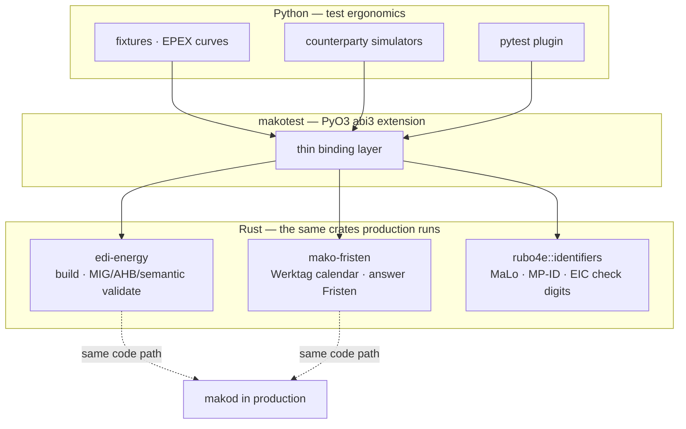

+++
title = "makotest (Python)"
description = "Python test & simulation toolkit for MaKo platforms: BDEW identifier check digits, the published answer-Frist table, AHB-validated EDIFACT, counterparties that answer in EDIFACT, and a pytest plugin — over the same Rust core the platform runs."
weight = 18
+++

# makotest — Python test & simulation toolkit

`makotest` builds regulator-conformant EDIFACT, simulates the counterparties a
MaKo platform talks to — in EDIFACT, so a test can feed the answer back — and
asserts on the result.

It is **not mako-specific**. Everything it drives is a public wire contract
(EDIFACT over AS4, REST, CloudEvents), so it can exercise any MaKo
implementation.

```python
from makotest import antwort_obligation, malo_from_base, validate_edifact

malo_from_base("5123869601")          # '51238696012' — BDEW check digit applied

o = antwort_obligation(55001)         # what a Netzbetreiber owes on an Anmeldung
o.clock_time                          # '11:00' — a clock time, not n × 24 h
o.due_at("2026-03-02T09:00:00Z")      # '2026-03-03T11:00:00+01:00'

validate_edifact(utilmd_bytes, "2026-10-01").is_valid   # MIG + AHB + semantic
```

---

## The binding boundary

The toolkit is a PyO3 extension over the same Rust crates the platform runs.
Nothing regulated is reimplemented in Python: a second implementation drifts from
the BDEW documents at the first Formatumstellung, and a harness that disagrees
with production about what is valid — or about when a Frist expires — is worse
than none.

The rule: **anything a regulator defines in a table is Rust; anything shaped by
test ergonomics is Python.**

| Concern | Home |
|---|---|
| EDIFACT build + MIG/AHB/semantic validation | Rust — `edi-energy` |
| Release per format version | Rust — `edi-energy::registry` |
| Identifier check digits (MaLo, MP-ID, EIC, §8.2 resources) | Rust — `rubo4e::identifiers` |
| Werktag calendar and acknowledgement clocks | Rust — `mako-fristen` |
| Answer Fristen per Prüfidentifikator | Rust — `mako-fristen::antwort` |
| Counterparty behaviour, EPEX curves, fixtures | Python |



Because validation runs the platform's own AHB engine, `makotest` proves
*process and integration* behaviour. It is **not** an independent check of format
conformance — the BDEW reference examples remain the authority there.

---

## Install

```bash
pip install makotest                  # identifiers, Fristen, EDIFACT, simulators
pip install 'makotest[hypothesis]'    # + property-based strategies
```

Wheels are **abi3** (`abi3-py311`) — one wheel serves Python 3.11 and later. No
runtime dependencies.

The wheel also installs a `makotest` command, so the same answers are reachable
from a shell by whoever is holding a real message rather than writing a test:

```console
$ makotest validate inbound.edi --on 2026-04-01
UNB 4012345000023:14 → 9900357000003:500  ref=REF1
#0 UTILMD S2.1 pid=55001 INVALID
    error    [SEM-UTILMD-LOKATIONS-ID] SG4/LOC[1].0: not a Messlokations-ID

INVALID on 2026-04-01

$ makotest frist 55001 --received 2026-03-02T09:00:00Z
$ makotest id 9900357000004         # → satisfies NEITHER check-digit procedure
$ makotest pids UTILMD --on 2026-04-01 --sparte STROM
$ makotest versions
```

Exit status is the contract: **0** when the answer is yes, **1** when it is no,
**2** when the question was malformed. A vacuous pass — an interchange that
validated because no AHB rule was applied to its Prüfidentifikator — exits **1**,
because a shell gate that reported success for one would be decoration. `--json`
emits the same report machine-readably.

---

## Identifiers

A random 11-digit string is a valid Marktlokations-ID one time in ten, and a
random 16-character string is essentially never a valid EIC. A test that invents
one exercises the rejection path while claiming to test the happy path, so every
family has a constructor:

```python
from makotest import (
    bilanzierungsgebiet_from_prefix, bilanzkreis_from_prefix,
    malo_from_base, mp_id_from_base, resource_id_from_base,
)

malo_from_base("5123869601")                    # '51238696012'
mp_id_from_base("990035700000", "bdew")         # '9900357000003' — §8.1
mp_id_from_base("401234500002", "gln")          # '4012345000023' — EAN-13
bilanzkreis_from_prefix("11XSWKIEL------")      # EIC Party  — a Bilanzkreis
bilanzierungsgebiet_from_prefix("11YSWKIEL------")  # EIC Area — a Gebiet
resource_id_from_base("nelo", "E000000001")     # 'E0000000019' — §8.2
```

Two traps the API keeps apart.

**A Marktpartner-ID has two check-digit procedures.** §2.3 of the BDEW
Anwendungshilfe defines the Lok- und Waggon-Kennzeichnungsverfahren for BDEW- and
DVGW-Codenummern and the GS1/EAN-13 procedure for a GLN. They disagree on almost
every base, and the prefix does not decide it — which is why `mp_id_from_base`
takes the scheme, and `mp_id_check_digit_schemes` returns a **list** (a code can
satisfy both). An empty list means every conformant counterparty refuses it.

**A Bilanzkreis is not a Bilanzierungsgebiet.** The first is an ENTSO-E *Party*
(object type `X`), the second an *Area* (`Y`). Both are 16 characters, both carry
a valid check character, and MSCONS SG6 carries both as free text under different
`LOC` qualifiers — so a series filed against the wrong one is a misfiling the
BIKO cannot tell from a correct submission.

---

## Fristen: three shapes, one table

Regulated processes are deadline-driven, so time is an input, never ambient. The
calendar is BDEW's **conservative-inclusive** one: a day observed as a holiday in
*any* German state is a non-Werktag, and 24.12. and 31.12. count as holidays
(GPKE Teil 1). No Frist is ever computed shorter than the Festlegung requires for
some participant.

### Which date — calendar arithmetic

```python
from makotest import add_werktage, is_werktag, next_werktag

is_werktag("2026-01-06")       # False — Heilige Drei Könige (BY, BW, ST only)
add_werktage("2026-12-24", 2)  # '2026-12-29' — 25/26 holidays, 27/28 weekend
next_werktag("2026-11-07")     # '2026-11-09' — Saturday rolls to Monday
```

### Which moment — and there is no single formula

"A Werktage Frist expires at 17:00 Europe/Berlin" is true of the WiM MSB-Wechsel
windows and of nothing else:

| Family | Shape | Example |
|---|---|---|
| GPKE | a clock time on the 1. Werktag after the ÜT | 55001 → 11:00 |
| GeLi Gas | the **end** of the *n*-th Werktag | 44001 → Ablauf 4. WT |
| WiM | 17:00 Europe/Berlin on the *n*-th Werktag | 55039 → 3 WT |

Sizing all three the same is wrong in both directions, and the loose direction is
silent: it reports a lapsed Frist as still running. So ask the table:

```python
from makotest import antwort_obligation, antwort_obligations, assert_deadline_is

o = antwort_obligation(55001)
o.family, o.answered_by            # 'gpke', 'NB'
o.shape, o.clock_time, o.werktage  # 'next_werktag_at', '11:00', None
o.bestaetigung_pid, o.ablehnung_pid, o.ebd   # 55002, 55003, 'E_0622'
o.source        # 'BK6-24-174 GPKE Teil 2, SD Lieferbeginn Prozessschritte 5/6'
o.due_at("2026-03-02T09:00:00Z")   # '2026-03-03T11:00:00+01:00'

antwort_obligations()              # every published obligation, four families
assert_deadline_is(response["deadline"], received=received, pid=55001)
```

`antwort_obligation` returns `None` when no Festlegung this codebase has read
quantifies the window. That is **unknown**, never unbounded — GeLi Gas 44020's
Frist is set per Netzbetreiber, so it is absent rather than guessed.

The **acknowledgement and the business answer are separate clocks** — 45 minutes
versus days for Strom UTILMD. Conflating them is the classic WiM error.

| Function | Window |
|---|---|
| `antwort_deadline(pid, received)` | the published window for that process |
| `deadline_at_werktage(received, n)` | *n* Werktage → 17:00 Berlin (WiM shape) |
| `end_of_werktag_after(received, n)` | end of the *n*-th Werktag (GeLi Gas shape) |
| `next_werktag_at(received, "11:00")` | clock time on the 1. WT (GPKE shape) |
| `berlin_instant(date, "09:00")` | that wall clock, with that date's own offset |
| `berlin_mtu_count(date, 15)` | market time units the day has — 92, 96 or 100 |
| `contrl_due_at(received)` | 6 hours — CONTRL |
| `aperak_strom_due_at(received)` | 45 minutes on a weekday |
| `aperak_gas_folgeprozess_due_at(received)` | next Werktag 12:00 |
| `aperak_gas_initialprozess_due_at(received)` | 3 Werktage |
| `add_hours(received, h)` | wall-clock hours — runs through weekends |

The offset follows the CET/CEST transition; rendering a deadline in UTC hides the
hour that makes it correct, and a *fixed* offset is wrong for half the year —
which is why `berlin_instant` resolves it from the date rather than carrying one.
And no calendar-day approximation is sound: **one** Werktag from Wednesday
30.12.2026 expires Monday 04.01.2027, five calendar days later.

`assert_frist_met(pid, received=…, answered_at=…)` measures an answer against the
same window, and names the Fundstelle when it was late.

---

## Building EDIFACT

The **send date** picks the format version, and the release follows from it.
Pinning a release by hand and validating on a date where a different one is in
force produces findings that describe the mismatch rather than the message.

```python
from makotest import UtilmdTransaction, build_interchange, build_utilmd

msg = build_utilmd(
    55001,
    sender="4012345000023",
    receiver="9900357000003",
    on="2026-04-01",                     # → release S2.1, DTM+137:202604010000+00
    transactions=[
        UtilmdTransaction(
            "VORGANG-1",                  # IDE+24 — never a location ID
            locations=[("melo", "DE00014559929E00856996N5139699L01")],
            dates=[("92", "20260501")],   # SG4 DTM — Beginn zum
            references=[("Z13", "55001")],
        )
    ],
)
wire = build_interchange(
    sender="4012345000023", receiver="9900357000003",
    dar="REF1", messages=[msg], on="2026-04-01",
)
# UNB+UNOC:3+4012345000023:14+9900357000003:500+260401:0000+REF1'…UNZ+1+REF1'
```

`build_utilmd` and `build_mscons` return a **message** (`UNH`…`UNT`); the wire
unit a market partner receives over AS4 is an interchange. The UNB qualifier
after each party ID is derived from the ID — `14` for a GLN, `500` for a BDEW
code — so it cannot contradict it.

| Builder | Produces |
|---|---|
| `build_utilmd` / `build_mscons` | the request or the meter data |
| `build_aperak` / `build_contrl` | an acknowledgement from scratch |
| `build_aperak_for(received)` / `build_contrl_for(received)` | the acknowledgement, parties mirrored and the reference echoed |
| `build_answer(received, answer_pid)` | the Bestätigung or Ablehnung, mirroring the request's SG4 object and references |
| `message_index=` on either | which message of a multi-message interchange is answered |
| `build_interchange` | the UNB/UNZ envelope |

`release_for(message_type, on, sparte)`, `releases(message_type)` and
`format_versions()` expose what the build can validate against.

Building and validation are deliberately **separate steps**: a test must be able
to construct a knowingly-invalid message and assert that the right rule rejects
it.

---

## Validation

```python
from makotest import assert_edifact_valid, assert_rule_fires, validate_edifact

report = validate_edifact(wire, "2026-04-01")
report.envelope.sender_qualifier      # '14' — derived from the party ID
report.envelope.is_structurally_valid # UNZ count and control refs agree
report.messages[0].rules_applied      # were AHB rules really applied?
report.errors[0].position             # 'IDE' — plus [element].component when known
report.errors[0].rule_origin          # 'semantic' — the layer that fired

assert_edifact_valid(wire, on="2026-04-01")
assert_rule_fires(bad, "SEM-UTILMD-LOKATIONS-ID", on="2026-04-01")
```

The report covers the whole interchange: the envelope's structural integrity and
**every** message inside it. Validating only the first is how a broken second one
gets shipped. The single-message accessors (`report.pruefidentifikator`, …) raise
on a multi-message interchange rather than answering for one of them.

`rules_applied` is the guard against **vacuous validation**. A Prüfidentifikator
the profile set has no rules for validates having checked nothing — `is_valid`
comes back true — so `assert_edifact_valid` refuses such a pass instead of
reporting success. `assert_rules_applied` is the same check for a message you
expect to be invalid.

`rule_origin` separates a **syntax** failure (`parse`, `directory`) from an
**application** one (`mig`, `ahb`, `semantic`, `custom`). That is the distinction
between an interchange a counterparty answers with a CONTRL and one it answers
with an APERAK.

### Two failures, two exceptions

`AssertionError` means the **system under test** is wrong. `ValueError` means the
**test** is — a Prüfidentifikator with no published Frist, an event pattern the
catalog cannot satisfy, two mutually exclusive arguments. An assertion that
cannot fail is this toolkit's central failure mode, and it should not look like a
system defect.

---

## CloudEvents

EDIFACT is one wire contract a MaKo platform exposes; the event stream is the
other. Asserting on it carries the mirror image of vacuous validation: a test
naming a type the platform does not declare — a typo, or one retired by a rename
(`de.edmd.*` became `de.messwert.*`) — passes forever as *"no such event was
emitted"*, and that is precisely what a missing-event assertion expects to find.

So the catalog is bound rather than copied, and so is the glob matcher every
subscription mechanism in the platform uses.

```python
from makotest import assert_event_emitted, assert_no_event_emitted, find_events

found = assert_event_emitted(webhook_bodies, "de.mako.process.*", subject=malo)
found["data"]["status"]

assert_no_event_emitted(webhook_bodies, "de.mako.aperak.timeout")
find_events(webhook_bodies, "de.*.rechnung.*")     # `*` any run, `?` one char
```

A pattern the catalog cannot satisfy raises rather than filtering to nothing —
otherwise `assert_no_event_emitted` passes on a typo, forever.

`assert_cloudevent` checks the envelope against CloudEvents 1.0:

| Check | Why |
|---|---|
| required attributes present, `specversion == "1.0"` | a receiver rejects the event otherwise |
| `time` parses as RFC 3339 | a `Debug`-formatted datetime renders plausibly and is not RFC 3339 |
| `type` is in the platform's catalog | an invented or retired type matches nothing, silently |
| extension keys are §3.3-legal | lowercase alphanumeric, and never a core attribute — a collision serialises the key twice |
| `data` and `data_base64` are not both present | §3.1 makes them exclusive: two payloads, no rule for which one wins |

`data_base64` is the one JSON-format member that is neither a core attribute nor
a legal extension name, and it is accepted — an envelope check that knew only the
core nine would reject a conformant binary event.

| Function | Answers |
|---|---|
| `event_types()` | every declared type, sorted |
| `event_type_exists(t)` | is this a real type, or a typo/rename? |
| `event_matches(pattern, t)` | would this subscription deliver that event? |
| `event_types_matching(pattern)` | everything it would deliver — empty means a dead subscription |

---

## Counterparty simulators

Each simulator models what a counterparty *does* — including what it does not do.
Silence is the mode worth having: a platform that never sees it is never tested
against its own Fristen, and that is where regulated processes fail.

```python
def test_nb_bestaetigt(nb_sim, anmeldung):
    nb_sim.on(55001).bestaetigung(process_dates=[("92", "20260501")])
    reply = nb_sim.receive(anmeldung, received_at="2026-03-02T09:00:00Z")

    assert reply.pid == 55002
    assert reply.due_at == "2026-03-03T11:00:00+01:00"
    platform.ingest(reply.business)      # a real interchange, not a dict

def test_frist_faellt(nb_sim, anmeldung):
    nb_sim.on(55001).timeout()           # no answer, not even an acknowledgement
    assert not nb_sim.receive(anmeldung)

def test_verspaetete_antwort(nb_sim, anmeldung):
    nb_sim.on(55001).bestaetigung(delay_werktage=3)   # right message, wrong day
    reply = nb_sim.receive(anmeldung, received_at="2026-03-02T09:00:00Z")
    assert reply.answered_at > reply.due_at
```

The reply is a **rendered interchange**, built by the platform's own builders with
the parties mirrored and the request's SG4 `IDE` object and `RFF` references
echoed. An unconfigured partner acknowledges but sends no business answer, so a
forgotten binding exercises the deadline path rather than quietly passing.

Three ways for a partner to misbehave, because a platform that only ever sees a
punctual conformant one has never had its Fristüberwachung exercised: `.timeout()`
says nothing at all, `.antwort(pid=…)` answers with a PID the AHB does not
assign, and `delay_werktage=` sends a *conformant* answer after the window has
closed.

An interchange carries several messages, each a separate Vorgang. The reply
answers **all** of them, in one interchange, and `reply.pid` raises rather than
speaking for one — read `reply.pids`. Each outbound interchange gets its own
Datenaustauschreferenz from a per-simulator counter: UNB DE0020 identifies the
interchange to the receiver, so a reused one is a duplicate every conformant
receiver may discard.

Answers bind to **request** PIDs. `.on(55002)` raises — 55002 answers 55001 and
is not something a partner can be asked — and the refusal sits on `.on()` because
`.timeout()` and `.antwort()` never consult the answer table.

### The answer PIDs are not guessed

`MarktpartnerSim` resolves its answer from the AHB table in `edi-energy` — the
same table `mako-gpke` and `mako-geli-gas` derive their outbound response PID
from, pinned by conformance tests on both sides. A simulator computing
`Anfrage + 1` would be wrong twice over:

| Anfrage | Bestätigung | Ablehnung | Why |
|---|---|---|---|
| 55001 | 55002 | 55003 | the regular pattern |
| 55077 | 55078 | **55080** | 55079 is unassigned |
| 44020 | 44021 | **none** | confirmable, never rejectable |
| 44019 | none | none | neither answer exists |

`.antwort(pid=...)` bypasses the table when the *point* of the test is an
adversarial answer — a counterparty replying with the wrong PID is a thing that
happens, and a platform should reject it. `assert_answer_pid` is the assertion
for the conformant case.

An Ablehnung's EBD code is reported on the reply but not written into the
message: which segment carries it is fixed per process by the AHB, and the
toolkit does not guess AHB structure.

### BIKO and iMSys

`BikoSim` receives MaBiS Summenzeitreihen and answers with an APERAK — an
acceptance, or a Klärfall **queued rather than sticky**, so the re-submission
after Clearing can be asserted. It refuses anything not addressed to a
Bilanzkoordinator: a UTILMD, or an MSCONS outside 13003 / 13010–13012, is a
Messwesen message for a Netzbetreiber, and a simulator that accepted one would
make every assertion downstream of that acceptance meaningless.

`ImsysSim` models the SMGW compliance surface a platform has to react to: TAF
profile, CLS channel state, certificate expiry and revocation, and
Zählerstandsgang gaps and qualities. It does not reimplement BSI TR-03109 crypto.

The TAF names are the official ones from BSI TR-03109-1 (TAF 16 from the separate
Implementierungshinweis; there is no TAF 15), because the number alone is
ambiguous where it matters. Steering needs **TAF-11** („Steuerung von
unterbrechbaren Verbrauchseinrichtungen und Erzeugungsanlagen"); TAF-14 is
„Hochfrequente Messwertbereitstellung für Mehrwertdienste" — a fast read-out, not
a control path — so a gateway ordered under it opens no CLS channel.

`Zaehlerstandsgang.as_direct_push()` renders a delivery as the request **body** a
platform's SMGW ingest endpoint accepts, over the Europe/Berlin local day, with
one value per market time unit that day really has. A 96-value series on the
23-hour March day is refused rather than laid out past midnight.

Three states, three obligations, and a platform has to tell them apart:

| | On the wire | What the platform owes |
|---|---|---|
| a **Lücke** | the interval is absent | form an Ersatzwert; a zero would be settled against |
| `quality="SUBSTITUTED"` | present, stamped | bill it — it *is* the Ersatzwert (§ 60 Abs. 2 MsbG) |
| `quality="FAULTY"` | present, stamped | do not bill it, and substitute |

Values are decimal strings: energy is a decimal quantity, and a JSON float
carries a binary rounding error into whatever the platform settles against.

A counterparty is modelled once it has a consumer. One written ahead of its
consumer encodes guesses about an interface nobody has implemented, and to the
next reader those guesses are indistinguishable from requirements.

---

## pytest plugin

The plugin registers through the standard `pytest11` entry point — no
`conftest.py` wiring.

```python
def test_frist_is_met(frozen_clock, nb_sim, makotest_on):
    frozen_clock.advance_werktage(4)   # BDEW calendar, not naive +4 days
    reply = nb_sim.receive(anmeldung, received_at=frozen_clock.instant)
```

`frozen_clock` is a **Berlin local time and resolves its offset on every move**.
A German wall clock is `+01:00` for part of the year and `+02:00` for the rest, so
a clock carrying the offset it was constructed with reports `09:00+01:00` after
advancing into summer time — an instant an hour off the wall clock it claims, in
the same direction for every deadline asserted against it. Every dated fixture is
anchored to `--makotest-on`, so one test is never about two days.

| | |
|---|---|
| **Fixtures** | `epex`, `nb_sim`, `biko_sim`, `imsys_sim`, `frozen_clock`, `makotest_seed`, `makotest_on`, `mako_endpoint` |
| **Markers** | `@pytest.mark.regulatory("GPKE Teil 2")`, `@pytest.mark.requires_docker` |
| **Options** | `--makotest-on ISO_DATE`, `--makotest-seed N`, `--mako-endpoint URL` |

`--makotest-on` pins the BDEW format version for the whole session, so re-running
a suite on a future date shows what the next Formatumstellung breaks. It refuses
a date no compiled profile covers **for every message type the fixtures build**
rather than validating nothing — a gap between two format versions is otherwise
discovered as a build failure in whichever test happens to need that type.

`--hypothesis-profile=makotest` selects a registered profile with `deadline=None`
and `derandomize=True`. A strategy here draws through the Rust core, and
Hypothesis' 200 ms per-example deadline is written for pure functions: it reports
a loaded machine as a defect in the system under test.

Only `makotest.plugin` imports pytest. The generators and simulators are plain
objects usable from a script or notebook, so a demo and a CI test drive the same
code path.

---

## Property-based testing

```python
from hypothesis import given
from makotest.strategies import malo_ids, pruefidentifikatoren

@given(malo=malo_ids(), pid=pruefidentifikatoren(message_type="UTILMD"))
def test_every_utilmd_roundtrips(malo, pid):
    ...
```

Needs the `hypothesis` extra. Every strategy constructs its values through the
Rust core, which is the point: a drawn value is one the platform **accepts**.

| Strategy | Draws |
|---|---|
| `malo_ids()` | check-digit-valid 11-digit Marktlokations-IDs |
| `melo_ids(country=…)` | 33-character Messlokations-IDs |
| `marktpartner_ids(kind=…)` | BDEW (`99…`), DVGW (`98…`) or GLN codes, each with its own check digit |
| `bilanzkreise()` | EIC **Party** codes (`11X…`) with a real check character |
| `bilanzierungsgebiete()` | EIC **Area** codes (`11Y…`) |
| `resource_ids(kind=…)` | NeLo, NeBe and the Redispatch resources (BDEW §8.2) |
| `pruefidentifikatoren(message_type=…, sparte=…, on=…)` | PIDs with real AHB rules |
| `antwort_pids()` | inbound PIDs with a published answer Frist |
| `werktage()` | dates that are Werktage under the BDEW calendar |
| `zeitreihen(on=… \| periods=…)` | kWh series, one value per MTU of that Berlin day |

`pruefidentifikatoren()` yields only PIDs the compiled profiles carry AHB rules
for; passing `on=` narrows it to the profile **active on that date**, which is
what a message sent then is really validated against.

`message_types_of(pid)` returns a **list**: a Prüfidentifikator does not identify
one message type — APERAK and COMDIS both declare 29001 and 29002.

---

## EPEX curves

Deterministic day-ahead curves in the MTU-keyed shape a platform ingests, with
**negative prices supported** — load-bearing for §51 EEG Vergütungsausfall and
§41a EnWG dynamic-tariff caps.

```python
from makotest.generators import EpexGenerator

sim = EpexGenerator(seed=42)
sim.mtu_count("2026-10-25")                     # 100 — a 25-hour local day
list(sim.day("2026-11-01", profile="winter_peak"))
list(sim.day("2026-06-21", profile="solar_glut", negative_hours=6))
```

A delivery day is a **Europe/Berlin calendar day**, and two a year are not 24
hours long: the last Sunday in March has 23 and the last in October 25 — 92 and
100 quarter-hourly MTUs. Assuming 96 invents four MTUs in March and drops four in
October, mid-day, where a curve still looks plausible and a settlement quietly
comes out wrong. The day boundary comes from the platform's own timezone
resolution, so a curve and the Fristen it is asserted against cannot disagree
about when a day starts.

Profiles: `flat`, `winter_peak`, `solar_glut`, `volatile`. The same seed
reproduces a curve exactly, and day order does not affect output.

Curves are synthetic test fixtures — never present them as market data.

---

## Business-object assertions

```python
from makotest import assert_bo4e_generation_matches, assert_invoice_reconciles

assert_bo4e_generation_matches(platform.bo4e_version)
assert_invoice_reconciles(rechnung)
```

`assert_invoice_reconciles` checks four identities, each only when both of its
sides are present:

| Identity | Reads |
|---|---|
| `Σ teilsummeNetto` = `gesamtnetto` | the positions add up |
| `Σ teilsummeSteuer.steuerwert` = `gesamtsteuer` | the VAT lines add up |
| `gesamtnetto + gesamtsteuer` = `gesamtbrutto` | net and gross agree |
| `gesamtbrutto − vorausgezahlt − rabattBrutto` = `zuZahlen` | the amount demanded |

Checking only the first is the trap worth naming: an invoice whose positions add
up and whose `zuZahlen` is wrong is the defect that reaches a customer, because
the positions are what a reviewer reads and `zuZahlen` is what gets collected.

The expected BO4E generation is asked of the linked `rubo4e` rather than written
down, so it cannot drift from the crates the wheel bundles. Testing one
generation's objects against a platform on another produces passes that mean
nothing.

Money is compared as `Decimal`, never `float`. A cent is not representable in
binary floating point, and an invoice assertion that drifts in the last place is
worse than no assertion. The default tolerance is one cent, because each total is
independently rounded; pass `tolerance_eur="0"` to demand exact agreement.

---

## Development

`makotest` is a member of the mako Cargo workspace and builds with
[maturin](https://www.maturin.rs/):

```bash
just test-makotest      # maturin develop + pytest
just lint-makotest      # ruff check + format check
just build-makotest     # release wheel
```

`pyo3/extension-module` is deliberately **not** a Cargo feature — maturin enables
it at build time. Declaring it would make `cargo test --workspace --all-features`
link the Rust test harness against it and fail on undefined Python symbols. CI
exercises both paths.

`py.typed` ships with the wheel, so `_native.pyi` is the only thing a consumer's
type checker sees. A test pins it against the compiled module in both directions.

---

## Scope

makotest covers the Rust core (identifiers, the Werktag calendar and Berlin-day
arithmetic, the published answer-Frist table, Prüfidentifikator and release
introspection, the AHB answer table, EDIFACT build + interchange + validation,
the CloudEvents catalog), the EPEX generator, the Marktpartner / BIKO / iMSys
simulators, hypothesis strategies, domain assertions, the pytest plugin and the
`makotest` CLI.

The Marktpartner simulator is a plain object with `receive()` and carries no AS4
transport of its own: a transport layers on top of it, so it is never a
dependency of the many tests that do not need one.

The package version tracks `workspace.package.version` through Cargo.toml, so the
wheel and the crates it binds can never report different versions.
