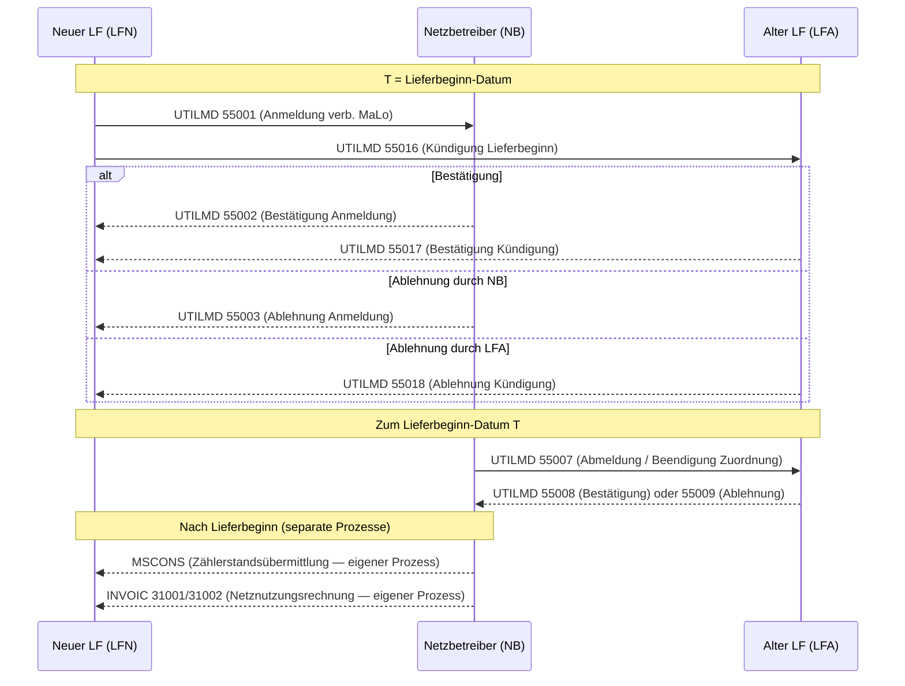
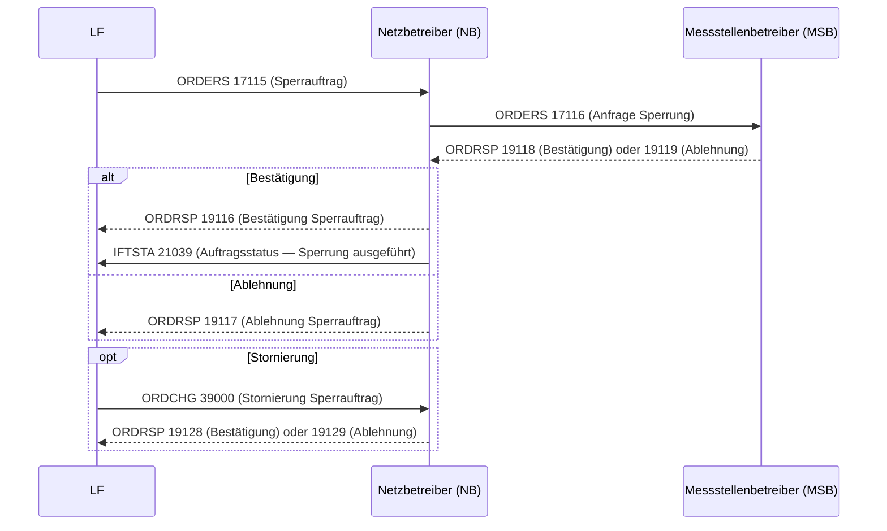
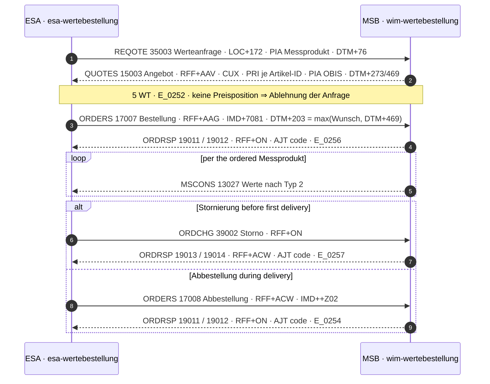
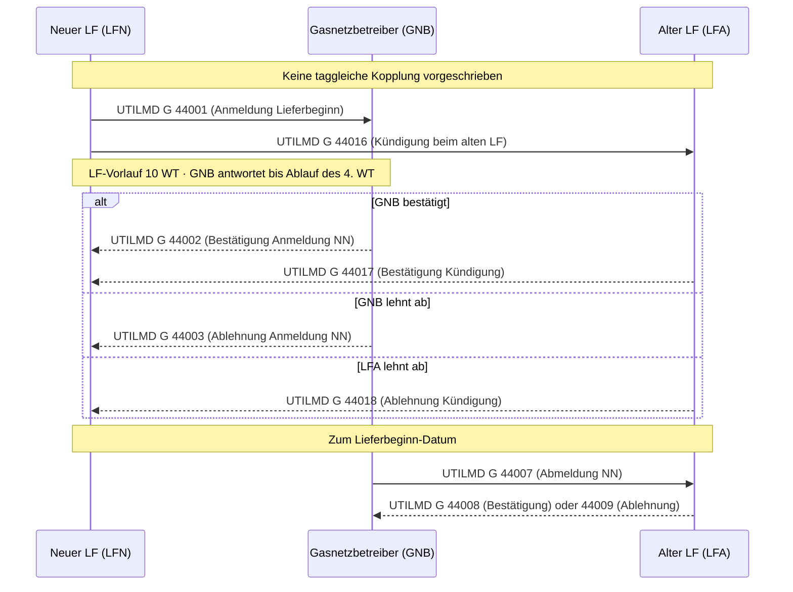
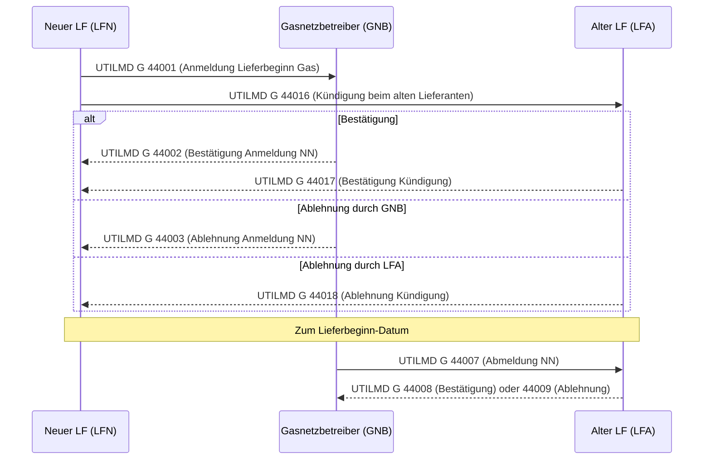
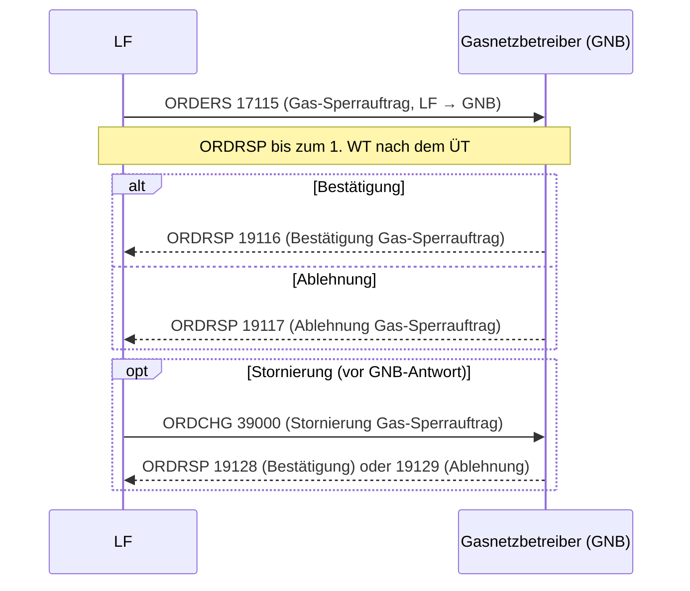
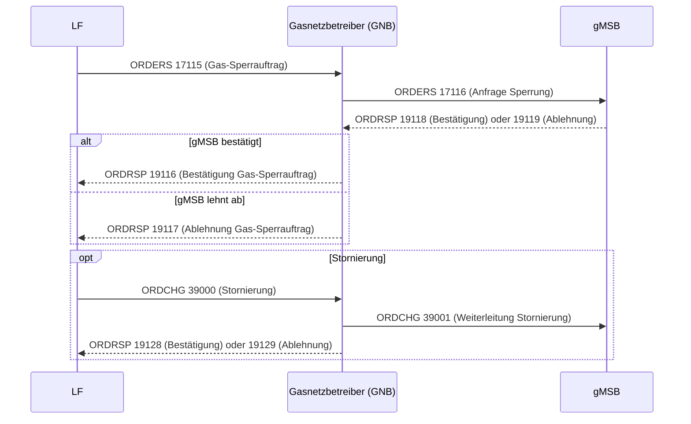
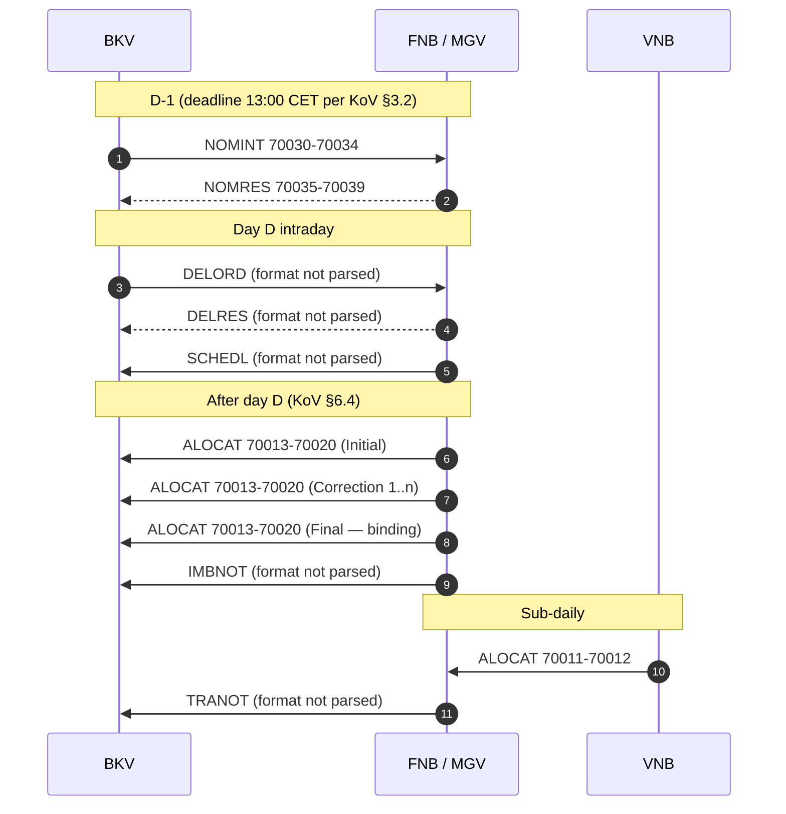
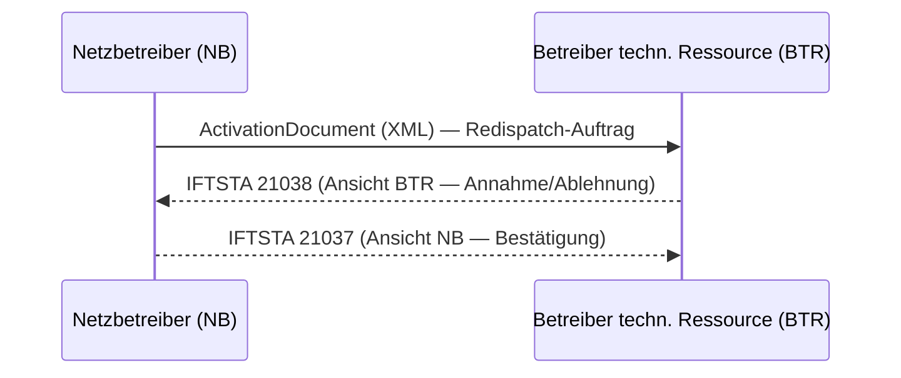

+++
title = "Process Catalog"
description = "Business-level catalog of all German energy market communication processes — GPKE, WiM Strom, MaBiS, GeLi Gas, WiM Gas, GaBi Gas, and PARTIN. For each process: initiating role, message exchange, APERAK deadline, regulatory basis, and implementation status."
weight = 15
[extra]
mermaid = true
+++
# Process Catalog

This page is the **business-level** companion to the [PID Reference](@/docs/regulatory/pid-reference.md).
Where the PID Reference lists every individual EDIFACT message type, the Process
Catalog groups related messages into **complete end-to-end processes** — the unit
of work from the business perspective and the unit of implementation in the
`mako-*` domain crates.

> **Role coverage.** All market roles are equally supported: Lieferant (LF/LFN/LFA),
> Netzbetreiber (NB/GNB), Messstellenbetreiber (MSB/gMSB), Bilanzkreisverantwortlicher (BKV),
> Übertragungsnetzbetreiber (ÜNB), and others. Each process table lists all participating
> roles and marks which crate implements each side of the exchange.

> **Commodity isolation.** Strom and Gas are fully independent deployment units.
> A makod instance for Strom loads only `mako-gpke` + `mako-wim` + `mako-mabis`.
> A makod instance for Gas loads `mako-geli-gas` + `mako-wim` + `mako-gabi-gas` — `mako-wim` covers WiM in both Sparten.
> Running separate instances per commodity is explicitly supported and common in
> production. A combined instance is equally valid. Each section in this catalog
> is documented as **self-contained** — no cross-commodity knowledge required.

**Format versions ship on a semi-annual cadence (April + October).** The workspace
carries **per-message, fv-dated profiles** (`crates/edi-energy/profiles/<message>/fv<yyyymmdd>/`):
a message type only gets a new fv directory when its format actually changes in a release.
Multiple format versions coexist in the same engine instance simultaneously.

| Release | Binding | Message types with changed formats |
|---|---|---|
| `fv20260401` | since 2026-04-01 | COMDIS, INVOIC, MSCONS, ORDERS, ORDRSP, PARTIN, REMADV, UTILMD Gas |
| `fv20261001` | from 2026-10-01 | APERAK, IFTSTA, INVOIC, MSCONS, ORDCHG, ORDERS, ORDRSP, PARTIN, PRICAT, QUOTES, REMADV, REQOTE, UTILMD (Strom 2.2 / Gas 1.2), UTILTS |

The `fv` date is the **Anwendungszeitpunkt**, six months after the document's
Publikationsdatum (Allgemeine Festlegungen 6.1d §2.5). Message types untouched by
a release keep their previous profile — CONTRL and INSRPT last changed with
`fv20260101`.

**Status legend:**

| Symbol | Meaning |
|---|---|
| ✅ | Full state machine + AHB rule enforcement, production-safe |
| ⚠️ | PID registered, partial handling — accepts message, limited state transitions |
| — | Not registered; inbound messages are dead-lettered |

**APERAK Frist legend:**

| Domain | APERAK Frist |
|---|---|
| GPKE | per Prüfidentifikator, als Uhrzeit auf einem Werktag (`mako_fristen::antwort`) |
| WiM Strom | 45 Minuten (UTILMD Strom; APERAK AHB §2.4.1) |
| GeLi Gas | negative APERAK only: nächster Werktag 12:00 (Folgeprozess) / 3 Werktage (Initialprozess) |
| WiM Gas | negative APERAK only: nächster Werktag 12:00 (Folgeprozess) / 3 Werktage (Initialprozess: 44039, 44042) |

The APERAK Frist is the technical-acknowledgement clock only. It is distinct
from the **business-answer window** (Antwortfrist): for the WiM Strom
MSB-Wechsel the substantive Antwort is due within **3 / 5 / 7 / 1 Werktage,
per PID** (55039 / 55042 / 55051 / 55168) — see the MSB-Wechsel section below.

Saturdays, Sundays and public holidays are not Werktage; 24.12. and 31.12. count as holidays.
Deadline arithmetic uses German local time (CET/CEST) — an off-by-one-hour error
at DST transitions constitutes a regulatory deadline violation.

---

## Process Overview

Quick reference across all process families. Each row is a top-level domain.

> **„nicht quantifiziert" heißt unbekannt, nicht unbefristet.**
> `mako_fristen::antwort` liefert für eine solche PID `None`; `makod` registriert
> dann eine Betriebskonvention, gekennzeichnet als `is_regulatory: false`. Die
> **APERAK**-Frist ist eine eigene Uhr (45 Minuten an einem Werktag, APERAK AHB
> 1.0 §2.4.1) und steht nicht in dieser Spalte.

| Domain | Sparte | Crate | Key PIDs | Antwortfrist des Geschäftsprozesses | Basis |
|---|:---:|---|---|---|---|
| **GPKE Lieferantenwechsel (NB-Sicht)** | ⚡ | `mako-gpke` `gpke-supplier-change` | UTILMD 55001–55018, 55022–55024 | 11:00 / 06:00 Uhr des 1. WT nach dem ÜT | BK6-24-174 Teil 2 § 2.1.2 / § 2.5.1.2 |
| **GPKE Lieferantenwechsel (LF-Sicht)** | ⚡ | `mako-gpke` `gpke-lf-anmeldung` | UTILMD 55001/55002/55016/55077 (out) · 55003–55006 (in) | — (the NB answers) | BK6-24-174 Teil 2 |
| **GPKE Neuanlage MaLo** | ⚡ | `mako-gpke` `gpke-neuanlage` | UTILMD 55600/55601 → 55602–55605 | **00:00 Uhr des 61. WT nach dem ÜT** (60 WT täglicher Prüflauf, `E_0608`) | BK6-24-174 Teil 2 § 2.2.2 |
| **GPKE Abmeldung LF** | ⚡ | `mako-gpke` `gpke-lf-abmeldung` | UTILMD 55007 → 55008/55009 | 05:00 Uhr des 1. WT nach dem ÜT | BK6-24-174 Teil 2 § 2.5.2.2 |
| **GPKE Ankündigung Zuordnung LF** | ⚡ | `mako-gpke` `gpke-ankuendigung-zuordnung-lf` | UTILMD 55607 → 55608/55609 | **15:00 Uhr am ÜT** (Zuordnungsbeginn in der Zukunft), sonst 15:00 Uhr des 1. WT | BK6-24-174 Teil 2 § 2.4.2 |
| **GPKE Sperrung/Entsperrung (NB)** | ⚡ | `mako-gpke` `gpke-sperrung` | ORDERS 17115/17117 → ORDRSP 19116/19117 | ORDRSP 1. WT nach dem ÜT · Ausführung 6 WT · IFTSTA 1 WT nach Abschluss | BK6-24-174 Teil 2 § 3.5 |
| **GPKE Sperrung/Entsperrung (LF-Sicht)** | ⚡ | `mako-gpke` `gpke-sperrung-lf` | ORDERS 17115/17117 (out) · ORDCHG 39000 (out) · ORDRSP 19116/19117 · 19128/19129 · IFTSTA 21039 | Vorlauf 6 WT (nicht termingebunden) / 12 WT (termingebunden) | BK6-24-174 Teil 2 § 3.5 |
| **GPKE Abrechnung (INVOIC)** | ⚡ | `mako-gpke` `gpke-abrechnung` | INVOIC 31001/31002/31005/31006; REMADV; COMDIS | zum Zahlungsziel (`SG8 DTM+265`) | BK6-24-174 Teil 2 § 3.3 |
| **GPKE Datenabruf** | ⚡ | `mako-gpke` `gpke-datenabruf` | ORDERS 17004/17102/17113 → ORDRSP rejection | nicht quantifiziert | BK6-24-174 Teil 4 |
| **GPKE Anfrage Bestellung (55555)** | ⚡ | `mako-gpke` `gpke-anfrage-bestellung` | UTILMD 55555 | nicht quantifiziert | BK6-24-174 Teil 4 |
| **GPKE Allokationsliste Strom** | ⚡ | `mako-gpke` `gpke-allokationsliste` | ORDERS 17110/17114 · ORDRSP 19110/19115 · MSCONS 13014 | nicht quantifiziert | BK6-24-174 |
| **GPKE Messwerte (MSCONS)** | ⚡ | `mako-gpke` `gpke-messwerte` | MSCONS 13005/13006/13015–13019/13025/13027 | nicht quantifiziert | BK6-24-174 |
| **GPKE UTILTS** | ⚡ | `mako-gpke` `gpke-utilts` | UTILTS 25001/25004–25010 | nicht quantifiziert | BK6-24-174 |
| **GPKE Konfiguration** | ⚡ | `mako-gpke` `gpke-konfiguration` | ORDERS 17134/17135 → ORDRSP 19001/19002 | nicht quantifiziert | BK6-24-174 Teil 3 |
| **GPKE Konfiguration Änderung** | ⚡ | `mako-gpke` `gpke-konfiguration-aenderung` | ORDERS/ORDRSP config changes | nicht quantifiziert | BK6-24-174 Teil 3 |
| **GPKE Beendigung der Zuordnung** | ⚡ | `mako-gpke` `gpke-beendigung-zuordnung` | UTILMD 55010 → 55011/55012 | **09:00 Uhr des 1. WT** nach dem ÜT (`E_0624`) | BK6-24-174 Teil 2 |
| **GPKE Kündigung** | ⚡ | `mako-gpke` `gpke-kuendigung` | UTILMD 55016 → 55017/55018 | Ablauf des **1. WT** nach dem ÜT | BK6-24-174 Teil 2 |
| **GPKE Stornierung** | ⚡ | `mako-gpke` `gpke-stornierung` | UTILMD 55022 → 55023/55024 | — **keine Festlegung nennt ein Antwortfenster** | GPKE Teil 4 Kap. 5 |
| **GPKE Stammdatenänderung** | ⚡ | `mako-gpke` `gpke-stammdatenaenderung` | UTILMD 55615–55694, 55109/55110 → 55137 | **2 WT** Rückmeldung · **10 WT** Bestellung | BK6-24-174 Teil 4 |
| **GPKE Abrechnungsdaten** | ⚡ | `mako-gpke` `gpke-abrechnungsdaten` | UTILMD 55156/55220/55673 → IFTSTA 21047 | **2 WT** | BK6-24-174 Teil 2 § 3.1 |
| **GPKE Zuordnungs-Meldungen** | ⚡ | `mako-gpke` `gpke-zuordnungsmeldung` | UTILMD 55036/55037/55038 | — Meldepflicht, **keine Antwortnachricht** (Sendefrist in `mako_fristen::meldung`) | BK6-24-174 Teil 2 |
| **PARTIN Strom Kommunikationsdaten** | ⚡ | `mako-gpke` `gpke-partin` | PARTIN 37000–37006 | — | PARTIN AHB 1.0f |
| **WiM MSB-Wechsel** | ⚡ 🔥 | `mako-wim` `wim-device-change` | UTILMD 55039/55042/55051/55168 resp. 44039/44042/44051/44168 (out+in) und ihre Antworten | 3/5/7/1 WT — see below | BK6-22-024 · AWH WiM Gas 2.0 |
| **WiM Geräteübernahme** | ⚡ 🔥 | `mako-wim` `wim-geraeteubernahme` | ORDERS 17001 · 17002 · 17009 · ORDRSP 19001/19002 · 19003/19004 · 19015/19016 | 4 WT Angebot · 2 WT Bestellung · 2 WT vor dem Gerätewechseltermin | BK6-22-024 Kap. 3.1.2 / 3.2.2 |
| **WiM Abrechnung** | ⚡ 🔥 | `mako-wim` `wim-invoic` | INVOIC 31009 · 31003 · 31004 · REMADV 33001–33004 · COMDIS 29001 | zum Zahlungsziel; NB bei 31009: 4. WT davor | BK6-22-024 Kap. 3.6.3.8 / 3.7 / 6 |
| **WiM Rechnungsabwicklung MSB über LF** | ⚡ | `mako-wim` `wim-rechnungsabwicklung` | REQOTE 35002 → QUOTES 15002 · ORDERS 17005/17006 · ORDRSP 19009/19010 | 5 WT Angebot · **8 WT** Antwort/Beendigung | BK6-22-024 Kap. 3.6.3.4–3.6.3.7 |
| **WiM Stammdaten** | ⚡🔥 | `mako-wim` `wim-stammdaten` | UTILMD Stammdaten beider Sparten | per PID, `mako_fristen::antwort` | BK6-22-024 · AWH WiM Gas 2.0 |
| **WiM Weiterverpflichtung** | ⚡🔥 | `mako-wim` `wim-weiterverpflichtung` | ORDERS 17002 → ORDRSP 19003/19004 | **1 WT** (MSBA antwortet) | BK6-22-024 |
| **WiM INSRPT Störungsbehebung** | ⚡ 🔥 | `mako-wim` `wim-insrpt` | INSRPT 23001 · 23003/23004 · 23005 · 23008 · 23009 · 23011/23012 | 3/1 WT je Messtechnik · Ergebnisbericht 7/4/2 WT · Weiterleitung 1 WT | BK6-22-024 Anlage 2b Kap. 1.2 |
| **MaBiS Bilanzkreisabrechnung** | ⚡ | `mako-mabis` `mabis-billing` | MSCONS 13003; IFTSTA 21000–21005 | 1 WT (§13.8) | BK6-24-174 |
| **MaBiS Clearingliste** | ⚡ | `mako-mabis` `mabis-clearingliste` | UTILMD 55065/55069/55070 | — | BK6-24-174 |
| **MaBiS-ZP Lifecycle** | ⚡ | `mako-mabis` `mabis-zp-lifecycle` | UTILMD 55062–55064, 55071/55072, 55197–55200, 55203–55214 | — | BK6-24-174 |
| **MaBiS Anforderungen** | ⚡ | `mako-mabis` `mabis-anforderung` | ORDERS 17201–17208 | — | BK6-24-174 |
| **MaBiS Listenabgleich** | ⚡ | `mako-mabis` `mabis-listenabgleich` | UTILMD 55065/55066, 55195/55196, 55201/55202, 55223/55224 | — | BK6-24-174 |
| **MaBiS Profile** | ⚡ | `mako-mabis` `mabis-profile` | MSCONS Profilübermittlung | — die 10/12-WT-Lieferfristen sind die **des NB** (Kap. 6.5.3); dies ist die Empfangsseite | BK6-24-174 Anlage 3 |
| **GeLi Gas Lieferantenwechsel** | 🔥 | `mako-geli-gas` `geli-gas-supplier-change` | UTILMD G 44001–44021 | Ablauf des **4. WT** (44001) · **3. WT** (44004/44007/44010/44016) · **2. WT** (44013) | BK7-24-01-009 Kap. 3.1–3.3 |
| **GeLi Gas Lieferbeginn (LF-Sicht)** | 🔥 | `mako-geli-gas` `geli-gas-lf-anmeldung` | UTILMD G 44001 (out) · 44002/44003 (in) | Ablauf des **4. WT** (der GNB antwortet) | BK7-24-01-009 Kap. 3.2.3 |
| **GeLi Gas Stornierung (GNB-Sicht)** | 🔥 | `mako-geli-gas` `geli-gas-stornierung` | UTILMD G 44022 (Nb-only inbound) | — **keine Festlegung quantifiziert sie**; Betreiberkonvention | GeLi Gas 2.0 Kap. 1.8 |
| **GeLi Gas Stornierung (LF-Sicht)** | 🔥 | `mako-geli-gas` `geli-gas-stornierung-lf` | UTILMD G 44023/44024 (Lf-only inbound) | — (der GNB antwortet) | GeLi Gas 2.0 Kap. 1.8 |
| **GeLi Gas Sperrung (LF-Sicht)** | 🔥 | `mako-geli-gas` `geli-gas-sperrung-lf` | ORDERS 17115/17117 · ORDCHG 39000 | **1 WT** (Sparte-neutrale 17115/17117-Zeile) | BK6-24-174 GPKE Teil 2 § 3.5 |
| **GeLi Gas Sperrung (GNB-Sicht)** | 🔥 | `mako-geli-gas` `geli-gas-sperrung-nb` | ORDERS 17115–17117 · ORDCHG 39000/39001 · ORDRSP 19118/19119 | **1 WT** (17115/17117/39000) · **3 WT** (17116) | BK6-24-174 GPKE Teil 2 § 3.5 |
| **GeLi Gas AWH-Abrechnung** | 🔥 | `mako-geli-gas` `geli-gas-sperrprozesse-invoic` | INVOIC 31011 | — | BK7-24-01-009 |
| **GeLi Gas Messdaten (MSCONS)** | 🔥 | `mako-geli-gas` `geli-gas-mscons` | MSCONS 13002/13007/13008/13009 | — | BK7-24-01-009 |
| **GeLi Gas Datenabruf** | 🔥 | `mako-geli-gas` `geli-gas-datenabruf` | ORDERS 17103/17104 → ORDRSP 19103/19104 | **10 WT** — hier ist die Zehn echt (AWH § 5.12), nicht die Vorlauffrist | AWH GeLi Gas § 5.12 |
| **GeLi Gas Stammdatenänderung** | 🔥 | `mako-geli-gas` `geli-gas-stammdatenaenderung` | UTILMD G 44109–44182 | Ablauf des **10. WT** — hier echt: Gas gibt eine Zustimmung/Ablehnung, Strom nur Qualitätsrückmeldung | AWH GeLi Gas § 4.3.2 |
| **GeLi Gas Zuordnungs-Meldungen** | 🔥 | `mako-geli-gas` `geli-gas-zuordnungsmeldung` | UTILMD G 44036/44037/44038 | — Meldepflicht, **keine Antwortnachricht** | AWH GeLi Gas |
| **PARTIN Gas Kommunikationsdaten** | 🔥 | `mako-geli-gas` `geli-gas-partin` | PARTIN 37008–37014 | — | PARTIN AHB 1.0f |
| **WiM Gas MSB-Wechsel** | 🔥 | `mako-wim` `wim-device-change` | UTILMD G 44039–44044/44051–44053/44168/44169/44183 | 3 / 5 / 7 / 1 WT | AWH WiM Gas 2.0 |
| **WiM Gas INSRPT** | 🔥 | `mako-wim` `wim-insrpt` | INSRPT 23005/23009 (Gas-only) | 3 WT Antwort · 7 WT Ergebnis | AWH WiM Gas 2.0 Kap. 4.3 |
| **WiM Gas Abrechnung** | 🔥 | `mako-wim` `wim-invoic` | INVOIC 31003/31004 | Zahlungsziel (DTM+265) | AWH WiM Gas 2.0 Kap. 4.7 |
| **GaBi Gas Abrechnung** | 🔥 | `mako-gabi-gas` `gabi-gas-invoic` | INVOIC 31007/31008/31010 | — | BK7-24-01-008 |
| **GaBi Gas Allokationsliste (MMMA)** | 🔥 | `mako-gabi-gas` `gabi-gas-mmma` | MSCONS 13013 (ORDERS 17110 / ORDRSP 19110 routed via `mako-gpke` `gpke-allokationsliste`) | — | BK7-24-01-008 |
| **GaBi Gas ALOCAT** | 🔥 | `mako-gabi-gas` `gabi-gas-allocation` | PIDs 70001–70023 | — | DVGW ALOCAT 5.11a |
| **GaBi Gas NOMINT/NOMRES** | 🔥 | `mako-gabi-gas` `gabi-gas-nomination` | PIDs 70030–70039 | — | DVGW NOMINT 4.6 / NOMRES 4.7 |
| **NZR-EMob / Modell 2** | ⚡ | `mako-emob` `emob-anmeldung` · `emob-zuordnungsende` · `emob-abmeldung` | UTILMD 55238/55239 · 55240/55241 · 55242/55243 | Ablauf des **7. WT** (55238) · **3. WT** (55240/55242) | BK6-20-160 Anlage 6 · BK6-24-267 |
| **Redispatch 2.0** | ⚡ | `mako-redispatch` | IFTSTA 21037/21038; XML documents | — | BK6-20-059/060/061 |

> **Zehn Werktage ist bei GeLi Gas fast immer die falsche Zahl.** „Mindestens
> 10 Werktage vor Aufnahme der Belieferung" (GeLi Gas 3.0 Kap. 3.2.3) ist die
> **Vorlauffrist des Lieferanten** — wie weit im Voraus er senden muss — und
> nicht das Antwortfenster des Netzbetreibers, das 4 / 3 / 2 Werktage je nach
> Geschäftsvorfall beträgt. Die beiden zu verwechseln meldet eine abgelaufene
> Frist als noch laufend. `mako_fristen::antwort` hält die Unterscheidung in
> `TEN_WERKTAGE_IS_THE_SUPPLIERS_VORLAUFFRIST` fest; der Datenabruf (AWH
> § 5.12) ist der eine Fall, in dem die Zehn wirklich das Antwortfenster ist.

---

## Table of Contents

1. [GPKE — Kundenbelieferung Elektrizität](#gpke-kundenbelieferung-elektrizitat)
   - [Lieferantenwechsel Strom](#lieferantenwechsel-strom)
   - [Sperrung / Entsperrung Strom](#sperrung-entsperrung-strom)
   - [INVOIC Strom Abrechnung](#invoic-strom-abrechnung)
   - [Datenabruf und Stammdatenprozesse](#datenabruf-und-stammdatenprozesse)
   - [UTILTS — Berechnungsformeln und Zählzeitdefinitionen](#utilts-berechnungsformeln-und-zahlzeitdefinitionen)
   - [MSCONS — Zählerstandsübermittlung](#mscons-zahlerstandsubermittlung)
   - [GPKE IFTSTA — Vollzugsmeldungen, Statusmeldungen, EnFG](#gpke-iftsta-vollzugsmeldungen-statusmeldungen-enfg-gpke-teil-2-3-4)
2. [WiM — Messstellenbetrieb](#wim-messstellenbetrieb)
   - [MSB-Wechsel](#msb-wechsel)
   - [Geräteübernahme und Stammdaten](#gerateubernahme-und-stammdaten)
   - [WiM-Abrechnung](#wim-abrechnung)
   - [Rechnungsabwicklung MSB über LF](#rechnungsabwicklung-msb-uber-lf)
   - [Technik-Änderung und Gerätekonfiguration](#technik-anderung-und-geratekonfiguration)
   - [Preisanfrage, Angebote und Preislisten](#preisanfrage-angebote-und-preislisten)
   - [Steuerungsauftrag (API-Webdienste Strom)](#steuerungsauftrag-api-webdienste-strom)
   - [IFTSTA Status (WiM Strom)](#iftsta-status-wim-strom)
   - [INSRPT — Störungsmeldungen (WiM Strom)](#insrpt-storungsmeldungen-wim-strom)
3. [MaBiS — Bilanzkreisabrechnung Strom](#mabis-bilanzkreisabrechnung-strom)
4. [GeLi Gas — Lieferantenwechsel Gas](#geli-gas-lieferantenwechsel-gas)
   - [Lieferantenwechsel Gas](#lieferantenwechsel-gas)
     - [LF-seitige Einreichung (geli-gas-lf-anmeldung)](#lf-seitige-einreichung-geli-gas-lf-anmeldung)
   - [Sperrung / Entsperrung Gas](#sperrung-entsperrung-gas)
   - [Gas Abrechnung — Billing Scope](#gas-abrechnung-billing-scope)
   - [Gas Datenabruf](#gas-datenabruf)
   - [MSCONS Gas — Messwert- und Energiemengenübermittlung](#mscons-gas-messwert-und-energiemengenubermittlung)
   - [Process Symmetry: GPKE ↔ GeLi Gas](#process-symmetry-gpke-geli-gas)
5. [WiM Gas — Messstellenbetrieb Gas](#wim-gas-messstellenbetrieb-gas)
   - [WiM Gas Abrechnung](#wim-gas-abrechnung)
   - [WiM Gas — INSRPT Störungsmeldungen](#wim-gas-insrpt-storungsmeldungen)
6. [GaBi Gas — Kapazitätsabrechnung Gas](#gabi-gas-kapazitatsabrechnung-gas)
7. [PARTIN — Stammdaten Marktpartner](#partin-stammdaten-marktpartner)
8. [NZR-EMob — Modell 2](#nzr-emob-modell-2)
9. [Redispatch 2.0](#redispatch-2-0)
10. [DVGW — Gas Transport](#dvgw-gas-transport)

---

## GPKE — Kundenbelieferung Elektrizität

**Regulatory basis:** **BK6-24-174** (Beschluss 24.10.2024, gültig ab
06.06.2025) — GPKE Teil 1–3 = Anlagen 1a–1c; **BK6-22-024** (Beschluss
21.03.2024) — LFW24 (§ 20a EnWG) and GPKE Teil 4 = Anlage 1d.

**APERAK Frist:** **45 Minuten** an einem Werktag für UTILMD und ORDERS,
Samstag → Sonntag 12:00, sonst nächster Werktag 12:00 (APERAK AHB 1.1 § 2.4.1) —
a separate clock from the business Antwortfrist of the process itself.

---

### Lieferantenwechsel Strom

The supplier-switch process (GPKE Teil 2) is the highest-volume process in the
German electricity market. The incoming supplier (LFN) initiates the registration
and separately cancels the outgoing supplier's (LFA) contract.

**Every answer window is a wall-clock instant on the first Werktag after the ÜT**
— never a duration. LFW24 does require the *switch itself* to complete within 24
hours (§ 20a EnWG), and GPKE meets that by chaining those instants; but GPKE
Teil 1 Kap. 7 („Fristenberechnung") defines only WT, T, Zuordnungsbeginn, ÜT and
ÜZ, and contains no 24-hour Frist. Reading the statutory duration as a message
deadline expires a Friday-afternoon Anmeldung on Saturday and reports a
Tuesday-11:00 Frist as healthy until Tuesday night.

**Der Sequenzablauf des Lieferbeginn (GPKE Teil 2 § 2.1.2):**

| Nr. | Aktion | PID | Richtung | Spätester ÜZ |
|---|---|---|---|---|
| 1 | Anmeldung | 55001 / 55077 | LFN → NB | — (Vorlauffrist, s. u.) |
| 2 | Information über existierende Zuordnung | **55036** | NB → LFN | **07:00 Uhr des 1. WT nach dem ÜT** |
| 3 | Anfrage zur Beendigung der Zuordnung | **55010** | NB → LFA | parallel zu Nr. 2 |
| 4 | Antwort auf die Anfrage | 55011 / 55012 | LFA → NB | **09:00 Uhr des 1. WT** — Schweigen gilt als Zustimmung |
| 5 | Zuordnung des LFN (Bestätigung) | 55002 / 55078 | NB → LFN | **11:00 Uhr des 1. WT** |
| 6 | Ablehnung der Anmeldung | 55003 / 55080 | NB → LFN | **11:00 Uhr des 1. WT** |
| 10 | Beendigung der Zuordnung | **55037** | NB → LFA | **12:00 Uhr des 1. WT** |
| 13 | Aufhebung einer zukünftigen Zuordnung | **55038** | NB → LFZ | **12:00 Uhr des 1. WT** |

Nr. 2, 10 and 13 are **Meldepflichten** — one-way notifications with no answer;
see [Meldepflichten](#meldepflichten-obligations-with-no-answer) below. Nr. 2
and Nr. 3 share a condition: both fire only when the Marktlokation is already
assigned at the Zuordnungsbeginn (Nr. 1 Prüfschritt 4), and Nr. 3 is „parallel zu
Nr. 2" for that reason.

**The NB's answer is two-phase whenever Nr. 3 fires.** `E_0622` („Prüfen, ob
Anmeldung direkt ablehnbar") is a *Vorprüfung*: surviving it means only that the
Anmeldung is not directly refusable. What the NB answers comes from `E_0623`,
whose Prüfschritte 20–50 read the LFA's answer to the 55010 — so the Anfrage has
to go out, and its 09:00 window has to close, before Nr. 5 or Nr. 6 can be
decided. **Silence is a result:** „Verstreicht die Frist, ohne dass eine Antwort
beim NB eingeht, gilt dies als Bestätigung nach Fall a). Nach Ablauf der Frist
eingehende Antworten sind für den Fortlauf dieses Prozesses unerheblich."

A Widerspruch that is **not** `A30` („die Belieferung wurde zum angefragten
Termin bereits beendet und eine vom NB bestätigte Abmeldung liegt vor") refuses
the Anmeldung with `E_0623` `A50` — `A57` on an erzeugende Marktlokation, `Z35`
in Gas. `A30` itself confirms it: the assignment is already ending, which is what
the NB asked for. The Ablehnung then carries a **second** `SG4 STS`, `Z35`
„Status der Antwort des dritten Marktbeteiligten", restating the LFA's own
`E_0624` code — that is Nr. 6's „der NB gibt zusätzlich den Grund der Ablehnung
des LFA an", on the wire.

**Vorlauffristen (BK6-24-174 GPKE Teil 2, SD Lieferbeginn Nr. 1):**

| Scenario | Mindestvorlauffrist | Notes |
|---|---|---|
| Lieferbeginn (LFW24) | spätester ÜT ist der Tag vor dem letzten WT vor dem Zuordnungsbeginn | Day-granular, kein Uhrzeit-Cutoff. Seit LFW24 gibt es keine separate „Standardwechsel"-Frist mehr; frühere Anmeldung ist zulässig („unverzüglich nach Vorliegen des Anmeldegrundes") |
| EEG-Marktlokationen und Tranchen | sechs published Fristen, keyed on Geschäftsvorfall und Veräußerungsform | GPKE Teil 2 § 2.1.1, Tabelle „Fristen für die Anmeldung (Prozessschritt 1)" |
| Neuanlage MaLo | keine Mindestfrist | Antwortfrist dafür 00:00 Uhr des **61. WT** — `E_0608` macht die Identifikation einer neu in Betrieb genommenen MaLo zu einer *täglichen* Wiederholprüfung über 60 WT |
| Stornierung einer Zuordnung | solange die auslösende Meldung **noch nicht beantwortet** ist | GPKE Teil 4 Kap. 5. Danach nur noch Rückabwicklung — ein manueller Prozess, der das Einverständnis aller Beteiligten erfordert. Es gibt **keine** „24 h vor Lieferbeginn"-Frist |

> **Kündigung und Anmeldung sind nicht taggleich gekoppelt.** GPKE Teil 2 § 1.2.1
> stellt für den Use-Case „Kündigung" keine Bedingung auf, dass 55016 (LFN → LFA)
> am selben Kalendertag wie 55001 (LFN → NB) zu senden wäre. Was die Festlegung
> verlangt, ist die **Nachbedingung im Erfolgsfall**: „Der LFA ist verpflichtet,
> unmittelbar mit Bestätigung der Kündigung gegenüber dem LFN auch den Use-Case
> ‚Lieferende von LF an NB' gegenüber dem NB anzustoßen."

#### Meldepflichten — obligations with no answer

Three of the eight steps above carry no Bestätigung, so a missing one produces no
timeout, no dead letter and no alert. It surfaces later as a counterparty holding
a stale view of who supplies the Marktlokation.

| PID | Message | NB → | Substance |
|---|---|---|---|
| 55036 | Information über existierende Zuordnung | LFN | **die Identität des LFA** — „Hierbei teilt der NB dem LFN insbesondere die Identität des LFA … mit" |
| 55037 | Beendigung der Zuordnung | LFA | Zuordnungsende und Grund |
| 55038 | Aufhebung einer zukünftigen Zuordnung | LFZ | dass eine künftige Zuordnung entfällt |

The Gas twins are 44036 / 44037 / 44038, on their own windows: the Information
by the Ablauf des 4. WT nach Eingang, the other two „am selben Tag wie die
Antwort" and only on a confirmation.

`processd` issues the Information and the Beendigung as part of the Anmeldung
decision. The Information goes out with the Anfrage of Nr. 3 — the two share a
condition — so it reaches the LFN well inside its 07:00 window, which closes
four hours before the 11:00 Bestätigung of the same message, and an Anmeldung
the Vorprüfung refuses never names the LFA to the party it refuses. The
Beendigung rides the Bestätigung, whether that is dispatched automatically or
released by an operator. The Aufhebung is an
operator command: it addresses a supplier whose future Zuordnung the Anmeldung
displaces, and the supply projection holds one future supplier per
Marktlokation, which the incoming Anmeldung has already claimed.

Since no alert can cover a message nobody waits for, the guard is a test —
`mako_fristen::meldung` against the PID router.

**Ersatz-/Grundversorgung (EoG, §36/§38 EnWG):** When a MaLo draws energy
without an assignable supply contract (after Lieferende without successor,
supplier insolvency, Erlöschen der Zuordnungsermächtigung), the NB assigns it
to the Grundversorger via UTILMD **55013** (Anmeldung / Zuordnung EOG — the
`gpke-eog` workflow; retroactive Zuordnungsbeginn allowed). The E/G answers
with **55014** (stating Ersatz- vs. Grundversorgung and the Bilanzkreis) or
**55015**; no answer → the NB assigns with the pre-deposited default
Bilanzkreis. Ersatzversorgung ends by law after three months (§38 Abs. 4);
the `processd` EoG module automates gap detection and the timer.

| Process | Initiator → Responder | Anfrage PID | Antwort OK | Antwort NG | Crate |
|---|---|---|---|---|---|
| Anmeldung / Lieferbeginn (LF-AN) | LFN → NB | UTILMD **55001** | 55002 | 55003 | `mako-gpke` ✅ |
| Lieferende / Abmeldung (LFN → NB) | LFN → NB | UTILMD **55004** | 55005 | 55006 | `mako-gpke` ✅ |
| Anmeldung erz. MaLo (LF-AN) | LFN → NB | UTILMD **55077** | 55078 | 55080 | `mako-gpke` ✅ |
| Neuanlage verb. MaLo | LF → NB | UTILMD **55600** | 55602 | 55604 | `mako-gpke` ✅ |
| Neuanlage erz. MaLo | LF → NB | UTILMD **55601** | 55603 | 55605 | `mako-gpke` ✅ |
| Kündigung Lieferbeginn | LFN → LFA | UTILMD **55016** | 55017 | 55018 | `mako-gpke` ✅ |
| Abmeldung (NB-initiiert) | NB → LFA | UTILMD **55007** | 55008 | 55009 | `mako-gpke` ✅ |
| Änderung MSB-Abrechnungsdaten der MaLo | LFN ↔ NB | UTILMD **55557** | — | — | `mako-gpke` ✅ |
| Ankündigung Zuordnung LF | NB → LFN | UTILMD **55607** | 55608 | 55609 | `mako-gpke` ✅ |
| Rückmeldung/Bestellung Abrechnungsdaten | LF → NB | UTILMD **55156**/**55220**/**55673** | IFTSTA 21047 | IFTSTA 21047 | `mako-gpke` ✅ |
| Stornierung Zuordnungsprozess | orig. → orig. | UTILMD **55022** | 55023 | 55024 | `mako-gpke` ✅ |

> **Lieferbeginn = T.** Both UTILMD 55001 (LFN → NB) and 55016 (LFN → LFA) are sent
> on the same day, referencing the same `Lieferbeginn`-date. The NB coordinates
> the transition; the actual disconnection of LFA follows automatically when the
> Lieferbeginn date is reached.

**Message flow — Lieferantenwechsel Strom (LF-AN):**

> **Note:** MSCONS and INVOIC arrive after Lieferbeginn as independent processes with
> their own process IDs and APERAK windows. They are shown here only to indicate the
> downstream billing relationship.

---

### Sperrung / Entsperrung Strom

The LF can order a disconnection (Sperrung) or reconnection (Entsperrung) of a
market location via ORDERS. The NB forwards the order to the MSB (metering point
operator). After physical execution, the NB confirms back to the LF via ORDRSP
and sends an IFTSTA status update.

PIDs 17115 and 17117 are shared between **GPKE Strom** (NB-role inbound) and
**GeLi Gas** (LF-role outbound). Routing is determined by market context
(Sparte Strom vs. Gas) at the protocol level.

| Process | Initiator → Responder | Anfrage PID | Antwort OK | Antwort NG | Crate |
|---|---|---|---|---|---|
| Sperrauftrag LF-initiiert (Strom) | LF → NB | ORDERS **17115** | ORDRSP 19116 | ORDRSP 19117 | `mako-gpke` ✅ |
| Entsperrauftrag LF-initiiert (Strom) | LF → NB | ORDERS **17117** | ORDRSP 19116 | ORDRSP 19117 | `mako-gpke` ✅ |
| Anfrage Sperrung (NB → MSB) | NB → MSB | ORDERS **17116** | ORDRSP 19118 | ORDRSP 19119 | `mako-gpke` ✅ |
| Auftragsstatus Sperren | NB → LF/MSB/ÜNB | — | IFTSTA **21039** | — | `mako-gpke` ✅ |
| Info Entsperrauftrag | NB → MSB | — | IFTSTA **21040** | — | — |
| Stornierung Sperrauftrag | LF → NB | ORDCHG **39000** | ORDRSP 19128 | ORDRSP 19129 | `mako-gpke` ✅ |
| Weiterleitung Stornierung | NB → MSB | ORDCHG **39001** | — | — | `mako-gpke` ✅ |

**Message flow — Sperrauftrag Strom (LF-initiiert):**

---

### INVOIC Strom Abrechnung

Network billing messages from the NB to the LF. The LF is the passive receiver;
the technical acknowledgement is an APERAK by the next Werktag 12:00 (APERAK AHB
1.0 § 2.4.1 — an INVOIC is not a UTILMD, so the 45-minute window does not apply),
and the business answer is the REMADV, due zum Zahlungsziel (`SG8 DTM+265`).

#### INVOIC — Netznutzungs- und Mehr-/Mindermengenabrechnung

| Process | Sender → Empfänger | INVOIC PID | Content | Sparte | Crate |
|---|---|---|---|---|---|
| Abschlagsrechnung | NB → LF | INVOIC **31001** | Netznutzung Abschlag (StromNEV §21) | ⚡ | `mako-gpke` ✅ |
| NN-Rechnung (Netznutzung) | NB → LF | INVOIC **31002** | Netznutzungsentgelt Strom + Gas (StromNEV §21 / GasNEV §14; Sparte in message content) | ⚡ | `netzbilanzd` ✅ |
| MMM-Rechnung | NB → LF | INVOIC **31005** | Mehr-/Mindermengensaldo Strom + Gas | ⚡ | `netzbilanzd` ✅ |
| MMM Mehrmenge selbst ausgestellt | NB+LF same entity | INVOIC **31006** | Mehr-/Mindermenge als Lieferung, selbst ausgestellt | ⚡ | `netzbilanzd` ✅ |
| WiM-Rechnung | MSBA → NB · MSBA → MSBN | INVOIC **31003** | Fortführung Messstellenbetrieb, Geräteübernahme, Zwischen-/Kontrollablesung | ⚡🔥 | `mako-wim` `wim-invoic` |
| Stornorechnung (universal) | Rechnungssteller → Rechnungsempfänger | INVOIC **31004** | Sparte-neutral Storno of any INVOIC (INVOIC AHB §3.1.2); deadline = Zahlungsziel of the referenced invoice (DTM+265) | ⚡🔥 | `mako-wim` `wim-invoic` (checked by `invoic-checker` `check_storno`) |
| MSB-Rechnung Strom | MSB → NB / LF / ESA | INVOIC **31009** | WiM Messstellenbetriebsabrechnung — generated by `netzbilanzd`, ingested via `mako-wim` `wim-invoic` | ⚡ | `mako-wim` ✅ |
| MMM Gas aggregiert | NB → MGV | INVOIC **31007** | Aggreg. MMM-Rechnung Gas | 🔥 | `mako-gabi-gas` ✅ |
| MMM Gas selbstausgestellt | MGV | INVOIC **31008** | Selbst ausgest. MMM-Rechnung Gas | 🔥 | `mako-gabi-gas` ✅ |
| AWH Sperrprozesse Gas | GNB/VNB → LF | INVOIC **31011** | Sonstige Leistung Sperrung Gas | 🔥 | `mako-geli-gas` ✅ |
| Kapazitätsabrechnung Gas | GNB → KN | INVOIC **31010** | Kapazitätsabrechnung Gas | 🔥 | `mako-gabi-gas` ✅ |

#### REMADV / COMDIS — Zahlungsabwicklung

| Message | Sender → Empfänger | PID | Meaning | Crate |
|---|---|---|---|---|
| Zahlungsavis (vollständige Zahlung) | LF → NB | REMADV **33001** | Full payment confirmation | `mako-gpke` ✅ |
| Zahlungsavis (Ablehnung Zahlung) | LF → NB | REMADV **33002** | Payment rejected | `mako-gpke` ✅ |
| Abweisung Kopf und Summe | LF → NB | REMADV **33003** | Itemized rejection (Strom): header and totals | `mako-gpke` ✅ |
| Abweisung Position | LF → NB | REMADV **33004** | Itemized rejection (Strom): individual line item | `mako-gpke` ✅ |
| Ablehnung Zahlungsavis | NB → LF | COMDIS **29001** | Invoicer disputes REMADV | `mako-gpke` ✅ |

---

### Datenabruf und Stammdatenprozesse

Data requests and configuration processes under GPKE Teil 4 (BK6-22-024).

> **Multi-crate processes:** Some PIDs appear in more than one crate when the
> direction or Marktrolle differs. For example, ORDERS 17132 (Stammdaten MeLo)
> is handled by `mako-wim` because it uses WiM-specific MeLo semantics, while
> all other GPKE datenabruf PIDs live in `mako-gpke`.

#### Datenabruf

| Process | Initiator → Responder | Anfrage PID | Antwort | Crate |
|---|---|---|---|---|
| Anfrage Daten der individuellen Bestellung | LF → NB | UTILMD **55555** | UTILMD 55553 | `mako-gpke` ✅ |
| Anfrage Werte (GPKE) | LF → MSB/NB | ORDERS **17004** | ORDRSP 19101 | `mako-gpke` ✅ |
| Anfrage Stammdaten MaLo (Strom) | LF/NB → NB | ORDERS **17102** | ORDRSP 19102 | `mako-gpke` ✅ |
| Anfrage Stammdaten NNE/NLPV | LF → NB | ORDERS **17113** | ORDRSP 19114 | `mako-gpke` ✅ |
| Anfrage Stammdaten Messlokation | LF/MSB → NB | ORDERS **17132** | ORDRSP | `mako-wim` ✅ |
| Anforderung Allokationsliste | LF → NB | ORDERS **17110** | ORDRSP 19110 | `mako-gpke` ✅ |
| Anforderung bilanzierte Menge | NB/LF → ÜNB | ORDERS **17114** | ORDRSP 19115 | `mako-gpke` ✅ |

#### Konfigurationseinrichtung (NB-outbound)

These ORDERS messages are **generated by the NB workflow** as part of its
post-Lieferbeginn configuration obligation (GPKE Teil 4 §3). They are dispatched
via the NB's outbox after UTILMD 55001 is accepted — they are **not** inbound
routing PIDs. The MSB responds with ORDRSP 19001 (Bestätigung) or 19002 (Ablehnung)
which are routed back to the `gpke-konfiguration` workflow.

| Process (BDEW AHB name) | NB sends to | ORDERS PID | MSB-Antwort | Crate |
|---|---|---|---|---|
| Einrichtung Konfiguration aufgrund Zuordnung LF (NB an MSB) | NB → MSB | **17134** | ORDRSP 19001/19002 | `mako-gpke` ✅ |
| Einrichtung Konfiguration aufgrund Zuordnung LF (MSB an MSB) ¹ | NB → MSB | **17135** | ORDRSP 19001/19002 | `mako-gpke` ✅ |

> ¹ Despite the name "MSB an MSB", ORDERS 17135 is **sent by the NB** (via its outbox)
> to coordinate configuration between two MSBs. The NB workflow (`gpke-konfiguration`)
> is the owner; no MSB system invokes this directly.

#### Konfigurationsänderung (LF/NB-initiated)

| Process | Initiator → Responder | ORDERS PID | Antwort | Crate |
|---|---|---|---|---|
| Änderung Prognosegrundlage | LF → NB | **17120** | ORDRSP 19121 | `mako-gpke` ✅ |
| Änderung Konfiguration (NB → MSB) | NB → MSB | **17121** | ORDRSP | `mako-gpke` ✅ |
| Änderung Lastprofilzuordnung | LF/NB → NB | **17122/17123** | ORDRSP | `mako-gpke` ✅ |
| Änderung iMS-Pflichteinbau | NB → MSB | **17128–17131** | ORDRSP | `mako-gpke` ✅ |
| Änderung Netzengpassmanagement | LF → NB | **17133** | ORDRSP | `mako-gpke` ✅ |

---

### UTILTS — Berechnungsformeln und Zählzeitdefinitionen

**Workflow:** `gpke-utilts` — Inbound-only receive-and-store. No APERAK is triggered
by the LF for UTILTS; the NB expects acknowledgement via CONTRL at transport level.

| PID | Description | Sender → Empfänger |
|---|---|---|
| 25001 | Berechnungsformel | NB → LF |
| 25004 | Übermittlung Übersicht Zählzeitdefinitionen | NB/MSB → LF |
| 25005–25010 | Weitere UTILTS-Varianten (Messwertparameter, etc.) | NB/MSB → LF |

UTILTS is used by the NB to distribute tariff formula structures and meter-reading
time-zone definitions to all connected suppliers. The LF stores these for billing
calculation and pass-through to the ERP system.

**§42b EnWG Solarpaket I — GGV community solar allocation formulas (CCI+ZG6):**
UTILTS PID 25001 is also used to transmit the community solar allocation fractions
for Gemeinschaftliche Gebäudeversorgung (GGV) under §42b Abs. 5 EnWG (Solarpaket I,
2024). The segment `CCI+ZG6` (Aufteilungsfaktor Energiemenge) carries the fraction
parameter for each tenant MaLo. `edmd` evaluates these formulas via the
`metering::AggregationRule::GgvConstantAllocation` and
`metering::AggregationRule::GgvProportionalAllocation` variants — see the
[edmd operator guide](@/docs/services/edmd.md#virtual-meters-ss42b-enwg-ggv-solarpaket-i) for details
on the computation and the §42b Abs. 5 `Pos()` cap.

---

### MSCONS — Zählerstandsübermittlung

**Workflow:** `gpke-messwerte`

MSCONS messages carry meter readings, load profiles, and interval metered values.
The NB sends MSCONS to the LF at defined reporting intervals and at Lieferbeginn/
Lieferende. The LF acknowledges with an APERAK by the next Werktag 12:00 (APERAK
AHB 1.0 § 2.4.1); the 45-minute window is UTILMD/ORDERS only.

| Context | Sender → Empfänger | Trigger |
|---|---|---|
| Turnusablesung | NB → LF | Annual or quarterly meter read |
| Lieferbeginn | NB → LF | At or shortly after Lieferbeginn-Datum |
| Lieferende | NB → LF | Final reading at Lieferende |
| Nachlieferung | NB → LF | Late-arriving corrected values |

---

### GPKE IFTSTA — Vollzugsmeldungen, Statusmeldungen, EnFG (GPKE Teil 2/3/4)

IFTSTA messages in the GPKE family carry supplier-change execution confirmations
(Vollzugsmeldungen), Konfigurationsänderung responses, and EnFG-related status
notifications (privilege information and billing status under the
Energiefinanzierungsgesetz, 2023). All are routed to the relevant `mako-gpke`
workflow for correlation; no separate receipt-only workflow exists.

| IFTSTA PID | Description (IFTSTA AHB) | Sender → Empfänger | Crate |
|---|---|---|---|
| 21024 | Vollzugsmeldung Lieferantenwechsel | NB → LF | `mako-gpke` `gpke-supplier-change` ✅ |
| 21025 | Vollzugsmeldung Einzug | NB → LF | `mako-gpke` `gpke-supplier-change` ✅ |
| 21026 | Vollzugsmeldung Auszug | NB → LF | `mako-gpke` `gpke-supplier-change` ✅ |
| 21027 | Vollzugsmeldung Netznutzung | NB → LF | `mako-gpke` `gpke-supplier-change` ✅ |
| 21028 | Vollzugsmeldung | NB → LF | `mako-gpke` `gpke-supplier-change` ✅ |
| 21033 | Statusmeldung Kündigung | MSB → NB/LF | `mako-gpke` `gpke-supplier-change` ✅ |
| 21035 | Rückmeldung an Lieferstelle (GPKE Teil 2) | MSB → LF | `mako-gpke` `gpke-supplier-change` ✅ |
| 21043 | Bestellungsantwort / -mitteilung (GPKE Teil 3) | NB → LF · MSB → MSB · MSB → NB · MSB → LF | `mako-gpke` `gpke-konfiguration-aenderung` ✅ |
| 21044 | Bestellungsbeendigung (GPKE Teil 3) | MSB → NB · MSB → LF | `mako-gpke` `gpke-konfiguration-aenderung` ✅ |
| 21045 | EnFG Informationen (GPKE Teil 4) | LF → NB | `mako-gpke` `gpke-supplier-change` ✅ |
| 21047 | Bearbeitungsstandsmeldung (GPKE Teil 2/4) | NB → LF · NB → ÜNB · MSB → NB · MSB → LF | `mako-gpke` `gpke-supplier-change` ✅ |

> PID 21042 (WiM / Umsetzungsstatus, „Bestellung (WiM)", **MSB → ESA**;
> IFTSTA AHB 2.0g Kap. 6.10, STS 4405 = 105 „beendet") is a WiM Strom Teil 2
> message. It is the UC 4.4 „Beendigung durch MSB" notification, handled by
> `mako-wim` (`esa-wertebestellung`), not `mako-gpke`.

> **Why are 17134/17135/17121/17128–17131 NB→MSB PIDs in GPKE, not WiM?**
> GPKE governs *what metering configuration is required* after a supplier change
> and *who can authorize disconnection* (BK6-22-024). WiM governs *which company
> provides the metering service* (BK6-22-024). These are orthogonal obligations:
> GPKE Teil 3/4 obligates the NB to configure the MSB after confirming
> `Lieferbeginn`; WiM Teil 1 governs the MSB-Wechsel process itself. A combined
> Stadtwerke NB+MSB operator implements both crates simultaneously.

---

## WiM — Messstellenbetrieb

**Regulatory basis:** BK6-22-024, Anlage 2a (WiM Teil 1) und Anlage 2b (WiM Teil 2)
für Strom; **AWH WiM Gas 2.0** (gültig ab 01.10.2026) für Gas. Beide Sparten
laufen in `mako-wim` durch dieselben Workflows.

**APERAK:** Strom antwortet positiv *und* negativ innerhalb **45 Minuten**
(APERAK AHB §2.4.1); Gas kennt nur die negative APERAK, fällig am nächsten
Werktag 12:00 (Folgeprozess) bzw. nach 3 WT (Initialprozess).

**Antwortfrist (business answer):** **3 / 5 / 7 / 1 Werktage per PID** for the
MSB-Wechsel, identisch in beiden Sparten — see the table below. These are two
separate clocks: the APERAK acknowledges receipt, the Antwort decides the
process.

### MSB-Wechsel

| Process | Initiator → Responder | UTILMD PID Strom · Gas | Antwort OK | Antwort NG | Frist | Crate |
|---|---|---|---|---|---|---|
| Kündigung MSB (neuer MSB initiiert) | MSBN → MSBA | **55039** · **44039** | 55040 · 44040 | 55041 · 44041 | **3 WT** | `mako-wim` ✅ |
| Anmeldung MSB beim NB | MSBN → NB | **55042** · **44042** | 55043 · 44043 | 55044 · 44044 | **5 WT** | `mako-wim` ✅ |
| Ende MSB (alter MSB → NB) | MSBA → NB | **55051** · **44051** | 55052 · 44052 | 55053 · 44053 | **7 WT** | `mako-wim` ✅ |
| Verpflichtungsanfrage / Aufforderung | NB → gMSB | **55168** · **44168** | 55169 · 44169 | 55170 · 44169 | **1 WT** | `mako-wim` ✅ |

Gas kennt keine 44170: die Ablehnung der Verpflichtungsanfrage läuft über
dieselbe 44169 wie die Bestätigung, unterschieden durch den Antwortcode.
Zusätzlich meldet der Gas-NB das Ende des Messstellenbetriebs mit **44183**.

The **Antwortfrist differs per process** (BK6-22-024 WiM Strom Teil 1 Kap. 2.2.2 /
2.3.2 / 2.4.2 / 2.5.2; AWH WiM Gas 2.0 Kap. 4.1–4.4) and is distinct from the
APERAK window. `mako_fristen::antwort` is the single source for these values.

The Kündigung (55039) runs on the **contract layer between the two MSB** and never
reaches the NB. Per Kap. 2.1.3 it is explicitly *non-constitutive*: the switch is
effected solely by a successful Anmeldung MSBN → NB, so 55042 must never be gated
on a 55040 Bestätigung.

### Geräteübernahme und Stammdaten

| Process | Initiator → Responder | ORDERS PID | Antwort | Crate |
|---|---|---|---|---|
| Anzeige Gerätewechselabsicht | MSBN → MSBA | ORDERS **17009** | ORDRSP 19015/19016 | `mako-wim` ✅ |
| Bestellung Angebot Änderung Technik | NB/LF → MSB | ORDERS **17011** | — | `mako-wim` ✅ |
| Stammdaten Messlokation (Strom) | LF/MSB → NB | ORDERS **17132** | — | `mako-wim` ✅ |
| Geräteübernahme Bestellung | MSBN → MSBA | ORDERS **17001/17002** | ORDRSP | `mako-wim` ✅ |

### WiM-Abrechnung

| Process | Sender → Empfänger | INVOIC PID | Content | Crate |
|---|---|---|---|---|
| MSB-Rechnung | MSB → NB / LF / ESA | INVOIC **31009** | Messstellenbetrieb — generated by `netzbilanzd`, ingested via `mako-wim` `wim-invoic` | `mako-wim` ✅ |
| WiM-Rechnung | MSB → NB / MSBN | INVOIC **31003** | Dienstleistungen im Messwesen (temporäre Fortführung, Geräteübernahme, Zwischen-/Kontrollablesung), beide Sparten | `mako-wim` ✅ |
| Stornorechnung | wie die Ursprungsrechnung | INVOIC **31004** | Sparte-neutraler Storno | `mako-wim` ✅ |

Die Antwort (REMADV 33001–33004) ist **zum Zahlungsziel** der Rechnung fällig
(`SG8 DTM+265`), mit einer Ausnahme: den NB trifft bei der 31009 „Messstellen&shy;betrieb
mit iMS gegenüber dem NB" der **4. WT vor** dem Zahlungsziel (Kap. 6.2 Nr. 2).
Die COMDIS 29001, mit der der MSB eine abgelehnte Rechnung als korrekt bestätigt,
ist bis zum **2. WT vor** dem Zahlungsziel fällig. Das Zahlungsziel selbst darf
10 WT nach Empfang der Rechnung nicht unterschreiten.

### Rechnungsabwicklung MSB über LF

**Workflow:** `wim-rechnungsabwicklung` (crate `mako-wim`) — BK6-22-024 Kap. 3.6.3.4–3.6.3.7

The LF can take over invoice processing for the MSB ("Rechnungsabwicklung des
Messstellenbetriebs über den Lieferanten"). The exchange starts with a
Preisanfrage/Angebot pair and is ordered — and later ended — via ORDERS:

| Step | Message | Direction | Antwort |
|---|---|---|---|
| Anfrage Rechnungsabwicklung | REQOTE **35002** | LF → MSB | QUOTES 15002 |
| Angebot Rechnungsabwicklung | QUOTES **15002** | MSB → LF | — |
| Bestellung | ORDERS **17005** | LF → MSB | — (answers the Angebot; **no ORDRSP** exists for 17005) |
| Beendigung | ORDERS **17006** | **both directions** — MSB → LF (AD §2.9, EBD E_0206) · LF → MSB (AD §2.11, EBD E_0209) | ORDRSP 19009 (Bestätigung) / 19010 (Ablehnung) |

ORDRSP 19009/19010 answer **only the Beendigung** (17006), never the
Bestellung — the 17005 Bestellung itself is the answer to the QUOTES 15002
Angebot.

### Technik-Änderung und Gerätekonfiguration

**Workflow:** `wim-technik-aenderung`

Requests for device or configuration changes at a Messlokation. **Two
regulatory documents describe the same change**, and they end in the same
messages: WiM Strom Teil 1 Kap. 3.3 has the NB or the LF order it outright, while
the BDEW *AWH Prozesse zur Änderung der Technik an Lokationen* V1.1 puts a
quotation round in front of it.

Antwortfrist: **10 Werktage** (Kap. 3.3.1.2 / 3.3.2.2 Nr. 2) on both the REQOTE
and the ORDERS; die APERAK läuft daneben auf ihren eigenen 45 Minuten. The AWH
Bestellung has **no** Vorlauffrist Prüfschritt — the Umsetzungszeitraum was
agreed in the Angebot — while the direct Beauftragung is refused with `A01` when
the requested date is less than 20 Werktage out.

| Process | Initiator → Responder | ORDERS PID | Antwort | EBD | Crate |
|---|---|---|---|---|---|
| Messlokationsänderung, **direkt beauftragt** | NB → MSB | **17011** (`ZO-T15`) | ORDRSP 19005/19006 | `E_0249` | `mako-wim` ✅ |
| Messlokationsänderung, **direkt beauftragt** | LF → MSB | **17011** (`ZO-T15`) | ORDRSP 19005/19006 | `E_0250` | `mako-wim` ✅ |
| Anfrage Angebot Änderung der Technik | NB / LF → MSB | REQOTE **35005** | QUOTES 15005 / IFTSTA 21033 | `E_0278` · `E_0281` | `mako-wim` ✅ |
| Bestellung **nach Angebot** | NB → MSB | **17011** (`ZG-T24`) | ORDRSP 19005/19006 | `E_0279` | `mako-wim` ✅ |
| Bestellung **nach Angebot** | LF → MSB | **17011** (`ZG-T24`) | ORDRSP 19005/19006 | `E_0283` | `mako-wim` ✅ |
| Durchführung — Scheitermeldung | MSB → NB / LF | — | IFTSTA **21027** / **21025** | `E_0286` | `mako-wim` ✅ |
| Konfigurationsänderung | MSB → MSB | **17118** | ORDRSP 19127 | — | `mako-wim` ✅ |
| Bestellung Änderung (GPKE Teil 3) | NB → MSB | **17121** | ORDRSP 19120 | `E_0526` | `mako-gpke` |

> **One answer PID pair, four trees.** ORDRSP 19005/19006 carries all four
> Bestellungs-Bäume. The sender's Marktrolle separates the NB column from the LF
> one; what separates the WiM Teil 1 rows from the AWH rows is the ORDERS'
> **Zuordnung zu einem Objekt** — `ZO-T15` opens a Vorgang, `ZG-T24` answers one
> (Anwendungsübersicht 4.0 rows 30660/30720 against 36030/36120).
> `mako_pruefung::codes::aenderung_der_technik_baum(besteller, art)` takes both.
>
> **`A02` is the Zustimmung of `E_0249` and an Ablehnung of `E_0279`** — same
> spelling, same PID, opposite meaning.

> **ORDRSP semantics:** 19005 = Auftragsbestätigung Änderung Technik · 19006 = Ablehnung ·
> 19003 = Fortführungsbestätigung · 19004 = Ablehnung Fortführung ·
> 19007 = Ablehnung Anforderung Messwerte. ORDRSP 19003–19007 resume the process
> that sent the ORDERS; a rejection reason is read from `FTX`, falling back to the
> `BGM` response code. The ESA Ab-/Bestellung answers (ORDRSP 19011–19014)
> belong to the ESA Wertebestellung below, **not** here.
>
> **Direction:** mako implements both sides. As requester it sends the ORDERS and
> ingests the ORDRSP; as MSB it answers 35005 and 17011 out of the four trees
> above and reports the Durchführung with `E_0286`.

### ESA Wertebestellung (WiM Strom Teil 2, Kap. 4)

**Workflows:** `wim-wertebestellung` (MSB side), `esa-wertebestellung` (ESA side).

An Energieserviceanbieter (ESA) subscribes to a Marktlokation's metered values
from the Messstellenbetreiber. §34 Abs. 2 S. 2 Nr. 10 MsbG makes serving an ESA a
mandatory Zusatzleistung. The whole exchange — Anfrage, Angebot, Bestellung,
delivery, and either cancellation path — is **one correlated process on each
side**, not a bag of independent messages.

| Step | Message | Direction | Antwort | Frist | EBD |
|---|---|---|---|---|---|
| Werteanfrage (UC 4.1 Nr. 1) | REQOTE **35003** | ESA → MSB | QUOTES 15003 | 5 WT | `E_0252` |
| Angebot / Ablehnung (UC 4.1 Nr. 2) | QUOTES **15003** | MSB → ESA | — | Bindungsfrist | — |
| Bestellung (UC 4.1 Nr. 3) | ORDERS **17007** | ESA → MSB | ORDRSP 19011/19012 | 2 WT | `E_0256` |
| Wertelieferung (UC 4.2) | MSCONS **13027** | MSB → ESA | — | per Messprodukt | — |
| Stornierung (UC 4.1 Nr. 5) | ORDCHG **39002** | ESA → MSB | ORDRSP 19013/19014 | 2 WT | `E_0257` |
| Abbestellung (UC 4.3 Nr. 1) | ORDERS **17008** | ESA → MSB | ORDRSP 19011/19012 | 2 WT | `E_0254` |
| Beendigung durch MSB (UC 4.4) | IFTSTA **21042** | MSB → ESA | — | unverzüglich | — |

**What is ordered.** The request names a Messprodukt from *Codeliste der
Konfigurationen* 1.4 Kapitel 4.6 — the only products the ESA role may order —
plus the `DTM+76` Wunschtermin and the `IMD+7081` Abo mode (`Z01` running
series, `Z03` single transmission). The catalogue distinguishes the two delivery
paths: 4.6.1 arrives as MSCONS 13027 over AS4, 4.6.2 as XML straight from the
iMS over SM-PKI, and the latter makes the target address and certificate bodies
mandatory in the Werteanfrage. A product defined for a different Lokationsebene
than the request addresses is refused before it reaches the wire.

**The product decides the Lokationsebene.** `LOC+172` DE 3225 has four permitted
shapes and the Marktlokations-ID format (`[950]`) serves both the Marktlokation
and the **Tranche** (REQOTE AHB 1.2 §4.3, hints `[502]`/`[504]`), so the
identifier cannot resolve it — and the Tranche carries a Pflichtprodukt.

**The Angebot is a priced offer.** UC 4.1.1 has the ESA asking for „die
Übermittlung von Werten **und die damit verbundenen Kosten**"; QUOTES AHB 1.1a
§4.3 makes `SG4 CUX`, the `PIA+Z02` Artikel-IDs, one `SG31 PRI+CAL` each and one
to 23 `PIA+5 … :SRW` OBIS-Kennzahlen Muss, alongside `DTM+469` and `DTM+273`. The
**prices**, not the Bindungsfrist, tell an Angebot from an Ablehnung: `DTM+273` is
Muss on the only published 15003 use case, so a refusal carries one too.

**The Prüfidentifikator is not in BGM.** Every `BGM` DE 1004 row of the MSCONS,
REQOTE, QUOTES, ORDERS, ORDCHG and ORDRSP handbooks reads „Dokumentennummer";
the PID travels in `SG1 RFF+Z13` (`SG15 RFF+Z13` on the IFTSTA). DE 1001 carries
a BDEW document code — `Z57` on the order handshake, `Z83` on the MSCONS
delivery, `Z09` on the IFTSTA. mako reads the PID from both locations and
accepts only a plausible 5-digit code, so a numeric Belegnummer cannot outrank
the real one.

**Correlation.** Only the opening REQOTE is keyed on a location (`LOC+172`,
Zuordnungsschlüssel `ZO-T17`). Every later step carries **no `LOC` at all** and
is matched by the Belegnummer it echoes:

| PID | Schlüssel | Segment | Points at |
|---|---|---|---|
| 15003 | `ZG-T16` | `SG1 RFF+AAV` | the REQOTE |
| 17007 | `ZG-T24` | `SG1 RFF+AAG` | the QUOTES Angebot |
| 17008 | `ZG-T41` | `SG1 RFF+ACW` | the ORDERS Bestellung |
| 39002 | `ZG-T51` | `SG1 RFF+ON` | the ORDERS Bestellung |
| 19011 / 19012 | `ZG-T14` | `SG1 RFF+ON` | the ORDERS answered |
| 19013 / 19014 | `ZG-T50` | `SG1 RFF+ACW` | the ORDCHG |
| 21042 | `ZG-T47` | `SG15 RFF+AGI` | the ORDERS Bestellung |
| 13027 | `ZG-T42` (of `EZ-03`) | `SG1 RFF+AGI` | the ORDERS Bestellung |

**Answers.** `SG2 AJT` is Muss on all four ORDRSP PIDs: DE 4465 carries the
Prüfschritt code, DE 1082 the EBD that publishes it. The code's Cluster — not a
separate accept flag — decides whether the answer rides the Bestätigungs- or the
Ablehnungs-PID. 19011/19012 answer both the Bestellung and the Beendigung, and
the `IMD+7081` on the answer says which tree its code came from.

Those four use cases publish **no free-text segment at all** — the only `FTX` a
conformant 19011 may carry is `SG27 FTX+Z27`, the MSB's IP address for an SM-PKI
delivery — so the Antwortcode is the whole content of a refusal in both
directions. The **MSB's** check of an inbound Werteanfrage is `E_0252` „Anfrage
prüfen" (eight Prüfschritte, refusals `A02`–`A07`); what has no tree is `E_0253`,
the **ESA's** look at the offer that comes back, and `E_0258`, its look at the
ORDRSP.

See the [makod ESA messages guide](@/docs/services/makod.md#esa-messages) for the
consent gate (§49 Abs. 2 Nr. 9 MsbG / GDPR Art. 7) and the command surface.

### Preisanfrage, Angebote und Preislisten

Allows market participants to request and receive price offers (REQOTE/QUOTES)
and price lists (PRICAT) for MSB services before committing to a device takeover
or configuration change. **Workflow:** `wim-preisanfrage` / `wim-preisliste`.

**Preisanfrage / Angebot:**

| Process | Initiator → Responder | PID | Crate |
|---|---|---|---|
| Anfrage Geräteübernahmeangebot | MSBN → MSBA | REQOTE **35001** | `mako-wim` ✅ |
| Anfrage Rechnungsabwicklung MSB über LF | **LF → MSB** | REQOTE **35002** | `mako-wim` ✅ |
| ESA Werteanfrage (Wertebestellung) | ESA → MSB | REQOTE **35003** | `mako-wim` `wim-wertebestellung` ✅ |
| Anfrage Konfigurationsangebot | NB/LF → MSB | REQOTE **35004** | `mako-wim` ✅ |
| Anfrage Angebot Änderung Technik | NB/LF → MSB | REQOTE **35005** | `mako-wim` ✅ |
| Angebot Geräteübernahme | MSBA → MSBN | QUOTES **15001** | `mako-wim` ✅ |
| Angebot Rechnungsabwicklung MSB | MSB → LF | QUOTES **15002** | `mako-wim` ✅ |
| Angebot Werte | MSB → ESA | QUOTES **15003** | `mako-wim` ✅ |
| Angebot Konfiguration | MSB → NB/LF | QUOTES **15004** | `mako-wim` ✅ |
| Angebot Änderung Technik | MSB → NB/LF | QUOTES **15005** | `mako-wim` ✅ |

**Preislisten (PRICAT):**

| Process | Sender → Empfänger | PID | Content | Crate |
|---|---|---|---|---|
| Ausgleichsenergiepreis | BIKO → BKV | PRICAT **27001** | Settlement energy price | `mako-wim` ✅ |
| Preisblätter MSB-Leistungen | MSB → NB/LF | PRICAT **27002** | MSB service price list | `mako-wim` ✅ |
| Preisblätter NB-Leistungen | NB → LF | PRICAT **27003** | NB service price list (incl. Sperrprozesse) | `mako-wim` ✅ |

### Steuerungsauftrag (API-Webdienste Strom)

**Workflow:** `wim-steuerungsauftrag` — **REST-based, not EDIFACT/AS4.**

The Steuerungsauftrag handles remote load control commands
(`controlMeasuresV1`) via HTTPS using the **BDEW API-Webdienste Strom**
interface (API-Guideline 1.0a). Answer semantics follow the API-Guideline:
Sofortquittung (HTTP 202), then vorläufige Antwort, then Endantwort over the
REST channel. The per-PID UTILMD Antwortfristen (3 / 5 / 7 / 1 WT) do **not**
apply here — this workflow has no EDIFACT Prüfidentifikator.

| Step | Sender → Empfänger | Transport | Description |
|---|---|---|---|
| Konfiguration / InitialZustand | NB/LF → MSB | REST JSON | Command dispatch |
| Sofortquittung | MSB → NB/LF | REST 202 Accepted | Immediate receipt |
| Vorläufige Antwort | MSB → NB/LF | REST JSON | Feasibility confirmed |
| Endantwort (positiv/negativ) | MSB → NB/LF | REST JSON | Execution result |

> This workflow has no EDIFACT Prüfidentifikator and is not listed in the BDEW
> PID overview. It is implemented as an event-sourced workflow over the REST
> channel; AS4 is not involved.

### IFTSTA Status (WiM Strom)

IFTSTA messages carry status updates that the NB or MSB sends to inform the LF or
the outgoing MSB about the progress of an ongoing WiM process. The LF receives
these passively — no workflow state change is required on the LF side.

Directions are the *Anwendungsübersicht der Prüfidentifikatoren 4.0*'s. They are
worth stating precisely: the Gesamtvorgang leg's numeric order is the reverse of
its reading order (21009 is the failure, 21010 the success), and one PID serves
several Prozessschritte.

| IFTSTA PID | Prozessschritt | Sender → Empfänger |
|---|---|---|
| 21007 | Beginn MSB 3/4 — Information über die vorläufige Bestätigung | NB → MSBA · NB → LF |
| 21009 | Beginn MSB 7 — Mitteilung über den Gesamtvorgang, **gescheitert** | MSBN → NB |
| 21010 | Beginn MSB 7 — Mitteilung über den Gesamtvorgang, **erfolgreich** | MSBN → NB |
| 21010 | Verpflichtung gMSB 3 · Gerätewechsel 3 | gMSB → NB · MSBN → MSBA |
| 21011 | Beginn MSB 8 — Antwort (`E_0232`) · 14/15 Scheitern | NB → MSBN · NB → MSBA · NB → LF |
| 21012 | Beginn MSB 8 — Antwort, erfolgreich | NB → MSBN |
| 21013 | Beginn MSB 16/17/18 — Mitteilung über das Scheitern | NB → MSBN · MSBA · LF |
| 21015 | Informationsmeldung (**Gas, `fv20251001` only** — zurückgezogen in IFTSTA AHB 2.1 Änd-ID 27061) | NB → MSBA |
| 21018 | Verpflichtung gMSB 4 — Information über die Verpflichtung (**ab AHB 2.1 nur Strom**) | NB → MSBA |
| 21036 | Gerätewechsel 6 — Zeitpunkt des Geräteausbaus | MSBN → MSBA |

All PIDs above are routed to `mako-wim` `wim-device-change` ✅.

**Three IFTSTA PIDs that look like status lines and are not**, each owned by its
own workflow because each carries a decision:

| IFTSTA PID | Prozessschritt | EBD | Sender → Empfänger | Workflow |
|---|---|---|---|---|
| 21029 → 21030/21031 | Ersteinbau eines iMS in eine bestehende Messlokation (WiM Teil 1 Kap. 3.5) | `E_0233` | gMSB → wMSB, Antwort zurück | `wim-ersteinbau` |
| 21025 · 21027 | Messlokationsänderung durchführen — Scheitermeldung | `E_0286` | MSB → LF · MSB → NB | `wim-technik-aenderung` |
| 21032 | Antwort auf das Angebot Rechnungsabwicklung — die **Ablehnung** | `E_0205` · `E_0208` | LF → MSB | `wim-rechnungsabwicklung` |

### IFTSTA — Ersteinbau eines iMS (WiM Strom Teil 1 Kap. 3.5)

**Workflow:** `wim-ersteinbau` (crate `mako-wim`) — Strom only.

The gMSB carries the § 29 MsbG rollout obligation and it reaches Messlokationen a
*wettbewerblicher* MSB operates. It announces the planned Umstellungszeitpunkt
**3 Monate und 3 Werktage** ahead (21029), and the wMSB has **3 Werktage** to
answer out of `E_0233`:

| Code | Cluster | Bedeutung | PID |
|---|---|---|---|
| `A03` | Zustimmung | Auf den Selbsteinbau wird verzichtet | 21030 |
| `A01` | Ablehnung | Bestandsschutz nach § 19 Abs. 5 MsbG, auf den nicht verzichtet wird | 21031 |
| `A02` | Ablehnung | Selbsteinbau eines iMS oder einer mME geplant | 21031 |
| `A04` | Ablehnung | Zum jetzigen Zeitpunkt keine Aussage möglich | 21031 |

`A04` reads like a deferral and the BDEW clusters it as an **Ablehnung** — the
gMSB may not roll out against it, and neither may it roll out against an expired
window. Both leave the Vorgang in `Abgelehnt`.

### INSRPT — Störungsmeldungen (WiM Strom)

**Workflow:** `wim-insrpt` — one workflow for both Sparten.

Fault and interruption reports sent to the MSB when a metering-point problem is
detected. Neither window is a function of the PID: the MSB's own device registry
decides them.

| Prozessschritt | Strom | Gas |
|---|---|---|
| Antwort (23003/23004) | **3 WT** (kME ohne RLM, mME) / **1 WT** (kME mit RLM, iMS) | **3 WT**, flach |
| Mitteilung Ergebnis (23008) | **7 / 4 / 2 WT** nach Messtechnik und Spannungsebene | **7 WT**, flach |
| Weiterleitung an betroffene MaLo (23011/23012) | **1 WT** | — |

| PID | Process | Sender → Empfänger | Crate |
|---|---|---|---|
| 23001 | Störungsmeldung | LF/NB/Melder → MSB | `mako-wim` `wim-insrpt` ✅ |
| 23003 | Ablehnung Störungsmeldung | MSB → LF/NB/Melder | `mako-wim` `wim-insrpt` ✅ |
| 23004 | Bestätigung Störungsmeldung | MSB → LF/NB/Melder | `mako-wim` `wim-insrpt` ✅ |
| 23008 | Ergebnisbericht (gemeinsam) | MSB → LF/NB/Melder | `mako-wim` `wim-insrpt` ✅ |
| 23005 | Informationsmeldung über die Störung an den NB (Gas) | MSB → NB | `mako-wim` `wim-insrpt` ✅ |
| 23009 | Informationsmeldung über die Behebung an den NB (Gas) | MSB → NB | `mako-wim` `wim-insrpt` ✅ |
| 23011 | Information über die Störung an betroffener Marktlokation (Strom) | MSB → LF/NB | `mako-wim` `wim-insrpt` ✅ |
| 23012 | Information über das Ergebnis an betroffener Marktlokation (Strom) | MSB → LF/NB | `mako-wim` `wim-insrpt` ✅ |

> 23005/23009/23011/23012 accompany an answer rather than being one: they carry
> no decision and do not close the process. The Weiterleitung 23011/23012 still
> carries an **obligation**, and it is the one window a terminal state does not
> close — the 23012 falls due one Werktag *after* the Ergebnisbericht has ended
> the Use-Case. `wim-insrpt` tracks what is owed; only the Weiterleitung going
> out discharges it.

Both sides run in the same workflow. The Melder issues `SendStoerungsmeldung`;
the MSB ingests the 23001 and answers through `wim.stoerung.bestaetigen` /
`.ablehnen`, then `wim.stoerung.ergebnis-melden`. Neither Frist is in the
message — the MSB's own device registry supplies the `messtechnik` the command
takes, and absent it the fastest branch applies so an alert fires early rather
than late.

---

## MaBiS — Bilanzkreisabrechnung Strom

**Regulatory basis:** BK6-24-174 (Anlage 3 MaBiS, gültig ab 06.06.2025)

**Architecture note:** MaBiS is a **batch projection**, not a per-MaLo saga.
`mako-mabis` uses `ProjectionRunner::catch_up_persistent` to aggregate metering
data across all MaLo streams for a billing period, then produces MSCONS output.
There is no per-process deadline (Frist) — the submission windows are calendar-based.

| Process | Roles | Message | PID | Crate |
|---|---|---|---|---|
| Summenzeitreihe (BKV-Abrechnung) | ÜNB → BKV | MSCONS | **13003** | `mako-mabis` ✅ |
| Statusmeldung BKV | LF/NB/BKV → NB/ÜNB | IFTSTA | **21000–21005** | `mako-mabis` ✅ |
| Clearingliste DZR | BIKO → NB/ÜNB | UTILMD | **55069** | `mako-mabis` ✅ |
| Clearingliste BAS | BIKO → BKV | UTILMD | **55070** | `mako-mabis` ✅ |
| Lieferantenclearingliste | NB → LF | UTILMD | **55065** | `mako-mabis` ✅ |

---

## GeLi Gas — Lieferantenwechsel Gas

**Regulatory basis:** **BK7-24-01-009** — „GeLi Gas 3.0", Anlage zu BK7-06-067 in
der Fassung BK7-24-01-009 (Beschluss 12.09.2025, Tenor gültig ab 01.01.2026;
KoV-XV-Cluster ab 01.10.2026). Supersedes BK7-19-001 and the original
BK7-06-067 (2007). The Sequenzdiagramme that refine it are the BDEW/VKU/GEODE/FNB
Gas **AWH GeLi Gas V1.2** (26.03.2026, gültig ab 01.04.2026).

**APERAK Frist:** Gas knows only the **Verarbeitbarkeitsfehlermeldung** —
nächster Werktag 12:00 Uhr for a Folgeprozess, **3 Werktage** for an
Initialprozess (APERAK AHB 1.1 § 2.3.1). Every APERAK is answered with a CONTRL.
This is the *technical* clock; the business Antwortfristen are 4 / 3 / 2 Werktage
per Prüfidentifikator.

**Key differences from electricity.** Both Sparten switch suppliers at the
**Marktlokation** and both use UTILMD. What differs: the answer window is the
*Ablauf* of a Werktag rather than a wall-clock instant on one; the
Zuordnungszeitpunkt is **06:00 Uhr** (the Gastag runs 06:00–06:00) rather than
00:00; the Entscheidungsbäume are `E_30xx` rather than `E_06xx`; and the LF
carries a **Vorlauffrist** the Strom side does not. The grid operator is called
**GNB**.

---

### Lieferantenwechsel Gas

**Vorlauffristen und Antwortfristen (BK7-24-01-009 Kap. 3.1–3.3):**

| Scenario | Frist | Fundstelle |
|---|---|---|
| Anmeldung bei Lieferantenwechsel — LF-Vorlauf | **mindestens 10 Werktage** vor Aufnahme der Belieferung | Kap. 3.2.3 |
| Anmeldung — Antwort des GNB | **Ablauf des 4. Werktags** nach Eingang | Kap. 3.2.3 |
| Abmeldung bei Lieferantenwechsel — LF-Vorlauf | **mindestens 7 Werktage** vor dem Abmeldedatum | Kap. 3.2.2 |
| Abmeldung — Antwort des GNB | **Ablauf des 3. Werktags** nach Eingang | Kap. 3.2.2 |
| Kündigung — Antwort des LFA | **Ablauf des 3. Werktags** nach Eingang | Kap. 3.1 |
| Zuordnung E/G — Antwort des E/G | **Ablauf des 2. Werktags** | Kap. 3.3.2 |
| Neuanlage | keine Mindestvorlauffrist | Lieferbeginn = frühestmöglicher Termin |
| Stornierung | solange die auslösende Meldung **noch nicht beantwortet** ist | Kap. 2.7; AWH Kap. 2.5.2 Nr. 2: „Eine Stornierung der Anmeldung kann bis zum Eingang der Antwortnachricht erfolgen" |

> **Die „10 Werktage" sind die Vorlauffrist des Lieferanten, keine Antwortfrist.**
> Sie sagen, wie weit im Voraus der LFN senden muss — nicht, wie lange der GNB
> antworten darf. Wer damit eine Antwortqueue dimensioniert, meldet eine seit
> sechs Werktagen abgelaufene Frist als noch laufend.

**Wo bei Gas die 24 Stunden stehen.** Die AWH GeLi Gas nimmt seit V1.1 die
Neuregelung zum **Lieferantenwechsel in 24 Stunden Gas (§ 20a EnWG)** auf: „Der
Vorgang der Bestätigung einer Anmeldung zu einem LF ist nach erfolgreichem
Abschluss aller relevanten Prüfungen für die Zuordnung der entsprechenden MaLo
innerhalb von höchstens 24 Stunden vorzunehmen" (Kap. 1.6). Das ist eine Frist
auf die **Ausführung nach bestandener Prüfung**, keine Antwortfrist auf die
Nachricht — die bleibt bei 4 Werktagen als Obergrenze.

Die AWH V1.2 präzisiert Prozessschritt 5 („Antwort auf Anmeldung") weiter in zwei
Zweige:

| Zweig | Frist | Obergrenze |
|---|---|---|
| Eine Abmeldeanfrage wurde versendet | **24 h nach Eingang der „Beantwortung der Abmeldeanfrage"** (ist der Folgetag kein WT, dann der nächstfolgende WT) | Ablauf des 4. WT nach Prozessschritt 2 |
| Keine Abmeldeanfrage versendet | 24 h nach der Prüfung | Ablauf des 4. WT nach Eingang der Anmeldung |
| Der LFA antwortet gar nicht | der WT nach dem 3. WT nach Versand von Prozessschritt 2 | — |

`mako_fristen::antwort::gas_lieferbeginn_antwort_nach_abmeldeanfrage` rechnet den
ersten Zweig aus; die PID-Tabelle veröffentlicht die Obergrenze, weil aus der
Nachricht selbst nicht hervorgeht, welcher Zweig gilt.

**Meldepflichten — Nachrichten ohne Antwort.** Wie bei GPKE trägt auch das Gas-SD
Lieferbeginn drei einseitige Informationsmeldungen, die **mako nicht
implementiert**: **44036** (Informationsmeldung über existierende Zuordnung,
GNB → LFN, Ablauf des 4. WT — sie nennt dem LFN die **Identität des LFA**),
**44037** (Beendigung der Zuordnung, GNB → LFA) und **44038** (Aufhebung einer
zukünftigen Zuordnung, GNB → LFZ), die beiden letzten „am selben Tag wie
Prozessschritt 5, wenn die Anmeldung bestätigt wurde" (AWH Kap. 2.5.2 Nr. 2 / 6 /
7). Katalogisiert in `mako_fristen::meldung`, Lücke fixiert durch
`services/makod/tests/meldepflicht_coverage.rs`.

> **GNB-role note:** In the gas market the grid operator is always called **GNB**
> (Gasnetzbetreiber). Messages are addressed to the GNB by EIC/GLN. The GNB
> coordinates with the outgoing LF (LFA) after receiving the LFN's Anmeldung, by
> sending the Abmeldeanfrage of Prozessschritt 3.

| Process | Initiator → Responder | UTILMD PID | Antwort OK | Antwort NG | Crate |
|---|---|---|---|---|---|
| Lieferbeginn Gas (LF-AN) | LFN → GNB | UTILMD G **44001** | 44002 | 44003 | `mako-geli-gas` ✅ |
| Lieferende Gas / Abmeldung NN | LFN → GNB | UTILMD G **44004** | 44005 | 44006 | `mako-geli-gas` ✅ |
| Abmeldung NN (GNB → LFN) | GNB → LFN | UTILMD G **44007** | 44008 | 44009 | `mako-geli-gas` ✅ |
| Abmeldungsanfrage (GNB → LFA) | GNB → LFA | UTILMD G **44010** | 44011 | 44012 | `mako-geli-gas` ✅ |
| EoG Anmeldung (GNB → LF) | GNB → LF | UTILMD G **44013** | 44014 | 44015 | `mako-geli-gas` ✅ |
| Kündigung beim alten Lieferanten | LFN → LFA | UTILMD G **44016** | 44017 | 44018 | `mako-geli-gas` ✅ |
| Bestandsliste (GNB → LF) | GNB → LF | UTILMD G **44019** | — | — | `mako-geli-gas` ✅ |
| Änderungsmeldung zur Bestandsliste | LF → GNB | UTILMD G **44020** | 44021 | — | `mako-geli-gas` ✅ |
| Stornierung (GNB-side, inbound) | LFN/LFA → GNB | UTILMD G **44022** | — | — | `mako-geli-gas` ✅ |
| Stornierung (LF-side, inbound) | GNB → LFN/LFA | UTILMD G **44023/44024** | — | — | `mako-geli-gas` ✅ |

> **PIDs 44022–44024** (Stornierung) are multi-domain: GeLi Gas 2.0 (supply
> cancellation by LFN/LFA ↔ GNB) and WiM Gas (MSB-change cancellation by gMSB).
> Role-conditional routing is implemented in `mako-geli-gas`:
> - `Nb`-only: PID 44022 → `geli-gas-stornierung` (GNB receives Anfrage)
> - `Lf`-only: PIDs 44023/44024 → `geli-gas-stornierung-lf` (LF receives GNB response)
> - `Msb`/`Nmsb` add nothing: the recipient of a 44022 is the party that received
>   the Ursprungsnachricht, and the workflow resolves which process is meant from
>   `RFF+ACW` rather than from the deployment's Marktrolle

---

#### LF-seitige Einreichung (geli-gas-lf-anmeldung)

When makod is deployed in the **LF role**, the LF initiates the Lieferbeginn Gas by sending
UTILMD G 44001 outbound to the GNB. The response arrives inbound as 44002 (Bestätigung)
or 44003 (Ablehnung). This mirrors the GPKE `gpke-lf-anmeldung` workflow for Strom.

**Workflow:** `geli-gas-lf-anmeldung` — the GNB's answer window on a 44001 is
**Ablauf des 4. Werktags** (`mako_fristen::antwort`); the APERAK beside it is
nächster Werktag 12:00 / 3 Werktage.

| Direction | Message | PID | Role |
|---|---|---|---|
| Outbound (LFN → GNB) | Anmeldung Lieferbeginn | UTILMD G **44001** | LFN initiates |
| Inbound (NB → LF) | Bestätigung Anmeldung NN | UTILMD G **44002** | NB confirms |
| Inbound (NB → LF) | Ablehnung Anmeldung NN | UTILMD G **44003** | NB rejects |
| Outbound (LFN → LFA) | Kündigung beim alten LF | UTILMD G **44016** | Concurrent with 44001 |
| Inbound (LFA → LFN) | Bestätigung Kündigung | UTILMD G **44017** | LFA confirms |
| Inbound (LFA → LFN) | Ablehnung Kündigung | UTILMD G **44018** | LFA rejects |

> **Kündigung und Anmeldung sind nicht taggleich gekoppelt.** Weder GeLi Gas 3.0
> Kap. 3.1 noch die AWH verlangen, dass 44016 (LFN → LFA) am selben Werktag wie
> 44001 (LFN → GNB) versendet wird. Was Kap. 3.1 verlangt, ist die Nachbedingung:
> „Der Altlieferant ist ferner verpflichtet, unmittelbar mit Bestätigung der
> Kündigung gegenüber dem Neulieferanten auch das Lieferende gegenüber dem
> Netzbetreiber einzuleiten."
>
> Die Mindestvorlauffrist für den Lieferantenwechsel ist **10 Werktage** (Anmeldung)
> bzw. **7 Werktage** (Abmeldung). GPKE Strom kennt seit LFW24 keine feste
> Standardwechsel-Vorlauffrist mehr, sondern nur „spätester ÜT ist der Tag vor dem
> letzten WT vor dem Zuordnungsbeginn". § 20a EnWG gilt in beiden Sparten — bei
> Gas als 24-Stunden-Frist auf die **Ausführung der Zuordnung nach bestandener
> Prüfung** (AWH Kap. 1.6), nicht als Antwortfrist.

---

**Message flow — Lieferbeginn Gas (GNB-Sicht):**

---

### Sperrung / Entsperrung Gas

The gas disconnection / reconnection process (LF-initiated) follows the same PID
numbers as the Strom Sperrung, but runs between the LF and the GNB on a Gas MaLo
and answers on the **same Sparte-neutral row** as Strom: 17115 / 17117 / 39000
are one ORDERS Anwendungsfall in both Sparten, so the GNB's ORDRSP is due
„spätester ÜT ist der 1. WT nach dem ÜT". The Gas process itself lives in the
BDEW AWH „Unterbrechung / Wiederherstellung der Anschlussnutzung" — with the Gas
Entscheidungsbäume `E_1000` / `E_1004` against Strom's `E_0470` / `E_0497` —
**not** in GeLi Gas 3.0, which contains no Sperrprozess at all.

**LF-Seite** — `geli-gas-sperrung-lf` (LF initiates, awaits GNB response)

| Process | Initiator → Responder | Anfrage PID | Antwort OK | Antwort NG | Crate |
|---|---|---|---|---|---|
| Gas-Sperrauftrag senden | LF → GNB | ORDERS **17115** | ORDRSP 19116 | ORDRSP 19117 | `mako-geli-gas` `geli-gas-sperrung-lf` ✅ |
| Gas-Entsperrauftrag senden | LF → GNB | ORDERS **17117** | ORDRSP 19116 | ORDRSP 19117 | `mako-geli-gas` `geli-gas-sperrung-lf` ✅ |
| Stornierung Sperrauftrag senden | LF → GNB | ORDCHG **39000** | ORDRSP 19128 | ORDRSP 19129 | `mako-geli-gas` `geli-gas-sperrung-lf` ✅ |

**GNB-Seite** — `geli-gas-sperrung-nb` (GNB receives, forwards to gMSB, confirms to LF)

| Process | Initiator → Responder | Anfrage PID | Antwort OK | Antwort NG | Crate |
|---|---|---|---|---|---|
| Sperrauftrag empfangen (GNB) | LF → GNB | ORDERS **17115** | ORDRSP 19116 | ORDRSP 19117 | `mako-geli-gas` `geli-gas-sperrung-nb` ✅ |
| Entsperrauftrag empfangen (GNB) | LF → GNB | ORDERS **17117** | ORDRSP 19116 | ORDRSP 19117 | `mako-geli-gas` `geli-gas-sperrung-nb` ✅ |
| Anfrage Sperrung an gMSB | GNB → gMSB | ORDERS **17116** | ORDRSP **19118** | ORDRSP **19119** | `mako-geli-gas` `geli-gas-sperrung-nb` ✅ |
| Stornierung empfangen (GNB) | LF → GNB | ORDCHG **39000** | ORDRSP 19128 | ORDRSP 19129 | `mako-geli-gas` `geli-gas-sperrung-nb` ✅ |
| Weiterleitung Stornierung (GNB → gMSB) | GNB → gMSB | ORDCHG **39001** | — | — | `mako-geli-gas` `geli-gas-sperrung-nb` ✅ |

> **Same PIDs, different market.** ORDERS 17115 and 17117 are used for both
> **Strom Sperrung** (routed to `mako-gpke`) and **Gas Sperrung** (routed to
> `mako-geli-gas`). The routing is determined at dispatch time by the commodity
> field in the ORDERS message header and the deployment role of the receiving party.

**Message flow — Gas-Sperrauftrag (LF-initiiert):**

**LF-Sicht** (LF initiates, `geli-gas-sperrung-lf`):

**GNB-Sicht** (GNB receives, forwards to gMSB, `geli-gas-sperrung-nb`):

---

### Gas Abrechnung — Billing Scope

| INVOIC PID | Content | Sender → Empfänger | Crate |
|---|---|---|---|
| **31002** | Netznutzungsentgelt Gas (GasNEV §14, NN-Rechnung) | NB → LF | `netzbilanzd` ✅ |
| **31005** | Mehr-/Mindermengensaldo Gas (MMM) | NB → LF | `netzbilanzd` ✅ |
| **31011** | AWH Sperrprozesse Gas | GNB/VNB → LF | `mako-geli-gas` ✅ |
| **31003** | WiM-Rechnung (Abrechnung von Dienstleistungen im Messwesen — Strom *und* Gas) | MSBA → NB · MSBA → MSBN | `mako-wim` `wim-invoic` |
| **31004** | Stornorechnung — Sparte-neutral universal Storno of any INVOIC (INVOIC AHB §3.1.2) | Rechnungssteller → Rechnungsempfänger | `mako-wim` `wim-invoic` |
| **31007/31008** | Aggreg. MMM-Rechnung Gas | NB → MGV | `mako-gabi-gas` ✅ |
| **31010** | Kapazitätsabrechnung Gas | GNB → KN | `mako-gabi-gas` ✅ |

---

### Gas Datenabruf

Data retrieval processes for gas-specific values. The positive response is the
actual data (MSCONS or similar); ORDRSP is sent only for rejections.

| Process | Initiator → Responder | ORDERS PID | Ablehnung PID | Crate |
|---|---|---|---|---|
| Anfrage Abrechnungsbrennwert / Zustandszahl | LF → GNB/MSB | ORDERS **17103** | ORDRSP 19103 | `mako-geli-gas` ✅ |
| Anfrage MSB Gas an NB Strom (Messwerte) | MSB Gas → NB Strom | ORDERS **17104** | ORDRSP 19104 | `mako-geli-gas` ✅ |
| Anfrage Stammdaten MaLo Gas | LF → GNB | ORDERS **17101** | ORDRSP 19101 | — |
| Anfrage Stammdaten MeLo Gas | MSB → GNB | ORDERS **17126** | — | — |

### MSCONS Gas — Messwert- und Energiemengenübermittlung

**Workflow:** `geli-gas-mscons`

Gas meter readings, load profiles, energy quantities, and gas quality values
delivered via MSCONS by the GNB or MSB to the LF. The LF acknowledges with an
APERAK on the Gas APERAK clock — **nächster Werktag 12:00 Uhr** for a
Folgeprozess, 3 Werktage for an Initialprozess (APERAK AHB 1.1 § 2.3.1). Not
10 Werktage: that is the supplier's Vorlauffrist before a Lieferbeginn.

| PID | Content | Sender → Empfänger |
|---|---|---|
| **13002** | Zählerstand Gas | MSBA/MSBN → GNB · GNB → LF |
| **13007** | Gasbeschaffenheit (Brennwert, Zustandszahl) | GNB → LF · MSBA → GNB |
| **13008** | Lastgang Gas | GNB → LF · MSBA → GNB |
| **13009** | Energiemenge Gas | MSBA/MSBN → GNB · GNB → LF |

> **PIDs 13013 and 13014** are listed here for cross-reference only.
> **13013** (Allokationsliste Gas, MMMA) belongs to `mako-gabi-gas` (`gabi-gas-mmma`) — GaBi Gas
> billing domain (BK7-24-01-008). **13014** (Bilanzierte Menge Gas/Strom) is a GaBi Gas/ÜNB process.
> Neither is registered under `mako-geli-gas`; Gas-only deployments that do not load `mako-gabi-gas`
> will dead-letter these PIDs.

| PID | Content | Sender → Empfänger | Crate |
|---|---|---|---|
| **13002** | Zählerstand Gas | MSBA/MSBN → GNB · GNB → LF | `mako-geli-gas` ✅ |
| **13007** | Gasbeschaffenheit (Brennwert, Zustandszahl) | GNB → LF · MSBA → GNB | `mako-geli-gas` ✅ |
| **13008** | Lastgang Gas | GNB → LF · MSBA → GNB | `mako-geli-gas` ✅ |
| **13009** | Energiemenge Gas | MSBA/MSBN → GNB · GNB → LF | `mako-geli-gas` ✅ |
| **13013** | Allokationsliste Gas (MaLo-scharf, MMMA) | GNB → MGV | **`mako-gabi-gas`** `gabi-gas-mmma` — GaBi Gas domain |
| **13014** | Bilanzierte Menge Gas/Strom (MaLo-scharf) | ÜNB → GNB · GNB → LF | **`mako-gabi-gas`** — GaBi Gas domain |

---

### Process Symmetry: GPKE ↔ GeLi Gas

> **Why doesn't GeLi Gas have every GPKE process?**
>
> GPKE (Strom) and GeLi Gas (Gas) share the same *business goals* — supplier switching,
> disconnection, billing, data retrieval — but have structurally different regulatory frameworks.
> The asymmetry is real and intentional, not a documentation or implementation gap.

| GPKE Process (Strom) | GeLi Gas Equivalent | Notes |
|---|---|---|
| Lieferantenwechsel (NB-Sicht) — UTILMD 55001–55018 | Lieferantenwechsel (GNB-Sicht) — UTILMD G 44001–44021 | ✅ Direct equivalent. Gas has no fast-switch option (10 WT only) |
| Lieferantenwechsel (LF-Sicht) — `gpke-lf-anmeldung` | Lieferbeginn (LF-Sicht) — `geli-gas-lf-anmeldung` (44001 out, 44002/44003 in) | ✅ Direct equivalent |
| Abmeldung NB-initiiert — UTILMD 55007–55009 | Abmeldung NN (GNB → LFN) — UTILMD G 44007–44009 | ✅ Direct equivalent |
| Stornierung — UTILMD 55022–55024 | Stornierung — UTILMD G 44022–44024 | ✅ Direct equivalent (role-conditional routing) |
| Sperrung/Entsperrung — ORDERS 17115–17117 | Sperrung/Entsperrung — ORDERS 17115–17117 | ✅ **Same PIDs**, different market; routed by commodity |
| INVOIC NNE Strom — 31002 | **INVOIC 31002** — NNE Gas (NB → LF, GasNEV §14) | ✅ Same NN-Rechnung PID for both Sparten. `netzbilanzd` `billing_type: "nne_gas"` generates PID 31002 via `SettlementType::NneGas`; same calculation as Strom, legal refs switch to `GasNEV §14` |
| INVOIC MMM Strom — 31005 (NB → LF) | **INVOIC 31005** — MMM Gas (NB → LF); aggregierte Gas MMM (NB → MGV) uses **31007/31008** (`mako-gabi-gas`) | ⚠️ NB → LF Gas MMM shares PID 31005 with Strom; the aggregierte MMM-Rechnung flows **NB → MGV** (Marktgebietsverantwortlicher) as 31007/31008, which `invoicd` checks against MMMA Gas (THE) prices |
| **Neuanlage MaLo** — UTILMD 55600–55605 | Embedded in UTILMD G 44001 (Lieferbeginn) | ⚠️ Gas has no separate "Neuanlage" PID set; new connections use the same 44001 PID as supplier changes |
| **Ankündigung Zuordnung LF** — UTILMD 55607–55609 | ❌ No equivalent | The NB restores the 100 % LF-Zuordnung of an **erzeugende** Marktlokation or Tranche (GPKE Teil 2 § 2.4). Gas has no Veräußerungsform/Direktvermarktung split, so no counterpart |
| **UTILTS** — 25001/25004–25010 | ❌ No equivalent | UTILTS carries Zählzeitdefinitionen (HT/NT tariff clocks) and Berechnungsformeln — concepts that don't exist in Gas regulation |
| **Allokationsliste Strom** — ORDERS 17110 · MSCONS 13014 | **GaBi Gas** Allokationsliste — MSCONS 13013 (`mako-gabi-gas`) | Different crate/domain: Gas allocation belongs to GaBi Gas (BK7-24-01-008), not GeLi Gas |
| **Konfiguration / iMSys** — ORDERS 17134/17135 | **WiM Gas** — UTILMD G 44039–44044 / 44051–44053 / 44168/44169/44183 | Handled by `mako-wim`; MSB gateway configuration is a WiM concern in both Sparten |
| **GPKE Anfrage Bestellung** — UTILMD 55555 | ❌ No equivalent | Strom-only Stammdaten process for special metering configurations |
| **MSCONS Zählerstand** — 13005/13006 | MSCONS Gas Zählerstand — 13002/13008/13009 | ✅ Equivalent function; Gas uses separate PID range due to Gas-specific Brennwert/Zustandszahl fields |
| Datenabruf — ORDERS 17004/17102 | Datenabruf Gas — ORDERS 17103/17104 | ✅ Direct equivalent (Gas-specific fields: Abrechnungsbrennwert, Zustandszahl) |
| PARTIN Strom — 37000–37006 | PARTIN Gas — 37008–37014 | ✅ Direct equivalent — separate PID ranges for separate partner data schemas |
| IFTSTA 21039 (Sperrung Vollzug) | IFTSTA 21039 (Gas Sperrung Vollzug) | ✅ Same PID, routed by Sparte |

**Key Gas-only processes (no GPKE equivalent):**

| GeLi Gas Process | Reason |
|---|---|
| MSCONS 13007 (Gasbeschaffenheit: Brennwert, Zustandszahl) | Gas physical properties required for billing conversion (m³ → kWh_Hs per DVGW G 685); no Strom analogue |
| INVOIC 31011 (AWH Sperrprozesse) | Gas Sperrung involves separate gMSB layer; GNB bills LF for AWH. Strom Sperrung costs are handled via INVOIC 31001/31002 |
| GaBi Gas ALOCAT/NOMINT/NOMRES (DVGW) | Gas balancing and transport nomination — no Strom equivalent (Strom uses redispatch and BKV processes) |
| Datenabruf 17103/17104 (Brennwert/Zustandszahl) | Gas-specific physical data required for settlement |

---

## WiM Gas — Messstellenbetrieb Gas

**Regulatory basis:** **AWH WiM Gas 2.0** (BDEW/VKU/GEODE/FNBGas, gültig ab
01.10.2026). Gas has no BNetzA-Festlegung for the Messwesen — BK7-24-01-009 is
GeLi Gas 3.0 and governs the Lieferantenwechsel, not the Messstellenbetrieb.

**One engine, two Sparten.** AWH WiM Gas 2.0 restates WiM Strom Teil 1 use-case
for use-case with the same Fristen, so `mako-wim` runs both. Only the UTILMD PID
namespace splits; ORDERS, ORDRSP, REQOTE, QUOTES, IFTSTA and INSRPT are
Sparte-neutral AHBs carrying both, and the Sparte comes from the recipient MP-ID.

| | Strom | Gas |
|---|---|---|
| Antwort-Codeliste (DE 1131 / DE 1082) | `S_00xx` | `G_00xx` |
| Zuordnungszeitpunkt | 00:00 Uhr | **06:00 Uhr** (Gastag) |
| APERAK | positiv **und** negativ, 45 min für UTILMD/ORDERS | **nur negativ**; nächster WT 12:00, bzw. 3 WT auf einem Initialprozess |
| Antwortfristen | 3 / 5 / 7 / 1 WT | **identisch** |

| Process | Initiator → Responder | UTILMD PID | Frist | EBD | Status |
|---|---|---|---|---|---|
| Kündigung MSB Gas | MSBN → MSBA | **44039** → 44040/44041 | 3 WT | `E_2000` | ✅ |
| Anmeldung MSB Gas (Beginn Messstellenbetrieb) | MSBN → NB | **44042** → 44043/44044 | 5 WT | `E_2002` | ✅ |
| Ende MSB Gas | MSBA → NB | **44051** → 44052/44053 | 7 WT | `E_2005` | ✅ |
| Verpflichtungsanfrage gMSB | NB → gMSB | **44168** → 44169 ¹ | 1 WT | `E_2006` | ✅ |
| Ende MSB von NB (Stilllegung) | NB → MSB | **44183** | — (Information) | — | ✅ |
| Mitteilung über Gesamtvorgang | MSBN ↔ NB | IFTSTA 21009/21010 → 21011/21012, 21013 | 10./11. WT · 1 WT | `E_2003` | ✅ |
| Weiterverpflichtung des MSB | NB → MSBA | ORDERS 17002 → ORDRSP 19003/19004 | 1 WT | `E_2004` | ✅ |
| Geräteübernahme | MSBN → MSBA | REQOTE 35001 → QUOTES 15001 → ORDERS 17001 → ORDRSP 19001/19002 | 4 / 3 / 2 WT | `E_2011` | ✅ |
| Gerätewechsel | MSBN → MSBA | ORDERS 17009 → ORDRSP 19015/19016; IFTSTA 21036 Zeitpunkt des Geräteausbaus | 2 WT **vor** dem Wechseltermin | `E_2007` | ✅ |
| Stornierung ² | orig. → orig. | UTILMD G **44022–44024** | — | `G_0003`/`G_0004` | ✅ |

> ¹ **44170 does not exist.** PID-Übersicht 4.0 publishes the Gas
> Verpflichtungsanfrage as 44168 → 44169 and no Ablehnungs-PID. `E_2006` still
> publishes the Ablehnungs-Codeliste `G_0071`, so a refusal has a code and no
> carrier; the process escalates rather than emitting a PID the market rejects.
>
> ² PIDs 44022–44024 are **multi-domain** per BDEW PID overview: GeLi Gas
> Lieferbeginn/-ende and the WiM Gas Kündigung Messstellenbetrieb. One workflow
> owns them, keyed on which side of the exchange the deployment is on — see
> [GeLi Gas Stornierung](#geli-gas-lieferantenwechsel-gas).

### WiM Gas Abrechnung

> **Two different Abrechnungen, not a Sparte pair.** INVOIC **31009** bills the
> *Messstellenbetrieb* to the NB, LF or ESA and is Strom-only. INVOIC **31003**
> bills the *Dienstleistungen* between the abgebender and the aufnehmender MSB —
> and exists in both Sparten (WiM Strom Teil 1 Kap. 3.7, AWH WiM Gas 2.0
> Kap. 4.7). No WiM-Rechnung ever addresses a Gas-Lieferant: AWH WiM Gas 2.0 has
> no „Rechnungsabwicklung über den LF".

| Message | Sender → Empfänger | PID | Content | Frist | Crate |
|---|---|---|---|---|---|
| WiM Gas Rechnung | MSBA → NB · MSBA → MSBN | INVOIC **31003** | Fortführung Messstellenbetrieb, Geräteübernahme, Zwischen-/Kontrollablesung | 20 WT nach Durchführung; Zahlungsziel ≥ 10 WT | `mako-wim` `wim-invoic` |
| Stornorechnung (universal) | Rechnungssteller → Rechnungsempfänger | INVOIC **31004** | Sparte-neutral Storno of any INVOIC (INVOIC AHB §3.1.2); checked by `invoic-checker` `check_storno` | Zahlungsziel (DTM+265) | `mako-wim` `wim-invoic` |
| Zahlungsavis | NB → MSBA · MSBN → MSBA | REMADV **33001/33002** | Payment confirmation/rejection | zum Zahlungsziel | `mako-wim` `wim-invoic` |
| Ablehnung Zahlungsavis | MSBA → NB | COMDIS **29001** | Invoicer disputes the REMADV | — | `mako-wim` `wim-invoic` |

Die Gas-Ablehnung wählt ihren Entscheidungsbaum danach, **wer wessen Rechnung
ablehnt** — nicht nach der PID: `E_2014` (NB, Marktlokation) · `E_2015` (MSBN) ·
`E_2016` (NB, nur Messlokation) für die Rechnung, `E_2018`/`E_2019` für den
Storno. `mako_wim::gas_ablehnungs_ebd` löst es auf. Alle fünf veröffentlichen
ausschließlich Ablehnungscodes: das Zahlungsavis 33001 trägt kein `AJT`, und
`E_2017` hat keinen Baum, „da keine Antwort gegeben wird".

### WiM Gas — INSRPT Störungsmeldungen

**Workflow:** `wim-insrpt` — the same workflow as Strom, with the Gas Fristen.

Gas states one flat number per Prozessschritt because it has no iMS rollout
obligation to branch on: **3 WT** for the Antwort and **7 WT** for die Mitteilung
Ergebnis (AWH WiM Gas 2.0 Kap. 4.3.2 Nr. 2/4).

| PID | Process | Sender → Empfänger | Sparte |
|---|---|---|---|
| 23001 | Störungsmeldung | LF/NB → MSB | beide |
| 23003 | Ablehnung der Störungsmeldung | MSB → Melder | beide |
| 23004 | Bestätigung der Störungsmeldung | MSB → Melder | beide |
| 23005 | Informationsmeldung über die Störung an den NB | MSB → NB | **Gas** |
| 23008 | Mitteilung Ergebnis | MSB → Melder | beide |
| 23009 | Informationsmeldung über die Behebung an den NB | MSB → NB | **Gas** |

---

## GaBi Gas — Kapazitätsabrechnung Gas

**Regulatory basis:** BK7 (Kapazitätsabrechnung Gas / AWH Sperrprozesse Gas) + DVGW G685/G2000

**Implementation status:** BK7 billing (INVOIC 31007/31008/31010), the DVGW
nomination cycle (NOMINT/NOMRES) and allocation (ALOCAT) are implemented. The
remaining DVGW transport formats — SCHEDL, IMBNOT, TRANOT, DELORD/DELRES,
SSQNOT, CHACAP, NUEVOR, SLPASP, TSIMSG — are not parsed and have no workflow.

> **Crate layering:** `dvgw-edi` is the **format library** (parses NOMINT, NOMRES
> and ALOCAT) — analogous to `edi-energy` for EDI@Energy messages.
> `mako-gabi-gas` is the **process layer** built on top of it, handling both
> DVGW transport workflows (nominations, allocations) and BK7 billing (INVOIC
> 31010) — analogous to `mako-gpke` sitting on top of `edi-energy`.

### Gas balancing process flow

The Prüfidentifikatoren are the codes DVGW publishes in `SG1 RFF+Z13`. Steps
marked *format not parsed* are part of the KoV process but not of `dvgw-edi`'s
coverage, so `makod` neither routes nor answers them.

### Domain model

`mako-gabi-gas` provides a gas-specific domain vocabulary in `src/domain.rs` and `src/portfolio.rs`.
All energy quantities use `Decimal` — no float arithmetic.

| Type | Description | Key method |
|---|---|---|
| `GasDay` | Typed gas market day. Starts 06:00 CET (DST-aware). | `start_utc()`, `duration_hours()` (23/24/25), `nomination_deadline_utc()` |
| `GasBeschaffenheit` | Brennwert Hs/Hu + Zustandszahl. DVGW G 685/G 260. | `to_kwh_hs(m3)` = m³ × Hs × Z, rounded to 3 dp |
| `GasQuantity` | Gas energy in kWh_Hs with optional m³ context. | `from_m3(vol, beschaffenheit)`, `from_kwh(kwh)` |
| `NominationQuantity` | Submitted / accepted / curtailed breakdown. | `accept_partial(kwh, reason)`, `is_curtailed()` |
| `AllocationVersion` | Initial / Correction(n) / Final per KoV §6.4. | `is_revision()` |
| `GasMarketRole` | Typed BKV/FNB/VNB/MGV/LF/Händler classification. | `submits_nominations()`, `has_imbalance_obligation()` |
| `GasImbalanceSaldo` | Nomination − allocation imbalance. | `direction()` → Mehr / Minder / Balanced |
| `GasPortfolioBalance` | BKV portfolio across all Bilanzkreise. | `net_imbalance_kwh()`, `open_imbalance_count()` |

**DVGW transport processes** (see [DVGW — Gas Transport](#dvgw-gas-transport) for the full PID/message table):

| Process | Roles | Format | Workflow | Crate |
|---|---|---|---|---|
| Nomination / Renomination | BKV → FNB/MGV | NOMINT / NOMRES | `gabi-gas-nomination` | `mako-gabi-gas` ✅ |
| Allocation (Initial/Correction/Final) | FNB/MGV/VNB → BKV | ALOCAT | `gabi-gas-allocation` | `mako-gabi-gas` ✅ |

**BK7 billing processes:**

| Process | Sender → Empfänger | INVOIC PID | Content | Crate |
|---|---|---|---|---|
| Kapazitätsrechnung | GNB → KN (Kapazitätsnutzer) | INVOIC **31010** | Kapazitätsabrechnung Gas | `mako-gabi-gas` ✅ |

> **PID 31011** (Rechnung sonstige Leistung / AWH Sperrprozesse Gas, NB → LF) belongs to
> `mako-geli-gas` (BK7-24-01-009), not GaBi Gas. See
> [Gas Abrechnung — Billing Scope](#gas-abrechnung-billing-scope).

---

## PARTIN — Stammdaten Marktpartner

PARTIN messages carry trading-partner master data (GLN, AS4 endpoint, email).
They are not part of any process saga — they update the durable `PartnerStore`
directly on receipt.

**Inbound PARTIN auto-upsert:** Any PARTIN message with a PID in the
37000–37014 range is automatically parsed and merged into the partner store.
No ERP webhook is triggered. A more recent `valid_from` always wins; a
config-bootstrapped record (no `valid_from`) is overwritten by inbound PARTIN data.

| PID range | Description | Commodity | Crate |
|---|---|---|---|
| **37000–37006** | LF, NB, MSB, BKV, BIKO, ÜNB, ESA Kommunikationsdaten | Strom | `mako-gpke` `gpke-partin` ✅ |
| **37008–37014** | LF, GNB, gMSB, MGV, ÜNB, spartenübergreifend Kommunikationsdaten Gas | Gas | `mako-geli-gas` `geli-gas-partin` ✅ |

**COM segment qualifier for AS4:**

The AS4 endpoint URL is carried in the `COM` segment with qualifier `"AK"`
(PARTIN AHB 1.0f, DE 3155). The `PartnerStore` stores this as
`CommunicationChannel { qualifier: "AK", address: "<URL>" }`.

**REST admin endpoints** (see also [makod Operator Guide](@/docs/services/makod.md#partner-management-admin-partners)):

| Method | Path | Description |
|---|---|---|
| `GET` | `/admin/partners` | List all trading-partner records |
| `GET` | `/admin/partners/{mp_id}` | Retrieve a single partner record |
| `PUT` | `/admin/partners/{mp_id}` | Create or update a partner record |
| `DELETE` | `/admin/partners/{mp_id}` | Remove a partner record |
| `POST` | `/admin/partners/import` | Bulk-import from a raw PARTIN interchange |

---

## NZR-EMob — Modell 2

**Regulatory basis:** BNetzA **BK6-20-160 Anlage 6** und **BK6-24-267**;
Prozessbeschreibung AWH „Zum Modell 2" V1.3. Crate: `mako-emob`
(`EmobModule`).

Modell 2 is the virtual Bilanzierungsgebiet a **Ladepunktbetreiber** (LPB) runs
so that each charging session is booked into the *customer's own* supplier's
Bilanzkreis rather than the site operator's. Moving a Marktlokation into or out
of that Bilanzierungsgebiet is what these three processes do.

| Leg | Anfrage | Antwort | Antwortpflichtig | Frist | EBD |
|---|---|---|---|---|---|
| Anmeldung in Modell 2 | UTILMD **55238** | **55239** | NB (VNB) | Ablauf des **7. WT** | `E_0510` · `E_0513` |
| Beendigung der Zuordnung zur MaLo | UTILMD **55240** | **55241** | LF | Ablauf des **3. WT** | `E_0511` |
| Abmeldung aus Modell 2 | UTILMD **55242** | **55243** | NB (VNB) | Ablauf des **3. WT** | `E_0512` |

Two details separate this family from every other UTILMD process:

**One Prüfidentifikator carries both outcomes.** There is no
Bestätigungs-/Ablehnungs-pair — 55239 answers a 55238 whether it agrees or not,
and the verdict lives in `SG4 STS+E01` DE 9013 with the deciding tree named in
DE 1131. The code alone is not readable: `A01` is an *Ablehnung* in `E_0510` and
a *Zustimmung* in `E_0511` and `E_0512`, so only the pair (tree, code) means
anything.

**Silence is not consent.** Where a GPKE Beendigung der Zuordnung confirms on an
expired window, neither Anlage 6 nor the AWH gives an unanswered Modell-2 leg a
default outcome — so the timer **escalates** instead. Moving a Marktlokation
between Bilanzierungsgebieten on no one's say-so is the one thing the model must
not do.

A Bestätigung of an Anmeldung must also carry the Zählpunktbezeichnung of the
ZP der Netzgangzeitreihe (`SG5 LOC+Z15`, AHB Bedingung `[663]`); without it the
LPB cannot receive the series it has just won the right to.

> The Zuordnung des ZP der NGZ zur NZR (**55235–55237**) looks adjacent but is
> **MaBiS**, not Modell 2, and rides `mako-mabis`'s Zählpunkt lifecycle.

---

## Redispatch 2.0

**Regulatory basis:** §§ 13, 13a, 14 EnWG; BNetzA Beschlüsse BK6-20-059,
BK6-20-060, BK6-20-061 (see [Redispatch 2.0](@/docs/reference/redispatch.md) for the
per-ruling deadline table)

Redispatch 2.0 uses **XML-based messages** (not EDIFACT) alongside IFTSTA
status messages. `redispatch-xml` parses/validates the nine document types,
`mako-redispatch` runs the eight event-sourced workflows, and `makod`'s AS4
ingest joins the two (XML sniff → parse → `document_kind` → workflow, with
the 5-min/6h/24h deadlines registered at spawn).

| Process | Roles | Format | IFTSTA PID | Workflow |
|---|---|---|---|---|
| Aktivierungsauftrag | NB → BTR | ActivationDocument (XML) | IFTSTA **21037/21038** | `redispatch-aktivierung` ✅ |
| Stammdaten | BTR → NB | Stammdaten (XML) | — | `redispatch-stammdaten` ✅ |
| Planungsdaten | NB → NB | PlannedResourceScheduleDocument (XML) | — | `redispatch-planungsdaten` ✅ |
| Nichtbeanspruchbarkeit | BTR → NB | Unavailability_MarketDocument (XML) | — | `redispatch-verfuegbarkeit` ✅ |
| Netzengpass | NB ↔ NB | NetworkConstraintDocument (XML) | — | `redispatch-netzengpass` ✅ |
| Kaskade | NB → NB | Kaskade (XML) | — | `redispatch-kaskade` ✅ |
| Statusanfrage | bidirectional | StatusRequest_MarketDocument (XML) | — | `redispatch-statusanfrage` ✅ |
| Kostenblatt | VNB → ÜNB | Kostenblatt (XML) | — | `redispatch-kostenblatt` ✅ |

**Message flow — Redispatch Aktivierung:**

---

## DVGW — Gas Transport

DVGW EDIFACT messages carry gas transport nominations and allocations between
network operators (NB/FNB/VNB), market area managers (MGV) and balance
responsible parties (BKV).

**They are identified by `BGM` DE 1001, not by `UNH`.** Every DVGW format is a
subset of a UN/EDIFACT D.07A message, so `UNH` names the carrier (`ORDERS` or
`ORDRSP`) and the document-name code names the message. The Prüfidentifikator is
published and on the wire, in `SG1 RFF+Z13`, from the range 70000–79999.

> **Crate layering.** `dvgw-edi` is the **format library** — it parses, validates
> and writes DVGW EDIFACT messages, analogous to `edi-energy` for EDI@Energy.
> `mako-gabi-gas` is the **process layer** on top of it, implementing GaBi Gas
> workflows (both DVGW transport and BK7 billing) — analogous to `mako-gpke` on
> top of `edi-energy`. See [GaBi Gas — Kapazitätsabrechnung Gas](#gabi-gas-kapazitatsabrechnung-gas)
> for the full process table.

See [DVGW EDI](@/docs/reference/dvgw.md) for the regulatory basis and parsing
architecture, and the [PID Reference](@/docs/regulatory/pid-reference.md) for the
full Anwendungsfall table.

| PIDs | Message | Direction | Workflow |
|---|---|---|---|
| 70001–70010 | ALOCAT | NB → MGV | `gabi-gas-allocation` ✅ |
| 70011–70012 | ALOCAT | ENB/ANB → NB | `gabi-gas-allocation` ✅ |
| 70013–70020 | ALOCAT | MGV → BKV | `gabi-gas-allocation` ✅ |
| 70021, 70023 | ALOCAT | MGV → NB | `gabi-gas-allocation` ✅ |
| 70022 | ALOCAT | NB → BKV | `gabi-gas-allocation` ✅ |
| 70030–70034 | NOMINT | Transportkunde → NB/MGV | `gabi-gas-nomination` ✅ |
| 70035–70039 | NOMRES | NB/MGV → Transportkunde | `gabi-gas-nomination` ✅ |

SCHEDL, IMBNOT, TRANOT, DELORD/DELRES, SSQNOT, CHACAP, NUEVOR, SLPASP and
TSIMSG are **not implemented**: `dvgw-edi` does not parse them, so they have no
workflow and no Prüfidentifikator here.

---

## Cross-Process Notes

### APERAK — Universal acknowledgement

Every EDIFACT message exchange has an APERAK acknowledgement layer. The sender
expects an APERAK within the applicable Frist. An APERAK can carry:

- **Acceptance** (`Z01`) — message syntactically and semantically valid
- **Functional rejection** (`Z04`) — AHB rule violation
- **Technical rejection** (`Z07`) — message could not be processed

The APERAK does not signal process acceptance/rejection — that is done by the
substantive response (e.g. UTILMD 55002/55003). APERAK is purely the
**technical receipt acknowledgement**.

### CONTRL — Syntactic Transport Acknowledgement

CONTRL is distinct from APERAK. It operates at the **transport/interchange level**
(between AS4 Message Service Handlers) and confirms that the EDIFACT interchange
was syntactically parseable. CONTRL is exchanged automatically by the AS4 MSH and
is never exposed to the workflow layer.

| Level | Message | Scope | Who handles it |
|---|---|---|---|
| Transport | CONTRL | Interchange syntax | AS4 MSH (`mako-as4`) |
| Application | APERAK | Functional / AHB rules | Domain workflow (`mako-gpke`, etc.) |

Implementors must not confuse a CONTRL acknowledgement with APERAK compliance:
a CONTRL-accepted message may still be rejected by an APERAK with code `Z04`.

### ERP Integration

All process events are forwarded to the ERP system via outbound webhooks.
The INVOIC/REMADV/COMDIS messages in particular drive downstream accounting
workflows. See [ERP Integration Guide](@/docs/architecture/erp-integration.md) for the full webhook
payload schema and retry semantics.

### Shared PID numbers across commodities

The BDEW ORDERS/ORDRSP AHB reuses some PID numbers across both Strom and Gas
because the underlying message structure is identical — only the commodity context
differs. **No cross-commodity coupling exists in the code.** Each crate registers
only the PIDs it owns; a Strom-only instance never loads any Gas crate and vice versa.

| PID | Strom usage | Gas usage | Routing |
|---|---|---|---|
| 17115 (Sperrauftrag) | Inbound NB receives from LF (`mako-gpke` `gpke-sperrung`) | **Outbound** LF→GNB (`geli-gas-sperrung-lf`) · **Inbound** GNB receives from LF (`geli-gas-sperrung-nb`) | Commodity + `DeploymentRoles` |
| 17117 (Entsperrauftrag) | Inbound NB receives from LF (`mako-gpke` `gpke-sperrung`) | **Outbound** LF→GNB (`geli-gas-sperrung-lf`) · **Inbound** GNB receives from LF (`geli-gas-sperrung-nb`) | Commodity + `DeploymentRoles` |
| 17116 (Anfrage Sperrung) | NB→MSB outbox (`mako-gpke` `gpke-sperrung`) · **Inbound** MSB→NB response via 19118/19119 | GNB→gMSB outbox (`geli-gas-sperrung-nb`) · **Inbound** gMSB→GNB response via 19118/19119 | Commodity |
| 19118 (Best. Anfrage Sperr.) | Inbound NB receives from MSB (`mako-gpke` `gpke-sperrung`) | Inbound GNB receives from gMSB (`geli-gas-sperrung-nb`) | Commodity + `DeploymentRoles` |
| 19119 (Abl. Anfrage Sperr.) | Inbound NB receives from MSB (`mako-gpke` `gpke-sperrung`) | Inbound GNB receives from gMSB (`geli-gas-sperrung-nb`) | Commodity + `DeploymentRoles` |
| 19116 (Bestätigung Sperrung) | Inbound LF receives from NB (`mako-gpke`) | Inbound LF receives from GNB (`mako-geli-gas`) | `DeploymentRoles` / `Marktrolle` |
| 19117 (Ablehnung Sperrung) | Inbound LF receives from NB (`mako-gpke`) | Inbound LF receives from GNB (`mako-geli-gas`) | `DeploymentRoles` / `Marktrolle` |
| 19128/19129 (Storno ORDRSP) | `mako-gpke` | `mako-geli-gas` | `DeploymentRoles` / `Marktrolle` |
| 19001/19002 (ORDRSP Bestätigung/Ablehnung) | `mako-gpke` (NB-role only) + `mako-wim` | `mako-wim` (same workflow) | ORDERS correlation ID; the Sparte picks `E_0247` vs `E_2011` |
| 23001–23012 (INSRPT) | `mako-wim` `wim-insrpt` | `mako-wim` `wim-insrpt` | one workflow; the Sparte picks the Frist |

> **Inbound disambiguation:** When the same PID is registered by two crates in a
> combined Strom+Gas instance, `PidRouter` dispatches using:
>
> - **ORDERS/ORDRSP Sperrung** (17115, 17117, 19116–19129): by `DeploymentRoles` / `Marktrolle` (EIC prefix).
> - **WiM (INSRPT, ORDERS/ORDRSP, IFTSTA):** no disambiguation needed — one workflow serves both Sparten and takes the Sparte as an argument, resolved from the recipient MP-ID.
>
> In commodity-separated instances (separate makod per Sparte), no disambiguation
> is needed — only one crate registers the PID.

### Format versions and process transitions

A process started under an older format version continues under those AHB rules
until it completes, even after a cutover (e.g. the `FV2026-10-01` cutover on
2026-10-01). Multiple format versions coexist simultaneously in the same engine
instance.
`WorkflowVersionPolicy::ForwardCompatible` is the mandatory default for all MaKo
workflows. See [Schema Versioning](@/docs/compliance/schema-versioning.md) for details.
