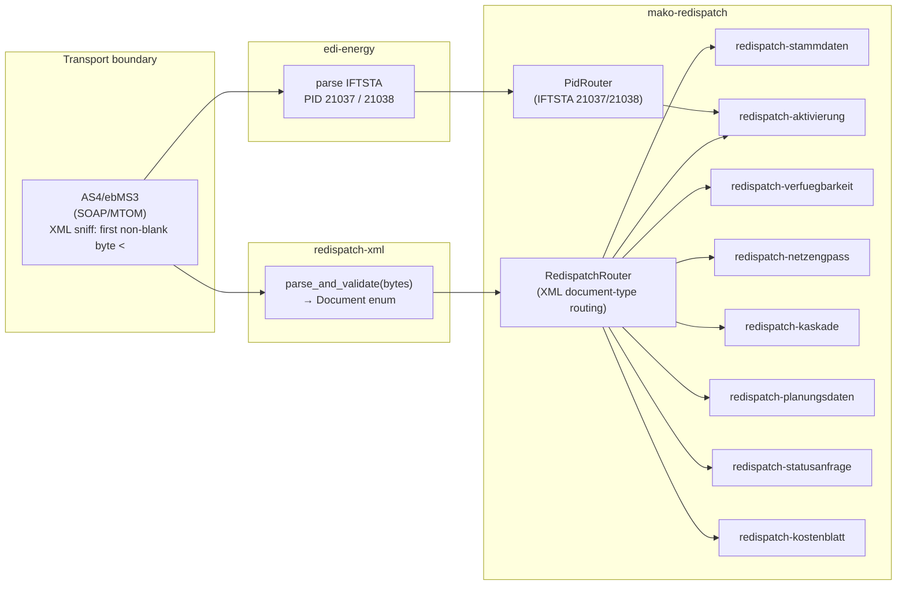

+++
title = "Redispatch 2.0"
description = "Redispatch 2.0 in mako: XML document types, 8 event-sourced workflows, the BilAReM regime under BK6-23-241, which deadlines still have a published source, IFTSTA EDIFACT integration, and RedispatchModule deployment."
weight = 16
+++
Redispatch 2.0 is the mandatory German grid-congestion management protocol
under §§ 13, 13a, 14 EnWG, effective 1 October 2021 (NABEG). It requires all
TSOs (ÜNB) and DSOs (VNB) to coordinate controllable generation units across
transmission and distribution networks using structured XML documents.

Unlike GPKE / WiM / GeLi Gas, which use EDIFACT `RFF+Z13` Prüfidentifikatoren
for routing, Redispatch 2.0 uses **CIM/IEC 62325-based XML** for primary data
exchange and **IFTSTA (EDIFACT)** only for final status confirmations.

---

## Regulatory basis

| BNetzA decision | Topic | Effective |
|---|---|---|
| BK6-20-059 | Datenformate und Übermittlungswege | 2021-10-01 — **TZ 1 repealed** with the end of 30.06.2026; TZ 2 survives until the new EDI@Energy documents apply |
| BK6-20-060 | Netzbetreiberkoordinierung (Stammdaten forwarding, Activation response) | 2021-10-01 — **repealed** by BK6-23-241 TZ 4 |
| BK6-20-061 | Informationsbereitstellung (`Kostenblatt`) | 2021-10-01 — **repealed** by BK6-23-241 TZ 3 |
| **BK6-23-241** | **BilAReM** — Bilanzieller Ausgleich von Redispatch-Maßnahmen | 2026-07-01 (ÜNB); formats follow the EDI@Energy expert group on relative deadlines |

BilAReM is the regime the other three decisions were folded into. It puts two
Bilanzierungsmodelle side by side and dates every transition
(`crates/mako-redispatch/src/bilarem.rs`):

- the **Planwertmodell** — the NB carries the Ausgleich itself, via
  korrespondierende Fahrpläne against a dedicated Redispatch-Bilanzkreis;
- the **Prognosemodell** — the BKV keeps the imbalance, §14 Abs. 1 S. 3 / Abs. 1b
  EnWG, until **31.12.2031**.

Migration between them is one-way, at quarter boundaries, with ≥6 months' notice
(soll-target 01.01.2031). Pauschal-Abrechnung grandfathering ends **31.12.2028**
(the Spitz election is due 30.11.2028), and MaBiS Anlage 1 Kap. 17 was revoked
**30.09.2026**, its survivors continuing as the Anlage zur BilAReM.

NABEG 2019 and the above BNetzA decisions implement the legal obligation.

The BilAReM domain layer spans three seams:

- `mako_redispatch::bilarem` — `Bilanzierungsmodell`, `Abrechnungsverfahren`
  admissibility, quarter-boundary + 6-month-notice `Zuordnungsmitteilung`
  validation, all key dates as constants.
- `mako_redispatch::ausfallarbeit` — the full Kap.-3 Ausfallarbeit engine per
  the final Anlage (Beschluss 07.05.2026): `P_lim` determination
  (Aufforderungs-/Duldungsfall, Referenzprofil/beidseitige Fixierung), Wind
  Spitz-/vereinfachte Spitzabrechnung (`KF = P_VZ,ist/P_VZ,theo` over the
  Kap.-3.2.2.1 Vergleichszeitraum the engine selects itself, Nennleistung cap), the Wind-Bin-Verfahren for WEA auf See (`KF_Bin = KF_LBin × KF_V`,
  0,5-m/s bins per DIN EN 61400-12-1, `m ≥ 3`, Ersatzwert chain
  Vormonat → Folgemonat → 12-Monats-Mittel → 1, `KF_V ∈ ]0;1[`), Solar
  Spitz (irradiation-scaled, `P_WR` bound) and Pauschal (Anlagenfaktor table,
  UTC+1), the grandfathered Wind-/Solar-Pauschal-Fortschreibung,
  nicht-fluktuierende Spitz-/Pauschal-Abrechnung, the Kap.-3.4 Überbauungs-cap
  (`Σ W_A ≤ P_anschl × ¼ h − Einspeisung`, pro-rata Kürzung by installed
  capacity with clamp-and-redistribute), and the § 24 Abs. 3 S. 2 EEG 2023
  MaLo→TR split.
- `grid_billing::bilarem_finanzielle_korrektur`
  (`Korr_fin = (W_A − W_Ausgl)/1000 × ID-AEP` — the financial-only residual
  settlement for fluctuating plants in the Planwertmodell).

`netzbilanzd` exposes the engine as stateless, schema-validated compute
endpoints:

| Endpoint | Computes |
|---|---|
| `POST /api/v1/redispatch/ausfallarbeit/compute` | Per-TR `W_A` series + sum, for every Abrechnungsvariante |
| `POST /api/v1/redispatch/ausfallarbeit/ueberbauung` | Kap.-3.4 cap across the TR of one Netzlokation |
| `POST /api/v1/redispatch/ausfallarbeit/kf-bin` | Kap.-3.2.3.2 `KF_Bin` for one 0,5-m/s bin — feed the result back as `kf` on a `wind_spitz` request |
| `POST /api/v1/redispatch/ausfallarbeit/malo-split` | § 24 Abs. 3 S. 2 EEG 2023 — splits one marktlokationsscharfer Wert onto the TR behind the MaLo, pro rata by installed capacity |
| `POST /api/v1/redispatch/ausfallarbeit/vergleichszeitraum` | Kap.-3.2.2.1 selection of the four Vergleichs-Viertelstunden and the `KF` they yield — feed the result back as `kf` on a `wind_spitz` request |
| `POST /api/v1/redispatch/ausfallarbeit/vergleichstag` | Kap.-3.2.4.1 selection of the Solar Vergleichstag and the `P_VZ,ist` / `G_VZ` it yields — feed both back on a `solar_spitz` request |

The Vergleichszeitraum is selected, not assumed. Kap. 3.2.2.1 admits four
**contiguous** quarter-hours that are fully measured, carry unrestricted feed-in
and each reach at least 10 % of the Nennleistung, taken from the side nearest the
Maßnahme with ties going to the side before it, and never from another month —
neither the Vormonat nor the Folgemonat
(`crates/mako-redispatch/src/ausfallarbeit.rs:430`).
Every one of those changes the Korrekturfaktor and through it every kWh.

„Nearest" has **two anchors** — „vor oder nach der Viertelstunde, in der die
Maßnahme beginnt **bzw. endet**" — so the request carries both
`massnahme_beginn` and `massnahme_ende`. Measuring both sides from the beginning
hands a four-hour Maßnahme a Vergleichszeitraum from hours before it when the
quarter-hours right after are the nearest.

`422` when no admissible run exists: the fallback to the vereinfachte
Spitzabrechnung or the Pauschale is a decision, not a computation.

**Solar does not share the wind rule.** Kap. 3.2.4.1 gives a Solaranlage a
**calendar day** as its Vergleichszeitraum — the last preceding or first
following day on which no Maßnahme was directed at the SR, ties to the day
before, never from another month — and admits only the quarter-hours of that day
that reach 10 % of the Nennleistung and carry no Nichtbeanspruchbarkeit or
marktbedingte Anpassung. A day too dark to qualify is stepped over rather than
ending the search („zurückzugehen bis zu dem letzten Tag, an dem eine
Viertelstunde mit mehr als 10 % Einspeisung stattgefunden hat"). `P_VZ,ist / G_VZ`
scales every kWh of the Spitzabrechnung, so `vergleichstag` decides it rather
than each party's spreadsheet.

An underoccupied bin is not an error on the `kf-bin` route: Kap. 3.2.3.2
prescribes a binding Ersatzwert order, and the response names which step
supplied the value (`monat` / `vormonat` / `folgemonat` /
`zwoelf_monats_mittel` / `standard`) so the operator can evidence it. A `KF_V`
outside `]0;1[` *is* rejected — that is a data error, not a value to clamp.

The caller supplies the quarter-hour input series — SCADA/edmd/DWD sourcing stays
operator-side. BDEW has not published the EDI@Energy wire formats for this
exchange: the Tenor states relative deadlines and names no calendar date
(`crates/mako-redispatch/src/bilarem.rs:29`).

---

## Market roles in scope

| Abbrev. | Role |
|---|---|
| **ÜNB** | Übertragungsnetzbetreiber — Transmission System Operator (TSO) |
| **VNB** | Verteilnetzbetreiber — Distribution System Operator (DSO) |
| **ANB** | Anlagenbetreiber — generation / storage asset operator |
| **DV** | Direktvermarkter — direct marketer |
| **BKV** | Bilanzkreisverantwortlicher — balance responsible party |

Suppliers (LF) and metering-point operators (MSB) are **not** in scope for
Redispatch 2.0. These are market-role abbreviations, not `Marktrolle` variants:
VNB, ANB and ÜNB all deploy under the **NB Strom** role, and the enum has
`Marktrolle::Nb` and `Marktrolle::Uenb` but no `Anb`
(`services/makod/src/startup/mod.rs:276`).

---

## Three-crate architecture



---

## XML document types

All nine document types are CIM/IEC 62325-based XML — **not** EDIFACT. The
`redispatch-xml` crate handles all parsing, serialization, and validation.

| Document type | XSD version | Sender → Receiver | Handled by workflow |
|---|---|---|---|
| `ActivationDocument` | 1.1f | ÜNB → VNB → ANB | `redispatch-aktivierung` |
| `PlannedResourceScheduleDocument` | 1.0f | ÜNB → VNB → ANB | `redispatch-planungsdaten` |
| `AcknowledgementDocument` | 1.0g | any → sender of referenced doc | correlation routing (ProcessRegistry) |
| `Stammdaten` (master data) | 1.4b | ANB → VNB → ÜNB | `redispatch-stammdaten` |
| `StatusRequest_MarketDocument` | 1.1 | bidirectional | `redispatch-statusanfrage` |
| `Unavailability_MarketDocument` | 1.1b | ANB → VNB | `redispatch-verfuegbarkeit` |
| `Kaskade` | 1.0 | ÜNB → VNB → ANB | `redispatch-kaskade` |
| `NetworkConstraintDocument` | 1.1b | ÜNB ↔ VNB | `redispatch-netzengpass` |
| `Kostenblatt` | 1.0d | VNB → ÜNB | `redispatch-kostenblatt` |

XSD schemas and application guidelines are published by BDEW at
[bdew-mako.de](https://www.bdew-mako.de/market_communication/documents)
(topicGroupId 25 — XML-Datenformate Redispatch 2.0).

### AcknowledgementDocument routing

`AcknowledgementDocument` is **not** registered in the document-type router.
Every ACK carries a `ReceivingDocumentIdentification` field that identifies
the workflow instance it belongs to. The `makod` dispatcher resolves that
correlation key against the `ProcessRegistry` and delivers the ACK directly to
the originating workflow without routing by type.

---

## IFTSTA EDIFACT integration

Status messages are the only EDIFACT component of Redispatch 2.0. The
`edi-energy` crate handles IFTSTA parsing; `mako-redispatch` registers all five
Redispatch Prüfidentifikatoren in the `PidRouter`
(`crates/mako-redispatch/src/lib.rs:210`):

| PID | Nachricht | Inhalt | Von → An | EBD |
|----:|-----------|--------|----------|-----|
| 13021 | MSCONS | meteorologische Daten (Ex-post) | BTR → ANB · ANB → anfNB | — |
| 13022 | MSCONS | Einzelzeitreihe Ausfallarbeit | BTR ↔ NB · anfNB → ANB | — |
| 17209 | ORDERS | Anforderung der Ausfallarbeit | anfNB → ANB | — |
| **21037** | IFTSTA | Ansicht NB | NB → BTR | `E_0902` · `E_0901` |
| **21038** | IFTSTA | Ansicht BTR | BTR → NB | `E_0900` |

`E_0902` and `E_0901` are executable in `mako-pruefung` (`role-mabis`); `E_0900`
is the **Betreiber's** tree and is deliberately not, because mako does not play
that role.

Two properties of `E_0902` that a plain accept/reject would lose:

- It is published once but applies **to both** the Ausfallarbeitszeitreihe and
  the Fahrplananteilzeitreihe, and BDEW states the two runs can reach different
  results — so it is decided per series, not once per message.
- Its two Ablehnungen state the same reason and differ in what the NB owes
  next: `A02` carries a **Gegenvorschlag** (the NB states its own figures),
  `A03` a **Korrekturanforderung** (the Betreiber must resend). Both require a
  written Erläuterung.

`E_0901` („Gegenvorschlag prüfen") then bounds the counter-proposal leg:
exactly **one** Gegenvorschlag is admissible per Ausfallarbeitszeitreihe
(`A03`), and none at all once the series has been confirmed (`A01`).

That is the complete EDIFACT half — every row in the BDEW *Anwendungsübersicht
Prüfidentifikatoren 4.0* whose Prozessbeschreibung is „Kommunikationsprozesse
Redispatch". There is **no ORDRSP in this family**: the ANB answers ORDERS 17209
with MSCONS 13022 (Prozessschritt 2). All of them route to the
`redispatch-aktivierung` workflow via conversation-ID lookup.

### Eight PIDs that look like Redispatch and are not

Their subject is the Ausfallarbeit, which is why they get filed here, but the
PID overview puts them under a different Prozessbeschreibung:

| PID | Belongs to |
|----:|------------|
| 13020 | `mako-mabis` `mabis-billing` — Ausfallarbeitsüberführungszeitreihe |
| 13023 | `mako-mabis` `mabis-billing` — Lieferantenausfallarbeitssummenzeitreihe |
| 13026 | Geschäftsprozesse für EEG-Überführungszeitreihen |
| 17210 | `mako-mabis` `mabis-anforderung` — Anforderung LF-AACL |
| 17211 | `mako-mabis` `mabis-profile` — Reklamation Profile bzw. Profilscharen (`E_0100`) |
| 19204 | `mako-mabis` `mabis-anforderung` — Ablehnung Ab-/Bestellung der Aggregationsebene |
| 19301 / 19302 | Herkunftsnachweisregister (NB ↔ RB HKN-R), `S_0092` / `S_0093` |

13020 and 13023 are MaBiS Summenzeitreihen carrying a full Prüfmitteilung/
Datenstatus cycle (IFTSTA 21000–21005); routing them to an activation
workflow would leave them no settlement stream to live in and the obligation they
carry nowhere to be recorded.

---

## Deadlines

Four Redispatch deadlines are widely quoted — a 6-hour acknowledgement, a
24-hour Statusanfrage answer, a 5-minute activation response, and a Kostenblatt
due on the 15th. **Three of them no longer have a published source, and the
fourth was never 6 hours.**

BK6-23-241 repealed the decisions they came from (Tenorziffern 1, 3 and 4), and
what replaces them is not a new table of Fristen: Tenorziffer 7 obliges the ÜNB
to *develop* bundesweit einheitliche Prozessbeschreibungen with the industry and
submit them to the Beschlusskammer, which then publishes them. Until that
happens the concrete windows are a matter of the operator's own
Prozessbeschreibung. `mako_redispatch::fristen` splits the two cases, because
citing a repealed paragraph for a hard-coded number reads as authority and stops
anyone re-checking it.

### Sourced

| Obligation | Value | Clock | Source |
|---|---|---|---|
| `AcknowledgementDocument` | **3 minutes**, unverzüglich | UTC | AcknowledgementDocument FB 1.0g |
| Vorab-Information, Prognosemodell | 30 minutes before validity | UTC | BilAReM Kap. 6.3.1 |
| Ausfallarbeit final or Dissens established | end of the **3rd** following month | German local time | BilAReM Kap. 6.4.3 |
| Wetterdaten of the Anlagenbetreiber | 4th Werktag of the following month | German local time | BilAReM Kap. 3.2.1 |
| `Stammdaten` `gueltig_ab` | ≥ 5 or ≥ 10 Werktage ahead, ≤ 2 years | German local time | Stammdaten AWT 1.4b Fn. 27/31/32/33 |
| Überführung ins Planwertmodell | ≥ 6 months' notice, only on 01.01./04./07./10. | German local time | BilAReM Kap. 2.3.2 |

> **The acknowledgement is three minutes, not six hours.** The
> AcknowledgementDocument Formatbeschreibung 1.0g, section „Fristen zur
> Übermittlung der AcknowledgementDocument-Nachricht":
>
> > „Der Empfänger der Übertragungsdatei teilt dem Absender **unverzüglich,
> > jedoch spätestens 3 Minuten** nach Erhalt der Übertragungsdatei das Ergebnis
> > seiner syntaktischen Prüfung mittels der AcknowledgementDocument-Nachricht
> > mit."
>
> Six hours and three minutes are not the same obligation with a different
> number: six hours is something a batch job satisfies, three minutes has to be
> answered by the receiving process itself.

Four protocol rules ride with it (same source), and each one is a branch an
implementation either has or silently does not:

1. **Exactly one ACK per Übertragungsdatei**, confirming or rejecting the file
   as a whole. A positive ACK is `A01`; a negative one is `A02` plus `Z12`
   (XSD did not validate) or one of `Z13`–`Z18` (valid but not processable).
2. **No ACK means not processed** — „Eine nicht empfangene
   AcknowledgementDocument-Nachricht bedeutet, dass die Ursprungsnachricht beim
   Empfänger **nicht bearbeitet** wird." A sender that reads silence as success
   loses the message.
3. **Never acknowledge an acknowledgement.**
4. **A late ACK does not breach the business Frist** — „Syntaxfehlermeldungen,
   welche außerhalb der Frist beim Absender … eingehen, dürfen nicht zu einer
   Fristverletzung des eigentlichen Geschäftsvorfalles führen." The transport
   clock and the process clock are separate.

### Operator-configured

`fristen::Betreiberfristen` holds these, with the historical BK6-20-05x figure
as a documented default. They are **not** binding — the decisions that set them
are repealed:

| Field | Obligation | Historical default | Was |
|---|---|---|---|
| `aktivierung_antwort` | Activation (ACO) response | 5 minutes | BK6-20-060 §6.3 |
| `vorabinformation_planwertmodell` | Planwertmodell Vorab-Information | none — BilAReM Kap. 6.3.1 requires the Abrufprozesse to *define* one but names no figure | BilAReM Kap. 6.3.1 |
| `kostenblatt_stichtag` | `Kostenblatt` submission | 15th of the following month | BK6-20-061 §7 |
| `stammdaten_weiterleitung_werktage` | `Stammdaten` forward (VNB→ÜNB) | 1 Werktag | BK6-20-060 §3.2 |

BilAReM Kap. 6.2.1.1 keeps the Stammdaten *obligation* — the responsible
Marktpartner sends a changed value „unverzüglich nach Bekanntwerden" — but
attaches no countable window.

### `StatusRequest_MarketDocument` is not a request/response pair

Its `type` codes are `A60` (status request for a position independently from a
specific process) and `Z15` Erreichbarkeitsinformation, and its `status` carries
`A03` Deactivated / `A04` Reactivated / `A13` Withdrawn — a
communication-availability notification about a Marktpartner
(StatusRequest_MarketDocument FB 1.1). There is no answer document and no
24-hour window; the acknowledgement is the only thing owed back.

### Real-time scheduling

Whatever ACR/AAR window the operator configures, it stays a real-time
constraint, and the 3-minute ACK is stricter still. That is a scheduling
requirement, not just a constant: a Werktage-granularity poll cannot fire a
3-minute window.

`makod` builds **one** `DeadlineScheduler` for every workflow family
(`services/makod/src/startup/mod.rs:859`), so its poll interval has to be set
for the tightest window in the deployment. It defaults to 30 seconds
(`--deadline-poll-interval-secs`, `services/makod/src/main.rs:884`); a Redispatch
deployment must not raise it towards the GPKE/WiM scale.

---

## Aufforderungsfall vs Duldungsfall

The central Redispatch 2.0 case split (BilAReM Kap. 1) is a behavioural branch
in the Aktivierung workflow, not just master data. In the **Aufforderungsfall**
the anweisende Netzbetreiber asks the EIV to change the Wirkleistung and the EIV
steers; in the **Duldungsfall** the anweisende Netzbetreiber steers the SR
itself. Kap. 3.1 hangs the Ausfallarbeit directly off the distinction:
`P_lim = min{P_ist; P_min}` / `max{P_ist; P_max}` in the Aufforderungsfall and
`P_lim = P_ist` in the Duldungsfall.

| | Aufforderungsfall | Duldungsfall |
|---|---|---|
| Who steers | EIV/BTR per transmitted schedule (`AbrufartAufforderungsfall`: Z01 Delta / Z02 Sollwert) | The NB directly via the technical Steuerkanal (marktd `nelo.steuerkanal`) |
| ACR/AAR response window | **Enforced** — the process expires when no ACR/AAR arrives | **Not applicable** — no counterparty response is awaited; a mistakenly scheduled window is ignored |
| §13a settlement basis | Transmitted schedule | Measured vs. reference Lastgang |

`AktivierungCommand::ReceiveAco` carries the case (`Abwicklung`). The XML
transport does not yet resolve it from the resource's Stammdaten: it defaults to
Aufforderungsfall/Sollwert, the strict case
(`services/makod/src/transport/redispatch_xml_ingest.rs:110`). Resolving a
Duldungsfall relaxes the process, never the reverse, so the default is safe.

## §13a EnWG compensation

`grid_billing::redispatch_verguetung` computes the angemessene Vergütung
(§13a Abs. 2 EnWG): entgangene Einnahmen (for EEG/KWKG plants via
`eeg_entgangene_einnahmen` from the anzulegender Wert — Nr. 5; for others the
proven lost revenue — Nr. 3) plus zusätzliche Aufwendungen (Nr. 1/2/4) minus
ersparte Aufwendungen (Satz 4 — reimbursed to the NB; the net may be
negative). netzbilanzd exposes it as
`POST /api/v1/redispatch/verguetung/{activation_id}/compute`. Calculation
endpoint only — the payment run is the operator's ERP.

**The case selects the counterfactual, and the request must say which.**
`abwicklung` is required, and it picks the `AusfallarbeitBasis`:

| `abwicklung` | Ausfallarbeit from | Why |
|---|---|---|
| `DULDUNGSFALL` | the edmd 15-min Lastgang window (`P_lim = P_ist`, BilAReM Kap. 3.1) | the NB steered the resource, so what the plant would have produced was never transmitted |
| `AUFFORDERUNGSFALL` | `ausfallarbeit_kwh_override`, taken from the transmitted schedule — **required**, `422` without it | the EIV steered to that schedule, and the schedule *is* the counterfactual |

Resolving both from the Lastgang would settle an Aufforderungsfall against what
happened rather than against what was instructed — a money error in whichever
direction the plant deviated, and one nothing downstream detects. The chosen
basis travels into the result and its calculation trace, so an audit can see
which counterfactual a figure rests on.

## Workflow overview

The `mako-redispatch` crate provides 8 fully implemented workflows, all backed
by the same `mako-engine` `Workflow` + `Process` infrastructure.

| Workflow | Document type | Direction | Key deadline |
|---|---|---|---|
| `redispatch-stammdaten` | `Stammdaten` | ANB → VNB → ÜNB | 3-min ACK; forwarding window operator-configured |
| `redispatch-aktivierung` | `ActivationDocument` + IFTSTA | ÜNB → VNB → ANB | 3-min ACK; ACR/AAR window operator-configured |
| `redispatch-verfuegbarkeit` | `UnavailabilityMarketDocument` | ANB → VNB | 3-min ACK |
| `redispatch-netzengpass` | `NetworkConstraintDocument` | ÜNB ↔ VNB | 3-min ACK |
| `redispatch-kaskade` | `Kaskade` (§ 13 Abs. 2 EnWG) | ÜNB → VNB → ANB | 3-min ACK |
| `redispatch-planungsdaten` | `PlannedResourceScheduleDocument` | ÜNB → VNB → ANB | 3-min ACK |
| `redispatch-statusanfrage` | `StatusRequest_MarketDocument` | notification | 3-min ACK — no answer document |
| `redispatch-kostenblatt` | `Kostenblatt` | VNB → ÜNB | 3-min ACK; submission day operator-configured |

Each workflow uses a dedicated event-type newtype (e.g., `VerfuegbarkeitEvent`,
`NetzengpassEvent`) to prevent cross-workflow event-type collisions in the
shared `EventStore`.

---

## RedispatchModule

`RedispatchModule` implements `mako_engine::builder::EngineModule` and is the
single registration point for all Redispatch 2.0 handling in `makod`.

Registration is a Cargo feature, not a runtime role test — `makod` pushes the
module into its production stack behind `role-nb-strom`, which the default
feature set contains (`services/makod/src/startup/mod.rs:279`):

```rust,ignore
#[cfg(feature = "role-nb-strom")]
modules.push(Box::new(mako_redispatch::RedispatchModule));
```

`EngineBuilder::register` consumes and returns the builder, so it chains rather
than being called as a statement.

The module then contributes two routing tables:

1. `build_router()` — all 8 workflows into a `RedispatchRouter` (XML
   document-type routing);
2. `register_pids()` — the five Prüfidentifikatoren above into the `PidRouter`
   (EDIFACT routing).

`configure()` does not wire anything: it *verifies* that every workflow the
router names is reachable, and returns `Err` if one is not
(`crates/mako-redispatch/src/lib.rs:259`).

---

## Quick start — parsing a Redispatch XML document

```rust
use redispatch_xml::{parse_and_validate, Document};

// Recommended: parse + validate in one step
let doc = parse_and_validate(&xml_bytes)?;

// Access common fields on any document type
println!("mRID: {}", doc.mrid());
println!("Sender: {}", doc.sender_id());
println!("Receiver: {}", doc.receiver_id());

// Pattern match on the variant to access type-specific fields
match &doc {
    Document::Activation(a) => {
        println!("Activation period: {}", a.activation_time_interval);
    }
    Document::Stammdaten(s) => {
        println!("Asset count: {}", s.sr_objekte.len());
    }
    _ => {}
}
```

### Validation details

```rust
use redispatch_xml::{parse, validate};

let doc = parse(&xml_bytes)?;
let result = validate(&doc);

if result.is_valid() {
    // Zero errors — proceed with processing
} else {
    // All errors, not just the first:
    let all_errors = result.into_errors().unwrap_err();
    for e in &all_errors {
        eprintln!("Validation error: {}", e);
    }
}
```

---

## Integration with `makod`

Both transport legs are wired end-to-end:

1. **EDIFACT leg.** The five Redispatch PIDs — IFTSTA 21037/21038
   Vollzugsmeldungen, MSCONS 13021/13022 and ORDERS 17209 — resolve via the
   `PidRouter` to `redispatch-aktivierung` and are executed on the activation
   process by the ingest dispatcher, spawned when none exists yet so no
   Redispatch market message is silently dropped. The look-alike PIDs above
   route to their own MaBiS workflows instead. Correlation key: the MaLo where
   the message carries one, else the BGM document reference, else
   `{sender}-{pid}`.
2. **XML leg.** The AS4 ingest sniffs XML payloads (first non-whitespace
   byte `<` — EDIFACT interchanges start with `UNA`/`UNB`) and hands them to
   `redispatch_xml_ingest::dispatch_redispatch_xml`: `redispatch-xml`
   parses, namespace-checks and validates the document, the canonical
   `document_kind` mapping (exhaustive — enum drift fails compilation)
   picks the workflow, and the dispatcher spawns/resumes the process with
   the regulatory deadlines registered **atomically with the first events**:
   - `ActivationDocument` → `ReceiveAco` with a 5-minute ACR/AAR response
     window and an ACK window. The Abwicklung defaults to
     Aufforderungsfall/Sollwert — the strict case.
   - `Stammdaten` → an ACK window plus a 24-hour forward window (the 1-Werktag
     obligation, floored to next-day until the Werktage calendar is wired into
     the scheduler).
   - The six ack-forward document types → one ACK window each.

   **The ACK windows the XML ingest arms are 6 hours (24 for
   `StatusRequest`), not the 3 minutes `fristen::ACK_FRIST` states**
   (`services/makod/src/transport/redispatch_xml_ingest.rs:132`). The crate
   constant is the FB 1.0g figure; the ingest still carries the pre-1.0g
   fallbacks, so an ACK that is late by the Fachliche Beschreibung is not yet
   detected as late here.
   - `AcknowledgementDocument` is delivered by **correlation**
     (`ReceivingDocumentIdentification` → the process registered under the
     acknowledged document's MRID), never type-routed.

   A parse/validation failure or unroutable document is rejected without an
   AS4 receipt (the receipt would assert successful reception), so the
   sender corrects and retransmits. Deadlines fire through
   `deadline_dispatch` (all 8 workflows covered). The
   `redispatch_xml_pipeline` integration test in makod proves parse → kind
   → route for all nine document types.

### Startup coverage check

`deadline_dispatch::assert_dispatch_coverage` panics at startup when a
registered Redispatch workflow lacks a deadline-dispatch entry — a deadline
that can be scheduled but never fired would otherwise fail silently.
`RedispatchModule` itself is registered for NB/ÜNB deployments (default
feature set or `role-nb-strom`).

---

## Key invariants

- `Workflow::handle` and `Workflow::apply` are **pure functions**: no I/O, no
  clock access, no global state mutation.
- Events and `AcknowledgementDocument` outbox entries are always written in a
  **single `WriteBatch`** via `AtomicAppend::append_with_outbox`. Separate
  writes are not permitted — a crash between them produces a lost ACK with no
  recovery path (regulatory violation).
- The ACK and Activation windows use **UTC nanosecond precision**; do not
  convert to local time before comparing. Only the BilAReM Werktag obligations
  (Wetterdaten, Stammdaten-Gültigkeit, Planwert-Überführung) run on German local
  time.
- **A late `AcknowledgementDocument` never fails the Geschäftsvorfall it
  carried** (AcknowledgementDocument FB 1.0g). The transport clock and the
  process clock are separate, and conflating them turns a slow counterparty
  into a regulatory breach that did not happen.

---

## See also

- [`redispatch-xml` crate](https://crates.io/crates/redispatch-xml) — XML format layer
- [Process Engine Guide](@/docs/architecture/engine.md) — `Workflow`, `Process`, `EventStore`
- [PID Reference — Redispatch section](@/docs/regulatory/pid-reference.md#redispatch-2-0-xml-document-types-not-edifact-pids)
- [BNetzA Regulatory Reference](@/docs/regulatory/bnetza.md) — BK6-23-241 (BilAReM) and the BK6-20-05x decisions it replaced
