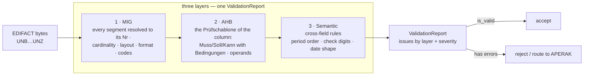

+++
title = "Validation"
description = "EDIFACT validation against the MIG and the AHB column: the checks, the ValidationReport, rule ids, Prüfidentifikatoren and release dates."
weight = 11
[extra]
mermaid = true
+++
# Validation Guide

Every EDI@Energy message can be validated against the officially registered BDEW profiles. This guide explains the validation model, how to read the report, and common patterns.

---

## The Validation Layers

A message runs through three layers, each appending its issues to one
`ValidationReport`; a later layer runs even when an earlier one found
something, so a single pass reports every problem at once rather than
stopping at the first.



| Layer | Checks |
|---|---|
| **1 — MIG** | Every segment is resolved to its place in the Nachrichtenstruktur (the MIG's running number `Nr`; `SG5 LOC+Z16` and `SG5 LOC+Z17` are two places). Mandatory places and groups, repetition limits, the Segmentlayout of each place — mandatory data elements, elements not used, representations (`n11`, `an..35`), code lists. A stray segment is reported and skipped, not allowed to unresolve the rest. |
| **2 — AHB** | The Prüfschablone of the selected Anwendungsfall: every segment and group the column marks `Muss`/`Soll`/`Kann`, with its Bedingungen evaluated against the message; every data element's operands (`X`, `M [7]`, the codes admitted); a place or element the column does not list is not to be used. |
| **3 — Semantic** | Cross-field rules the documents state in prose: period order (`DTM+163` ≤ `DTM+164`), Lokations-ID check digits, that a value declaring format `303` carries `CCYYMMDDHHMMZZZ`. |

MIG `M` always binds; MIG `R` (BDEW-erforderlich) is the union over all
Anwendungsfälle and yields to the selected column.

### Before the layers — the envelope

Two checks run at **parse** time and return `Err` rather than a report entry,
because a message that fails them has no coherent identity to validate:

| Check | Rule |
|---|---|
| Interchange control reference | `UNZ` DE 0062 must equal `UNB` DE 0020 (EDIFACT syntax) |
| Declared counts | `UNT` DE 0074 = segments in the message (`UNH` and `UNT` included); `UNZ` DE 0036 = messages in the interchange — ISO 9735-1 Annex C.3.4 |
| **Interchange party identity** | The `NAD+MS` / `NAD+MR` MP-IDs must equal `UNB` DE 0004 / DE 0010 — **Allgemeine Festlegungen V6.1d §2.13** |

A wrong count is refused here, before any rule runs — the same answer a
receiver gives it, a CONTRL rejection.

> "Die im UNB- und NAD-Segment für den Absender / Empfänger verwendeten MP-ID
> sind identisch." — §2.13

The party check is an authorisation boundary rather than a formatting rule. AS4
authenticates the **envelope** sender, while consuming services read `NAD+MS`
for consent gates, partner lookup and role resolution; tolerating a mismatch
would let an authenticated partner attribute a message to a different market
participant. A party absent from either side is not a mismatch — whether the
omission is legal is an AHB (layer 4) question.

### Date formats — DE 2379

Each `DTM` place's layout fixes DE 2005 (the qualifier) **and** DE 2379 (the
format) together:

```
2005  Datums- oder Uhrzeit-Funktion, Qualifier   M an..3   137 Dokumenten-/Nachrichtendatum
2379  Datums- oder Uhrzeit-Format, Code          R an..3   303 CCYYMMDDHHMMZZZ
```

so `DTM+137` is `303` in every EDI@Energy MIG, written on the wire as
`DTM+137:202610011200?+00:303'` — the `?` is the release character escaping the
zone's `+`. The admissible formats are the place's own code list in `mig.json`;
a qualifier with several places (`DTM+157` is `610` on a Clearingliste and
`303` as „Änderung zum") has several places, each with its list.

`MIG-{Nr}-DTM-2379-CODE` checks the code; `SEM-DTM-VALUE` checks that a value
declaring `303` really carries `CCYYMMDDHHMMZZZ`.

---

## Basic Validation

```rust
use edi_energy::{parse, EdiEnergyMessage};

let msg = parse(bytes)?;
let report = msg.validate()?;

if report.is_valid() {
    println!("OK");
} else {
    for issue in report.iter_issues() {
        println!("[{:?}] {}", issue.severity, issue.message);
    }
}
```

`validate()` uses the release detected from `UNH` and the Pruefidentifikator from `BGM` to select the correct profile automatically.

---

## Validating Against a Specific Pruefidentifikator

Use `validate_and_check_pid` when you want to assert the message is of a specific process type:

```rust
use edi_energy::{parse, validate_and_check_pid, Pruefidentifikator};

let msg = parse(bytes)?;
let pid = Pruefidentifikator::new(55001)?; // Lieferbeginn Strom
let report = validate_and_check_pid(&msg, pid)?;
report.into_error_result()?;
```

A PID mismatch does **not** return an `Err` — it returns `Ok(report)` where
`report.is_valid()` is `false` and `report.errors()` contains an issue with
rule ID `"EE-PID-001"`.  Check for this explicitly when you need to distinguish
a PID mismatch from other conformance failures:

```rust
let report = validate_and_check_pid(&msg, pid)?;
if !report.is_valid() {
    for issue in report.errors() {
        if issue.rule_id().as_deref() == Some("EE-PID-001") {
            eprintln!("PID mismatch: {}", issue.message);
        }
    }
}
```

---

## The Validation Report

`EdiEnergyReport` is the return value of all validate methods.

### Status checks

```rust
report.is_valid()       // true if no errors or critical issues
report.has_errors()     // true if any Error or Critical issues
report.has_warnings()   // true if any Warning issues
report.total_issues()   // total issue count across all severities
```

### Accessing issues

```rust
// All issues in order: errors → warnings → infos
for issue in report.iter_issues() { /* ... */ }

// Filtered by severity
for e in report.errors()    { /* ... */ }  // &[ValidationIssue]
for c in report.criticals() { /* ... */ }  // Iterator
for w in report.warnings()  { /* ... */ }  // &[ValidationIssue]
for i in report.infos()     { /* ... */ }  // &[ValidationIssue]

// Filtered by validation layer origin
// Values: "parse", "directory", "mig", "ahb", "custom"
for issue in report.issues_by_origin("ahb") { /* ... */ }

// Filtered by rule ID prefix (zero-allocation iterator)
for issue in report.issues_with_rule_prefix("AHB-55001-STS") { /* ... */ }

// Filtered by rule ID prefix (returns a new report for further chaining)
let ahb_report = report.filter_by_rule_prefix("AHB-55001");
```

### Converting to `Result`

```rust
// Ok(()) when no errors; Err(report) when errors are present (keeps the report)
let _ = report.into_result();   // returns Result<(), EdiEnergyReport>

// Ok(report) when valid; Err(Error::Validation { .. }) otherwise
report.as_result()?;

// Ok(()) when no errors; Err(Error::Validation { .. }) otherwise
report.into_error_result()?;
```

---

## `ValidationIssue` Fields

Each issue carries:

| Field | Type | Description |
|---|---|---|
| `severity` | `ValidationSeverity` | Critical / Error / Warning / Info |
| `message` | `&str` | Human-readable description |
| `rule_id` | `Option<&str>` | Stable rule identifier, e.g. `"AHB-55001-DTM-M0"` |
| `error_code` | `Option<&'static str>` | Machine-readable error code |
| `segment_tag` | `Option<String>` | EDIFACT segment tag, e.g. `"DTM"` |
| `segment_occurrence` | `Option<u16>` | 0-based occurrence index |
| `element_index` | `Option<u8>` | 0-based data-element index |
| `component_index` | `Option<u8>` | 0-based component index within a composite |
| `suggestion` | `Option<String>` | Suggested fix or explanation |

---

## Severity Levels

| Level | Meaning | `is_valid()` impact |
|---|---|---|
| `Critical` | Unrecoverable structural damage | ❌ Invalid |
| `Error` | Rule violation — message must not be processed | ❌ Invalid |
| `Warning` | Deviation — message should be reviewed | ✅ Valid (but flagged) |
| `Info` | Informational observation | ✅ Valid |

---

## Serializing Reports (`serde` feature)

Enable the `serde` feature to serialize reports as JSON:

```bash
cargo add edi-energy --features serde
```

```rust
use edi_energy::{parse, EdiEnergyMessage};

let msg    = parse(bytes)?;
let report = msg.validate()?;
let json   = serde_json::to_string_pretty(&report)?;
println!("{json}");
```

Output shape:

```json
{
  "valid": true,
  "issueCount": 0,
  "issues": []
}
```

---

## Rich Error Output (`diagnostics` feature)

Enable the `diagnostics` feature for `miette` integration:

```bash
cargo add edi-energy --features diagnostics
```

Reports then implement `miette::Diagnostic`, giving annotated terminal output with source spans when used with the `miette` error handler.

---

## Rule ID Naming Convention

Rule identifiers name the **place** in the MIG's Nachrichtenstruktur a finding
is about — the running segment number `Nr` every BDEW MIG prints — so a fired
rule can be looked up in the profile and in the published document.

### MIG rules (Nachrichtenbeschreibung)

| Rule id | Meaning |
|---|---|
| `MIG-STRUCTURE` | a segment fits no place of the structure from here on — out of order, in a wrong group, or with a qualifier no place admits; it is skipped and the rest of the message is still resolved |
| `MIG-{Nr}-{TAG}-REQUIRED` | a mandatory segment (`M`, or `R` the selected column lists) is missing |
| `MIG-{SGn}-{Nr}-REQUIRED` | a mandatory segment group (named by its trigger's `Nr`) is missing |
| `MIG-{Nr}-{TAG}-MAX`, `MIG-{SGn}-{Nr}-MAX` | more repetitions than the MIG allows |
| `MIG-{Nr}-{TAG}-{DE}-REQUIRED` | a mandatory data element is empty |
| `MIG-{Nr}-{TAG}-{DE}-NOTUSED` | a data element the MIG marks `N` carries a value |
| `MIG-{Nr}-{TAG}-{DE}-FORMAT` | the value does not fit the representation (`n11`, `an..35`) |
| `MIG-{Nr}-{TAG}-{DE}-CODE` | the value is not in the MIG's code list |
| `MIG-{Nr}-{TAG}-{DE}-EXTRA`, `MIG-{Nr}-{TAG}-EXTRA` | more components or elements than the MIG defines |

### AHB rules (Prüfschablone)

| Rule id | Meaning |
|---|---|
| `AHB-{PID}-{Nr}-{TAG}-MISSING` | the column marks the segment `Muss` (and its Voraussetzung holds) but it is absent |
| `AHB-{PID}-{Nr}-{TAG}-NOT-PERMITTED` | the segment is present but the column does not list it, or its Voraussetzung does not hold |
| `AHB-{PID}-{SGn}-{Nr}-MISSING`, `…-NOT-PERMITTED` | the same for a segment group |
| `AHB-{PID}-{Nr}-{TAG}-{DE}-MISSING` | a data element the column marks `X`/`M` is empty |
| `AHB-{PID}-{Nr}-{TAG}-{DE}-CODE` | the value is not one of the codes the column admits |
| `AHB-{PID}-{Nr}-{TAG}-{DE}-NOT-PERMITTED` | a data element the column does not list carries a value |
| `AHB-UNKNOWN-PID` | the Prüfidentifikator is not a column of this profile — AHB rules were not applied (warning) |
| `AHB-SKIP-NO-PID` | no column could be selected (warning) |

`{PID}` is the Prüfidentifikator; a message type published without them
(CONTRL, APERAK) names its column `col1`, `col2`, …

Examples:
```
AHB-55001-00036-STS-MISSING        # 55001: SG4 STS Transaktionsgrund is Muss but absent
AHB-55001-SG6-00057-MISSING        # 55001: SG6 RFF+Z13 is Muss but absent
AHB-13002-00028-QTY-6411-NOT-PERMITTED   # 13002 lists no unit on QTY+220
MIG-00050-LOC-3225-FORMAT          # LOC+Z16 DE 3225 is not an n11
```

**Locating the rule in the profile**: `crates/edi-energy/profiles/{type}/fv{YYYYMMDD}/`
— `mig.json` → `structure` → the node with that `nr` (its layout lists the data
elements); `ahb.json` → `anwendungsfaelle` → the column with that `pid` → `rows`
(segment statuses) and `elements` (operands per `nr` and data element).
`cargo run -p edi-energy --all-features --example 07_resolve -- <file>` prints
the same for a message: every segment's `Nr` and every finding.

### Semantic and engine rules

| Prefix | Layer | Example |
|---|---|---|
| `SEM-` | Cross-segment semantic check | `SEM-MSCONS-PERIOD-ORDER` |
| `EE-` | Engine-level check (e.g. PID check) | `EE-PID-001` |

### Filtering by rule prefix

```rust
// All AHB rules for PID 55001 (zero-allocation iterator)
for issue in report.issues_with_rule_prefix("AHB-55001") { /* ... */ }

// All AHB rules inside SG4 for PID 55001
for issue in report.issues_with_rule_prefix("AHB-55001-SG4") { /* ... */ }

// All MIG rules for DTM
for issue in report.issues_with_rule_prefix("MIG-DTM") { /* ... */ }

// All AHB rules regardless of PID
for issue in report.issues_with_rule_prefix("AHB-") { /* ... */ }

// By validation layer: "parse", "directory", "mig", "ahb", "custom"
for issue in report.issues_by_origin("mig") { /* ... */ }
```

---

## Validate Against a Specific Release Date

To reproduce past validation behaviour or run tests against historical data:

```rust
use edi_energy::{Parser, ParseConfig, EdiEnergyMessage};
use time::macros::date;

let config = ParseConfig::default()
    .with_reference_date(date!(2024-10-01));

let msg = Parser::with_config(config).parse(bytes)?;
let report = msg.validate()?;
// profile selection uses Oct 1 2024 as "today"
```

---

## The Prüfschablone

An AHB column states, for every segment and group, one of

| Status | Meaning |
|---|---|
| `Muss` | required — its absence is `AHB-…-MISSING` |
| `Soll` | required for the sender, not checkable by the receiver |
| `Kann` | optional |
| *(blank)* | not part of the column — its presence is `AHB-…-NOT-PERMITTED` |

and, per data element, an operand on the element or on each of its codes:
`X` (used), `M` (required), `S` (required for the sender), `K` (optional). Any
of them may carry Bedingungen — `Muss [10]`, `X [UB1] ∧ [496]`,
`Soll ([92] ⊻ [93]) ∧ [126]` — whose texts the profile carries as printed:

| Range | Kind | Evaluated? |
|---|---|---|
| `[1]`–`[499]` | Voraussetzung — „Wenn SG10 QTY DE6063 mit Wert 67 vorhanden", „Wenn SG5 LOC+Z17 nicht vorhanden", „mehr als einmal vorhanden", „… DE7140 bei der die letzten beiden Stellen mit dem Wert "01" …" (a suffix), `PIA+5+1-b?:1.9.e` (a lowercase letter stands for any one character) | against the message; the status binds when the expression holds |
| `[500]`–`[899]` | Hinweis | neutral |
| `[901]`–`[999]` | Formatbedingung | neutral (formats are the MIG's) |
| `[2000]`–`[2499]`, `[UB1]`–`[UB3]` | Wiederholbarkeit, Zeitpunkt | neutral |
| `[nP..]` | Paket | undecidable; the status is not enforced |

A Voraussetzung the evaluator cannot read is undecidable and never a ground
for rejection. `profile.pruefschablone(pid)` prints the whole column.

---

## See Also

- [Parsing Guide](@/docs/reference/parsing.md)
- [Builder Guide](@/docs/reference/builders.md)
- [Release Lifecycle](@/docs/compliance/release-lifecycle.md)
