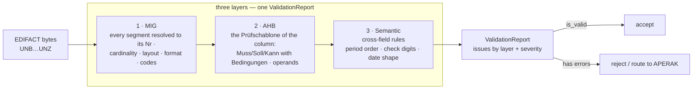

+++
title = "Validation"
description = "EDIFACT validation against the MIG and the AHB column: the checks, the ValidationReport, rule ids, Prüfidentifikatoren and release dates."
weight = 11
+++
Every EDI@Energy message can be validated against the officially registered
BDEW profiles. This guide explains the validation model, how to read the report,
and common patterns.

Two BDEW documents define what "valid" means, and mako ships both as generated
profiles ([vocabulary](@/docs/reference/_index.md#vocabulary)):

- the **MIG** (Nachrichtenimplementierungshandbuch) — the message structure:
  which segments exist, in which order and group, and what each data element may
  carry. One per message type.
- the **AHB** (Anwendungshandbuch) — one column per **Prüfidentifikator**, the
  five-digit number that names the business case. The column narrows the MIG to
  what *that* case must, may and must not send. It rides `SG1 RFF+Z13` in every
  message type but APERAK and CONTRL, which carry it in `BGM` DE 1004; the
  profile records which in its `pid_source`
  (`crates/edi-energy/src/pid_scan.rs:48`).

---

## The Validation Layers

A message runs through three layers, each appending its issues to one
`ValidationReport`; a later layer runs even when an earlier one found
something, so a single pass reports every problem at once rather than
stopping at the first.



| Layer | Checks | Rule id prefix |
|---|---|---|
| **1 — MIG** | Structure, cardinality, Segmentlayout, code lists | `MIG-` |
| **2 — AHB** | The Prüfschablone of the selected column | `AHB-` |
| **3 — Semantic** | Cross-field rules the documents state in prose | `SEM-` |

**Layer 1** resolves every segment to its *place* in the Nachrichtenstruktur —
the MIG's running number `Nr`, of which `SG5 LOC+Z16` and `SG5 LOC+Z17` are two
distinct ones. It then checks mandatory places and groups, repetition limits and
each place's Segmentlayout: mandatory data elements, elements marked not-used,
representations (`n11`, `an..35`) and code lists. A segment that fits no place is
reported and skipped, not allowed to unresolve the rest of the message.

**Layer 2** applies the Prüfschablone of the selected Anwendungsfall: the
`Muss`/`Soll`/`Kann` the column gives each segment and group, with its
Bedingungen evaluated against the message, and each data element's operands
(`X`, `M [7]`, the codes admitted). A place or element the column does not list
is not to be used.

**Layer 3** covers what the documents state in prose only: period order
(`DTM+163` ≤ `DTM+164`), Lokations-ID check digits, and that a value declaring
format `303` really carries `CCYYMMDDHHMMZZZ`.

MIG `M` always binds; MIG `R` (BDEW-erforderlich) is the union over all
Anwendungsfälle and yields to the selected column
(`crates/edi-energy/src/profile/validate.rs:238`).

### Before the layers — the envelope

Three checks run at **parse** time and return `Err` rather than a report entry,
because a message that fails them has no coherent identity to validate:

| Check | Rule |
|---|---|
| Interchange control reference | `UNZ` DE 0020 must equal `UNB` DE 0020 (EDIFACT syntax) |
| Declared counts | `UNT` DE 0074 = segments in the message (`UNH` and `UNT` included); `UNZ` DE 0036 = messages in the interchange — ISO 9735-1 Annex C.3.4 |
| **Interchange party identity** | The `NAD+MS` / `NAD+MR` MP-IDs must equal `UNB` DE 0004 / DE 0010 — **Allgemeine Festlegungen V6.1d §2.13** |

A wrong count is refused here, before any rule runs — the same answer a
receiver gives it, a CONTRL rejection.

> "Die im UNB- und NAD-Segment für den Absender / Empfänger verwendeten MP-ID
> sind identisch." — §2.13

The party check is an authorisation boundary rather than a formatting rule. AS4
authenticates the **envelope** sender, while consuming services read `NAD+MS`
for consent gates, partner lookup and role resolution; tolerating a mismatch
would let an authenticated partner attribute a message to a different market
participant. A party absent from either side is not a mismatch — whether the
omission is legal is a question for the AHB column, not for the envelope.

### Date formats — DE 2379

Each `DTM` place's layout fixes DE 2005 (the qualifier) **and** DE 2379 (the
format) together:

```
2005  Datums- oder Uhrzeit- oder Zeitspannen-Funktion, Qualifier  M an..3  137 Dokumenten-/Nachrichtendatum/-zeit
2380  Datum oder Uhrzeit oder Zeitspanne, Wert                     R an..35
2379  Datums- oder Uhrzeit- oder Zeitspannen-Format, Code          R an..3  303 CCYYMMDDHHMMZZZ
```

so `DTM+137` is `303` at all 32 of its places across the shipped MIGs — there is
no `102` anywhere — written on the wire as
`DTM+137:202610011200?+00:303'` — the `?` is the release character escaping the
zone's `+`. The admissible formats are the place's own code list in `mig.json`;
a qualifier with several places (`DTM+157` is `610` on a Clearingliste and
`303` as „Änderung zum") has several places, each with its list.

`MIG-{Nr}-DTM-2379-CODE` checks the code; `SEM-DTM-VALUE` checks that a value
declaring `303` really carries `CCYYMMDDHHMMZZZ`.

---

## Basic Validation

```rust
use edi_energy::{parse, EdiEnergyMessage};

let msg = parse(bytes)?;
let report = msg.validate()?;

if report.is_valid() {
    println!("OK");
} else {
    for issue in report.iter_issues() {
        println!("[{:?}] {}", issue.severity, issue.message);
    }
}
```

`validate()` selects the profile automatically: the release from `UNH`, and the
Prüfidentifikator from wherever the profile's `pid_source` says it lives —
`SG1 RFF+Z13`, or `BGM` DE 1004 for APERAK and CONTRL.

---

## Validating Against a Specific Pruefidentifikator

Use `validate_and_check_pid` when you want to assert the message is of a specific process type:

```rust
use edi_energy::{parse, validate_and_check_pid, Pruefidentifikator};

let msg = parse(bytes)?;
let pid = Pruefidentifikator::new(55001)?; // Lieferbeginn Strom
let report = validate_and_check_pid(&msg, pid)?;
report.into_error_result()?;
```

A PID mismatch does **not** return an `Err` — it returns `Ok(report)` where
`report.is_valid()` is `false` and `report.errors()` contains an issue with
rule ID `"EE-PID-001"`.  Check for this explicitly when you need to distinguish
a PID mismatch from other conformance failures:

```rust
let report = validate_and_check_pid(&msg, pid)?;
if !report.is_valid() {
    for issue in report.errors() {
        if issue.rule_id().as_deref() == Some("EE-PID-001") {
            eprintln!("PID mismatch: {}", issue.message);
        }
    }
}
```

---

## The Validation Report

`EdiEnergyReport` is the return value of all validate methods.

### Status checks

```rust
report.is_valid()       // true if no errors or critical issues
report.has_errors()     // true if any Error or Critical issues
report.has_warnings()   // true if any Warning issues
report.total_issues()   // total issue count across all severities
```

### Accessing issues

```rust
// All issues in order: errors → warnings → infos
for issue in report.iter_issues() { /* ... */ }

// Filtered by severity
for e in report.errors()   { /* ... */ }  // &[ValidationIssue]
for w in report.warnings() { /* ... */ }  // &[ValidationIssue]
for i in report.infos()    { /* ... */ }  // &[ValidationIssue]

// `Critical` issues live in the same bucket as `Error` ones, so `errors()`
// already contains them. `criticals()` filters that bucket down to the
// abort-level failures — an iterator, not a slice.
for c in report.criticals() { /* ... */ }  // impl Iterator<Item = &ValidationIssue>

// Filtered by rule ID prefix — a new report, so the result chains and renders
// like any other
let ahb_report = report.filter_by_rule_prefix("AHB-55001-STS");

// Filtered by an exact rule identifier
let one_rule = report.filter_by_rule_id("MIG-UTILMD-DTM-137");

// …or iterate that rule's issues without building a report
for issue in report.issues_for_rule_id("MIG-UTILMD-DTM-137") { /* ... */ }
```

The rule identifier carries the layer, so a prefix is also how you select one:
`"AHB-"`, `"MIG-"`, `"SEM-"`.

### Converting to `Result`

```rust
// Ok(()) when no errors; Err(report) when errors are present (keeps the report)
let _ = report.into_result();   // returns Result<(), EdiEnergyReport>

// Ok(report) when valid; Err(report) otherwise — the report is kept in both arms
let report = report.result()?;

// Ok(()) when no errors; Err(Error::Validation { .. }) otherwise
report.into_error_result()?;
```

---

## `ValidationIssue` Fields

Each issue carries:

| Field | Type | Description |
|---|---|---|
| `severity` | `ValidationSeverity` | Critical / Error / Warning / Info |
| `message` | `&str` | Human-readable description |
| `rule_id` | `Option<&str>` | Stable rule identifier, e.g. `"AHB-55001-DTM-M0"` |
| `error_code` | `Option<&'static str>` | Machine-readable error code |
| `segment_tag` | `Option<String>` | EDIFACT segment tag, e.g. `"DTM"` |
| `segment_occurrence` | `Option<u16>` | 0-based occurrence index |
| `element_index` | `Option<u8>` | 0-based data-element index |
| `component_index` | `Option<u8>` | 0-based component index within a composite |
| `suggestion` | `Option<String>` | Suggested fix or explanation |

---

## Severity Levels

| Level | Meaning | `is_valid()` impact |
|---|---|---|
| `Critical` | Unrecoverable structural damage — a malformed `UNH` envelope aborts further validation. Reported by both `errors()` and `criticals()` | ❌ Invalid |
| `Error` | Rule violation — message must not be processed | ❌ Invalid |
| `Warning` | Deviation — message should be reviewed | ✅ Valid (but flagged) |
| `Info` | Informational observation | ✅ Valid |

---

## Serializing Reports (`serde` feature)

Enable the `serde` feature to serialize reports as JSON:

```bash
cargo add edi-energy --features serde
```

```rust
use edi_energy::{parse, EdiEnergyMessage};

let msg    = parse(bytes)?;
let report = msg.validate()?;
let json   = serde_json::to_string_pretty(&report)?;
println!("{json}");
```

Output shape:

```json
{
  "valid": true,
  "issueCount": 0,
  "issues": []
}
```

---

## Rich Error Output (`diagnostics` feature)

Enable the `diagnostics` feature for `miette` integration:

```bash
cargo add edi-energy --features diagnostics
```

Reports then implement `miette::Diagnostic`, giving annotated terminal output with source spans when used with the `miette` error handler.

---

## Rule ID Naming Convention

Rule identifiers name the **place** in the MIG's Nachrichtenstruktur a finding
is about — the running segment number `Nr` every BDEW MIG prints — so a fired
rule can be looked up in the profile and in the published document.

### MIG rules (Nachrichtenbeschreibung)

| Rule id | Meaning |
|---|---|
| `MIG-STRUCTURE` | a segment fits no place of the structure from here on — out of order, in a wrong group, or with a qualifier no place admits; it is skipped and the rest of the message is still resolved |
| `MIG-{Nr}-{TAG}-REQUIRED` | a mandatory segment (`M`, or `R` the selected column lists) is missing |
| `MIG-{SGn}-{Nr}-REQUIRED` | a mandatory segment group (named by its trigger's `Nr`) is missing |
| `MIG-{Nr}-{TAG}-MAX`, `MIG-{SGn}-{Nr}-MAX` | more repetitions than the MIG allows |
| `MIG-{Nr}-{TAG}-{DE}-REQUIRED` | a mandatory data element is empty |
| `MIG-{Nr}-{TAG}-{DE}-NOTUSED` | a data element the MIG marks `N` carries a value |
| `MIG-{Nr}-{TAG}-{DE}-FORMAT` | the value does not fit the representation (`n11`, `an..35`) |
| `MIG-{Nr}-{TAG}-{DE}-CODE` | the value is not in the MIG's code list |
| `MIG-{Nr}-{TAG}-{DE}-EXTRA`, `MIG-{Nr}-{TAG}-EXTRA` | more components or elements than the MIG defines |

### AHB rules (Prüfschablone)

| Rule id | Meaning |
|---|---|
| `AHB-{PID}-{Nr}-{TAG}-MISSING` | the column marks the segment `Muss` (and its Voraussetzung holds) but it is absent |
| `AHB-{PID}-{Nr}-{TAG}-NOT-PERMITTED` | the segment is present but the column does not list it, or its Voraussetzung does not hold |
| `AHB-{PID}-{SGn}-{Nr}-MISSING`, `…-NOT-PERMITTED` | the same for a segment group |
| `AHB-{PID}-{Nr}-{TAG}-{DE}-MISSING` | a data element the column marks `X`/`M` is empty |
| `AHB-{PID}-{Nr}-{TAG}-{DE}-CODE` | the value is not one of the codes the column admits |
| `AHB-{PID}-{Nr}-{TAG}-{DE}-NOT-PERMITTED` | a data element the column does not list carries a value |
| `AHB-{PID}-{Nr}-{TAG}-{DE}-PAKET-MIN`, `…-PAKET-MAX` | a code marked by a Paket appears fewer/more times than the Paketmerkmal `a..b` allows |
| `AHB-UNKNOWN-PID` | the Prüfidentifikator is not a column of this profile — AHB rules were not applied (warning) |
| `AHB-SKIP-NO-PID` | no column could be selected (warning) |

`{PID}` is the Prüfidentifikator. CONTRL is the one message type whose AHB
publishes no Prüfidentifikatoren, so its three columns are named `col1`, `col2`,
`col3`. (APERAK does publish them — `29001` and `29002`.)

Examples, taken from the fixtures `tests/validation_snapshot.txt` pins:

```
AHB-13002-00034-STS-MISSING         # 13002: SG10 STS Ersatzwertbildungsverfahren is Muss but absent
AHB-13002-00011-NAD-3055-CODE       # SG2 NAD MP-ID Empfänger carries a code the column does not admit
AHB-55240-00109-SEQ-NOT-PERMITTED   # 55240 does not list SG8 SEQ „Daten der Marktlokation"
AHB-55242-SG5-00047-MISSING         # 55242: SG5 (LOC Marktlokation) is Muss but absent
MIG-00050-LOC-3225-FORMAT           # SG5 LOC DE 3225 is not an n11
AHB-col3-00002-UCI-MISSING          # CONTRL column 3: UCI is Muss but absent
```

**A rule id is only meaningful together with the Formatversion.** The `Nr` is the
MIG's running number, and BDEW renumbers when a place is inserted: the `SG5 LOC`
of the Marktlokation is `00050` under `fv20251001` and `00047` under
`fv20261001`, where `00050` has become the Steuerbare Ressource. Read a rule id
against the profile the message resolved to, never against a different one.

**Locating the rule in the profile**: `crates/edi-energy/profiles/{type}/fv{YYYYMMDD}/`
— `mig.json` → `structure` → the node with that `nr` (its layout lists the data
elements); `ahb.json` → `anwendungsfaelle` → the column with that `pid` → `rows`
(segment statuses) and `elements` (operands per `nr` and data element).
`cargo run -p edi-energy --all-features --example 07_resolve -- <file>` prints
the same for a message: every segment's `Nr` and every finding.

### Semantic and engine rules

| Prefix | Layer | Example |
|---|---|---|
| `SEM-` | Cross-segment semantic check | `SEM-MSCONS-PERIOD-ORDER` |
| `EE-` | Engine-level check (e.g. PID check) | `EE-PID-001` |

### Filtering by rule prefix

`filter_by_rule_prefix` returns a report of its own, so the selection carries the
Prüfidentifikator, the release and the rendering with it:

```rust
// All AHB rules for PID 55001
let pid_ahb = report.filter_by_rule_prefix("AHB-55001");

// All AHB rules inside SG4 for PID 55001
let sg4 = report.filter_by_rule_prefix("AHB-55001-SG4");

// All MIG rules for DTM
let dtm = report.filter_by_rule_prefix("MIG-DTM");

// The whole AHB layer, regardless of PID
let ahb = report.filter_by_rule_prefix("AHB-");
```

---

## Validate Against a Specific Release Date

To reproduce past validation behaviour or run tests against historical data:

```rust
use edi_energy::{Parser, ParseConfig, EdiEnergyMessage};
use time::macros::date;

let config = ParseConfig::default()
    .with_reference_date(date!(2024-10-01));

let msg = Parser::with_config(config).parse(bytes)?;
let report = msg.validate()?;
// profile selection uses Oct 1 2024 as "today"
```

---

## The Prüfschablone

An AHB column states, for every segment and group, one of

| Status | Meaning |
|---|---|
| `Muss` | required — its absence is `AHB-…-MISSING` |
| `Soll` | required for the sender, not checkable by the receiver |
| `Kann` | optional |
| *(blank)* | not part of the column — its presence is `AHB-…-NOT-PERMITTED` |

and, per data element, an operand on the element or on each of its codes:
`X` (used), `M` (required), `S` (required for the sender), `K` (optional). Any
of them may carry Bedingungen — `Muss [10]`, `X [UB1] ∧ [496]`,
`Soll ([92] ⊻ [93]) ∧ [126]` — whose texts the profile carries as printed:

Allgemeine Festlegungen 6.1d Kap. 6.4 fixes what a Bedingung number means by its
range, and the evaluator follows that split
(`crates/edi-energy/src/profile/conditions.rs:1`):

| Range | Kind | Evaluated? |
|---|---|---|
| `[1]`–`[499]` | Voraussetzung | against the message; the status binds when the expression holds |
| `[500]`–`[899]` | Hinweis | never binds |
| `[901]`–`[999]` | Formatbedingung | neutral — formats are the MIG's |
| `[2000]`–`[2499]` | Wiederholbarkeit | neutral — does not gate presence |
| `[UB1]`–`[UB3]` | Zeitpunktangabe | neutral — does not gate presence |
| `[nPa..b]` | Paket | through the Paketvoraussetzung, plus the `a..b` repetition check |

A Voraussetzung is checkable by definition — Kap. 6.5 admits only „Informationen,
die an anderer Stelle im Anwendungsfall vorhanden sind". The parser reads the
shapes the AHBs actually print: „Wenn SG10 QTY DE6063 mit Wert 67 vorhanden",
„Wenn SG5 LOC+Z17 nicht vorhanden", „mehr als einmal vorhanden", a value suffix
(„… DE7140 bei der die letzten beiden Stellen mit dem Wert "01" …"), and
wildcards such as `PIA+5+1-b?:1.9.e`, where a lowercase letter stands for any one
character. Anything it cannot read evaluates to `Truth::Unknown`, which is never
a ground for rejection.

A Paket citation such as `[2P0..1]` is a macro (Kap. 6.9.1): `2P` stands for the
Paketvoraussetzung the AHB's Paketübersicht prints, an expression of the same
shape, and the `0..1` suffix is the Paketmerkmal — the minimal and maximal
repetition of the marked Qualifier or Code inside the Paket (Kap. 6.9.2). Where
the Paketvoraussetzung holds, the counts are enforced as
`AHB-…-PAKET-MIN`/`-PAKET-MAX`. The minimum binds only where the operand itself
does, because a `Soll`- or `Kann`-Operand is the sender's call.

`profile.pruefschablone(pid)` prints the whole column.

---

## See Also

- [Parsing Guide](@/docs/reference/parsing.md)
- [Builder Guide](@/docs/reference/builders.md)
- [Release Lifecycle](@/docs/compliance/release-lifecycle.md)
