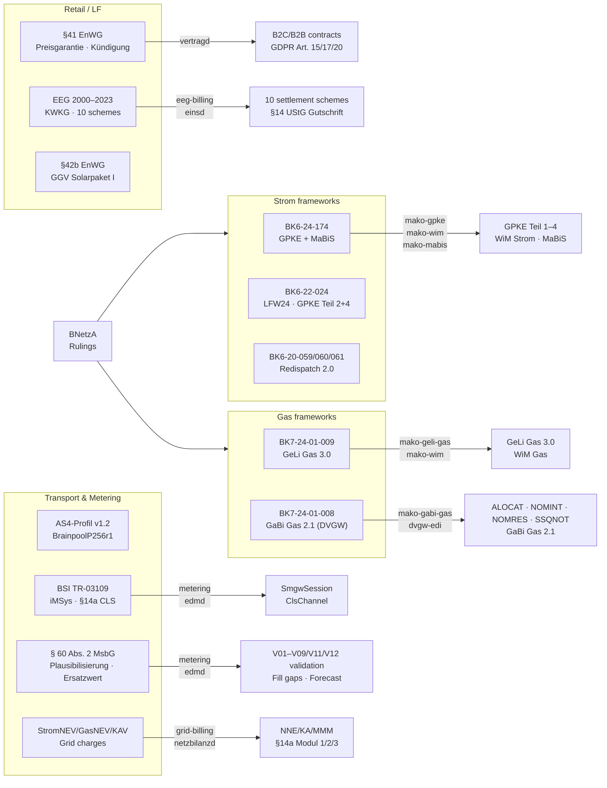

+++
title = "Regulatory"
description = "BNetzA determinations, the Prüfidentifikator catalog, and the legal basis behind each process."
weight = 5
sort_by = "weight"
template = "section.html"
page_template = "page.html"
[extra]
mermaid = true
+++
# Regulatory

BDEW market role model and identifier formats, BNetzA ruling index (BK6 / BK7),
business-level process catalog, APERAK Fristen, and the complete
Prüfidentifikator (PID) reference covering all 17 EDI@Energy message types.

| Page | Content |
|---|---|
| [Domain Model](domain-model) | Party roles (LF, NB, MSB, BKV, …), market objects (MaLo, MeLo, NeLo, NeBe), identifier formats, EDIFACT encoding |
| [BNetzA Regulatory Reference](bnetza) | BK6 / BK7 rulings, APERAK Fristen, process scopes |
| [Process Catalog](processes) | Business-level catalog of all MaKo processes — GPKE, WiM, GeLi Gas, MaBiS, Redispatch 2.0 — with message flows and implementation status |
| [PID Reference](pid-reference) | Complete Prüfidentifikator table for all process families, including the DVGW gas transport PIDs |

---

## Regulatory framework coverage

---

## Implemented regulatory frameworks

| Regulation | Domain | Implementation |
|---|---|---|
| **BK6-24-174** (GPKE Teil 1–3 + MaBiS, in force 06.06.2025) | Strom | `mako-gpke`, `mako-mabis` |
| **BK6-22-024** (GPKE Teil 4, WiM Teil 1/2) | Strom | `mako-gpke`, `mako-wim` |
| **BK6-22-024** (LFW24 — 24h-Lieferantenwechsel, §20a EnWG; re-issued GPKE Teil 2 + Teil 4, MPES absorbed into GPKE, in force 06.06.2025) | Strom | `mako-gpke` |
| **BK7-24-01-009** (GeLi Gas 3.0, BK7 Beschluss 12.09.2025) | Gas | `mako-geli-gas`, `mako-wim` |
| **BK7-24-01-008** (GaBi Gas 2.1 — Kapazitätsabrechnung, DVGW) | Gas | `mako-gabi-gas`, `dvgw-edi` |
| **PARTIN AHB 1.0f** (Kommunikationsdaten Strom + Gas) | Both | `mako-gpke` (37000–37006), `mako-geli-gas` (37008–37014) |
| **§42b Abs. 5 EnWG** (Solarpaket I — GGV Gemeinschaftliche Gebäudeversorgung) | Strom | `metering` crate (`GgvConstantAllocation`, `GgvProportionalAllocation`), `edmd` |
| **Residuallast** (ordinary supply, no special §) | Strom | `metering` crate (`Residual` rule), `edmd` |
| **EEG 2000–2023 / KWKG** (Feed-in settlement) | Strom | `eeg-billing` crate (10 schemes), `einsd` |
| **§14 Abs. 2 UStG** (Gutschriftverfahren — NB issues the EEG Gutschrift) | Strom | `eeg-billing` (`settlement_to_gutschrift`), `einsd` (`rechnung_json`) |
| **§ 60 Abs. 2 MsbG** (Plausibilisierung und Ersatzwertbildung im Smart-Meter-Gateway) | Both | `metering` crate (V01–V09/V11/V12 validation, `fill_gaps`), `edmd` |
| **§ 40a Abs. 2 EnWG** (Verbrauchsschätzung) · **§ 13 Abs. 1 StromGVV** (Abschlagshöhe) | Strom | `metering::project_annual_consumption`, `edmd /api/v1/forecast` |
| **BSI TR-03109** (iMSys / SMGW lifecycle, §14a CLS channels) | Strom | `metering` (`SmgwSession`, `ClsChannel`), `edmd` |
| **StromNEV / GasNEV / KAV** (grid charge settlement) | Both | `grid-billing` crate, `netzbilanzd` |
| **§14a EnWG** (Steuerbare Verbrauchseinrichtungen — Modul 1/2/3) | Strom | `grid-billing` (`Sect14aModule`), `processd` (produktcode check, GPKE Teil 3 Kap. 1.3) |
| **§41 EnWG** (Vertragsinhalte, Abs. 5 Preisänderungs-Unterrichtung + Sonderkündigungsrecht) / **§5 Abs. 2 StromGVV/GasGVV** (6-Wochen-Frist) | Both | `vertragd` |
| **§41a EnWG** (Dynamic tariffs — EPEX Spot day-ahead) | Strom | `productd` (EPEX prices), `billingd` (§41a iMSys guard) |
| **GDPR Art. 15/17/20** (data export, pseudonymization, portability) | — | `vertragd` (`/export`, `/anonymize`), `accountingd` (`/anonymize`) |
| **XRechnung 3.0 CII / PEPPOL UBL** (EN 16931 e-invoice) | — | `billingd` |
| **BK6-20-160 Anlage 6** (NZR-EMob / Modell 2 — ladevorgangscharfe bilanzielle Energiemengenzuordnung) · **BK6-24-267** (Modell 2 für Kundenanlagen, § 20 Abs. 1, 1a EnWG) | Strom | `mako-emob` (allocation engine + the three Modellwechsel-Workflows), `mako-mabis` (Zuordnung ZP der NGZ zur NZR, 55235–55237), `makod` (routing, adapters, UTILMD render), `marktd` (`malo.abwicklungsmodell`), `mako-pruefung` (`E_0510`–`E_0513`), `mako-fristen`, `edi-energy` (UTILMD 55235–55243, MSCONS 13018), `mako-engine` (`Marktrolle::Lpb`) |
| **BK6-20-059/060/061** (Redispatch 2.0) | Strom | `mako-redispatch` (8 workflows), `redispatch-xml` (9 document types), `makod` (AS4 EDIFACT+XML ingest), `grid-billing` (§13a Vergütung) |
| **BK6-23-241** (BilAReM, Beschluss 07.05.2026 — Planwert-/Prognosemodell, Kap.-3 Ausfallarbeit) | Strom | `mako-redispatch` (`bilarem` model/migration + `ausfallarbeit` engine), `grid-billing` (`bilarem_finanzielle_korrektur`), `netzbilanzd` (compute endpoints) |
| **§19 Abs. 2/3 StromNEV + BK8-25-003-A / GBK-25-01 (AgNeS, draft)** | Strom | `grid-billing::regulatory` (regime turnovers as dates; **AgNeS-era Entgelt settlements are refused** until the Rahmenfestlegung supplies parameters) |
| **§20b EnWG** (Netzzugangsplattform, G. v. 18.12.2025 — no Festlegung/API yet) | Both | `makod` (`netzzugang.*` commands, outbox-reliable sender + signed ERP-webhook fallback), `marktd` (`netzzugang_antraege` registry) |
| **BDEW AS4-Profil v1.2** (BrainpoolP256r1, sign+encrypt, ECDH-ES AES128-GCM) | — | `mako-as4` |
| **§ 20 Abs. 1 S. 1 EnWG** (diskriminierungsfreier Netzzugang) + **§ 6a / § 7a Abs. 5 EnWG** (informatorische Entflechtung, Gleichbehandlungsbericht by 31 March) | Both | `obsd` (`GET /api/v1/audit/gleichbehandlung`), Cedar ABAC |
| **MsbG §29 Abs. 3 / BSI TR-03109-4 §6.3** (SMGW certificate expiry monitoring) | Strom | `edmd` daily cert-expiry worker — tiered 90/30/7-day `de.messwert.smgw.cert.expiry-warning` (dedup per tier); `agentd` `smgw-diagnostics-agent` escalates renewal |

> **Format version coexistence.** Format releases ship on a semi-annual cadence
> with per-message, fv-dated profiles — e.g. `fv20260401` (binding from
> 01.04.2026) and `fv20261001` (binding from 01.10.2026). The directory is named
> after the **Anwendungszeitpunkt**, which Allgemeine Festlegungen 6.1d §2.5 puts
> six months after the Publikationsdatum printed on the document: published
> 01.04., applies 01.10.; published 01.10., applies 01.04. of the next year.
> Multiple format versions coexist in the same running instance. A process
> started under an older format version continues under those rules until it
> completes — no data migration required.
>
> **PID coverage.** Every Anwendungsfall the profiles carry has a witness:
> `tests/skeletons.rs` generates its minimal message from the Prüfschablone
> and validates it against that same column, and `cargo xtask
> check-pid-coverage` holds the shipped columns against BDEW's published
> Anwendungsübersicht, and reports its own count so this page need not carry
> one. A curated `valid/` fixture,
> asserted clean by the conformance suite, evidences that mako reads the
> Anwendungsfall.
>
> **Antwortcode fidelity.** `cargo xtask validate-ebd-codes` holds every answer
> code mako can send against the BDEW *Entscheidungsbaum-Diagramme und
> Codelisten* PDF: the tree publishes the code, and the **Cluster** mako assigns
> it is the Cluster the document prints. The Cluster is the half a code check
> alone misses — `A01` is an Ablehnung in `E_0510` and a Zustimmung in
> `E_0511`/`E_0512`, and `E_0205` and `E_0208` overlap on `A01`–`A03` while
> disagreeing about what each means, so a wrong Cluster answers a confirmation
> with a refusal and stays valid on the wire. The check needs the mirrored PDF
> (`cargo xtask sync-regulatories --download`) and skips without it.
