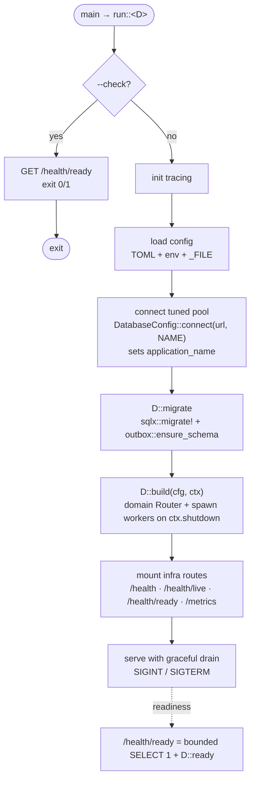

+++
title = "Services"
description = "Operator guides for the 17 production daemons — ports, config, APIs, deployment."
weight = 4
sort_by = "weight"
template = "section.html"
page_template = "page.html"
+++
mako implements the BDEW **Marktkommunikation** — the regulated message exchange between the
four German energy-market roles: **LF** (Lieferant, the retail supplier), **NB**
(Netzbetreiber, the grid operator), **MSB** (Messstellenbetreiber, the metering operator) and
**BKV** (Bilanzkreisverantwortlicher, who answers for a balancing group). Each service below
runs as one or more of those roles; see
[Party Roles](@/docs/architecture/domain-model.md#party-roles-marktrollen) for what each one
owns.

mako consists of **17 independently deployable services**, each built as a self-contained Docker image with:
- TOML configuration with `_FILE` suffix for Kubernetes secrets
- Cedar ABAC authorization
- OIDC/JWT + API-key authentication  
- OpenTelemetry traces and metrics
- MCP server at `/mcp` (Streamable HTTP) on 15 of the 17 services — all except outputd and agentd (the MCP host)
- Structured health endpoints (`/health`, `/health/ready`)

All services are built on **[`mako-service`](https://github.com/hupe1980/mako/tree/main/crates/mako-service)** — the shared SDK that provides `shutdown::token/serve` (SIGINT+SIGTERM graceful drain), `OidcConfig::build_verifier`, `McpAuth`+`McpAuthConfig`, `init_tracing_from_env`, `DatabaseConfig`, `HttpConfig`, `CedarEnforcer`, the transactional `outbox`, and more. This means zero copy-pasted infrastructure code across the 17 daemons.

`DatabaseConfig::connect(url, service_name)` is the single PostgreSQL pool builder every daemon uses: it applies the configured `pool_size` plus `acquire_timeout_secs` / `idle_timeout_secs` / `max_lifetime_secs` (so a pool never queues unboundedly or pins a connection across a failover) and tags each connection with the service name in `pg_stat_activity`. Tuning lives in one place rather than being re-derived per service.

---

## Service Map

```mermaid
graph TB
    ext["BDEW Counterparty<br/>(NB · LF · MSB · BKV)"]

    subgraph protocol ["Protocol & Market Data"]
        makod[":8080 makod<br/>EDIFACT runtime · 71 workflows<br/>AS4 · SlateDB · MCP"]
        marktd[":8180 marktd<br/>MaLo/MeLo/NeLo · contracts<br/>VersorgungsStatus · fan-out"]
        processd[":8580 processd<br/>Anmeldung STP ≥95%<br/>LF answers · §14a"]
    end

    subgraph nb_billing ["Invoice & Grid Billing (NB)"]
        invoicd[":8280 invoicd<br/>INVOIC 8-stage plausibility<br/>auto-settle/dispute"]
        netzbilanzd[":8680 netzbilanzd<br/>NNE/KA/MMM/MSB billing<br/>SettlementResult · CalculationTrace"]
        sperrd[":8780 sperrd<br/>Sperr-/Entsperrauftrag queue<br/>ORDERS 17115/17117 · IFTSTA 21039"]
    end

    subgraph data ["Energy Data & Observability"]
        edmd[":8380 edmd<br/>MSCONS · iMSys direct push<br/>Hampel · V01–V09/V11/V12 · virtual"]
        obsd[":8480 obsd<br/>process projections · KPI<br/>§7a Abs. 5 EnWG parity report"]
        mabis[":8880 mabis-syncd<br/>MaBiS Summenzeitreihe<br/>MSCONS 13003 · 10. Werktag · MCP"]
        einsd[":9180 einsd<br/>EEG/KWKG settlement<br/>10 schemes · §14 UStG Gutschrift"]
    end

    subgraph lf_billing ["Retail Billing (LF)"]
        productd[":9080 productd<br/>14 categories · §42 Stromkennzeichnung<br/>EPEX §41a · B2B Angebote"]
        billingd[":9280 billingd<br/>13 categories · XRechnung 3.0<br/>RLM demand · §54 exemption"]
        outputd[":9880 outputd<br/>Typst templates · ZUGFeRD carrier<br/>issued documents · delivery evidence"]
        accountingd[":9380 accountingd<br/>Massenkontokorrent<br/>SEPA FRST/RCUR · GLN ID · Aging · §288 BGB"]
    end

    subgraph b2c ["Contract & Customer (LF)"]
        vertragd[":9780 vertragd<br/>Kunden B2C+B2B · Rahmenverträge<br/>OIDC→MaLo · 17 MCP tools"]
        portald[":9480 portald<br/>customer portal read-model<br/>§41 self-service"]
    end

    agentd[":9580 agentd<br/>28 declarative manifests on agentplane<br/>journaled effects · strict replay<br/>human triage worklist · A2A cards<br/>OIDC · HMAC · 5 model backends"]

    ext -->|AS4 / REST| makod
    makod <-->|CloudEvents| marktd
    marktd -->|webhook fan-out| processd & invoicd & edmd & obsd & agentd
    makod -->|commands| netzbilanzd & invoicd
    mabis -->|UTILTS cmd| makod
    billingd -->|de.billing.rechnung.erstellt| accountingd
    billingd -->|render · pin hash| outputd
    vertragd -->|start-supply| processd
    portald -->|aggregates| billingd & accountingd & edmd & einsd & marktd
```



---

## Protocol & Market Data

| Service | Port | Role | Purpose |
|---|---|---|---|
| [makod](@/docs/services/makod.md) | `:8080` · `:4080` · `:8090` | All | Protocol daemon — 71 workflows over 469 Prüfidentifikatoren, AS4/REST/iMS |
| [marktd](@/docs/services/marktd.md) | `:8180` | All | Market Data Hub — MaLo/MeLo/contracts, VersorgungsStatus, typed BO4E API, durable fan-out, MMMA monthly import worker |
| [processd](@/docs/services/processd.md) | `:8580` | NB + LF + MSB | Process Decision Engine — Anmeldung STP ≥95%, LF answers to the NB-initiated GPKE processes, MSB REQOTE auto-response, §14a Steuerungsauftrag produktcode check; role-gated binaries (§ 6a EnWG) |

## Invoice & Grid Billing

| Service | Port | Role | Purpose |
|---|---|---|---|
| [invoicd](@/docs/services/invoicd.md) | `:8280` | LF | INVOIC plausibility-check — eight stages (incl. ToU band routing via `zaehlzeitregister`), auto-settle/dispute, § 147 AO / GoBD receipts |
| [netzbilanzd](@/docs/services/netzbilanzd.md) | `:8680` | NB | NNE/KA/MMM/MSB/AWH billing — generates INVOIC 31001/31002/31005/31009/31011, full REMADV lifecycle, §14a Modul 2 ToU, §42b EnWG GGV, Redispatch 2.0 Kostenblatt, 8-tool MCP server |
| [sperrd](@/docs/services/sperrd.md) | `:8780` | NB | Sperrung execution tracking — IFTSTA 21039 auto-dispatch on field confirmation; `GET /stats` compliance snapshot; tenant isolation; 4-tool MCP server |

## Energy Data & Observability

| Service | Port | Role | Purpose |
|---|---|---|---|
| [edmd](@/docs/services/edmd.md) | `:8380` | All | Energy Data Management — MSCONS, iMSys direct push, Kafka batch ingest, quality scoring and validation, virtual meters, tiered storage; 15-tool MCP server |
| [mabis-syncd](@/docs/services/mabis-syncd.md) | `:8880` | ÜNB/NB | MaBiS synchronisation — aggregates quarter-hourly Lastgang per Bilanzierungsgebiet via `SummenzeitreiheBuilder`, files with the BIKO as MSCONS 13003 on the 10. Werktag; records the BIKO-assigned Datenstatus and open Korrekturbedarf; emits `de.mabis.*` failure events; 4-tool read-only MCP server |
| [einsd](@/docs/services/einsd.md) | `:9180` | NB/LF | Einspeiser Registry + EEG/KWKG settlement — 10 settlement schemes; issues the **§14 UStG Gutschrift** (Gutschriftverfahren) per billable settlement as a BO4E `Rechnung` with per-rate USt breakdown; 19-tool MCP server |
| [obsd](@/docs/services/obsd.md) | `:8480` | All | Business-process observability — per-PID KPIs with the APERAK and Antwortfrist clocks reported separately, deadlines read from `mako-fristen` (never computed here), `completed_at` cycle-time tracking, `GET /api/v1/audit/gleichbehandlung` for the § 7a Abs. 5 EnWG filing, 6-tool MCP server |

`edmd`'s quality layer is Hampel scoring plus the V01–V09/V11/V12 validation rules; its
derived products are virtual meters (§ 42b EnWG GGV), the § 40a Abs. 2 EnWG
Verbrauchsschätzung, Resampling and Ablesesteuerung (INSRPT auto-order). `meterstore` tiers
hot PostgreSQL against cold Apache Iceberg with cross-tier OLAP and a read-only Iceberg REST
catalog, and every Cedar write action is role-gated to MSB/NB/admin.

## Retail Billing (LF)

| Service | Port | Role | Purpose |
|---|---|---|---|
| [productd](@/docs/services/productd.md) | `:9080` | LF | Product & Tariff Catalog — user-defined energy products, EPEX Spot for §41a, B2B Angebote/quotations |
| [billingd](@/docs/services/billingd.md) | `:9280` | LF | Energy Billing Engine — 13 categories, §41a dynamic, §42b EnWG GGV community solar, EN 16931 e-invoicing (XRechnung 3.0 CII / PEPPOL UBL); the ZUGFeRD PDF renders via outputd |
| [outputd](@/docs/services/outputd.md) | `:9880` | — | Customer Communications — operator Typst templates, the ZUGFeRD PDF/A-3 carrier, the append-only store of issued documents and their delivery |
| [accountingd](@/docs/services/accountingd.md) | `:9380` | LF | Customer Account Ledger — tamper-evident double-entry ledger (`doubleentry`: Merkle proofs, period seals for GoBD/§146 AO); per-MaLo Kontokorrent, FIFO open-item clearing, Summen- und Saldenliste §238 HGB, Verzugszinsen §288 BGB, Zahlungsvereinbarung; SEPA pain.008 and CAMT.054; dunning delivered through outputd; §40b Abs. 1 Jahresabschluss; GDPR Art. 17 |

`outputd`'s templates are content-addressed and append-only, and a publish is gated by
proof; besides the invoice it renders the Textform kinds — Mahnung (§ 126b BGB) and
Preisanpassung (§ 41 Abs. 5 EnWG) — and delivers over portal, e-mail, print spool and ERP
with per-channel evidence.

## B2C & AI

| Service | Port | Role | Purpose |
|---|---|---|---|
| [vertragd](@/docs/services/vertragd.md) | `:9780` | LF + MSB | Contract & Customer Management — Kunden (B2C+B2B), Rahmenverträge, Versorgungsverträge, kunden_identitaeten (N portal users per company), Tarifwechsel with its § 41 Abs. 5 EnWG Preisänderungsanzeige (rendered and delivered through outputd), Kündigung, OIDC→MaLo auth gateway for portald |
| [portald](@/docs/services/portald.md) | `:9480` | LF | Customer Portal gateway — stateless aggregation over all LF services plus the §41 EnWG self-service writes (Tarifwechsel, Kündigung, SEPA, GDPR Art. 16) and the document inbox served out of outputd; every route resolves customer ownership through `vertragd`; 8-tool operator MCP server |
| [agentd](@/docs/services/agentd.md) | `:9580` | All | Multi-agent LLM orchestration — **28 declarative manifests** on the agentplane durable runtime, every effect journaled; read-only by construction, so oversight is a triage worklist |

`agentd`'s manifests are activated through `[bundled_agents]`. One event yields one journaled
run per subscribing specialist — there is no first-wins mode, because cancelling a loser
leaves an unknown outcome on the record. No active manifest grants a mutating tool, so a
finding opens a triage row beside the answer rather than suspending the run in front of it.
`POST /api/v1/run` is OIDC-authenticated, the inbound webhook is HMAC-verified, and each
specialist publishes an A2A agent card derived from its manifest.

---

## Shared foundation — the `mako-service` SDK

Every daemon is built on the [`mako-service`](https://github.com/hupe1980/mako/tree/main/crates/mako-service)
crate, so the operational surface — health, config, auth, tracing, shutdown, event delivery — is
identical across all 17. A service's `main` is a single line:

```rust
#[tokio::main]
async fn main() -> anyhow::Result<()> {
    mako_service::run::<Billingd>().await   // Billingd: Daemon impl
}
```

`run::<D>()` owns the whole lifecycle. A `Daemon` implementation supplies only what is
service-specific — the config type, the migrations, and a `build()` that assembles the domain
router and spawns background workers:



What every service gets for free from the runner:

| Concern | Provided by `run::<D>()` |
|---|---|
| **Tracing** | Structured logs + optional OTLP export (`RUST_LOG`, `OTEL_EXPORTER_OTLP_ENDPOINT`) |
| **Config** | `[database]` + service blocks, `env:`/`_FILE` substitution, `<SVC>_CONFIG` path |
| **Pool** | Tuned sizing with a per-service `application_name` for `pg_stat_activity` |
| **Migrations** | Applied at startup before the first request |
| **Readiness** | Real `/health/ready` — a bounded `SELECT 1` DB ping, not a static `true` |
| **Shutdown** | SIGINT/SIGTERM graceful drain; workers observe `ctx.shutdown` |
| **Health probe** | `--check` in-container HEALTHCHECK (no shell, no curl) |

Event-emitting services — accountingd, billingd, einsd, mabis-syncd, netzbilanzd and
vertragd — add the SDK's **transactional outbox**: each outbound CloudEvent is written to
`event_outbox` *in the same transaction* as the business change and drained by a background
`OutboxWorker` with retry and a status-column dead-letter queue. (`marktd` keeps its own
`event_log` outbox ahead of the durable fan-out, and `invoicd` retries its ERP notifications
from columns on `invoic_receipts` rather than from an `event_outbox`.) Because the event is committed atomically with the data that
justifies it, a crash between "commit" and "deliver" can never drop or duplicate it —
persist-before-dispatch. Emission always goes through one builder and one signer
(`CloudEvent::new` + `post_ce_with_retry`; Standard Webhooks (`webhook-signature`)).

> `makod`, `marktd` and `agentd` keep bespoke `main`s — `makod`/`marktd` for their non-standard
> runtimes (SlateDB event store, `marktd`'s durable fan-out worker), `agentd` because it holds no
> database. All three still use the same SDK building blocks (config, auth, tracing, shutdown,
> HMAC). `portald` is stateless too and runs on `mako_service::run` — the runner supports a daemon
> with no `[database]`.

---

## Deployment

All services are available as multi-stage Docker images built with `cargo-chef`:

```bash
# Single all-in-one daemon (makod only)
docker pull ghcr.io/hupe1980/mako-makod:latest

# NB STP demo — UTILMD 55001 Lieferbeginn end-to-end
git clone https://github.com/hupe1980/mako
cd mako/demos/nb-stp
docker compose up

# EEG billing demo — solar plant registration + §21 EEG 2023 settlement
cd mako/demos/eeg-billing
docker compose up
```

See the [Getting Started](@/docs/guide/getting-started.md) guide for the full deployment walkthrough.
