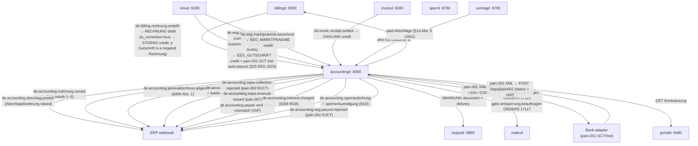
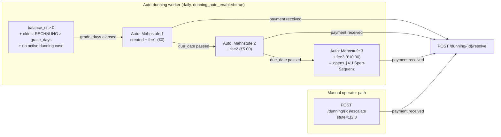
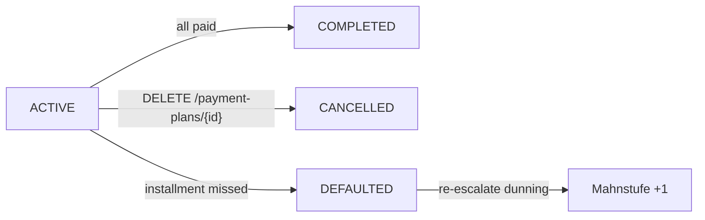
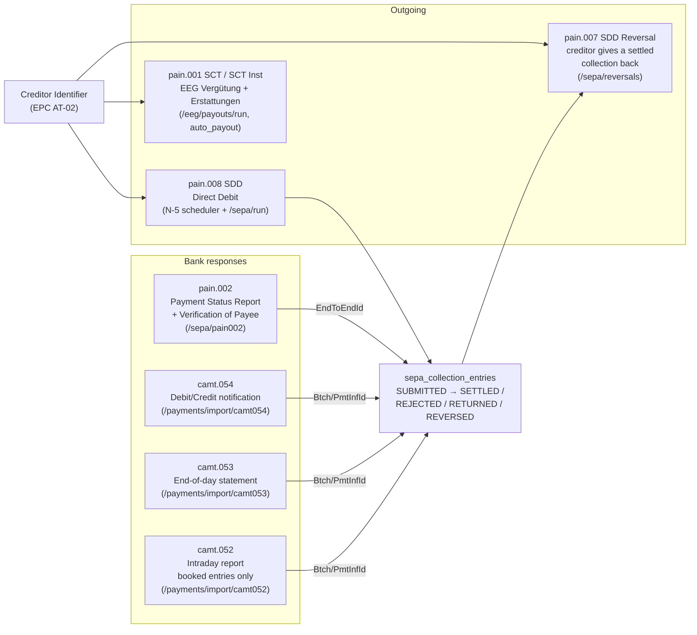
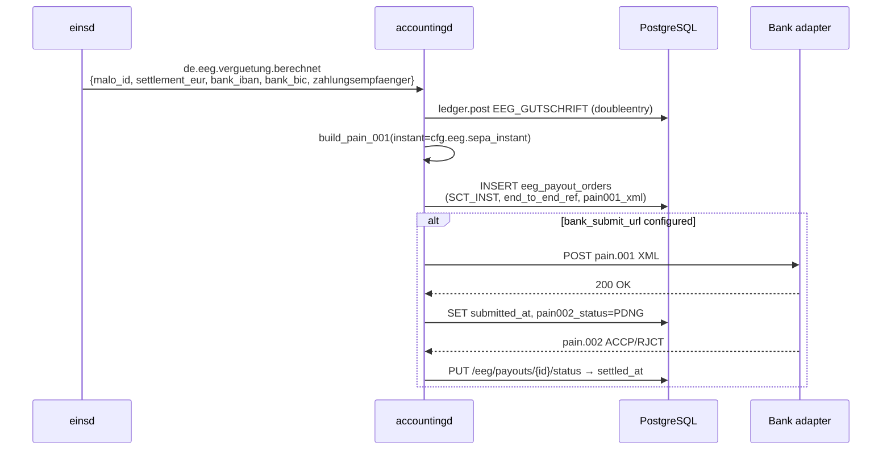

+++
title = "accountingd Operator Guide"
description = "accountingd operator guide — Massenkontokorrent / Customer Account Ledger (LF role). Tamper-evident double-entry ledger (the doubleentry crate — Merkle proofs, period seals), per-Marktlokation Kontokorrent + GL contra chart (SKR 03/04-aligned), FIFO open-item management, camt.053 + camt.054 XML and flat-export dedup import, SEPA pain.008 (multi-group single message, mandatory Gläubiger-ID) + pain.001 + pain.007 reversal XML, pain.002 status ingestion with Verification of Payee, ISO 20022 structured postal addresses (EPC cut-over 2026-11-15), Verzugszinsen §288 BGB, payment plans (Zahlungsvereinbarung), aging analysis, Mahnwesen automatic rule engine (Mahnstufe 1–3), OIDC/JWT auth, inbound HMAC verification, GDPR Art. 17 pseudonymization, balance reconciliation, EEG Gutschrift + Marktprämie ingest, Jahresabschluss §40 EnWG."
weight = 34
[extra]
mermaid = true
+++
# `accountingd` — Massenkontokorrent / Customer Account Ledger

`accountingd` provides the **FI-CA equivalent** for the mako retail billing stack.
Without it, `billingd` invoices are fire-and-forget — no Offene-Posten tracking,
no automated dunning, no SEPA collection.

Port: **`:9380`**

---

## Why a dedicated ledger?

SAP IS-U calls this module **FI-CA** (Financial Contract Accounting). powercloud and
Wilken ENER:GY both include it natively. `accountingd` provides the same capabilities
as a standalone microservice with CloudEvents integration.

**The ledger is event-driven and idempotent.** CloudEvents from `billingd`, `einsd`,
and `invoicd` drive entries atomically — re-delivering the same CloudEvent produces
no duplicate entry, because every post carries the CloudEvent id as the doubleentry
ledger's idempotency key (an identical replay is a store-level no-op).

---

## Event flow



---

## Ledger entry types

| `entry_type` | Sign | Trigger |
|---|---|---|
| `RECHNUNG` | +debit | `de.billing.rechnung.erstellt` (`is_correction=false`) |
| `STORNO` | ±signed | `de.billing.rechnung.erstellt` (`is_correction=true`) — billing reversal / Gutschrift (a Gutschrift is a negated Rechnung, not a separate event) |
| `ZAHLUNG` | -credit | CAMT.054 import or `de.invoic.receipt.settled` |
| `EEG_GUTSCHRIFT` | -credit | `de.eeg.verguetung.berechnet` — §21 EEG Einspeisevergütung |
| `EEG_MARKTPRAEMIE` | -credit | `de.eeg.marktpraemie.berechnet` — §20 EEG Direktvermarktung |
| `BANKRUECKLAST` | +debit | Returned SEPA direct debit |
| `SEPA_STORNO` | +debit | pain.007 creditor reversal of a settled collection |
| `MAHNGEBUEHR` | +debit | Dunning fee per Mahnstufe (configurable) |
| `VERZUGSZINSEN` | +debit | § 288 BGB default interest |
| `ABSCHLAG` | **+debit** | Monthly Abschlagsforderung raised by the Abschlagslauf — a demand, not a receipt |
| `ABSCHLAG_VERRECHNUNG` | −credit | The settling invoice discharges the advances it deducted |
| `JAHRESABSCHLUSS` | ±signed | Annual settlement refund (§40 EnWG) |
| `KORREKTUR` | ±signed | Manual operator correction via `POST /buchen` |

`ledger::ENTRY_TYPES` is the single list: `Chart::contra` maps each kind to a GL
account and `POST /buchen` refuses anything outside it, so a kind cannot be
bookable by an automated path and rejected by the operator interface.

### The Abschlag pair

An Abschlag is neither revenue nor cash — it is a demand for a part-payment on a
supply not yet billed (§ 40 Abs. 1 EnWG, § 14 Abs. 5 UStG). Both halves book
against SKR 03 1718 / SKR 04 3272 **Erhaltene Anzahlungen**, never against Bank:

```
Abschlagslauf   ABSCHLAG              Dr Kontokorrent  / Cr Erhaltene Anzahlungen
money arrives   ZAHLUNG               Cr Kontokorrent  / Dr Bank
Endrechnung     RECHNUNG (gross)      Dr Kontokorrent  / Cr Erlöse
   …the same    ABSCHLAG_VERRECHNUNG  Cr Kontokorrent  / Dr Erhaltene Anzahlungen
```

Between the demand and the invoice, Erhaltene Anzahlungen carries the operator's
open advance obligation — the § 266 Abs. 3 C.3 HGB line. Three consequences
follow, none of which holds if the demand is booked as a credit against Bank:

- an **unpaid advance is an open receivable**, so it reaches
  `accounts.verzug_ct` and the Mahnwesen — the most common arrears case there
  is;
- the **payment is booked once**. Crediting on the scheduled day *and* on the
  camt.054 receipt credits one payment twice, and the Jahresabschluss reads the
  doubled credit as an overpayment;
- the **Endrechnung is booked gross**, and the deduction it states
  (`gesamtbrutto − zuZahlen`) is booked as the matching credit — never a figure
  recomputed here.

`abschlag_forderungen` is the register beside the ledger, carrying the two
document facts a posting does not: the **USt rate** each advance was raised at
(§ 14 Abs. 5 Satz 2 UStG) and **which invoice absorbed it**. Whether it was
*received* is never stored there — it is the residual of its ledger entry after
FIFO clearing.

**Balance** = the signed net of the customer's Kontokorrent leg in the ledger — negative = credit balance (customer overpaid); positive = outstanding debt. (`accounts.balance_ct` mirrors this net as a derived read cache.)

**No f64 money.** All amounts use `i64` cents (1 ct = 0.01 EUR). The pain.008 XML
generator uses integer arithmetic — no floating-point rounding errors.

---

## Mahnwesen (dunning) lifecycle

The dunning engine operates in two modes: **automatic** (background worker) and **manual** (operator-triggered).



**Automatic escalation**: set `dunning_auto_enabled = true` in config.
The worker runs daily and is idempotent (`auto_dunning_runs` UNIQUE guard). After
escalation it runs the [§§41f/41g Sperr-Sequenz](#sperr-sequenz-ssss41f-41g-enwg) —
Sperrandrohung → Sperrankündigung → Sperrauftrag — for every qualifying
Mahnstufe-3 case.

**Manual escalation**: `POST /api/v1/dunning/{account_id}/escalate` remains available
for operator override (e.g. grace extensions, special B2B arrangements).

### The customer is told

Every open case without a document is rendered as a `MAHNUNG` through `outputd`
and queued on the customer's channels — portal always, e-mail and post where
master data allows — and the document id is stamped on `dunning_cases`. The
sweep runs beside the escalation rather than inside it: escalating is arithmetic
on the ledger, while issuing a document depends on a rolled-out template, a
customer on file and a reachable channel, and folding them together would let
one missing e-mail address roll back a Mahnstufe.

Configure `outputd_url` **and** `vertragd_url` together. `accountingd` keys
everything on a Marktlokation and holds no customer master, so the recipient
comes from `vertragd`; a case whose recipient cannot be resolved is **not**
documented and says so, because an unaddressed Mahnung is not Textform
(§ 126b BGB names the recipient) and issuing one would make an undeliverable
notice indistinguishable from a sent one.

The page contract is `outputd::document::mahnung::MahnungView`. The Posten come
from the ledger's **live open receivables** after FIFO clearing rather than from
`dunning_cases.amount_due_ct`, which is the total at the moment the case opened;
Verzugsschaden is demanded on its own lines, so a reader can see what is supply
debt and what the dunning itself added. The § 41f Abs. 1 threat block prints
only once the case carries a `sperrandrohung_at` — never merely because the
Stufe is 3.

---

## Endpoints

| Method | Path | Description |
|--------|------|-------------|
| `POST` | `/webhook` | Ingest CloudEvents (billingd, einsd, invoicd) — HMAC-verified |
| `GET/PUT` | `/api/v1/accounts/{malo_id}` | Account CRUD (IBAN, Abschlag, billing_day) — OIDC required for PUT |
| `GET` | `/api/v1/accounts/{malo_id}/balance` | Current balance in ct; status: overdue/credit/settled |
| `GET` | `/api/v1/accounts/{malo_id}/ledger` | Paged ledger entries |
| `GET` | `/api/v1/accounts/{malo_id}/kontoauszug` | Account statement (portald-consumable) |
| `GET` | `/api/v1/accounts/{malo_id}/open-items` | **Offene Posten** — authoritative unpaid/partial invoices (after recorded clearings) |
| `POST` | `/api/v1/accounts/{malo_id}/clear` | Record a FIFO Zahlungszuordnung (open credits → oldest open debits) |
| `POST` | `/api/v1/clearings/{clearing_id}/reset` | Release a mis-assigned Zahlungszuordnung |
| `GET` | `/api/v1/trial-balance` | **Summen- und Saldenliste** (§ 238 HGB) — Soll/Haben/Saldo per account, Σ debits = Σ credits |
| `PUT` | `/api/v1/accounts/{malo_id}/abschlag` | Update monthly advance payment |
| `GET/PUT` | `/api/v1/accounts/{malo_id}/vorauszahlung` | Typed `rubo4e::current::Vorauszahlung` (§40 EnWG) |
| `GET/PUT` | `/api/v1/accounts/{malo_id}/zahlungsinformation` | Typed `rubo4e::current::Zahlungsinformation` |
| `POST` | `/api/v1/accounts/{malo_id}/buchen` | **Manual booking** (operator-authorised ledger entry) |
| `POST` | `/api/v1/accounts/{malo_id}/reconcile` | **Balance reconciliation** — detect/repair `balance_ct` cache drift |
| `POST` | `/api/v1/accounts/{malo_id}/anonymize` | **GDPR Art. 17** pseudonymization (preserves ledger) — OIDC required |
| `GET/POST` | `/api/v1/accounts/{malo_id}/interest-charges` | Verzugszinsen §288 BGB — list/book default interest |
| `GET/POST` | `/api/v1/accounts/{malo_id}/payment-plans` | Zahlungsvereinbarung — list/create payment plans |
| `GET` | `/api/v1/aging` | **Aging analysis** — receivables by 0–30d / 31–60d / 61–90d / >90d buckets |
| `POST` | `/api/v1/periods/{period_id}/seal` | **Festschreibung** (GoBD / § 146 AO) — close + seal a period; body `{ "start", "end" }` |
| `GET` | `/api/v1/periods/seals` | Seal history + chain verification (`chain_valid`) and `sealed_through` — the date the books are closed through |
| `GET` | `/api/v1/entries/{entry_id}/proof` | **Merkle inclusion proof** an entry is committed (content hash + tree head) |
| `GET` | `/api/v1/periods/{period_id}/balance-proof` | **Balance proof** — what a customer's Kontokorrent closed at in a sealed period (§ 147 AO); query `malo_id`, `lf_mp_id` |
| `GET` | `/api/v1/entries/consistency-proof` | **Consistency proof** the journal has only been appended to since `?since=<tree_size>` |
| `POST` | `/api/v1/payments/import` | Ingest CAMT.054 bank statement (JSON array, deduplicated by `bank_transaction_id`) |
| `GET` | `/api/v1/offene-posten` | Overdue accounts |
| `GET` | `/api/v1/dunning` | Open dunning cases |
| `POST` | `/api/v1/dunning/{account_id}/escalate` | Manual Mahnstufe escalation |
| `POST` | `/api/v1/dunning/{id}/resolve` | Mark dunning case resolved |
| `POST` | `/api/v1/dunning/{id}/abwendung/angebot` | Record the **Abwendungsvereinbarung offer** (§41g Abs. 1 S. 2 EnWG) |
| `GET\|POST` | `/api/v1/dunning/{id}/locks` | Mahnsperren on the account — list, or place one with a ground and a validity |
| `DELETE` | `/api/v1/dunning/locks/{lock_id}` | Lift a Mahnsperre, with a reason |
| `GET` | `/api/v1/dunning/locks/review` | Open-ended locks awaiting review |
| `GET\|POST` | `/api/v1/dunning/{id}/einwaende` | Forderungseinwände (§41f Abs. 3 S. 3–5 EnWG) — amounts outside the Verzug |
| `POST` | `/api/v1/einwaende/{einwand_id}/erledigen` | Close an objection; the amount re-enters the Verzug |
| `GET` | `/api/v1/sepa/mandates/dormant` | Mandates at or near the EPC 36-month dormancy limit |
| `GET` | `/api/v1/payment-plans/{id}` | Get payment plan with full installment schedule |
| `DELETE` | `/api/v1/payment-plans/{id}` | Cancel payment plan (CANCELLED status) |
| `POST` | `/api/v1/sepa/mandates` | Register SEPA mandate (IBAN validated via mod-97) — OIDC required |
| `GET` | `/api/v1/sepa/mandates/{id}` | Fetch mandate |
| `DELETE` | `/api/v1/sepa/mandates/{id}` | **Revoke mandate** (§58 ZAG) |
| `POST` | `/api/v1/sepa/run` | Generate **and archive** one pain.008 message (one `PmtInf` group per SequenceType, mandatory Gläubiger-ID) |
| `GET` | `/api/v1/sepa/collections/{run_id}/entries` | What a run collected, and where each entry stands (`SUBMITTED`/`SETTLED`/`REJECTED`/`RETURNED`/`REVERSED`) |
| `POST` | `/api/v1/sepa/pain002` | Ingest a **pain.002 XML** status report — applies to payouts *and* collections, incl. Verification of Payee |
| `POST` | `/api/v1/sepa/reversals` | Build a **pain.007** giving a settled collection back (creditor-initiated Storno) |
| `POST` | `/api/v1/payments/import/camt054` | Ingest a camt.054 XML notification (batch-booked entries expanded per `TxDtls`; returns → `BANKRUECKLAST`) |
| `POST` | `/api/v1/payments/import/camt053` | Ingest a camt.053 XML end-of-day statement (same booking rules, plus the bank's closing balance) |
| `POST` | `/api/v1/payments/import/camt052` | Ingest a camt.052 XML intraday report — **booked entries only**, the provisional ones are reported not posted |
| `POST` | `/api/v1/payments/import` | Ingest a **flat bank export** (JSON array) — accountingd's own contract, not an ISO 20022 message |
| `GET` | `/api/v1/eeg/payouts` | List EEG payout orders (`?status=PDNG\|ACCP\|RJCT\|CANC`) |
| `GET` | `/api/v1/eeg/payouts/{id}` | Single EEG payout with `pain001_xml` for audit |
| `POST` | `/api/v1/eeg/payouts/run` | **Batch-generate** pain.001 for all unbatched `EEG_GUTSCHRIFT` entries |
| `PUT` | `/api/v1/eeg/payouts/{id}/status` | Process pain.002 `ACCP`/`RJCT`/`CANC` |
| `POST` | `/api/v1/jahresabschluss/{malo_id}` | **Annual settlement** (§40 EnWG, idempotent per year; refund on Erstattung) |
| `GET` | `/api/v1/accounts/{malo_id}/abschlaege` | The advances a settling invoice may deduct — received, unabsorbed, oldest first, each with its § 14 Abs. 5 Satz 2 UStG rate (`?from=&to=`) |
| `PUT` | `/api/v1/accounts/{malo_id}/business-partner` | Link account to a `kunden_nr` |
| `GET` | `/api/v1/business-partners/{kunden_nr}/accounts` | All accounts of a business partner |
| `GET` | `/api/v1/business-partners/{kunden_nr}/balance` | Consolidated balance |
| `GET` | `/metrics` | Prometheus financial + operational gauges |
| `GET` | `/health` · `/health/ready` | Liveness / readiness |

---

## Manual booking (`POST /api/v1/accounts/{malo_id}/buchen`)

For operator-authorised bookings not driven by CloudEvents:

```bash
curl -X POST "http://accountingd:9380/api/v1/accounts/51238696012/buchen" \
  -H "Content-Type: application/json" \
  -d '{
    "entry_type":   "ZAHLUNG",
    "amount_ct":    -5000,
    "reference_id": "BANK-TXN-2026-07-10",
    "description":  "Überweisung Kunde (ausserhalb SEPA)"
  }'
```

Allowed `entry_type` values are `ledger::ENTRY_TYPES`: `RECHNUNG`, `STORNO`,
`KORREKTUR`, `GUTSCHRIFT`, `ABSCHLAG`, `ABSCHLAG_VERRECHNUNG`, `ZAHLUNG`,
`BANKRUECKLAST`, `SEPA_STORNO`, `MAHNGEBUEHR`, `VERZUGSZINSEN`,
`EEG_GUTSCHRIFT`, `EEG_MARKTPRAEMIE`, `JAHRESABSCHLUSS`.

`amount_ct`: positive = debit (increases outstanding debt); negative = credit (reduces debt).

---

## Jahresabschluss (§40 Abs. 1 EnWG)

The annual settlement compares actual billed amounts against advance payments collected:

```bash
# Preview (dry_run=true)
curl "http://accountingd:9380/api/v1/jahresabschluss/51238696012?year=2025&dry_run=true"

# Commit
curl -X POST "http://accountingd:9380/api/v1/jahresabschluss/51238696012?year=2025"
```

Response:
```json
{
  "malo_id":                  "51238696012",
  "year":                     2025,
  "rechnung_sum_ct":          120000,
  "abschlag_net_ct":          0,
  "zahlung_net_ct":           -108000,
  "verzugsschaden_ct":        0,
  "sonstige_ct":              0,
  "settlement_ct":            12000,
  "settlement_eur":           "120.00",
  "new_monthly_abschlag_ct":  10000,
  "action":                   "NACHZAHLUNG",
  "committed":                true,
  "ce_id":                    "jahresabschluss:51238696012:2025"
}
```

### Model

`settlement_ct` is the signed net of the year's **whole** Kontokorrent
movement — never a hand-picked subset of Buchungsarten, because an omitted kind
is how a settlement quietly disagrees with the balance it settles and pays out a
refund nobody owed. The four buckets partition the total and a fifth,
`sonstige_ct`, carries whatever they do not name, so adding a Buchungsart cannot
silently drop it.

For a customer on a monthly advance plan who paid every one:

```
RECHNUNG              +1300.00   the year, gross
ABSCHLAG              +1200.00   12 demands raised
ABSCHLAG_VERRECHNUNG  −1200.00   the invoice discharges them
ZAHLUNG               −1200.00   12 payments received
                      ────────
settlement_ct           +100.00  → Nachzahlung
```

- **Nachzahlung** (settlement > 0): **no** settlement entry is written — the
  balance *is* the open receivable, collected by the SEPA/dunning path.
- **Erstattung** (settlement < 0): a clearing debit zeroes the credit balance
  and a **pain.001** refund is generated to the customer's IBAN (returned in
  the response and dispatched as `de.accounting.erstattung.faellig`). Without a
  stored IBAN the credit is carried forward and offset against the next
  Rechnung.

The run is idempotent per `(tenant, malo_id, year)` via `jahresabschluss_runs`
and recalibrates the monthly `abschlag_ct` to the year's supply billing ÷ 12 —
Verzugsschaden excluded, because § 40 Abs. 1 ties the advance to expected
consumption and raising it because a customer was dunned would make next year's
advances a second penalty.

Every committed settlement announces
`de.accounting.jahresabschluss.abgeschlossen`, whatever the outcome, in the same
transaction as the settlement it reports.

### The annual worker (§ 40b Abs. 1 EnWG)

`jahresabschluss_auto_enabled = true` settles the previous year for every
account that has no `jahresabschluss_runs` row for it, through the same function
the endpoint drives — so a scheduled settlement and an operator's click produce
the same postings, the same refund and the same event. It is bounded at 500
accounts per daily pass; the rest are picked up tomorrow.

Opt-in, and no earlier than `jahresabschluss_start_day` (default `"02-01"`),
because the settlement **moves money**: an overpaid year is refunded by pain.001
the moment it is settled, and § 40c Abs. 2 gives a supplier six weeks after the
period to render the bill — so settling on 1 January would refund against
December invoices nobody has issued yet.

---

## Business partner aggregation (FI-CA contract account)

One customer (`vertragd.kunden.kunden_nr`) may hold several market-location
accounts. Linking them enables cross-MaLo balance and dunning:

```bash
# Link an account to its business partner
curl -X PUT ".../api/v1/accounts/51238696012/business-partner" \
  -H 'Content-Type: application/json' -d '{"kunden_nr":"K-100234"}'

# Consolidated view
curl ".../api/v1/business-partners/K-100234/accounts"
curl ".../api/v1/business-partners/K-100234/balance"
```

## Sperr-Sequenz (§§41f/41g EnWG)

Since **23.12.2025** (BGBl. 2025 I Nr. 347, umsetzend EU-RL 2024/1711) the
payment-default disconnection of a Haushaltskunde is governed by **§§41f/41g
EnWG** — not the repealed §19 StromGVV/GasGVV (which now covers only the
illegal-use case). accountingd drives the sequence itself; the daily dunning
worker calls `sperr::run_sperr_sequence` **every cycle** (not only when new
Mahnungen were created), advancing each qualifying Mahnstufe-3 case one phase:

| Phase | Trigger | Frist | Action | Rechtsgrundlage |
|---|---|---|---|---|
| **1. Sperrandrohung** | Mahnstufe 3, both §41f Abs. 3 thresholds cleared (see below), not halted | ≥ 4 Wochen nach Mahnung | `de.accounting.sperrandrohung` via outbox; sets `sperrandrohung_at` | §41f Abs. 1 |
| **2. Sperrankündigung** | Androhung + `sperrandrohung_frist_days` (default 28) elapsed | announces disconnection **8 Werktage im Voraus** | `de.accounting.sperrankuendigung` via outbox; sets `sperrankuendigung_at` + `geplantes_sperrdatum = heute + 8 Werktage` (BDEW-Kalender) | §41f Abs. 5 |
| **3. Sperrauftrag** | `geplantes_sperrdatum` reached | `de.accounting.sperrauftrag` | `gpke.sperrung.beauftragen` → **ORDERS 17115** via `makod`. The CloudEvent announces the dispatch for obsd/agentd; the mark commits **before** the enqueue, because the candidate query selects on `sperrauftrag_ce_id IS NULL` — a lost announcement is replayable, a second disconnection order is not | §41f |
| **4. Entsperrauftrag** | the grounds fell away — the arrears were settled, an Abwendungsvereinbarung was accepted, or Schutzbedürftigkeit was found | `de.accounting.entsperrauftrag` | `gpke.entsperrung.beauftragen` → **ORDERS 17117**. Restoration is *unverzüglich* and is owed without the customer asking, which is why this is a sweep and not an endpoint | §41f Abs. 7 |

### Why the Sperrauftrag is a market message

Phases 3 and 4 dispatch GPKE commands through `makod` rather than calling the
grid operator's internal queue over HTTP. The Sperrauftrag is a regulated LF→NB
message: the NB answers it with ORDRSP 19116/19117 and reports execution with
IFTSTA 21039, and the LF's own `gpke-sperrung-lf` process tracks that exchange.
A direct HTTP call into the grid operator's queue would produce none of it.

Each phase is **idempotent** (its candidate query excludes already-advanced
cases); the first two commit the state flag and the outbound CloudEvent in **one
transaction** (persist-before-dispatch), because the Androhung and Ankündigung
are legal acts (letters the ERP must send). The sequence **halts** on:

### Mahnsperren — one mechanism for every halt

Everything that stops the sequence is a row in `dunning_locks`, with a **ground,
a citation, a validity period and the operator who set it**:

| `grund` | Norm | Meaning |
|---|---|---|
| `abwendungsvereinbarung` | §41g Abs. 1 S. 10 | Accepted in Textform before the disconnection was carried out; bars it outright |
| `schutzbeduerftigkeit` | §41f Abs. 2 | Konkrete Gefahr für Leib oder Leben |
| `zahlungsaussicht` | §41f Abs. 1 S. 2 | The customer showed *hinreichende Aussicht* to pay |
| `operator` | — | An operator decision; requires a note |

`POST /api/v1/dunning/{id}/locks` places one, `DELETE /api/v1/dunning/locks/{lock_id}`
lifts it **with a reason**, and `GET /api/v1/dunning/{id}/locks` is the history.

Lifting a lock for **`vereinbarung_gebrochen`** applies §41g Abs. 1 S. 11: the
Ankündigung state is cleared, so the sequence resumes at a *fresh* 8-Werktage
announcement rather than at a Sperrauftrag. An announcement made before the
agreement was accepted has been overtaken by events; disconnecting on it would
use a date the customer was told about under different circumstances, possibly
months earlier. `de.accounting.abwendung.gebrochen` is emitted in the same
transaction.

Open-ended locks are permitted — a Schutzbedürftigkeit may have no foreseeable
end — but they are listed by `GET /api/v1/dunning/locks/review?older_than_days=90`,
so an unbounded lock is a decision under review rather than one forgotten.

### Forderungseinwände — §41f Abs. 3 S. 3–5

Not halts. These are amounts that must stay **out of the Verzug calculation**, so
the sequence stops by itself once what remains falls below the Abs. 3 gates:

| `art` | Norm |
|---|---|
| `forderung_bestritten` | S. 3 — form- und fristgerecht, schlüssig bestritten, not titled |
| `preiserhoehung_bestritten` | S. 4 |
| `schlichtung` | S. 5 — before a §111b EnWG Schlichtungsverfahren |
| `ratenzahlung_nicht_faellig` | S. 3 — instalments not yet due |

`POST /api/v1/dunning/{id}/einwaende` records one and
`POST /api/v1/einwaende/{einwand_id}/erledigen` closes it, either way putting the
amount back. Both refresh `verzug_ct` immediately, because an objection changes
the arrears with no posting behind it — the one case a posting-driven cache would
otherwise miss.

Locks are **account-scoped**: disconnection is per supply point, and
auto-dunning opens a fresh case per Mahnstufe, so a per-case flag had to be
fanned across every open case to mean anything. Fristen are configurable
(`sperrandrohung_frist_days`, `sperrankuendigung_frist_werktage`). The governing
text is §§41f–41g EnWG in the consolidated version of 23.12.2025 (BGBl. 2025 I
Nr. 347).

### Threshold — both §41f Abs. 3 gates, re-checked at every phase

A case enters Phase 1, and stays eligible at Phases 2 and 3, only while it clears
**both** gates:

- **Satz 2 (absolute floor):** Zahlungsverzug ≥ `sperrung_threshold_ct` (default 100 EUR).
- **Satz 1 (consumption-relative):** Zahlungsverzug ≥ **2×** the agreed monthly
  Abschlag (`accounts.abschlag_ct`); *wenn keine Abschläge vereinbart sind*
  (`abschlag_ct = 0`), ≥ **⅙** of the most recent expected annual bill
  (`jahresabschluss_runs.annual_bill_ct`).

With **neither** an Abschlag nor a prior Jahresrechnung on record the Satz-1 gate
cannot be established and the case is **conservatively excluded** — mako never
disconnects without a provable consumption basis.

Two things about *what* is measured, both of which were wrong before:

**The Zahlungsverzug is `accounts.verzug_ct`** — a second ledger-derived cache
beside `balance_ct`, and deliberately a different number: the sum of open debit
*residuals* after FIFO clearing (so an unallocated credit cannot net an unpaid
invoice out of sight), less Verzugsschaden, less open Forderungseinwände. It is
not the dunning case's `amount_due_ct`, which is frozen when the case opens and
survives every payment made afterwards. Four weeks pass between the Androhung and
the Ankündigung and eight Werktage between the Ankündigung and the order; those
are exactly the windows the notices give the customer to pay, so a gate evaluated
once at the start measures the wrong thing by the time it matters.

The cache is set absolutely, never incremented — the same discipline
`balance_ct` follows, for the same reason: a cache that is added to can drift,
and this one decides whether a household is disconnected. It is refreshed on
every posting (after the clearing, because it reads residuals), on every
objection, and once per open case at the start of each dunning run.

**Mahngebühren and Verzugszinsen are excluded.** They are Verzugsschaden, not the
supply debt § 41f Abs. 3 measures. Counting them would let the dunning process
manufacture its own justification: a customer five euro short of the 100-euro
floor crosses it on the Stufe-2 fee, charged *because* they are being dunned.

### A settled receivable stands the sequence down

The dunning worker's first step closes every open case whose account no longer
owes anything, clearing its §§41f/41g state so a later default starts again at
the Androhung with its own Frist. Without it the escalation chain runs on
`due_date` alone and walks a paid-up customer into the disconnection sequence;
`paying_the_bill_stands_the_disconnection_sequence_down` and
`dunning_fees_do_not_count_toward_the_disconnection_threshold` pin it.

### No ERP webhook → notice phases paused

The Androhung and Ankündigung are legal acts (letters the ERP renders and sends
off the emitted CloudEvent). If `erp_webhook_url` is **not** configured there is
no dispatch path, so Phases 1–2 are **paused** — no case is marked, so none can
progress to a Sperrauftrag without its notices having been sent. (Phase 3 needs
no ERP, but has no candidates until Phase 2 has run, so the sequence stays inert
until a webhook is set.)

### §41f Abs. 6 — what the notices must say

Both the Androhung and the Ankündigung must state, klar und deutlich, the
**Grund** of the interruption and the **voraussichtlichen Unterbrechungs- und
Wiederherstellungskosten**. Both travel in the CloudEvent payload the ERP renders
into the letter, from `sperrkosten_ct` / `entsperrkosten_ct`; §41f Abs. 7 S. 2
permits a Pauschale provided it stays nachvollziehbar and does not exceed the
actual cost. Leaving them unset sends a notice claiming the disconnection is
free. The Androhung additionally carries the §41f Abs. 4 list of no-extra-cost
avoidance options.

> **Follow-up (documented):** the §41g Sozialhilfeträger consent flow (Abs. 3–6)
> is an ERP concern triggered off the emitted CloudEvents — including the rule
> that disconnection may then happen no earlier than 8 Werktage after the
> authority was notified (Abs. 4). The Abwendungsvereinbarung's instalment terms
> (zinsfrei, 6–18 months, 12–24 above 300 EUR) ride on
> `de.accounting.abwendung.angeboten`.

## Metrics

`GET /metrics` exposes Prometheus gauges queried live on scrape:
`accountingd_open_receivables_ct`, `accountingd_credit_balances_ct`,
`accountingd_dunning_open{stufe}`, `accountingd_sepa_runs_pending`,
`accountingd_sepa_collections{status}` (submitted/rejected/returned),
`accountingd_sepa_collections_open_ct`,
`accountingd_sperrung_pending`, `accountingd_accounts_total`.

## Vorauszahlung (§40 Abs. 1 EnWG)

```bash
curl -X PUT "http://accountingd:9380/api/v1/accounts/51238696012/vorauszahlung" \
  -H "Content-Type: application/json" \
  -d '{
    "_typ": "VORAUSZAHLUNG",
    "betrag": { "_typ": "BETRAG", "wert": "75.00", "waehrung": "EUR" },
    "gueltigkeit": { "_typ": "ZEITRAUM", "startdatum": "2026-08-01" }
  }'
```

Syncs `abschlag_ct = 7500` atomically. GET returns the stored BO4E object or synthesises
from `abschlag_ct` when no typed value has been stored.

---

## IBAN validation

Every SEPA mandate PUT validates the IBAN using **ISO 13616 mod-97** via the
[`sepa`](https://crates.io/crates/sepa) crate (`sepa::validate_iban`).
Covered by dedicated IBAN unit tests (DE, GB, NL, AT, CH, checksum failures, length, lowercase).

---

## Offene-Posten-Verwaltung (authoritative clearing)

Open items are **authoritative**, not a computed view: every post records a FIFO
**Zahlungszuordnung** in the doubleentry clearing register — open credits (payments,
Abschläge, Gutschriften) are matched against the oldest open debits (invoices, fees).
`GET /api/v1/accounts/{malo_id}/open-items` then returns the debits' real residuals
after everything that has actually been paid (§ 252 HGB Abs. 1 Nr. 4 —
Einzelbewertung of receivables, SAP-FI-CA "oldest-first"):

```json
{
  "malo_id": "51238696012",
  "open_items": [
    { "entry_id": "…", "entry_type": "RECHNUNG", "amount_ct": 8000,
      "outstanding_ct": 0, "booking_date": "2026-05-15" },
    { "entry_id": "…", "entry_type": "RECHNUNG", "amount_ct": 12000,
      "outstanding_ct": 15000, "booking_date": "2026-06-15" }
  ]
}
```

- `POST /api/v1/accounts/{malo_id}/clear` re-runs the match (idempotent — assigns
  nothing when everything is already cleared).
- `POST /api/v1/clearings/{clearing_id}/reset` releases a mis-assigned clearing; the
  applied amounts return to the postings' residuals and the original record stays
  (an assignment made and withdrawn is part of the trail).

Unlike a running balance, this tracks *which* payment settled *which* invoice —
recorded in the ledger, provable, and reversible.

## Summen- und Saldenliste (`GET /api/v1/trial-balance`)

The GL trial balance (§ 238 HGB): gross Soll/Haben turnover and the Saldo per
account, with the per-Marktlokation Kontokorrent leaves aggregated into one
Debitoren line. `Σ debits = Σ credits` by construction (`balanced: true`), so it
doubles as an integrity check and a DATEV/SAP-FI export basis.

The authoritative balance is the doubleentry Kontokorrent net; `balance_ct` is the
read cache of it, and open-items add invoice-level transparency.

---

## Balance integrity (`POST /reconcile`)

The doubleentry Kontokorrent net is authoritative; `accounts.balance_ct` is a cache
refreshed from it after every post. Reconcile compares the two and re-derives the
cache from the ledger:

```bash
# Check only
curl -X POST "http://accountingd:9380/api/v1/accounts/51238696012/reconcile"

# Detect + repair
curl -X POST "http://accountingd:9380/api/v1/accounts/51238696012/reconcile?repair=true"
```

Response:
```json
{
  "is_consistent": true,
  "cached_balance_ct": 5000,
  "recomputed_balance_ct": 5000,
  "drift_ct": 0
}
```

When `drift_ct != 0`, the `repair=true` flag resets `balance_ct` to the authoritative
ledger net. Because the cache is set absolutely (not incremented) on every post, drift
is not expected — this is a defence-in-depth health check for the weekly pipeline.

---

## Festschreibung + audit proofs (GoBD / § 146 AO / § 239 HGB)

Closing a period **seals** it: the doubleentry ledger commits to which entries the
period contains and what they add up to, as chained BLAKE3 Merkle roots. A sealed
period is terminal — a backdated booking into it is refused, and a correction books
into a later open period carrying its original date (§ 146 Abs. 4 AO).

The closing balances a seal commits to are folded by **booking date**, not by how
far the journal had grown when the seal was taken. Nobody closes January on
31 January; by the time the books close, February entries are already in the log,
and only the booking-date fold answers what the period actually ended at.

```bash
# Seal January 2026 (Festschreibung)
curl -X POST "http://accountingd:9380/api/v1/periods/2026-01/seal" \
  -H 'content-type: application/json' \
  -d '{"start":"2026-01-01","end":"2026-01-31"}'
# → { "ledger":"…", "period":"2026-01", "seal_hash":"…",
#     "tree_root":"…", "tree_size": 41234,
#     "trial_balance_root":"…", "trial_balance_size": 8821,
#     "accounts_root":"…", "accounts_size": 8823,
#     "entry_count": 41234, "prev_seal":"…" }

# The seal history, with chain verification
curl "http://accountingd:9380/api/v1/periods/seals"
# → { count, chain_valid, sealed_through: "2026-01-31", seals:[…] }
```

### `sealed_through` — the watermark, not the period list

`sealed_through` is the greatest end date among sealed periods, and it is what
decides whether a booking is accepted: **every date at or before it is closed,
whether or not a period covers it.** A month the calendar never mentioned is not
an opening to book through — it is a range already committed to.

Without that rule a seal's claim is falsifiable by an ordinary write. Sealing
January while an undefined December still accepted postings would let a routine
booking restate January's cumulative closing balance, with the seal, its balance
proofs and the whole chain going on verifying byte for byte.

The consequence for operators: **seal periods in order, and expect everything
below the watermark to close at once.** Sealing only audited years still shuts
every earlier date. The watermark is rebuilt from the period table at start-up,
so it survives a restart.

Seals **chain**, so removing or reordering a sealed period breaks every seal after
it — `chain_valid` catches that. The seal also names the **ledger** inside its own
hash, so a seal from another deployment cannot be pushed onto this chain: two
tenants with structurally identical books would otherwise produce byte-identical
seals, and a seal handed to an auditor would not say whose books it attests to.

Every Merkle root a seal publishes travels with the **size** of the tree it is the
root of. That pairing is load-bearing rather than cosmetic — a root alone does not
fix which tree it belongs to, so a proof checked against a bare root can be
replayed against a different tree, and a genuine proof for one entry verifies
unchanged as a proof for another.

### Three questions an auditor can ask

```bash
# 1. Is this booking in the books?
curl "http://accountingd:9380/api/v1/entries/{entry_id}/proof"
# → { content_hash, tree_size, tree_root, verified: true, proof: {…} }

# 2. What did this customer owe at the balance-sheet date?
curl "http://accountingd:9380/api/v1/periods/2026-01/balance-proof?malo_id=…&lf_mp_id=…"
# → { balance_ct, debits_ct, credits_ct, account:"Kontokorrent:…",
#     verified: true, seal: {…}, sealed_balance: {…} }
#   …or { absent: true, reason: "no_row" | "not_yet_registered", detail: "…" }

# 3. Has the journal only been appended to since I last looked?
curl "http://accountingd:9380/api/v1/entries/consistency-proof?since=41234"
# → { archived_size, archived_root, current_size, current_root,
#     verified: true, vacuous: false, proof: {…} }
```

All three are `O(log n)` and verifiable **without access to this service**.

The **balance proof** is the one a Betriebsprüfung actually needs. An inclusion
proof shows a booking exists; § 147 AO asks what an account closed at. The answer
comes as two proofs that must be checked together, bundled in `sealed_balance`:

- the balance proof shows the balance sat in the closing trial balance the seal
  committed to — for some account *handle*;
- the account-binding proof shows that handle was bound to this customer's
  Kontokorrent at the same moment.

Neither half suffices alone. Without the binding the handles float: re-registering
the same accounts in a different order would leave every balance proof verifying
while each referred to a different customer. The bundle is returned verbatim so a
recipient can deserialise it and re-verify without this service in the loop; the
flattened `balance_ct` and friends are for reading, `sealed_balance` is the
evidence. A seal edited in transit fails to deserialise at all, so a recipient who
never calls verify is not fooled either.

Before answering, the service rebuilds the closing balance and requires it to
reproduce the seal. If it does not, the books were restated beneath a
Festschreibung: the request fails rather than returning a proof against a
commitment computed on the spot, which would be internally consistent and
evidence of nothing.

### When there is nothing to prove

Two replies carry no proof, and they are **different answers** — the response
says which, because reading one as the other would misstate the customer's
history:

```jsonc
{ "absent": true, "reason": "not_yet_registered" }  // was not on the books yet
{ "absent": true, "reason": "no_row" }              // nameable, but the seal committed to no balance
```

Neither is a failure — the books are intact and the question simply has a
negative reply — and neither is a balance of **zero**. An account with no row is
one the seal committed nothing about, so a proof of zero must not be
manufactured for it.

A seal's trial balance holds **cumulative closing balances** as of the period's
last day, not that period's turnover. So a customer who was quiet during the
period but active before it still has a row, carrying the balance they brought
in. `no_row` means nothing was booked on or before the period's last day at all —
in practice, a customer onboarded in August for books that close June afterwards:
nameable, because their handle existed when the seal was taken, and still outside
everything the period committed to.

The **consistency proof** is what makes the log append-only in the eyes of someone
who was here before. An inclusion proof taken today shows only that the ledger is
internally consistent *now* — a ledger rebuilt from scratch would satisfy it too.
An auditor who archived `tree_size` and `tree_root` on an earlier visit checks the
returned proof against the head they hold and the head returned now.

Watch `vacuous`. Every log extends the empty tree, so a proof taken against an
archive point of size 0 verifies against any root of the right size — correct
mathematics, and a trap, because `verified: true` from a check that examined
nothing looks exactly like a real verification. When `vacuous` is true the answer
carries no information and the archive point needs to be a real one.

---

## GDPR Art. 17 — Pseudonymization

```bash
curl -X POST "http://accountingd:9380/api/v1/accounts/51238696012/anonymize" \
  -H "Content-Type: application/json" \
  -d '{ "requested_by": "operator-1", "legal_basis": "GDPR Art. 17 - customer request #42" }'
```

**What is anonymized**: `accounts.iban` → `ANONYMIZED`, `mandatsref`/`zahlungsinformation`/`vorauszahlung`/`addr_*` → `NULL`; `sepa_mandates.iban` → `ANONYMIZED`, `kontoinhaber` → `ANONYMIZED`, `bic`/`debtor_*` → `NULL`. The postal address is personal data in its own right, and the EPC structured-address cut-over made mako store one, so erasure reaches it too. The address *snapshots* on `eeg_payout_orders` are deliberately left alone: they are part of a Buchungsbeleg and carry the same statutory retention as the ledger entries beside them.

**What is preserved**: The entire double-entry ledger (amounts, dates, kinds, references) is
untouched — it is immutable and append-only, and exempt from GDPR Art. 17 under Art. 17(3)(b)
and §238 HGB / §147 AO retention requirements (10 years). Only the personal-data columns on the
account and mandate rows are pseudonymized; no posting is ever altered or removed.

**Audit trail**: An immutable record is written to `anonymization_log` (GDPR Art. 5(2)).

The operation is idempotent — returns `409 Conflict` if already anonymized.

---

## Bank statement import

Four doors, one booking pipeline:

| Endpoint | Input | Use it when |
|---|---|---|
| `/api/v1/payments/import/camt053` | camt.053 XML | the bank delivers an end-of-day statement — the authoritative daily record, and the only one carrying a closing balance |
| `/api/v1/payments/import/camt054` | camt.054 XML | the bank delivers intraday debit/credit notifications |
| `/api/v1/payments/import/camt052` | camt.052 XML | the bank reports intraday as an account report instead of notifications |
| `/api/v1/payments/import` | flat JSON array | there is no camt at all — an ERP feed or a CSV turned into JSON |

Prefer camt wherever the bank offers it. `EndToEndId`, the `NtryDtls/Btch` block and
return reason codes do not survive a flattening, and those three are what attribute a
booking, match it back to a collection run, and tell a payment from a Rückläufer.

Running several imports is safe: a transaction reported intraday and again in the
evening's camt.053 books once, because the deduplication key is the bank's own
transaction reference.

### Only a booked entry is a money movement

`Ntry/Sts` is not decoration. `INFO` is explicitly informational — the bank is telling
you something, not moving money. `PDNG` has not settled and may still be amended or
dropped; `FUTR` has not happened yet. Posting any of them into an append-only ledger
books a payment that does not exist and **cannot be un-booked**, and the camt.053 that
later carries the real entry has a different `AcctSvcrRef`, so the deduplication key
does not save you.

Only `BOOK` entries post. The rest are counted as `not_booked` in the response — which
is what makes the intraday camt.052 door safe rather than reckless: its entries are
provisional by design, and the booked ones are exactly the subset that is not.

```bash
# The bank's own file, unmodified
curl -X POST "http://accountingd:9380/api/v1/payments/import/camt053" \
  -H "Content-Type: application/xml" --data-binary @statement.xml

# The flat fallback
curl -X POST "http://accountingd:9380/api/v1/payments/import" \
  -H "Content-Type: application/json" \
  -d '[{ "iban": "DE89 3704 0044 0532 0130 00", "amount_eur": "155.42",
          "reference": "Rechnung R2026-06-001", "date": "2026-07-10",
          "bank_transaction_id": "NTRY-REF-20260710-001" }]'
```

Response: `{ "accepted": 1, "deduplicated": 0, "skipped": 0, "batches_matched": 0, "total": 1 }`

### One sign convention

A camt entry is signed from the bank's point of view (`CdtDbtInd`): positive is money
arriving. accountingd's ledger is an open-items account where positive is a *Forderung*,
so an incoming payment **reduces** the balance and a returned direct debit **re-opens** it.
`sepa::bank_to_ledger_ct` is the single negation, and every path — flat JSON, camt.053,
camt.054 — goes through it, so no import carries its own opposite convention.

A row gives money back when it carries a return reason code **or** debits the account.
Deriving that from a field the flat format does not carry would make it always false: a
negative amount booked as an ordinary `ZAHLUNG` with a positive ledger effect.

### Resolving a payment to a customer

Matching on the counterparty IBAN alone is the single biggest reconciliation gap in a
retail ledger: a customer paying from a spouse's account, an employer's, or a second
account they never mentioned produces a transaction with an IBAN nobody has on file.
It books nowhere, and the receivable stays open against someone who has already paid.

The ladder runs strongest-evidence-first, and `matched_by` on the response and the
CloudEvent records which rung answered:

| Rung | Evidence | Why it is trusted this much |
|---|---|---|
| `iban` | the bank says whose account it is | the payment instrument itself |
| `end_to_end_id` | a reference accountingd generated and the bank echoed | machine-to-machine, no human typing |
| `remittance_token` | an exact Mandatsreferenz or MaLo-ID in the free text | a human copied it correctly |

The free-text rung matches **whole tokens**, never substrings. A `LIKE '%…%'` scan
would match a Mandatsreferenz that merely happens to be a prefix of another and book a
stranger's payment onto a customer's account. The Verwendungszweck is split on
non-alphanumeric boundaries and every contiguous run of up to four words is also
joined, so `MND 000123`, `MND-000123` and `mnd000123` all find the mandate stored as
`MND-000123` — matched against `sepa_mandates.mandatsref_norm`, a generated column the
database maintains so the two spellings cannot drift.

A reference naming **two** customers resolves to nothing. Booking either would be a
guess, and the transaction is counted `unresolved` instead — a counter worth alerting
on, because a persistently non-zero value is money in the bank account against
receivables that stay open.

### Batch attribution

`NtryDtls/Btch/PmtInfId` is the bank's own assertion of which submitted `PmtInf` group a
booking aggregates — the element that matches a booked collection back to what was sent,
without guessing from amounts and dates. It is stored on `bank_import_log` and counted as
`batches_matched` in the response. A booking whose `EndToEndId` names a collected mandate
also closes that `sepa_collection_entries` row: `SETTLED`, or `RETURNED` when the booking
is an R-transaction.

Batched entries are expanded per `TxDtls`, and a detail's return reason is read **per
detail** rather than per entry — a batch booking mixes settled collections with returns,
and the aggregate answer mislabels every transaction in a mixed batch.

A batch booking asserts that its details add up to the entry total. When they do not,
the bank itemised only part of what it booked, and the difference is real money that
reaches no customer account. The import continues (the itemised part is still correct)
but the discrepancy is logged and returned as `unreconciled_batches`.

### Deduplication

Every import entry is checked against `bank_import_log` before a ledger entry is created.
The deduplication key is `bank_transaction_id` (from camt `AcctSvcrRef`, disambiguated per
detail by `EndToEndId`). When that field is absent, a deterministic hash of
`(iban|amount|date|reference)` is used.

Re-importing the same bank file (operator error, ERP retry) is safe — duplicates are
counted as `deduplicated`, not `accepted`. Cross-tenant isolation: `bank_import_log` is
scoped by `tenant`.

### IBAN lookup (encrypted-IBAN compatible)

CAMT.054 matching uses `iban_hash` — a **keyed BLAKE3** hash of the normalised IBAN, computed
in the application and keyed by the `iban_hash_secret`. Keying matters: the IBAN keyspace is
small enough to enumerate offline, so an unkeyed digest would leak the plaintext from a stolen
hash column; the secret makes that attack infeasible. The hash is written alongside the row, so
lookup works even when `iban_encrypted = true` (the plaintext is encrypted, the keyed hash is the
index). Absent secret → an unkeyed hash with a startup warning (dev only).

Amount parsing uses `sepa::ct_from_eur_str` — integer arithmetic only, **no f64**.

---

## Aging analysis

```bash
curl "http://accountingd:9380/api/v1/aging"
```

Response:
```json
{
  "tenant": "9910000000002",
  "total_overdue_ct": 120000,
  "total_overdue_eur": "1200.00",
  "total_overdue_accounts": 12,
  "buckets": [
    { "bucket": "0-30d",  "account_count": 5, "total_ct": 40000, "total_eur": "400.00" },
    { "bucket": "31-60d", "account_count": 4, "total_ct": 50000, "total_eur": "500.00" },
    { "bucket": "61-90d", "account_count": 2, "total_ct": 20000, "total_eur": "200.00" },
    { "bucket": ">90d",   "account_count": 1, "total_ct": 10000, "total_eur": "100.00" }
  ]
}
```

The age is computed from the oldest unresolved `dunning_cases.issued_at`, falling back
to `accounts.updated_at`. Use this report for receivables management, provisioning,
and §252 HGB Abs. 1 Nr. 4 Vorsichtsprinzip assessments.

---

## Verzugszinsen §288 BGB (default interest)

When a customer invoice remains unpaid past its due date, the creditor is entitled to
statutory default interest per §288 BGB. `accountingd` calculates and books interest
as a `MAHNGEBUEHR` ledger entry:

```bash
curl -X POST "http://accountingd:9380/api/v1/accounts/51238696012/interest-charges" \
  -H "Authorization: Bearer $TOKEN" \
  -H "Content-Type: application/json" \
  -d '{
    "invoice_reference": "R2026-05-001",
    "principal_ct":      50000,
    "is_b2b":            false,
    "period_from":       "2026-06-15",
    "period_to":         "2026-07-15"
  }'
```

| Rate type | Formula | Legal basis |
|---|---|---|
| B2C | ECB Basiszinssatz + **5 pp** | §288 Abs. 1 BGB |
| B2B | ECB Basiszinssatz + **9 pp** | §288 Abs. 2 BGB |

The current ECB Basiszinssatz is read from the `ecb_base_rates` table, which is
pre-seeded and updated twice per year (1 January + 1 July) per §247 BGB.

Formula: `interest_ct = principal_ct × rate × days / 36500` (no float arithmetic).

```bash
# List interest charges for an account
curl "http://accountingd:9380/api/v1/accounts/51238696012/interest-charges"
```

---

## Payment plans (Zahlungsvereinbarung)

A structured payment plan (`Zahlungsvereinbarung`) allows a customer in financial
difficulty to pay an overdue balance in instalments, suppressing automatic Sperrung
escalation at Mahnstufe 3 while the plan is `ACTIVE`.

```bash
# Create a 3-month plan: 300 EUR split into 3 × 100 EUR
curl -X POST "http://accountingd:9380/api/v1/accounts/51238696012/payment-plans" \
  -H "Authorization: Bearer $TOKEN" \
  -H "Content-Type: application/json" \
  -d '{
    "total_ct":        30000,
    "installment_ct":  10000,
    "billing_day":     1,
    "first_due_date":  "2026-08-01",
    "dunning_case_id": "a1b2-...",
    "note":            "Customer agreed to payment plan #42"
  }'
```

The response includes a `plan_id` and auto-generated installment schedule:

```json
{
  "plan": { "plan_id": "...", "status": "ACTIVE", "installment_count": 3 },
  "installments": [
    { "installment_no": 1, "due_date": "2026-08-01", "amount_ct": 10000, "status": "PENDING" },
    { "installment_no": 2, "due_date": "2026-09-01", "amount_ct": 10000, "status": "PENDING" },
    { "installment_no": 3, "due_date": "2026-10-01", "amount_ct": 10000, "status": "PENDING" }
  ]
}
```

Plan lifecycle:



---

## Double-entry accounting — the `doubleentry` ledger

The ledger is the [`doubleentry`](https://github.com/hupe1980/doubleentry) crate: an
immutable, tamper-evident double-entry engine (balanced by construction, an
append-only BLAKE3 Merkle log with `O(log n)` inclusion/consistency proofs, period
seals for GoBD/§ 146 AO Unveränderbarkeit, open-item clearing, and store-level
idempotency). It runs in the `doubleentry` PostgreSQL schema of accountingd's own
database. **accountingd owns the chart of accounts and the mapping; doubleentry owns
the invariants** — the §15/§20 boundary of the crate's design.

Each Buchungsart maps to **one balanced entry** with two legs: the per-Marktlokation
**Kontokorrent** (`Kontokorrent:<lf_mp>:<malo>`, an Asset leaf — the SKR 1400
Debitoren subledger, whose signed net *is* the customer balance) against a GL contra
leaf. The customer leg's direction follows the sign of the amount, so the Kontokorrent
net reproduces `balance_ct` exactly, and the GL leaves roll up to the SKR trial
balance ([`ledger::Chart`](https://github.com/hupe1980/mako/blob/main/services/accountingd/src/ledger.rs)):

| `entry_type` | Customer leg (Kontokorrent) | GL contra |
|---|---|---|
| `RECHNUNG` | Debit | Erlöse (SKR 4000) |
| `ABSCHLAG` | Debit | Erhaltene Anzahlungen (SKR 03 1718 / SKR 04 3272) |
| `ABSCHLAG_VERRECHNUNG` | Credit | Erhaltene Anzahlungen |
| `ZAHLUNG` | Credit | Bank (SKR 1200) |
| `BANKRUECKLAST`, `SEPA_STORNO` | Debit | Bank (SKR 1200) |
| `GUTSCHRIFT` | Credit | Erlöse (SKR 4000) |
| `MAHNGEBUEHR` | Debit | Mahnerlöse (SKR 4003) |
| `VERZUGSZINSEN` | Debit | Zinserträge (SKR 2650) |
| `EEG_GUTSCHRIFT`, `EEG_MARKTPRAEMIE` | Credit | EEG-Aufwand (Expense) |
| `JAHRESABSCHLUSS` (Erstattung) | Debit | Erstattungen (Liability) |
| `STORNO`, `KORREKTUR` | by sign | Erlöse (SKR 4000) |

Soll = Haben is enforced in-engine **and** by a deferred DB constraint trigger in the
`doubleentry` schema (§238 HGB). The `entry_type` rides along as the entry's
doubleentry `kind` label (persisted, hashed, and surfaced on every statement line), and
provenance records the source system, the CloudEvent id, and the operator. Every entry
is provable to an auditor via a Merkle inclusion proof — a guarantee a plain mutable
ledger table cannot give.

---

## SEPA payments

`accountingd` uses the [`sepa`](https://crates.io/crates/sepa) crate (0.6) —
schema defaults are the current SEPA releases (`pain.008.001.08`,
`pain.001.001.09`) and can be pinned per bank via the `pain008_schema` /
`pain001_schema` config keys (e.g. `pain.008.001.02` for banks still on the
pre-2023 EPC version); dates flow through the crate's typed `IsoDate`, names and
addresses are transliterated into the SEPA character set, and every message is
validated before serialisation (`build()` returns a located `Err` —
`PmtInf[1]/Tx[…]: …` — instead of emitting a bank-rejectable file). Generated
output is checked in the crate's CI against the ISO schemas **and** the Deutsche
Kreditwirtschaft's GBIC 5 technical validation subsets — a restriction of the ISO
schema down to what German banks actually accept, so passing it is the harder
test.

The lifecycle is closed in both directions: every message accountingd sends has
a reply it knows how to read, and every reply lands on the collection or payout
it refers to.



### Structured postal addresses — the 15 November 2026 cut-over

Version 1.0 of the 2025 SEPA rulebooks set the end of unstructured addresses at
22 November 2026. **Version 1.1, in force since 5 October 2025, moved it to
15 November 2026**, to land with that year's Swift Standards MX release. If your
notes still say the 22nd, they are a rulebook version behind.

It is an *address* deadline and not a message-version one: `pain.001.001.09` and
`pain.008.001.08` have been mandatory since 19 November 2023, and nothing on the
EPC roadmap moves SEPA past them. From the cut-over a scheme message must carry
`TwnNm` and `Ctry`.

accountingd stores an address on three parties and emits all of them:

| Party | Element | Source |
|---|---|---|
| The operator (LF) | `Cdtr/PstlAdr` (pain.008, pain.007) · `Dbtr/PstlAdr` (pain.001) | `[creditor_address]` in `accountingd.toml` |
| A customer paying by direct debit | `Dbtr/PstlAdr` (pain.008) | `sepa_mandates.debtor_*`, set at mandate registration |
| A counterparty accountingd pays | `Cdtr/PstlAdr` (pain.001) | `accounts.addr_*` — BO4E's `Zahlungsinformation` COM has no address, so it cannot come from there |

```toml
[creditor_address]
street          = "Musterstraße"
building_number = "12"
post_code       = "10115"
town            = "Berlin"
country         = "DE"
```

Three rules the XSD cannot express, and mako enforces:

- **A half-filled address is an error, not an omission.** A street with no town
  and country looks configured and emits nothing — exactly the failure the
  cut-over will surface. `AddressParts::to_postal_address` refuses it.
- **`Ctry` is checked against the ISO 3166 table**, not the XSD's `[A-Z]{2}`.
  `ZZ` matches the pattern and addresses nothing.
- **The legacy DK schemas carry no address.** `pain.008.003.02` and
  `pain.001.003.03` have only `Ctry` and two `AdrLine`s in their
  `PostalAddressSEPA`, so the `PstlAdr` is dropped with a warning rather than
  emitted into an XSD that would reject it — an operator who pinned that schema
  deliberately must still be able to collect. That stops being acceptable on
  15 November 2026; move to the current schema before then.

### pain.008 Direct Debit

```bash
curl -X POST "http://accountingd:9380/api/v1/sepa/run" > batches.json
```

Returns **one pain.008 message** containing one `PmtInf` group per
`SequenceType` present (FRST, RCUR, FNAL, OOFF — in that order, with
`PmtInfId = <MsgId>-<SEQ>`). The EPC SDD Core Rulebook §3.8 requires FRST and
RCUR in separate payment-information blocks; they live in separate groups of
the same file, so a collection run is a single bank submission and a single
`sepa_collection_runs` audit row.

Response shape:
```json
{
  "run_id": "9f1c…",
  "msg_id": "DD-2026-07-25",
  "collection_date": "2026-07-25",
  "entry_count": 43,
  "total_ct": 320000,
  "groups": [
    { "sequence_type": "FRST", "payment_info_id": "DD-2026-07-25-FRST", "entry_count": 1,  "total_ct": 5000 },
    { "sequence_type": "RCUR", "payment_info_id": "DD-2026-07-25-RCUR", "entry_count": 42, "total_ct": 315000 }
  ],
  "xml": "<?xml version=\"1.0\"?>..."
}
```

Key features of the pain.008 generator:
- **Typed `SequenceType`**: FRST/RCUR/FNAL/OOFF dispatch per mandate
- **Gläubiger-ID (EPC AT-02)**: `creditor_id` from config is validated via `sepa::validate_creditor_id` (correct EPC262-08 check digits) and included as `<CdtrSchmeId>` — **required**; a missing or invalid CI blocks the run (the EPC rulebook mandates it, banks reject without it)
- **`Mandatsreferenz` = `EndToEndId`**: capped at 35 characters (Max35Text) — enforced at mandate registration and by a DB CHECK
- **Distinct `PmtInfId` per group** (`<MsgId>-<SEQ>`): the crate refuses a duplicate across groups, because it is the key a bank echoes in pain.002 and in a camt `Btch` block — two groups sharing one make a booking unattributable
- **Structured `PstlAdr` on both sides** when configured — see the cut-over note above
- **ISO 20022 `Purp/Cd`** derived from the account's Sparte: `ELEC` (Strom), `GASB` (Gas), `WTER` (Wasser/Abwasser), `ENRG` (Fern-/Nahwärme — ISO has no district-heating code). Informational, instructing no bank, but it is what the debtor's statement and their accounting software read to categorise the collection; an energy supplier's Lastschrift with no purpose is indistinguishable from any other on the statement. `STROM_UND_GAS` emits none — a combined supply is two purposes and picking either would be false. The Sparte is learned from `de.billing.rechnung.erstellt`
- **`with_description`**: Each entry carries `"Abschlag YYYY-MM"` as RemittanceInfo (`Ustrd`) — visible on debtor's bank statement. The 140-character limit binds on the *transliterated* text, so 140 German characters cannot silently become 141 and lose their tail
- **Hard error**: missing or invalid `creditor_iban` returns HTTP 503 (no silent placeholder IBAN)
- **N-5 scheduler**: Background worker auto-generates and dispatches the pain.008 message 5 days before each `billing_day`; persisted once per collection date in `sepa_collection_runs` for audit and ERP replay

#### What a run collected

The run row stores the XML; `sepa_collection_entries` stores what is *in* it, one
row per collected mandate, written in the same transaction. Without it a bank
reply cannot be attributed: a pain.002 rejection names an `EndToEndId`, a camt
booking names a `PmtInfId` in its `Btch` block, and a pain.007 reversal has to
restate the original amount, mandate and collection date exactly as submitted.
Re-parsing the archived XML for each of those would make the file the system of
record.

```bash
curl "http://accountingd:9380/api/v1/sepa/collections/{run_id}/entries"
```

| `status` | Meaning |
|---|---|
| `SUBMITTED` | written when the pain.008 is generated |
| `SETTLED` | an accepted pain.002 status, or a matching camt booking |
| `REJECTED` | pain.002 `RJCT` — the collection never left the bank |
| `RETURNED` | a camt Rückläufer after settlement (R-transaction) |
| `REVERSED` | the creditor gave it back via pain.007 |

The row holds **no IBAN or account holder** — both stay on `sepa_mandates` and
are reached through `mandate_id`, so GDPR Art. 17 erasure keeps working from one
place, and a reversal for an erased mandate is correctly impossible rather than
built from a stale copy.

Regenerating a run for the same collection date replaces its entries: a stale row
from a superseded batch would claim a collection that is not in the file the bank
received, and would then be reversible.

To revoke a mandate (§58 ZAG — customer right to revoke before cut-off):
```bash
curl -X DELETE "http://accountingd:9380/api/v1/sepa/mandates/{mandate_id}"
```

After the first successful direct debit collection, the mandate automatically transitions
from `FRST` to `RCUR` (tracked via `first_collected_at`). Operators do not need to manually
update the sequence type.

### pain.001 Credit Transfer — EEG SCT Inst payout pipeline

`accountingd` implements a full **§25 EEG 2023** payment pipeline: when
`de.eeg.verguetung.berechnet` is received from `einsd`, it credits the ledger
(`EEG_GUTSCHRIFT`) and — when `auto_payout = true` — immediately generates
a SEPA Credit Transfer pain.001 and schedules payout to the plant operator.

#### SCT Inst vs SCT CORE

| Mode | TOML | `LclInstrm` | Settlement | Legal basis |
|---|---|---|---|---|
| SCT Instant | `sepa_instant = true` | `INST` | **<10 seconds** | EU Reg 2024/886 |
| SCT CORE | `sepa_instant = false` | *(absent)* | D+1 | SEPA SCT Rulebook |

The **schema version is config-driven** (`pain001_schema`), not chosen by this
flag — `payment_type` on the order row is a label for the mode, not a message
version. `pain.001.003.03` has no `LclInstrm` element at all, so requesting SCT
Instant on that schema is refused with `UnsupportedBySchema` rather than emitting
an element its own XSD forbids.

The **execution date is always stated explicitly** (`ReqdExctnDt`). sepa 0.6
changed the crate's own default from "five days out" — a pain.008
pre-notification floor borrowed wholesale — to "today", and a payment date is not
something to inherit from a library default.

§25 Abs. 1 EEG 2023 mandates *"unverzüglich nach Ende des Monats"*. SCT Inst
satisfies this more strongly than CORE, which becomes D+2 across weekends.
EU Regulation 2024/886 mandates SCT Inst support for all PSPs from **October 2025**.

#### Payout flow



#### Creditor IBAN resolution

`einsd` forwards `bank_iban` + `bank_bic` + `zahlungsempfaenger` in every
`de.eeg.verguetung.berechnet` CE (from the plant's `einspeiser` record — the payout account is a property of the Anlagenbetreiber, not of the plant).
`accountingd` uses the CE-supplied IBAN as the fast path, falling back to
`accounts.zahlungsinformation.bankverbindung.iban` when the CE lacks bank fields.

#### EEG payout order lifecycle

```
[created]
    │  build_pain_001() → pain001_xml stored
    ▼
[pain002_status = NULL]
    │  POST to bank_submit_url (if configured)
    ▼
[pain002_status = PDNG]  ← awaiting pain.002 confirmation
    │
    ├── PUT /eeg/payouts/{id}/status { status: "ACCP" }
    │       → settled_at = now()
    │       → [pain002_status = ACCP]  ✅ funds credited to plant operator
    │
    └── PUT /eeg/payouts/{id}/status { status: "RJCT", reason_code: "AC01" }
            → de.accounting.eeg.payout.rejected CloudEvent
            → [pain002_status = RJCT]  ❌ operator must correct IBAN and retry
```

#### Endpoints

```bash
# List payout orders for a specific plant/month
curl "http://accountingd:9380/api/v1/eeg/payouts?malo_id=51238696012&year=2026&month=7"

# Get single order with full pain.001 XML
curl "http://accountingd:9380/api/v1/eeg/payouts/a1b2c3d4-..."

# Manually batch-generate for all unbatched EEG_GUTSCHRIFT entries
curl -X POST "http://accountingd:9380/api/v1/eeg/payouts/run" \
  -H "Content-Type: application/json" \
  -d '{ "billing_year": 2026, "billing_month": 7, "instant_override": true }'

# Process pain.002 bank confirmation (called by bank adapter)
curl -X PUT "http://accountingd:9380/api/v1/eeg/payouts/a1b2c3d4-.../status" \
  -H "Content-Type: application/json" \
  -d '{ "status": "ACCP" }'

# Pain.002 rejection with EPC reason code
curl -X PUT "http://accountingd:9380/api/v1/eeg/payouts/a1b2c3d4-.../status" \
  -H "Content-Type: application/json" \
  -d '{ "status": "RJCT", "reason_code": "AC01" }'
```

#### `eeg_payout_orders` table

| Column | Type | Description |
|---|---|---|
| `payout_id` | UUID PK | Generated automatically |
| `malo_id` | TEXT | Plant MaLo |
| `tr_id` | TEXT? | Plant Anlage-ID |
| `billing_year`, `billing_month` | SMALLINT | Settlement period |
| `amount_ct` | BIGINT | Payout amount (positive, EUR-cent) |
| `creditor_iban` | TEXT | Plant operator IBAN |
| `payment_type` | TEXT | `SCT_INST` or `SCT_CORE` |
| `end_to_end_ref` | TEXT UNIQUE | ISO 20022 EndToEndId (`EEG-{malo}-{year}-{month}-{ce_short}`) |
| `pain001_xml` | TEXT | Full pain.001 XML (audit + replay) |
| `creditor_town`, `creditor_country`, `creditor_street`, `creditor_building_number`, `creditor_post_code`, `creditor_country_subdivision` | TEXT? | `Cdtr/PstlAdr` **as sent** — snapshotted beside the IBAN and name, so a submitted file stays readable after the account's master data moves on |
| `pain002_status` | TEXT? | The ISO status the bank reported, verbatim: `ACTC` \| `ACCP` \| `ACSP` \| `ACSC` \| `ACWC` \| `PART` \| `PDNG` \| `RJCT`, plus accountingd's own `CANC` |
| `pain002_reason` | TEXT? | EPC reason code (e.g. `AC01` = invalid IBAN) |
| `vop_outcome` | TEXT? | Verification of Payee, a **separate axis** from acceptance: `MATCH` \| `CLOSE_MATCH` \| `NO_MATCH` \| `NOT_APPLICABLE` |
| `vop_name` | TEXT? | On `CLOSE_MATCH`, the payee name the payee's PSP holds (from `AddtlInf`) |
| `submitted_at` | TIMESTAMPTZ? | When XML was POSTed to bank adapter |
| `settled_at` | TIMESTAMPTZ? | Stamped on the first accepted status. `ACSC` is the only one that means the money actually moved, so this is a submission milestone, not a settlement proof |
| `source_ce_id` | TEXT UNIQUE | Source `de.eeg.verguetung.berechnet` CE id — idempotency guard |

#### `[eeg]` configuration

```toml
[eeg]
sepa_instant     = true                           # SCT Inst (<10s) vs SCT CORE (D+1)
auto_payout      = true                           # generate pain.001 on every settlement CE
debtor_iban      = "env:LF_BANK_IBAN"             # LF's own account (debit side)
bank_submit_url  = "https://banking.internal/pain001"  # optional: auto-submit to bank
bank_api_key     = "env:BANK_API_KEY"
```

When `auto_payout = false` (default), operators trigger payouts manually via
`POST /api/v1/eeg/payouts/run`.  The table always provides a full audit trail.

### pain.002 Payment Status Report

```bash
curl -X POST "http://accountingd:9380/api/v1/sepa/pain002" \
  -H "Content-Type: application/xml" --data-binary @status-report.xml
```

One document answers a whole submission, so it is applied to whatever it refers
to, keyed by the reference the bank echoes back:

| The report is about | Matched on | Effect |
|---|---|---|
| a pain.001 EEG payout | `eeg_payout_orders.end_to_end_ref` | status, reason, `settled_at`, VoP outcome |
| a pain.008 collection | `sepa_collection_entries.end_to_end_id` | `SETTLED` / `REJECTED` + `de.accounting.sepa.collection-rejected` |

Both `OrgnlEndToEndId` and `OrgnlInstrId` are `0..1`; either is accepted, and a
report naming neither is counted `unmatched` rather than guessed at. A missing
`TxSts` falls back to the group status — and *no status at all* is not an
acceptance.

`NbOfTxsPerSts` is surfaced in the response: a VoP report on hundreds of payments
states counts per outcome and itemises only the ones needing attention, so the
counts may be the only thing in the file.

**A rejected collection is not a Bankrücklastschrift.** `RJCT` on a direct debit
means the collection *never happened* — no money moved, so nothing is reversed.
accountingd books a `ZAHLUNG` only when a camt booking confirms the money
arrived, so posting a compensating `BANKRUECKLAST` here would credit a payment
that was never received and then debit it back. The receivable simply stays open,
the entry is marked `REJECTED`, and the event tells the ERP the mandate needs
attention. A collection that settled and was *then* returned arrives as a camt
R-transaction and is the other event, `de.accounting.bankruecklast`.

The manual `PUT /api/v1/eeg/payouts/{id}/status` stays: a bank adapter that
posts a decoded status without the XML still works.

### Verification of Payee

VoP has been mandatory for euro credit transfers since **9 October 2025** under
the Instant Payments Regulation, and its result arrives inside the same pain.002.
It reports on a **different axis** from acceptance: `RCVC` says a payee name
matched, which is not a statement about whether the payment was taken.

| Code | `vop_outcome` | What it means |
|---|---|---|
| `RCVC` | `MATCH` | the name matched — nothing to do |
| `RVMC` | `CLOSE_MATCH` | the payee's actual name is in `AddtlInf`, stored in `vop_name` — show it and let the payer decide |
| `RVNM` | `NO_MATCH` | executing anyway shifts liability to the payer |
| `RVNA` | `NOT_APPLICABLE` | no answer, a timeout (`AB11`) or a PSP outside the scheme (`AG03`) |
| `RVCM` | *(group level)* | the file contains mismatches; the per-payment codes are the four above |

A verification status never lands in `pain002_status` — writing `RCVC` there
would make a name check look like an acceptance. Anything other than a clean
match emits `de.accounting.payee.verification-mismatch`, because releasing the
payment after a no-match is an operator's decision, not a service's.

### pain.007 — reversing a settled collection

A reversal is the creditor's own correction: the Abschlag collected twice, or
collected after the customer had already paid by transfer. It is the counterpart
to a debtor-initiated refund (which arrives as camt.054) and to a reject (which
arrives as pain.002 and never moved money at all).

```bash
# Pick the entry from the collection run, then give it back
curl -X POST "http://accountingd:9380/api/v1/sepa/reversals" \
  -H "Content-Type: application/json" \
  -d '{ "collection_entry_id": "…", "reason_code": "AM05" }'
```

`reason_code` is an ISO 20022 `ExternalReversalReason1Code` and defaults to
`MS02` — "no reason specified by the customer", the code the DK's own reversal
example carries and what a creditor uses when it simply collected in error.
`AM05` is a duplicate collection, `DUPL` a duplicate payment, `CUST` a
customer-requested reversal. `reversed_amount_ct` reverses part of a collection;
more than was collected is refused.

Rules the endpoint enforces:

- **Only a `SETTLED` collection can be reversed.** A `REJECTED` one never moved
  money; a `RETURNED` or `REVERSED` one has already been given back.
- **`OrgnlTxRef` is restated from stored data, never from the request body.**
  Plain ISO permits a reversal carrying only references, but the DK technical
  validation subset makes that block — and the mandate inside it — mandatory, so
  the references-only form is not one a German bank accepts. Every field comes
  out of `sepa_collection_entries` and `sepa_mandates`, so the reversal cannot
  disagree with what was collected.
- **One reversal per collection**, enforced by a unique index. A second attempt
  is a correction, not a silent double refund.
- **A `SEPA_STORNO` ledger entry re-opens the receivable**: the money leaves the
  bank account again, so what the collection discharged is owed once more.
- An erased mandate makes the reversal **impossible** rather than built from a
  stale copy — `OrgnlTxRef` needs the debtor's IBAN and signature date.

Issuing a reversal is an operator decision and is deliberately **not** an MCP
tool; `list_sepa_collections` (read-only) is how an agent finds the entry an
operator then acts on.

---

## Idempotency

Every money movement carries an idempotency key into the doubleentry ledger — a
CloudEvent id, a bank transaction id, or a deterministic string
(`ABSCHLAG-{malo}-{YYYY}-{MM}`, `mahngebuehr:{malo}:{stufe}:{date}`, `bank:{txn}`).
An identical replay is a store-level no-op returning the original entry; the same
key with different content is refused. The `/buchen` endpoint is idempotent when a
`reference_id` is supplied (a fresh random key otherwise).

---

## Database schema

### `accounts`

| Column | Notes |
|--------|-------|
| `account_id` | UUID primary key |
| `malo_id`, `lf_mp_id` | Customer + LF identity |
| `balance_ct` | Ledger-**derived** balance cache (i64 ct) — set absolutely from the doubleentry Kontokorrent net after each post (never incremented → cannot drift); backs the portfolio SUM queries. NOT the system of record. |
| `abschlag_ct` | Monthly advance payment in ct |
| `billing_day` | Day of month for advance payment (1–28) |
| `iban` | SEPA mandate IBAN; when `iban_encrypted = true` stores ciphertext |
| `iban_hash` | App-computed **keyed BLAKE3** hash of the normalised IBAN — used for CAMT.054 matching even when the IBAN is encrypted (no pgcrypto) |
| `iban_encrypted` | `false` (default) or `true` when column stores encrypted ciphertext |
| `mandatsref` | Active SEPA mandate link (fast lookup) |
| `sparte` | BO4E Sparte, learned from `de.billing.rechnung.erstellt` — drives the ISO 20022 `Purp/Cd` on the next collection |
| `addr_town`, `addr_country`, `addr_street`, `addr_building_number`, `addr_post_code`, `addr_country_subdivision` | `PstlAdr` — `Cdtr/PstlAdr` when accountingd pays this account, and the fallback debtor address. Mandatory from the EPC cut-over on 2026-11-15 |
| `vorauszahlung` | `rubo4e::current::Vorauszahlung` JSONB |
| `zahlungsinformation` | `rubo4e::current::Zahlungsinformation` JSONB |
| `anonymized_at` | GDPR Art. 17 timestamp — set when account is pseudonymized |

**Tenant isolation**: `(malo_id, lf_mp_id, tenant)` UNIQUE constraint.

### The ledger — `doubleentry` schema

The journal, per-account balances, the append-only Merkle log, period seals, and
open-item clearing live in the `doubleentry` schema (the crate's own tables:
`entries`, `postings`, `accounts`, `log_subtrees`, `seals`, `clearings`, …), applied
by `PgLedger::connect` at startup. There is no `ledger_entries`/`journal_lines`
table in accountingd's `public` schema any more — `booking_date`/`value_date`
(§238 HGB Buchungsdatum vs. Wertstellung), immutability, and the balance invariant
are all properties of the doubleentry engine.

### `sepa_mandates`

| Column | Notes |
|--------|-------|
| `mandatsref` | UNIQUE per `(tenant, mandatsref)` — no cross-tenant namespace collisions |
| `sequence_type` | `FRST` / `RCUR` / `FNAL` / `OOFF` |
| `signed_at` | Datum der Unterzeichnung |
| `revoked_at` | Set by `DELETE /api/v1/sepa/mandates/{id}` |
| `created_at` | Mandate creation timestamp (audit trail) |
| `first_collected_at` | Set on first successful collection → triggers FRST→RCUR auto-transition |
| `debtor_town`, `debtor_country`, `debtor_street`, `debtor_building_number`, `debtor_post_code`, `debtor_country_subdivision` | `Dbtr/PstlAdr`. Nullable until the EPC cut-over on 2026-11-15; a half-filled address is refused at build time rather than silently emitting nothing |
| `mandatsref_norm` | **Generated** (`upper(regexp_replace(mandatsref,'[^A-Za-z0-9]','','g'))`), indexed — resolves a payment whose Verwendungszweck spells the Mandatsreferenz differently. Database-maintained so the two spellings cannot drift |

### `sepa_collection_runs`

One row per pain.008 batch run. Stores the full XML for audit and ERP webhook replay,
plus the `msg_id` a pain.002 reply quotes in `OrgnlMsgId`.
`dispatch_status`: `PENDING` → `DISPATCHED` → `FAILED`.
`UNIQUE (tenant, collection_date)` prevents duplicate batches.

### `sepa_collection_entries`

One row per mandate collected in a run — the attribution key for pain.002 replies
(`EndToEndId`), camt bookings (`Btch/PmtInfId`) and pain.007 reversals. Holds
`mandatsref`, `end_to_end_id`, `payment_info_id`, `sequence_type`, `amount_ct` and
a `status` (`SUBMITTED` → `SETTLED` / `REJECTED` / `RETURNED` / `REVERSED`).
Deliberately holds **no IBAN**: that stays on `sepa_mandates`, reached through
`mandate_id`, so GDPR erasure works from one place.

### `sepa_reversals`

One row per pain.007 reversal: the original message, group and `EndToEndId`, the
collected and reversed amounts, the ISO reason code, the verbatim XML and the
`SEPA_STORNO` ledger entry that re-opened the receivable.
`UNIQUE (collection_entry_id)` is what stops a second request refunding the same
collection twice.

### `interest_charges`

Verzugszinsen per §288 BGB. Links to a `MAHNGEBUEHR` ledger entry.
Stores `principal_ct`, `interest_ct`, `rate_pct`, `ecb_base_rate_pct`, `customer_type` (B2C/B2B), `period_from`, `period_to`, `legal_basis`.

### `ecb_base_rates`

ECB Basiszinssatz history (§247 BGB). Updated twice per year (1 Jan + 1 Jul).
Pre-seeded with rates through 2026-07-01. New rates must be inserted by the operator via SQL.

### `payment_plans` + `payment_plan_installments`

Zahlungsvereinbarung lifecycle (ACTIVE/COMPLETED/CANCELLED/DEFAULTED).
`payment_plan_installments`: one row per scheduled payment, `UNIQUE (plan_id, installment_no)`.

### `bank_import_log`

CAMT.054 deduplication log. `UNIQUE (tenant, bank_transaction_id)`. Prevents duplicate
`ZAHLUNG`/`BANKRUECKLAST` entries on re-import of the same bank file.

### `dunning_cases`, `anonymization_log`, `auto_dunning_runs`

Standard schema — see `migrations/0001_schema.sql`.

### `jahresabschluss_runs`

Idempotency guard for `POST /jahresabschluss`: one row per `(tenant, malo_id, billing_year)`
prevents double annual settlement. (Ledger-level idempotency — duplicate ABSCHLAG or event
replays — is handled by the doubleentry idempotency key, so no separate run table is needed.)

### `account_audit_log` (INSERT-only)

§238 HGB traceability: records every change to account master data (IBAN, billing_day, abschlag_ct)
with `operator_sub` (JWT sub), `action` (endpoint), `old_values` and `new_values` (JSONB).

---

## Security

### OIDC/JWT authentication

All financial write endpoints (`PUT /accounts`, `POST /mandates`, `POST /interest-charges`,
`POST /payment-plans`, `DELETE /payment-plans`, `POST /anonymize`) require a valid JWT via
`Authorization: Bearer <token>`.

When `[oidc]` is not configured, the service accepts all requests but emits a startup warning:
```
[WARN] OIDC disabled — financial write endpoints accept all requests (dev mode)
```

### Inbound webhook HMAC verification

`POST /webhook` verifies the Standard Webhooks (`webhook-signature`) header when `erp_hmac_secret`
is configured. Requests with a missing or invalid signature are rejected with HTTP 403.

Dev mode (no `erp_hmac_secret`): all webhooks accepted, WARN emitted on each request.

```toml
erp_hmac_secret = "env:ACCOUNTINGD_INBOUND_HMAC_SECRET"
```

### Secrets

`erp_hmac_secret` is stored as `SecretString` internally — it never appears in debug output,
log lines, or config dumps.

---

## Configuration

```toml
port                  = 9380
tenant                = "9910000000002"
erp_webhook_url       = "http://erp:8000/webhooks/accounting"
erp_hmac_secret       = "env:ACCOUNTINGD_INBOUND_HMAC_SECRET"

# OIDC authentication (optional — dev mode when absent, all writes accepted)
[oidc]
issuer   = "https://keycloak:8080/realms/mako"
audience = "accountingd"

# Dunning fees per Mahnstufe
dunning_fee_stufe1_ct = 0     # no fee for first reminder
dunning_fee_stufe2_ct = 500   # 5.00 EUR
dunning_fee_stufe3_ct = 1000  # 10.00 EUR
dunning_grace_days    = 30

# Auto-dunning rule engine (opt-in, default false)
dunning_auto_enabled  = true

# §§41f/41g EnWG disconnection sequence (runs after escalation to Mahnstufe 3)
makod_url                         = "http://makod:8080"
makod_api_key                     = "env:ACCOUNTINGD_MAKOD_API_KEY"
sperrkosten_ct                    = 4500   # §41f Abs. 6 — voraussichtliche Kosten
entsperrkosten_ct                 = 4500
sperrung_threshold_ct             = 10000  # §41f Abs. 3 S. 2: arrears ≥ 100 EUR
sperrandrohung_frist_days         = 28     # §41f Abs. 1: Androhung → Ankündigung, 4 Wochen
sperrankuendigung_frist_werktage  = 8      # §41f Abs. 5: Ankündigung → Sperrung, 8 Werktage im Voraus

# SEPA creditor IBAN (required for pain.008 generation; hard error if missing/invalid)
creditor_iban         = "DE89370400440532013000"

# SEPA Creditor Identifier (Gläubiger-ID, EPC AT-02)
# Obtain from your bank or the Bundesbank creditor registry.
# Format example: DE74ZZZ09999999999
# Required for POST /sepa/run: a missing creditor_id returns HTTP 503
# (the EPC rulebook mandates CdtrSchmeId; the run does not fall back).
creditor_id           = "DE74ZZZ09999999999"

# Display name on pain.008 <Cdtr><Nm> (defaults to tenant if absent)
creditor_name         = "Muster Energie GmbH"

# SEPA schema versions (optional; default to the current EPC releases).
# Set only if your bank requires the pre-2023 EPC version. Unknown values are a
# hard error at startup — the service refuses to run rather than emit a
# bank-rejectable file.
# pain008_schema      = "pain.008.001.02"   # default: pain.008.001.08
# pain001_schema      = "pain.001.001.03"   # default: pain.001.001.09

# SEPA N-5 pre-notification window (default: 5 calendar days)
sepa_pre_notification_days = 5

# The operator's own postal address. Emitted as <Cdtr><PstlAdr> in pain.008 and
# pain.007, and <Dbtr><PstlAdr> in pain.001 — the same legal entity on both
# sides, so one block configures both. Optional until 2026-11-15, when version
# 1.1 of the 2025 SEPA rulebooks ends the unstructured address and `town` +
# `country` become mandatory. It may be omitted entirely, but not filled in
# halfway: street or post code without town and country is a hard error.
[creditor_address]
street          = "Musterstraße"
building_number = "12"
post_code       = "10115"
town            = "Berlin"
country         = "DE"

# §25 EEG 2023 — SEPA Credit Transfer payout pipeline
[eeg]
sepa_instant    = true                           # SCT Inst (<10s) vs SCT CORE (D+1)
auto_payout     = true                           # generate pain.001 on every settlement CE
debtor_iban     = "env:LF_BANK_IBAN"
bank_submit_url = "https://banking-adapter.internal/api/v1/pain001"
bank_api_key    = "env:BANK_API_KEY"

# PostgreSQL connection + pool tuning (application_name is set to "accountingd")
[database]
url = "postgresql://accountingd:secret@db:5432/accountingd"
# pool_size = 10   # optional (min_connections, acquire/idle/max_lifetime also available)
```

> **`creditor_iban` is required.** Missing or invalid `creditor_iban` causes `POST /sepa/run`
> to return HTTP 503. The N-5 background worker also blocks (no silent placeholder IBAN fallback).

---

## MCP server

`accountingd` exposes **13 tools** at `/mcp` (Streamable HTTP 2025-11-25):

| Tool | Description |
|---|---|
| `get_balance` | Current open-items balance in ct |
| `list_ledger` | Ledger entries for a MaLo |
| `list_dunning` | Active dunning cases |
| `list_overdue` | Accounts with overdue invoices |
| `update_abschlag` | Update monthly advance payment |
| `import_payments` | Import flat bank-export entries (deduplicated) |
| `run_sepa_collection` | Generate a pain.008 message for all active mandates (preview — `POST /api/v1/sepa/run` is what archives it) |
| `list_sepa_collections` | Collections and their lifecycle: `SUBMITTED` / `SETTLED` / `REJECTED` / `RETURNED` / `REVERSED`, filterable by status and MaLo |
| `trigger_jahresabschluss` | Run annual settlement (dry-run or commit) |
| `run_abschlag_cycle` | Process Abschlagslauf for a specific billing day |
| `compute_bilanzielle_abgrenzung` | pRAP/aRAP calculation for HGB §250 period close |
| `suggest_payment_match` | Reconcile an incoming transfer — exact resolution first, amount ranking only as a fallback |
| `post_manual_booking` | Create an operator-authorised ledger entry |

The `payment-reconciliation-agent` in `agentd` uses these tools for automated payment
matching (powercloud-equivalent >98% match rate).

---

## Testing

```bash
cargo test -p accountingd --all-features        # unit + pure-logic integration tests
just test-accountingd-db                          # DB scenarios against a throwaway Postgres
```

**Unit and pure-logic tests** (`unit_tests.rs`, `integration_tests.rs`, inline `#[cfg(test)]`)
run without a database and cover:

- IBAN validation (DE/GB/NL/AT/CH — checksum, length, lowercase, mod-97)
- Entry-type sign conventions and STORNO vs KORREKTUR semantics
- Jahresabschluss §40 EnWG: Nachzahlung / Erstattung / Ausgeglichen, STORNO inclusion
- FIFO open-item clearing (oldest-first, partial payment, reset)
- §288 BGB Verzugszinsen: B2C (+5pp) and B2B (+9pp) rates
- pain.008 / pain.001 formatting: integer-only arithmetic, `CtrlSum`, FRST/RCUR separation,
  Gläubiger-ID inclusion, `creditor_name` regression guard
- GDPR anonymization field-list completeness

**DB scenario tests** (`db_scenarios.rs`, `#[ignore]` — require a live `DATABASE_URL`) exercise
the doubleentry-backed ledger end-to-end against real PostgreSQL:

- CloudEvent replay books exactly once (idempotency key)
- The advance lifecycle over a year: twelve demands raised, twelve payments
  received, one annual invoice that bills the gross and discharges what it
  deducted, leaving the Nachzahlung — and an unpaid advance stays an open
  receivable that reaches the § 41f Abs. 3 Verzug
- A conflicting idempotency key is refused
- A payment clears its invoice and the trial balance still balances to zero
- Sealing a period freezes it (Festschreibung / §146 AO), and closes every earlier
  date with it — including months no period ever covered
- The sealed watermark survives a restart, so a redeploy cannot reopen the books
- Every entry is provable via a Merkle inclusion proof, and that proof does **not**
  verify against a head stating a different tree size
- A sealed period proves each customer's closing balance, and a booking made after
  the seal cannot change what it proves
- The two ways to have nothing to prove stay distinct — not on the books yet, and
  nameable but outside the seal's closing balance — and neither is a proven zero
- A period sealed *after* later months were already booked still proves its own
  closing balance — the fold is by booking date, not by log position
- The journal proves it is append-only against an archived head, and the proof does
  not verify against a substituted root
