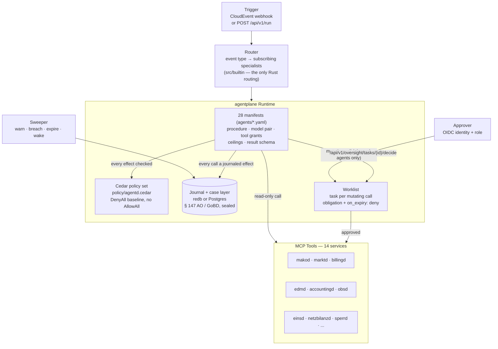
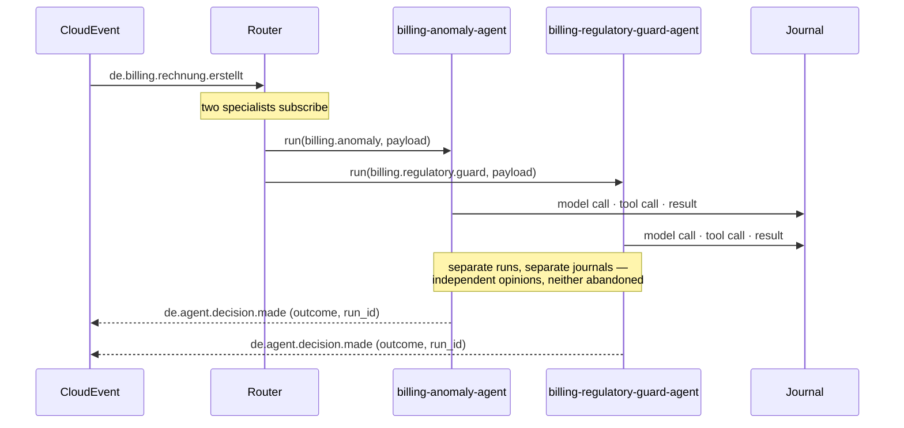
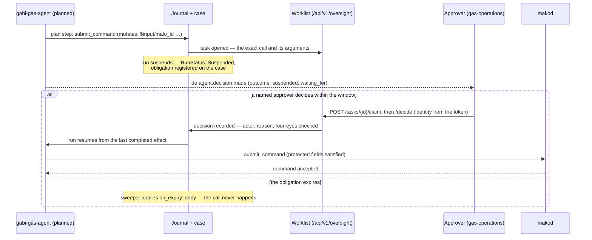

+++
title = "agentd Operator Guide"
description = "agentd operator guide: 28 declarative specialist manifests run on the agentplane durable runtime. Journal-backed runs, a four-eyes worklist for mutating calls, per-MaLo cases as the erasure unit, role-scoped builds."
weight = 37
[extra]
mermaid = true
+++
# `agentd` — Multi-Agent LLM Orchestration

`agentd` is the **AI automation layer** for the mako platform. It connects large
language models to the production services via MCP, enabling automated analysis,
decision support and workflow orchestration.

Every specialist is a **declarative manifest** run by
[agentplane](https://github.com/hupe1980/agentplane), a journal-first durable
agent runtime. Every model call and tool call is a journaled effect, so a run is
resumable after a crash and replayable for audit.

Port: **`:9580`**

| Endpoint | Description |
|---|---|
| `POST /webhook` | Inbound CloudEvent trigger (HMAC-verified) |
| `POST /api/v1/run` | Manual agent invocation (OIDC JWT required) |
| `GET /api/v1/decisions` | Last 100 agent decisions (in-memory ring buffer) |
| `GET /api/v1/agents` | Activated specialists and their subscriptions |
| `GET /api/v1/agents/catalog` | Every specialist compiled into this binary |
| `GET /.well-known/agents/{name}` | A2A Agent Card, derived from the manifest |
| `/api/v1/oversight/*` | The operator surface: worklist, runs, cases, event delivery (OIDC required) |
| `GET /health` · `GET /health/ready` | Liveness / readiness |

---

## Key design decisions

### The manifest is the agent

A specialist is `agents/<name>.yaml`. It declares the procedure, the model, each
tool the agent may call, the ceilings it runs under and the schema its result
must satisfy. The manifest is digest-covered: editing a procedure changes
the digest, which is a version bump a reviewer sees in a diff.

What stays in Rust is the one thing agentplane has no notion of — **which
CloudEvent types reach which specialist**. That subscription table is
`src/builtin/mod.rs`, and it holds nothing else. A second copy of the prompt in
Rust could disagree with the manifest, and the manifest is the copy the model
actually reads.

There are correspondingly **no per-agent config overrides**. Moving a regulated
decision onto a different model is a manifest edit, which is the reviewable path
by design.

### Two properties that matter for a regulated deployment

**Mutating tools require a human.** A tool grant that changes state carries
`requires_approval: true`, bounded by an obligation in `spec.oversight` with an
explicit `on_expiry: deny`. Reaching it suspends the run and opens a task
carrying the exact call — not a description of it — on the worklist of the roles
the manifest names. A command that dispatches a real market message is not
autonomous.

**Authority-bearing arguments are bound to trusted sources.** `protected_fields`
marks arguments like `/malo_id` and `/pid` as `require_trusted`, so a value
derived from counterparty free text cannot reach `submit_command` as a MaLo or a
Prüfidentifikator.

The second property has a consequence that decides how a specialist is built:

> A **`tool-calling`** agent cannot dispatch a mutating call at all. Its
> arguments come out of a model completion, agentplane labels every completion
> `untrusted` by construction, and the taint gate refuses a mutating sink with
> untrusted arguments — even after a human has approved it. A **`planned`**
> agent can, because its step arguments are `$input/…` references the runtime
> resolves itself: they arrive carrying the run input's own labels, having never
> passed through a model's context.

So mako's 27 advisory specialists declare no mutating grant and no `oversight`
block; both absences are the same fact, and `cargo xtask check-tool-grants`
refuses a manifest that claims otherwise. Regaining dispatch for a specialist
means converting it to `planned` — the shape `gabi-gas-agent` already has — not
adding a grant back.

The deterministic boundary is unchanged: an agent may prepare and may wait,
`makod` still dispatches. An approved decision becomes an ordinary command
through the command API, so what goes on the wire is still a pure function of a
recorded command.

### Durability replaces the dead-letter queue

A failed run is not a message with nowhere to go. Its effects are journaled, so
it resumes from the last completed effect rather than being replayed from the
top by a retry loop. The `/api/v1/dlq` endpoint and the retry worker are gone,
and so is `de.agent.session.dlq.exhausted`.

`de.agent.decision.made` now carries the run's real outcome — `completed`,
`failed`, `suspended`, `exhausted`, `quarantined`, `replanning` or `cancelled` —
so a subscriber sees a run waiting on human approval as readily as a successful
one. Beside it: `run_id` (the journal key an operator looks up), `waiting_for`
(*what* a suspended run is waiting for — an approval, a message, an instant, so
an operator knows whether to approve, chase or wait) and `tokens` (what the run
cost, as the journal metered it).

### A2A Protocol compliance

Each specialist exposes an [A2A Agent Card](https://a2a-protocol.org/) at
`/.well-known/agents/{name}` — a standards-based capability declaration that
lets external systems discover mako specialists without prior configuration.

The card is **derived from the manifest** by agentplane rather than assembled by
hand, so it advertises exactly what the declaration says: its skills are the
capabilities the plane would actually dispatch, and its version is the
manifest's. A hand-written card is a second statement of the same facts, and the
two disagree the first time somebody edits one.

### Fan-out

When several specialists subscribe to one event they are independent opinions —
a billing event runs an anomaly check *and* a regulatory guard — so each gets its
own run and its own journal rather than sharing one.

There is deliberately **no first-wins mode**. Returning the first specialist and
dropping the rest cancels the losers at their next `await`, and a cancelled
specialist may already have called a mutating tool: a request that reached the
server while nothing on this side recorded it. That is an unrecoverable unknown
outcome for a regulated action, so every branch runs to completion and every
outcome is on the record. agentplane declines the same primitive for the same
reason.

---

## Role scoping (§ 9 EnWG)

`agentd` builds role-scoped like every other daemon: `role-lf`, `role-nb`, `role-msb`, with
no flags meaning all roles.

This matters more here than elsewhere. `agentd` is the one service that reaches all the
others, so in a combined-role (VIU) deployment it is the component that cannot be separated
by policy alone — a single process holding credentials to both the grid arm and the supply
arm. Cedar can refuse an NB principal access to LF process state, and does, but that is a
runtime control over a process that structurally holds both sets of keys.

A role build therefore **does not contain** the other arm's specialists. An LF binary has no
grid-billing and no Sperrung specialist compiled into it, so no configuration mistake can
enable one. Cross-cutting specialists — protocol, deadlines, compliance, process — are in
every build, because those surfaces exist for every Marktrolle.

| Build | Specialists |
|---|---|
| default (no flags) | all 28 |
| `role-lf` | cross-cutting + 11 supply-side (billing, invoicing, contracts, tariffs, portal, VPP) |
| `role-nb` | cross-cutting + 9 grid-side (NNE billing, Sperrung, EEG, MaBiS, GaBi Gas, Ersatzwerte) |
| `role-msb` | cross-cutting + 3 metering (MSB history, meter data, SMGW diagnostics) |

`just clippy-roles` lints each profile and runs the guard test that asserts the exclusions,
so a specialist added without a role decision fails the gate rather than quietly appearing
in every deployment.

---

## Human oversight

Declaring an approver is not the same as being able to approve. The worklist is
agentplane's own operator surface, mounted at `/api/v1/oversight`:

| Route | The question it answers |
|---|---|
| `GET /tasks` | What is waiting for me? |
| `GET /tasks/{id}` | What is this proposal, and may I decide it? |
| `POST /tasks/{id}/claim` · `/release` | This one is mine — don't duplicate the work |
| `POST /tasks/{id}/decide` | Approve or reject, **as myself** |
| `GET /runs?outcome=…` · `GET /runs/{run}` | What ended this way, and why is this one not finishing? |
| `GET /cases/{case}` | What has happened on this matter, and by when must it end? |
| `POST /runs/{run}/cancel` | Stop it, with a reason on the record |
| `POST /events` | This message arrived; wake whoever wanted it |

Three properties are worth stating because each is a control rather than a
convenience:

- **Who is acting comes from the token, never from the body.** The wire types
  carry no actor field, so an approval cannot be forged by the thing being
  approved. Four-eyes is enforced in the task store: whoever proposed an action
  cannot approve it, and a reviewer barred by that rule still *sees* the task —
  told so on the item rather than by a refusal after they have read the case.
- **No OIDC, no surface.** When OIDC is disabled the routes are not mounted at
  all. Every other dev-mode relaxation in mako accepts an unauthenticated request
  and warns; an approval is the one place where that is a forged signature on a
  regulated dispatch rather than a relaxation.
- **Every route is authorized, not just authenticated.** Each one asks the
  plane's Cedar policy under an `api:` action — reading, claiming and deciding
  are separate verbs, and `POST /events` (the machine door for mako's own
  services) is separate from all of them.

Behind it, the **sweeper** ticks every `sweep_interval_secs`: it warns on
approaching obligations, breaches the ones that passed, expires overdue approvals
under their declared `on_expiry`, wakes runs whose instant arrived, and
dead-letters events nobody correlated. A deadline nobody looks at is not a
deadline.

Deadlines resolve through **mako's own BDEW Werktage calendar**, so
`kind: working-days` means the same thing to an agent's approval window as it
does to an APERAK Frist — same holiday table, same 17:00 Europe/Berlin cut-off,
and the calendar's digest is journaled with the instant it produced, so a later
correction cannot retroactively move a window somebody relied on.

---

## Cases, and erasure (GDPR Art. 17)

Every run is admitted with **correlation keys** taken from the event's
re-validated identifiers — `malo`, `melo`, `process` — so every run about one
Marktlokation joins one case. An event carrying no identifier that re-validates
gets a case of its own, keyed on the CloudEvent id: a run outside a case cannot
register an obligation or open a task, so "no case" is not an option.

The case is therefore three things at once: the **matter** an operator reads, the
**retention** unit, and the **erasure** unit.

Agent runs are sealed. The runtime is built with a key ring, which wraps the journal, case
state, buffered events and task proposals — so a run's payloads are ciphertext at rest, and
erasing a case destroys the wrapping key that opens them. That reaches every copy, including
backups and replicas, which row-level pseudonymisation in a database does not.

Two layers sit in front of it as defence in depth: specialists are handed identifiers rather
than customer records and fetch details through an authorised tool call, and each agent
declares `max_sensitivity_journaled`, so material above the ceiling is refused at dispatch
rather than discovered at an erasure request.

> **Deployment note.** A HashiCorp Vault transit key must be created with deletion allowed.
> A default transit key cannot be deleted, so an erasure against one fails loudly rather
> than reporting a success that did not happen.

> **A plane with no key ring starts, and says so.** The warning names the
> consequence — personal data written into an append-only chain cannot be erased
> by any later configuration change — because an operator who reads it after the
> first production run cannot act on it. `[keyring] required = true` turns the
> warning into a refusal to start.

---

## Where the trust boundary is

A CloudEvent payload is emitted by one of mako's own services, but almost
everything in it originated on the wire: a MaLo came out of a counterparty's
UTILMD, an amount off their INVOIC, a `reference` is free text they wrote. So the
payload is **not admitted as trusted**.

A field is promoted to trusted only if `agentd` **re-validates it at admission**,
against the format that identifier is defined to have — an 11-digit MaLo, a
5-digit Prüfidentifikator, a 33-character MeLo, a UUID mako generated itself.
Not because the emitting service says so, and not because the key looks like an
identifier. Everything else — free text, amounts, nested objects, and any
identifier whose value fails re-validation — is untrusted and carries a source
naming the event it arrived on.

This is what makes `protected_fields` mean something. A grant marking `/malo_id`
as `require_trusted` is satisfied by a re-validated identifier and refused for a
counterparty-authored string. Admitting the payload wholesale would have
satisfied it with either.

Re-validating is also why the promotion is honest rather than convenient: an
11-digit MaLo has no room for an instruction. Collapsing the value space to one
that cannot carry a payload is the whole justification, and it is checked at the
boundary rather than assumed from an emitter's good behaviour.

### Two shapes, and what each buys

| | `tool-calling` (27 specialists) | `planned` (`gabi-gas-agent`) |
|---|---|---|
| Input | the whole payload, per-field labels | only the re-validated identifiers |
| Control flow | the model chooses each next call | fixed before anything untrusted is read |
| Untrusted material | read by the privileged model | read by the **quarantined** model in a `parse` step |
| May dispatch a mutating call | **no** — model-written arguments are untrusted, and the taint gate refuses them | yes — `$input/…` references keep the input's labels |
| Cost | the injection surface is real | cannot react to what it discovers mid-flight |

A `planned` specialist makes one privileged call that reads its trusted input and
emits a plan: which granted tools, in what order, with which arguments. The
runtime executes that plan itself, and step outputs travel between steps **by
reference** rather than back through a model's context — so a hostile tool result
cannot steer the steps that follow it.

`gabi-gas-agent` is converted because its shape is known up front (read the
imbalance, check the deadline, decide) while the ALOCAT and NOMRES values it
reads are counterparty-authored — which is exactly the condition `planned` is
for. Its `parse` step is where a model reads that material, on the quarantined
model, under a declared schema and an extraction-only instruction. The only thing
that step can say out of band is *not enough information*, which fails it rather
than letting a guess stand.

The other 27 declare **no quarantined model**, and that is deliberate. Under
`tool-calling` with no memory formation nothing would ever select it, so
declaring one would read as dual-model isolation while every call went to the
privileged model. agentplane refuses that outright.

---

## Architecture



### One event, one run per subscribing specialist



### Approval on a mutating tool

Only a `planned` specialist reaches this path — `gabi-gas-agent` is the one that
does. The plan's arguments are `$input/…` references, so the MaLo and the PID
arrive with the labels admission gave them rather than as text a model wrote.



---

## Specialists

Each row is a subscription in `src/builtin/mod.rs` paired with a manifest in
`agents/`. The capability is what `Runtime::run` is given; the manifest owns
everything else.

The **shape** column is the execution kind: `planned` where the task shape is
known up front and the material is hostile, `tool-calling` where the shape is the
discovery.

| Specialist | Capability | Shape | Subscribes to |
|---|---|---|---|
| `mako-agent` | `mako` | `tool-calling` | `de.mako.process.failed`, `de.mako.aperak.timeout`, `de.mako.aperak.*` |
| `deadline-alert-agent` | `deadline.alert` | `tool-calling` | `de.mako.process.failed`, `de.mako.aperak.timeout`, `de.obs.deadline.approaching` |
| `billing-agent` | `billing` | `tool-calling` | `de.invoic.receipt.disputed`, `de.accounting.mahnung.issued` |
| `netzbilanz-agent` | `netzbilanz` | `tool-calling` | `de.netzbilanz.invoic.drafted`, `de.netzbilanz.invoic.dispatched`, `de.netzbilanz.invoic.dispatch-overdue` |
| `invoice-reconciliation-agent` | `invoice.reconciliation` | `tool-calling` | `de.invoic.payment.overdue`, `de.invoic.receipt.*` |
| `billing-anomaly-agent` | `billing.anomaly` | `tool-calling` | `de.billing.rechnung.erstellt` |
| `billing-regulatory-guard-agent` | `billing.regulatory.guard` | `tool-calling` | `de.billing.rechnung.erstellt` |
| `jahresabrechnung-agent` | `jahresabrechnung` | `tool-calling` | _manual / scheduled_ |
| `eeg-agent` | `eeg` | `tool-calling` | `de.eeg.anlage.foerderung-auslaufend`, `de.messwert.reading.direct.stored` |
| `eeg-compliance-agent` | `eeg.compliance` | `tool-calling` | `de.eeg.anlage.*`, `de.eeg.verguetung.*`, `de.eeg.marktpraemie.*`, `de.eeg.compliance.*` |
| `payment-reconciliation-agent` | `payment.reconciliation` | `tool-calling` | `de.accounting.payment.due`, `de.accounting.bankruecklast` |
| `compliance-agent` | `compliance` | `tool-calling` | `de.obs.stp.parity.alert` |
| `msb-history-agent` | `msb.history` | `tool-calling` | `de.messwert.reading.quality.warning`, `de.messwert.reading.direct.stored`, `de.mako.process.completed` |
| `meter-data-agent` | `meter.data` | `tool-calling` | `de.messwert.reading.quality.warning`, `de.mako.process.completed` |
| `grid-anomaly-agent` | `grid.anomaly` | `tool-calling` | `de.markt.nb-contract.updated`, `de.markt.malo.updated` |
| `tariff-optimization-agent` | `tariff.optimization` | `tool-calling` | `de.billing.rechnung.erstellt`, `de.mako.process.completed` |
| `vertragd-agent` | `vertragd` | `tool-calling` | `de.vertrag.*`, `de.mako.aperak.rejected`, `de.mako.process.failed`, `de.vertrag.ablauf.ankuendigung`, `de.vertrag.preisaenderung.ankuendigung` |
| `tarifbd-agent` | `tarifbd` | `tool-calling` | `de.tarif.product.updated`, `de.tarif.angebot.abgelaufen`, `de.tarif.epex.missing` |
| `processd-agent` | `processd` | `tool-calling` | `de.mako.process.initiated`, `de.mako.aperak.rejected`, `de.mako.process.failed` |
| `sperrd-agent` | `sperrd` | `tool-calling` | `de.accounting.sperrauftrag`, `de.sperr.*`, `de.mako.process.completed` |
| `portald-agent` | `portald` | `tool-calling` | `de.billing.rechnung.erstellt`, `de.eeg.anlage.foerderung-auslaufend`, `de.accounting.mahnung.issued`, `de.vertrag.*` |
| `regulatory-reporting-agent` | `regulatory.reporting` | `tool-calling` | _manual / scheduled_ |
| `replacement-value-agent` | `replacement.value` | `tool-calling` | `de.messwert.reading.quality.warning`, `de.mako.process.completed` |
| `mabis-syncd-agent` | `mabis.syncd` | `tool-calling` | `de.messwert.reading.quality.warning` |
| `smgw-diagnostics-agent` | `smgw.diagnostics` | `tool-calling` | `de.messwert.cls.compliance-issue`, `de.messwert.smgw.cert.expiry-warning`, `de.messwert.reading.quality.warning`, `de.messwert.reading.direct.stored`, `de.mako.process.initiated`, `de.markt.geraet.konfiguration.updated` |
| `vpp-billing-agent` | `vpp.billing` | `tool-calling` | `de.vpp.dispatch.confirmed`, `de.vpp.settlement.berechnet` |
| `gabi-gas-agent` | `gabi.gas.balancing` | `planned` | `de.gabi.imbalance.*`, `de.gabi.alocat.missing`, `de.gabi.nomination.*`, `de.netzbilanz.invoic.drafted` |
| `einsd-batch-agent` | `einsd.batch` | `tool-calling` | `de.eeg.settlement.batch-due`, `de.eeg.compliance.*`, `de.eeg.anlage.foerderung-auslaufend` |

Activate them with `[bundled_agents]`. A role-scoped build contains only its own
role's specialists, so `enable_all` never activates another Marktrolle's agents.

---

## Model providers

`agentplane` ships the drivers; `[providers.<name>]` supplies the credentials.
The key must match the `provider` a manifest's `spec.models` names.

| Provider | `backend` | Notes |
|---|---|---|
| Anthropic | `anthropic` | Claude — the default in every shipped manifest |
| OpenAI | `openai` | `api_base` overrides the endpoint (Azure, a gateway, a recording proxy) |
| Google Gemini | `gemini` | |
| Self-hosted | `chat-completions` | The OpenAI-compatible wire: TGI, vLLM, Ollama, llama.cpp. `api_base` is **required** — there is no default for your own server — and a local endpoint may have no key at all |
| AWS Bedrock | `bedrock` | Behind `--features bedrock`: the AWS SDK is a substantial dependency tree, so a deployment that does not use it does not pay for it. Credentials come from the standard AWS chain, never from `agentd.toml` |

The **table key** is the name a manifest refers to; `backend` is the wire that
driver speaks. They are separate on purpose: `[providers.anthropic]` backed by
`chat-completions` against your own vLLM changes not one of the 28 manifests —
which matters, because a manifest edit is a digest change and a review.

That is also the answer to a data-protection question. Customer data reaching a
third-party inference endpoint is an Art. 28 / Art. 44 DSGVO matter; *the
endpoint is ours* answers it without a contract.

`agentd` refuses to start with no provider configured — an agent layer that
cannot reach a model is a silent no-op, not a degraded mode. It also refuses an
unknown `backend`, a hosted driver with no key, and `chat-completions` with no
`api_base`: each of those otherwise presents as every run failing identically at
its first model call.

---

## Security

| Concern | Implementation |
|---|---|
| **`POST /api/v1/run` auth** | OIDC/JWT via `Claims` extractor; dev mode emits `[WARN]` |
| **Oversight surface auth** | OIDC only — no dev mode. Not mounted when OIDC is disabled |
| **Oversight authorization** | Cedar `api:*` verbs; reading, claiming and deciding are separate, and `POST /events` is the machine door |
| **Effect authorization** | Cedar on every effect: server allowlist, secret-to-model refusal, delegation depth, no declassification. `DenyAll` baseline — there is no `AllowAll` |
| **Inbound webhook HMAC** | `X-Mako-Signature: sha256=...` verified when `inbound_hmac_secret` is set; constant-time compare; 403 on mismatch |
| **Mutating tools** | `requires_approval` + `spec.oversight` obligation, `on_expiry: deny`, four-eyes in the task store |
| **Admission** | payload fields are re-validated at the boundary; only identifiers that pass are trusted |
| **Authority-bearing arguments** | `protected_fields` with `require_trusted` — counterparty-derived values are refused |
| **Tool transport** | one MCP client per server, routed by the server component of a `tool://` grant, so a call cannot reach a different server offering the same tool name |
| **Personal data at rest** | Key ring seals journal, cases, events and task proposals; erasure destroys the case's wrapping key |
| **Egress ceiling** | `max_sensitivity_egress` and `max_sensitivity_journaled` per agent |
| **Max concurrent sessions** | `max_sessions` semaphore; 429 when exhausted |
| **Fan-out timeout** | `session_timeout_secs` bounds one event's whole fan-out; each run stays journaled and resumable |
| **API keys** | `api_key`, `mcp_api_key`, `keyring.vault.token`, `audit_hmac_secret` are `SecretString` — never in logs or debug output. Bedrock credentials come from the AWS chain, not from config |
| **Route syntax** | `cargo xtask check-routes` refuses axum 0.7 `/:param` literals, which panic while the router is assembled — i.e. at startup, where no test looks |
| **Grant truth** | `cargo xtask check-tool-grants` checks every `tool://` grant against the server's own `read_only_hint`, and refuses a mutating grant on a `tool-calling` agent |

---

## Configuration

```toml
# agentd.toml
tenant          = "9900357000004"
public_base_url = "https://agentd.internal:9580"   # what an A2A card advertises
# `tenant` scopes every store key and the erasure keys with them, so one
# operator's cryptographic erasure cannot reach another's bytes.

# ── Durable state ─────────────────────────────────────────────────────────────
# One backend holds the journal, the cases, the tasks, the timers and the
# events. § 147 AO record — durable storage, not a container filesystem.
[journal]
backend = "redb"                        # a single instance
path    = "/var/lib/agentd/journal.redb"
# backend = "postgres"                  # several instances sharing one store,
# url     = "env:AGENTD_JOURNAL_URL"    # where Postgres arbitrates the fencing

# ── Model providers ───────────────────────────────────────────────────────────
# The key is the name a manifest's `spec.models` refers to; `backend` is the
# wire it speaks.
[providers.anthropic]
backend = "anthropic"
api_key = "env:ANTHROPIC_API_KEY"

# [providers.local]
# backend  = "chat-completions"
# api_base = "http://vllm:8000/v1"      # required — no default for your server

# ── Which specialists this deployment runs ────────────────────────────────────
[bundled_agents]
enable_all = true
# enable = ["mako-agent", "billing-anomaly-agent"]   # or name them

# There are no per-agent overrides. Prompts, models, tool grants and ceilings
# are declared in agents/<name>.yaml, where the digest covers them.

# Every server a manifest grants a tool on must appear here. One that is missing
# is a startup failure, not a specialist that fails at its first tool call.
[mcp_servers]
makod    = "http://makod:8080/mcp"
marktd   = "http://marktd:8180/mcp"
billingd = "http://billingd:9280/mcp"
edmd     = "http://edmd:8380/mcp"
obsd     = "http://obsd:8480/mcp"
# ... every MCP-exposing service
mcp_api_key = "env:AGENTD_MCP_API_KEY"

trigger_event_types = [
  "de.mako.process.failed",
  "de.billing.rechnung.erstellt",
  "de.eeg.*",
  "de.invoic.receipt.disputed",
]

# ── Security ──────────────────────────────────────────────────────────────────
inbound_hmac_secret  = "env:AGENTD_INBOUND_HMAC_SECRET"
max_sessions         = 20
session_timeout_secs = 300   # bounds one event's whole fan-out
sweep_interval_secs  = 60    # warns, breaches, expires, wakes

# Required for the oversight surface. Without it the worklist is not mounted,
# and every approval a manifest declares would wait for somebody who cannot act.
[oidc]
issuer   = "https://keycloak:8080/realms/mako"
audience = "agentd"

# Envelope encryption. The wrapping key is created inside Vault and never
# leaves it, so erasure is something mako asks for and cannot undo. Omit and
# the plane starts unsealed, with a warning that names the consequence.
[keyring]
required = true
[keyring.vault]
address = "https://vault.internal:8200"
mount   = "transit"
token   = "env:VAULT_TOKEN"

# Cedar rules. Omit to use mako's own, embedded from policy/agentd.cedar.
# A file here *replaces* them: Cedar allows on any matching permit, so a
# least-privilege file cannot narrow one it inherited.
[policy]
# path = "/etc/agentd/policy.cedar"
```

A name in `enable` that matches no compiled specialist is a **startup failure**,
not an inactive agent. In a role-scoped build the usual cause is a name that
exists only in another Marktrolle's binary.

---

## Triggering an agent run

**Via CloudEvent webhook:**

```bash
curl -X POST http://agentd:9580/webhook \
  -H "Content-Type: application/cloudevents+json" \
  -d '{
    "specversion": "1.0",
    "type": "de.billing.rechnung.erstellt",
    "source": "urn:mako:billingd:tenant:9900357000004",
    "id": "123e4567-e89b-12d3-a456-426614174000",
    "data": { "malo_id": "51238696780", "record_id": "..." }
  }'
```

**Manual run** — `agent` addresses one specialist directly, bypassing routing:

```bash
curl -X POST http://agentd:9580/api/v1/run \
  -H "Content-Type: application/json" \
  -d '{
    "agent": "billing-anomaly-agent",
    "event_type": "manual.billing.dispute-analysis",
    "input": { "malo_id": "51238696780", "note": "Invoice R2026-001 disputed" }
  }'
```

The payload is labelled the same way a webhook's is: `malo_id` re-validates and
is admitted trusted, `note` is free text and is not.

**Answering an approval** — what an operator's console does:

```bash
# What is waiting for me?
curl -H "Authorization: Bearer $JWT" \
  http://agentd:9580/api/v1/oversight/tasks

# Reserve it, then decide. No actor field: it comes from the token.
curl -X POST -H "Authorization: Bearer $JWT" \
  http://agentd:9580/api/v1/oversight/tasks/$TASK/claim
curl -X POST -H "Authorization: Bearer $JWT" -H "Content-Type: application/json" \
  -d '{"approved": true, "reason": "correction due today", "amendment": null}' \
  http://agentd:9580/api/v1/oversight/tasks/$TASK/decide
```

---

## CloudEvents emitted

| Event type | When |
|---|---|
| `de.agent.decision.made` | A run reaches a terminal state. Carries `outcome`, the summary, `run_id` (the journal key), `waiting_for` (present only when suspended) and `tokens`. |

`outcome` is one of `completed`, `failed`, `suspended`, `exhausted`,
`quarantined`, `replanning`, `cancelled` or `not-admitted` — the last meaning the
plane declined to start the run, which for a `planned` specialist means the event
carried no identifier that re-validated. A **suspended** run is not a failure:
it is waiting for a human decision or an inbound event.

---

## Audit webhook

Every decision is pushed to the ring buffer and, when configured, POSTed to an
external sink:

```toml
audit_webhook_url = "https://erp.example/hooks/agent-decisions"
audit_hmac_secret = "env:AGENTD_AUDIT_HMAC"  # X-Mako-Signature (HMAC-SHA256)
```
