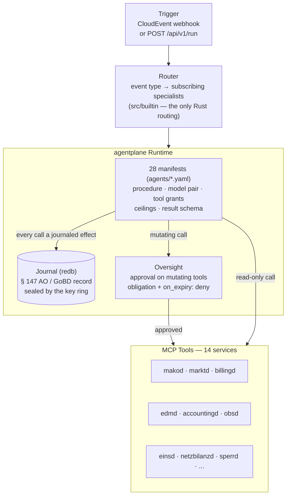
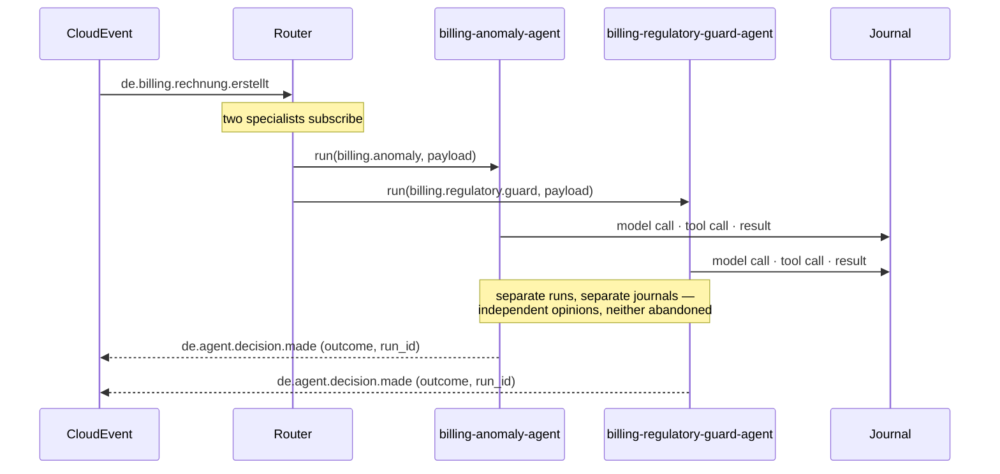
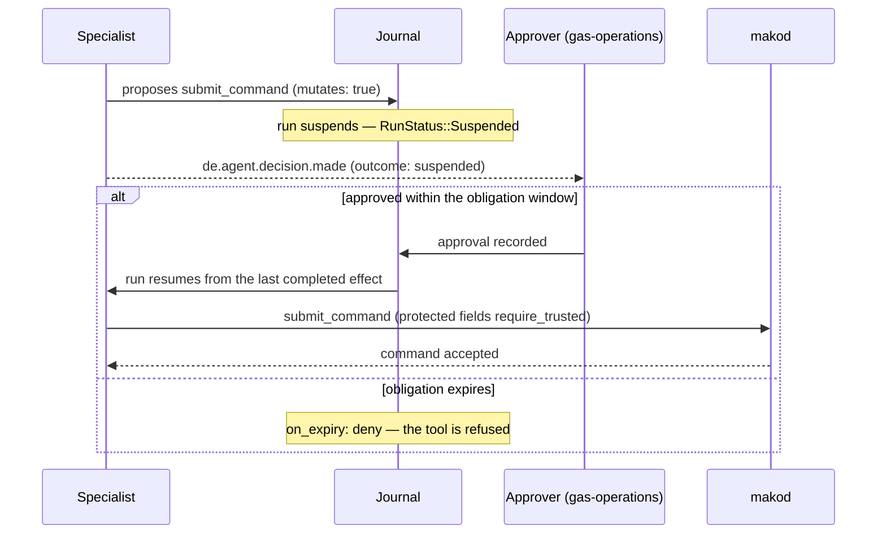

+++
title = "agentd Operator Guide"
description = "agentd operator guide: 28 declarative specialist manifests run on the agentplane durable runtime. Journal-backed runs, human approval on mutating tools, sealed personal data, role-scoped builds."
weight = 37
[extra]
mermaid = true
+++
# `agentd` — Multi-Agent LLM Orchestration

`agentd` is the **AI automation layer** for the mako platform. It connects large
language models to the production services via MCP, enabling automated analysis,
decision support and workflow orchestration.

Every specialist is a **declarative manifest** run by
[agentplane](https://github.com/hupe1980/agentplane), a journal-first durable
agent runtime. Every model call and tool call is a journaled effect, so a run is
resumable after a crash and replayable for audit.

Port: **`:9580`**

| Endpoint | Description |
|---|---|
| `POST /webhook` | Inbound CloudEvent trigger (HMAC-verified) |
| `POST /api/v1/run` | Manual agent invocation (OIDC JWT required) |
| `GET /api/v1/sessions` | Last 100 agent decisions (in-memory ring buffer) |
| `GET /api/v1/agents` | Activated specialists and their subscriptions |
| `GET /api/v1/agents/catalog` | Every specialist compiled into this binary |
| `GET /.well-known/agents/{name}` | A2A Agent Card for a specialist |
| `GET /health` · `GET /health/ready` | Liveness / readiness |

---

## Key design decisions

### The manifest is the agent

A specialist is `agents/<name>.yaml`. It declares the procedure, the model pair,
each tool the agent may call, the ceilings it runs under and the schema its
result must satisfy. The manifest is digest-covered: editing a procedure changes
the digest, which is a version bump a reviewer sees in a diff.

What stays in Rust is the one thing agentplane has no notion of — **which
CloudEvent types reach which specialist**. That subscription table is
`src/builtin/mod.rs`, and it holds nothing else. A second copy of the prompt in
Rust could disagree with the manifest, and the manifest is the copy the model
actually reads.

There are correspondingly **no per-agent config overrides**. Moving a regulated
decision onto a different model is a manifest edit, which is the reviewable path
by design.

### Two properties that matter for a regulated deployment

**Mutating tools require a human.** Every tool grant that changes state carries
`requires_approval: true`, bounded by an obligation in `spec.oversight` with an
explicit `on_expiry: deny`. A command that dispatches a real market message is
not autonomous.

**Authority-bearing arguments are bound to trusted sources.** `protected_fields`
marks arguments like `/malo_id` and `/pid` as `require_trusted`, so a value
derived from counterparty free text cannot reach `submit_command` as a MaLo or a
Prüfidentifikator.

The deterministic boundary is unchanged: an agent may prepare and may wait,
`makod` still dispatches. An approved decision becomes an ordinary command
through the command API, so what goes on the wire is still a pure function of a
recorded command.

### Durability replaces the dead-letter queue

A failed run is not a message with nowhere to go. Its effects are journaled, so
it resumes from the last completed effect rather than being replayed from the
top by a retry loop. The `/api/v1/dlq` endpoint and the retry worker are gone,
and so is `de.agent.session.dlq.exhausted`.

`de.agent.decision.made` now carries the run's real outcome — `completed`,
`failed`, `suspended`, `exhausted`, `quarantined`, `replanning` or `cancelled` —
so a subscriber sees a run waiting on human approval as readily as a successful
one. Its `session_id` is the journal run id, which an operator can look up.

### A2A Protocol compliance

Each specialist exposes an [A2A Agent Card](https://a2a-protocol.org/) at
`/.well-known/agents/{name}` — a standards-based capability declaration that
lets external systems discover mako specialists without prior configuration.

### Fan-out

When several specialists subscribe to one event they are independent opinions —
a billing event runs an anomaly check *and* a regulatory guard — so each gets its
own run and its own journal rather than sharing one.

There is deliberately **no first-wins mode**. Returning the first specialist and
dropping the rest cancels the losers at their next `await`, and a cancelled
specialist may already have called a mutating tool: a request that reached the
server while nothing on this side recorded it. That is an unrecoverable unknown
outcome for a regulated action, so every branch runs to completion and every
outcome is on the record. agentplane declines the same primitive for the same
reason.

---

## Role scoping (§ 9 EnWG)

`agentd` builds role-scoped like every other daemon: `role-lf`, `role-nb`, `role-msb`, with
no flags meaning all roles.

This matters more here than elsewhere. `agentd` is the one service that reaches all the
others, so in a combined-role (VIU) deployment it is the component that cannot be separated
by policy alone — a single process holding credentials to both the grid arm and the supply
arm. Cedar can refuse an NB principal access to LF process state, and does, but that is a
runtime control over a process that structurally holds both sets of keys.

A role build therefore **does not contain** the other arm's specialists. An LF binary has no
grid-billing and no Sperrung specialist compiled into it, so no configuration mistake can
enable one. Cross-cutting specialists — protocol, deadlines, compliance, process — are in
every build, because those surfaces exist for every Marktrolle.

| Build | Specialists |
|---|---|
| default (no flags) | all 28 |
| `role-lf` | cross-cutting + 11 supply-side (billing, invoicing, contracts, tariffs, portal, VPP) |
| `role-nb` | cross-cutting + 9 grid-side (NNE billing, Sperrung, EEG, MaBiS, GaBi Gas, Ersatzwerte) |
| `role-msb` | cross-cutting + 3 metering (MSB history, meter data, SMGW diagnostics) |

`just clippy-roles` lints each profile and runs the guard test that asserts the exclusions,
so a specialist added without a role decision fails the gate rather than quietly appearing
in every deployment.

---

## Erasure (GDPR Art. 17)

Agent runs are sealed. The runtime is built with a key ring, which wraps the journal, case
state, buffered events and task proposals — so a run's payloads are ciphertext at rest, and
erasing a case destroys the wrapping key that opens them. That reaches every copy, including
backups and replicas, which row-level pseudonymisation in a database does not.

The erasure unit is the **case**, because that is already the retention unit.

Two layers sit in front of it as defence in depth: specialists are handed identifiers rather
than customer records and fetch details through an authorised tool call, and each agent
declares `max_sensitivity_journaled`, so material above the ceiling is refused at dispatch
rather than discovered at an erasure request.

> **Deployment note.** A HashiCorp Vault transit key must be created with deletion allowed.
> A default transit key cannot be deleted, so an erasure against one fails loudly rather
> than reporting a success that did not happen.

---

## Prompt channel discipline

The CloudEvent payload derives from inbound counterparty EDIFACT, so it is
untrusted. **It never enters the system message.** The system message carries the
agent's own procedure — read from the manifest, never from a Rust copy — and the
event arrives as separate labelled content.

agentplane enforces this beyond convention. Untrusted input is `Tainted<T>`
carrying a `Label` whose trust degrades and sensitivity escalates on every join,
and a specialist declares two models: a **privileged** model that may call tools,
and a **quarantined** model that reads counterparty text and cannot. A value that
came from the wire cannot silently acquire the authority to act.

---

## Architecture



### One event, one run per subscribing specialist



### Approval on a mutating tool



---

## Specialists

Each row is a subscription in `src/builtin/mod.rs` paired with a manifest in
`agents/`. The capability is what `Runtime::run` is given; the manifest owns
everything else.

| Specialist | Capability | Subscribes to |
|---|---|---|
| `mako-agent` | `mako` | `de.mako.process.failed`, `de.mako.aperak.timeout`, `de.mako.aperak.*` |
| `deadline-alert-agent` | `deadline.alert` | `de.mako.process.failed`, `de.mako.aperak.timeout`, `de.obs.deadline.approaching` |
| `billing-agent` | `billing` | `de.invoic.receipt.disputed`, `de.accounting.mahnung.issued` |
| `netzbilanz-agent` | `netzbilanz` | `de.netzbilanz.invoic.drafted`, `de.netzbilanz.invoic.dispatched`, `de.netzbilanz.invoic.dispatch-overdue` |
| `invoice-reconciliation-agent` | `invoice.reconciliation` | `de.invoic.payment.overdue`, `de.invoic.receipt.*` |
| `billing-anomaly-agent` | `billing.anomaly` | `de.billing.rechnung.erstellt` |
| `billing-regulatory-guard-agent` | `billing.regulatory.guard` | `de.billing.rechnung.erstellt` |
| `jahresabrechnung-agent` | `jahresabrechnung` | _manual / scheduled_ |
| `eeg-agent` | `eeg` | `de.eeg.anlage.foerderung-auslaufend`, `de.messwert.reading.direct.stored` |
| `eeg-compliance-agent` | `eeg.compliance` | `de.eeg.anlage.*`, `de.eeg.verguetung.*`, `de.eeg.marktpraemie.*`, `de.eeg.compliance.*` |
| `payment-reconciliation-agent` | `payment.reconciliation` | `de.accounting.payment.due`, `de.accounting.bankruecklast` |
| `compliance-agent` | `compliance` | `de.obs.stp.parity.alert` |
| `msb-history-agent` | `msb.history` | `de.messwert.reading.quality.warning`, `de.messwert.reading.direct.stored`, `de.mako.process.completed` |
| `meter-data-agent` | `meter.data` | `de.messwert.reading.quality.warning`, `de.mako.process.completed` |
| `grid-anomaly-agent` | `grid.anomaly` | `de.markt.nb-contract.updated`, `de.markt.malo.updated` |
| `tariff-optimization-agent` | `tariff.optimization` | `de.billing.rechnung.erstellt`, `de.mako.process.completed` |
| `vertragd-agent` | `vertragd` | `de.vertrag.*`, `de.mako.aperak.rejected`, `de.mako.process.failed`, `de.vertrag.ablauf.ankuendigung`, `de.vertrag.preisaenderung.ankuendigung` |
| `tarifbd-agent` | `tarifbd` | `de.tarif.product.updated`, `de.tarif.angebot.abgelaufen`, `de.tarif.epex.missing` |
| `processd-agent` | `processd` | `de.mako.process.initiated`, `de.mako.aperak.rejected`, `de.mako.process.failed` |
| `sperrd-agent` | `sperrd` | `de.accounting.sperrauftrag`, `de.sperr.*`, `de.mako.process.completed` |
| `portald-agent` | `portald` | `de.billing.rechnung.erstellt`, `de.eeg.anlage.foerderung-auslaufend`, `de.accounting.mahnung.issued`, `de.vertrag.*` |
| `regulatory-reporting-agent` | `regulatory.reporting` | _manual / scheduled_ |
| `replacement-value-agent` | `replacement.value` | `de.messwert.reading.quality.warning`, `de.mako.process.completed` |
| `mabis-syncd-agent` | `mabis.syncd` | `de.messwert.reading.quality.warning` |
| `smgw-diagnostics-agent` | `smgw.diagnostics` | `de.messwert.cls.compliance-issue`, `de.messwert.smgw.cert.expiry-warning`, `de.messwert.reading.quality.warning`, `de.messwert.reading.direct.stored`, `de.mako.process.initiated`, `de.markt.geraet.konfiguration.updated` |
| `vpp-billing-agent` | `vpp.billing` | `de.vpp.dispatch.confirmed`, `de.vpp.settlement.berechnet` |
| `gabi-gas-agent` | `gabi.gas.balancing` | `de.gabi.imbalance.*`, `de.gabi.alocat.missing`, `de.gabi.nomination.*`, `de.netzbilanz.invoic.drafted` |
| `einsd-batch-agent` | `einsd.batch` | `de.eeg.settlement.batch-due`, `de.eeg.compliance.*`, `de.eeg.anlage.foerderung-auslaufend` |

Activate them with `[bundled_agents]`. A role-scoped build contains only its own
role's specialists, so `enable_all` never activates another Marktrolle's agents.

---

## Model providers

`agentplane` ships the drivers; `[providers.<name>]` supplies the credentials.
The key must match the `provider` a manifest's `spec.models` names.

| Provider | `backend` | Notes |
|---|---|---|
| Anthropic | `anthropic` | Claude — the default in every shipped manifest |
| OpenAI | `openai` | Also covers OpenAI-compatible wire APIs (Azure OpenAI, Ollama, LM Studio) via `api_base` |
| AWS Bedrock | `bedrock` | SigV4-signed requests |

`agentd` refuses to start with no provider configured — an agent layer that
cannot reach a model is a silent no-op, not a degraded mode.

---

## Security

| Concern | Implementation |
|---|---|
| **`POST /api/v1/run` auth** | OIDC/JWT via `Claims` extractor; dev mode emits `[WARN]` |
| **Inbound webhook HMAC** | `X-Mako-Signature: sha256=...` verified when `inbound_hmac_secret` is set; constant-time compare; 403 on mismatch |
| **Mutating tools** | `requires_approval` + `spec.oversight` obligation, `on_expiry: deny` |
| **Authority-bearing arguments** | `protected_fields` with `require_trusted` — counterparty-derived values are refused |
| **Personal data at rest** | Key ring seals journal, cases, events and task proposals; erasure destroys the case's wrapping key |
| **Egress ceiling** | `max_sensitivity_egress` and `max_sensitivity_journaled` per agent |
| **Max concurrent sessions** | `max_sessions` semaphore; 429 when exhausted |
| **Fan-out timeout** | `session_timeout_secs` bounds one event's whole fan-out; each run stays journaled and resumable |
| **API keys** | `api_key`, `mcp_api_key`, `aws_secret_access_key`, `audit_hmac_secret` are `SecretString` — never in logs or debug output |

---

## Configuration

```toml
# agentd.toml
tenant       = "9900357000004"
journal_path = "/var/lib/agentd/journal.redb"   # § 147 AO record — durable storage

# ── Model providers ───────────────────────────────────────────────────────────
# The key is the name a manifest's `spec.models` refers to.
[providers.anthropic]
backend = "anthropic"
api_key = "env:ANTHROPIC_API_KEY"

# ── Which specialists this deployment runs ────────────────────────────────────
[bundled_agents]
enable_all = true
# enable = ["mako-agent", "billing-anomaly-agent"]   # or name them

# There are no per-agent overrides. Prompts, models, tool grants and ceilings
# are declared in agents/<name>.yaml, where the digest covers them.

[mcp_servers]
makod    = "http://makod:8080/mcp"
marktd   = "http://marktd:8180/mcp"
billingd = "http://billingd:9280/mcp"
edmd     = "http://edmd:8380/mcp"
obsd     = "http://obsd:8480/mcp"
# ... every MCP-exposing service
mcp_api_key = "env:AGENTD_MCP_API_KEY"

trigger_event_types = [
  "de.mako.process.failed",
  "de.billing.rechnung.erstellt",
  "de.eeg.*",
  "de.invoic.receipt.disputed",
]

# ── Security ──────────────────────────────────────────────────────────────────
inbound_hmac_secret  = "env:AGENTD_INBOUND_HMAC_SECRET"
max_sessions         = 20
session_timeout_secs = 300

[oidc]
issuer   = "https://keycloak:8080/realms/mako"
audience = "agentd"
```

A name in `enable` that matches no compiled specialist is a **startup failure**,
not an inactive agent. In a role-scoped build the usual cause is a name that
exists only in another Marktrolle's binary.

---

## Triggering an agent run

**Via CloudEvent webhook:**

```bash
curl -X POST http://agentd:9580/webhook \
  -H "Content-Type: application/cloudevents+json" \
  -d '{
    "specversion": "1.0",
    "type": "de.billing.rechnung.erstellt",
    "source": "urn:mako:billingd:tenant:9900357000004",
    "id": "123e4567-e89b-12d3-a456-426614174000",
    "input": { "malo_id": "51238696780", "record_id": "..." }
  }'
```

**Manual run** — `agent` addresses one specialist directly, bypassing routing:

```bash
curl -X POST http://agentd:9580/api/v1/run \
  -H "Content-Type: application/json" \
  -d '{
    "agent": "billing-anomaly-agent",
    "event_type": "manual.billing.dispute-analysis",
    "input": { "malo_id": "51238696780", "context": "Invoice R2026-001 disputed" }
  }'
```

---

## CloudEvents emitted

| Event type | When |
|---|---|
| `de.agent.decision.made` | A run reaches a terminal state. Carries `outcome`, the summary and `session_id` — the journal run id. |

`outcome` is one of `completed`, `failed`, `suspended`, `exhausted`,
`quarantined`, `replanning` or `cancelled`. A **suspended** run is not a failure:
it is waiting for a human decision or an inbound event.

---

## Audit webhook

Every decision is pushed to the ring buffer and, when configured, POSTed to an
external sink:

```toml
audit_webhook_url = "https://erp.example/hooks/agent-decisions"
audit_hmac_secret = "env:AGENTD_AUDIT_HMAC"  # X-Mako-Signature (HMAC-SHA256)
```
