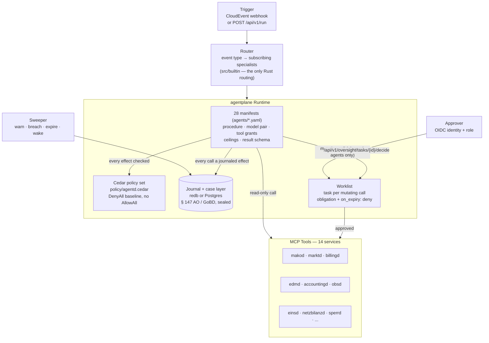
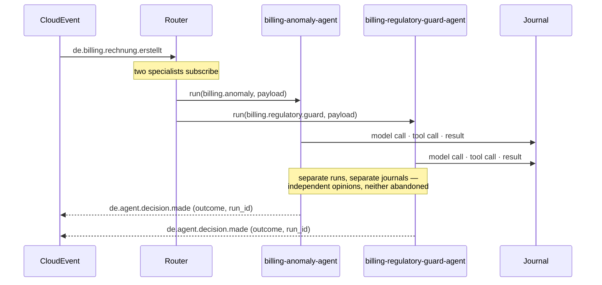
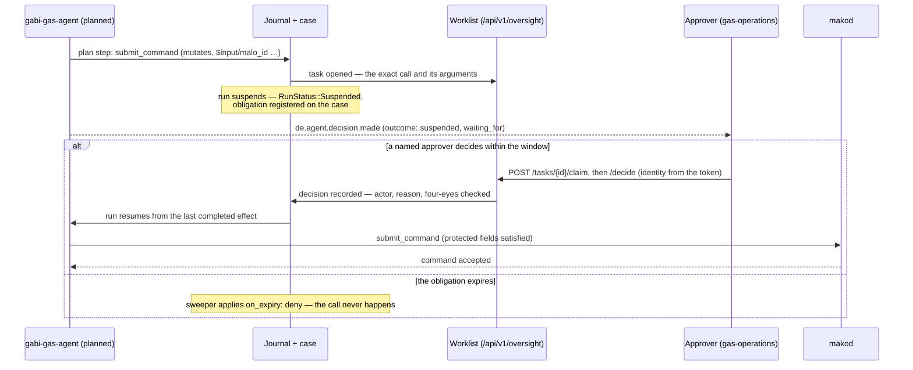
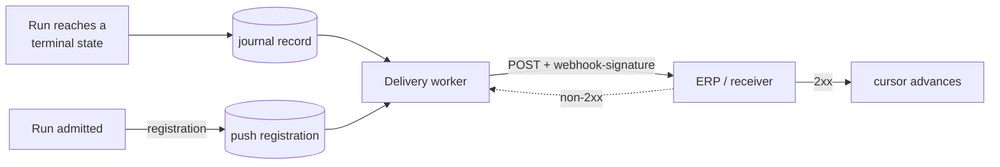

+++
title = "agentd Operator Guide"
description = "agentd operator guide: 28 specialist manifests on the agentplane durable runtime — 26 tool-calling, one planned, one model-free coded skill. Typed result schemas on all 28, MCP prompts granted as knowledge, memory bound per Marktlokation (operator-wide only where argued), journal-backed runs, a four-eyes worklist for mutating calls, per-MaLo cases as the erasure unit, role-scoped builds."
weight = 38
[extra]
mermaid = true
+++
# `agentd` — Multi-Agent LLM Orchestration

`agentd` is the **AI automation layer** for the mako platform. It connects large
language models to the production services via MCP, enabling automated analysis,
decision support and workflow orchestration.

Every specialist is a **declarative manifest** run by
[agentplane](https://github.com/hupe1980/agentplane), a journal-first durable
agent runtime. Every model call and tool call is a journaled effect, so a run is
resumable after a crash and replayable for audit.

Port: **`:9580`**

| Endpoint | Description |
|---|---|
| `POST /webhook` | Inbound CloudEvent trigger (Standard Webhooks-verified). Admits durably, then answers `202` with the run ids |
| `POST /api/v1/run` | Manual agent invocation (OIDC JWT required; honours `Idempotency-Key`). Waits for the answer |
| `GET /api/v1/agents` | Activated specialists and their subscriptions. **OIDC** — in a combined-role deployment the activated set is § 9 EnWG-relevant |
| `GET /api/v1/agents/catalog` | Every specialist compiled into this binary. **OIDC** |
| `GET /.well-known/agents/{name}` | A2A Agent Card, derived from the manifest |
| `/api/v1/oversight/*` | The operator surface: worklist, runs, cases, breached obligations, event delivery (OIDC required) |
| `GET /health` · `GET /health/ready` | Liveness / readiness |

---

## Key design decisions

### The manifest is the agent

A specialist is `agents/<name>.yaml`. It declares the procedure, the model, each
tool the agent may call, the ceilings it runs under and the schema its result
must satisfy. The manifest is digest-covered: editing a procedure changes
the digest, which is a version bump a reviewer sees in a diff.

What stays in Rust is the one thing agentplane has no notion of — **which
CloudEvent types reach which specialist**. That subscription table is
`src/builtin/mod.rs`, and it holds nothing else. A second copy of the prompt in
Rust could disagree with the manifest, and the manifest is the copy the model
actually reads.

There are correspondingly **no per-agent config overrides**. Moving a regulated
decision onto a different model is a manifest edit, which is the reviewable path
by design.

### Two properties that matter for a regulated deployment

**Mutating tools require a human.** A tool grant that changes state carries
`requires_approval: true`, bounded by an obligation in `spec.oversight` with an
explicit `on_expiry: deny`. Reaching it suspends the run and opens a task
carrying the exact call — not a description of it — on the worklist of the roles
the manifest names. A command that dispatches a real market message is not
autonomous.

**Authority-bearing arguments are bound to trusted sources.** `protected_fields`
marks arguments like `/malo_id` and `/pid` as `require_trusted`, so a value
derived from counterparty free text cannot reach `submit_command` as a MaLo or a
Prüfidentifikator.

The second property has a consequence that decides how a specialist is built:

> A **`tool-calling`** agent cannot dispatch a mutating call at all. Its
> arguments come out of a model completion, agentplane labels every completion
> `untrusted` by construction, and the taint gate refuses a mutating sink with
> untrusted arguments — even after a human has approved it. A **`planned`**
> agent can, because its step arguments are `$input/…` references the runtime
> resolves itself: they arrive carrying the run input's own labels, having never
> passed through a model's context.

So mako's 26 advisory specialists declare no mutating grant and no `oversight`
block; both absences are the same fact, and `cargo xtask check-tool-grants`
refuses a manifest that claims otherwise. Regaining dispatch for a specialist
means converting it to `planned` — the shape `gabi-gas-agent` already has — not
adding a grant back.

The deterministic boundary is unchanged: an agent may prepare and may wait,
`makod` still dispatches. An approved decision becomes an ordinary command
through the command API, so what goes on the wire is still a pure function of a
recorded command.

### What the record is worth to somebody who is not us

The journal is hash-chained, so a rewritten record is detectable and a removed
run breaks the Merkle root. That is a real property and it is not the whole
claim, because each mechanism answers a different question and only the last one
involves anybody but the operator.

| Mechanism | Answers | Configured by |
|---|---|---|
| Hash chain + Merkle root | Was *this* history edited? | always on |
| Per-record attestation | Which workload wrote each record? | `[attestation]` |
| Checkpoint cosignature | Does a *second* history exist? | `[witness]` |

Only the third breaks the symmetry. The first two are checks whose every input
comes from the party being checked: two divergent histories can both be
internally perfect, and whoever controls the store controls the evidence. A
witness remembers the last checkpoint it saw for this log and cosigns a new one
only when it **provably extends** it, so a split view stops being invisible and
becomes either a witness that refuses or two cosignatures that contradict each
other and can be shown to anyone.

`plane::attest` supplies attestation on both seams from one key — the **store**
signs records, the runtime signs outward claims — so an auditor reading a record
and a tool server reading a provenance block see one workload. `tests/evidence.rs`
verifies a real run's records with a public key and `require_signature` on, checks
that a different key rejects them, and checks that an unattested plane fails
honestly rather than passing quietly.

Three properties follow from how the key is handled, and each is a refusal:

- **The key comes from the deployment and cannot be minted here.** A plane that
  generated its own identity would produce records that look attested and prove
  nothing, because the party being audited chose the key.
- **An unattested plane starts, loudly.** It warns and names the consequence, the
  same shape an unsealed plane takes; `required = true` turns it into a refusal.
  History written unattested stays unattested — it cannot be signed later.
- **A witness you host yourself proves nothing about you.** The configuration
  makes it easy to point this at a URL in the same cluster and read the green log
  line as evidence. The counterparty has to be one that would not cooperate in a
  rewrite.

Witnessing sits **off the run path**. It is retrospective evidence gathered after
sealing, so a run whose witnesses are unreachable finished long ago; making the
plane's availability depend on a third party would be the wrong trade for
evidence that is read after the fact. A shortfall is reported as a finding rather
than a log line, and an integrity refusal — a witness that remembers a different
history — is reported *even when the quorum was met*, because the other
cosigners may simply never have seen the history the refusing one remembers.

The cosignatures are kept at the witness and not beside the log. Storing a copy
here would put the evidence back under the control of the party it is evidence
about, which is the symmetry the mechanism exists to break: an auditor asks the
witness what it last cosigned for `mako/agentd/<tenant>` and compares that with
what mako hands them.

### Durability instead of a dead-letter queue

A failed run is not a message with nowhere to go. Its effects are journaled, so
it resumes from the last completed effect rather than being replayed from the
top by a retry loop. There is no retry worklist to drain and no exhaustion event
to subscribe to.

`de.agent.decision.made` carries the run's real outcome — `completed`,
`failed`, `suspended`, `exhausted`, `quarantined`, `replanning` or `cancelled` —
so a subscriber sees a run waiting on human approval as readily as a successful
one. What travels with it, and what deliberately does not, is set out under
[decision delivery](#decision-delivery).

### At-least-once delivery, at-most-once admission

Inbound delivery is at-least-once: mako's fan-out retries until it sees a 2xx,
and a dead-lettered delivery can be replayed by an operator days later.

**A `202` therefore has to mean *this message will be acted on*, not *this
message was received*** — the emitter advances its outbox cursor past whatever
that answer promised. So admission completes *inside the request*: the policy
gate, the quota reservation, the case binding and the claim on the admission key
all commit before `POST /webhook` returns, and the response carries the run ids.
The work continues afterwards and is durable by its own mechanism — a run holds
a lease, and a lease that lapses without release is taken over and resumed by the
sweeper's recovery pass.

Every CloudEvent ingest door in mako completes its work before it answers, for
the same reason: an acknowledgement that returns before anything durable is
written turns a deploy, a SIGTERM or a crash into a lost event. `tests/ingest.rs`
pins it by its observable consequence rather than by crashing a process — a
second delivery is answered with the first one's run *the instant the first call
returns*, which can only be true if the key was claimed before the return.

**The status code is a retry instruction**, because mako's emitter treats 429 and
5xx as transient and every other 4xx as permanent:

| Answer | When | What the emitter does |
|---|---|---|
| `202` | at least one specialist admitted — the run ids are in the body | done; a retry meets the runs already holding its keys |
| `204` | nothing subscribes to this event type | done |
| `429` | nothing admitted, something transient — a `[quota]` ceiling reached | resends |
| `422` | nothing admitted and resending cannot help — no subscribing specialist can act on this payload | dead-letters **now**, where an operator sees it |

Unknown refusals count as transient, and the asymmetry is deliberate:
`RuntimeError` is `#[non_exhaustive]`, so a variant added upstream lands in the
default — and losing a market message is not recoverable, while spending five
attempts on one that was never going to succeed is.

Each run is admitted under a key built from the CloudEvent's `(source, id)` —
the standard's own uniqueness pair, which mako's sender also puts in
`webhook-id` — joined with the specialist's name. The store claims that key
**inside the transaction that appends the run's first record**, so a ledger can
never be left holding a key for a run that never existed. A refused admission
spends no key, so a corrected redelivery is still admitted.

A duplicate is **answered, not refused**: a caller that retried wants the
original run, not a conflict to interpret. The case that earns the mechanism is
the suspended one. Elsewhere a duplicate costs only model spend — no effect is
duplicated inside a run, and no market message is dispatched twice, because the
one dispatching grant needs a human and the engine sends the message. But a run
parked on a four-eyes decision has already opened its task, and a reviewer who
cannot tell two proposals from one proposal shown twice is a four-eyes control
degrading into a guess.

The key is **per specialist**, because one event fans out to several independent
runs; an event-wide key would answer the second and third opinions with the
first's. An event missing `id`, `source` or `type` is `400` rather than
defaulted: an unset attribute arrives as `""`, which is a perfectly good key.

Retiring a key reopens the door it closed, so nothing retires one by default.
`admission_retention_days` is the opt-in; 30 days is sized for an operator
replaying a dead letter, not for the emitter's retry schedule.

### A2A Protocol compliance

Each specialist exposes an [A2A Agent Card](https://a2a-protocol.org/) at
`/.well-known/agents/{name}` — a standards-based capability declaration that
lets external systems discover mako specialists without prior configuration.

The card is **derived from the manifest** by agentplane rather than assembled by
hand, so it advertises exactly what the declaration says: its skills are the
capabilities the plane would actually dispatch, and its version is the
manifest's. A hand-written card is a second statement of the same facts, and the
two disagree the first time somebody edits one.

### Fan-out

When several specialists subscribe to one event they are independent opinions —
a billing event runs an anomaly check *and* a regulatory guard — so each gets its
own run and its own journal rather than sharing one.

There is deliberately **no first-wins mode**. Returning the first specialist and
dropping the rest cancels the losers at their next `await`, and a cancelled
specialist may already have called a mutating tool: a request that reached the
server while nothing on this side recorded it. That is an unrecoverable unknown
outcome for a regulated action, so every branch runs to completion and every
outcome is on the record. agentplane declines the same primitive for the same
reason.

---

## Role scoping (§ 9 EnWG)

`agentd` builds role-scoped like every other daemon: `role-lf`, `role-nb`, `role-msb`, with
no flags meaning all roles.

This matters more here than elsewhere. `agentd` is the one service that reaches all the
others, so in a combined-role (VIU) deployment it is the component that cannot be separated
by policy alone — a single process holding credentials to both the grid arm and the supply
arm. Cedar can refuse an NB principal access to LF process state, and does, but that is a
runtime control over a process that structurally holds both sets of keys.

A role build therefore **does not contain** the other arm's specialists. An LF binary has no
grid-billing and no Sperrung specialist compiled into it, so no configuration mistake can
enable one. Cross-cutting specialists — protocol, deadlines, compliance, process — are in
every build, because those surfaces exist for every Marktrolle.

| Build | Specialists |
|---|---|
| default (no flags) | all 28 |
| `role-lf` | cross-cutting + 11 supply-side (billing, invoicing, contracts, tariffs, portal, VPP) |
| `role-nb` | cross-cutting + 9 grid-side (NNE billing, Sperrung, EEG, MaBiS, GaBi Gas, Ersatzwerte) |
| `role-msb` | cross-cutting + 3 metering (MSB history, meter data, SMGW diagnostics) |

`just clippy-roles` lints each profile and runs the guard test that asserts the exclusions,
so a specialist added without a role decision fails the gate rather than quietly appearing
in every deployment.

---

## Human oversight

A person enters an agent's loop in one of two places, and the difference is
whether the agent is about to *act* or has finished *reporting*.

| | **Approval** — in front of the answer | **Triage** — beside the answer |
|---|---|---|
| Declared as | `approval: tools-only` + `requires_approval` on the grant | `approval: none` + `oversight.triage` rules |
| What waits | the run suspends before the tool call | nothing; the run completes and returns |
| Who is asked | `oversight.approvers` | the rule's `audience` |
| When it fires | reaching a mutating tool | the answer matches a predicate over `output.schema` |
| Used by | `gabi-gas-agent`, the one specialist that can dispatch | 14 specialists, on a terminal finding |

Triage exists because most specialists **cannot** act: a `tool-calling` agent's
arguments come out of a model completion, which the taint gate refuses at a
mutating sink, so gating its answer would gate nothing while suspending a run
per finding. A triage rule changes nothing about the run — same answer, same
validation, same memories — and its only effect is a worklist row: a §40a EnWG
billing violation, an EEG breach accruing penalty per month, a § 7a parity
deviation, a MaLo with no grid assignment, arrears at the §41f threshold.

That asymmetry is deliberate: a triage rule may carry a predicate, `approval`
may not. Reporting is the one place a declaration can carry a condition without
becoming control flow. Every predicate `path` is typed against that agent's own
`output.schema` at parse time, so a rule that could never fire is refused rather
than reading in review exactly like one that works — and a specialist whose
schema can report a terminal finding with nobody to tell fails a test.

The worklist itself is agentplane's operator surface, mounted at
`/api/v1/oversight`:

| Route | The question it answers |
|---|---|
| `GET /tasks` | What is waiting for me? |
| `GET /tasks/{id}` | What is this proposal, and may I decide it? |
| `POST /tasks/{id}/claim` · `/release` | This one is mine — don't duplicate the work |
| `POST /tasks/{id}/decide` | Approve or reject, **as myself** |
| `GET /runs?outcome=…` · `GET /runs/{run}` | What ended this way, and why is this one not finishing? |
| `GET /cases/{case}` | What has happened on this matter, and by when must it end? |
| `GET /obligations` | What did we miss? — obligations in the `breached` state |
| `POST /runs/{run}/cancel` | Stop it, with a reason on the record |
| `POST /events` | This message arrived; wake whoever wanted it |

Three properties are worth stating because each is a control rather than a
convenience:

- **Who is acting comes from the token, never from the body.** The wire types
  carry no actor field, so an approval cannot be forged by the thing being
  approved. Four-eyes is enforced in the task store: whoever proposed an action
  cannot approve it, and a reviewer barred by that rule still *sees* the task —
  told so on the item rather than by a refusal after they have read the case.
- **No OIDC, no surface.** When OIDC is disabled the routes are not mounted at
  all. Every other dev-mode relaxation in mako accepts an unauthenticated request
  and warns; an approval is the one place where that is a forged signature on a
  regulated dispatch rather than a relaxation.
- **Every role a manifest names can actually reach the worklist.** Eligibility
  is two layers: Cedar decides who may use the surface at all, the task store
  narrows per task by `candidate_roles` — a `metering` reviewer who passes Cedar
  still cannot decide `gabi-gas-agent`'s dispatch. The Cedar set admits the
  union of every `oversight.approvers` entry, every `triage[].audience` and
  every `escalate_to` role, and a test parses the manifests and fails when one
  names a role the policy does not admit. Without that guard the two drift apart
  silently, and a worklist row whose audience is refused at the door is worse
  than no row at all. The escalation audience needs the check most: it arrives
  hours late, from the sweeper, and a widening to somebody Cedar refuses looks —
  from the worklist — exactly like the row having been answered.
- **Every route is authorized, not just authenticated.** Each one asks the
  plane's Cedar policy under an `api:` action — reading, claiming and deciding
  are separate verbs, and `POST /events` (the machine door for mako's own
  services) is separate from all of them.

  A verb the runtime asks about and the policy set never mentions is a
  **permanent 403** on that route, with a policy set that compiles clean and
  nothing anywhere reporting it — so a test walks
  `agentplane::api::action::ALL` and fails when any verb is granted to no role.
  `api:obligation.list` is its own verb so that *what did we miss* can be
  granted to a compliance function without the contents of every matter; it is
  held to `mako-operations` and `regulatory`, because `GET /obligations` does
  not narrow by domain and handing it to `metering` would hand `metering` every
  other domain's missed Fristen.

Behind it, the **sweeper** ticks every `sweep_interval_secs`: it warns on
approaching obligations, breaches the ones that passed, applies each overdue
task's declared `on_expiry`, wakes runs whose instant arrived, and dead-letters
events nobody correlated. A deadline nobody looks at is not a deadline.

`on_expiry` has one name and two jobs, and mako answers it opposite ways. An
**approval** gates a real market message, so an unanswered window must send
nothing: `deny`. A **triage row** gates nothing — the run already finished, and
the row *is* the finding — so `deny` there would delete the delivery of a breach
the agent correctly detected. All fourteen triage specialists declare
`escalate` with an `escalate_to` audience: the wider roles **join** the
audience rather than replacing it, the stale reservation is cleared, and the row
keeps waiting.

Deadlines resolve through **mako's own BDEW Werktage calendar**, so
`kind: working-days` means the same thing to an agent's approval window as it
does to an APERAK Frist — same holiday table, same 17:00 Europe/Berlin cut-off,
and the calendar's digest is journaled with the instant it produced, so a later
correction cannot retroactively move a window somebody relied on.

---

## Cases, and erasure (GDPR Art. 17)

Every run is admitted with **correlation keys** taken from the event's
re-validated identifiers — `malo`, `melo`, `process` — so every run about one
Marktlokation joins one case. An event carrying no identifier that re-validates
gets a case of its own, keyed on the CloudEvent id: a run outside a case cannot
register an obligation or open a task, so "no case" is not an option.

The case is therefore three things at once: the **matter** an operator reads, the
**retention** unit, and the **erasure** unit.

Agent runs are sealed. The runtime is built with a key ring, which wraps the journal, case
state, buffered events and task proposals — so a run's payloads are ciphertext at rest, and
erasing a case destroys the wrapping key that opens them. That reaches every copy, including
backups and replicas, which row-level pseudonymisation in a database does not.

Two layers sit in front of it as defence in depth: specialists are handed identifiers rather
than customer records and fetch details through an authorised tool call, and each agent
declares `max_sensitivity_journaled`, so material above the ceiling is refused at dispatch
rather than discovered at an erasure request.

> **Deployment note.** A HashiCorp Vault transit key must be created with deletion allowed.
> A default transit key cannot be deleted, so an erasure against one fails loudly rather
> than reporting a success that did not happen.

> **A plane with no key ring starts, and says so.** The warning names the
> consequence — personal data written into an append-only chain cannot be erased
> by any later configuration change — because an operator who reads it after the
> first production run cannot act on it. `[keyring] required = true` turns the
> warning into a refusal to start.

---

## Where the trust boundary is

A CloudEvent payload is emitted by one of mako's own services, but almost
everything in it originated on the wire: a MaLo came out of a counterparty's
UTILMD, an amount off their INVOIC, a `reference` is free text they wrote. So the
payload is **not admitted as trusted**.

A field is promoted to trusted only if `agentd` **re-validates it at admission**,
against the format that identifier is defined to have — an 11-digit MaLo, a
5-digit Prüfidentifikator, a 33-character MeLo, a UUID mako generated itself.
Not because the emitting service says so, and not because the key looks like an
identifier. Everything else — free text, amounts, nested objects, and any
identifier whose value fails re-validation — is untrusted and carries a source
naming the event it arrived on.

This is what makes `protected_fields` mean something. A grant marking `/malo_id`
as `require_trusted` is satisfied by a re-validated identifier and refused for a
counterparty-authored string. Admitting the payload wholesale would have
satisfied it with either.

Re-validating is also why the promotion is honest rather than convenient: an
11-digit MaLo has no room for an instruction. Collapsing the value space to one
that cannot carry a payload is the whole justification, and it is checked at the
boundary rather than assumed from an emitter's good behaviour.

### Three shapes, and what each buys

| | `tool-calling` (26) | `planned` (`gabi-gas-agent`) | **coded skill** (`deadline-alert-agent`) |
|---|---|---|---|
| Input | the whole payload, per-field labels | only the re-validated identifiers | the whole payload, per-field labels |
| Control flow | the model chooses each next call | fixed before anything untrusted is read | Rust |
| Untrusted material | read by the privileged model | read by the **quarantined** model in a `parse` step | never read by a model |
| May dispatch a mutating call | **no** — model-written arguments are untrusted, and the taint gate refuses them | yes — `$input/…` references keep the input's labels | no grant declared |
| Model spend | up to the token budget, per event | one privileged call plus parses | **zero** — `models: {}`, and no token ceiling at all |
| Cost | the injection surface is real | cannot react to what it discovers mid-flight | only fits work that is a total function of its inputs |

A `planned` specialist makes one privileged call that reads its trusted input and
emits a plan: which granted tools, in what order, with which arguments. The
runtime executes that plan itself, and step outputs travel between steps **by
reference** rather than back through a model's context — so a hostile tool result
cannot steer the steps that follow it.

`gabi-gas-agent` is converted because its shape is known up front (read the
imbalance, check the deadline, decide) while the ALOCAT and NOMRES values it
reads are counterparty-authored — which is exactly the condition `planned` is
for. Its `parse` step is where a model reads that material, on the quarantined
model, under a declared schema and an extraction-only instruction. The only thing
that step can say out of band is *not enough information*, which fails it rather
than letting a guess stand.

#### The third shape: no model at all

`deadline-alert-agent` declares `models: {}` — agentplane's spelling of *no
inference, on purpose*, the thing that distinguishes a rules-only agent from one
whose model wiring somebody forgot — and no `execution` block, so its behaviour
is a registered skill in `agentd::skills`.

Its whole procedure is a subtraction and three comparisons: read `deadline_at`
and `partner_mp_id` from what `obsd` returned, subtract from the journaled
clock, classify — `BREACH` past the Frist, `CRITICAL` under 30 minutes,
`WARNING` under 2 hours, `COMPLIANT` beyond. A model would apply those bands at
a per-event cost, under BNetzA monitoring, with no way to test *"is 29 minutes
CRITICAL?"* except by calling it. In Rust the bands are four unit tests at every
boundary, running without a network.

**The governance is identical.** The tool call is still a journaled effect
through the policy gate; the clock read is still an effect, so a replay
classifies against the instant the original run saw; the manifest still binds
the grants, ceilings, egress and digest. Governance was never what a model was
buying — only judgement is.

Least privilege is also legible here in a way it cannot be for a model: the
skill calls exactly one tool, so it grants exactly one.

A specialist belongs in `skills/` when its procedure is a total function of what
the tools return — arithmetic, thresholds, field extraction, set logic. It does
**not** when the task is judgement over open-ended input: a counterparty's
free-text objection, an unfamiliar failure, an operator narrative. Those keep
their models.

> [!NOTE]
> A model-free agent declares **no** `max_tokens`. A zero ceiling reads as
> parsimony but means "exhausted before the first effect of any kind" — the
> tool call included. The ceilings that bind it are `max_steps`, `max_effects`
> and `max_wallclock_secs`.

### Every answer is a shape

All 28 specialists declare `output.schema`, and none states its result contract
in prose. A fenced `## OUTPUT FORMAT` block inside a prompt is a contract in the
one place nothing can enforce it: the model may or may not honour it, every
consumer becomes a parser of free text, and a reworded heading is a silent
break. As a schema the model is held to it, the runtime folds it into the effect
key — so editing the schema reports divergence on replay rather than
reinterpreting a stored answer — and it is covered by the manifest digest.

Every schema is also **closed** (`additionalProperties: false`, pinned by a
test): the model cannot pad the answer with fields nobody declared, so the
declared shape is the whole shape — which also keeps a triage rule's `path`
total over what the model can actually return.

### Knowledge is granted, not copied

mako's MCP servers publish **50 step-by-step prompts** for their own procedures.
Not one manifest reached a single one; each specialist carried a hand-typed
paraphrase in `constraints`, so the server's prompt and the agent's copy drifted
apart the first time either changed — and the copy was what the model read.

26 specialists now declare `context.prompts` against their own service. A context
grant is not a tool grant: reading a prompt authorises no action, but it does
cross a trust and data-egress boundary, so it is declared where a reviewer sees
it. The two that grant none need none — one has no model, the other's control
flow is fixed before anything untrusted is read.

### Memory, scoped to the party the run is about

`memory_formation.subject` is the unit `forget_subject` erases, so the scope of
a subject is a GDPR decision. Seven specialists form memories, in two shapes:
**five bind `$correlation/malo`** (`billing-anomaly`, `grid-anomaly`,
`meter-data`, `msb-history`, `payment-reconciliation`) — the subject resolves
per run to the Marktlokation the run was correlated on, so one customer's facts
never surface in another's run and an Art. 17 erasure destroys exactly one
person's pile — and **two carry a literal** (`compliance-agent`,
`regulatory-reporting-agent`) because their subject genuinely is the operator
itself: parity posture and BNetzA KPI history are one pile for every run by
nature.

A lint holds the line: a literal subject is refused unless it is one of the two
operator-wide scopes, and a binding to a correlation namespace the labeller does
not produce is refused too. A binding that cannot resolve **fails the run**
rather than falling back — a memory filed under the wrong scope is worse than no
memory. The other 21 specialists have no memory block, and the absence is argued
in the files.

The memory store is one of the seven seams the single backend supplies, wired at
build: a plane that registers a memory-forming manifest without one refuses to
start rather than failing after a run has already paid for its model calls.

Formation reads the agent's own answer — model output, therefore untrusted — so
every remembering specialist declares a **quarantined** model to do it. That is
the one place besides a plan's `parse` steps where the declarative tier points a
model at untrusted-derived content, and it is what makes the second model role
mean something. Every other specialist declares no quarantined model on purpose:
nothing would select it, so the declaration would read as dual-model isolation
while one model did all the work — which agentplane refuses at parse.

### Nobody delegates

All 28 declare `topology: { mode: single, role: specialist }`. `mode: single` is
one agent, one context, many tools — the inter-agent failure surface is
structurally absent, which matters because MAST measures inter-agent misalignment
at **36.9 %** of observed multi-agent failures. mako routes in Rust, so no agent
hands off to another and none has the authority to. agentplane refuses
`mode: single` with `role: orchestrator` outright: an orchestrator with nobody to
orchestrate is a claim the file cannot back.

## Build-time guards

Four checks run in CI, and each closes a failure that is silent at runtime.

| Guard | Refuses |
|---|---|
| `cargo xtask check-tool-grants` | A grant naming a tool no MCP server declares; a `mutates` flag that disagrees with the server's own `read_only_hint`; a mutating grant on a `tool-calling` agent, which could never dispatch it |
| `cargo xtask check-prompt-tools` | A *procedure* instructing the model to call a tool the manifest never granted |
| `cargo xtask check-wire-timestamps` | A `time` value reaching a JSON wire as its component array instead of RFC 3339 |
| `plane::` unit tests | An unsubscribed specialist, an open answer schema, a memory subject that pools customers, a terminal finding no triage rule reports, a role a manifest names that the policy set does not admit |

The prompt guard is the least obvious and the most necessary. agentplane reports
an unknown tool name back to the model as a failed call rather than ending the
run — deliberately, so the model can correct itself and never receives a tool it
merely named. The consequence is that a procedure naming an ungranted tool does
not crash: the model asks, is refused, improvises, and burns turns while the step
silently does not happen. The check flags an *instruction* (`Call …` / `Use …`
followed by a backticked `snake_case` name) that is not in that agent's `tools:`
list, and deliberately ignores a name merely mentioned in prose — explaining that
"without a valid NB contract, processd's `check_anmeldung` would fail check 5" is
documentation, and flagging it would mean rewriting correct text.

---

## Architecture



### One event, one run per subscribing specialist



### Approval on a mutating tool

Only a `planned` specialist reaches this path — `gabi-gas-agent` is the one that
does. The plan's arguments are `$input/…` references, so the MaLo and the PID
arrive with the labels admission gave them rather than as text a model wrote.



---

## Specialists

Each row is a subscription in `src/builtin/mod.rs` paired with a manifest in
`agents/`. The capability is what `Runtime::run` is given; the manifest owns
everything else.

The **shape** column is the execution kind: `planned` where the task shape is
known up front and the material is hostile, `tool-calling` where the shape is the
discovery.

| Specialist | Capability | Shape | Subscribes to |
|---|---|---|---|
| `mako-agent` | `mako` | `tool-calling` | `de.mako.process.failed`, `de.mako.aperak.timeout`, `de.mako.aperak.*` |
| `deadline-alert-agent` | `deadline.alert` | **coded skill** (no model) | `de.mako.process.failed`, `de.mako.aperak.timeout`, `de.obs.deadline.approaching` |
| `billing-agent` | `billing` | `tool-calling` | `de.invoic.receipt.disputed`, `de.accounting.mahnung.issued` |
| `netzbilanz-agent` | `netzbilanz` | `tool-calling` | `de.netzbilanz.invoic.drafted`, `de.netzbilanz.invoic.dispatched`, `de.netzbilanz.invoic.dispatch-overdue` |
| `invoice-reconciliation-agent` | `invoice.reconciliation` | `tool-calling` | `de.invoic.payment.overdue`, `de.invoic.receipt.*` |
| `billing-anomaly-agent` | `billing.anomaly` | `tool-calling` | `de.billing.rechnung.erstellt` |
| `billing-regulatory-guard-agent` | `billing.regulatory.guard` | `tool-calling` | `de.billing.rechnung.erstellt` |
| `jahresabrechnung-agent` | `jahresabrechnung` | `tool-calling` | _manual / scheduled_ |
| `eeg-agent` | `eeg` | `tool-calling` | `de.eeg.anlage.foerderung-auslaufend`, `de.messwert.reading.direct.stored` |
| `eeg-compliance-agent` | `eeg.compliance` | `tool-calling` | `de.eeg.anlage.*`, `de.eeg.verguetung.*`, `de.eeg.marktpraemie.*`, `de.eeg.compliance.*` |
| `payment-reconciliation-agent` | `payment.reconciliation` | `tool-calling` | `de.accounting.payment.due`, `de.accounting.bankruecklast` |
| `compliance-agent` | `compliance` | `tool-calling` | `de.obs.stp.parity.alert` |
| `msb-history-agent` | `msb.history` | `tool-calling` | `de.messwert.reading.quality.warning`, `de.messwert.reading.direct.stored`, `de.mako.process.completed` |
| `meter-data-agent` | `meter.data` | `tool-calling` | `de.messwert.reading.quality.warning`, `de.mako.process.completed` |
| `grid-anomaly-agent` | `grid.anomaly` | `tool-calling` | `de.markt.nb-contract.updated`, `de.markt.malo.updated` |
| `tariff-optimization-agent` | `tariff.optimization` | `tool-calling` | `de.billing.rechnung.erstellt`, `de.mako.process.completed` |
| `vertragd-agent` | `vertragd` | `tool-calling` | `de.vertrag.*`, `de.mako.aperak.rejected`, `de.mako.process.failed`, `de.vertrag.ablauf.ankuendigung`, `de.vertrag.preisaenderung.ankuendigung` |
| `tarifbd-agent` | `tarifbd` | `tool-calling` | `de.tarif.product.updated`, `de.tarif.angebot.abgelaufen`, `de.tarif.epex.missing` |
| `processd-agent` | `processd` | `tool-calling` | `de.mako.process.initiated`, `de.mako.aperak.rejected`, `de.mako.process.failed` |
| `sperrd-agent` | `sperrd` | `tool-calling` | `de.accounting.sperrauftrag`, `de.sperr.*` (five concrete types), `de.mako.process.completed` |
| `portald-agent` | `portald` | `tool-calling` | `de.billing.rechnung.erstellt`, `de.eeg.anlage.foerderung-auslaufend`, `de.accounting.mahnung.issued`, `de.vertrag.*` |
| `regulatory-reporting-agent` | `regulatory.reporting` | `tool-calling` | _manual / scheduled_ |
| `replacement-value-agent` | `replacement.value` | `tool-calling` | `de.messwert.reading.quality.warning`, `de.mako.process.completed` |
| `mabis-syncd-agent` | `mabis.syncd` | `tool-calling` | `de.mabis.submission.failed`, `de.mabis.korrekturbedarf.opened`, `de.messwert.reading.quality.warning` |
| `smgw-diagnostics-agent` | `smgw.diagnostics` | `tool-calling` | `de.messwert.cls.compliance-issue`, `de.messwert.smgw.cert.expiry-warning`, `de.messwert.reading.quality.warning`, `de.messwert.reading.direct.stored`, `de.mako.process.initiated`, `de.markt.geraet.konfiguration.updated` |
| `vpp-billing-agent` | `vpp.billing` | `tool-calling` | `de.vpp.dispatch.confirmed`, `de.vpp.settlement.berechnet` |
| `gabi-gas-agent` | `gabi.gas.balancing` | `planned` | `de.gabi.imbalance.*`, `de.gabi.alocat.missing`, `de.gabi.nomination.*`, `de.netzbilanz.invoic.drafted` |
| `einsd-batch-agent` | `einsd.batch` | `tool-calling` | `de.eeg.settlement.batch-due`, `de.eeg.compliance.*`, `de.eeg.anlage.foerderung-auslaufend` |

Activate them with `[bundled_agents]`. A role-scoped build contains only its own
role's specialists, so `enable_all` never activates another Marktrolle's agents.

---

## Model providers

`agentplane` ships the drivers; `[providers.<name>]` supplies the credentials.
The key must match the `provider` a manifest's `spec.models` names.

| Provider | `backend` | Notes |
|---|---|---|
| Anthropic | `anthropic` | Claude — the default in every shipped manifest |
| OpenAI | `openai` | `api_base` overrides the endpoint (Azure, a gateway, a recording proxy) |
| Google Gemini | `gemini` | |
| Self-hosted | `chat-completions` | The OpenAI-compatible wire: TGI, vLLM, Ollama, llama.cpp. `api_base` is **required** — there is no default for your own server — and a local endpoint may have no key at all |
| AWS Bedrock | `bedrock` | Behind `--features bedrock`: the AWS SDK is a substantial dependency tree, so a deployment that does not use it does not pay for it. Credentials come from the standard AWS chain, never from `agentd.toml` |

The **table key** is the name a manifest refers to; `backend` is the wire that
driver speaks. They are separate on purpose: `[providers.anthropic]` backed by
`chat-completions` against your own vLLM changes not one of the 28 manifests —
which matters, because a manifest edit is a digest change and a review.

That is also the answer to a data-protection question. Customer data reaching a
third-party inference endpoint is an Art. 28 / Art. 44 DSGVO matter; *the
endpoint is ours* answers it without a contract.

`agentd` refuses to start with no provider configured — an agent layer that
cannot reach a model is a silent no-op, not a degraded mode. It also refuses an
unknown `backend`, a hosted driver with no key, and `chat-completions` with no
`api_base`: each of those otherwise presents as every run failing identically at
its first model call.

---

## Security

| Concern | Implementation |
|---|---|
| **`POST /api/v1/run` auth** | OIDC/JWT via `Claims` extractor; dev mode emits `[WARN]` |
| **Oversight surface auth** | OIDC only — no dev mode. Not mounted when OIDC is disabled |
| **Oversight authorization** | Cedar `api:*` verbs; reading, claiming and deciding are separate, and `POST /events` is the machine door |
| **Effect authorization** | Cedar on every effect: server allowlist, secret-to-model refusal, delegation depth, no declassification. `DenyAll` baseline — there is no `AllowAll` |
| **Inbound webhook HMAC** | Standard Webhooks (`webhook-signature`) verified when `inbound_hmac_secret` is set; constant-time compare; 403 on mismatch |
| **Mutating tools** | `requires_approval` + `spec.oversight` obligation, `on_expiry: deny`, four-eyes in the task store |
| **Admission** | payload fields are re-validated at the boundary; only identifiers that pass are trusted |
| **Authority-bearing arguments** | `protected_fields` with `require_trusted` — counterparty-derived values are refused |
| **Tool transport** | one MCP client per server, routed by the server component of a `tool://` grant, so a call cannot reach a different server offering the same tool name |
| **Personal data at rest** | Key ring seals journal, cases, events and task proposals; erasure destroys the case's wrapping key |
| **Egress ceiling** | `max_sensitivity_egress` and `max_sensitivity_journaled` per agent |
| **Record attribution** | `[attestation]` signs every journal record under the workload identity; unset is a startup warning, `required = true` a refusal |
| **Split-view detection** | `[witness]` submits checkpoints for cosignature over C2SP `tlog-witness`; a witness refuses a history that does not extend the one it saw |
| **Back-pressure** | `[quota] max_concurrent_runs`, reserved in the store at admission — durable, cross-instance, and released when a run suspends. 429 when exhausted |
| **Manual-run timeout** | `session_timeout_secs` bounds a *manual* run's wait; `POST /webhook` waits for nothing. Each run stays journaled and resumable either way |
| **API keys** | `api_key`, `mcp_api_key`, `keyring.vault.token`, `audit_hmac_secret` are `SecretString` — never in logs or debug output. Bedrock credentials come from the AWS chain, not from config |
| **Route syntax** | `cargo xtask check-routes` refuses axum 0.7 `/:param` literals, which panic while the router is assembled — i.e. at startup, where no test looks |
| **Grant truth** | `cargo xtask check-tool-grants` checks every `tool://` grant against the server's own `read_only_hint`, and refuses a mutating grant on a `tool-calling` agent |

---

## Configuration

```toml
# agentd.toml
#
# Every top-level key comes first. TOML binds a bare key to the most recent
# table header, so a key written after `[mcp_servers]` is read as an MCP
# endpoint — and every config type here is `deny_unknown_fields`, so the
# deployment refuses to start rather than running with the key ignored.
#
# `tenant` scopes every store key and the erasure keys with them, so one
# operator's cryptographic erasure cannot reach another's bytes.
tenant          = "9900357000004"
public_base_url = "https://agentd.internal:9580"

session_timeout_secs = 300   # bounds a *manual* run's wait; /webhook waits for nothing
sweep_interval_secs  = 60    # warns, breaches, escalates, expires, wakes, recovers

mcp_api_key         = "env:AGENTD_MCP_API_KEY"
inbound_hmac_secret = "env:AGENTD_INBOUND_HMAC_SECRET"

# Where a completed run's decision is delivered, durably — see below.
audit_webhook_url = "https://erp.example/hooks/agent-decisions"
audit_hmac_secret = "env:AGENTD_AUDIT_HMAC"

# How long a claimed admission key is kept. Absent means forever, which is the
# only setting that cannot admit a duplicate on a timer: retiring a key reopens
# the door it closed. 30 days is sized for an operator replaying a
# dead-lettered delivery, not for the emitter's retry schedule. `0` is refused.
# admission_retention_days = 30

# ── Back-pressure ─────────────────────────────────────────────────────────────
# Per-tenant, reserved in the store at admission — so it holds across instances
# and survives a restart — a per-process counter fails open on scale-out.
# A slot is released when a run seals, fails or *suspends*, so runs parked on
# approvals do not stop new work. Absent means unbounded; every run is still
# held to its manifest's mandatory `budgets`. Exceeding it answers /webhook 429,
# which an at-least-once emitter retries.
[quota]
# max_concurrent_runs  = 64
# max_tokens_per_month = 200_000_000

# ── Who wrote each record ─────────────────────────────────────────────────────
# Without this the chain says *what happened* and nothing says *which workload
# wrote it*, and no checkpoint can be submitted to a witness. The key comes from
# you and cannot be minted here: a plane that generated its own identity would
# produce records that look attested and prove nothing.
# `openssl rand -base64 32` produces a seed. Publish the public half.
# [attestation]
# required = true
# key_id   = "spiffe://mako/agentd"
# seed     = "env:AGENTD_SIGNING_SEED"

# ── Somebody else who saw the log grow ────────────────────────────────────────
# Requires [attestation]. A witness cosigns a checkpoint only when it provably
# extends the last one it saw, so two histories cannot both be cosigned.
# A witness you host yourself proves nothing about you.
# [witness]
# quorum        = 1     # zero is refused; above the witness count is refused
# interval_secs = 3600
# [[witness.witnesses]]
# name       = "witness.example.org"
# url        = "https://witness.example.org"
# public_key = "..."    # 32 bytes, standard base64

# ── Durable state ─────────────────────────────────────────────────────────────
# One backend holds the journal, the cases, the tasks, the timers and the
# events. § 147 AO record — durable storage, not a container filesystem.
[journal]
backend = "redb"                        # a single instance
path    = "/var/lib/agentd/journal.redb"
# backend = "postgres"                  # several instances sharing one store,
# url     = "env:AGENTD_JOURNAL_URL"    # where Postgres arbitrates the fencing

# ── Model providers ───────────────────────────────────────────────────────────
# The key is the name a manifest's `spec.models` refers to; `backend` is the
# wire it speaks.
[providers.anthropic]
backend = "anthropic"
api_key = "env:ANTHROPIC_API_KEY"

# [providers.local]
# backend  = "chat-completions"
# api_base = "http://vllm:8000/v1"      # required — no default for your server

# ── Which specialists this deployment runs ────────────────────────────────────
# There are no per-agent overrides. Prompts, models, tool grants and ceilings
# are declared in agents/<name>.yaml, where the digest covers them.
#
# There is no `trigger_event_types` key either, deliberately: which events wake
# an agent is the manifests' subscription table, and a second list in config
# that nothing checks against it is a mute switch.
[bundled_agents]
enable_all = true
# enable = ["mako-agent", "billing-anomaly-agent"]   # or name them

# ── Identity ──────────────────────────────────────────────────────────────────
# Required for the oversight surface. Without it the worklist is not mounted,
# and every approval a manifest declares would wait for somebody who cannot act.
[oidc]
issuer   = "https://keycloak:8080/realms/mako"
audience = "agentd"

# ── Sealing ───────────────────────────────────────────────────────────────────
# The wrapping key is created inside Vault and never leaves it, so erasure is
# something mako asks for and cannot undo. Omit and the plane starts unsealed,
# with a warning that names the consequence.
[keyring]
required = true
[keyring.vault]
address = "https://vault.internal:8200"
mount   = "transit"
token   = "env:VAULT_TOKEN"

# ── Authorization ─────────────────────────────────────────────────────────────
# Omit to use mako's own, embedded from policy/agentd.cedar. A file here
# *replaces* them: Cedar allows on any matching permit, so a least-privilege
# file cannot narrow one it inherited.
[policy]
# path = "/etc/agentd/policy.cedar"

# ── Tool transports ───────────────────────────────────────────────────────────
# Every server a manifest grants a tool on must appear here. One that is missing
# is a startup failure, not a specialist that fails at its first tool call. A
# key may not contain `-` (agentplane reserves hyphens in tool wire names), so a
# hyphenated service is keyed with an underscore.
[mcp_servers]
makod       = "http://makod:8080/mcp"
marktd      = "http://marktd:8180/mcp"
billingd    = "http://billingd:9280/mcp"
edmd        = "http://edmd:8380/mcp"
obsd        = "http://obsd:8480/mcp"
mabis_syncd = "http://mabis-syncd:8880/mcp"
```

A name in `enable` that matches no compiled specialist is a **startup failure**,
not an inactive agent. In a role-scoped build the usual cause is a name that
exists only in another Marktrolle's binary.

---

## Triggering an agent run

**Via CloudEvent webhook:**

```bash
curl -X POST http://agentd:9580/webhook \
  -H "Content-Type: application/cloudevents+json" \
  -d '{
    "specversion": "1.0",
    "type": "de.billing.rechnung.erstellt",
    "source": "urn:mako:billingd:tenant:9900357000004",
    "id": "123e4567-e89b-12d3-a456-426614174000",
    "data": { "malo_id": "51238696012", "record_id": "..." }
  }'
```

`type`, `source` and `id` are all required — `source` and `id` are the identity
a redelivery keeps, and therefore the admission key, so neither may be defaulted.
Posting the same envelope again is answered `202` with the run it already
started rather than starting a second one.

**Manual run** — `agent` addresses one specialist directly, bypassing routing.
An `Idempotency-Key` makes a retried request answer with the run it already
started; without one, each request is its own event. A name no activated
specialist answers to is `404`, not an empty result:

```bash
curl -X POST http://agentd:9580/api/v1/run \
  -H "Content-Type: application/json" \
  -H "Idempotency-Key: dispute-R2026-001" \
  -d '{
    "agent": "billing-anomaly-agent",
    "event_type": "manual.billing.dispute-analysis",
    "input": { "malo_id": "51238696012", "note": "Invoice R2026-001 disputed" }
  }'
```

The payload is labelled the same way a webhook's is: `malo_id` re-validates and
is admitted trusted, `note` is free text and is not.

**Answering an approval** — what an operator's console does:

```bash
# What is waiting for me?
curl -H "Authorization: Bearer $JWT" \
  http://agentd:9580/api/v1/oversight/tasks

# Reserve it, then decide. No actor field: it comes from the token.
curl -X POST -H "Authorization: Bearer $JWT" \
  http://agentd:9580/api/v1/oversight/tasks/$TASK/claim
curl -X POST -H "Authorization: Bearer $JWT" -H "Content-Type: application/json" \
  -d '{"approved": true, "reason": "correction due today", "amendment": null}' \
  http://agentd:9580/api/v1/oversight/tasks/$TASK/decide
```

---

## CloudEvents emitted

| Event type | When |
|---|---|
| `de.agent.decision.made` | A run reaches a terminal state. Carries `{run, case, outcome, chain_head}` under a `tenantid` extension, with the run id as both `id` and `subject`. |

The **answer is deliberately not in it.** A run's output is domain data with a
label on it, and shipping it by default would make an egress decision nobody
declared. `chain_head` is the hash the conclusion was drawn over, so a receiver
can ask this plane to prove the run it was told about;
`GET /api/v1/oversight/runs/{run}` is where the reasoning lives.

There is no `time` attribute, and that is honest: time inside a run comes from
journaled `clock.now` effects so a replay sees the instant the run saw, and
stamping the moment the outbox swept would be a lie about when the run finished.

`outcome` is one of `completed`, `failed`, `suspended`, `exhausted`,
`quarantined`, `replanning` or `cancelled`. A **suspended** run is not a
failure — it waits for a human decision or an inbound event — and a
**quarantined** one means the durable record is untrustworthy, which is why it
is its own outcome rather than `failed`.

A failed run also carries **`reason`** — the refusal in the runtime's own words,
which is the only actionable part of a failure. It is **absent** on a success
rather than `null`, because a null there reads as a failure with no explanation.
Both halves are asserted in `tests/evidence.rs`: the failure mode is silence, and
a delivery with no reason is a well-formed CloudEvent that parses cleanly and
tells an operator nothing.

There is deliberately no second, in-memory view of the same fact. The journal
owns it, and a per-process ring buffer would be the weaker copy — lost on a
restart, and holding only what one instance handled on a service whose Postgres
backend exists for several. `/api/v1/oversight/runs/{run}` answers the reasoning
behind one run, `/api/v1/oversight/runs?outcome=…` the runs that ended a given
way, `/api/v1/oversight/tasks` what is waiting on a person, and this delivery
feeds a dashboard.

---

## Decision delivery

When a destination is configured, every conclusion is delivered durably —
**the journal is the outbox.**



The registration is made at **admission**, so no run exists unwatched, and the
cursor advances **only on HTTP 2xx**. A crash between the POST and the cursor
write re-delivers rather than loses; a receiver that is down for a deploy is
caught up afterwards instead of having missed everything; one that has gone away
is abandoned after the retry ceiling and reported, because a registration nobody
removes is a queue that only grows. This is the same persist-before-dispatch
discipline every other mako service applies to its transactional outbox.

```toml
audit_webhook_url = "https://erp.example/hooks/agent-decisions"
# Standard Webhooks: `webhook-signature: v1,<base64>` over
# `{webhook-id}.{webhook-timestamp}.{body}` — the same scheme every other mako
# outbound carries, so `mako_service::webhook::verify_request` accepts an agentd
# delivery like any other. Because the id and the timestamp are inside the
# signed material, a captured delivery stops verifying once the tolerance
# window passes; the body-only HMAC this replaced replayed forever.
audit_hmac_secret = "env:AGENTD_AUDIT_HMAC"

# Mid-rotation only. `webhook-signature` is a space-separated list, so a
# delivery can present both keys and a receiver holding either verifies —
# which makes a rollover each receiver's own pace instead of a flag day.
# Remove once every receiver has the new key. Setting it alone is a startup
# failure: "also" with no primary key signs nothing.
# audit_hmac_secret_previous = "env:AGENTD_AUDIT_HMAC_OLD"
```

A bad key is refused at startup naming the destination, rather than aborting the
process — a panic inside `Daemon::build` arrives before the exit code and the
log line that would have said which destination was wrong.
