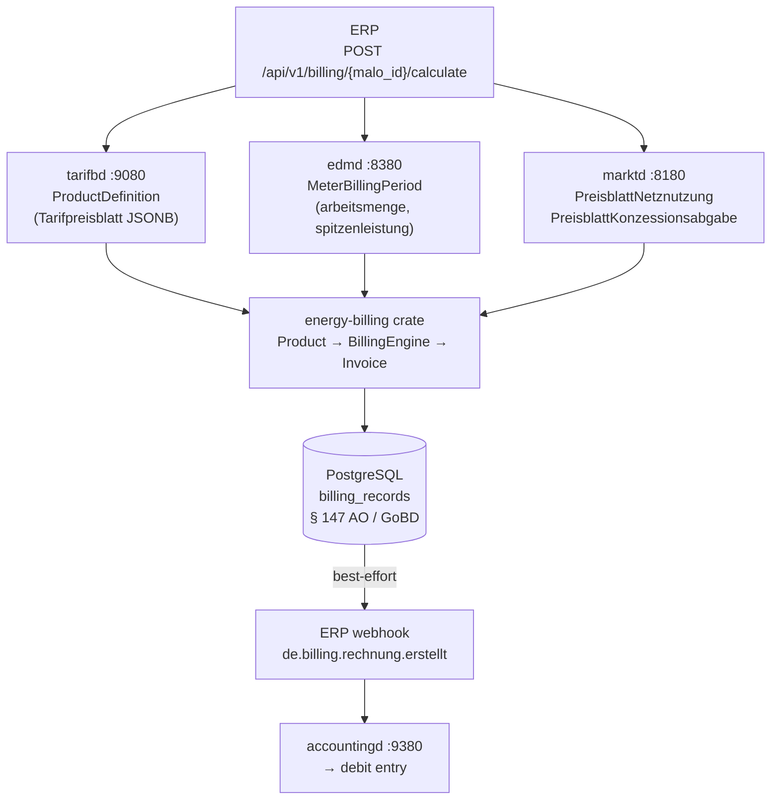
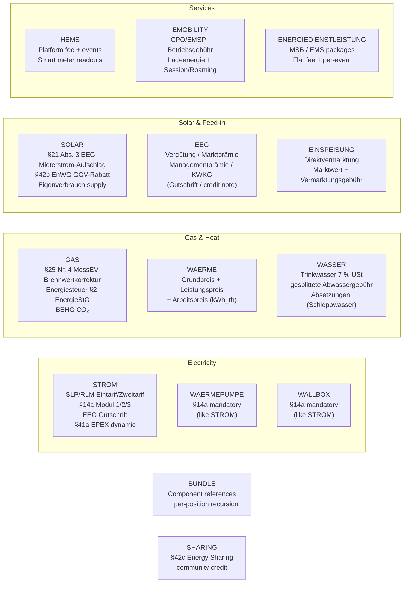
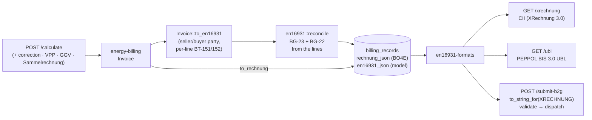
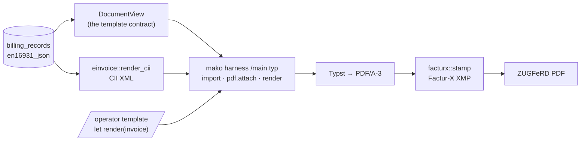

+++
title = "billingd Operator Guide"
description = "billingd operator guide: Multi-Product Billing Engine (LF role). Energy billing engine — user-defined product prices from tarifbd; 13 categories (STROM/GAS/WAERME/WASSER/SOLAR/EEG/EINSPEISUNG/WAERMEPUMPE/WALLBOX/HEMS/EMOBILITY/ENERGIEDIENSTLEISTUNG/SHARING); §41a EPEX dynamic; §25 Nr. 4 MessEV Brennwertkorrektur; §14a Modul 1/2/3; EN 16931 e-invoicing (XRechnung 3.0 CII + PEPPOL UBL, B2G mandate 01.01.2027)."
weight = 32
[extra]
mermaid = true
+++
# `billingd` — Multi-Product Billing Engine

`billingd` is a **pure calculation service**. It has no grid topology knowledge and no
business policy — all decisions come from the product definition in `tarifbd` and the
measurement data in `edmd`.

Port: **`:9280`**

---

## Why pure calculation?

Every billing run is **deterministic and reproducible**: given the same inputs (product, meter,
tariff), the output is always the same `Rechnung`. This means:

- BNetzA § 147 AO / GoBD compliance: auditors can re-run the calculation from stored inputs
- No hidden state: all inputs are either stored in `tarifbd`, `edmd`, or `marktd`
- Testable: `energy-billing` is exhaustively covered (property-based, golden master, integration) — zero I/O, zero async, all pure Rust

---

## Architecture: `energy-billing` crate

The pure billing logic lives in the **`energy-billing`** crate (extracted from `billingd`).
This follows the same pattern as `eeg-billing` for `einsd`:

```
billingd (HTTP service)
    │   config · persistence · CloudEvents · EN 16931 e-invoicing
    │   HTTP endpoints · tarifbd/edmd/marktd clients
    │
    └── energy-billing (pure crate, crates.io)
            │   Product (typed enum, 13 variants)
            │   Quantities · BillingContext · RegulatoryRates
            │   BillingEngine (provider pipeline, validate + bill + bill_batch)
            │   Invoice { positions, warnings, netto_eur, mwst_eur, brutto_eur }
            │
            ├── ElectricityProvider      §41a EPEX; HT/NT; block tariffs; RLM demand
            ├── ControllableLoadProvider §14a Modul 1/2/3 (WAERMEPUMPE, WALLBOX)
            ├── GasProvider              §25 Nr. 4 MessEV Brennwertkorrektur; BEHG CO₂
            ├── HeatProvider             Fernwärme (standard-rated; 7% only in the §28 window)
            ├── WaterProvider            Trinkwasser 7% USt; Abwasser gesplittet; Absetzungen
            ├── SolarProvider            §21 Abs. 3 EEG Mieterstrom; §42b EnWG GGV
            ├── EegProvider              LF-side Gutschrift; contractual §51
            ├── EinspeisungProvider      Direktvermarktung Marktwert
            ├── HemsProvider             Platform subscription + events
            ├── EmobilityProvider        CPO/EMSP
            ├── ServiceProvider          Energiedienstleistung
            ├── DynamicElectricityProvider  §41a per-interval EPEX (§41a iMSys guard)
            ├── EnergyShareProvider      §42c Energiegemeinschaft credit
            └── MwStProvider             Multi-rate MwSt (7% / 19% / 0% per position)
```

`energy-billing` is **zero I/O, zero async** — `BillingEngine::bill()` is a pure function
returning `Result<Invoice, EngineError>`; each error variant carries a stable
machine-readable `code()` that `billingd` surfaces in structured error bodies.
`Invoice` carries `positions: Vec<BillingPosition>`, `warnings: Vec<BillingWarning>`, and
exposes `to_rechnung()` — a fully-typed `rubo4e::Rechnung` (Decimal-exact money;
canonical BO4E fields: `rechnungstyp`, `istStorno`, `originalRechnungsnummer`,
`faelligkeitsdatum`, `zuZahlen`, typed `marktlokation`/`zaehler`/`vertrag`;
mako-specific §40b/§40-Abs.-2 facts ride as `zusatzAttribute`).
`to_rechnung_json()` is its thin serialization wrapper (JSONB for `accountingd`
ingestion and the stored `billing_records.rechnung_json`).
Helper methods: `.assert_valid()`, `.total_by_tag()`, `.positions_by_tag()`,
`.kilowattstundenpreis_brutto_ct()`, `.has_errors()`.

Statutory rates (Stromsteuer, Energiesteuer Gas, BEHG CO₂) are injected via `RegulatoryRates`
from `billingd.toml` — zero hardcoded values in the crate.

---

## Calculation pipeline



---

## Product categories

`billingd` routes each billing request to a category-specific pure calculator.
**All commercial prices are user-defined in `tarifbd`** — the engine contains no hardcoded
rates. Statutory rates (Stromsteuer, Energiesteuer Gas, BEHG CO₂) are configured in
`billingd.toml` under `[rates]` and can be overridden per-product.



### STROM — Electricity

```
Grundpreis              [from tarifbd]     ct/day
Arbeitspreis            [from tarifbd]     ct/kWh
Leistungspreis          [from tarifbd]     ct/kW/month  RLM demand charge on spitzenleistung_kw
NNE Grundpreis          [from marktd]      pass-through
NNE Arbeitspreis        [from marktd]      pass-through
NNE Leistungspreis      [from marktd]      RLM only (EUR/kW/month)
Konzessionsabgabe       [from marktd]      pass-through
§14a Modul 1 pauschale  [if product set]   negative EUR/kW/year
§14a Modul 2 AP-Redukt. [if product set]   negative ct/kWh (device's own metering)
§14a Modul 3 HT/ST/NT   [if product set]   three Tarifstufen, replace the flat NNE
§14a Steuerungsentsch.  [if product set]   negative, pro-rated to load-shedding hours
EEG Gutschrift          [from einsd]       negative, if PV self-consumption
Stromsteuer             [from billingd.toml, overridable per-product]  ct/kWh
──────────────────────────────────────────────────
Netto
MwSt [from billingd.toml or product override]
Brutto
```

Variants: `Eintarif`, `Zweitarif` (HT/NT), `Mehrtarif` (multiple registers).
**§41a EPEX dynamic**: when `dynamic_epex = true` in the product, `billingd` fetches
15-min Lastgang and 15-min EPEX MTU prices from `tarifbd`. `arbeitspreis_ct_per_kwh` is
ignored; the per-MTU price is spot + `auf_abschlag_ct_per_kwh`.

**RLM demand charge**: For large commercial customers with measured peak demand (§ 12 StromNZV,
≥100 MWh/year), set `leistungspreis_strom_ct_per_kw_month` in the product definition.
`billingd` bills `spitzenleistung_kw × rate` as a `Leistungspreis` position.
Supply `spitzenleistung_kw` from `edmd` MeterBillingPeriod. Applies to `metering_mode: RLM`
or `Imsys` metering points.

### GAS — Natural Gas

```
Brennwertkorrektur      [informational]    m³ × Hs × Z → kWh_Hs  (§25 Nr. 4 MessEV)
Grundpreis Gas          [from tarifbd]     ct/day
Arbeitspreis Gas        [from tarifbd]     ct/kWh_Hs
Gasnetzentgelt GP       [from marktd]      pass-through
Gasnetzentgelt AP       [from marktd]      pass-through
Konzessionsabgabe Gas   [from marktd]      pass-through
Bilanzierungsumlage Gas [from marktd]      pass-through
Energiesteuer Erdgas    [from billingd.toml] §2 EnergieStG  0.55 ct/kWh_Hs
                        OR Exemption notice when gas_energiesteuer_befreiung=true
                           (§54 EnergieStG KWK/industrial) — requires customer certificate
CO₂-Abgabe BEHG         [from billingd.toml] ~1.31 ct/kWh_Hs (65 EUR/t CO₂, 2026)
MwSt                    [from billingd.toml] 19%
```

Since 2026 the nEHS certificate price is **auction-formed** (§10 Abs. 1 BEHG:
weekly EEX auctions from 01.07.2026 within the 55–65 EUR/t corridor,
Verkaufsphase at 68 EUR/t), so on the live bill/preview paths billingd
overlays the **dated market price** from tarifbd's `nehs_prices` series onto
the year-table default. Resolution order: explicit `[rates]` override →
`GET /api/v1/nehs-prices/latest?date={period_from}` (start-of-period basis,
consistent with `regulatory_rates_for_period`; converted via
`energy_billing::behg_ct_per_kwh_from_price`) → year-table fallback. The
EUR/t→ct/kWh conversion uses the H-Gas CO₂ factor (0.20160 kg/kWh) unless
`[rates] behg_co2_factor_kg_per_kwh` overrides it (L-Gas: 0.20140).
Historical XRechnung re-renders keep the stored record's rates
(CO2KostAufG §3: the pass-through follows the supplier's actual CO₂ costs at
billing time).

**Historic statutory rates:** For retroactive correction invoices, the year tables in
`energy_billing::rates` apply the correct historical defaults: `effective_stromsteuer_for_year()`,
`effective_energiesteuer_gas_for_year()` (heating gas has been a constant 0.55 ct/kWh_Hs —
the 2022 Energiesteuersenkungsgesetz reduced motor-fuel rates only) and
`effective_behg_gas_for_year()`. VAT history is commodity-aware:
`mwst_rate_for_period()` covers the 2020 COVID 16 % window, and
`mwst_rate_for_gas_waerme_period()` additionally covers the **7 % gas/Fernwärme window
01.10.2022–31.03.2024** (§28 Abs. 5/6 UStG).

### A period crossing a rate boundary is refused, not guessed

A period straddling a statutory boundary has **no** correct single rate, so
billingd **refuses** it with `422` rather than choosing one:

```json
{
  "error": {
    "code": "ZEITRAUM_UEBERSCHREITET_SATZGRENZE",
    "category": "GAS",
    "period_from": "2024-03-01",
    "period_to": "2024-04-30",
    "stichtage": ["2024-04-01"],
    "legal_basis": "§28 Abs. 5/6 UStG (Gas/Fernwärme), §10 BEHG"
  }
}
```

Split at each Stichtag and bill the parts. The refusal names them because
"period rejected" alone is not actionable — `energy_billing::steuer_stichtage_im_zeitraum`
computes them, covering both the USt windows (commodity-aware: electricity never
had the 7 % window) and the §10 BEHG CO₂ price, which steps at every calendar-year
boundary for gas.

This matters because the failure is invisible downstream. A gas period crossing
31.03.2024 billed whole at 19 % overcharges the March portion, which was legally
7 %, and the resulting invoice is indistinguishable from a correct one. An
explicitly configured `[rates] mwst_rate` suppresses the refusal — that is the
operator taking the decision themselves.

Supply `gas_meter.messung_qm3` + `brennwert_kwh_per_qm3` + `zustandszahl` in the request.
`billingd` computes `kWh_Hs = m³ × Hs × Z` and uses it for all price positions.

**H2-blend / `gasqualitaet`:** Supply the optional `gasqualitaet` field from
`marktd.malo.gasqualitaet` (e.g. `"H_GAS"`, `"L_GAS"`, `"H2_BLEND"`). The field does **not**
alter the billing amount — per DVGW G 260, `edmd` already reports the measured Brennwert
reflecting the actual gas blend. `billingd` records `gasqualitaet` as a `ZusatzAttribut` on
the `Rechnung` for regulatory audit transparency, enabling operators to trace billing periods
during H2-blend transitions.

### WAERME — District Heat (Fernwärme)

```
Grundpreis Fernwärme    [from tarifbd]     EUR/month
Leistungspreis          [from tarifbd]     EUR/kW/month × peak kW
Arbeitspreis            [from tarifbd]     ct/kWh_th
MwSt
```

### SOLAR — Mieterstrom / §42b EnWG GGV

```
Arbeitspreis Solar      [from tarifbd]     ct/kWh  (Eigenverbrauch supply price)
Mieterstrom-Aufschlag   [from tarifbd]     ct/kWh  §42b EnWG (BNetzA-capped annually)
§42b EnWG GGV-Rabatt         [from tarifbd]     ct/kWh  negative discount
Stromsteuer             skipped by default  §9a StromStG exemption for on-site Eigenverbrauch
MwSt
```

Set `solar_include_stromsteuer: true` in the product definition for non-exempt cases.

### EEG — Feed-in Settlement (Gutschrift)

Credit note for feed-in plant operators (§21 EEG Vergütung, §38 EEG Marktprämie):

```
EEG Einspeisevergütung  [from tarifbd]     ct/kWh (credit)
EEG Marktprämie         [from tarifbd]     ct/kWh (credit, per settlement period)
Managementprämie        [from tarifbd]     ct/kWh §53 EEG (fixed by technology)
KWKG Zuschlag           [from tarifbd]     ct/kWh (credit, if applicable)
MwSt
```

Net result is typically negative brutto (the LF pays the producer).

> **LF vs NB for §51 EEG Negativpreisregel**
>
> The mandatory §51 EEG implementation (suspension of Vergütung during negative-EPEX hours)
> lives in `eeg-billing` / `einsd` — this governs the **NB paying the plant operator** under
> the statutory EEG.
>
> The `EEG` category in `billingd` is for the **LF** (private contractual billing): Mieterstrom
> §38a contracts and Direktvermarktung arrangements where the LF is the contracting party.
> These are **private law contracts** not subject to statutory §51.
>
> For contracts that **voluntarily mirror §51** (e.g. "no credit during negative hours"):
> supply `eeg_meter.kwh_during_negative_epex` to suspend Vergütung/Marktprämie for those kWh.
> KWKG Zuschlag is always exempt (different law).
>
> **Kleinunternehmer (§19 UStG)**: a small feed-in operator who has elected the
> Kleinunternehmerregelung issues the Gutschrift at 0 % USt — set
> `kleinunternehmer_19_ustg: true` in the product definition in `tarifbd`. This
> is the operator's tax election, not a function of plant size (§12 Abs. 3 UStG
> zero-rates the PV *system* supply, which this engine does not bill).

### EINSPEISUNG — Direktvermarktung Settlement

```
Marktwert Strom         [from tarifbd]     ct/kWh (EPEX Spot Monatsmarktwert)
Vermarktungsgebühr      [from tarifbd]     ct/kWh negative (aggregator fee)
MwSt
```

### WAERMEPUMPE / WALLBOX — §14a Controlled Loads

Identical to `STROM` but §14a positions are appended by `ControllableLoadProvider`,
which delegates standard electricity billing to `ElectricityProvider`.

BNetzA **BK6-22-300** defines exactly three modules, and the numbering is printed
on the invoice and shared with the NB-side `grid-billing` engine:

| Modul | What it is | Field |
|---|---|---|
| **1** | *pauschale Reduzierung des Netzentgelts* — needs no extra metering, so it is the default where the connection holder makes no choice | `sect14a_modul1_pauschale_eur_per_kw_year` |
| **2** | *prozentuale Reduzierung des Arbeitspreises* — attaches to the device's **separately metered** energy | `sect14a_modul2_nne_reduktion_ct_per_kwh` |
| **3** | *zeitvariable Netzentgelte* (from 01.04.2025) — three Tarifstufen HT/ST/NT, requires an iMSys | `sect14a_modul3_nne_ht/st/nt_ct_per_kwh` + `sect14a_modul3` quantities |

**Modul 2 and Modul 3 are mutually exclusive** — both re-price the Arbeitspreis, so
holding both would reduce the same network usage twice. Configuring both is refused
with `MODUL2_AND_MODUL3`. Modul 1 composes with either. Setting the Modul 3 bands
alongside a flat NNE Arbeitspreis is refused with `MODUL3_AND_FLAT_NNE`, for the
same double-charging reason.

A **Steuerungsentschädigung** (`sect14a_steuerungsentschaedigung_ct_per_kwh` /
`_eur_per_kw_year`) compensates a dispatch that actually happened. It carries no
module number: all three BK6-22-300 modules are rate reductions, none of them a
payment for a Steuerungseingriff.

### HEMS / EMOBILITY / ENERGIEDIENSTLEISTUNG / BUNDLE

```
HEMS: Platform fee (EUR/month) + Optimization events + Smart meter readouts
EMOBILITY: Betriebsgebühr (EUR/month) + Ladeenergie (ct/kWh) + Session/Roaming fees
ENERGIEDIENSTLEISTUNG: Flat fee (EUR/period) + per-event charge
BUNDLE: per-component recursion — ERP must submit individual calculate requests per position
```

---


---

## Product and tariff model

### Product — type-safe dispatch

`Product` is a typed enum deserialized directly from `tarifbd` JSONB using the `"category"`
discriminator. Call `product.build_engine(&grid, &rates)` to obtain a configured `BillingEngine`:

```rust
// Deserializes from {"category":"STROM","arbeitspreis_ct_per_kwh":32.0,...}
let product: Product = serde_json::from_str(&product_json)?;
let engine = product.build_engine(&grid, &rates);
// No more Option<BillingEngine> or PricingModel::try_from() needed
let invoice = engine.bill(ctx, &quantities)?;
```

`Product` has 13 exhaustive variants, each wrapping a typed per-category struct:
`Strom(ElectricityProduct)`, `Waermepumpe/Wallbox(ControllableLoadProduct)`,
`Gas(GasProduct)`, `Waerme(HeatProduct)`, `Wasser(WaterProduct)`, `Solar(SolarProduct)`,
`Eeg(EegProduct)`, `Einspeisung(EinspeisungProduct)`,
`Hems(HemsProduct)`, `Emobility(EmobilityProduct)`, `Energiedienstleistung(ServiceProduct)`,
`Sharing(SharingProduct)`.

### Regulatory additions

| Addition | Law |
|---|---|
| `kleinunternehmer_19_ustg` → 0% USt on feed-in Gutschrift | §19 UStG |
| `industrie_stromsteuer_befreiung` → exemption notice | §9 Abs. 1 Nr. 4 StromStG |
| `preisgarantie_bis` → disclosure on invoice | §41 Abs. 1 Nr. 4 EnWG |
| `MeteringMode` (SLP/RLM/iMSys) on MeterInput | §3/§ 12 StromNZV, §31 MsbG |
| `is_estimated` flag → § 60 Abs. 2 MsbG notice | § 60 Abs. 2 MsbG |
| `zaehler_replaced` flag → Zählerwechsel notice | §41 EnWG |
| `Sect41aAnnualComparison` in Quantities | §41a Abs. 6 EnWG |
| `InvoiceType::PartialInvoice` | §41 EnWG, StromGVV §17 |

### Tarifwechsel endpoint

Mid-period price changes (§41 EnWG transparency requirement) are supported natively:

```http
POST /api/v1/billing/{malo_id}/tarifwechsel
Content-Type: application/json

{
  "lf_mp_id":    "9910000000002",
  "period_from": "2026-01-01",
  "period_to":   "2026-01-31",
  "switch_date": "2026-01-15",
  "old_tariff":  { "category": "STROM", "arbeitspreis_ct_per_kwh": 28.0 },
  "new_tariff":  { "category": "STROM", "arbeitspreis_ct_per_kwh": 32.0 },
  "old_meter":   { "arbeitsmenge_kwh": 140 },
  "new_meter":   { "arbeitsmenge_kwh": 170 }
}
```

Two sub-period invoices are calculated and merged via `Invoice::merge()`. Positions from
both sub-periods appear on one combined invoice. Tax is applied independently per sub-period
(correct per §41 EnWG for mid-month rate changes).

### Pro-rata Grundpreis (move-in / move-out)

`billingd` pro-rates Grundpreis when `vertragsbeginn` or `vertragsende` falls
within the billing period. Pass these in the `BillingContext`:

```json
{
  "vertragsbeginn": "2026-01-16"
}
```

A customer joining on Jan 16 is billed 16 × rate instead of 31 × rate.
A customer who moves in mid-period is charged the standing rate for the days
supplied, not the full period.

### Audit trail

Every billing run generates a unique `billing_run_id` (UUID v4). It is stored on
`Invoice.billing_run_id` and propagated to:

- `billing_records.billing_run_id` in PostgreSQL
- `rechnung_json.zusatzAttribute["billingRunId"]`

This links each database record to the exact calculation output for § 147 AO / GoBD compliance.

## Triggering a billing run

```http
POST /api/v1/billing/51238696780/calculate
Content-Type: application/json

{
  "lf_mp_id":   "9910000000002",
  "nb_mp_id":   "9900000000001",
  "period_from": "2026-06-01",
  "period_to":   "2026-06-30",
  "rechnungsnummer": "R2026-06-001"
}
```

`billingd` automatically fetches:
1. Product from `tarifbd GET /api/v1/customer/51238696780/product`
2. Meter data from `edmd GET /api/v1/billing-period/51238696780?from=...&to=...`
3. NNE tariff from `marktd GET /api/v1/preisblaetter/{nb_mp_id}`
4. KA tariff from `marktd GET /api/v1/preisblaetter-ka/{nb_mp_id}`

**Override any input** by passing it directly in the request body — useful for testing
or when the upstream service is temporarily unavailable:

```http
POST /api/v1/billing/51238696780/calculate
Content-Type: application/json

{
  "lf_mp_id": "9910000000002",
  "nb_mp_id": "9900000000001",
  "period_from": "2026-06-01",
  "period_to": "2026-06-30",
  "meter": {
    "arbeitsmenge_kwh": "312.5",
    "sparte": "STROM"
  },
  "tariff": {
    "category": "STROM",
    "grundpreis_ct_per_day": "20.0",
    "arbeitspreis_ct_per_kwh": "32.0"
  }
}
```

### §41a Dynamic Tariff (iMSys)

When the product in `tarifbd` has `dynamic_epex: true`, `billingd` automatically:

1. Fetches 15-min Lastgang from `edmd` (`GET /api/v1/lastgang/{malo_id}?from=…&to=…`)
2. Fetches 15-min EPEX prices from `tarifbd` (`GET /api/v1/epex-prices/{date}/quarter-hourly`),
   keyed on each Market Time Unit's UTC start instant (SDAC 15-min go-live 2025-10-01)
3. Calculates `Σ(kWh_MTU × (EPEX_MTU_ct + Aufschlag_ct)) / 100` as the energy cost —
   each 15-min consumption interval is floored to its quarter-hour and joined to that MTU's price
4. Adds NNE / Konzessionsabgabe / Stromsteuer as usual

The `tariff.arbeitspreis_ct_per_kwh` field is ignored when `dynamic_epex: true` — the EPEX
spot price from `tarifbd` is the actual price applied per 15-min MTU, plus the supplier's
fixed `auf_abschlag_ct_per_kwh` Arbeitspreis-Aufschlag (§41a: market price + margin).

**Price floor (`dynamic_epex_floor_ct_kwh`):** Set this field in the tarifbd product to cap
how low the EPEX price can go. Common configurations:
- `null` (default) — full pass-through; negative EPEX → customer receives a credit
- `0` — zero floor; negative EPEX bills at 0 ct/kWh (no credit, no charge)
- `5` — minimum 5 ct/kWh regardless of spot price

```json
{
  "category": "STROM",
  "dynamic_epex": true,
  "dynamic_epex_floor_ct_kwh": "0"
}
```

**Fallback**: when Lastgang data is unavailable, `billingd` falls back to `arbeitsmenge_kwh`
from `edmd`'s `billing-period` endpoint with the static `arbeitspreis_ct_per_kwh`.

```http
POST /api/v1/billing/51238696780/calculate
Content-Type: application/json

{
  "lf_mp_id": "9910000000002",
  "nb_mp_id": "9900000000001",
  "period_from": "2026-06-01",
  "period_to": "2026-06-30",
  "tariff": {
    "category": "STROM",
    "grundpreis_ct_per_day": "5.0",
    "dynamic_epex": true
  }
}
```

> EPEX prices must be imported daily into `tarifbd` via `PUT /api/v1/epex-prices/{date}`.

---

## Idempotency

`billing_records` has a partial unique index on `(malo_id, lf_mp_id, period_from,
period_to, product_code, tenant)` for non-correction, non-Sammel rows. Re-running
the same billing request updates the existing record **only while it is a draft**
(`outcome = 'generated'`) — a dispatched record refuses the overwrite and points
at the correction path.

---

## Endpoints

| Method | Path | Description |
|--------|------|-------------|
| `POST` | `/api/v1/billing/{malo_id}/calculate` | Calculate, persist, emit CloudEvent |
| `POST` | `/api/v1/billing/{malo_id}/preview` | Dry-run calculation (no persist, no CloudEvent) |
| `GET` | `/api/v1/billing` | List records (`?malo_id=&lf_mp_id=&outcome=`) |
| `GET` | `/api/v1/billing/{id}` | Fetch single record with full `Rechnung` JSONB |
| `GET` | `/api/v1/billing/{id}/xrechnung` | CII XML of the stored model (via `en16931-formats`); BT-24 is plain EN 16931 for a retail invoice — only the B2G path declares XRechnung |
| `GET` | `/api/v1/billing/{id}/ubl` | PEPPOL BIS Billing 3.0 UBL 2.1 (EN16931) |
| `GET` | `/api/v1/billing/{id}/pdf` | ZUGFeRD PDF/A-3 — the page and the CII XML in one file. Pins the template on first render |
| `POST` | `/api/v1/billing/{id}/correction` | Korrekturrechnung / Stornorechnung (§ 147 AO / GoBD) |
| `POST` | `/api/v1/billing/{malo_id}/tarifwechsel` | Combined invoice for mid-period price change (§41 EnWG) |
| `POST` | `/api/v1/billing/{id}/submit-b2g` | XRechnung B2G submission (§27 EGovG) |
| `POST` | `/api/v1/templates` | Prove and publish a document template |
| `POST` | `/api/v1/templates/preview` | Render a candidate template; stores nothing |
| `GET` | `/api/v1/templates/reference` | The reference invoice layout mako ships |
| `GET\|PUT` | `/api/v1/templates/{kind}/current` | Which template is rolled out |
| `GET` | `/api/v1/templates/by-hash/{hash}` | Resolve the layout an issued document used |
| `GET` | `/health` | Liveness |
| `GET` | `/health/ready` | Readiness |
| `POST\|GET` | `/mcp` | MCP Streamable HTTP (LLM tooling) |

---

## MCP server

`billingd` ships a built-in MCP server at `/mcp` (Streamable HTTP 2025-11-25). **Twelve tools**
and six prompts are available to LLM agents:

| Tool | Description |
|---|
---|
| `list_billing_records` | List records for a MaLo — summary without full `Rechnung` |
| `get_billing_record` | Full BO4E `Rechnung` JSONB for a specific record UUID |
| `preview_billing` | Dry-run preview (calls `/preview` internally — no side effects) |
| `calculate_billing` | Trigger a real billing run (calls `/calculate`) |
| `get_xrechnung` | Fetch XRechnung 3.0 CII XML (from the stored EN 16931 model) |
| `check_billing_anomaly` | Rolling 3-month deviation check — flags invoices outside threshold |
| `list_vpp_settlements` | List VPP aggregation settlement records |
| `list_corrections` | List Korrekturrechnung / Stornorechnung records (§ 147 AO / GoBD) |
| `list_product_categories` | Describe all 13 billing categories and their required product fields |
| `get_billing_summary` | Aggregate stats per MaLo: total billed, avg monthly, by category |
| `validate_tariff_config` | Pre-flight: §41a iMSys guard, KAV plausibility, missing fields |
| `explain_invoice_position` | Full `PositionTrace` audit for a given position (formula, §-refs) |

| Prompt | Description |
|---|---|
| `order-to-cash` | Full O2C: GPKE Lieferbeginn → Jahresabschluss |
| `preview-invoice` | Step-by-step: preview before committing a billing run |
| `check-dynamic-tariff` | Verify §41a EPEX tariff configuration |
| `14a-steuerungsrabatt` | Configure §14a Modul 1/3 for Wärmepumpe / Wallbox |
| `eeg-billing` | Set up EEG / EINSPEISUNG billing with double-booking guard |
| `gas-billing` | Configure Brennwertkorrektur, BEHG CO₂, H2-blend, L-Gas |

The `tariff-optimization-agent` in `agentd` calls `list_billing_records` and
`get_billing_summary` to detect customers on sub-optimal tariffs and automatically suggests
§41a dynamic tariff switches for iMSys customers.

---

## Korrekturrechnung (§ 147 AO / GoBD)

`POST /api/v1/billing/{id}/correction` creates a Korrekturrechnung or Stornorechnung:

```json
{ "reason": "Falsche Zählerstandsaufnahme Q2 2026", "negate": true }
```

- `negate: true` → Stornorechnung (all positions negated, `is_correction: true` in DB)
- `negate: false` → Korrekturrechnung (amended positions only)

Both variants include `zusatzAttribute.originalRechnungsnummer` for § 147 AO / GoBD audit trail.

A second correction of the same original is refused with `409 Conflict` —
`KORR-{original_nr}` must stay einmalig (§14 Abs. 4 Nr. 4 UStG), and a double
negation would corrupt the accounting ledger.

---

### ENERGIEDIENSTLEISTUNG products

When `tariff.category == "ENERGIEDIENSTLEISTUNG"`, `billingd` deserializes the product JSON to
`Product::Energiedienstleistung(ServiceProduct)` and builds a `ServiceProvider`:

```json
{
  "lf_mp_id": "9910000000002",
  "nb_mp_id": "9900000000001",
  "period_from": "2026-06-01",
  "period_to": "2026-06-30",
  "tariff": {
    "category": "ENERGIEDIENSTLEISTUNG",
    "service_fee_eur": "14.99",
    "service_event_price_eur": "0.05"
  },
  "service_meter": {
    "months": "1",
    "event_count": 30
  }
}
```

Generates two positions: `ServiceFee` (monthly Grundgebühr) and `EventFee` (per-readout charge).

---

## E-invoicing — EN 16931, not BO4E

XRechnung/CII and PEPPOL UBL **are** EN 16931, so the render source is the EN 16931
**semantic model**, never a re-parse of the BO4E `Rechnung`. At bill time
`energy_billing::Invoice::to_en16931(spec, seller, buyer)` maps the invoice — at the
layer that still has each position's own amount, VAT category and rate — into an
`en16931::Invoice`, and billingd stores it in `billing_records.en16931_json`. The
external [`en16931`](https://docs.rs/en16931) crate derives the BG-23 VAT breakdown
and BG-22 totals from the lines via `reconcile` (so BR-CO/BR-S hold by construction),
and [`en16931-formats`](https://docs.rs/en16931-formats) writes the syntaxes. The
hand-rolled CII/UBL builders that once walked the BO4E `steuerbetraege` are gone;
every render path reads the stored model and answers **422** if it is missing.



**Per-line VAT is correct.** A mixed-rate invoice (gas 19 % + Fernwärme 7 % + PV 0 %)
carries a distinct BT-151/BT-152 per line that reconciles with the BG-23 breakdown —
the single-blended-rate defect of the old renderer is gone.

**`GET /api/v1/billing/{id}/xrechnung`** → XRechnung 3.0 CII (`en16931-formats::cii`).
Profile identifier `urn:cen.eu:en16931:2017#compliant#urn:xeinkauf.de:kosit:xrechnung_3.0` — the namespace moved from XÖV to XStandards Einkauf at 3.0, so a `xoev-de` URN with a `_3.0` version matches no published version and fails BR-DE-21.

**BT-24 declares plain EN 16931, not XRechnung.** XRechnung is the German *B2G*
CIUS: it requires a Leitweg-ID (BT-10) and a Peppol endpoint (BT-49), neither of
which a household supply customer has. §14 UStG requires conformance to **EN 16931**
— XRechnung and ZUGFeRD are examples of it, not the requirement — so core is both
sufficient and truthful for a retail invoice. `POST .../submit-b2g` upgrades BT-24
to XRechnung at the point the caller supplies those terms.

The **BG-7 buyer comes from `vertragd`** — `GET /vertraege/by-malo/{id}` returns a
`rechnungsempfaenger` block (BT-44 name, BT-50/52/53 address, BT-48 VAT-ID) read
from `vertragd.kunden`, because `billingd` holds no customer master. A vertragd
outage degrades the invoice rather than failing the run: the buyer falls back to
naming the supply site.

`billingd` runs `einvoice::validate` on every model it builds — against the profile
the document *declares* — and logs any finding.

## The ZUGFeRD document — `GET /api/v1/billing/{id}/pdf`

One file that is both things a customer and their accounting software need: a
page a person reads, and the EN 16931 invoice embedded inside it as
`factur-x.xml`. Both are rendered from the same stored `en16931_json`, so they
cannot disagree.

The **layout** belongs to the operator — a [Typst](https://typst.app) template
published over the API and pinned by hash. The **content**, visual and machine
alike, belongs to mako. That is the whole design, and it is enforced rather than
agreed.



### The template contract

A template exports exactly one function:

```typst
#let render(invoice) = { .. }
```

`invoice` is `document::view::DocumentView` as a Typst dictionary — the §14
Abs. 4 UStG Pflichtangaben, the lines, the VAT breakdown per rate and the
totals, each field documented with its EN 16931 BT/BG term. Amounts are exact
decimal strings, never floats, and they keep the scale their business term
carries (money two decimals, a unit price four), so a template must **pad** a
value to the precision it wants and never truncate one.

`GET /api/v1/templates/reference` serves the layout mako ships — a complete §14
Abs. 4-conformant invoice with DIN 5008 margins and German number formatting.
It is compiled by the test suite on every run against the same specimen an
operator's template will face, so the starting point is never stale.

### What a template cannot do

mako compiles **its own** entry file, not the operator's. The harness imports
the template, hands it the view, and emits the `pdf.attach` itself:

```typst
#import "/template.typ": render
#pdf.attach("factur-x.xml", bytes("<?xml version=\"1.0\" .."), relationship: "alternative", ..)
#render(json("/document.json"))
```

So a template cannot omit the invoice, rename it, replace it (Typst refuses a
duplicate attachment path), or read it — the XML is a *literal* in mako's file,
not a file served to the compiler, because a `World` cannot tell its callers
apart and anything readable by the harness would be readable by the template.

Beyond that, the compilation environment is the smallest one that can still
typeset an invoice:

| Capability | Available to a template |
|---|---|
| Host filesystem | none — three in-memory files exist and nothing else |
| Network, `@preview` packages | refused, with a message explaining why |
| Fonts | the bundled Typst set; never the host's, never the operator's |
| Wall clock | none — `datetime.today()` returns the *document's* date (BT-2) |

Compute is *not* sandboxed. Typst caps loop iterations and call depth, but
nested loops still multiply, so a render runs on a blocking thread under a
20 s budget; on timeout the caller is freed and the thread finishes on its own,
because Typst offers no way to interrupt a compilation.

Concurrent renders are **capped** at one fewer than the machine's cores.
Typesetting is CPU-bound and runs on tokio's blocking pool — the same pool
`sqlx` uses — so an unbounded burst of publishes would contend for cores, take
proportionally longer each, and in the limit stall database work unrelated to
rendering. Queuing is strictly better than thrashing: the work is serialised
either way, and this way the rest of the service keeps moving. Waiting for a
slot counts against the caller's budget, so a queue can never outlast the
deadline a caller asked for. The permit is held by the render itself rather than
by the caller, so a timed-out render keeps its slot until it genuinely ends —
which is the truth about the machine.

### The Factur-X carrier

A PDF/A-3 with the XML stapled inside it is not yet a ZUGFeRD document.
ZUGFeRD 2.3 requires four things of the carrier, and a receiver's validator
checks all four:

| Requirement | Written by |
|---|---|
| PDF/A-3 conformance | `typst-pdf` (enforced, not claimed) |
| `factur-x.xml` — or `xrechnung.xml` for the XRECHNUNG profile | the harness |
| `/AFRelationship /Alternative` + catalogue `/AF` | Typst |
| XMP `fx:DocumentType` / `DocumentFileName` / `Version` / `ConformanceLevel`, **plus** the PDF/A extension schema description | `document::facturx::stamp` |

The last one has no hook in `typst-pdf`, so mako adds it by **incremental
update**: every byte the renderer produced stays in place and a new definition
of the metadata object is appended with its own cross-reference section — the
same mechanism a digital signature uses. Re-serialising the file through a
general-purpose PDF library would be less code and would risk quietly breaking
a conformance property nobody re-validates.

Only the *writing* half is mako's. Reading a finished document — walking the
catalogue to the payload, parsing it back as CII, and reporting any
disagreement between what the PDF declares and what it contains — is
`en16931-formats::zugferd::extract`, and the profile vocabulary is that crate's
`Profile`. mako had its own name-tree walk and its own two-variant profile enum;
both are gone. A private enum that knows two of six profiles is how a MINIMUM
document — which carries no lines and is **not** an EN 16931 invoice — ends up
wrapped in a carrier claiming it is one.

The profile is derived from BT-24, never configured: a document declaring plain
EN 16931 gets `factur-x.xml` and conformance level `EN 16931`; one declaring the
XRechnung CIUS gets `xrechnung.xml` and `XRECHNUNG`. A carrier whose XMP claims
a profile the XML does not satisfy is exactly the mismatch a validator exists to
find, so it is made unrepresentable.

### Publishing is gated by proof

`POST /api/v1/templates` does not store what it is given. It renders the
candidate against a specimen chosen to be *awkward* — two VAT rates, an exempt
position with a BT-120 reason, a credit line, a four-decimal unit price beside
two-decimal money, umlauts, a long item name, absent optional fields — then:

1. enforces the declared PDF/A level (a level that cannot carry an embedded
   file is **refused**, because it would produce a handsome PDF with no invoice
   in it — the one failure mode that looks like success);
2. stamps the Factur-X XMP;
3. **reads the finished document back with the counterparty's reader**. Not
   mako's — `en16931-formats::zugferd::extract`, the same code a receiver runs.
   The payload must come out byte-identical, re-parse as CII, carry the same
   BT-1 and BT-115 that went in, and produce **no `Divergence`** — the reader's
   term for the four ways a hybrid invoice is wrong while still opening
   cleanly: XMP profile ≠ BT-24, XMP filename ≠ the file attached, an
   `/AFRelationship` that calls the invoice supplementary, or no XMP at all;
4. reads the text back off the **page** and requires the § 14 Abs. 4 UStG terms
   that are not a matter of taste — the invoice number (Nr. 4) and both party
   names (Nr. 1). Without this, `#let render(invoice) = []` passes: conformant
   PDF/A-3, perfectly extractable CII invoice, blank page;
5. refuses a layout that spends more than 8 pages on the specimen.

The specimen is a real `en16931::Invoice`, reconciled by the crate that owns
BG-23 and BG-22. The view the template renders comes from `DocumentView::of`
and the payload from `einvoice::render_cii` — the same two functions production
calls — so the gate proves the pipeline rather than an approximation of it.

Only then is a row written. A template that fails answers **422** with the
compiler's diagnostics, each formatted `path:line:col` and pointing into the
operator's own file.

`document_templates.proof` records *which* proof was obtained —
`RENDERED_PDFA` or `PARSED` — and a `CHECK` constraint refuses an `INVOICE` row
carrying anything less than the full one. The Textform kinds get the weaker
proof today: their data contracts live in `accountingd` (Mahnwesen) and
`vertragd` (§ 41 Abs. 5 EnWG notice), so there is no view to render them
against, and a column that says so is better than a comment that implies
otherwise.

`POST /api/v1/templates/preview` runs the same render and returns the PDF
without storing anything — the loop an operator actually works in, so iterating
on a layout does not put a row in an append-only table each time.

### Renders are reproducible

Nothing ambient reaches the output. The date is BT-2, the PDF `/ID` is derived
from tenant, template hash and record id, and the fonts are compiled into the
binary — so re-rendering an issued invoice produces the *same bytes*, not an
equivalent document. `rendering_the_same_invoice_twice_produces_the_same_file`
is the test that keeps it true.

`billing_records.template_hash` is pinned on the first render of an **issued**
document and never moves (`COALESCE(template_hash, $2)` … `WHERE outcome <>
'generated'`). Rolling out a redesign changes what new invoices look like and
nothing about one already sent.

A record still in `generated` is a draft: nobody has received it, so it renders
with the current layout every time and pins nothing. That matters because the
store never deletes — pinning a draft would trap an operator's own preview on
the version they were about to fix, permanently.

### The template store

Templates live in `document_templates`, **content-addressed and append-only**: a
template is identified by the SHA-256 of its source, rows are never updated or
deleted, and `billing_records.template_hash` records which one rendered each
invoice. `document_template_current` is a separate, mutable pointer per
`(tenant, kind)` — the pointer moves, the templates it references do not.

That shape is required, not chosen. An invoice is a Buchungsbeleg kept **8 years**
(§ 14b UStG / § 147 AO) and GoBD requires *Unveränderbarkeit*, so a document
issued today must still be explicable in 2034 — including why it looked the way
it did. Editing a template in place would silently rewrite the history of every
document it ever rendered.

| Kind | Output | Default conformance | Proof |
|---|---|---|---|
| `INVOICE` | ZUGFeRD PDF/A-3 carrier | `a-3b` | `RENDERED_PDFA` |
| `MAHNUNG` | Textform (§ 126b BGB) | — | `PARSED` |
| `PREISANPASSUNG` | § 41 Abs. 5 EnWG notice, Textform | — | `PARSED` |

The Textform kinds share the store and the engine deliberately: two template
systems for one brand is how a logo change reaches the invoice and not the
Mahnung.

| Method | Path | Purpose |
|---|---|---|
| `GET` | `/api/v1/templates` | Every template this tenant published (`?kind=&limit=`), newest first, `is_current` marking the one in use — how a rollback finds its hash |
| `POST` | `/api/v1/templates` | Prove a template and publish it; returns its hash, proof, page count and any Typst warnings. Idempotent — identical source stores nothing new |
| `POST` | `/api/v1/templates/preview` | Render a candidate against the gate specimen and return the PDF. Stores nothing |
| `GET` | `/api/v1/templates/reference` | The reference invoice layout mako ships |
| `PUT` | `/api/v1/templates/{kind}/current` | Roll a published template out. `422` when the hash was never published |
| `GET` | `/api/v1/templates/{kind}/current` | What this tenant renders with now |
| `GET` | `/api/v1/templates/by-hash/{hash}` | Resolve any template by hash — how an audit answers *why did the 2027 invoice look like that* |

Publishing and rolling out are separate calls because they are separate
decisions: a template is stored before anyone is billed with it, and rolling back
is the same `PUT` with the previous hash — possible only because the store never
deletes, and *performable* only because `GET /api/v1/templates` says what the
previous hash was. There is **no update and no delete** endpoint by design.

The listing omits the source: a template runs to tens of kilobytes and the point
is to choose one, not to ship every version of a layout at once. `GET
/api/v1/templates/by-hash/{hash}` fetches the source for the one chosen.

| Path | BG-7 buyer resolved from |
|---|---|
| Retail (`/calculate`) | the MaLo's customer — `vertragd.kunden` |
| GGV per-Teilnehmer | the MaLo's customer (a §42b Teilnehmer is a Letztverbraucher) |
| VPP settlement — webhook and operator batch | the prosumer behind the MaLo |
| Sammelrechnung, per-MaLo line | that site's own customer |
| Sammelrechnung, bundled document | the **Rahmenvertrag holder** — `rahmenvertraege.kunden_id` |
| GGV, bundled document | *not resolved* — bills the GGV operator, keyed by a GGV id |

`GET /api/v1/rahmenvertraege/{id}/malos` returns `{ malos, rechnungsempfaenger }`:
a Sammelrechnung is addressed to the framework-contract holder, which billingd
cannot derive from the site list. See the ROADMAP for the GGV bundle.
**`GET /api/v1/billing/{id}/ubl`** → PEPPOL BIS Billing 3.0 UBL 2.1 from the same model.
The MCP `get_xrechnung` tool renders CII the same way.

**`POST /api/v1/billing/{id}/submit-b2g`** — the B2G path is stricter: the caller
supplies the receiving authority in the request `buyer` (name, address, contact) plus
the `reference` Leitweg-ID (BT-10), because the recipient is known to the sender, not
the billing engine. billingd completes the buyer party, stamps BT-10, and renders via
`cii::to_string_for(&model, &XRECHNUNG)` — which **validates against the full XRechnung
3.0 profile before writing**, so a rejectable document is never emitted. On a violation
it answers 422 with `violated_rules` and the precise `buyer_gaps` (from
`Party::missing_for`). On success it emits `de.billing.xrechnung.b2g.ready` for the
ERP's PEPPOL AS4 gateway.

**Every document is complete for the profile:** BT-23 business process and the BG-16
SEPA payment instruction (means code 58 + the seller IBAN) are stamped from config; the
seller party is filled from `[seller]` with a split address and contact (BR-DE-2..7);
the due date (BT-9) is issue + 14 days (§40c EnWG); and **BG-14 carries the billing
period** — § 14 Abs. 4 Nr. 6 UStG requires the Leistungszeitraum on the document, and
XRechnung's BR-DE-TMP-32 requires BT-72, BG-14 or a period on every line.

**BT-34 is a GLN or it is absent.** The seller's electronic address is the operator's
own MP-ID under EAS `0088`. A BDEW-Codenummer is issued through GS1 and *is* a GLN, so
the claim is true for a correctly configured tenant — and `Identifier::eas_checked`
verifies the check digit rather than assuming it. A `tenant` that fails omits BT-34 and
logs which setting to fix: the term is optional in EN 16931 core, so a retail invoice
stays valid, and omitting is honest where claiming a GLN the identifier is not would
be unresolvable for any receiver that believed it. The B2G path is where a
misconfiguration surfaces as an error, because XRechnung requires the term and
`cii::to_string_for` refuses to write a rejectable file.

This is the same defect class as the buyer-side MaLo-ID: an identifier dressed up as a
registry it does not belong to, which no business rule can detect.

**Legal mandate:** B2G invoices mandatory from 01.01.2027 (§27 EGovG; EU Directive
2014/55/EU); B2B e-invoices from 01.01.2028 (§14 UStG n.F.).

**Configuration:**
```toml
seller_vat_id = "DE123456789"           # BT-31 Seller VAT registration number
seller_iban   = "DE89370400440532013000" # BT-84 — XRechnung BG-16 SEPA credit transfer
seller_bic    = "COBADEFFXXX"            # BT-86 (optional)
```

### Verifying a generated document

`just zugferd-specimen` writes a stamped ZUGFeRD file to `target/`. It exists
because two properties cannot be checked from inside mako, and both need an
artefact:

| Check | Tool | Status |
|---|---|---|
| Payload against the 227 EN 16931 rules | `en16931 validate` (`cargo install en16931-cli`) | **valid — 0 findings**, an independent implementation reading what mako wrote |
| Payload validity *before* embedding | mako's publish gate | enforced on every publish |
| Carrier round-trip, `Divergence`, page content | mako's publish gate | enforced on every publish |
| XMP well-formed, every `fx:` property declared in its extension schema | `tests/zugferd_carrier.rs` | enforced |
| The incremental update disturbs **exactly one object**, `/ID` `/Root` `/Size` preserved | `tests/zugferd_carrier.rs` | enforced |
| **PDF/A-3b conformance** | veraPDF 1.30.2 | **compliant, 0 failed rules** — both profiles and the pre-stamp control |
| XRechnung-profile payload (core + BR-DE) | `en16931 validate` | **valid — 0 findings of 282 rules** |
| Carrier + payload against the ZUGFeRD specification | Mustang 2.25.0 (reference validator) | **valid, both profiles** — XRechnung profile with zero findings; core profile carries one upstream warning (below) |

The independent payload check is not decoration: it is what found a missing
BT-152 on the exempt line of mako's own gate specimen, which every internal
check had passed because a carrier round-trips an invalid payload exactly as
faithfully as a valid one. The gate now validates the payload before embedding
it, so that class of defect cannot recur.

The XMP check is the one PDF/A property that *is* testable without veraPDF, and
it matters because `stamp` splices into the metadata stream as a **string** — a
`contains` assertion passes just as happily on a packet that is no longer
well-formed. The test parses it, and requires every `fx:` property to be
declared in the fx extension schema's own entry, because PDF/A rejects an
undeclared property and Typst writes an extension schema of its own that would
otherwise appear to satisfy the requirement.

The object-isolation check is the closest mako can get to the PDF/A question
without veraPDF. It cannot prove the file conforms — but it proves the thing
mako is *responsible* for: that appending the update left a document whose
conformance the generator had already established otherwise untouched. It walks
every object in the pre-stamp file and requires the post-stamp file to resolve
each identically, with the `/Metadata` stream the single permitted exception.

**Running veraPDF found a real defect, then verified the fix.** The first run
reported the stamped file unparseable (6.6.2.1) with no PDF/A identification
(6.6.4) — while the pre-stamp control was compliant, isolating the stamp. The
cause is an XMP data-model rule that XML well-formedness does not imply: a
property may appear **once** per packet, and `pdfaExtension:schemas` is a
property Typst already writes. mako's schema description had been added as a
second one; it now joins the existing bag, a test pins the single occurrence,
and all three specimens (`just zugferd-specimen`) validate compliant. veraPDF
is not part of `just ci` — re-run after any change to `document::facturx`.

**`just zugferd-verify` runs the whole panel containerized** — veraPDF via the
foundation's `verapdf/cli` image, Mustang under Temurin — so verification needs
Docker and nothing else. Every file must come back valid; the pre-stamp control
is what isolates a future stamp regression from a renderer one.

One known warning on the core-profile file, deliberately left: Mustang raises
`PEPPOL-EN16931-R008` (*document must not contain empty elements*) on an empty
`<ram:ApplicableHeaderTradeDelivery/>`. That element is emitted by the upstream
CII writer when a document carries no delivery terms — structurally required by
the CII schema's sequence, empty because a retail energy invoice has no BG-13.
Warning-severity, file still valid; reported upstream in `EN16931_FEEDBACK.md`.

> **Version note:** `en16931`/`en16931-formats` are pinned exactly at **0.4.0**.
> The ZUGFeRD PDF/A-3 carrier is written by `document::facturx` on top of Typst's
> PDF/A enforcement; the `en16931-formats` `zugferd` feature is the *reader* the
> publish gate checks the result with.

---

## Invoice content & arithmetic guarantees

- **Rounding has one authority**: kaufmännisches Runden (DIN 1333, half away
  from zero) via `billing::RoundingStrategy::MidpointAwayFromZero` — the same
  strategy the `Amount` fixed-point core applies internally.
  `energy_billing::round_money`/`.round_kfm(dp)` delegate to it; bare
  `Decimal::round_dp` (banker's) is banned from money paths.
- **Rechnungsnummer scheme (§ 14 Abs. 4 Nr. 4 UStG)**: auto-generated
  numbers embed the product code — `BILL-{malo}-{product}-{period_from}` —
  so two products billed for the same MaLo and period never collide;
  corrections use `KORR-{original}` and a second correction of the same
  original is refused (`409`).
- **Schlussrechnung (§40c EnWG)**: `POST …/calculate` with
  `"schlussrechnung": true` renders the Schlussrechnung (typed
  `rechnungstyp`; the exact label rides as the `rechnungsart` ZusatzAttribut) and
  settles the paid advances passed as `"abschlaege": [{datum, betrag_eur,
  ust_satz}]` — each at the VAT rate it was invoiced at (§ 14 Abs. 5 UStG).
- **§40c Abs. 1 issue deadline**: six weeks after the end of the billed period,
  six weeks after the end of the Lieferverhältnis for a Schlussrechnung, and
  **three weeks** where §40b Abs. 1 monthly billing applies. The short deadline
  follows the agreed **cadence** — send `"monatliche_abrechnung": true`, which
  the `[billing_runs]` worker sets from the contract's `abrechnungszyklus`. It is
  not inferred from how long the period happens to be: a ten-day move-out
  Schlussrechnung is not monthly billing and keeps its six weeks. Missing the
  deadline raises `SECT40C_DEADLINE_EXCEEDED` on the invoice.
- **Verbraucherinformationen (§40 Abs. 2 EnWG)**: every `rechnung_json`
  carries the supplier identity from config plus the statutory hints
  (Schlichtungsstelle Energie § 111b EnWG, BNetzA Verbraucherservice,
  Energieberatung, § 41c Wechselhinweis) — the engine defaults guarantee
  they are never silently absent.

## Risk gate (deterministic release scoring)

Every calculated invoice is scored by `billingd::risk` (`[risk]`, default
on): coded findings — Σ-Steuerbeträge-Abgleich, USt-Satz-Validität,
Null-/Negativverbrauch, Schätzwert-Ketten (§ 60 Abs. 2 MsbG),
Perioden-Überlappung/-Lücke zur Vorrechnung, rollende Abweichung — summieren
zu 0–100.

`MWST_STICHTAG_IM_ZEITRAUM` und `BEHG_JAHRESGRENZE_IM_ZEITRAUM` wiegen **allein
schon 80** und erreichen damit die HELD-Bande. Sie melden nicht „das sieht
ungewöhnlich aus", sondern „für diesen Zeitraum gibt es **keinen** korrekten
Einzelsatz" — was auch immer abgerechnet wurde, ist für einen Teil falsch.
billingd weist solche Zeiträume bereits vorher ab; das Gewicht ist die
Absicherung für Pfade, die dennoch bis zur Bewertung kommen (ein fest
konfigurierter Satz, eine zur Rechnung beförderte Vorschau).

Ab `hold_at` (Standard 80) wird der Versand angehalten:
`GET /api/v1/billing/review-queue` listet REVIEW/HELD,
`POST /api/v1/billing/{id}/release` gibt frei und versendet das CloudEvent.
`risk_score`/`risk_band`/`risk_findings` sind auf jedem Record persistiert
und in allen MCP-Record-Tools sichtbar. `hold_dispatch = false` = Shadow-Mode.

---

## §40b scheduled billing runs

The `[billing_runs]` worker (default off) sweeps daily after `run_hour_utc`:
active contracts and their `abrechnungszyklus` come from vertragd
(`GET /api/v1/vertraege/billing-candidates`); each contract's most recently
completed period (previous month/quarter/half, or the rolling year before the
`vertragsbeginn` anniversary for JAEHRLICH) is billed through the same
pipeline as `POST …/calculate`, skipping periods that already have a
`billing_records` row. Monthly audit lives in `billing_run_log` (one
accumulated row per tenant/LF/month; any failed sweep pins the month
`failed`). iMSys MaLos additionally receive the free monthly
Abrechnungsinformation (§40b Abs. 2 EnWG) as
`de.billing.abrechnungsinformation.monatlich`, logged in
`abrechnungsinfo_log` — exactly once per MaLo and month.

---

## Preview (dry-run)

`POST /api/v1/billing/{malo_id}/preview` runs the full calculation pipeline without
persisting a record or emitting a CloudEvent.

```http
POST /api/v1/billing/51238696780/preview
Content-Type: application/json

{
  "lf_mp_id": "9910000000002",
  "nb_mp_id": "9900000000001",
  "period_from": "2026-06-01",
  "period_to": "2026-06-30"
}
```

Returns `{ "preview": true, "netto_eur": "…", "brutto_eur": "…", "rechnung": { … } }`.

Useful for:
- ERP billing simulations before committing to a monthly run
- Customer portal "estimated invoice" features via `portald`
- Plausibility checks before importing a new tariff into `tarifbd`

---

## Database schema

### `billing_records`

| Column | Notes |
|--------|-------|
| `id` | UUID primary key |
| `malo_id`, `lf_mp_id` | MaLo + LF identity |
| `product_code`, `category` | Product reference (`VPP` for dispatch settlements) |
| `period_from`, `period_to` | Billing period |
| `rechnung_json` | Full BO4E `Rechnung` JSONB (§ 147 AO / GoBD) — the accounting representation |
| `en16931_json` | EN 16931 semantic invoice model (serde JSONB) — the source every XRechnung/CII/UBL render reads |
| `total_netto_eur`, `total_brutto_eur` | Cached totals for fast reporting |
| `outcome` | `generated` → `dispatched` → `paid`/`disputed` |
| `ce_id` | CloudEvent ID of emitted `de.billing.rechnung.erstellt` |
| `template_hash` | FK into `document_templates` — the layout this invoice's PDF was rendered with, pinned on the first render **after dispatch** and never moved. `NULL` while the record is still a draft |

### `document_templates` / `document_template_current`

Append-only, content-addressed template store plus a mutable pointer per
`(tenant, kind)`. `proof` records what the publish gate established
(`RENDERED_PDFA` / `PARSED`); a `CHECK` constraint refuses an `INVOICE` row that
is not fully proven and does not name the PDF/A level it met.

### `vpp_dispatch_ledger`

Idempotency table for `de.vpp.dispatch.confirmed` webhook delivery. Each `tx_id` is
recorded exactly once per tenant; retried deliveries return `202 Accepted` without
re-billing.

| Column | Notes |
|--------|-------|
| `tx_id` | Transaction ID from the `WimSteuerungsauftrag` (primary key) |
| `tenant` | Tenant data-isolation key |
| `record_id` | FK to `billing_records.id` (NULL if `vpp_auto_billing = false`) |

---

## VPP Aggregation Billing (§ 41e EnWG / Art. 17 RL (EU) 2019/944)

`billingd` supports fully automatic VPP (Virtual Power Plant) dispatch-to-billing,
closing the loop from ORDRSP confirmation to BO4E `Rechnung` without operator intervention.

### Architecture


### Setup

**1. Register the §41e Aggregatorvertrag** in `vertragd` (Contract context —
`billingd` reads it over HTTP and keeps no copy):

```bash
curl -s -X PUT "http://vertragd:9780/api/v1/aggregatorvertraege/C0001234567890" \
  -H "Authorization: Bearer <token>" \
  -H "Content-Type: application/json" \
  -d '{
    "vpp_id": "VPP-PORTFOLIO-001",
    "malo_id": "51238696780",
    "aggregator_mp_id": "9910000000002",
    "capacity_price_eur_per_kwh": "0.12",
    "vertragsbeginn": "2026-01-01",
    "vertragsende": null,
    "mwst_rate_override": null
  }'
```

An overlapping validity window for the same SR is refused with `409 Conflict`
(`agg_no_overlap`): a SteuerbareRessource has at most one Aggregatorvertrag in
force at any instant.

**2. Enable auto-billing** in `billingd.toml`:

```toml
vpp_auto_billing       = true
inbound_webhook_secret = "env:BILLINGD_INBOUND_HMAC_SECRET"
```

**3. Register `billingd` as a subscriber** in `marktd` so it receives
`de.vpp.dispatch.confirmed` events from `makod`'s outbox via the `marktd` EventBus fan-out:

```bash
curl -s -X PUT "http://marktd:8180/api/v1/subscriptions/billingd-vpp" \
  -H "Authorization: Bearer <token>" \
  -H "Content-Type: application/json" \
  -d '{
    "webhook_url": "http://billingd:9280/api/v1/webhooks/vpp-dispatch",
    "event_types": ["de.vpp.dispatch.confirmed"],
    "hmac_secret": "env:BILLINGD_INBOUND_HMAC_SECRET"
  }'
```

### Flexibility calculation

`flexibility_kwh = max_power_kw × (execution_time_until − execution_time_from) / 3600`

When `execution_time_until` is absent, `billingd` falls back to **15 minutes**
(the statutory BNetzA §14a minimum dispatch window).

### Invoice shape

Each auto-billed dispatch generates a `Rechnung` with:
- `category = "VPP"`, `product_code = "VPP_{vpp_id}"`  
- One `Rechnungsposition` with `positionstyp = "vpp_dispatch"` and a `zeitraum` covering the exact dispatch window
- `zusatzAttribute`: `regulatory_basis = "§ 41e EnWG, Art. 17 RL (EU) 2019/944, VPP-Vertrag"`, `tx_id`, `sr_id`, `flexibility_kwh`
- The `tx_id` cross-references the originating `WimSteuerungsauftrag` process in `makod`

### Manual fallback

When `vpp_auto_billing = false` or no contract exists for the SR-ID, the webhook records
the dispatch in `vpp_dispatch_ledger` without generating a `Rechnung`. Operators can
still trigger billing manually via `POST /api/v1/billing/vpp/{vpp_id}` at any time.

### Monitoring

The built-in `vpp-billing-agent` in `agentd` monitors the pipeline for completeness:

- **Settlement completeness**: verifies every `de.vpp.dispatch.confirmed` produced a matching settlement within the SLA window
- **Arithmetic validation**: `flexibility_kwh = max_power_kw × duration_h`; flags deviations
- **Art. 17 RL (EU) 2019/944 audit**: confirms all required `zusatzAttribute` fields are present
- **Missing contract escalation**: alerts operator if no Aggregatorvertrag is in force for the SR-ID

---

## EN16931 VAT breakdown (BG-23)

EN16931 requires **one VAT breakdown entry per category and rate**, each with its
own taxable base (BT-116) and tax amount (BT-117). A single aggregate `mwst_eur`
cannot express that.

The breakdown is produced **twice**, from the same per-position rates, for the two
representations: `energy_billing::invoice::tax_subtotals_of` groups the positions by
effective rate (a position's own `applicable_tax_rate` when set, otherwise the engine
default) for the **BO4E** `steuerbetraege`; and `en16931::reconcile` derives the
**EN 16931 BG-23** from the semantic-model's per-line BT-151/BT-152 when the e-invoice
is built. Both key on the same (category, rate) pairs, so the two agree.

This matters because multi-rate invoices are already reachable:

| Rate | Case |
|---|---|
| 19 % | standard supply |
| 7 % | Trinkwasser (§12 Abs. 2 Nr. 1 UStG); gas/Fernwärme only 01.10.2022–31.03.2024 (§28 Abs. 5/6 UStG) |
| 0 % | Kleinunternehmer feed-in Gutschrift, §19 UStG |

**Zero-rated bases are included** (category `Z`). Omitting them would leave the
sum of the taxable bases short of the invoice net, which is precisely what the
EN16931 total-reconciliation rules check.

`Tax`, `Abschlag` and `Info` positions are excluded from the base — they are not
supplies, and including them would levy VAT on VAT.

Each subtotal projects to BO4E via `TaxSubtotal::to_bo4e()` →
`rubo4e::current::Steuerbetrag`, carrying `basiswert`, `steuerwert`, `steuersatz`
(as a percentage, matching BT-119) and `steuerart` (`Ust`, or `Rcv` for §13b
reverse charge).

The BO4E breakdown is **derived, never stored**: a persisted copy could disagree
with the positions it summarises. It is emitted on the BO4E Rechnung as
`steuerbetraege`, whose entries must sum to `gesamtsteuer`. The e-invoice BG-23 is
`reconcile`-derived from the stored `en16931_json` model's lines at render time.

## Advance payments on the invoice

A Jahresabrechnung settles the Abschläge the customer already paid. They appear on
the BO4E Rechnung as `vorauszahlungen` — one `Vorauszahlung` per payment with its
gross amount and the date it was received, so the reconciliation is verifiable per
payment as §41 EnWG requires, rather than as one lump sum.

In the CII rendering they drive the monetary summary:

| Term | CII element | Value |
|---|---|---|
| BT-112 | `GrandTotalAmount` | gross for the period |
| BT-113 | `TotalPrepaidAmount` | sum of the advances, gross |
| BT-115 | `DuePayableAmount` | BT-112 − BT-113 |

BT-115 is **derived**, per EN 16931 rule BR-CO-16. Emitting the gross there would
bill the customer a second time for advances they have already settled.

The tax contained in the advances is available as `Invoice::abschlag_ust_eur`,
which §14 Abs. 5 Satz 2 UStG requires an Endrechnung to state. See
[`energy-billing`](https://github.com/hupe1980/mako/blob/main/crates/energy-billing/README.md) for the two settlement
forms — Endrechnung by deduction, or Restrechnung by residual.

## Configuration

```toml
# billingd.toml
port          = 9280
tenant        = "9910000000002"
tarifbd_url   = "http://tarifbd:9080"
edmd_url      = "http://edmd:8380"
marktd_url    = "http://marktd:8180"

# §3 StromStG: Stromsteuer 2.05 ct/kWh (valid since 01.04.2003)
stromsteuer_ct_per_kwh = "2.05"
mwst_rate              = "0.19"

# Seller identity for XRechnung (B2G mandate 01.01.2027)
seller_vat_id = "DE123456789"           # BT-31
seller_iban   = "DE89370400440532013000" # BT-84 — XRechnung BG-16 SEPA credit transfer
seller_bic    = "COBADEFFXXX"            # BT-86 (optional)

# Optional: ERP webhook
erp_webhook_url = "http://erp:8000/webhooks/billing"

# VPP dispatch-to-billing automation (§ 41e EnWG / Art. 17 RL (EU) 2019/944)
# Set vpp_auto_billing = true and register an Aggregatorvertrag in vertragd per SR-ID.
vpp_auto_billing       = false          # flip to true to enable auto-billing
inbound_webhook_secret = "env:BILLINGD_INBOUND_HMAC_SECRET"  # HMAC for POST /webhooks/vpp-dispatch

[database]
url = "postgresql://billingd:secret@db:5432/billingd"
# pool_size = 10   # optional pool tuning (min_connections, acquire/idle/max_lifetime)
```
