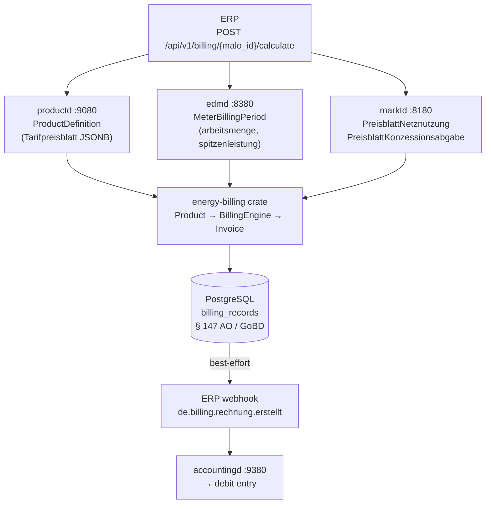
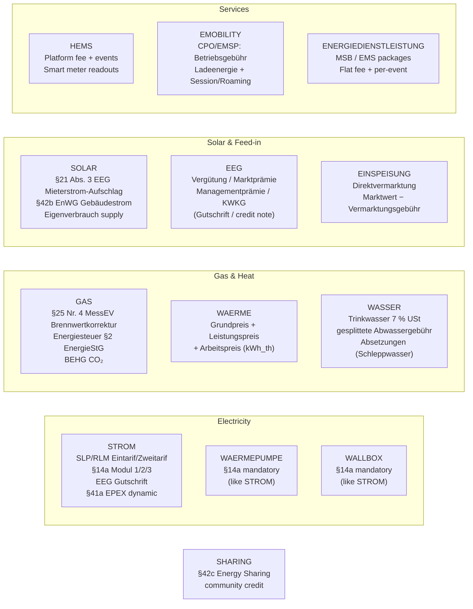
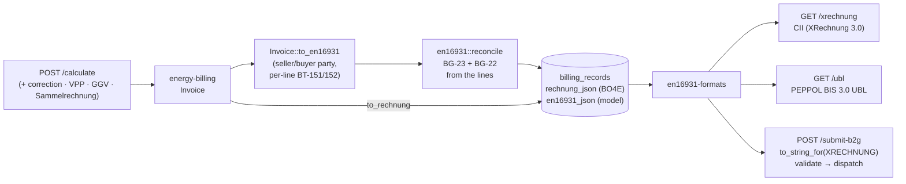
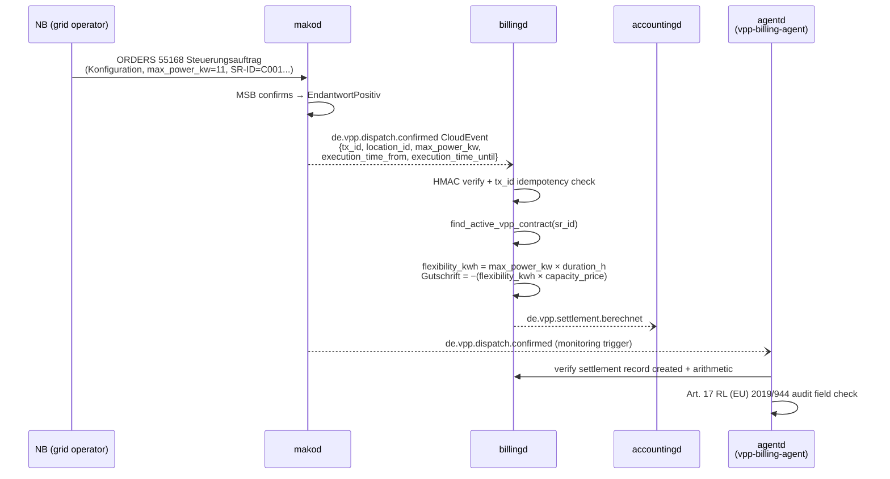

+++
title = "billingd Operator Guide"
description = "billingd operator guide: Multi-Product Billing Engine (LF role). Energy billing engine — user-defined product prices from productd; 13 categories (STROM/GAS/WAERME/WASSER/SOLAR/EEG/EINSPEISUNG/WAERMEPUMPE/WALLBOX/HEMS/EMOBILITY/ENERGIEDIENSTLEISTUNG/SHARING); §41a EPEX dynamic; §25 Nr. 4 MessEV Brennwertkorrektur; §14a Modul 1/2/3; EN 16931 e-invoicing (XRechnung 3.0 CII + PEPPOL UBL; B2G per §4a EGovG/ERechV, B2B per §14 UStG)."
weight = 32
[extra]
mermaid = true
+++
# `billingd` — Multi-Product Billing Engine

`billingd` is a **pure calculation service**. It has no grid topology knowledge and no
business policy — all decisions come from the product definition in `productd` and the
measurement data in `edmd`.

Port: **`:9280`**

---

## Why pure calculation?

Every billing run is **deterministic and reproducible**: given the same inputs (product, meter,
tariff), the output is always the same `Rechnung`. This means:

- BNetzA § 147 AO / GoBD compliance: auditors can re-run the calculation from stored inputs
- No hidden state: all inputs are either stored in `productd`, `edmd`, or `marktd`
- Testable: `energy-billing` is exhaustively covered (property-based, golden master, integration) — zero I/O, zero async, all pure Rust

---

## Architecture: `energy-billing` crate

The pure billing logic lives in the **`energy-billing`** crate (extracted from `billingd`).
This follows the same pattern as `eeg-billing` for `einsd`:

```
billingd (HTTP service)
    │   config · persistence · CloudEvents · EN 16931 e-invoicing
    │   HTTP endpoints · productd/edmd/marktd clients
    │
    └── energy-billing (pure crate, crates.io)
            │   Product (typed enum, 13 variants)
            │   Quantities · BillingContext · RegulatoryRates
            │   BillingEngine (provider pipeline, validate + bill + bill_batch)
            │   Invoice { positions, warnings, netto_eur, mwst_eur, brutto_eur }
            │
            ├── ElectricityProvider      §41a EPEX; HT/NT; block tariffs; RLM demand
            ├── ControllableLoadProvider §14a Modul 1/2/3 (WAERMEPUMPE, WALLBOX)
            ├── GasProvider              §25 Nr. 4 MessEV Brennwertkorrektur; BEHG CO₂
            ├── HeatProvider             Fernwärme (standard-rated; 7% only in the §28 window)
            ├── WaterProvider            Trinkwasser 7% USt; Abwasser gesplittet; Absetzungen
            ├── SolarProvider            §21 Abs. 3 EEG Mieterstrom; §42b EnWG GGV
            ├── EegProvider              LF-side Gutschrift; contractual §51
            ├── EinspeisungProvider      Direktvermarktung Marktwert
            ├── HemsProvider             Platform subscription + events
            ├── EmobilityProvider        CPO/EMSP
            ├── ServiceProvider          Energiedienstleistung
            ├── DynamicElectricityProvider  §41a per-interval EPEX (§41a iMSys guard)
            ├── EnergyShareProvider      §42c Energiegemeinschaft credit
            └── MwStProvider             Multi-rate MwSt (7% / 19% / 0% per position)
```

`energy-billing` is **zero I/O, zero async** — `BillingEngine::bill()` is a pure function
returning `Result<Invoice, EngineError>`; each error variant carries a stable
machine-readable `code()` that `billingd` surfaces in structured error bodies.
`Invoice` carries `positions: Vec<BillingPosition>`, `warnings: Vec<BillingWarning>`, and
exposes `to_rechnung()` — a fully-typed `rubo4e::Rechnung` (Decimal-exact money;
canonical BO4E fields: `rechnungstyp`, `istStorno`, `originalRechnungsnummer`,
`faelligkeitsdatum`, `zuZahlen`, typed `marktlokation`/`zaehler`/`vertrag`;
mako-specific §40b/§40-Abs.-2 facts ride as `zusatzAttribute`).
`to_rechnung_json()` is its thin serialization wrapper (JSONB for `accountingd`
ingestion and the stored `billing_records.rechnung_json`).

**`rechnungspositionen` are net supply lines only.** BO4E states that
`gesamtnetto` is „Die Summe der Nettobeträge der Rechnungsteile" and expresses
tax as `steuerbetraege`/`gesamtsteuer` and advances as
`vorauszahlungen`/`zuZahlen` — so the `Tax` and `Abschlag` positions the engine
carries in its flat vector are **not** positions on the wire. Emitting either as
a position states the amount twice and leaves `gesamtnetto` irreconcilable
against the position vector — the same defect `invoic-checker` disputes when a
counterparty sends it. `BillingPosition::is_rechnungsposition` is the shared
predicate for the BO4E mapping, the EN 16931 mapping and billingd's
Sammelrechnung position index. `Info` positions stay — they carry
`net_eur == 0`, so they change no sum, and § 40 EnWG wants the Zählerstand and
Brennwert lines on the document.

Every shape the engine can emit is asserted against
[the outbound BO4E gate](@/docs/architecture/domain-model.md#the-bo4e-gate) in
tests, and the Sammelrechnung — assembled at runtime from many invoices —
crosses it again before it is stored.
Helper methods: `.assert_valid()`, `.total_by_tag()`, `.positions_by_tag()`,
`.kilowattstundenpreis_brutto_ct()`, `.has_errors()`.

Statutory rates (Stromsteuer, Energiesteuer Gas, BEHG CO₂) are injected via `RegulatoryRates`
from `billingd.toml` — zero hardcoded values in the crate.

---

## Calculation pipeline



---

## Product categories

`billingd` routes each billing request to a category-specific pure calculator.
**All commercial prices are user-defined in `productd`** — the engine contains no hardcoded
rates. Statutory rates (Stromsteuer, Energiesteuer Gas, BEHG CO₂) are configured in
`billingd.toml` under `[rates]` and can be overridden per-product.



### STROM — Electricity

```
Grundpreis              [from productd]     ct/day
Arbeitspreis            [from productd]     ct/kWh
Leistungspreis          [from productd]     ct/kW/month  RLM demand charge on spitzenleistung_kw
NNE Grundpreis          [from marktd]      pass-through
NNE Arbeitspreis        [from marktd]      pass-through
NNE Leistungspreis      [from marktd]      RLM only (EUR/kW/month)
Konzessionsabgabe       [from marktd]      pass-through
§14a Modul 1 pauschale  [if product set]   negative EUR/kW/year
§14a Modul 2 AP-Redukt. [if product set]   negative ct/kWh (device's own metering)
§14a Modul 3 HT/ST/NT   [if product set]   three Tarifstufen, replace the flat NNE
§14a Steuerungsentsch.  [if product set]   negative, pro-rated to load-shedding hours
EEG Gutschrift          [from einsd]       negative, if PV self-consumption
Stromsteuer             [from billingd.toml, overridable per-product]  ct/kWh
──────────────────────────────────────────────────
Netto
MwSt [from billingd.toml or product override]
Brutto
```

Variants: `Eintarif`, `Zweitarif` (HT/NT), `Mehrtarif` (multiple registers).
**§41a EPEX dynamic**: when `dynamic_epex = true` in the product, `billingd` fetches
15-min Lastgang and 15-min EPEX MTU prices from `productd`. `arbeitspreis_ct_per_kwh` is
ignored; the per-MTU price is spot + `auf_abschlag_ct_per_kwh`.

**RLM demand charge**: For large commercial customers with measured peak demand (§ 12 StromNZV,
≥100 MWh/year), set `leistungspreis_strom_ct_per_kw_month` in the product definition.
`billingd` bills `spitzenleistung_kw × rate` as a `Leistungspreis` position.
Supply `spitzenleistung_kw` from `edmd` MeterBillingPeriod. Applies to `metering_mode: RLM`
or `Imsys` metering points.

### GAS — Natural Gas

```
Brennwertkorrektur      [informational]    m³ × Hs × Z → kWh_Hs  (§25 Nr. 4 MessEV)
Grundpreis Gas          [from productd]     ct/day
Arbeitspreis Gas        [from productd]     ct/kWh_Hs
Gasnetzentgelt GP       [from marktd]      pass-through
Gasnetzentgelt AP       [from marktd]      pass-through
Konzessionsabgabe Gas   [from marktd]      pass-through
Bilanzierungsumlage Gas [from marktd]      pass-through
Energiesteuer Erdgas    [from billingd.toml] § 2 Abs. 3 S. 1 Nr. 4 EnergieStG
                                             0.55 ct/kWh_Hs
                        OR Exemption notice when energiesteuer_tarif = BEFREIUNG
                           (§§ 25–28 EnergieStG, Erlaubnis nach § 24 Abs. 2)
Entlastungshinweis      [informational]    § 53a / § 54 EnergieStG — the levy is
                                           billed in full; the customer files
CO₂-Abgabe BEHG         [from billingd.toml] ~1.31 ct/kWh_Hs (65 EUR/t CO₂, 2026)
MwSt                    [from billingd.toml] 19%
```

Since 2026 the nEHS certificate price is **auction-formed** (§10 Abs. 1 BEHG:
weekly EEX auctions from 01.07.2026 within the 55–65 EUR/t corridor,
Verkaufsphase at 68 EUR/t), so on the live bill/preview paths billingd
overlays the **dated market price** from productd's `nehs_prices` series onto
the year-table default. Resolution order: explicit `[rates]` override →
`GET /api/v1/nehs-prices/latest?date={period_from}` (start-of-period basis,
consistent with `regulatory_rates_for_period`; converted via
`energy_billing::behg_ct_per_kwh_from_price`) → year-table fallback. The
EUR/t→ct/kWh conversion uses the H-Gas CO₂ factor (0.20160 kg/kWh) unless
`[rates] behg_co2_factor_kg_per_kwh` overrides it (L-Gas: 0.20140).
Historical XRechnung re-renders keep the stored record's rates
(CO2KostAufG §3: the pass-through follows the supplier's actual CO₂ costs at
billing time).

**Historic statutory rates:** For retroactive correction invoices, the year tables in
`energy_billing::rates` apply the correct historical defaults: `effective_stromsteuer_for_year()`,
`effective_energiesteuer_gas_for_year()` (heating gas has been a constant 0.55 ct/kWh_Hs —
the 2022 Energiesteuersenkungsgesetz reduced motor-fuel rates only) and
`effective_behg_gas_for_year()`. VAT history is commodity-aware:
`mwst_rate_for_period()` covers the 2020 COVID 16 % window, and
`mwst_rate_for_gas_waerme_period()` additionally covers the **7 % gas/Fernwärme window
01.10.2022–31.03.2024** (§28 Abs. 5/6 UStG).

### A period crossing a rate boundary is refused, not guessed

A period straddling a statutory boundary has **no** correct single rate, so
billingd **refuses** it with `422` rather than choosing one:

```json
{
  "error": {
    "code": "ZEITRAUM_UEBERSCHREITET_SATZGRENZE",
    "category": "GAS",
    "period_from": "2024-03-01",
    "period_to": "2024-04-30",
    "stichtage": ["2024-04-01"],
    "legal_basis": "§28 Abs. 5/6 UStG (Gas/Fernwärme), §10 BEHG"
  }
}
```

Split at each Stichtag and bill the parts. The refusal names them because
"period rejected" alone is not actionable — `energy_billing::steuer_stichtage_im_zeitraum`
computes them, covering both the USt windows (commodity-aware: electricity never
had the 7 % window) and the §10 BEHG CO₂ price, which steps at every calendar-year
boundary for gas.

This matters because the failure is invisible downstream. A gas period crossing
31.03.2024 billed whole at 19 % overcharges the March portion, which was legally
7 %, and the resulting invoice is indistinguishable from a correct one. An
explicitly configured `[rates] mwst_rate` suppresses the refusal — that is the
operator taking the decision themselves.

Supply `gas_meter.messung_qm3` + `brennwert_kwh_per_qm3` + `zustandszahl` in the request.
`billingd` computes `kWh_Hs = m³ × Hs × Z` and uses it for all price positions.

**`gasqualitaet`:** Supply the optional `gasqualitaet` field from
`marktd.malo.gasqualitaet` — `"H_GAS"` or `"L_GAS"`, the only two values BO4E
v202607 defines and the only two the column's `CHECK` constraint accepts. The
field does **not** alter the billing amount: per DVGW G 260, `edmd` already
reports the measured Brennwert, which reflects the actual gas composition.
`billingd` records `gasqualitaet` as a `ZusatzAttribut` on the `Rechnung` for
audit transparency.

An H2-blend quality is **not** representable today, and deliberately so: BO4E has
not standardised a wire value for it, and inventing one would persist rows that
stay wrong when the 2026–2028 DVGW/BNetzA wave lands with a different spelling.
Adopting one is a BO4E schema bump plus an AHB code, at which point the mapping
goes in `mako_geli_gas::gas_quality`.

### WAERME — District Heat (Fernwärme)

```
Grundpreis Fernwärme    [from productd]     EUR/month
Leistungspreis          [from productd]     EUR/kW/month × peak kW
Arbeitspreis            [from productd]     ct/kWh_th
MwSt
```

### SOLAR — Mieterstrom (§ 42a EnWG) / GGV (§ 42b EnWG)

```
Arbeitspreis Solar      [from productd]     ct/kWh  the PV supply price
GGV-Preisvorteil        [from productd]     ct/kWh  contractual, § 42b Abs. 2 Nr. 2 EnWG
Preisobergrenze         [informational]     § 42a Abs. 4 EnWG — 90 % of the stated
                                            Grundversorgungs-Arbeitspreis; a price above
                                            it is refused, not billed
Stromsteuer             none by default     § 9 Abs. 1 Nr. 3 StromStG — the ground is
                                            **stated** on the invoice, not merely omitted
MwSt
```

On a **GGV** invoice the two portions are taxed differently and both appear: the
allocated PV is exempt under § 9 Abs. 1 Nr. 3 and the residual grid draw carries
the full Stromsteuer.

The default is the § 9 Abs. 1 Nr. 3 Kleinanlage-Befreiung because that is what a
rooftop Mieterstrom or GGV supply is — an installation up to 2 MW whose operator
delivers to Letztverbraucher drawing im räumlichen Zusammenhang (lit. b), or
self-consumes (lit. a). § 9 Abs. 4 conditions it on the customer's Erlaubnis,
which is why the page names the ground. A supply that does not qualify sets
`stromsteuer_tarif = {"art": "REGEL"}`.

The **Mieterstromzuschlag (§ 21 Abs. 3 EEG 2023)** is deliberately absent: it is
the Anlagenbetreiber's claim against the Netzbetreiber, settled by `einsd`, and
never a surcharge on the tenant.

### EEG — Feed-in Settlement (Gutschrift)

Credit note for feed-in plant operators. §19 Abs. 1 EEG 2023 is the
Zahlungsanspruch; which Veräußerungsform it takes — §20 Marktprämie (geförderte
Direktvermarktung) or §21 Abs. 1 Einspeisevergütung — belongs to the plant and is
decided by `einsd`:

```
EEG Einspeisevergütung  [from productd]     ct/kWh (credit)
EEG Marktprämie         [from productd]     ct/kWh (credit, per settlement period)
Managementprämie        [from productd]     ct/kWh §53 EEG (fixed by technology)
KWKG Zuschlag           [from productd]     ct/kWh (credit, if applicable)
MwSt
```

Net result is typically negative brutto (the LF pays the producer).

> **LF vs NB for §51 EEG Negativpreisregel**
>
> The mandatory §51 EEG implementation (suspension of Vergütung during negative-EPEX hours)
> lives in `eeg-billing` / `einsd` — this governs the **NB paying the plant operator** under
> the statutory EEG.
>
> The `EEG` category in `billingd` is for the **LF** (private contractual billing): Mieterstrom
> §38a contracts and Direktvermarktung arrangements where the LF is the contracting party.
> These are **private law contracts** not subject to statutory §51.
>
> For contracts that **voluntarily mirror §51** (e.g. "no credit during negative hours"):
> supply `eeg_meter.kwh_during_negative_epex` to suspend Vergütung/Marktprämie for those kWh.
> KWKG Zuschlag is always exempt (different law).
>
> **Kleinunternehmer (§19 UStG)**: a small feed-in operator who has elected the
> Kleinunternehmerregelung issues the Gutschrift at 0 % USt — set
> `kleinunternehmer_19_ustg: true` in the product definition in `productd`. This
> is the operator's tax election, not a function of plant size (§12 Abs. 3 UStG
> zero-rates the PV *system* supply, which this engine does not bill).

### EINSPEISUNG — Direktvermarktung Settlement

```
Marktwert Strom         [from productd]     ct/kWh (EPEX Spot Monatsmarktwert)
Vermarktungsgebühr      [from productd]     ct/kWh negative (aggregator fee)
MwSt
```

### WAERMEPUMPE / WALLBOX — §14a Controlled Loads

Identical to `STROM` but §14a positions are appended by `ControllableLoadProvider`,
which delegates standard electricity billing to `ElectricityProvider`.

BNetzA **BK6-22-300** defines exactly three modules, and the numbering is printed
on the invoice and shared with the NB-side `grid-billing` engine:

| Modul | What it is | Field |
|---|---|---|
| **1** | *pauschale Reduzierung des Netzentgelts* — needs no extra metering, so it is the default where the connection holder makes no choice | `sect14a_modul1_pauschale_eur_per_kw_year` |
| **2** | *prozentuale Reduzierung des Arbeitspreises* — attaches to the device's **separately metered** energy | `sect14a_modul2_nne_reduktion_ct_per_kwh` |
| **3** | *zeitvariable Netzentgelte* (from 01.04.2025) — three Tarifstufen HT/ST/NT, requires an iMSys | `sect14a_modul3_nne_ht/st/nt_ct_per_kwh` + `sect14a_modul3` quantities |

**Modul 2 and Modul 3 are mutually exclusive** — both re-price the Arbeitspreis, so
holding both would reduce the same network usage twice. Configuring both is refused
with `MODUL2_AND_MODUL3`. Modul 1 composes with either. Setting the Modul 3 bands
alongside a flat NNE Arbeitspreis is refused with `MODUL3_AND_FLAT_NNE`, for the
same double-charging reason.

A **Steuerungsentschädigung** (`sect14a_steuerungsentschaedigung_ct_per_kwh` /
`_eur_per_kw_year`) compensates a dispatch that actually happened. It carries no
module number: all three BK6-22-300 modules are rate reductions, none of them a
payment for a Steuerungseingriff.

### HEMS / EMOBILITY / ENERGIEDIENSTLEISTUNG

```
HEMS: Platform fee (EUR/month) + Optimization events + Smart meter readouts
EMOBILITY: Betriebsgebühr (EUR/month) + Ladeenergie (ct/kWh) + Session/Roaming fees
ENERGIEDIENSTLEISTUNG: Flat fee (EUR/period) + per-event charge
```

**A bundle is not a category here.** `productd` carries `BUNDLE` and decomposes it
into component product codes; `billingd` bills each component, so `BUNDLE` never
appears in a `billing_records` row and is absent from its category CHECK.

---


---

## Product and tariff model

### Product — type-safe dispatch

`Product` is a typed enum deserialized directly from `productd` JSONB using the `"category"`
discriminator. Call `product.build_engine(&grid, &rates)` to obtain a configured `BillingEngine`:

```rust
// Deserializes from {"category":"STROM","arbeitspreis_ct_per_kwh":"32.0",...}
let product: Product = serde_json::from_str(&product_json)?;
let engine = product.build_engine(&grid, &rates);
// No more Option<BillingEngine> or PricingModel::try_from() needed
let invoice = engine.bill(ctx, &quantities)?;
```

`Product` has 13 exhaustive variants, each wrapping a typed per-category struct:
`Strom(ElectricityProduct)`, `Waermepumpe/Wallbox(ControllableLoadProduct)`,
`Gas(GasProduct)`, `Waerme(HeatProduct)`, `Wasser(WaterProduct)`, `Solar(SolarProduct)`,
`Eeg(EegProduct)`, `Einspeisung(EinspeisungProduct)`,
`Hems(HemsProduct)`, `Emobility(EmobilityProduct)`, `Energiedienstleistung(ServiceProduct)`,
`Sharing(SharingProduct)`.

### Regulatory additions

| Addition | Law |
|---|---|
| `kleinunternehmer_19_ustg` → 0% USt on feed-in Gutschrift | §19 UStG |
| `stromsteuer_tarif` → Befreiung (levy dropped) or Ermäßigung (reduced rate) | § 9 Abs. 1 / Abs. 2 / Abs. 3 StromStG |
| `steuerentlastungen` → informational note, levy billed in full | § 9a/9b/9c StromStG, §§ 53a, 54 EnergieStG |
| `grundversorgung_arbeitspreis_ct_per_kwh` → Mieterstrom capped at 90 % | § 42a Abs. 4 EnWG |
| `waerme_co2_kosten_ct_per_kwh` → CO₂ cost line + emissions disclosure | CO2KostAufG § 3 |
| `settlement_form` → Endrechnung (BT-113 paid) or Restrechnung (BG-20 allowance per rate) | § 14 Abs. 5 Satz 2 UStG; BMF 15.10.2024 Rn. 48 |
| `en16931_blocked` → `MODEL_NOT_REPRESENTABLE` instead of an invalid e-invoice | EN 16931 BR-O-11 ff. |
| `ablesungsart` → how the reading was obtained, beside the readings | § 40 Abs. 2 Nr. 6 EnWG |
| `ZWEITARIF_OHNE_HT_NT_AUFTEILUNG` / `HT_NT_SUMME_WEICHT_AB` → refused, not under-billed | § 41 EnWG |
| `preisgarantie_bis` → disclosure on invoice | §41 Abs. 1 Nr. 4 EnWG |
| `MeteringMode` (SLP/RLM/iMSys) on MeterInput | §3/§ 12 StromNZV, §31 MsbG |
| `is_estimated` flag → § 60 Abs. 2 MsbG notice | § 60 Abs. 2 MsbG |
| `zaehler_replaced` flag → Zählerwechsel notice | §41 EnWG |
| `Sect41aAnnualComparison` in Quantities | §41a Abs. 6 EnWG |
| `InvoiceType::PartialInvoice` | §41 EnWG, StromGVV §17 |

### A period is billed in legs

An invoice covers a period, and two things can split it. Both get the same
answer: bill each leg under its own product and its own statutory rates, and
merge the legs into one document — which is what § 41 Abs. 1 Nr. 4 EnWG asks
for anyway, the old and the new price itemised with the periods they applied to.

| Split at | Detected from |
|---|---|
| a **Tarifwechsel** | `vertragd` reports more than one product-assignment slice covering the period |
| a **statutory Stichtag** | a VAT or levy regime changes inside the period — gas at 31.03.2024 (§ 28 Abs. 5/6 UStG) is 7 % before and 19 % after |

The § 40b sweep, `POST /calculate` and `POST /tarifwechsel` all take this path.
Each leg's **meter reading is fetched for its own dates**, and each leg gets the
§ 40 enrichment every other invoice has: contract facts, Zählernummer,
consumption comparison, BG-7 buyer, § 13b derivation.

A leg whose reading the **caller supplied by hand** is not split further —
nothing can apportion a given reading across a boundary — and is refused with the
Stichtage named.

The billing record of a split period is filed under `category = TARIFWECHSEL`
and a `product_code` naming every product the period touched
(`STROM-ALT+STROM-NEU`), so the record says which prices the document contains.

### Tarifwechsel endpoint

For a switch whose two meter readings the operator already holds — a hand-split
that `edmd` cannot reproduce:

```http
POST /api/v1/billing/{malo_id}/tarifwechsel
Content-Type: application/json

{
  "lf_mp_id":    "9910000000002",
  "period_from": "2026-01-01",
  "period_to":   "2026-01-31",
  "switch_date": "2026-01-15",
  "old_tariff":  { "category": "STROM", "arbeitspreis_ct_per_kwh": "28.0" },
  "new_tariff":  { "category": "STROM", "arbeitspreis_ct_per_kwh": "32.0" },
  "old_meter":   { "arbeitsmenge_kwh": "140" },
  "new_meter":   { "arbeitsmenge_kwh": "170" }
}
```

The scheduled sweep needs none of this: it reads the slices from `productd` and
the per-leg readings from `edmd` itself.

### Pro-rata Grundpreis (move-in / move-out)

`billingd` pro-rates Grundpreis when `vertragsbeginn` or `vertragsende` falls
within the billing period. Pass these in the `BillingContext`:

```json
{
  "vertragsbeginn": "2026-01-16"
}
```

A customer joining on Jan 16 is billed 16 × rate instead of 31 × rate.
A customer who moves in mid-period is charged the standing rate for the days
supplied, not the full period.

### Audit trail

Every billing run generates a unique `billing_run_id` (UUID v4). It is stored on
`Invoice.billing_run_id` and propagated to:

- `billing_records.billing_run_id` in PostgreSQL
- `rechnung_json.zusatzAttribute["mako:billing_run_id"]`

This links each database record to the exact calculation output for § 147 AO / GoBD compliance.

## Triggering a billing run

```http
POST /api/v1/billing/51238696012/calculate
Content-Type: application/json

{
  "lf_mp_id":   "9910000000002",
  "nb_mp_id":   "9900000000001",
  "period_from": "2026-06-01",
  "period_to":   "2026-06-30",
  "rechnungsnummer": "R2026-06-001"
}
```

`billingd` automatically fetches:
1. Product from `productd GET /api/v1/customer/51238696012/product`
2. Meter data from `edmd GET /api/v1/billing-period/51238696012?from=...&to=...`
3. NNE tariff from `marktd GET /api/v1/preisblaetter/{nb_mp_id}`
4. KA tariff from `marktd GET /api/v1/preisblaetter-ka/{nb_mp_id}`

**Override any input** by passing it directly in the request body — useful for testing
or when the upstream service is temporarily unavailable:

```http
POST /api/v1/billing/51238696012/calculate
Content-Type: application/json

{
  "lf_mp_id": "9910000000002",
  "nb_mp_id": "9900000000001",
  "period_from": "2026-06-01",
  "period_to": "2026-06-30",
  "meter": {
    "arbeitsmenge_kwh": "312.5",
    "sparte": "STROM"
  },
  "tariff": {
    "category": "STROM",
    "grundpreis_ct_per_day": "20.0",
    "arbeitspreis_ct_per_kwh": "32.0"
  }
}
```

### §41a Dynamic Tariff (iMSys)

When the product in `productd` has `dynamic_epex: true`, `billingd` automatically:

1. Fetches the 15-min **Bezug** series from `edmd`
   (`GET /api/v1/energy/{malo_id}?direction=BEZUG&from=…&to=…`) — the canonical
   register projection, **not** `/lastgang`. That endpoint returns one BO4E object
   per OBIS register, and folding them together unfiltered would bill a prosumer's
   Einspeisung as grid draw, add a dual-tariff meter's `1.8.1`/`1.8.2` to the
   `1.8.0` they decompose, and price a `1-0:1.6.0` peak-demand register in **kW**
   as energy — each at a dynamic price, against a §41a customer. The window is
   bounded by **Berlin midnights** — a billing period is a run of German
   calendar days, and a UTC-midnight window would drop the period's first four
   quarter-hours and pick up four belonging to the next one
2. Fetches 15-min EPEX prices from `productd` (`GET /api/v1/epex-prices/{date}/quarter-hourly`),
   keyed on each Market Time Unit's UTC start instant (SDAC 15-min go-live 2025-10-01)
3. Calculates `Σ(kWh_MTU × (EPEX_MTU_ct + Aufschlag_ct)) / 100` as the energy cost —
   each 15-min consumption interval is floored to its quarter-hour and joined to that MTU's price
4. Adds NNE / Konzessionsabgabe / Stromsteuer as usual

The `tariff.arbeitspreis_ct_per_kwh` field is ignored when `dynamic_epex: true` — the EPEX
spot price from `productd` is the actual price applied per 15-min MTU, plus the supplier's
fixed `auf_abschlag_ct_per_kwh` Arbeitspreis-Aufschlag (§41a: market price + margin).

**Price floor (`dynamic_epex_floor_ct_kwh`):** Set this field in the productd product to cap
how low the EPEX price can go. Common configurations:
- `null` (default) — full pass-through; negative EPEX → customer receives a credit
- `0` — zero floor; negative EPEX bills at 0 ct/kWh (no credit, no charge)
- `5` — minimum 5 ct/kWh regardless of spot price

```json
{
  "category": "STROM",
  "dynamic_epex": true,
  "dynamic_epex_floor_ct_kwh": "0"
}
```

**There is no fallback.** A §41a tariff is billed per market time unit against
verifiable market prices, or it is not billed:

| Situation | Answer |
|---|---|
| no 15-minute Lastgang for the period | `422 SECT41A_NO_LASTGANG` |
| `edmd` unreachable | `502 UPSTREAM_UNAVAILABLE` |
| intervals with consumption but no EPEX price | `422 VALIDATION_BLOCKED` / `SECT41A_MISSING_EPEX_PRICES` |
| the meter is not an iMSys | `422 VALIDATION_BLOCKED` / `SECT41A_IMSYS_REQUIRED` |

Every one of these is an error rather than a fallback. Billing the static
`arbeitspreis_ct_per_kwh` instead would charge a price the dynamic contract does
not contain, and degrading to an empty interval list is worse still: the dynamic
provider then prices *nothing*, and the invoice goes out with the Grundpreis
alone — no Arbeitspreis, no Stromsteuer, no NNE-Arbeitspreis — looking entirely
ordinary.

The §41a Abs. 1 iMSys guard reads the meter's `metering_mode`, so the dynamic
path resolves a meter reading even though pricing comes from the Lastgang alone;
that reading also carries the §40 Abs. 2 Nr. 6 register readings and the §40a
estimation flag.

```http
POST /api/v1/billing/51238696012/calculate
Content-Type: application/json

{
  "lf_mp_id": "9910000000002",
  "nb_mp_id": "9900000000001",
  "period_from": "2026-06-01",
  "period_to": "2026-06-30",
  "tariff": {
    "category": "STROM",
    "grundpreis_ct_per_day": "5.0",
    "dynamic_epex": true
  }
}
```

> EPEX prices must be imported daily into `productd` via `PUT /api/v1/epex-prices/{date}`.

---

## Authorization

Authentication establishes *who* is calling; `policies/billingd.cedar` decides
what they may do. Every business route evaluates one action before it touches
the database.

| Action | Routes | Who |
|---|---|---|
| `read-billing` | `GET /api/v1/billing…`, `/review-queue`, `/xrechnung`, `/ubl`, `/pdf` | any authenticated caller in the tenant |
| `issue-billing` | `POST /api/v1/billing/{id}/versenden` | `LF`, `MSB`, `ESA` |
| `preview-billing` | `POST …/preview` | any authenticated caller in the tenant |
| `run-billing` | `/calculate`, `/tarifwechsel`, `/sammelrechnung/…`, `/ggv/…` | `LF`, `MSB`, `ESA` |
| `settle-flexibility` | `POST /api/v1/billing/vpp/{vpp_id}` | `LF`, `MSB`, `ESA` |
| `correct-billing` | `POST …/{id}/correction` | `LF`, `MSB`, `ESA` |
| `release-billing` | `POST …/{id}/release` | `LF`, `MSB`, `ESA` |
| `submit-b2g` | `POST …/{id}/submit-b2g` | `LF`, `MSB`, `ESA` |

Tenant equality is a condition of every rule, so no role reaches another
operator's data — not even for a read. Cedar is deny-by-default, so an action no
policy names is refused rather than defaulted.

Authentication establishes who is calling; the policy establishes what they may
do. Without one, any token the OIDC verifier accepts could reverse an invoice
the customer has already received, or release one the risk gate is deliberately
holding back — which is the gate's entire purpose.
[`einsd`](@/docs/services/einsd.md), the analogous service on the feed-in side,
gates the same way.

A preview counts as a **read**: it persists nothing and emits nothing.

The MCP surface is authenticated separately by `[mcp]` and is read-only by
construction; the VPP dispatch webhook is HMAC-authenticated. Neither carries a
Cedar action.

### What is deliberately not enforced

Separating "may run billing" from "may release a held invoice" is a real control
and this policy does not implement it. `mako_roles` carries **market** roles —
`NB`, `LF`, `MSB`, `ESA`, `UENB` — not job functions, and a policy naming a
`BUCHHALTUNG` or `CONTROLLING` role that no identity provider in this platform
issues would deny every caller. An endpoint nobody can reach is worse than one
reachable by too many. `released_by` and `released_at` record who released what,
so the action stays attributable.

---

## A product that cannot price its commodity is refused

`energy-billing` carries `KEIN_ARBEITSPREIS` at **Error** severity in its
validation pass, so `bill()` refuses rather than issuing.

The `Product` price fields are populated by mapping `productd`'s `preistyp`
strings onto struct fields. A renamed position, a typo in the mapper, or a
catalog row saved without its price maps to `None` — in silence. The resulting
invoice was not an error: a STROM product with every price field absent billed
1000 kWh for **€20.50**, the Stromsteuer and nothing for the electricity, and
looked entirely ordinary on paper. The risk gate caught it only where a rolling
baseline already existed, and then only into the SAMPLE band, which dispatches.

The guard asks whether the product can price its commodity *at all* — Eintarif,
HT/NT, dynamic, indexed, seasonal or tiered all satisfy it — and covers Strom,
Gas and Fernwärme. An operator who genuinely charges nothing per kWh states a
`0.0`: that is how a decision is distinguished from missing data.

Water has the same failure mode and it is harder to see, because the invoice is
not empty. The Schmutzwassergebühr rides the Frischwassermaßstab, so a tariff
that prices only the Abwasser side produces a full, plausible Gebühr and nothing
for the drinking water delivered. `KEIN_TRINKWASSERPREIS` refuses it.

### The quantity side

A provider can also fail to price the quantity it is *handed*. On the § 41a path
the quarter-hour series **is** the billed quantity: Arbeitspreis, Netzentgelt,
Konzessionsabgabe and Stromsteuer all ride the sum of the priced intervals, and
nothing reads the register total. A short Lastgang therefore bills every levy on
the days that happened to import, and states no shortfall.

The register total is the independent witness:

| Finding | Refuses |
|---|---|
| `SECT41A_KEINE_INTERVALLE` | no series at all, against a meter reporting consumption |
| `SECT41A_INTERVALLSUMME_WEICHT_AB` | a series missing the meter total by more than 0,5 % (1 kWh floor — an interval sum and a difference of two readings never agree exactly) |

billingd refuses an empty Lastgang earlier still, as `SECT41A_NO_LASTGANG`; the
engine guards cover every other caller.

---

## Idempotency and the number series

### The Rechnungsnummer is a counter

`invoice_number_series (tenant, series, year)` is a per-tenant counter and the
Rechnungsnummer is drawn from it:

| Series | Document |
|---|---|
| `RE-2026-000123` | ordinary Rechnung — `/calculate`, Tarifwechsel, the §40b sweep, each participant line of a bundle |
| `SR-2026-000004` | consolidated document — B2B Sammelrechnung, §42b GGV bundle |
| `ST-2026-000002` | Storno- / Korrekturrechnung |
| `VG-2026-000017` | §41e Gutschrift (self-billed VPP settlement) |

A caller may still state its own number — an operator migrating a legacy series,
a test pinning a value.

§14 Abs. 4 Nr. 4 UStG asks for a **fortlaufende** number, which is why the
counter exists rather than a number derived from the billed facts
(`BILL-{malo}-{product}-{period_from}`). A derived number is not sequential and,
more seriously, **not re-issuable**: re-billing a period after a Storno would
regenerate the cancelled original's own string, and `br_unique_rechnungsnummer`
refuses it — so Storno-und-Neuberechnung could not be performed at all.

Numbers are allocated **before** the engine runs, because the number is the
document's BT-1, so a refused calculation leaves a gap. That is legal: UStAE 14.5
Abs. 11 requires that no number be issued twice, not that the sequence be
gapless.

### The two unique indexes

**`br_unique_rechnungsnummer (tenant, rechnungsnummer)`** enforces the *einmalig*
half of §14 Abs. 4 Nr. 4 UStG. The Rechnungsnummer is a first-class column, so a
collision is a write-time database error rather than an audit finding years
later.

**`br_unique_original`** keeps one *live* original per `(malo_id, lf_mp_id,
period_from, period_to, product_code, tenant)`. Its predicate excludes four
kinds of row, and the upsert repeats all four — PostgreSQL cannot infer a
partial index from a column list:

| Excluded | Why |
|---|---|
| `is_correction = true` | a Storno is not an original |
| `sammelrechnung_id IS NOT NULL` | the per-MaLo children of a bundle are its detail, not standalone invoices |
| `outcome = 'cancelled'` | a Storno **releases** the period so it can be re-billed |
| `category = 'VPP'` | several §41e dispatches legitimately settle within one calendar day; `vpp_dispatch_ledger` guards those instead |

### Issued, not "dispatched to an ERP"

Re-running a billing request replaces the existing record **only while it is
withheld** (`outcome = 'generated'`, which in practice means the risk gate held
it). An issued record refuses the overwrite with `409 PERIOD_ALREADY_BILLED`, and
the body names the document that holds the period:

```json
{ "error": { "code": "PERIOD_ALREADY_BILLED",
             "message": "MaLo 51238696012 product STROM-BASIS already carries an issued document for 2026-01-01..2026-01-31; storno it …",
             "record_id": "9f1c…", "rechnungsnummer": "RE-2026-000123",
             "outcome": "dispatched" } }
```

so a client retrying a request whose response it lost reconciles against a record
id instead of a database string.

`outcome` advances to `dispatched` whenever a document is **released**, whether or
not an ERP webhook is configured — the CloudEvent is enqueued *additionally*
where one is. Whether an invoice has been issued is a property of the document,
not of the deployment: writing the stamp only inside
`if erp_webhook_url.is_some()` would leave an operator without an ERP holding
permanent drafts — the overwrite guard unarmed, so a re-run silently rewrites a
document the customer already has, and `pin_template` refusing to pin, so the
PDF re-styles itself with every template rollout.

---

## Errors

Every route answers failures with one envelope and a stable, machine-readable
code:

```json
{ "error": { "code": "ZEITRAUM_UEBERSCHREITET_SATZGRENZE",
             "message": "…",
             "category": "GAS",
             "stichtage": ["2024-04-01"],
             "legal_basis": "§28 Abs. 5/6 UStG (Gas/Fernwärme), §10 BEHG" } }
```

| Code | Status | Meaning |
|---|---|---|
| `INVALID_PERIOD`, `INVALID_DATE`, `SWITCH_DATE_OUTSIDE_PERIOD` | 400 | a malformed, reversed or misplaced date |
| `FORBIDDEN` | 403 | the Cedar policy denied the action |
| `RECORD_NOT_FOUND` | 404 | no such record **in this tenant** |
| `PERIOD_ALREADY_BILLED` | 409 | an issued document holds the period — the body names it |
| `RECHNUNGSNUMMER_IN_USE` | 409 | §14 Abs. 4 Nr. 4 UStG collision |
| `NOT_HELD`, `ALREADY_CANCELLED`, `NOT_YET_ISSUED` | 409 | the record is not in the state the action needs |
| `ZEITRAUM_UEBERSCHREITET_SATZGRENZE` | 422 | the period straddles a rate boundary — the body names the Stichtage |
| `VALIDATION_BLOCKED` | 422 | the engine refused — the body carries every blocking warning |
| `SECT41A_NO_LASTGANG` | 422 | a dynamic tariff with no interval data to price |
| `NO_METER_DATA`, `NO_ACTIVE_PRODUCT` | 422 | `edmd` / `productd` has nothing for this MaLo |
| `MODEL_MISSING`, `XRECHNUNG_NOT_CONFORMANT`, `BT24_NOT_AN_INVOICE` | 422 | the stored EN 16931 model is absent or does not satisfy its own BT-24 |
| `NUTZUNGSPLAN_INVALID`, `NUTZUNGSPLAN_INCOMPLETE`, `RABATT_EXCEEDS_ARBEITSPREIS` | 422 | a §42b GGV input that would mis-bill a participant |
| `UPSTREAM_UNAVAILABLE` | 502 | an upstream did not answer — the body names which |
| `NO_ERP_WEBHOOK` | 503 | a B2G submission with nothing configured to transmit it |

One shape for every failure, so a client matches on `error.code` rather than
sniffing the body to tell a structured refusal from a bare string.

---

## Endpoints

| Method | Path | Description |
|--------|------|-------------|
| `POST` | `/api/v1/billing/{malo_id}/calculate` | Calculate, persist, emit CloudEvent |
| `POST` | `/api/v1/billing/{malo_id}/preview` | Dry-run calculation (no persist, no CloudEvent) |
| `GET` | `/api/v1/billing` | List records (`?malo_id=&lf_mp_id=&outcome=&category=&is_correction=`) — every predicate runs **in the query** |
| `GET` | `/api/v1/billing/{id}` | Fetch single record with full `Rechnung` JSONB |
| `GET` | `/api/v1/billing/{id}/xrechnung` | CII XML of the stored model (via `en16931-formats`); BT-24 is plain EN 16931 for a retail invoice — only the B2G path declares XRechnung |
| `GET` | `/api/v1/billing/{id}/ubl` | PEPPOL BIS Billing 3.0 UBL 2.1 (EN16931) |
| `GET` | `/api/v1/billing/{id}/pdf` | ZUGFeRD PDF/A-3 — the page and the CII XML in one file. Pins the template on first render; a pinned document answers `ETag` + `Cache-Control: immutable`, so `If-None-Match` gets a `304` without a re-render |
| `POST` | `/api/v1/billing/{id}/versenden` | **Issue it to the customer** — the same render, recorded in `outputd` for the § 147 AO eight years and queued on their channels. Idempotent on the Rechnungsnummer; a draft the risk gate holds is `409` |
| `POST` | `/api/v1/billing/{id}/correction` | Stornorechnung; cancels the original and releases its period (§ 147 AO / GoBD) |
| `POST` | `/api/v1/billing/{malo_id}/tarifwechsel` | Combined invoice for mid-period price change (§41 EnWG) |
| `POST` | `/api/v1/billing/sammelrechnung/{rv_id}` | B2B consolidated invoice for a Rahmenvertrag — whole run in one transaction, bundle scored by the risk gate |
| `POST` | `/api/v1/billing/ggv/{ggv_id}` | § 42b EnWG Gebäudestromnutzung, one transaction per run |
| `POST` | `/api/v1/billing/vpp/{vpp_id}` | § 41e dispatch settlement (Gutschrift) |
| `POST` | `/api/v1/webhooks/vpp-dispatch` | `de.vpp.dispatch.confirmed` auto-settlement (HMAC). Settles only when `sender_mp_id` is the contracted `aggregator_mp_id` — a § 14a Steuerung by the Netzbetreiber rides the same PID 55168 and is recorded, not paid |
| `GET` | `/api/v1/billing/review-queue` | Analyst work list — REVIEW + HELD, highest risk first |
| `POST` | `/api/v1/billing/{id}/release` | Release a HELD record for dispatch |
| `POST` | `/api/v1/billing/{id}/submit-b2g` | XRechnung B2G submission (§ 4a EGovG i.V.m. ERechV) |
| `GET` | `/health/live` | Liveness |
| `GET` | `/health/ready` | Readiness |
| `POST\|GET` | `/mcp` | MCP Streamable HTTP (LLM tooling) |

---

## MCP server

`billingd` ships a built-in MCP server at `/mcp` (Streamable HTTP 2025-11-25).
**Eleven tools** and six prompts are available to LLM agents, and every one of
them is **read-only**.

There is deliberately no `calculate_billing`. Issuing a Rechnung is a legally
binding act: the row lands in `billing_records` under § 147 AO, the event
reaches the ledger and the ERP, and only a Stornorechnung undoes it. Model
output is untrusted input everywhere else in this platform, and that rule does
not stop at a well-phrased tool description — an agent investigates and
explains, a human or a scheduled run with an OIDC identity bills.

The tools also run **in process** rather than looping back over the service's
own HTTP API. A loopback carried no bearer token, so with `[oidc]` configured —
that is, in every real deployment — the mutating and preview tools answered
`401`. They worked exactly where they mattered least.

| Tool | Description |
|---|---|
| `list_billing_records` | List records for a MaLo — summary without full `Rechnung` |
| `get_billing_record` | Full BO4E `Rechnung` JSONB for a specific record UUID |
| `preview_billing` | Dry-run preview — same pipeline as `/preview`, no side effects |
| `get_xrechnung` | Fetch XRechnung 3.0 CII XML (from the stored EN 16931 model) |
| `check_billing_anomaly` | Rolling 3-month deviation check — flags invoices outside threshold |
| `list_vpp_settlements` | List VPP aggregation settlement records |
| `list_corrections` | List Korrekturrechnung / Stornorechnung records (§ 147 AO / GoBD) |
| `list_product_categories` | Describe all 13 billing categories and their required product fields |
| `list_corrections` · `list_vpp_settlements` | Storno/Korrektur chains (§ 147 AO) and § 41e settlements. Both filter **in the query**: filtering a fetched page instead would answer "no corrections" for a MaLo whose latest page is all ordinary invoices, while its Stornos sit one page further down |
| `get_billing_summary` | Aggregate stats per MaLo or LF — aggregated in the database over the whole history, counting each euro once (Storno rows and the children of a Sammelrechnung excluded) |
| `validate_tariff_config` | Pre-flight: engine validation (incl. `KEIN_ARBEITSPREIS`) plus the §41a iMSys guard, the legacy Stromsteuer flag and the §42 Energiemix disclosure |
| `explain_invoice_position` | Full `PositionTrace` audit for a given position (formula, §-refs) |

| Prompt | Description |
|---|---|
| `order-to-cash` | Full O2C: GPKE Lieferbeginn → Jahresabschluss |
| `preview-invoice` | Step-by-step: preview before committing a billing run |
| `check-dynamic-tariff` | Verify §41a EPEX tariff configuration |
| `14a-steuerungsrabatt` | Configure §14a Modul 1/3 for Wärmepumpe / Wallbox |
| `eeg-billing` | Set up EEG / EINSPEISUNG billing with double-booking guard |
| `gas-billing` | Configure Brennwertkorrektur, BEHG CO₂, H2-blend, L-Gas |

The `tariff-optimization-agent` in `agentd` calls `list_billing_records` and
`get_billing_summary` to detect customers on sub-optimal tariffs and automatically suggests
§41a dynamic tariff switches for iMSys customers.

---

## Korrekturrechnung (§ 147 AO / GoBD)

`POST /api/v1/billing/{id}/correction` issues a Stornorechnung:

```json
{ "reason": "Falsche Zählerstandsaufnahme Q2 2026" }
```

In one transaction it writes a new record with every monetary position negated
(`is_correction = true`, `originalRechnungsnummer` in `zusatzAttribute`, and its
own number from the tenant's `ST` series), enqueues
`de.billing.rechnung.erstellt` with `is_correction: true` so `accountingd`
books the CREDIT, and advances the original's `outcome` to `cancelled`.

**The correction crosses the BO4E outbound gate before it is booked.** The
original `Invoice` struct is gone by the time a correction is issued, so the
negation runs over the *stored JSON* — the three totals, `zuZahlen`, each
`Steuerbetrag`, each `Vorauszahlung`, and every position's `gesamtpreis` and
`einzelpreis`, each addressed by name. A monetary field the negation missed
would produce a document whose totals disagree, which no receiver can book, so
it is checked with
[the same `ensure_conformant`](@/docs/architecture/domain-model.md#the-bo4e-gate)
the ordinary invoice path uses. The §41e VPP-Gutschrift crosses it for the same
reason: it is assembled from dispatch credits and the aggregator contract's VAT
rate, so no fixture covers its arithmetic, and `accountingd` books a CREDIT off
the event it publishes.

**Storno und Neuberechnung.** Cancelling releases the period: it drops out of
`br_unique_original`, so the corrected amounts are billed by calling
`POST /api/v1/billing/{malo_id}/calculate` again for the same window, which
draws the **next** number of the `RE` series.

Two things have to hold for this to work, and both are easy to break: the
partial index must **not** count a cancelled row as live coverage, and the
number must come from the series rather than the billed facts — a derived one
would regenerate the cancelled original's own Rechnungsnummer and
`br_unique_rechnungsnummer` would refuse *that* instead.

A second Storno of the same original is refused with `409 ALREADY_CANCELLED`: the
first one set `outcome = cancelled`, and a double negation would corrupt the
ledger.

A record that was **never issued** is refused with `409 NOT_YET_ISSUED`.
`outcome = generated` means the risk gate withheld the document *and its
CloudEvent*, so `accountingd` booked no DEBIT for it and a Storno would post an
unbalanced CREDIT against nothing. A draft is outside `br_unique_original`'s
overwrite guard anyway: bill the period again (`POST …/calculate` replaces it)
or release it (`POST …/release`) and correct the issued invoice.

The original's **content** is never modified — only its outcome. Both documents
stay in `billing_records` for the statutory **eight years** (§ 147 Abs. 3 AO
for a Buchungsbeleg, reduced from ten by the BEG IV with effect from
01.01.2025).

---

### ENERGIEDIENSTLEISTUNG products

When `tariff.category == "ENERGIEDIENSTLEISTUNG"`, `billingd` deserializes the product JSON to
`Product::Energiedienstleistung(ServiceProduct)` and builds a `ServiceProvider`:

```json
{
  "lf_mp_id": "9910000000002",
  "nb_mp_id": "9900000000001",
  "period_from": "2026-06-01",
  "period_to": "2026-06-30",
  "tariff": {
    "category": "ENERGIEDIENSTLEISTUNG",
    "service_fee_eur": "14.99",
    "service_event_price_eur": "0.05"
  },
  "service_meter": {
    "months": "1",
    "event_count": 30
  }
}
```

Generates two positions: `ServiceFee` (monthly Grundgebühr) and `EventFee` (per-readout charge).

---

## E-invoicing — EN 16931, not BO4E

XRechnung/CII and PEPPOL UBL **are** EN 16931, so the render source is the EN 16931
**semantic model**, never a re-parse of the BO4E `Rechnung`. At bill time
`energy_billing::Invoice::to_en16931(spec, seller, buyer)` maps the invoice — at the
layer that still has each position's own amount, VAT category and rate — into an
`en16931::Invoice`, and billingd stores it in `billing_records.en16931_json`. The
external [`en16931`](https://docs.rs/en16931) crate derives the BG-23 VAT breakdown
and BG-22 totals from the lines via `reconcile` (so BR-CO/BR-S hold by construction),
and [`en16931-formats`](https://docs.rs/en16931-formats) writes the syntaxes. Every
render path reads the stored model and answers **422** if it is missing — no path
walks the BO4E `steuerbetraege` to rebuild one.



**Per-line VAT is correct.** A mixed-rate invoice (gas 19 % + Fernwärme 7 % + PV 0 %)
carries a distinct BT-151/BT-152 per line that reconciles with the BG-23 breakdown,
rather than one blended rate across the document.

**`GET /api/v1/billing/{id}/xrechnung`** → XRechnung 3.0 CII (`en16931-formats::cii`).
Profile identifier `urn:cen.eu:en16931:2017#compliant#urn:xeinkauf.de:kosit:xrechnung_3.0` — the namespace moved from XÖV to XStandards Einkauf at 3.0, so a `xoev-de` URN with a `_3.0` version matches no published version and fails BR-DE-21.

**BT-24 declares plain EN 16931, not XRechnung.** XRechnung is the German *B2G*
CIUS: it requires a Leitweg-ID (BT-10) and a Peppol endpoint (BT-49), neither of
which a household supply customer has. §14 UStG requires conformance to **EN 16931**
— XRechnung and ZUGFeRD are examples of it, not the requirement — so core is both
sufficient and truthful for a retail invoice. `POST .../submit-b2g` upgrades BT-24
to XRechnung at the point the caller supplies those terms.

The **BG-7 buyer comes from `vertragd`** — `GET /vertraege/by-malo/{id}` returns a
`rechnungsempfaenger` block (BT-44 name, BT-50/52/53 address, BT-48 VAT-ID) read
from `vertragd.kunden`, because `billingd` holds no customer master. A vertragd
outage degrades the invoice rather than failing the run: the buyer falls back to
naming the supply site.

`billingd` runs `einvoice::validate` on every model it builds — against the profile
the document *declares* — and logs any finding.

| Path | BG-7 buyer resolved from |
|---|---|
| Retail (`/calculate`) | the MaLo's customer — `vertragd.kunden` |
| GGV per-Teilnehmer | the MaLo's customer (a §42b Teilnehmer is a Letztverbraucher) |
| VPP settlement — webhook and operator batch | the prosumer behind the MaLo |
| Sammelrechnung, per-MaLo line | that site's own customer |
| Sammelrechnung, bundled document | the **Rahmenvertrag holder** — `rahmenvertraege.kunden_id` |
| GGV, bundled document | the **§ 42b GGV operator** — `vertragd.ggv_betreiber` (a Kunde, keyed by the community id) |

`GET /api/v1/rahmenvertraege/{id}/malos` returns `{ malos, rechnungsempfaenger }`:
a Sammelrechnung is addressed to the framework-contract holder, which billingd
cannot derive from the site list. The GGV bundle resolves its buyer the same
way via `GET /api/v1/ggv/{ggv_id}/betreiber` — the operator is a customer, not
a Marktpartner (no MP-ID, never in MaKo), so its master data lives beside every
other buyer's. Until an operator records the mapping
(`PUT /api/v1/ggv/{ggv_id}/betreiber`), the bundle ships with its buyer
findings, exactly as an unconfigured retail buyer does.
**`GET /api/v1/billing/{id}/ubl`** → PEPPOL BIS Billing 3.0 UBL 2.1 from the same model.
The MCP `get_xrechnung` tool renders CII the same way.

**`POST /api/v1/billing/{id}/submit-b2g`** — the B2G path is stricter: the caller
supplies the receiving authority in the request `buyer` (name, address, contact) plus
the `reference` Leitweg-ID (BT-10), because the recipient is known to the sender, not
the billing engine. billingd completes the buyer party, stamps BT-10, and renders via
`cii::to_string_for(&model, &XRECHNUNG)` — which **validates against the full XRechnung
3.0 profile before writing**, so a rejectable document is never emitted. On a violation
it answers 422 with `violated_rules` and the precise `buyer_gaps` (from
`Party::missing_for`). On success it emits `de.billing.xrechnung.b2g.ready` for the
ERP's PEPPOL AS4 gateway.

**Every document is complete for the profile:** BT-23 business process and the BG-16
SEPA payment instruction (means code 58 + the seller IBAN) are stamped from config; the
seller party is filled from `[seller]` with a split address and contact (BR-DE-2..7);
the due date (BT-9) is issue + 14 days (§ 40c Abs. 1 EnWG, measured from the real
issue date); and **BG-14 carries the billing
period** — § 14 Abs. 4 Nr. 6 UStG requires the Leistungszeitraum on the document, and
XRechnung's BR-DE-TMP-32 requires BT-72, BG-14 or a period on every line.

**BT-34 is a GLN or it is absent.** The seller's electronic address is the operator's
own MP-ID under EAS `0088`. A BDEW-Codenummer is issued through GS1 and *is* a GLN, so
the claim is true for a correctly configured tenant — and `Identifier::eas_checked`
verifies the check digit rather than assuming it. A `tenant` that fails omits BT-34 and
logs which setting to fix: the term is optional in EN 16931 core, so a retail invoice
stays valid, and omitting is honest where claiming a GLN the identifier is not would
be unresolvable for any receiver that believed it. The B2G path is where a
misconfiguration surfaces as an error, because XRechnung requires the term and
`cii::to_string_for` refuses to write a rejectable file.

This is the same defect class as the buyer-side MaLo-ID: an identifier dressed up as a
registry it does not belong to, which no business rule can detect.

**Legal mandate — two separate regimes, often conflated:**

| Regime | Basis | Status |
|---|---|---|
| **B2G** — invoices to federal contracting authorities | § 4a EGovG + E-Rechnungsverordnung (ERechV, in force 27.11.2018), transposing EU Directive 2014/55/EU | **Mandatory since 27.11.2020.** Direct orders up to EUR 1 000 are exempt (§ 3 Abs. 3 ERechV). Länder follow their own EGovG/ERechV variants |
| **B2B** — domestic invoices between businesses | § 14 UStG as amended by the Wachstumschancengesetz (27.03.2024) | **Receiving** mandatory since 01.01.2025. **Issuing** from 01.01.2027 for businesses above EUR 800 000 prior-year turnover, from 01.01.2028 for all |

Both require conformance to **EN 16931**, not to a particular syntax: XRechnung
and ZUGFeRD are CIUS/extension profiles of it, and CII and UBL are its two
permitted syntaxes. `billingd` renders all three from one stored semantic model.

**Configuration:**
```toml
# §14 Abs. 4 Nr. 2 UStG names two identifiers and requires one. Set either, or
# both; billingd refuses to start with neither.
seller_vat_id     = "DE123456789"        # BT-31 USt-IdNr.
seller_tax_number = "123/456/78901"      # BT-32 Steuernummer
seller_iban   = "DE89370400440532013000" # BT-84 — XRechnung BG-16 SEPA credit transfer
seller_bic    = "COBADEFFXXX"            # BT-86 (optional)
```

## The ZUGFeRD PDF — `GET /api/v1/billing/{id}/pdf`

One file that is both things a customer and their accounting software need: a
page a person reads, and the EN 16931 invoice embedded inside it as
`factur-x.xml`. Both come from the same stored `en16931_json`, so they cannot
disagree.

The rendering lives in **[outputd](@/docs/services/outputd.md)** — the
customer-communications daemon that owns the operator's Typst templates, the
PDF/A-3 carrier and the publish gates. billingd owns everything about what the
document *says*, and proves it before anything crosses the boundary:

1. **Payload.** The profile is derived from BT-24, never configured. A B2G
   document renders through `einvoice::render_xrechnung_cii`, which validates
   against the full XRechnung CIUS before writing; every other profile is
   validated against what it declares. An invalid stored model answers `422`
   here — outputd wraps whatever payload it is handed exactly as faithfully
   when it is invalid, so the sender is the only place this check can live.
2. **Render.** `POST /api/v1/render/INVOICE` with the **EN 16931 model**, the
   CII XML and its BT-24. outputd projects the model onto the page view its
   publish gate proves templates against, resolves the tenant's current template
   — or the pinned one, when the record carries a hash — and answers with the
   PDF plus `X-Mako-Template-Hash`.

   The **model** crosses the wire, not the view. Projecting here as well would
   be two implementations of one contract with nothing tying them together: the
   gate proves templates against outputd's projection, production would feed
   them billingd's, and a field added to either yields templates that pass the
   gate and fail in production. Both services already depend on `en16931`, so
   the model is a shared type the way `zugferd::Profile` is.
4. **Pin.** For an **issued** record, the first render pins the answered hash
   into `billing_records.template_hash` (`COALESCE`, never overwritten), so
   requesting the PDF a decade later reproduces the document that was sent
   rather than re-styling it. A draft pins nothing and renders with the current
   layout every time. The hash is a value from another service — no foreign key
   can guard it; outputd's append-only store policy is what keeps it resolvable
   (§ 147 AO / GoBD, 8 years). Racing first renders are safe: the pin is a
   conditional update that returns the winning hash, and the loser re-renders
   once with the winner.

Templates, the carrier mechanics, the publish gates and the external validation
panel (veraPDF + Mustang) are documented in the
[outputd operator guide](@/docs/services/outputd.md).

### Sending it — `POST /api/v1/billing/{id}/versenden`

`GET …/pdf` renders on demand, which answers neither question a supplier is
actually asked. § 14 Abs. 1 Satz 2 UStG and § 147 Abs. 1 Nr. 2–3 AO keep the
Rechnungsdoppel for eight years *in the form in which it was issued*, and a
re-render follows today's template; § 40c Abs. 2 EnWG puts the invoice in the
customer's hands within three or six weeks of the period end.

`versenden` runs the same proof and payload and hands them to
`POST /api/v1/documents/INVOICE`, which renders **inside the call that stores
the bytes** and queues them on the customer's channels — portal always, e-mail
where `vertragd` has an address. The record's template hash is pinned to the
layout the sent document used. Idempotent on the Rechnungsnummer, so a retry
returns the document already issued rather than sending the invoice twice; a
draft the risk gate is holding answers `409`, because it has no booked
receivable.

The § 40b sweep does this per invoice when `[billing_runs] versand = true` (the
default).

## Invoice content & arithmetic guarantees

- **Rounding has one authority**: kaufmännisches Runden (DIN 1333, half away
  from zero) via `billing::RoundingStrategy::MidpointAwayFromZero` — the same
  strategy the `Amount` fixed-point core applies internally.
  `energy_billing::round_money`/`.round_kfm(dp)` delegate to it; bare
  `Decimal::round_dp` (banker's) is banned from money paths.
- **Rechnungsnummer (§ 14 Abs. 4 Nr. 4 UStG)**: a **fortlaufende** number from
  the tenant's counter — `RE-2026-000123` invoice, `SR-` consolidated, `ST-`
  Storno, `VG-` § 41e Gutschrift. The number is a column with a unique index per
  tenant (`br_unique_rechnungsnummer`), so uniqueness is a database guarantee
  rather than a naming convention. See
  [the number series](#the-rechnungsnummer-is-a-counter).
- **Schlussrechnung (§40c EnWG)**: `POST …/calculate` with
  `"schlussrechnung": true` renders the Schlussrechnung (typed
  `rechnungstyp`; the exact label rides as the `rechnungsart` ZusatzAttribut) and
  settles the paid advances passed as `"abschlaege": [{datum, betrag_eur,
  ust_satz}]` — each at the VAT rate it was invoiced at (§ 14 Abs. 5 UStG).
- **§ 40c Abs. 2 issue deadline**: six weeks after the end of the billed period,
  six weeks after the end of the Lieferverhältnis for a Schlussrechnung, and
  **three weeks** where §40b Abs. 1 monthly billing applies. The short deadline
  follows the agreed **cadence** — send `"monatliche_abrechnung": true`, which
  the `[billing_runs]` worker sets from the contract's `abrechnungszyklus`. It is
  not inferred from how long the period happens to be: a ten-day move-out
  Schlussrechnung is not monthly billing and keeps its six weeks. Missing the
  deadline raises `SECT40C_DEADLINE_EXCEEDED` on the invoice.
- **§ 40c Abs. 1 Fälligkeit**: due at the earliest two weeks after the payment
  request reaches the customer, so the due date runs from the **issue date**.
  `billingd` supplies it; the engine stays clock-free and falls back to the
  period end only for a caller that has no clock.
- **§ 40c Abs. 3 Guthaben**: a credit balance is offset in full against the next
  Abschlag or paid out within two weeks; from an Abschlussrechnung it is always
  paid out. The document states amount and deadline as the `guthabenerstattung`
  ZusatzAttribut, so the ledger and the payout run act on it directly.
- **Verbraucherinformationen (§40 Abs. 2 EnWG)**: every `rechnung_json`
  carries the supplier identity from config plus the statutory hints
  (Schlichtungsstelle Energie § 111b EnWG, BNetzA Verbraucherservice,
  Energieberatung, § 41c Wechselhinweis) — the engine defaults guarantee
  they are never silently absent.

## Risk gate (deterministic release scoring)

Every calculated invoice is scored by `billingd::risk` (`[risk]`, default
on): coded findings — Σ-Steuerbeträge-Abgleich, USt-Satz-Validität,
Null-Energie/Negativverbrauch, Schätzwert-Ketten (§ 60 Abs. 2 MsbG),
Perioden-Überlappung/-Lücke zur Vorrechnung, rollende Abweichung — summieren
zu 0–100.

`MWST_STICHTAG_IM_ZEITRAUM` und `BEHG_JAHRESGRENZE_IM_ZEITRAUM` sind
**blockierend** (`blocking: true` im Finding): sie halten die Rechnung an,
unabhängig von Score und Schwellen. Sie melden nicht „das sieht ungewöhnlich
aus", sondern „für diesen Zeitraum gibt es **keinen** korrekten Einzelsatz" —
was auch immer abgerechnet wurde, ist für einen Teil falsch. billingd weist
solche Zeiträume bereits vorher ab; das Blockieren ist die Absicherung für
Pfade, die dennoch bis zur Bewertung kommen (ein fest konfigurierter Satz, eine
zur Rechnung beförderte Vorschau).

Ein Gewicht — auch ein hohes — hätte diese Zusage nicht getragen: `hold_at` ist
operator-konfigurierbar, und ein Anheben der Schwelle ist gewöhnliches Tuning
ohne sichtbaren Bezug dazu. Bei `hold_at = 100` läge ein Gewicht von 80 sogar
unter `sample_at` und die Rechnung ginge sofort raus.

Ab `hold_at` (Standard 80) wird der Versand angehalten:
`GET /api/v1/billing/review-queue` listet REVIEW/HELD,
`POST /api/v1/billing/{id}/release` gibt frei, stempelt `outcome = dispatched`
und stellt das CloudEvent zu. `risk_score`/`risk_band`/`risk_findings` sind auf
jedem Record persistiert und in allen MCP-Record-Tools sichtbar.
`hold_dispatch = false` = Shadow-Mode.

`ZERO_ENERGY` misst die **bewegte** Energie, nicht den Verbrauch: eine
Einspeise-Abrechnung (EEG, EINSPEISUNG) besteht aus `Credit`-Positionen und
hätte sonst als toter Zähler gegolten. Gemessen werden Beträge, nicht die
Summe — auf einer Mieterstromrechnung heben sich Bezug und Einspeisung sonst
gegenseitig auf.

Bewertet wird **jedes** ausgehende Dokument, auch die konsolidierten: die B2B-
Sammelrechnung und das §42b-GGV-Bündel laufen durch dieselbe Bewertung wie eine
Einzelrechnung.

Die Schwellen werden beim Start validiert (`sample_at < review_at < hold_at ≤ 100`):
eine vertauschte Konfiguration erzeugt sonst eine Bande, die nie erreicht wird,
und Rechnungen landen in einer Warteschlange, die niemand ansieht.

---

## §40b scheduled billing runs

The `[billing_runs]` worker (default off) sweeps daily after `run_hour_utc`:
active contracts and their `abrechnungszyklus` come from vertragd
(`GET /api/v1/vertraege/billing-candidates`); each contract's most recently
completed period (previous month/quarter/half, or the rolling year before the
`vertragsbeginn` anniversary for JAEHRLICH) is billed through the same
pipeline as `POST …/calculate`, skipping periods that already have a
`billing_records` row — and a **cancelled** row does not count as coverage, so
a Storno's period is picked up again on the next sweep.

Monthly audit lives in `billing_run_log`: one accumulated row per
tenant/LF/month with three counters. `records_count` is what was billed,
`errors_count` is what failed — any error pins the month `failed` — and
`skipped_count` is what the sweep deliberately did **not** bill. A skip is not
a fault: counted as an error it would mark every month `failed` for an operator
with annual contracts.

### Annual settlements and the advances they deduct

§ 40 Abs. 1 EnWG requires a Jahresrechnung to itemise and deduct the paid
Abschläge, and § 14 Abs. 5 Satz 2 UStG makes the rate each was raised at part of
the deduction. The sweep reads both from `accountingd`
(`GET /api/v1/accounts/{malo}/abschlaege`), already filtered to what a
settlement may deduct: received (`vereinnahmte Teilentgelte`), not already
absorbed by an earlier settlement, oldest first.

That read does **not** invert the service graph. `accountingd` is downstream of
billingd for *events* — an issued invoice becomes a receivable there — and
billingd never asks it to compute anything; the advance register is customer
account state only the ledger holds, exactly as SAP IS-U billing reads FI-CA
advances. An unreachable `accountingd` is an **error**, not an empty list:
billing the year's gross with no Vorauszahlungen looks like an ordinary invoice
and demands money the customer already paid.

Without `accountingd_url` configured there is no source at all, and settling
cadences are skipped with the reason in the log. `[billing_runs] jahresrechnung
= true` opts into emitting them anyway — for a deployment that genuinely
collects no advances, where the deduction is empty because there is nothing to
deduct.

### Sending it

`[billing_runs] versand` (default **true**) issues each invoice the sweep
produces as an `outputd` document and queues it on the customer's channels.
§ 40c Abs. 2 EnWG puts the invoice in the customer's hands within three weeks of
the period end for monthly billing and six otherwise, so a nightly run that
bills and does not send is a deadline nobody is keeping.

The send happens **outside** the billing transaction. The invoice exists, its
receivable is booked and its ERP event is enqueued; rendering and delivery fail
on their own terms — no template rolled out, `outputd` down — and rolling back a
billed period for that would re-bill it under a second Rechnungsnummer. A
failure is logged at `error` and repeated by
`POST /api/v1/billing/{id}/versenden`, which is idempotent on the
Rechnungsnummer. A **held** invoice is never sent whatever the setting says: the
risk gate withheld its issuance, so no receivable stands behind it.

iMSys MaLos additionally receive the free monthly Abrechnungsinformation
(§ 40b Abs. 3 EnWG) as `de.billing.abrechnungsinformation.monatlich`, enqueued
through the same transactional outbox as every other event and claimed in
`abrechnungsinfo_log` exactly once per MaLo and month. The claim is taken
*before* the work so two sweeps cannot both deliver, and **released again** on
every path that does not deliver: holding a claim whose delivery failed would
suppress that month's statutory information permanently, and a transient edmd
outage is not allowed to consume a customer's entitlement.

---

## Preview (dry-run)

`POST /api/v1/billing/{malo_id}/preview` runs the full calculation pipeline without
persisting a record or emitting a CloudEvent.

```http
POST /api/v1/billing/51238696012/preview
Content-Type: application/json

{
  "lf_mp_id": "9910000000002",
  "nb_mp_id": "9900000000001",
  "period_from": "2026-06-01",
  "period_to": "2026-06-30"
}
```

Returns `{ "preview": true, "netto_eur": "…", "brutto_eur": "…", "warnings": […], "rechnung": { … } }`.

A dry run consumes **no number** from the §14 UStG series — the placeholder
`PREVIEW-{malo}-{period_from}` makes that visible in the output.

Useful for:
- ERP billing simulations before committing to a monthly run
- Customer portal "estimated invoice" features via `portald`
- Plausibility checks before importing a new tariff into `productd`

---

## Database schema

### `billing_records`

| Column | Notes |
|--------|-------|
| `id` | UUID primary key |
| `malo_id`, `lf_mp_id` | MaLo + LF identity |
| `product_code`, `category` | Product reference (`VPP` for dispatch settlements) |
| `rechnungsnummer` | § 14 Abs. 4 Nr. 4 UStG — fortlaufend from `invoice_number_series`, unique per tenant (`br_unique_rechnungsnummer`) |
| `period_from`, `period_to` | Billing period |
| `rechnung_json` | Full BO4E `Rechnung` JSONB (§ 147 AO / GoBD) — the accounting representation |
| `en16931_json` | EN 16931 semantic invoice model (serde JSONB) — the source every XRechnung/CII/UBL render reads |
| `total_netto_eur`, `total_brutto_eur` | Cached totals for fast reporting |
| `outcome` | `generated` → `dispatched` → `paid`/`disputed`; `cancelled` = fully reversed by a Storno, which releases the period |
| `risk_score`, `risk_band`, `risk_findings` | Deterministic release gate; `released_by`/`released_at` stamp an analyst release |
| `template_hash` | The [outputd](@/docs/services/outputd.md) template hash this invoice's PDF was rendered with — pinned on the first render **after dispatch** and never moved, `NULL` while the record is still a draft. A plain value, not a foreign key: it crosses a service boundary, and outputd's append-only store is what keeps it resolvable |

### `invoice_number_series`

The §14 Abs. 4 Nr. 4 UStG counter behind the fortlaufende Rechnungsnummer.

| Column | Notes |
|--------|-------|
| `tenant` | Tenant data-isolation key |
| `series` | `RE` invoice · `SR` consolidated · `ST` Storno · `VG` §41e Gutschrift |
| `year` | Calendar year of the **billed period**, not of the run — a December period swept in January stays in the year it belongs to |
| `last_value` | Most recently issued value; allocation is an upsert returning `last_value` |

Allocation takes a row lock, so concurrent runs of one tenant serialise and no
number is ever issued twice.

### `vpp_dispatch_ledger`

Idempotency table for VPP dispatch settlement, shared by **both** writers — the
`de.vpp.dispatch.confirmed` webhook and the manual endpoint's per-event `tx_id`.
Each `tx_id` is recorded exactly once per tenant; a retried delivery returns
`202 Accepted` and a manual back-fill skips what is already there, without
re-billing either way.

| Column | Notes |
|--------|-------|
| `tx_id` | Transaction ID from the `WimSteuerungsauftrag` (primary key) |
| `tenant` | Tenant data-isolation key |
| `record_id` | FK to `billing_records.id` (NULL if `vpp_auto_billing = false`) |

Because a portfolio can be dispatched several times within one calendar day,
per-dispatch VPP records are exempt from `br_unique_original`. This ledger plus
the per-transaction Rechnungsnummer are what keep them exactly-once. Without the
exemption the second dispatch of a day would overwrite the first while it is
still a draft, and fail with a 500 once the first has been dispatched — which
the sender retries forever.

---

## VPP dispatch settlement (§ 41e EnWG / Art. 17 RL (EU) 2019/944)

`billingd` closes the loop from a confirmed WiM Steuerungsauftrag to a BO4E
document without operator intervention.

### The document is a Gutschrift

A dispatch settlement **pays** the flexibility provider. The provider delivered
the energy, the aggregator owes the remuneration, and the aggregator writes the
document — § 14 Abs. 2 Satz 2 UStG Gutschriftverfahren, the same self-billing
shape `eeg-billing` uses for feed-in remuneration. Positions are credits
(`PositionCategory::Credit`), the document type is `InvoiceType::CreditNote`
(`rechnungsart = GUTSCHRIFT`), and the totals are negative from the
aggregator's side.

§ 41e EnWG governs the *contract* — Textform, the pre-contractual information
the aggregator owes, and the provider's right to their load-management data
free of charge. The remuneration itself is contractual; the document states
both.

### Architecture



### Setup

**1. Register the §41e Aggregatorvertrag** in `vertragd` (Contract context —
`billingd` reads it over HTTP and keeps no copy):

```bash
curl -s -X PUT "http://vertragd:9780/api/v1/aggregatorvertraege/C0001234567890" \
  -H "Authorization: Bearer <token>" \
  -H "Content-Type: application/json" \
  -d '{
    "vpp_id": "VPP-PORTFOLIO-001",
    "malo_id": "51238696012",
    "aggregator_mp_id": "9910000000002",
    "capacity_price_eur_per_kwh": "0.12",
    "vertragsbeginn": "2026-01-01",
    "vertragsende": null,
    "mwst_rate_override": null
  }'
```

An overlapping validity window for the same SR is refused with `409 Conflict`
(`agg_no_overlap`): a SteuerbareRessource has at most one Aggregatorvertrag in
force at any instant.

**2. Enable auto-billing** in `billingd.toml`:

```toml
vpp_auto_billing       = true
inbound_webhook_secret = "env:BILLINGD_INBOUND_HMAC_SECRET"
```

**3. Register `billingd` as a subscriber** in `marktd` so it receives
`de.vpp.dispatch.confirmed` events from `makod`'s outbox via the `marktd` durable fan-out:

```bash
curl -s -X PUT "http://marktd:8180/api/v1/subscriptions/billingd-vpp" \
  -H "Authorization: Bearer <token>" \
  -H "Content-Type: application/json" \
  -d '{
    "webhook_url": "http://billingd:9280/api/v1/webhooks/vpp-dispatch",
    "event_types": ["de.vpp.dispatch.confirmed"],
    "hmac_secret": "env:BILLINGD_INBOUND_HMAC_SECRET"
  }'
```

### Flexibility calculation

`flexibility_kwh = max_power_kw × (execution_time_until − execution_time_from) / 3600`

When `execution_time_until` is absent, `billingd` falls back to **15 minutes**
(the statutory BNetzA §14a minimum dispatch window).

### Document shape

Each auto-settled dispatch generates a Gutschrift with:

- `category = "VPP"`, `product_code = "VPP_{vpp_id}"`, `rechnungsart = GUTSCHRIFT`
- One credit position tagged `vpp_dispatch`, carrying the legal basis
  `§ 41e EnWG, Art. 17 RL (EU) 2019/944, VPP-Vertrag` and a `PositionTrace` with
  the quantity, the unit price and the formula
- `zusatzAttribute`: `vpp_id`, `tx_id`, `sr_id`, `flexibility_kwh`
- A Rechnungsnummer from the tenant's `VG` (Gutschrift) series — `VG-2026-000017`.
  Deriving it as `VPP-{vpp_id}-{date}-{tx_id[..8]}` would be einmalig only as
  long as no two transaction ids of a day share their first eight characters
- The `tx_id` cross-references the originating `WimSteuerungsauftrag` in `makod`

VAT runs through the engine's `MwStProvider` like every other document, so the
`mwst_rate_override` on the Aggregatorvertrag reaches the Steuerkennzeichen
instead of being contradicted by a hardcoded `UST_19`.

### Manual settlement, and why it shares the ledger

When `vpp_auto_billing = false` or no contract exists for the SR-ID, the webhook
records the dispatch in `vpp_dispatch_ledger` without generating a `Rechnung`.
Operators trigger billing manually via `POST /api/v1/billing/vpp/{vpp_id}`.

Each `dispatch_events[]` entry carries an optional **`tx_id`**. Supplying it makes
the manual endpoint read and write the same `vpp_dispatch_ledger` the webhook
uses: dispatches already settled are skipped and reported as
`skipped_already_settled`, and the ones settled here are claimed in the same
transaction as the document. Until then only the webhook touched the ledger, so
the two paths were blind to each other and a period back-filled by hand after
auto-settlement had covered part of it **paid the provider twice for the same
flexibility** — with nothing in the store to show it.

An inbound event that carries neither `data.tx_id` nor a CloudEvent `id` is
refused with `400`. Falling back to a literal `"unknown"` key would be worse than
having no key at all: the first such event claims it, and every later one — any
portfolio, any day — is then treated as its duplicate and silently dropped.

### Monitoring

The built-in `vpp-billing-agent` in `agentd` monitors the pipeline for completeness:

- **Settlement completeness**: verifies every `de.vpp.dispatch.confirmed` produced a matching settlement within the SLA window
- **Arithmetic validation**: `flexibility_kwh = max_power_kw × duration_h`; flags deviations
- **Art. 17 RL (EU) 2019/944 audit**: confirms all required `zusatzAttribute` fields are present
- **Missing contract escalation**: alerts operator if no Aggregatorvertrag is in force for the SR-ID

---

## EN16931 VAT breakdown (BG-23)

EN16931 requires **one VAT breakdown entry per category and rate**, each with its
own taxable base (BT-116) and tax amount (BT-117). A single aggregate `mwst_eur`
cannot express that.

The breakdown is produced **twice**, from the same per-position rates, for the two
representations: `energy_billing::invoice::tax_subtotals_of` groups the positions by
effective rate (a position's own `applicable_tax_rate` when set, otherwise the engine
default) for the **BO4E** `steuerbetraege`; and `en16931::reconcile` derives the
**EN 16931 BG-23** from the semantic-model's per-line BT-151/BT-152 when the e-invoice
is built. Both key on the same (category, rate) pairs, so the two agree.

This matters because multi-rate invoices are already reachable:

| Rate | Case |
|---|---|
| 19 % | standard supply |
| 7 % | Trinkwasser (§12 Abs. 2 Nr. 1 UStG); gas/Fernwärme only 01.10.2022–31.03.2024 (§28 Abs. 5/6 UStG) |
| 0 % | Kleinunternehmer feed-in Gutschrift, §19 UStG |

**Zero-rated bases are included** (category `Z`). Omitting them would leave the
sum of the taxable bases short of the invoice net, which is precisely what the
EN16931 total-reconciliation rules check.

`Tax`, `Abschlag` and `Info` positions are excluded from the base — they are not
supplies, and including them would levy VAT on VAT.

Each subtotal projects to BO4E via `TaxSubtotal::to_bo4e()` →
`rubo4e::current::Steuerbetrag`, carrying `basiswert`, `steuerwert`, `steuersatz`
(as a percentage, matching BT-119) and `steuerart` (`Ust`, or `Rcv` for §13b
reverse charge). Reverse charge is derived from the customer master
(`vertragd kunden.stromwiederverkaeufer`, §13b Abs. 2 Nr. 5 lit. b UStG) —
the request flag ORs with it and cannot switch it off, because §13b is
mandatory when its conditions are met.

The BO4E breakdown is **derived, never stored**: a persisted copy could disagree
with the positions it summarises. It is emitted on the BO4E Rechnung as
`steuerbetraege`, whose entries must sum to `gesamtsteuer`. The e-invoice BG-23 is
`reconcile`-derived from the stored `en16931_json` model's lines at render time.

## Advance payments on the invoice

A Jahresabrechnung settles the Abschläge the customer already paid. They appear on
the BO4E Rechnung as `vorauszahlungen` — one `Vorauszahlung` per payment with its
gross amount and the date it was received, so the reconciliation is verifiable per
payment as §41 EnWG requires, rather than as one lump sum.

In the CII rendering they drive the monetary summary:

| Term | CII element | Value |
|---|---|---|
| BT-112 | `GrandTotalAmount` | gross for the period |
| BT-113 | `TotalPrepaidAmount` | sum of the advances, gross |
| BT-115 | `DuePayableAmount` | BT-112 − BT-113 |

BT-115 is **derived**, per EN 16931 rule BR-CO-16. Emitting the gross there would
bill the customer a second time for advances they have already settled.

The tax contained in the advances is available as `Invoice::abschlag_ust_eur`,
which §14 Abs. 5 Satz 2 UStG requires an Endrechnung to state. See
[`energy-billing`](https://github.com/hupe1980/mako/blob/main/crates/energy-billing/README.md) for the two settlement
forms — Endrechnung by deduction, or Restrechnung by residual.

## Configuration

```toml
# billingd.toml
port          = 9280
tenant        = "9910000000002"
productd_url   = "http://productd:9080"
edmd_url      = "http://edmd:8380"
marktd_url    = "http://marktd:8180"

# §3 StromStG: Stromsteuer 2.05 ct/kWh (valid since 01.04.2003)
stromsteuer_ct_per_kwh = "2.05"
mwst_rate              = "0.19"

# Seller identity for XRechnung (B2G to the Bund: §4a EGovG i.V.m. ERechV)
seller_vat_id     = "DE123456789"        # BT-31 USt-IdNr.
seller_tax_number = "123/456/78901"      # BT-32 Steuernummer (either suffices)
seller_iban   = "DE89370400440532013000" # BT-84 — XRechnung BG-16 SEPA credit transfer
seller_bic    = "COBADEFFXXX"            # BT-86 (optional)

# Optional: ERP webhook
erp_webhook_url = "http://erp:8000/webhooks/billing"

# VPP dispatch-to-billing automation (§ 41e EnWG / Art. 17 RL (EU) 2019/944)
# Set vpp_auto_billing = true and register an Aggregatorvertrag in vertragd per SR-ID.
vpp_auto_billing       = false          # flip to true to enable auto-billing
inbound_webhook_secret = "env:BILLINGD_INBOUND_HMAC_SECRET"  # HMAC for POST /webhooks/vpp-dispatch

[database]
url = "postgresql://billingd:secret@db:5432/billingd"
# pool_size = 10   # optional pool tuning (min_connections, acquire/idle/max_lifetime)
```
