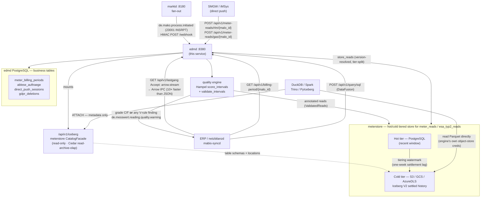
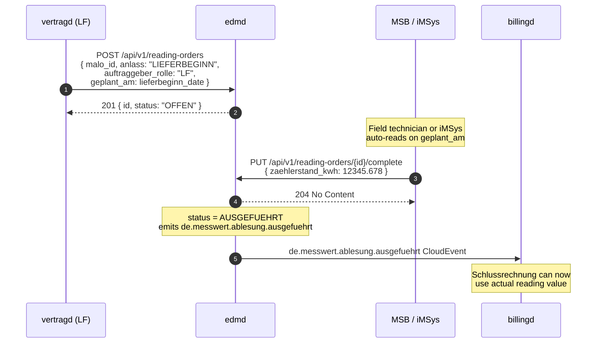
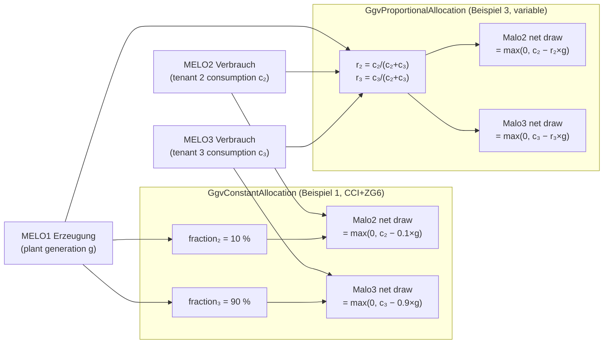
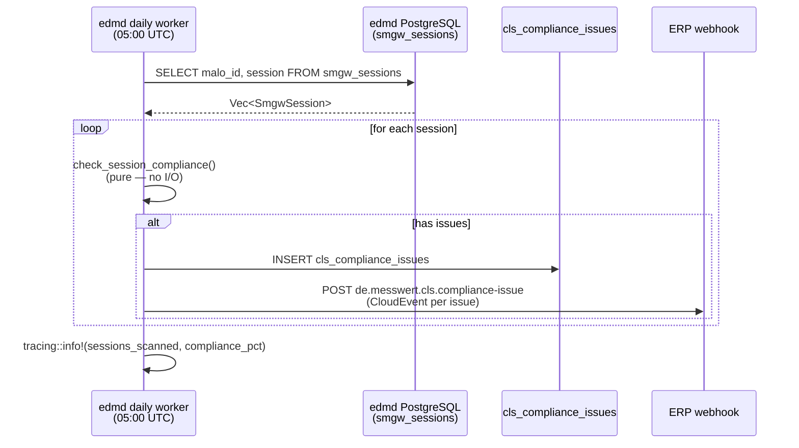

+++
title = "edmd Operator Guide"
description = "edmd operator guide: Energy Data Management daemon. Stores MSCONS meter readings, iMSys direct push for §41a real-time billing, Hampel-filter quality scoring (V01–V09/V11/V12 validation), virtual meters (§42b EnWG GGV Solarpaket I — GgvConstantAllocation CCI+ZG6 Beispiel 1 + GgvProportionalAllocation variable Beispiel 3, with Pos() cap per §42b Abs. 5), § 60 Abs. 2 MsbG substitution + forecasting, reading-order scheduling (Ablesesteuerung), MeterBillingPeriod (RLM Spitzenleistung + Gas Brennwert/Zustandszahl), Mehr-/Mindermengensaldo imbalance, BSI TR-03109 SMGW lifecycle, meterstore hot/cold tier, MCP server. meterstore-backed (PostgreSQL + Apache Iceberg), OIDC-secured, CloudEvents webhook."
weight = 27
[extra]
mermaid = true
+++
# `edmd` Operator Guide

`edmd` is the **Energy Data Management daemon** — the service that stores meter
readings and computes billing-relevant energy quantities for downstream services.

Key responsibilities:

- Store MSCONS meter readings (SLP and RLM) via the webhook from `marktd`.
- Accept **iMSys / SMGW direct push** (15-min intervals in JSON, bypassing EDIFACT) for §41a real-time billing.
- Run the **Hampel-filter quality scorer** and **V01–V09/V11/V12 validation engine** on all inbound interval data. Emit `de.messwert.reading.quality.warning` CloudEvents when either fires, from every ingest door.
- Schedule and track **reading orders** (Ablesesteuerung) for the market roles LF, MSB, NB and ESA (an ESA may order value delivery under §60 Abs. 1 MsbG). Auto-creates `INSRPT_STOERUNG` orders when a WiM INSRPT PID 23001 Störungsmeldung arrives.
- Compute and serve **virtual meter time series** (Sum, Residual, PvSelfConsumption, GgvConstantAllocation, GgvProportionalAllocation per §42b EnWG Solarpaket I GGV community solar) on demand.
- Generate **§ 60 Abs. 2 MsbG annual forecasts** (Jahresprognose — daily-average projection with automatic prior-year **seasonal correction** when the same window one year earlier has data) and **prior-period substitute values** for gap intervals — runs of up to three missing slots interpolate linearly between their real neighbours (the VDE-AR-N 4400 short-gap rule), longer runs use the Vergleichstag (same slot one week earlier); the audit row names the method that actually ran.
- Provide resampled Lastgang (hourly / daily / monthly / yearly buckets) and monthly Summenzeitreihe for MaBiS.
- Provide a time-series query API for ERP and `netzbilanzd`.
- Export BO4E `Lastgang` objects and `Zeitreihe` objects for ERP and API-Webdienste Strom consumers.
- Compute `MeterBillingPeriod` — RLM Spitzenleistung (kW) and Gas Brennwert / Zustandszahl — required by `netzbilanzd` for Leistungspreis billing.
- Accumulate **Mehr-/Mindermengensaldo** imbalance records per MaLo.
- **meterstore hot/cold tiering**: `meter_reads` (and the non-authoritative `esa_typ2_reads` stream) are stored through the [`meterstore`](https://github.com/hupe1980/meterstore) crate — a recent window in PostgreSQL and the settled history in Apache Iceberg V2 on S3/GCS/Azure, split by an explicit tiering watermark. Reads are version-resolved and tier-split; `store.as_of(...)` reproduces a past settlement. edmd's own business tables (receipts, corrections, confirmations, billing-period cache, reading orders, SMGW) stay in edmd's PostgreSQL pool.

The **domain calculation logic** is provided by the external [`metering`](https://github.com/hupe1980/metering) library crate (zero I/O, no async):

> **Where the boundary runs.** `metering` computes *"energy and volume, not
> money"*, with *"zero I/O, no async, no clock"* — so the BSI TR-03109 **SMGW
> domain model** (gateway status, certificate inventory, CLS channels) is not
> its business: those are device administration and change without a single
> metered value changing. They live in `edmd::smgw_model`, next to the
> `smgw_sessions` table and the two compliance sweeps that read them.
>
> Identifiers cross the boundary **typed**: `metering::MaloId` enforces the BDEW
> Bildungsvorschrift — eleven digits, Codevergabestelle 1–9, and the
> Anwendungshilfe check digit — at the parse. edmd's query types keep `String`
> deliberately (they are built from HTTP parameters, and a counterparty-supplied
> value must be *reportable* rather than un-representable), so the parse happens
> at the store boundary and a malformed ID answers `400` with the reason instead
> of failing opaquely inside a scan.


| Function / Type | §-basis | Used in |
|---|---|---|
| `gas_m3_to_kwh_hs(m3, hs, z)` | §25 Nr. 4 MessEV / DVGW G 685 | Gas direct push |
| `aggregate(intervals, AggregationConfig)` | GPKE (BK6-24-174) / MaBiS | `MeterBillingPeriod` |
| `classify_messtyp(intervals, source)` | GPKE (BK6-24-174), §41a EnWG | iMSys classification |
| `compute_imbalance(actual, contracted)` | GPKE (BK6-24-174) Teil 1 Kap. 8.4 | Mehr-/Mindermengensaldo |

### The balancing day is not the calendar day

A settlement period's boundary depends on the commodity. Electricity balances on
the calendar day (00:00–00:00 Europe/Berlin); **gas balances on the Gastag,
06:00–06:00** (GaBi Gas, following Art. 3 Nr. 6 VO (EU) 312/2014). Aggregating a
gas Lastgang over calendar days books the 00:00–06:00 draw into the neighbouring
Bilanzierungstag — six hours, *every day*, not only across a DST transition.

So the read endpoints that aggregate a period take the commodity:

| Endpoint | Parameter |
|---|---|
| `GET /api/v1/billing-period/{malo_id}` | `?sparte=strom` (default) · `gas` · `wasser` · `waerme` |
| `GET /api/v1/imbalance/{malo_id}/{year}/{month}` | `?sparte=strom` (default) · `gas` |

Both boundaries resolve through `metering::calendar` against the Berlin zone
rather than a fixed offset, so a period containing a DST transition is 23 or 25
hours long as it should be. One consequence is worth knowing because the
intuitive guess is wrong: the clocks change at 02:00/03:00 local, which is
*before* 06:00 — so the long or short **Gastag is the one named after the
Saturday**, while electricity's long day is the Sunday. Both are pinned by
tests.
| `score_intervals(intervals, config)` | — | Hampel quality scoring (A/B/C/F) |
| `validate_intervals(intervals, config)` | § 60 Abs. 2 MsbG (Plausibilisierung) | V01–V09/V11/V12 validation engine |
| `resample(intervals, config)` | GPKE Teil 1 Kap. 8.4, MaBiS | Hourly/daily/monthly resampling |
| `compute_virtual_meter(rule, sources)` | §42b EnWG (GGV); Residuallast = ordinary supply | GGV community solar, Residuallast |
| `project_annual_consumption(intervals, _)` | § 60 Abs. 2 MsbG Jahresprognose | Annual consumption forecast |
| `prior_period_substitutes(gap, _, _, prior, _)` | § 60 Abs. 2 MsbG | Prior-period gap filling |
| `SmgwSession`, `ClsChannel` | BSI TR-03109, §14a EnWG | SMGW lifecycle + CLS management |



---

## Tenant is part of a reading's identity

`meter_reads` is keyed `(tenant, malo_id, dtm_from, obis_code_norm)`.

Leaving `tenant` out of the key made two tenants holding the same MaLo-ID
collide on one row, and the ingest upsert resolved that collision by overwriting
the value *and* reassigning ownership (`SET tenant = EXCLUDED.tenant`) — silent
cross-tenant data loss that every read path then hid, because reads filter on
`tenant` and the row had already changed hands.

### MSCONS stores what it validates

MSCONS is the primary meter-data message in German MaKo. Its interval readings
are parsed from the `ProcessCompleted` event and written through the same
batched `store_reads` path as every other family, so a MSCONS reading lands with
the same primary key, unit and quality record as one that arrived by direct push.

An interval whose quantity will not parse is dropped and counted, not defaulted
to zero: a zero-kWh interval asserts that no energy flowed, which a decode
failure does not establish.

Both the receipt write and the interval store answer **500** on failure.
`marktd` treats 2xx as delivered and will not redeliver, so answering 204 on a
failed write would lose the process with only a log line to show for it.

### Authentication is required, not defaulted

`edmd` and `mabis-syncd` refuse to start without an `[oidc]` section unless
`allow_insecure_no_auth = true` is set explicitly.

The reason is what the absence would mean: `OidcVerifier::disabled` admits every
request as `dev-admin` holding every market role, which satisfies every Cedar
policy — including GDPR erasure and `POST /api/v1/query/sql`. Requiring the
opt-out by name makes running unauthenticated a decision someone wrote down
rather than one they reached by leaving a section out.

```toml
# Development only. Every request is admitted as dev-admin with all roles.
allow_insecure_no_auth = true
```

### Internal services authenticate with a service key, not a JWT

Sibling services — `einsd` (fetching ¼h feed-in for §51), `billingd`, `vertragd`,
`portald` — call edmd machine-to-machine, where minting a per-request OIDC JWT would
be ceremony without a user behind it. edmd accepts a **service key**: a caller sends a
static opaque (non-JWT) `Authorization: Bearer <key>`, and edmd matches it — in constant
time — against a registered key, admitting the request as a synthetic service principal
scoped to the deployment tenant with the roles the key declares.

```toml
[[oidc.service_keys]]
name  = "einsd"
key   = "env:EDMD_EINSD_SERVICE_KEY"
roles = ["nb"]          # what this caller may do (same Cedar roles as a JWT)
# sparte = "strom"      # optional Sparte scope
```

A JWT Bearer still takes the OIDC path unchanged — the branch is chosen by whether the
token *looks like* a JWT — and with no `[[oidc.service_keys]]` entries edmd behaves
exactly as before. The caller stores the same value as its `edmd_api_key`.

### The MCP write tools carry the same role gate as REST

The `/mcp` surface is admitted by one blanket Cedar action (`use-mcp`, same-tenant,
any role). That is right for the read tools, but the two **destructive** tools —
`trigger_substitution` (Ersatzwertbildung) and `trigger_jahresablesung` (§40
campaign) — call the same cores as their REST endpoints, which require
`write-timeseries` / `write-reading-order` (MSB/NB/admin). The MCP auth middleware
inspects the tool name of each `tools/call` and enforces that same write action,
so an LF-role token cannot escalate through MCP to a write it is refused on REST.

### Outbound CloudEvents are signed

Every edmd-originated CloudEvent — direct-push `stored`/`quality.warning`,
reading-order `failed`, confirmation-overdue, SMGW compliance and cert-expiry
alerts, from both the request path and the background workers — is delivered
through one emitter that adds an `webhook-signature: sha256=<hex>` HMAC over the
body when `erp_webhook_secret` is set. This is the counterpart to `inbound_secret`:
the ERP receiver authenticates edmd's events exactly as edmd authenticates its
inbound webhook. Without the secret the body is unsigned and the transport is the
trust boundary.

### The quality vocabulary and interval bounds are DB constraints

The 8-value `QualityFlag` vocabulary is a `CHECK` on every stored quality column
(the authoritative `meter_reads`, plus the `meter_billing_periods` cache and the
`meter_read_corrections` audit rows), pinned to `metering::QualityFlag::CODES` by a
`schema_code_guard` test — a drifting literal fails the write, it is not read back
as `UNKNOWN`. Every table holding an interval or period carries a forward-time
`CHECK` (`dtm_to > dtm_from` / `period_to >= period_from`), so a zero-width or
reversed span cannot be stored.

The reading's `source` (the `IngestionSource` provenance) is a `meterstore`
**coded attribute column** (`coded_column("source", IngestionSource::ALL…)`), so
that vocabulary is enforced by a DB `CHECK` on the authoritative store too, derived
straight from the enum — the same guarantee, extended to a deployment-declared
column. `sender_mp_id` and `allocation_version` carry open values (an MP-ID, a
MaBiS version label) and stay unconstrained.

### The cold tier's shape is meterstore's

edmd implements no archival logic of its own and defines no Iceberg partition
spec: `meter_reads` is a [`meterstore`](https://github.com/hupe1980/meterstore)
table, configured rather than reimplemented here. edmd's `TableConfig` sets the
partition step, archival step, settlement lag and cold-tier file size from its
`[archive]` config, and declares `tenant` as the non-nullable **identity column**
so two tenants' readings for one measuring point never merge. edmd then starts
meterstore's **maintenance loop** (one per store, on `maintenance_interval_secs`),
which is what actually advances the watermark — archiving settled windows from the
hot PostgreSQL tier into Iceberg V2 and checking the tier invariant each cycle.
Every read is version-resolved and tier-split
before it reaches edmd.

### GDPR Art. 17 is pseudonymisation, not a file rewrite

The cold tier is append-only (Iceberg V2, no deletion vectors), so Art. 17 over
history cannot mean rewriting Parquet in place. It means destroying the **subject
mapping**: each MaLo is enrolled as an erasure subject at ingest — a pseudonymous
`subject_ref` stamped on every row it owns — and erasure deletes that mapping in
meterstore's registry (`meterstore_subject_map` / `meterstore_erasures`). The
readings survive in both tiers but become unattributable, so the § 147 Abs. 1 AO
audit trail is preserved while the personal link is gone. No external Spark/Trino
rewrite is scheduled, and there is no `archive_deletion_pending` obligation left
over to discharge.

That covers the readings. edmd keeps a dozen tables of its own keyed on
`malo_id`, five of them holding meter values beside it, so the same transaction
splits them by what each row is: the **Buchungsbelege** — `meter_read_corrections`,
`substitute_value_log`, `meter_data_receipts`, `ablese_auftraege`,
`gas_quality_data` — have their `malo_id` rewritten to that same subject
reference (§ 147 Abs. 1 AO requires them kept; Art. 17 Abs. 3 lit. b DSGVO
exempts exactly that), while the derived, operational and device tables
(`meter_billing_periods`, `quality_assessments`, `estimated_read_confirmations`,
`direct_push_sessions`, `smgw_sessions`, `cls_compliance_issues`,
`delivery_surveillance`, `smgw_cert_expiry_alerts`, `virtual_meter_configs`) are
deleted outright.

`virtual_meter_configs` is the one that names a MaLo without a `malo_id` column,
and it survived an erasure that reached every other table. It names them twice —
`virtual_malo_id` is the derived point's own ID, and `rule_json` carries the
**source** MaLo-IDs of the aggregation — so a community member erased under
Art. 17 stayed named, in clear text, inside the § 42b rule of every virtual meter
that drew on their meter. Both go, which is also the only coherent outcome: the
subject's readings are unattributable once the mapping is destroyed, so the
virtual meter cannot be computed either way. The source match is
`jsonb_path_exists` with the ID as a **bound variable** rather than a `LIKE` over
the serialised JSON — the rule variants nest their IDs under different keys, so
the recursive wildcard covers all of them while still comparing whole values, and
an 11-digit ID cannot match as a substring and delete a stranger's community.

**§ 60 Abs. 6 MsbG points the other way.** It is a *deletion* duty — personal
Messwerte deleted or anonymized at the latest three years after the end of the
collection year — and destroying the subject mapping is that anonymization. It is
not the basis for keeping an audit trail; that is § 147 Abs. 1 AO (retention) and
§ 146 Abs. 4 AO (the original must stay recoverable after a change).

### Queries are tenant-scoped

`tenant` is the store's **identity column**, so a MaLo is unique only within a
tenant. Every typed read binds it: the repository scopes each `series` read with
`.column_eq("tenant", …)`, so two tenants' readings for one MaLo can never fold
into a single series even in a store that holds both. The GDPR erasure subject is
qualified the same way (`tenant:malo`), so erasing one tenant's MaLo cannot unlink
another's. The structured archive endpoints inherit that scoping;
`/api/v1/archive/portfolio` binds `tenant` in its `GROUP BY` too. Only the ad-hoc
`POST /api/v1/query/sql` runs unscoped over the version-resolved relation — a query
naming the raw, every-version relation is rejected with `403` so no statement can
double-count corrected intervals, and it is single-tenant by deployment
(`cfg.tenant` is written to every row).

### GDPR erasure is one transaction

The request record, the subject-mapping erasure
([`SubjectRegistry::erase_in`](https://github.com/hupe1980/meterstore)) and the
derived-table deletes (billing periods, quality assessments, substitute-value log)
commit together on edmd's pool — meterstore's registry lives in the same database,
so one transaction encloses them all. An erasure either completed or it did not: a
partial one reported as success would close out the Art. 17 request while personal
data remained, indistinguishable from a MaLo that legitimately held no readings.

### Cached billing periods are invalidated on ingest

`meter_billing_periods` is populated read-through. `store_reads` drops any cached aggregate the new readings fall inside, and the
read-through write refreshes a stale row rather than skipping it.

Without that, a query issued mid-period caches a partial sum that is then served
for that period indefinitely — including to `billingd` — because the read path
prefers the cache.

### Late corrections are meterstore's to resolve

A correction for an already-settled interval is not edmd's to reconcile against
the cold tier. It is appended at a higher MSCONS version; meterstore routes it to
the tier that owns the interval and applies latest-version-wins on read. The
displacements the append returns drive edmd's § 60 audit — the durability of the
corrected value in the cold tier is the tiering watermark's business, not a
per-row `archived` flag edmd maintains.

**"A higher version" has to be arranged, not assumed.** Which of two deliveries
wins is decided by the MSCONS version the network operator assigned; a delivery
that states none falls back to arrival time in milliseconds — 13 digits,
deliberately one short of the ≥ 14 MSCONS mandates, so a stated version always
outranks a fallback whatever order they arrived in.

That rule is right for a delivery and exactly backwards for a value **edmd
authors**. An operator correction and a § 60 Abs. 2 Ersatzwert carry no MSCONS
version, so both took the low fallback and were outranked by any reading that had
arrived with a stated one: stored in the version history, never current. Nothing
failed — the audit row was written, the § 60 confirmation closed as
`BESTAETIGT`, the billing cache was invalidated — and the recomputed aggregate
returned the uncorrected value, because it never changed. A § 147 AO trail that
records a correction which did not happen is worse than one that refuses it.

`IngestionSource::is_edmd_authored` separates the two kinds of write. An authored
one appends, reads the effect off the store's own displacement report, and on
`Shadowed`/`Duplicate` re-appends one above the version that actually holds —
race-free in the way a read-then-write is not, since the report describes the
state the write itself observed, and with no assumption about how many digits an
operator's versions run to. After four contested attempts it errors, and inside
`store_corrections` that rolls the audit row back with it.

### Substitution is atomic

A substitute reading and its § 147 Abs. 1 AO / § 146 Abs. 4 AO (GoBD) audit row commit in one transaction. As
two independent writes a failure part-way would leave billable `SUBSTITUTED`
values in `meter_reads` with no record of who substituted them or why.

### Corrections name their register

`CorrectionRecord` carries `obis_code`, and the update is keyed on
`(tenant, malo_id, dtm_from, obis_code_norm)`. Matching on `dtm_to` instead would
rewrite **every** OBIS register at that timestamp, so correcting an import
reading also overwrote the export one.

A correction advances `allocation_version` to `CORRECTION` (an initial ingest
leaves it `INITIAL`). It rides as a `meterstore` attribute column, folded from the
newest delivery, so a read-back read reports the version the currently-in-force
value belongs to rather than the version of whatever landed first.

### Tenant scoping is not optional on any statement

A MaLo-ID is not unique across tenants, so every statement touching a MaLo binds
`tenant`. What each would otherwise do:

| Statement | Consequence of an unscoped query |
|---|---|
| `GET /api/v1/billing-periods?tenant=` | Cedar authorises against the deployment tenant; honouring a caller-supplied parameter lets a principal cleared for its own tenant read any other tenant's portfolio |
| `update_gas_quality` | one tenant's calorific value rewrites every tenant's gas billing rows for the same MaLo-ID, changing invoiced kWh |
| GDPR erasure | one tenant's Art. 17 request deletes another tenant's billing aggregates |
| quality rescore | one tenant's gap verdict is stamped onto another's readings |

`update_gas_quality` takes `tenant` in its trait signature so the scope cannot be
forgotten at a call site, and a `?tenant=` that differs from the authorised
tenant is `403`.

## Ingest is batched and validated

All ingest goes through `store_reads`, which routes the whole batch through one
`meterstore` `append`. The append splits current from below-watermark intervals
across the two tiers in one call and makes a partial failure impossible: the batch
lands whole or not at all, which is what keeps the 100M-intervals/day target
reachable.

`store_reads` carries the reading's provenance as `meterstore` **attribute
columns** — declared once in `build_stores`, out of the merge key, folded
from the newest delivery on read. `allocation_version` carries the MaBiS version a
value belongs to, `sender_mp_id` carries § 60 Abs. 1 MsbG per-interval MSB
attribution across a WiM switch, and `source` records the ingest door. A
`MeasurementSeries` is a channel of numbers and cannot hold these, so the typed
read recovers them through `collect_resolved` rather than reconstructing them with
guessed defaults: a read-back `MeterRead` names its true source, reporting operator
and allocation version, not `MSCONS` / `None` / `INITIAL`.

### The § 60 audit row covers the interval it displaced

When a later delivery overwrites a stored interval, the displacement `meterstore`
returns carries the interval **end** as well as its start, so the immutable § 60
Abs. 6 MsbG audit row (and the § 60 Abs. 2 confirmation it opens) spans
`[dtm_from, dtm_to)` rather than collapsing to a zero-width `[dtm_from, dtm_from)`.

### A correction keeps the operator that scoped the value

The corrected interval is appended at a higher version so latest-version-wins
supersedes the prior value. Its version scope is derived from the reporting
operator (`sender_mp_id`), so the correction reads the operator back off the
existing interval (`collect_resolved`) and re-uses it. Dropping it would move the
correction into the tenant's scope — a *different* scope from the value it
corrects — and `meterstore`'s one-operator exclusion would then reject the
correction as a conflicting claim on the interval instead of accepting the
supersede.

### Unvalidated reads are unrepresentable, not merely discouraged

The repository's `store_reads` does not accept a slice of readings. It accepts a
`ValidatedReads`, whose only constructor is `ValidatedReads::validate` and whose
field is private to `domain::validation`. Obtaining the type *is* running
**V01–V09/V11/V12**; there is no path to the store that skips it.

That is a type rule rather than a convention because the failure is silent. A
new ingest path that forgot to validate would write rows indistinguishable from
validated ones, and V03 (negative energy), V04 (impossible spike) and V09
(non-billable quality) would simply never fire for that source — while
§ 147 AO / GoBD requires billed data to have been validated. `validate` takes
the batch **by value**, so a caller cannot retain the raw `Vec` and persist it
by another route.

Every family is behind it: IoT push, RLM/gas direct push, bulk import, the Kafka
consumer, and edmd's own § 60 Abs. 2 MsbG Ersatzwerte — substitutes are edmd's
output but are billed like any other reading, so a generator emitting a wrong
interval length fails at ingest rather than at settlement. Issues attach to the
rows they name, so a reading lands with the same quality record whichever door
it came in by.

Validation annotates and never rejects. Whether an interval is billable is a
separate decision from whether it is stored — discarding a suspect reading would
destroy the evidence needed to resolve it. Findings land in `quality_warnings`;
when a row already carries a session-level Hampel summary, the rule findings are
added under a `validation` key rather than replacing it. A batch with any issue
returns `202 Accepted` with a `validation` block instead of `201`.

### Billable-only reads and the current reading are the storage layer's job

The read side never re-implements "billable". The § 60 Abs. 2 rule lives once in
`metering::QualityFlag::is_billable` (every flag except `FAULTY`/`UNKNOWN`), and
the aggregate reads — imbalance/MMM, on-the-fly billing periods — push that set
into the scan through meterstore's `SeriesQuery::quality_in`, so a `FAULTY`
interval never reaches a saldo rather than being filtered out in memory at each
call site. Which qualities count as billable is edmd's rule to state; applying it
to the scan is meterstore's job to execute.

The "current reading" (`latest_read`) resolves through
`SeriesQuery::latest_resolved` — `ORDER BY from DESC LIMIT 1` at the storage layer
— instead of loading the whole history and taking the maximum in memory.

`GET /api/v1/feed-in/{malo_id}?from=&to=` serves the same billable set to einsd's
§51 Negativpreisregel: it returns the ¼h **Einspeisung** intervals (export-OBIS,
`ObisCode::is_einspeisung`), each carrying its own `billable` flag, alongside a
`coverage_pct` and `billable_pct` for the window. einsd overlays those intervals on
its EPEX spot store to find the negative-price quarter-hours — and its §60 Abs. 2 gate
reads exactly these two percentages, skipping the automatic reduction when the month's
data is incomplete rather than under-reducing on gaps.

An unrecognised `quality` flag is refused at the boundary with `422`. The column
is CHECK-constrained, so binding an unrecognised value raw fails the insert;
coercing it to `UNKNOWN` instead would silently strip the row from every billing
aggregate.

`stored_count` reports rows that actually committed. Each ingest family writes
one batched statement, so a batch lands whole or not at all.

### One unit contract across the ingest families

Direct push parses units with `MeasurementUnit::parse_scaled` — the same
machinery the IoT path uses — and cross-checks the result against the Sparte. A
unit that is neither the Sparte's measured unit nor its billing unit is rejected.

This closed two mis-billing paths. The gas endpoint compared the unit string
against `"m3"`, which never matches the superscript `"m³"` that `MeasurementUnit`
accepts, so a gas push in m³ was stored **unconverted** — roughly a tenfold
under-count, and a value labelled `"m3"` reaching the electricity endpoint would
be multiplied by the gas Brennwert.

`brennwert_kwh_per_m3` is **required** when gas arrives in m³, on every path.
§25 Nr. 4 MessEV requires a value determined by the recognised rules of
technology, which a national average is not: an L-Gas supply area (Hs ≈ 8.8)
billed at the H-Gas 10.55 is a systematic ~20 % over-charge, with nothing on the
row recording that a default was used.

### Substitute values do not overwrite measurements

`POST /api/v1/meter-reads/{malo_id}/substitute` requires an `obis_code`. It is
part of the primary key, so a substitute filed without one lands on the
empty-string register rather than against the reading it stands in for — leaving
**both** rows in the table, and a 100 kWh reading plus its substitute billing
1099 kWh.

The substitution path first reads the existing intervals and marks every slot
that already holds a **billable** value (`QualityFlag::is_billable` — every
quality except `FAULTY`/`UNKNOWN`), then writes a substitute only for the slots
that do not. § 60 Abs. 2 MsbG authorises an Ersatzwert where no usable measurement
exists, not in place of one, so a window overlapping billable data leaves that
data untouched and returns those intervals in `skipped_measured`.

That read is scoped to the **one register** being written to — the request's
`obis_code`, else the point's dominant energy series. Scoped per MaLo instead, a
prosumer's feed-in reading marked the consumption register's slot occupied and
the gap could never be filled at all; and `fill_gaps`, handed two registers, sees
two values at every timestamp, so a gap in one is hidden by the other's presence
and an interpolation is bracketed by a reading from the wrong channel.

Four methods are honoured: `PriorPeriodAverage`, `LinearInterpolation`,
`ZeroFill` and `LastValueCarryForward`. Anything else is `422`.

`PriorPeriodAverage` resolves to **the same quarter-hour slot one week earlier**,
not an average across the reference window — a gap at 08:15 on a Wednesday is
filled from 08:15 the previous Wednesday, so the daily and weekly shape of the
load profile survives. The reference window is fetched from the store and passed
in; a requested method with nothing to work from degrades (prior-period →
carry-forward → zero) and `methods_applied` names what actually ran rather than
what was asked for. That distinction is worth stating because a degraded
substitute looks identical to a correct one in the response body, so the
integration suite asserts the *values* against a reference week whose every slot
carries a different number.

Each interval records the method that actually produced it in
`intervals[].method`, which may differ from the request: a prior-period average
with no matching reference slot degrades to carry-forward, then to zero, and
linear interpolation with no closing value has no slope to follow. The response
reports `method_requested` alongside the set of `methods_applied` — a § 147 AO
audit record naming a method that did not run would be a claim the value does not
support.

## A reading is stored in its Sparte's billing unit

Gas is metered in m³ and settled in kWh. Every ingest door applies the Brennwert
conversion (§ 25 Nr. 4 MessEV / DVGW G 685) *before* the value reaches the store,
so what is held is energy — and the stored `unit` says so
(`store::stored_unit(sparte) == sparte.billing_unit()`).

The unit is not decoration. It travels to the BO4E `Mengeneinheit` on an exported
`Zeitreihe` or `Energiemenge`, and into the Parquet an external engine reads
through the Iceberg facade. Labelling a converted gas reading `m³` — the
*measured* unit — described roughly a tenth of the real quantity to every one of
those consumers while the number itself was correct, which is the hardest kind of
error to notice.

Water is the one Sparte measured and billed in the same unit, so it is the only
volume in the store. Heat integrates flow × ΔT on-device and registers kWh_th.

## A MaLo is a set of registers, not a series

A Marktlokation does not deliver *a* series. It delivers a set of OBIS registers
— Bezug beside Einspeisung on a prosumer, HT beside NT on a dual-tariff meter,
Blindarbeit beside Wirkarbeit on an industrial connection — and a `meterstore`
read **spans channels**: one series comes back carrying every register the point
reported. Summing it is not an approximation, it is a different number.

| Mixed | What the sum becomes |
|---|---|
| `1-0:1.8.0` + `1-0:1.8.1` + `1-0:1.8.2` | Consumption counted **twice** — the total register already *is* HT + NT |
| `1-0:1.8.0` + `1-0:2.8.0` | Grid draw plus feed-in, a quantity with no meaning |
| `1-0:1.8.0` + `1-0:3.8.0` | kWh plus **kvarh** |
| any + `1-0:1.6.0` | kWh plus a **kW** peak-demand register |
| any + `…63` | kWh plus a **fault counter** |

So the decision is made once, in `domain::register`, and every path that folds
readings into a figure goes through it — the billing period, the
Mehr-/Mindermengensaldo, the Summenzeitreihe, the resampled Lastgang, the annual
forecast, the Netzverlust balance, the OLAP total, the energy-sharing allocation,
the virtual meters, and their MCP twins.

**`energy_intervals(reads, direction)`** is the projection for anything that
sums. Non-billable qualities are dropped (§ 60 Abs. 2 MsbG), registers that are
not kWh are dropped, the other direction is dropped, and then the rule that stops
the double count: *when a total register is present it is the answer and its
tariff registers are dropped; when only tariff registers are present they are
summed*. The second half is the one a naive dedup gets backwards — picking a
single winner per slot silently discards NT consumption for every dual-tariff
meter that does not also report a total.

**`register_groups(reads)`** is the split for anything that judges a series'
*shape*. Cadence, gaps, overlaps and the Hampel filter are single-series
statements; flattened, registers share every timestamp, so the observed cadence
collapses towards zero, every same-slot pair reads as an overlap, and coverage is
multiplied by the number of registers. Validation, quality scoring and the
delivery-surveillance sweep all split before they judge.

Two boundaries are worth stating because a medium-blind rule gets them wrong:

- **Value group C is a direction for electricity only.** On the gas energy code
  `7-1:99.33.17` it is the Messgröße, so an import/export test answers `false`
  both ways — a medium-blind filter projects every gas, water and heat series
  onto the empty set. Those media meter a single flow out of the network, so
  their registers are Bezug, and the tariff-stage rule is likewise
  electricity-only.
- **Einspeisung is never inferred.** It requires an explicit `C = 2` electricity
  code. Bezug is what an unqualified energy quantity means — a single-register
  delivery that never named its register is that point's consumption — but
  reading the same silence as feed-in would put unlabelled consumption into the
  § 51 EEG reduction, which is a guess about money.
- **The Messart (group D) is deliberately not filtered.** Strictly `D = 8` is a
  cumulative Zählerstand and `D = 29` the Lastgang, but in the traffic edmd
  receives `1-0:1.8.0` is the ordinary label for a per-interval energy quantity.
  Filtering on D would reject the most common register in the store and return
  zero. The `D = 6` maximum register is excluded on the *unit* axis instead,
  because `register_unit` types it `kW`.

## The Mehr-/Mindermengensaldo takes both halves

`GET /api/v1/imbalance/{malo_id}/{year}/{month}` **requires**
`?bilanziert_kwh=`.

The saldo compares a **measured** quantity against a **bilanzierte** one, and
edmd holds only the first. The bilanzierte Menge is what the balancing side
allocated to the Bilanzkreis from the load profile — a commercial figure in the
supplier's system, not a measurement — so no amount of metering data yields it.
Omitting it is not "assume zero"; it is "there is no comparison to make", and the
endpoint answers `422` saying so.

`gemessen_kwh` is the **Bezug**, register-projected as above. Folding in the
point's Einspeisung or its HT/NT split beside the total does not merely add noise
— it moves the saldo, and with it the money.

```bash
curl "http://edmd:8380/api/v1/imbalance/51238696012/2026/07?bilanziert_kwh=1000" \
  -H "Authorization: Bearer $TOKEN"
```

```json
{
  "gemessen_kwh":    "962.5",
  "bilanziert_kwh":  "1000",
  "mehrmenge_kwh":   "37.5",
  "mindermenge_kwh": "0",
  "delta_kwh":       "-37.5",
  "delta_pct":       "-3.75",
  "quality":         "MEASURED",
  "interval_count":  2976,
  "richtung":        "MEHRMENGE — Netzbetreiber vergütet dem Lieferanten"
}
```

**The naming is from the network operator's side, which inverts the intuitive
reading** (GPKE Teil 1 Kap. 8.4 Nr. 3). A customer consuming *less* than the
profile leaves surplus energy the NB absorbed — that surplus is the
**Mehr**menge, and the NB credits it. Consuming more is the **Minder**menge,
which the NB invoices. Only one of the two is ever positive. The arithmetic and
the convention are `metering::compute_imbalance`'s, shared by the REST endpoint
and the `get_imbalance` MCP tool, so an agent and an operator cannot get
different answers.

`?sparte=gas` moves the period onto the 06:00 Gastag.

`quality` is the worst flag that actually contributed. A saldo built partly from
Ersatzwerte is a different fact from one built entirely from measurements, and
the settlement side has to be able to see which it is.

## Read windows are bounded

Every materialising read endpoint defaults to the **last 31 days** and refuses a
window wider than **732 days** — two years, which covers a Jahresabrechnung plus
its comparison year.

An unbounded default would mean `GET /api/v1/lastgang/{malo_id}` with no
parameters asking for every interval ever stored for that MaLo across both tiers,
materialised into a `Vec<MeterRead>` and then into BO4E JSON. At quarter-hour
resolution a decade is 350 000 rows: one unparameterised request from a dashboard
would be a tenant-wide outage.

A malformed `?from=` or `?to=` is a **`400`**, never a silent fallback — otherwise
`?from=last-tuesday` would return the whole history and look like a successful
answer to the question the caller asked.

Bulk history has three paths that stream rather than materialise, and none of
them is bounded this way:

| Path | Use |
|---|---|
| `Accept: application/vnd.apache.arrow.stream` | Columnar export of a Lastgang / Zeitreihe |
| `POST /api/v1/query/sql` | DataFusion over the resolved relation, JSON or Arrow IPC |
| `GET /api/v1/iceberg/v1/…` | External engine reads Parquet directly from object storage |

## ESA "Werte nach Typ 2" live in a separate store, unreachable from billing

ESA-delivered values (MSCONS PID **13027**, "Werte nach Typ 2") are
**non-authoritative**. *Codeliste der Konfigurationen* 1.4 Kap. 4.6 and WiM Strom
Teil 2 §4 are explicit: these values have *no bearing* on Netznutzungs-,
Bilanzkreis- or Mehr-/Mindermengenabrechnung, and on any divergence only the
Kapitel-2 (Typ-1) values are relevant.

`edmd` enforces this as a **schema decision, not a runtime filter**. Typ-2 values
land in their own table, `esa_typ2_reads`, and never in `meter_reads`:

- **The ingest forks at the source.** edmd still *subscribes to* 13027 (it must
  receive the values), but on a 13027 delivery the handler forks on
  `ESA_TYP2_PIDS`, routes to `Typ2Repository::store_typ2_reads`, and returns — it
  never reaches the `meter_reads` upsert, validation, or substitution paths.
- **The billing read paths are structurally blind.** Every billing consumer
  (`billingd`, `netzbilanzd`, `mabis-syncd`, `invoicd`) reads values through
  edmd endpoints that aggregate `meter_reads` only. There is no `source`/`pid`
  discriminator on the billing store that could leak a Typ-2 row by omission,
  because the row is not there at all.
- **No billing machinery hangs off the Typ-2 store.** `esa_typ2_reads` has no
  `meter_billing_periods` aggregation, no `meter_read_corrections` audit, no
  `substitute_value_log`, no `allocation_version`, and no Iceberg archival. A
  Typ-2 value is stored as delivered and read back verbatim via
  `GET /api/v1/esa/typ2/{malo_id}`; it is never reconciled against, corrected,
  or substituted for a Typ-1 value.

The separation is a table boundary, not a session one. `meter_reads` and
`esa_typ2_reads` are built as two tables of a single `meterstore::MeterCatalog`
(`build_stores`), so they share one Iceberg `SqlCatalog` — one metadata pool — and
one DataFusion session, while each keeps its own watermark, archiver and tiering
(§15.3). Sharing the session costs no isolation: a billing query names
`meter_reads` and a Typ-2 read names `esa_typ2_reads`, and neither can reach the
other's rows.

The separation is guarded by `schema_code_guard` tests (the table must exist, and
13027 must be in `ESA_TYP2_PIDS` so the handler forks it) and by a real-Postgres
test proving a 13027 delivery lands in `esa_typ2_reads` with `meter_reads`
untouched — and a companion test proving the two stores, though they share one
catalog, return only their own values.

## `meter_reads` tiering and retention are meterstore's

`meter_reads` is not an edmd PostgreSQL table — it is a
[`meterstore`](https://github.com/hupe1980/meterstore) table spanning a hot
PostgreSQL window and a cold Iceberg V2 history, split by a tiering watermark.
edmd configures its shape (daily partition step, daily archival step, one-week
settlement lag, `tenant` identity column); meterstore owns the mechanics:

- **Overlap and double-count safety.** The hot tier enforces a per-partition
  exclusion, so a later delivery whose range overlaps a stored one cannot land
  twice. The version axis is resolved away on read, so a redelivery or correction
  appears once, carrying the value in force. edmd does not maintain this — it is
  the store's invariant.
- **Retention reclaims disk by tiering, not by `DELETE`.** meterstore's maintenance
  loop (started by edmd, on `maintenance_interval_secs`) moves settled intervals
  past the watermark from PostgreSQL into object storage, so the hot tier stays
  bounded without a bulk `DELETE` competing with ingest for I/O. edmd implements no
  archival logic itself and keeps no `archived` flag; durability is the watermark's
  business.
- **Reproducing a past settlement.** `store.as_of(snapshot)` pins a cold-tier
  Iceberg snapshot, and `store.as_known_at(t)` pins the row-level `recorded_at`
  axis across both tiers — either reads the history as it stood at a past instant,
  something a partition-drop model could not offer.

edmd keeps only its *business* tables in its own PostgreSQL pool (receipts,
corrections audit, confirmations, billing-period cache, reading orders, SMGW);
those are ordinary tables under edmd's control.

## Rate limiting

Ingest endpoints accept unbounded batches, so an unthrottled client can saturate
the write path for every other tenant. Two limiters apply:

| Limiter | Key | Bounds |
|---|---|---|
| `with_tenant_rate_limit` | authenticated tenant, else peer address | any single caller |
| `with_rate_limit` | global | their sum |

A global bucket alone lets one busy tenant consume the whole allowance and starve
every other tenant on a shared deployment, so both are applied.

Rejections return `429` with a `Retry-After` header rounded **up** to whole
seconds — rounding down would invite an immediate retry that is rejected again.
The bucket key is a hash of the bearer token, never the token itself.

```toml
[rate_limit]
requests_per_second            = 500   # global sustained
burst                          = 1000  # metered ingest is bursty by nature
per_tenant_requests_per_second = 100
```

`burst` is deliberately above the sustained rate: an MSCONS batch or an IoT
gateway flushing a backlog arrives all at once but fits comfortably within the
hourly budget.

## Delivery surveillance — the points that stopped

Every quality mechanism above judges **data that arrived**. The V-rules run on an
ingest batch; the Hampel scorer grades one; the § 60 Abs. 2 confirmation loop
chases estimates already written. All of them are triggered by a delivery.

Silence triggers nothing. A head-end that breaks, a gateway that loses its WAN, a
Kafka producer redeployed onto the wrong topic — none produce an ingest, so none
produce a validation, a grade, or an event. The measuring point simply stops
appearing, and nothing else in the service looks for an absence.

That failure surfaces at settlement, which is too late: the Summenzeitreihe is
short, the Bilanzkreis carries the difference, and the window in which the values
could still have been re-read or substituted under § 60 Abs. 2 MsbG has closed.

An hourly sweep asks the complementary question.

| State | Meaning | Typical cause |
|---|---|---|
| `SILENT` | Newest interval ends more than `silent_after_hours` ago (default 36) | Gateway offline, head-end down, routing broken |
| `UNDER_COVERED` | Still delivering, but under `min_coverage_pct` of the window | Partial batches, dropped intervals |

### The ESA Typ-2 stream

Swept separately, with its own threshold (`typ2_silent_after_hours`), register
rows (`stream = 'TYP2'`) and events (`de.messwert.esa.typ2.delivery.overdue` /
`.resumed`). A Typ-2 gap breaches the §60 Abs. 1 MsbG delivery duty toward one
ESA and reaches no billing run that could come up short, so nothing else would
notice it.

Keyed on the delivered **OBIS register**: a MSCONS 13027 names its register per
line item and its subscription only in `SG1 RFF+AGI`, which `esa_typ2_reads`
does not record. Coverage is not scored — a Typ-2 series is delivered as ordered
and never reconciled or substituted, so only silence is a defect.

```bash
curl -s "http://edmd:8380/api/v1/surveillance/delivery?state=SILENT" \
  -H "Authorization: Bearer $TOKEN"
```

```json
{
  "count": 1,
  "points": [{
    "malo_id":           "51238696012",
    "state":             "SILENT",
    "last_interval_end": "2026-08-15 06:00:00 +00:00:00",
    "hours_silent":      74,
    "coverage_pct":      "56.55",
    "first_detected_at": "2026-08-16 19:00:00 +00:00:00"
  }],
  "legal_basis": "§ 60 Abs. 2 MsbG — a measuring point that stops delivering leaves Plausibilisierung und Ersatzwertbildung owing"
}
```

Three decisions are deliberate:

- **Coverage is a duration ratio, not an interval count.** A point that
  legitimately moves from quarter-hours to hours has a quarter of the intervals
  and the same coverage. Counting intervals would report every such point as
  degraded.
- **Only billable qualities count.** A window full of `FAULTY` intervals is not a
  delivered window, and treating it as covered would hide exactly the case
  § 60 Abs. 2 MsbG exists for.
- **A point that has *never* delivered is not reported.** edmd cannot tell "meter
  installed and broken" from "MaLo in master data, no meter yet", and guessing
  produces one alert per unbuilt connection. That is `marktd`'s question;
  `GET /api/v1/sharing/readiness` answers the §42c form of it.

`max_events_per_sweep` (default 500) caps the burst, because one broken head-end
can take a whole fleet dark at once. The register still records every finding and
the response carries `suppressed`, so a fleet-wide outage cannot be mistaken for
a handful of broken meters.

## A standing fault is announced once, not once per sweep

Three signals describe a *condition* rather than an occurrence: a silent
measuring point, an open §14a fault, an expiring certificate. Each is backed by a
**register** — `delivery_surveillance`, `cls_compliance_issues`,
`smgw_cert_expiry_alerts` — keyed on the identity of the problem, not on when it
was noticed, and each emits on the **transition** into and out of the state.

Appending a row and emitting on every daily pass instead would make a gateway on
an expired certificate produce one CloudEvent a day for as long as nobody fixed
it — an unbounded stream saying the same thing forever, a table that only grows,
and a fleet dashboard whose "issues in the last 24 h" measures the sweep cadence
rather than the fleet.

One consequence is load-bearing. **The watermark that decides what a sweep did
not re-sight must come from the database clock**, because `last_seen_at` does.
Compare it against an application timestamp and the result depends on the skew
between two machines: a database even slightly behind closes every row in the
same sweep that re-sighted it, so a standing fault flaps resolved/reopened
forever and emits *both* events each pass — worse than the behaviour the register
replaced. This is not hypothetical; it is what the integration suite caught.

## Validation runs per series, with the commodity's own thresholds

Two properties of the ingest validator decide whether a finding means anything.

**One series per register.** The batch is split by `(Sparte, OBIS register)`
before the rules run. V01 (gap) and V02 (overlap) are statements about a *single*
series, and a MaLo routinely delivers several at once — import beside export on a
prosumer MeLo, HT beside NT on a dual-tariff meter. Validated as one flat list
those registers share every timestamp, so V02 reported each same-slot pair as an
overlapping interval at `Error` severity, and a bidirectional delivery could not
be ingested cleanly at all.

**The thresholds are the commodity's, and the cadence is observed.** They come
from `metering::QualityConfig::for_sparte`, not from the electricity defaults:

| Sparte | Zero-run tolerance | Why |
|---|---|---|
| Strom | 4 intervals | A household has a standby floor; a short zero run means a dead meter |
| Gas | 48 | Heating is seasonal — a summer week of near-zero draw is normal |
| Wärme | 720 | Unheated months are ordinary, and the resolution is coarse |
| Wasser | wide, with a sigma floor | A vacant flat reads exactly zero indefinitely |

The cadence comes from `detect_interval_length`, not from an assumed 900 s. With
the assumption, every interval of an hourly gas series tripped V06, and a
one-hour hole in that series was reported as "4 missing intervals" — the right
finding with the wrong evidence in the audit record.

## The rule set is `metering`'s, and there is no V10

`metering` 0.18 runs **V01–V09, V11 and V12**. V10 was a "register rollover" rule
comparing consecutive interval energies, which is meaningless for a series of
per-interval quantities rather than cumulative Zählerstände — for it to fire, one
quarter-hour would have had to carry 50 MWh, or 200 MW of average load. The crate
removed it and left the number unused so a stored `V10` finding cannot be
silently reinterpreted as something else. Rollover is a property of a meter
register and is detected where register readings live.

| Code | Rule | Severity |
|---|---|---|
| V01 | Gap | Error |
| V02 | Overlap | Error |
| V03 | Negative energy | Error (off for a bidirectional register) |
| V04 | Statistical outlier (Hampel) | Warning |
| V05 | Zero run | Warning |
| V06 | Interval length | Warning |
| V07 | Collapsed DST hour | Error |
| V08 | Future timestamp | Warning |
| V09 | Non-billable quality | Error |
| V11 | Unordered series | Warning |
| V12 | Implausible power | Error |

Nothing in edmd enumerates the rules — findings are stored by their own
`rule_id`, so the set is whatever the crate runs.

## V07 — DST ambiguity

Germany repeats local 02:00–03:00 when CEST ends, so that day has **25 hours**.
A series converted from local time without carrying the UTC offset collapses the
two passes into one and silently loses an hour of energy.

V07 fires when a series covers a **whole local fall-back day** but carries less
than 25 hours. Anchoring on whole-day coverage is what makes it immune to
truncated query windows: a series that merely *starts* inside the repeated hour
is short, not corrupt.

Quarter-hour metering therefore carries a different interval count on the two
transition days, and both are pinned by tests against edmd's own ingest wrapper
rather than only the upstream rule:

| Local day (Europe/Berlin) | Hours | ¼-h intervals | UTC span |
|---|---:|---:|---|
| 2026-03-29 (CET→CEST) | 23 | **92** | `2026-03-28T23:00Z` → `2026-03-29T22:00Z` |
| ordinary day | 24 | 96 | — |
| 2026-10-25 (CEST→CET) | 25 | **100** | `2026-10-24T22:00Z` → `2026-10-25T23:00Z` |

The failure mode is silent: the same 2026-10-25 delivered as 96 intervals still
parses and passes every other rule, and bills an hour short. That case is the
one V07 exists for.

## Reading-order idempotency

`ON CONFLICT DO NOTHING` needs a unique index to fire on — the surrogate `id`
primary key alone mints a fresh UUID per redelivered INSRPT. Two partial unique
indexes back it:

| Index | Covers |
|---|---|
| `ablese_insrpt_unique (tenant, insrpt_process_id)` | INSRPT-triggered orders |
| `ablese_scheduled_unique (tenant, malo_id, anlass, geplant_am)` | campaign/scheduled orders, which carry no process id |

## Port layout

```
┌────────────────────────────────────────────────────────────────────────────┐
│  edmd  :8380                                                                │
│                                                                            │
│  POST /webhook                              ← marktd CloudEvents          │
│  GET  /api/v1/deliveries/{malo_id}          ← BO4E Energiemenge           │
│  GET  /api/v1/billing-period/{malo_id}      ← MeterBillingPeriod          │
│  GET  /api/v1/billing-periods               ← collection (mabis-syncd)    │
│  GET  /api/v1/imbalance/{malo_id}/{y}/{m}?bilanziert_kwh=  ← MMM saldo    │
│  GET  /api/v1/lastgang/{malo_id}            ← BO4E Lastgang               │
│  GET  /api/v1/feed-in/{malo_id}             ← ¼h Einspeisung (§51 einsd)  │
│  GET  /api/v1/zeitreihe/{malo_id}           ← BO4E Zeitreihe              │
│  GET  /api/v1/lastgang/{malo_id}/resampled  ← hourly/daily/monthly        │
│  GET  /api/v1/summenzeitreihe/{malo_id}     ← MaBiS monthly aggregate     │
│  GET  /api/v1/forecast/{malo_id}            ← § 60 Abs. 2 MsbG Jahresprognose   │
│  GET  /api/v1/gas-quality/{malo_id}         ← Brennwert + Zustandszahl    │
│  GET  /api/v1/corrections/{malo_id}         ← bitemporal audit trail      │
│  GET  /api/v1/quality-assessments/{malo_id} ← Hampel rescore history      │
│  GET  /api/v1/sharing/{community_id}/alloc  ← §42c Energy Sharing VZW     │
│  GET  /api/v1/sharing/readiness             ← §42c delivery readiness    │
│                                                                            │
│  ── iMSys direct push ────────────────────────────────────────────────── │
│  POST /api/v1/meter-reads/rlm/{malo_id}     ← Strom 15-min direct push   │
│  POST /api/v1/meter-reads/gas/{malo_id}     ← Gas direct push (m³→kWh_Hs)│
│                                                                            │
│  ── §14a SMGW session registry (§ 25 MsbG / BSI TR-03109) ────────────  │
│  PUT  /api/v1/smgw/{malo_id}                ← upsert SmgwSession          │
│  GET  /api/v1/smgw/{malo_id}                ← session + recent issues     │
│  GET  /api/v1/smgw                          ← fleet list with issue counts│
│  GET  /api/v1/smgw/compliance               ← read-only compliance scan   │
│  POST /api/v1/smgw/compliance/scan          ← side-effecting fleet sweep  │
│    (background: daily cert-expiry worker → de.messwert.smgw.cert.expiry_   │
│     warning at 90/30/7 days before SMGW_CERT_ABLAUFDATUM, once per tier)   │
│                                                                            │
│  ── Reading order scheduling (Ablesesteuerung) ──────────────────────── │
│  POST|GET /api/v1/reading-orders            ← schedule / list orders     │
│  GET  /api/v1/reading-orders/{id}           ← order detail               │
│  PUT  /api/v1/reading-orders/{id}/complete  ← record reading result       │
│  PUT  /api/v1/reading-orders/{id}/cancel    ← cancel                     │
│  POST /api/v1/reading-orders/campaign       ← bulk Jahresablese-Kampagne  │
│                                                                            │
│  ── Quality scoring ──────────────────────────────────────────────────── │
│  POST /api/v1/quality-score/{malo_id}       ← retroactive Hampel rescore  │
│                                                                            │
│  ── Analytical / OLAP (over meterstore's resolved relation) ───────────  │
│  GET  /api/v1/archive/status                ← tiering / store stats      │
│  GET  /api/v1/archive/olap/{malo_id}        ← MMM aggregation (OLAP)     │
│  GET  /api/v1/archive/portfolio             ← portfolio-level OLAP        │
│  GET  /api/v1/archive/timeseries/{malo_id}  ← historical time-series      │
│  POST /api/v1/query/sql                     ← arbitrary DataFusion SQL    │
│                                                                            │
│  ── Iceberg REST catalog · read-only · meterstore CatalogFacade ───────  │
│  GET  /api/v1/iceberg/v1/config             ← Cedar read-archive-olap    │
│  GET  /api/v1/iceberg/v1/namespaces[/{ns}/tables[/{table}]]              │
│    (DuckDB / Spark / Trino / PyIceberg attach for schema; mutating       │
│     routes → 405; engines read Parquet with their own object-store creds) │
│                                                                            │
│  ── § 60 Abs. 2 MsbG + §22 EnWG ──────────────────────────────────────── │
│  GET  /api/v1/surveillance/delivery       ← points that stopped delivering │
│  POST /api/v1/surveillance/delivery/scan  ← sweep now                      │
│  GET  /api/v1/confirmations                 ← Schätzwert-Bestätigungen    │
│  GET  /api/v1/netzverlust                   ← indicative grid-loss balance│
│                                                                            │
│  ── GDPR ─────────────────────────────────────────────────────────────── │
│  DELETE /api/v1/gdpr/erasure/{malo_id}      ← Art. 17 DSGVO erasure      │
│                                                                            │
│  GET  /metrics                              ← Prometheus metrics          │
│  GET  /health/live  /health/ready   ← the runner's (real DB ping)         │
│  GET  /edmd/metrics                 ← edmd's own gauges                   │
│  POST|GET /mcp      ← MCP Streamable HTTP (LLM tooling)                   │
└────────────────────────────────────────────────────────────────────────────┘
```


### §42c Energy-Sharing readiness

`GET /api/v1/sharing/readiness` answers the **delivery** half of §42c eligibility:
which delivery points are actually producing the quarter-hour series that
§42c Abs. 1 EnWG requires.

| Parameter | Default | Meaning |
|---|---|---|
| `from` / `to` | last 30 days | RFC 3339 observation window |
| `malo_ids` | every MaLo with readings | Comma-separated candidate list |
| `min_coverage_pct` | 95.0 | Share of expected quarter-hour slots required |

Per point it returns `DELIVERING` · `INSUFFICIENT` · `ABSENT` plus the detected
interval length, coverage, and a `required_action`.

**Capability and delivery are separate questions.** `marktd`
`GET /api/v1/melos/{id}/sharing-eligibility` answers whether the *installed
metering* qualifies; this endpoint answers whether values are *arriving*. The
distinction is the point — a meter that supports Zählerstandsgangmessung but has
none configured is *capable but not delivering*, and needs a configuration order
rather than an iMSys rollout. Collapsing both into one boolean hides exactly the
state an operator must act on.

Resolution is derived per point from the median of `dtm_to - dtm_from`
(`metering::classification::detect_interval_length`) — `meter_reads` stores no
resolution column. The shared rule set lives in `metering::sharing`.

---

## Inbound event routing

| `ce_type` | `makopid` | Action |
|-----------|-----------|--------|
| `de.mako.process.completed` | MSCONS set | Store meter readings |
| `de.mako.process.completed` | 55001 (GPKE Anmeldung) | Auto-create `LIEFERBEGINN` reading order (GPKE Beginn-/Schlussablesung) |
| `de.mako.process.completed` | 55004 / 55007 (GPKE Abmeldung / Beendigung der Zuordnung) | Auto-create `LIEFERENDE` reading order (GPKE Beginn-/Schlussablesung) |
| `de.mako.process.initiated` | 23001 (INSRPT Störungsmeldung) | Auto-create `INSRPT_STOERUNG` reading order (WiM Störungsmeldung) |
| `de.mako.process.initiated` | 23003 / 23004 / 23008 (INSRPT Technische Änderung / Gerätebefund) | Auto-create `SONDERABLESUNG` reading order |
| `de.mako.process.initiated` | 23005 / 23009 (WiM Gas INSRPT) | Auto-create `SONDERABLESUNG` reading order |
| anything else | — | 204 No Content (ignored) |

### MSCONS PIDs handled

| PID | Description | Direction |
|-----|-------------|-----------|
| 13005 | Lastgang Messwerte Strom | NB → LF |
| 13006 | **Messwert Storno** — withdraws an earlier delivery; the receipt is recorded, the payload is not stored | NB → LF; MSB → NB/LF/ÜNB |
| 13007 | **Gasbeschaffenheitsdaten — Brennwert + Zustandszahl** | NB → LF |
| 13013 | Allokationsliste Gas MMMA (GaBi Gas 2.1) | NB → LF |
| 13015 | Lastgang Summenzeitreihe SLP Strom | NB → LF |
| 13016 | Ausfallarbeit Strom | NB → LF |
| 13017 | Zählerstand Strom — Ablese-Übermittlung | NB → LF |
| 13018 | Messwerte Strom — korrigierte Werte | NB → LF |
| 13019 | Netzverluste Strom | NB → LF |
| 13020–13023, 13026 | Redispatch 2.0 Zeitreihen | NB / ÜNB → LF |
| 13025 | Lastgang Gas — Zustandsmengen / Energiemengen | NB → LF |
| 13027 | **Werte nach Typ 2** (ESA, non-authoritative — routed to `esa_typ2_reads`, never `meter_reads`) | MSB → ESA |

**PID 13007 (Gasbeschaffenheitsdaten):** When a `de.mako.process.completed` event
arrives for PID 13007, `edmd` automatically extracts `brennwert_kwh_per_m3` (from
`QTY+Z08`) and `zustandszahl` (from `QTY+Z10`) and populates `meter_billing_periods`.
This makes Gas NNE billing possible without manual data entry.

To request Gas quality data on-demand, use `makod` command `geli.datenabruf.anfragen`
(dispatches ORDERS 17103 to the GNB, 10-Werktage response deadline).

---

## iMSys direct push (§41a)

For **iMSys / SMGW** customers with 15-min interval meters, `edmd` accepts direct JSON
push bypassing the EDIFACT/MSCONS pipeline entirely. This is required for §41a EnWG
dynamic tariffs where the MSCONS round-trip adds 15–60 min latency.

```http
POST /api/v1/meter-reads/rlm/{malo_id}
Content-Type: application/json

{
  "session_id": "SMGW-SN-00112233-20260713T0600Z",
  "source": "SMGW",
  "obis_code": "1-0:1.8.0",
  "intervals": [
    { "from": "2026-07-13T00:00:00Z", "to": "2026-07-13T00:15:00Z", "value": "2.345", "unit": "kWh" },
    { "from": "2026-07-13T00:15:00Z", "to": "2026-07-13T00:30:00Z", "value": "2.412", "unit": "kWh" }
  ]
}
```

**Gas variant** (`/api/v1/meter-reads/gas/{malo_id}`): supply `unit = "m3"` plus `brennwert_kwh_per_m3` and optionally `zustandszahl`; `edmd` converts m³ × Hs × Z to kWh_Hs before storing.

The response includes a **quality report** (see below). HTTP 201 = clean data; 202 = stored with quality warnings.

Idempotent on `session_id` — re-submitting the same key returns 200 with the original result.

---

## IoT meter ingest (LoRaWAN, M-Bus, REST heat meters)

```http
POST /api/v1/meter-reads/iot/{malo_id}
```

Heat and water submetering points usually have **no Smart-Meter-Gateway**, so a
purely MSCONS pipeline cannot see them at all. This endpoint is the ingest path
for LoRaWAN uplinks, wM-Bus/M-Bus concentrators and REST-capable heat meters.

**Why it matters commercially.** HeizkostenV §5 Abs. 3 requires every
non-remote-readable device to be retrofitted or replaced by **31 December 2026**
(subject to the Satz 2 hardship exception, and distinct from the §5 Abs. 4
smart-meter-gateway deadline of 31 December 2031),
and §6a requires a monthly consumption message to each user. §12 Abs. 1 backs
both with a **3 % Kürzungsrecht** — Satz 2 for a missing remote-readable device
and, separately, Satz 3 for information that is "nicht oder nicht **vollständig**"
supplied. Missing an ingest path here is a direct revenue deduction.

```http
POST /api/v1/meter-reads/iot/62345678906
Content-Type: application/json

{
  "sparte": "WAERME",
  "unit": "KWH",
  "session_id": "70B3D57ED0012345:4711",
  "transport": "LORAWAN",
  "device_id": "70B3D57ED0012345",
  "obis_code": "6-0:1.0.0",
  "eichung_bis": "2027-12-31",
  "raw_payload": "AwAAECcAAA==",
  "intervals": [
    { "from": "2026-07-13T00:00:00Z", "to": "2026-07-13T01:00:00Z", "value": "4.120" }
  ]
}
```

### The payload must already be decoded

`edmd` deliberately does **not** decode wM-Bus/OMS frames. German submetering
payload specs are gated in practice: ista's protocol is proprietary, Kamstrup's
byte-level wireless document (5512-1034) exists nowhere in public and its AES
keys require a `mykamstrup.com` login plus serial number or an invoice copy, and
Itron formally answered "**No**" to *"Is the payload structure available for
decoding?"* on its own LoRa Alliance device questionnaire for the Cyble 5.
Apator's APT-WMBUS-NA-1 manual states outright that "the application layer is
Apator proprietary". Every working open-source decoder for these vendors is
reverse-engineered rather than spec-derived.

Decoding belongs at the network server or vendor codec, which holds the device
keys. `edmd` retains **`raw_payload` verbatim**: network-server codecs are mutable
and carry no version on the uplink, so a stored value can only be re-derived from
the original frame.

### Idempotency

`session_id` is **required**; there is no timestamp-derived fallback. Use
`devEUI:fCnt` for LoRaWAN or the telegram access number for OMS/M-Bus. A committed
session replays as **200 `already_committed`**. A batch in which nothing landed is
not committed, so it stays retryable.

### Unit and Sparte

A Sparte has **two** units and the endpoint accepts either:

| `sparte` | as measured | as billed |
|---|---|---|
| `STROM` | kWh | kWh |
| `GAS` | **m³** | **kWh** |
| `WAERME` | kWh | kWh |
| `WASSER` | m³ | m³ |

A gas meter registers **volume**, so a raw gas uplink arrives in m³ and
`brennwert_kwh_per_m3` is **required**; `zustandszahl` defaults to 1.0. The
calorific value varies by supply area and month, so it is not defaulted. Submit
`unit = KWH` to supply pre-converted values. The response reports
`unit_submitted`, `unit_stored` and `converted`.

Anything outside those two units is a decode error and 422s, including a `WASSER`
reading in kWh.

The conversion rests on the Eichrecht exceptions to §33 Abs. 1 MessEG, which
permits only measured values: §25 Nr. 4 MessEV covers the Brennwert itself and
§25 Nr. 7 MessEV a value formed as a *"Produkt"* of measured values. DVGW G 685 is
the anerkannte Regel der Technik referenced by Nr. 4.

**Unit strings are liberal, storage is canonical.** `kWh`, `Wh`, `MWh`, `GWh`,
`GJ` and `MJ` are all accepted for energy, `m³`/`m3`/`cbm` and `l`/`ltr`/`liter`
for volume — German heat meters ship with kWh, MWh *or* GJ registers depending on
the ordered variant, and water submeters commonly report litres. Values are
rescaled to kWh/m³ before storage using **exact rational** factors (GJ→kWh is
2500/9, a repeating decimal), so `3.6 GJ` stores as exactly `1000 kWh`.

Negative values are rejected. BDEW requires quantities to be positive or zero;
direction belongs in the OBIS code, so a negative here is a decode error.

### Calibration (Eichfrist)

An expired Eichfrist produces a **warning, never a rejection**. §37 Abs. 1 Satz 1
Nr. 1 MessEG bars use of the *Messgerät* once the Eichfrist has run, and §33 Abs. 1
MessEG then bars the resulting *values*, since a device used contrary to §37 was
not "bestimmungsgemäß verwendet". BGH VIII ZR 112/10 holds that in civil billing
such a reading loses only its *Vermutung der Richtigkeit* and remains usable with
the burden of proof shifted. Public-law Gebührenabrechnung is stricter (BayVGH
20 B 21.2421 requires estimation), which is a billing-side decision.

§37 Abs. 2 also ends a Eichfrist early on defect or tampering, so an expiry date
alone is not the whole eichrechtliche validity test.

Note that §34 Abs. 2 MessEV ends a Eichfrist of at least a year only *"mit dem
Ende des Jahres, in dem die Frist rechnerisch endet"*, so callers send
`YYYY-12-31`.
Leave `eichung_bis` unset for Heizkostenverteiler. They have no Eichfrist because
they are not Messgeräte under MessEG at all — "Heizkostenverteiler" appears nowhere
in MessEV, neither in Anlage 1 nor in the Eichfristen of Anlage 7. HeizkostenV
§5 Abs. 1 admits them through a conditional clause ("soweit nicht eichrechtliche
Bestimmungen zur Anwendung kommen") that requires expert-body confirmation against
EN 834 / EN 835 instead of Eichung.

Note also that **no German law prescribes a unit for heat meters.** MID Annex VI
(MI-004) contains no units clause, and EN 1434-1 cl. 6.3.1 permits *"Joules,
Watt-hours or decimal multiples of those units"* — a GJ meter is exactly as
compliant as a kWh one. This is why the endpoint accepts GJ and MJ rather than
assuming kWh. The one hard kWh mandate is HeizkostenV §6a Abs. 2 Nr. 1, and it
governs the monthly consumption *message*, not the meter.

### Status codes

| Code | Meaning |
|---|---|
| 201 | All intervals stored, no warnings |
| 202 | Stored, with calibration warnings and/or per-interval rejections |
| 200 | `session_id` already committed — no-op replay |
| 422 | Unknown `sparte`/`unit`, unit/Sparte mismatch, or nothing storable |

---

## Kafka batch ingest (head-end systems)

Head-end systems and LoRaWAN network servers that manage large gateway fleets
stream reading batches instead of pushing per-gateway HTTP. The optional
Kafka consumer drains such a topic through **the same path as every other
ingest**: V-rule validation, quality-warning annotation, PK-idempotent
upsert with the § 147 Abs. 1 AO / § 146 Abs. 4 AO (GoBD) overwrite audit trail.

```toml
[kafka_ingest]
enabled           = true
bootstrap_servers = "kafka-1:9092,kafka-2:9092"
topic             = "edmd.meter-reads"     # default
group_id          = "edmd-ingest"          # default
```

One JSON document per Kafka record, the same batch shape the bulk REST
endpoint accepts:

```json
{
  "malo_id": "51238696012",
  "sparte": "STROM",
  "source": "IOT_PUSH",
  "intervals": [
    {"from": "2026-07-01T00:00:00Z", "to": "2026-07-01T00:15:00Z",
     "value_kwh": "1.25", "quality": "MEASURED", "obis_code": "1-0:1.8.0"}
  ]
}
```

Optional per-message authentication: set `message_hmac_secret` (supports
`"env:VAR"`) in `[kafka_ingest]` and every record must carry an
`webhook-signature` header (`sha256=<hex>` over the record value, the
platform's webhook signing scheme); forged or unsigned records are skipped
like poison pills — never stored. Without the secret, the **topic ACL is the
trust boundary**: restrict produce rights to the head-end system.

Delivery is **at-least-once**: offsets commit only after the batch is stored,
and a replay is idempotent on the primary key (a value-changing replay leaves
a correction-audit row like any other redelivery). Unparseable records are
logged and skipped so a poison pill cannot wedge the partition; storage
failures abort without committing and the batch is redelivered. A fresh
consumer group starts at the **earliest** offset — readings produced before
the group's first commit are a backlog to drain, not a feed to tail.

The path runs the full pipeline against krafka's in-process `FakeBroker`
(`test-broker` feature) over an actual TCP socket — produce → group join → fetch
→ V-rules → audited store → offset commit, poison pill included, with no Kafka
container. A dedicated end-to-end suite against a real broker is follow-up work.

## Hampel-filter quality scoring

`edmd` runs the **Hampel filter** (window 12 either side, 6 robust σ,
MAD × 1.4826) on every inbound interval batch via `metering::score_intervals`
over typed `MeterInterval`s. Two constraints are load-bearing: outlier
detection refuses series of ≤ 2 × window intervals (too short to support the
statistic), and coverage is measured against the window passed via
`over_period` — without it a truncated delivery reads as 100 %.

Thresholds are **media-aware** — `QualityConfig::for_sparte`. The k=3/t=3.0
defaults suit 15-minute RLM electricity profiles, which are noisy and rarely flat.
Heat and water profiles are dominated by long legitimate zero runs and need two
wider tolerances:

- **Zero runs.** Electricity has a standby floor; water and heat do not, and a
  vacant flat reads zero for months. `max_zero_run_allowed` is 2 for Strom, 48 for
  Gas, 720 for Wärme/Wasser.
- **Sigma floor.** Across a flat window the median absolute deviation is 0, so
  `t × σ` is 0 and every nonzero value scores as an outlier. `min_sigma` floors the
  scale estimate, making the test "deviates by more than the floor".

On the IoT path an outlier is stored as **`PRELIMINARY`** (MSCONS Z84, vorläufiger
Wert) rather than discarded: measured, not yet confirmed. `FAULTY` would assert a
defect the filter cannot establish, and § 60 Abs. 2 MsbG substitution is a downstream
decision. This function:

- Converts Decimal quantities to f64 once per batch — lossless for kWh ≤ 10¹³
- Uses tight loops over contiguous f64 slices that **auto-vectorise to AVX2
  (4×f64/cycle)** on x86-64 and **NEON (2×f64/cycle)** on AArch64 at `opt-level = 2`
- Returns a full `QualityReport` with gap positions, outlier timestamps, zero-run
  length, coverage %, and grade A/B/C/F — not just a scalar score

The Decimal path is kept for exact billing arithmetic; quality scoring uses f64
because outlier detection doesn't require accounting precision.

### Quality checks

| Check | Detection | Grade impact |
|-------|-----------|--------------|
| Gap detection | Adjacent intervals where `to[i] ≠ from[i+1]` | Warnings |
| Consecutive zero-run | Max run of zero-value intervals | Warnings if run > `max_zero_run_allowed` (Strom 2 · Gas 48 · Wärme/Wasser 720) |
| **Hampel outliers** | `\|x[i] − window_median\| > 3.0 × 1.4826 × MAD` | Warnings |
| Spike detection | `value > 10 × window_median` of neighbours | Warnings |
| Interval consistency | Mixed SLP/RLM interval durations | Warnings |
| Coverage | `accepted / expected × 100 %` | Grade degrades if < 99 % |

### Quality grades

| Grade | Meaning | Billing action |
|-------|---------|----------------|
| **A** | No anomalies | Normal billing run |
| **B** | Minor issues | Proceed with note |
| **C** | Significant issues | Manual review recommended |
| **F** | Unusable | Block billing run |

`de.messwert.reading.quality.warning` is raised on the **union of both quality
signals** — a Hampel grade of C or F, *or* any V-rule finding — and by **every**
ingest door: MSCONS, RLM/gas direct push, IoT push, bulk import and the Kafka
consumer. Both halves matter. A `FAULTY` interval (V09) can carry a perfectly
ordinary statistical profile, so grading alone misses it; and a head-end feed
over Kafka is the least supervised door there is, so a finding that only reached
the log there would reach nobody.

The event is the trigger, not a notification: in `agentd` it starts the
`msb-history-agent` (device-history review), the `meter-data-agent` (grade-F
investigation) and the `replacement-value-agent` (§ 60 Abs. 2 MsbG
Ersatzwertbildung via edmd `trigger_substitution`). A finding nobody is told
about sits in the store until a settlement run trips over it — by then the
window in which the meter could have been re-read has closed.

The same predicate decides the HTTP status, so `202` and the event cannot
disagree: a door that answers `202 Accepted` has raised the warning, and one
that answers `201 Created` had nothing to raise. Where no ERP webhook is
configured the finding is logged at `WARN` rather than dropped.

`ingest_door` on the payload names which door the batch came through
(`mscons` · `rlm-direct-push` · `iot-push` · `bulk-import` · `kafka-ingest`), so
a recipient can tell an operator upload from a device feed without calling back.

### Retroactive rescoring

To re-score existing historical data (e.g. after a MSCONS delivery of old data, or after a firmware fix):

```http
POST /api/v1/quality-score/{malo_id}?from=2026-01-01T00:00:00Z&to=2026-07-01T00:00:00Z
```

Returns `{ malo_id, rows_rescored, warnings_found, grade }`.

---

## Reading order scheduling (Ablesesteuerung)

`edmd` is the scheduling authority for **all three market roles**:

| Role | Typical `anlass` values |
|------|------------------------|
| LF | `LIEFERBEGINN`, `LIEFERENDE`, `ZWISCHENABLESUNG`, `JAHRESABLESUNG` |
| NB | `JAHRESABLESUNG`, `SPERRUNG`, `ENTSPERRUNG` |
| MSB | `SONDERABLESUNG`, `INSRPT_STOERUNG`, `ISMS_AUSLESUNG` |

### § 60 Abs. 2 MsbG — Schätzwert-Bestätigungsschleife

Jedes gespeicherte Intervall mit Qualität `ESTIMATED`/`SUBSTITUTED` öffnet
eine Bestätigungspflicht in `estimated_read_confirmations` — der MSB schuldet
einen plausibilisierten realen Wert. Die Auflösung geschieht automatisch,
sobald für denselben Slot (MaLo, `dtm_from`, Register) ein `MEASURED`- oder
`CORRECTED`-Wert eintrifft (Ingest oder Korrekturpfad). Der tägliche Worker
(`[confirmation]`, Standard aktiv) eskaliert offene Einträge nach
`deadline_weeks` (Standard 8 — angelehnt an das MaBiS-BKA-Korrekturfenster;
eine gesetzliche Frist existiert nicht) auf `UEBERFAELLIG` und emittiert
`de.messwert.reading.confirmation.overdue`. Abfrage:
`GET /api/v1/confirmations?status=UEBERFAELLIG`.

```toml
[confirmation]
enabled        = true
deadline_weeks = 8
```

### INSRPT → reading order automation (WiM Störungsmeldung)

When `edmd` receives `de.mako.process.initiated` for PID 23001 (INSRPT Störungsmeldung), it **automatically** creates an `INSRPT_STOERUNG` reading order:

- `geplant_am` = tomorrow
- `ausfuehrt_bis` = + 7 calendar days (an INSRPT scheduling horizon, not a WiM Antwortfrist)
- `auftraggeber_rolle` = `MSB`
- Idempotent on `insrpt_process_id`

This eliminates the risk of billing a zero-reading period after a device swap — the field-service scheduler is unblocked immediately on INSRPT arrival, without any ERP action required.

---

## MCP server tools

`edmd` exposes an MCP server at `/mcp` with the following tools:

| Tool | Description |
|------|-------------|
| `get_timeseries` | Meter data time-series for a MaLo in a date range |
| `get_imbalance` | Mehr-/Mindermengen imbalance report |
| `get_billing_period` | MeterBillingPeriod (arbeitsmenge, spitzenleistung, brennwert) |
| `get_device_history` | MSB device history as narrative text |
| `get_quality_warnings` | Hampel-filter quality warnings (grade A/B/C/F) |
| `list_reading_orders` | Ablesesteuerung orders for a MaLo |
| `list_overdue_reading_orders` | §40 EnWG compliance gaps |
| `trigger_jahresablesung` | Launch or preview annual reading campaign |
| `trigger_substitution` | Generate + store § 60 Abs. 2 MsbG Ersatzwerte for a gap window |
| `get_correction_history` | Bitemporal correction audit trail (§ 147 Abs. 1 AO / § 146 Abs. 4 AO (GoBD)) |
| `validate_timeseries` | Run V01–V09/V11/V12 validation on stored meter reads |
| `get_quality_assessments` | Per-batch quality history (§ 147 Abs. 1 AO / § 146 Abs. 4 AO (GoBD)) |
| `get_summenzeitreihe` | Monthly aggregated kWh for MaBiS |
| `get_annual_forecast` | § 60 Abs. 2 MsbG Jahresprognose |
| `get_gas_quality` | PID 13007 Brennwert + Zustandszahl |

Prompts: `analyze-consumption`, `submit-mscons`, `quality-assessment`, `jahresablesung-workflow`, `reading-order-lifecycle`.

---
---

## BO4E `Energiemenge` deliveries export

`GET /api/v1/deliveries/{malo_id}?from=RFC3339&to=RFC3339`

Returns all stored meter readings for a MaLo as a **BO4E `Energiemenge` array** —
the canonical business object for metered energy quantities, identical in
structure to what MSCONS messages carry per OBIS register per interval.

This endpoint is the primary data feed for ERP billing-import pipelines and
Mehr-/Mindermengen reconciliation tools. The response is a hard-typed BO4E
contract — not a raw database dump — so ERP systems can consume it without
parsing EDIFACT format-version details.

```bash
curl -s "http://edmd:8380/api/v1/deliveries/10001234558?from=2026-01-01T00:00:00Z&to=2026-04-01T00:00:00Z" \
  -H "Authorization: Bearer <token>" | jq '.[0] | {
    obisKennzahl,
    menge_wert: .menge.wert,
    menge_einheit: .menge.einheit,
    zeitraum_start: .zeitraum.startdatum,
    zeitraum_ende:  .zeitraum.enddatum
  }'
```

Response shape (one `Energiemenge` per stored interval read):

```json
[
  {
    "_typ": "ENERGIEMENGE",
    "obisKennzahl": "1-0:1.29.0",
    "menge": {
      "wert": 42.375,
      "einheit": "KWH"
    },
    "zeitraum": {
      "startdatum": "2026-01-01",
      "startuhrzeit": "00:00:00+00:00",
      "enddatum":    "2026-01-01",
      "enduhrzeit":  "00:15:00+00:00"
    }
  }
]
```

**Filtering.** Both `from` and `to` are optional; omitting them returns all
stored readings. Times are RFC 3339 UTC; use `?from=2026-01-01T00:00:00Z`
for calendar-day boundaries.

**Grouping.** One `Energiemenge` object per stored interval row. For grouped
aggregate views (one object per register with all intervals nested), use
`GET /api/v1/lastgang/{malo_id}` instead.

**Cedar action:** `read-timeseries`

---

## `MeterBillingPeriod`

The `MeterBillingPeriod` struct contains the billing-relevant quantities for
a MaLo over a calendar billing period:

| Field | Type | Source |
|-------|------|--------|
| `spitzenleistung_kw` | `Option<f64>` | RLM: highest 15-min demand in kW |
| `brennwert_kwh_per_m3` | `Option<f64>` | Gas: calorific value (Brennwert H) |
| `zustandszahl` | `Option<f64>` | Gas: state conversion factor |
| `total_kwh` | `f64` | Consumption sum over billing period |

Used by `netzbilanzd` to compute the Leistungspreisanteil (kW × kW-price)
and Gas quantity conversion (m³ × Brennwert × Zustandszahl = kWh).

---

## BO4E `Zeitreihe` export

`GET /api/v1/zeitreihe/{malo_id}?from=RFC3339&to=RFC3339`

Returns the meter time series as a **BO4E `Zeitreihe`** object array — the
generic time-series format used by API-Webdienste Strom consumers. Unlike
`Lastgang`, `Zeitreihe` carries commodity metadata (`medium`, `messart`,
`einheit`) without interval-specific fields (`zeit_intervall_laenge`, OBIS
structure). One `Zeitreihe` is returned per distinct OBIS register.

```bash
curl -s "http://edmd:8380/api/v1/zeitreihe/10001234558?from=2026-01-01T00:00:00Z&to=2026-02-01T00:00:00Z" \
  -H "Authorization: Bearer <token>" | jq '.[0] | {
    bezeichnung,
    medium,
    messart,
    einheit,
    werte_count: (.werte | length)
  }'
```

Response shape:

```json
[
  {
    "bezeichnung": "Zeitreihe MaLo 10001234558 OBIS 1-0:1.29.0",
    "medium":      "STROM",
    "messart":     "MITTELWERT",
    "einheit":     "KWH",
    "werte": [
      {
        "zeitraum": {
          "startdatum": "2026-01-01", "startuhrzeit": "00:00:00+00:00",
          "enddatum":   "2026-01-01", "enduhrzeit":   "00:15:00+00:00"
        },
        "wert": 1.234,
        "status": "ABGELESEN"
      }
    ]
  }
]
```

**When to use `Zeitreihe` vs. `Lastgang`.** Use `Lastgang` when the consumer
needs interval metadata (register, sparte, interval length) for structured
RLM/SLP processing. Use `Zeitreihe` when the consumer is an API-Webdienste
Strom client that expects the generic time-series contract, or when the
commodity context (`medium`, `messart`) is more relevant than the EDIFACT
structure.

---

## BO4E `Lastgang` export

`GET /api/v1/lastgang/{malo_id}?from=RFC3339&to=RFC3339`

Returns the meter time series as a **BO4E `Lastgang`** object array, suitable
for direct import into ERP systems and for the API-Webdienste Strom interface.
Readings are grouped by OBIS-Kennzahl — one `Lastgang` per distinct measurement
register.

```bash
curl -s "http://edmd:8380/api/v1/lastgang/10001234558?from=2026-01-01T00:00:00Z&to=2026-02-01T00:00:00Z" \
  -H "Authorization: Bearer <token>" | jq '.[0] | {
    sparte,
    obis_kennzahl,
    zeit_intervall_laenge,
    werte_count: (.werte | length)
  }'
```

Response shape (one element per OBIS register):

```json
[
  {
    "sparte": "STROM",
    "obis_kennzahl": "1-0:1.29.0",
    "zeitIntervallLaenge": { "wert": 15, "einheit": "VIERTELSTUNDE" },
    "werte": [
      {
        "zeitraum": {
          "startdatum": "2026-01-01", "startuhrzeit": "00:00:00+00:00",
          "enddatum":   "2026-01-01", "enduhrzeit":   "00:15:00+00:00"
        },
        "wert": 1.234,
        "status": "ABGELESEN"
      }
    ]
  }
]
```

**Interval detection.** The `zeitIntervallLaenge` is inferred from the first
consecutive read pair (15 min → `VIERTELSTUNDE`, 60 min → `MINUTE(60)`, 1440
min → `TAG`). RLM reads are typically 15-minute intervals.

**Point-in-time reconstruction — `?as_of=RFC3339`.** § 147 Abs. 1 AO / § 146 Abs. 4 AO (GoBD) lets an
auditor reconstruct the exact billing basis as it stood at a past instant. Adding
`&as_of=2026-02-05T00:00:00Z` reads the series through meterstore's
**transaction-time axis** (`store.as_known_at`): version resolution runs under a
`recorded_at` ceiling, so a correction delivered after that instant — **and an
interval first stored after it** — are both invisible, and the values returned are
the ones that were in force then. This is a true bitemporal read, not a value
overlay: it reconstructs the *set* of readings, so a later-inserted interval no
longer leaks into a historical view. It works across both tiers, so recent
settlements reconstruct as faithfully as archived ones. A malformed `as_of` is a
`400`, never a silent fall-back to current values. `GET /api/v1/zeitreihe/...`
honours `?as_of=` identically; the non-authoritative ESA Typ-2 stream does not
(it is never corrected). The correction *log* itself — who changed what, when and
why — remains queryable via `GET /api/v1/corrections/{malo_id}`.

**OBIS codes.** Each `MeterRead` carries an optional `obis_code` field
populated from the MSCONS PIA segment. Common values:

| OBIS | Meaning | Sparte |
|------|---------|--------|
| `1-0:1.8.0` | Active energy import, cumulative | Strom |
| `1-0:1.29.0` | Active energy max demand (Spitzenleistung) | Strom RLM |
| `7-20:3.0.0` | Gas volume unconverted (m³) | Gas |
| `7-20:15.0.0` | Gas energy (kWh, after Brennwert conversion) | Gas |

---

## Ablesesteuerung — Reading Order API

All three market roles schedule meter readings through the same `edmd` API.
Reading orders are stored in `ablese_auftraege` and linked to `auftrag_positionen`
(O2C) or MaKo process IDs (makod-triggered).



### Anlass types

| Anlass | Triggered by | Purpose |
|---|---|---|
| `LIEFERBEGINN` | `vertragd` after NB confirms Lieferbeginn | Billing cutoff for outgoing supplier |
| `LIEFERENDE` | `vertragd` on Kündigung | Billing cutoff for final invoice |
| `JAHRESABLESUNG` | NB background job or ERP | §40 EnWG annual billing accuracy |
| `ZWISCHENABLESUNG` | LF or ERP | On-demand (tariff change, billing dispute) |
| `EINZUG` | NB on customer move-in | |
| `AUSZUG` | NB on customer move-out | |
| `SPERRUNG` | `sperrd` before disconnection | §41f EnWG (payment default; §19 StromGVV/GasGVV now covers only the illegal-use case) |
| `ENTSPERRUNG` | `sperrd` after reconnection | §41f Abs. 7 EnWG — Wiederherstellung unverzüglich |
| `SONDERABLESUNG` | MSB on `INSRPT` fault | Billing restart after meter replacement |
| `ISMS_AUSLESUNG` | iMSys automatic | Smart meter daily/15-min auto-readout |

### Endpoints

| Method | Path | Description |
|---|---|---|
| `POST` | `/api/v1/reading-orders` | Create reading order |
| `GET` | `/api/v1/reading-orders` | List (`?malo_id=&status=&anlass=&limit=`) |
| `GET` | `/api/v1/reading-orders/{id}` | Get status and result |
| `PUT` | `/api/v1/reading-orders/{id}/complete` | Record meter reading result |
| `PUT` | `/api/v1/reading-orders/{id}/cancel` | Cancel pending order — no longer owed |
| `PUT` | `/api/v1/reading-orders/{id}/fail` | Record an Ablesehindernis — still owed |
| `GET` | `/api/v1/compliance/jahresablesung/{year}` | Jahresablesung compliance report (§ 40b Abs. 1 EnWG) |

### Cancelled vs failed

Both are terminal, but only `STORNIERT` discharges the obligation.

```
OFFEN → BEAUFTRAGT → AUSGEFUEHRT   reading taken, obligation met
   └──────────────→ STORNIERT      no longer owed
   └──────────────→ FEHLGESCHLAGEN Ablesehindernis — still owed
```

```http
PUT /api/v1/reading-orders/{id}/fail
{ "grund": "KEIN_ZUTRITT", "notiz": "3x angetroffen, niemand vor Ort" }
```

| Grund | Meaning |
|---|---|
| `KEIN_ZUTRITT` | No access to the premises |
| `ZAEHLER_UNZUGAENGLICH` | Meter present but blocked |
| `ZAEHLER_DEFEKT` | Meter faulty — reading not usable |
| `ZAEHLER_NICHT_AUFFINDBAR` | Meter not found at the recorded location |
| `KUNDE_VERWEIGERT` | Customer refused the reading |
| `ABLESUNG_UNPLAUSIBEL` | Value read but implausible |
| `SONSTIGES` | Anything else — use `notiz` |

A `CHECK` constraint rejects `FEHLGESCHLAGEN` without a `fehlschlag_grund`, so
the status cannot be used to silently retire an order.

### Quality history

Every scoring path — MSCONS, direct push, IoT, bulk, and retroactive rescoring —
records a verdict in `quality_assessments`. The table is a history of how a
MaLo's data quality moved, not a snapshot of the latest opinion: a billing
dispute is answerable only if it shows when a gap appeared, when it was
substituted, and what the grade was at the moment an invoice was raised.

Re-scoring a window supersedes the previous verdict for the same source rather
than appending a duplicate, so the history reads as a sequence of decisions.

Only grade `F` blocks billing. `C` is significant but still billable, which is
why `billing_blocked` is stored rather than derived from the letter by each
reader.

### Jahresablesung compliance report (§ 40b Abs. 1 EnWG)

`GET /api/v1/compliance/jahresablesung/{year}` reports what became of each
order, because only `AUSGEFUEHRT` discharges the annual-reading obligation:

| Outcome | Obligation |
|---|---|
| `AUSGEFUEHRT` | discharged |
| `STORNIERT` | withdrawn |
| `FEHLGESCHLAGEN` | outstanding, with a documented Ablesehindernis |
| `OFFEN` / `BEAUFTRAGT` past `ausfuehrt_bis` | late |

`fehlschlag_gruende` breaks the failures down by Ablesehindernis, which is what
decides whether the NB may estimate under §40a EnWG or must re-dispatch.

`ablesequote` is computed over **orders raised**, not over the SLP population:
this service knows what was ordered, and `marktd` owns how many MaLos exist. A
MaLo that was never scheduled has no order here at all, so the population must be
cross-checked against `marktd` — reporting a population-based rate from edmd
would overstate coverage.

A failed `JAHRESABLESUNG` past `ausfuehrt_bis` is still a § 40b Abs. 1 EnWG gap, so
it keeps appearing in `list_overdue_reading_orders` until the reading is
re-dispatched or the quantity is estimated under §40a EnWG. Failing an order
emits `de.messwert.reading.order.failed`; the reason decides whether the NB may
estimate or must re-dispatch.

### iMSys auto-close

For smart meters (iMSys), MSCONS data arrives automatically via `makod` → `edmd` webhook.
`edmd` auto-closes open reading orders for the same `malo_id` when the MSCONS timestamp
matches `geplant_am` within ±1 day.

---

## Virtual meters (§42b EnWG GGV — Solarpaket I)

`edmd` computes virtual meter time series on demand for MaLo IDs that have a
`virtual_meter_configs` row. Virtual meters are used for:

| Rule | Legal basis | Typical use-case |
|---|---|---|
| `Sum` | — | Portfolio totals, Summenmessung (multiple transformers, shared substations) |
| `Residual` | — (ordinary supply, no special §) | Grid feed-in = gross generation − own consumption |
| `PvSelfConsumption` | §42b EnWG | Prosumer: net grid draw after PV self-use |
| `GgvConstantAllocation` | §42b Abs. 5 EnWG | GGV tenant with fixed allocation fraction (UTILTS CCI+ZG6) |
| `GgvProportionalAllocation` | §42b Abs. 5 EnWG | GGV tenant with dynamic consumption-based allocation. **Also carries §42c Energy Sharing**: the allocation arithmetic is identical and the regimes are distinguished by `legal_basis` (§42b = in-building, no grid transit; §42c = via the public grid). Per BNetzA Mitteilung Nr. 73 (07.07.2026, Az. BK6-06-009), Energy Sharing §42c is implemented via the Dienstleistungsmodell inside the existing market model — no §42c-specific process arithmetic is mandated. |

### GGV allocation formulas (BDEW Anwendungshilfe, 25.01.2024)

Both GGV variants compute the tenant's **net grid draw after PV allocation** —
the energy each participant draws from the public grid *after* their community
PV share has been credited. This is the `Malo_i Verbrauch` quantity in the
BDEW formula sheets, and directly corresponds to the `Verbrauchszeitreihe`
submitted to the BKV in UTILTS.

The critical invariant (§42b Abs. 5 EnWG, sentence 2) is that the **allocated
PV energy can never exceed the tenant's actual consumption** in any 15-minute
interval. This is enforced by the `Pos()` = `max(0, x)` operator:

```
§42b Abs. 5: "Die einem einzelnen teilnehmenden Letztverbraucher im Wege der
rechnerischen Aufteilung innerhalb eines 15-Minuten-Zeitintervalls zuteilbare
Strommenge ist begrenzt auf die durch ihn in diesem Zeitintervall verbrauchte
Strommenge."
```

**Constant allocation** (BDEW Beispiel 1 — UTILTS CCI+ZG6):

$$\text{net\_grid\_draw}_i[t] = \max\!\bigl(0,\ c_i[t] - f_i \times g[t]\bigr)$$

where $c_i[t]$ is tenant $i$'s consumption, $f_i$ is the static fraction, and $g[t]$ is plant generation.

**Proportional allocation** (BDEW Beispiel 3 — variable):

$$r_i[t] = \frac{c_i[t]}{\sum_j c_j[t]} \qquad \text{(0 if } \sum c_j = 0 \text{)}$$

$$\text{net\_grid\_draw}_i[t] = \max\!\bigl(0,\ c_i[t] - r_i[t] \times g[t]\bigr)$$



### Configuring virtual meters

Create a virtual meter config via the REST API (stored in `virtual_meter_configs`).

The table is keyed by `virtual_malo_id` — a virtual meter *is* a Marktlokation,
addressed by its own MaLo-ID — and carries `legal_basis` so a community records
which regime it operates under. `rule_type` is constrained to the variants of
`metering::aggregation_rule::AggregationRule`; `edmd` deserialises `rule_json`
into that enum, so a value the enum does not know is an unreadable row.

`sqlx::query` is unchecked, so a column that does not exist is a runtime error
rather than a compile error. The `schema_code_guard` test suite reads the
migration and the handler queries and asserts they agree — column set, upsert
conflict key, and the `rule_type` list against the enum.

Routes: `POST /api/v1/virtual` · `GET /api/v1/virtual` ·
`GET|DELETE /api/v1/virtual/{virtual_malo_id}` ·
`GET /api/v1/virtual/{virtual_malo_id}/lastgang`.

```bash
# Tenant 2: constant 10 % allocation (GgvConstantAllocation)
curl -X POST http://edmd:8380/api/v1/virtual \
  -H "Authorization: Bearer <token>" \
  -H "Content-Type: application/json" -d '{
    "virtual_malo_id": "10001234095",
    "display_name":    "GGV MaLo2 — Wohnung 2",
    "sparte":          "STROM",
    "legal_basis":     "§42b EnWG Solarpaket I",
    "valid_from":      "2026-01-01T00:00:00Z",
    "rule_json": {
      "GgvConstantAllocation": {
        "plant_melo_id":  "DE0001234560001",
        "tenant_melo_id": "DE0001234560002",
        "fraction":       "0.10"
      }
    }
  }'

# Tenant 2: proportional/variable allocation (GgvProportionalAllocation)
curl -X POST http://edmd:8380/api/v1/virtual \
  -H "Authorization: Bearer <token>" \
  -H "Content-Type: application/json" -d '{
    "virtual_malo_id": "10001234095",
    "display_name":    "GGV MaLo2 — proportional",
    "sparte":          "STROM",
    "legal_basis":     "§42b EnWG Solarpaket I",
    "valid_from":      "2026-01-01T00:00:00Z",
    "rule_json": {
      "GgvProportionalAllocation": {
        "plant_melo_id":      "DE0001234560001",
        "tenant_melo_id":     "DE0001234560002",
        "all_tenant_melo_ids": ["DE0001234560002", "DE0001234560003"]
      }
    }
  }'
```

### Querying virtual meter time series

```bash
# Net grid draw for tenant MaLo2 — computed live from plant + tenant consumption MeLos
curl -s "http://edmd:8380/api/v1/virtual/10001234095/lastgang?from=2026-07-01T00:00:00Z&to=2026-07-02T00:00:00Z" \
  -H "Authorization: Bearer <token>" | jq '{
    virtual_malo_id: "10001234095",
    first_interval: .[0].werte[0]
  }'
```

Results carry `source = "VIRTUAL"`, `quality` propagated as the worst of all
source MeLo qualities, and `obis_code = null` (set by the caller).

### Design: one rule per tenant MaLo

Each GGV tenant has its own `virtual_meter_configs` row referencing the shared
PV plant MeLo plus that tenant's consumption MeLo. For proportional allocation
the rule also lists **all** tenant MeLos so the denominator $\sum c_j[t]$ can
be computed.

| Config field | GgvConstantAllocation | GgvProportionalAllocation |
|---|---|---|
| `plant_melo_id` | shared PV plant MeLo | shared PV plant MeLo |
| `tenant_melo_id` | this tenant's MeLo | this tenant's MeLo |
| `fraction` | static 0–1 | — |
| `all_tenant_melo_ids` | — | all participating tenant MeLos |

### UTILTS encoding (BDEW CCI+ZG6)

The BDEW UTILTS message encodes both allocation methods as `CCI+ZG6` segments
(Aufteilungsfaktor Energiemenge). Constant fractions use `CAV+Z28:::0.10` for
10%, proportional allocation uses `CAV+Z74` (Divisionsquotient). `makod` handles
UTILTS encoding/decoding transparently — `edmd` only deals with the computed
net-grid-draw intervals.

---

`edmd` reads its configuration from a **TOML file** (default: `edmd.toml`),
with secrets deferred to environment variables via `"env:VAR_NAME"` values.

### CLI flags

| Flag | Env var | Default | Description |
|------|---------|---------|-------------|
| `--config` / `-c` | `EDMD_CONFIG` | `edmd.toml` | Path to `edmd.toml` |
| `--log-level` | `RUST_LOG` | `info` | Log level |
| `--check` | — | — | Probe the already-running instance's `/health/ready` on loopback and exit 0/1. The Dockerfile HEALTHCHECK — no shell or curl needed in the distroless image. |

```bash
edmd --config /etc/edmd/edmd.toml
# or: EDMD_CONFIG=/etc/edmd/edmd.toml edmd
```

### Full `edmd.toml` reference

```toml
[http]
addr = "0.0.0.0:8380"          # default

[database]
url                  = "env:DATABASE_URL"  # required; use env: for secrets
pool_size            = 20     # max connections (default 10)
min_connections      = 0      # kept-warm minimum (default 0)
acquire_timeout_secs = 30     # fail a request rather than queue forever (default 30)
idle_timeout_secs    = 600    # reap idle connections (default 600)
max_lifetime_secs    = 1800   # recycle connections, e.g. across a failover (default 1800)

[identity]
tenant = "9900357000004"        # required — MP-ID of the operator

[marktd]
url     = "http://marktd:8180"       # required
api_key = "env:EDMD_MARKTD_API_KEY" # required

[webhook]
inbound_secret = "env:EDMD_INBOUND_SECRET"  # optional; omit for dev

[subscription]
# Self-registers with marktd on startup — no manual curl required.
webhook_url   = "http://edmd:8380/webhook"  # public URL marktd POSTs to
subscriber_id = "edmd"                       # default
# Exactly the two types edmd branches on. MSCONS reaches edmd through the
# meter-read endpoints below, not through an event.
event_types   = [
  "de.mako.process.initiated",
  "de.mako.process.completed",
]

# [oidc]          # omit to disable auth (dev only — never omit in production)
# issuer   = "https://login.microsoftonline.com/{tenant-id}/v2.0"
# audience = "api://mako-edmd"
# jwks_refresh_secs = 300

# [otel]          # omit to disable tracing
# endpoint = "http://otel-collector:4317"
```

**Connection budget.** edmd opens more PostgreSQL pools than most services, so size
`pool_size` and the server's `max_connections` with all of them in mind: the main
pool (`pool_size`, which also backs meterstore's hot tier), plus the single shared
Iceberg catalog metadata pool — `meter_reads` and `esa_typ2_reads` are two tables of
one `MeterCatalog`, so they share one `SqlCatalog` (one metadata pool, bounded to 4
connections), not one pool each. The pool is built through the shared
`DatabaseConfig::connect` builder, so the configured size and lifetimes actually
take effect and every connection is tagged `edmd` in `pg_stat_activity`.

---

## marktd subscription

`edmd` **auto-registers** its fan-out subscription with `marktd` on startup
when `subscription.webhook_url` is set in the config — no manual `curl` required.

To force re-registration or verify the subscription:

```bash
curl -s http://marktd:8180/api/v1/subscriptions/edmd \
  -H "Authorization: Bearer <token>" | jq .
```

---

## Query examples

```bash
# BO4E Energiemenge — all meter readings for a MaLo (typed, ERP-consumable)
curl -s "http://edmd:8380/api/v1/deliveries/10001234558?from=2026-01-01T00:00:00Z&to=2026-04-01T00:00:00Z" \
  -H "Authorization: Bearer <token>" | jq '.[0] | {obisKennzahl, menge_kwh: .menge.wert}'

# Billing period for a MaLo (used by netzbilanzd)
curl -s "http://edmd:8380/api/v1/billing-period/10001234558?from=2026-01-01&to=2026-03-31" \
  -H "Authorization: Bearer <token>" | jq '{
    spitzenleistung_kw,
    arbeitsmenge_kwh,
    period_from,
    period_to
  }'

# Mehr-/Mindermengensaldo for January 2026
curl -s "http://edmd:8380/api/v1/imbalance/10001234558/2026/1" \
  -H "Authorization: Bearer <token>" | jq .

# BO4E Lastgang export — one object per OBIS register
curl -s "http://edmd:8380/api/v1/lastgang/10001234558?from=2026-01-01T00:00:00Z&to=2026-02-01T00:00:00Z" \
  -H "Authorization: Bearer <token>" | jq '.[0] | {sparte, obis_kennzahl, zeit_intervall_laenge}'

# BO4E Zeitreihe export — one object per OBIS register (medium/messart metadata)
curl -s "http://edmd:8380/api/v1/zeitreihe/10001234558?from=2026-01-01T00:00:00Z&to=2026-02-01T00:00:00Z" \
  -H "Authorization: Bearer <token>" | jq '.[0] | {bezeichnung, medium, messart, einheit}'
```

---

## Cold-tier OLAP over the meterstore Iceberg history

`meter_reads` is a [`meterstore`](https://github.com/hupe1980/meterstore) table:
a recent window in PostgreSQL and the settled history in **Apache Iceberg V2** on
S3, GCS, or Azure Data Lake, split by a tiering watermark. meterstore owns the
Iceberg format, the partitioning, the object-store layout and the cold-tier
catalog; edmd configures only the daily partition/archival steps, the one-week
settlement lag, and the `tenant` identity column. Every read is version-resolved
(latest-version-wins) and tier-split before it reaches edmd, so a query never
sees a superseded value or has to know which tier an interval lives in.
[Apache DataFusion](https://arrow.apache.org/datafusion/) runs the analytical
endpoints over that resolved relation with Iceberg partition pruning, for MMM
aggregation that spans years without a full PostgreSQL scan.

### Why a tiered store?

| Challenge | Solution |
|---|---|
| 35 000 rows/RLM MaLo/year — PG scan degrades after year 2 | Settled intervals roll past the watermark into columnar Parquet on object storage |
| MMM aggregation spans 3+ years | DataFusion pushes predicates to Iceberg partitions + Parquet row-group statistics |
| Multi-engine access (Spark, Trino, DuckDB) | Read-only Iceberg REST catalog (meterstore's `CatalogFacade`, mounted by edmd under `/api/v1/iceberg`) |
| Reproduce a past settlement | `store.as_of(snapshot)` (cold-tier snapshot) or `store.as_known_at(t)` (`recorded_at` ceiling, both tiers) reads history as it stood then |

### Layout and partitioning

The Iceberg V2 format, the partition spec and the object-store directory layout
are meterstore's, driven by edmd's `TableConfig`: a partition step, an archival
step and a settlement lag (all configurable, see below), plus `tenant` as the
non-nullable identity column so two tenants' readings for one measuring point
never merge. Files land under the configured `storage_uri` warehouse. edmd defines
no partition spec of its own and implements no archival logic — it starts
meterstore's maintenance loop, which drives the tiering.

### Configuration

meterstore is a library edmd links in-process (the published `meterstore` crate),
so it reads no config of its own — its tiering knobs come from edmd's `[archive]`
section:

```toml
[archive]
enabled              = true
storage_uri          = "s3://my-bucket/edmd/warehouse"   # scheme picks the backend
region               = "eu-central-1"
# access_key_id / secret_access_key optional — omit to use the instance-role chain.
# endpoint_url       = "http://minio:9000"   # S3-compatible (MinIO/Ceph/R2 → path-style)
settlement_lag_days  = 7    # age at which an interval settles hot → cold
partition_step_days  = 1    # cold-tier partition granularity
archival_step_days   = 1    # watermark advance per archival sweep
cold_file_target_mib = 512  # target Parquet file size
maintenance_interval_secs = 3600  # how often the tiering loop runs a cycle
```

`enabled` turns the cold tier on; the `storage_uri` **scheme** selects the
warehouse backend — `file://`, `memory://` (dev), `s3://` (and S3-compatible
`minio://` / `r2://`), `gs://`, `abfss://`. For S3, `region` plus the optional
`access_key_id`/`secret_access_key` (prefer `"env:…"` refs) configure access;
**omit the keys** to let the EC2/IRSA instance-role chain supply them — the
recommended production path. GCS and Azure use their platform credential chains
(ADC / managed identity). Retention is not a window to set — meterstore reclaims
the hot tier through the tiering watermark, and `settlement_lag_days` is simply how
long a reading stays correctable before it settles. `maintenance_interval_secs`
sets how often meterstore's in-process maintenance loop archives due windows: without it the
cold tier never fills, since the watermark only advances when a cycle runs.

### Archive OLAP endpoints

| Endpoint | Description |
|---|---|
| `GET /api/v1/archive/status` | Store / tiering statistics (rows per tier, watermark position) |
| `GET /api/v1/archive/olap/{malo_id}?from=&to=` | **MMM aggregation**: total kWh, read count, period bounds for one MaLo over the resolved relation |
| `GET /api/v1/archive/portfolio?from=&to=&limit=N` | Portfolio-level aggregation: top-N MaLo by consumption, tenant-scoped, ordered by consumption descending |
| `GET /api/v1/archive/timeseries/{malo_id}?from=&to=` | Historical time-series export (up to 50 000 rows) |

**Typical MMM aggregation** (runs over the version-resolved, tier-split series):

```bash
curl "http://edmd:8380/api/v1/archive/olap/10001234558?from=2023-01-01T00:00:00Z&to=2025-12-31T23:59:59Z" \
  -H "Authorization: Bearer <token>" | jq '{total_kwh, read_count, from, to}'
```

Response:

```json
{
  "malo_id":    "10001234558",
  "total_kwh":  "123456.78900",
  "read_count": 105120,
  "from":       "2023-01-01 00:00:00 +00:00:00",
  "to":         "2025-12-31 23:59:59 +00:00:00"
}
```

### Dependencies

The Iceberg core, the object-store FileIO, the Iceberg catalog and the
DataFusion query engine are meterstore's dependencies, not edmd's: edmd links
`meterstore` and hands it a `TableConfig`. edmd carries no `iceberg` crate and
defines no Iceberg tables of its own.

---

## Arrow IPC bulk export

For high-throughput bulk reads — such as `mabis-syncd` fetching a month of
15-min data for 50 000 MaLos — `edmd` supports the
**Apache Arrow IPC stream** binary format as an alternative to JSON.
Set the `Accept` header to request Arrow IPC; the response carries the same
data as the JSON endpoint but serialised as a self-describing columnar stream.
This delivers **10–50× higher throughput** and eliminates the JSON parsing
overhead in the consumer.

```bash
# Request Arrow IPC stream from the Lastgang endpoint
curl -s "http://edmd:8380/api/v1/lastgang/10001234558?from=2026-01-01T00:00:00Z&to=2026-02-01T00:00:00Z" \
  -H "Authorization: Bearer <token>" \
  -H "Accept: application/vnd.apache.arrow.stream" \
  > reads.arrows

# Consume directly in DuckDB (no conversion needed)
duckdb -c "SELECT SUM(quantity_kwh), quality FROM read_ipc_stream('reads.arrows') GROUP BY quality"

# Consume in Python / Polars
python3 -c "
import pyarrow.ipc as ipc
with open('reads.arrows', 'rb') as f:
    reader = ipc.open_stream(f)
    tbl = reader.read_all()
    print(tbl.schema)
    print(f'{len(tbl)} intervals')
"
```

**Endpoints supporting Arrow IPC:**

| Endpoint | JSON response | Arrow IPC available |
|---|---|---|
| `GET /api/v1/lastgang/{malo_id}` | BO4E `Lastgang` | ✓ |
| `GET /api/v1/zeitreihe/{malo_id}` | BO4E `Zeitreihe` | ✓ |
| `GET /api/v1/esa/typ2/{malo_id}` | ESA Typ-2 values (`esa_typ2_reads`) — non-authoritative, never billing | — |

**Arrow schema** (per response row):

| Column | Type | Notes |
|---|---|---|
| `malo_id` | `Utf8` | 11-digit Marktlokations-ID |
| `dtm_from` | `Timestamp(µs, UTC)` | Interval start |
| `dtm_to` | `Timestamp(µs, UTC)` | Interval end |
| `quantity_kwh` | `Decimal128(18,5)` | Energy in kWh — the storage column's exact type, not a float |
| `quality` | `Utf8` | `MEASURED` / `ESTIMATED` / … |
| `sparte` | `Utf8` | `STROM` / `GAS` |
| `obis_code` | `Utf8?` | nullable |
| `pid` | `Int32` | Source MSCONS PID |

---

## DataFusion SQL endpoint

`POST /api/v1/query/sql` executes an arbitrary SQL query via **Apache DataFusion**
in meterstore's own session, over the version-resolved relation meterstore
registers under the name `meter_reads` (`store.resolved_table()`). This is the
power-user interface for ad-hoc OLAP analysis, programmatic SQL without a
database client.

The resolved relation exposes these columns: `malo_id`, `"from"` (interval start —
a SQL reserved word, so it must be quoted), `to`, `value` (the kWh value),
`sparte`, `obis_code`, `quality`, `unit`, `tenant`, `subject_ref`, and the
provenance attribute columns `source`, `sender_mp_id` and `allocation_version`.

```bash
# Aggregate annual consumption per MaLo over the resolved relation
curl -s -X POST http://edmd:8380/api/v1/query/sql \
  -H "Authorization: Bearer <token>" \
  -H "Content-Type: application/json" -d '{
    "sql": "SELECT malo_id, CAST(SUM(\"value\") AS DOUBLE) AS kwh_total FROM meter_reads WHERE \"from\" >= TIMESTAMP '\'2025-01-01T00:00:00Z\'' GROUP BY malo_id ORDER BY kwh_total DESC LIMIT 20",
    "limit": 20
  }' | jq .
```

Results come back as JSON rows by default, or as an Arrow IPC stream when the
body carries `"format": "arrow_ipc"`. Every result carries the tier-provenance
fields `spans_tiers` and `touched_hot_tier`, so a caller can tell whether a
query crossed the watermark into the settled cold tier or was served entirely
from the recent hot window.

**Access control:** requires Cedar action `read-archive-olap`.
Only `SELECT` and `WITH` statements are accepted; `INSERT`/`UPDATE`/`DROP` are rejected.

---

## Iceberg REST catalog — external OLAP

edmd mounts **meterstore's** `CatalogFacade` (meterstore's `catalog-facade`
feature) under `/api/v1/iceberg`, exposing the standard Iceberg REST catalog
protocol so **DuckDB**, **Spark**, **Trino**, and **PyIceberg** can attach to the
cold Iceberg tier without any ETL pipeline. It is a live, correct catalog over
the actual settled history — `GET /api/v1/iceberg/v1/config`,
`…/v1/namespaces`, `…/v1/namespaces/{ns}`, `…/v1/namespaces/{ns}/tables` and
`…/v1/namespaces/{ns}/tables/{table}` all return the real schema and table
locations.

**Read-only by design.** PostgreSQL holds the rows at or above the tiering
watermark and Iceberg holds those below it, so an external writer coming through
this endpoint would break that split — mutating routes answer `405`. edmd and
meterstore stay in the **metadata path only**, never the data path: the catalog
returns table locations but carries no storage credentials, and each engine
reads the Parquet directly from object storage with **its own** credentials.

**Cedar-gated.** An axum middleware runs the shared OIDC `Claims` extractor and
`CedarEnforcer.check("read-archive-olap", tenant)` in front of the nested
router, so the catalog is authenticated and authorised exactly like the other
archive endpoints. Unauthenticated requests receive `403 Forbidden`.

```sql
-- DuckDB: attach edmd's Iceberg REST catalog (metadata), then read Parquet
-- directly from object storage with DuckDB's own S3 credentials.
ATTACH 'rest+http://edmd:8380/api/v1/iceberg' AS mako (TYPE ICEBERG);

-- Annual energy by MaLo over the real relation
SELECT
    malo_id,
    DATE_TRUNC('month', "from") AS month,
    SUM("value")                AS arbeitsmenge_kwh
FROM mako.meter_reads
WHERE "from" BETWEEN TIMESTAMP '2025-01-01' AND TIMESTAMP '2025-12-31'
  AND quality NOT IN ('FAULTY', 'UNKNOWN')
GROUP BY 1, 2
ORDER BY 1, 2;
```

The relation is `meter_reads`, with meterstore's resolved columns — `"from"` (the
interval start, quoted because it is a SQL reserved word) and `"value"` (the kWh
value).

---

## §14a Fernsteuerbarkeit compliance — SMGW session registry

> **The duty is § 25 MsbG**: the Smart-Meter-Gateway-Administrator is responsible
> for the *configuration, administration, monitoring and maintenance* of the
> intelligent metering system, and must report security deficiencies to the BSI
> without delay. Four citations that look plausible here are wrong, and each
> points a reader somewhere real but irrelevant: **§ 21c MsbG does not exist**
> (the MsbG runs § 21 → § 22); **§ 29 MsbG** is *Ausstattung von Messstellen* —
> the rollout obligation and its 2032 deadlines, not certificates;
> **BK6-24-174** is GPKE, while the §14a Konfigurationsprodukt is
> **BK6-22-300**; and **"BSI TR-03109-4 §6.3 requires renewal ≥ 30 days before
> expiry"** was ours — the TR binds certificate *runtimes* and the Root-CP fixes
> the lead time. The 90/30/7 ladder is an operational choice, and configurable
> for that reason.
>
> `REPLACED` gateways are excluded from both sweeps — hardware physically swapped
> out must not go on reporting its expired certificate. `gateway_status` is a
> column rather than a JSONB field so that filter is an index lookup.

`edmd` maintains a **SMGW (Smart Meter Gateway) session registry** and runs a daily
compliance sweep per **§ 25 MsbG** (the GWA's monitoring duty) and **BSI TR-03109**.

### Why here?

`edmd` already owns meter-data push sessions (`direct_push_sessions`) and reading-order
scheduling. SMGW connectivity is a metering-domain concern: when a gateway's TLS cert
expires or a CLS channel loses its §14a Konfigurationsprodukt, meter data stops flowing
and substitute values (§ 60 Abs. 2 MsbG) become mandatory. `edmd` detects both conditions and
emits `de.messwert.cls.compliance-issue` CloudEvents so `agentd`'s `smgw-diagnostics-agent`
can escalate to the MSB and ERP system automatically.

### Data model

```
smgw_sessions (1) ──────────────────────────────────► cls_compliance_issues (N)
  malo_id (PK)          append-only audit trail
  device_id             per issue detected (CRITICAL / WARNING)
  gateway_status        ← promoted column for fast pre-filtering
  session (JSONB)       ← full SmgwSession (certs + CLS channels)
  last_contact_at
  geraet_konfigurationen (from marktd) drives SMGW_CERT_ABLAUFDATUM here
```

The `session` JSONB column is GIN-indexed, enabling direct SQL queries on the
certificate and CLS channel arrays without application-layer deserialization.

### Compliance check logic

The pure function `check_session_compliance()` in `edmd/src/smgw.rs` checks six
issue types in priority order:

| Priority | `issue_type` | Severity | Legal basis |
|---|---|---|---|
| 1 | `GATEWAY_REVOKED` | **CRITICAL** | MsbG §29 — replace immediately |
| 2 | `COMMUNICATION_FAULT` | **CRITICAL** | § 60 Abs. 2 MsbG — substitute values required after 2h silence |
| 3 | `TLS_CERT_MISSING` | **CRITICAL** | BSI TR-03109-4 — SMGW Admin Protocol unreachable |
| 4 | `CERT_EXPIRED` | **CRITICAL** | SM-PKI chain no longer validates — §14a eligibility lost |
| 5 | `CERT_EXPIRING` | WARNING | Inside the configured renewal window (`[smgw] cert_warning_days`) |
| 6 | `CLS_NOT_COMPLIANT` | WARNING | No §14a Konfigurationsprodukt (BK6-22-300) — DSO load control impossible |

### Background worker

`spawn_cls_compliance_worker()` runs daily (configurable), with a 30s startup delay
and graceful shutdown via `CancellationToken`. On each sweep:

1. Query all `smgw_sessions` for the tenant.
2. For each session, run `check_session_compliance()` (pure — no I/O).
3. For each issue found: insert into `cls_compliance_issues` + emit `de.messwert.cls.compliance-issue`.
4. Tracing logs the sweep result (sessions scanned, issue count, `has_critical`).

### SMGW session API

```bash
# Register or update a SMGW session (after BSI TR-03109-4 Admin session or GWA sync)
curl -s -X PUT "http://edmd:8380/api/v1/smgw/10001234558" \
  -H "Authorization: Bearer <token>" \
  -H "Content-Type: application/json" \
  -d '{
    "device_id":       "SMGW-2026-001",
    "firmware_version": "3.1.2",
    "msb_mp_id":       "9900000000003",
    "malo_id":         "10001234558",
    "status":          "OPERATIONAL",
    "certificates": [
      {
        "serial_number": "AA:BB:CC:DD",
        "cert_type":     "TLS",
        "subject_cn":    "SMGW-2026-001",
        "issuer_cn":     "BSI-Smart-Meter-CA",
        "valid_from":    "2025-01-01",
        "valid_to":      "2027-06-30",
        "is_revoked":    false
      }
    ],
    "cls_channels": [
      {
        "channel_id":     "CLS-00042",
        "malo_id":        "10001234558",
        "device_type":    "HEAT_PUMP",
        "max_power_kw":   "8.50",
        "channel_status": "ACTIVE",
        "produktcode":    "FLEX-001",
        "valid_from":     "2026-01-01"
      }
    ],
    "last_contact_at": "2026-07-18T07:55:00Z",
    "installed_at":    "2025-06-01"
  }'
# → 204 No Content when compliant
# → 200 { "status": "accepted_with_compliance_issues", "issues": [...] } when issues detected

# Get session + 10 most recent compliance events
curl -s "http://edmd:8380/api/v1/smgw/10001234558" \
  -H "Authorization: Bearer <token>" | jq '{gateway_status, recent_issues}'

# Fleet overview (with 24-hour issue counts)
curl -s "http://edmd:8380/api/v1/smgw?status=OPERATIONAL" \
  -H "Authorization: Bearer <token>" | jq '.sessions[] | {malo_id, critical_issues_24h}'

# On-demand read-only compliance scan (no CloudEvents emitted, no DB writes)
curl -s "http://edmd:8380/api/v1/smgw/compliance" \
  -H "Authorization: Bearer <token>" | jq '{sessions_scanned, has_critical, compliance_pct}'

# Force a full side-effecting sweep (logs + emits CloudEvents)
curl -s -X POST "http://edmd:8380/api/v1/smgw/compliance/scan" \
  -H "Authorization: Bearer <token>" | jq '{sessions_scanned, sessions_with_issues}'
```

### `de.messwert.cls.compliance-issue` CloudEvent

```json
{
  "specversion": "1.0",
  "id":          "a1b2c3d4-...",
  "type":        "de.messwert.cls.compliance-issue",
  "source":      "urn:mako:edmd:tenant:9900000000003",
  "subject":     "10001234558",
  "time":        "2026-07-18T05:00:00Z",
  "data": {
    "malo_id":        "10001234558",
    "device_id":      "SMGW-2026-001",
    "issue_type":     "CERT_EXPIRING",
    "severity":       "WARNING",
    "cert_serial":    "AA:BB:CC:DD",
    "cert_type":      "TLS",
    "days_to_expiry": 12,
    "channel_id":     null,
    "description":    "SMGW SMGW-2026-001 TLS cert AA:BB:CC:DD expires in 12 days — renew now"
  }
}
```

`agentd`'s `smgw-diagnostics-agent` subscribes to `de.messwert.cls.compliance-issue` and
automatically escalates to the MSB team, suggests remediation steps, and checks whether
the same device has open § 60 Abs. 2 MsbG substitute-value orders.

### Mermaid: daily sweep flow



---

## GDPR Art. 17 erasure

`DELETE /api/v1/gdpr/erasure/{malo_id}` implements the
[GDPR right to erasure](https://eur-lex.europa.eu/legal-content/EN/TXT/?uri=CELEX%3A32016R0679#d1e2606-1-1)
for meter data. Because `meter_reads` lives in meterstore's append-only tiered
store, erasure is **pseudonymisation**, not a Parquet rewrite: every MaLo is
enrolled as an erasure subject at ingest — a `subject_ref` stamped on each of its
rows — and Art. 17 destroys that subject mapping. In one transaction on edmd's
pool the endpoint:

1. Records the erasure request in `gdpr_deletions` (idempotent on `malo_id + tenant`).
2. Destroys the MaLo's subject mapping in meterstore's registry
   ([`SubjectRegistry::erase_in`](https://github.com/hupe1980/meterstore)) — the
   readings survive in both tiers but become unattributable everywhere at once.
3. Deletes the derived edmd tables (`meter_billing_periods`,
   `quality_assessments`, `substitute_value_log`), tenant-scoped.

meterstore's registry tables (`meterstore_subject_map` / `meterstore_erasures`)
live in the same database, so all of the above commits or rolls back together.

```bash
curl -X DELETE "http://edmd:8380/api/v1/gdpr/erasure/10001234558" \
  -H "Authorization: Bearer <token>" \
  -H "Content-Type: application/json" -d '{
    "reason":        "Customer right-to-erasure request #2026-42",
    "authorized_by": "gdpr-officer@example.com"
  }'
```

Response `200 OK`:
```json
{
  "malo_id":          "10001234558",
  "status":           "erased",
  "subject_unlinked": true,
  "mechanism":        "meterstore subject-registry pseudonymisation (append-only tiers)",
  "legal_basis":      "DSGVO Art. 17 right to erasure"
}
```

The readings remain for § 147 Abs. 1 AO reconciliation but no longer identify
the MaLo. `subject_unlinked` is `false` when the MaLo had no mapping — never
stored or already erased — which is recorded, not treated as an error.

---

## Cedar ABAC

`edmd` enforces two layers with Cedar: every action requires the caller's
tenant to match the deployment tenant, and **write actions additionally
require a market role** (`mako_roles` JWT claim). An LF-role service account
of the same tenant — a portal integration, a billing reader — can read
everything but write nothing.

| Action group | Actions | Required role |
|---|---|---|
| Reads | `read-timeseries`, `read-imbalance`, `read-billing-period`, `read-corrections`, `read-archive-olap`, `read-archive-status`, `read-reading-order`, `use-mcp` | any (tenant match only) |
| Reading ingest | `write-meter-reads` (direct push, gas, IoT, SMGW registry) | `MSB` or `admin` |
| Series mutation | `write-timeseries`, `write-corrections`, `write-quality-rescore` (bulk import, § 147 Abs. 1 AO / § 146 Abs. 4 AO (GoBD) corrections, § 60 Abs. 2 MsbG substitutes, virtual meters, rescore) | `MSB`, `NB`, or `admin` |
| Field dispatch | `write-reading-order` (orders + §40 EnWG campaign) | `NB`, `MSB`, or `admin` |
| Erasure | `write-gdpr-erasure` (Art. 17 DSGVO) | `NB`, `MSB`, or `admin` |

`POST /api/v1/query/sql` is gated by `read-archive-olap` (the archive
capability), not the generic hot-tier read action.

The shipped policy is `policies/edmd.cedar`; the `cedar_policy` test suite
pins these gates, so a widening edit fails CI. Example — a same-tenant read
grant:

```cedar
permit(
  principal,
  action == Action::"read-timeseries",
  resource
) when {
  context.principal_tenant == context.resource_tenant
};
```

---

## Monitoring

| Metric | Target |
|--------|--------|
| Webhook `de.mako.process.initiated` success rate | > 99 % |
| DB pool utilisation | < 80 % |
| meterstore tiering-watermark lag (age of the oldest hot-tier interval) | Bounded — settled intervals should roll to the cold tier within the one-week settlement lag |
