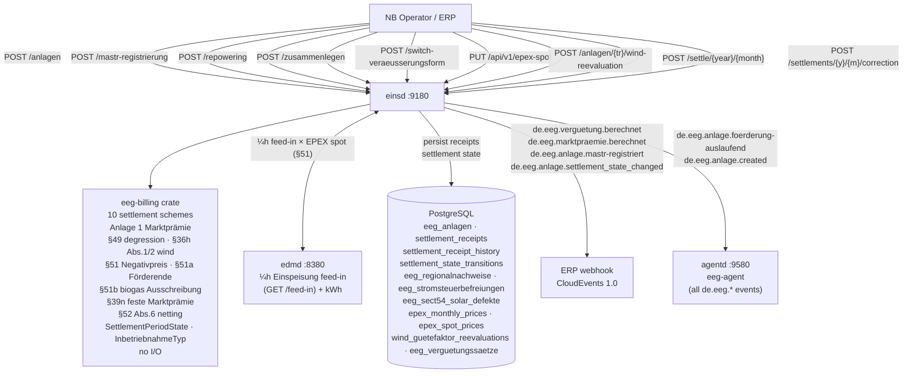
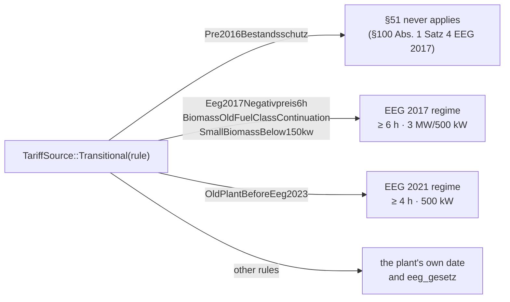
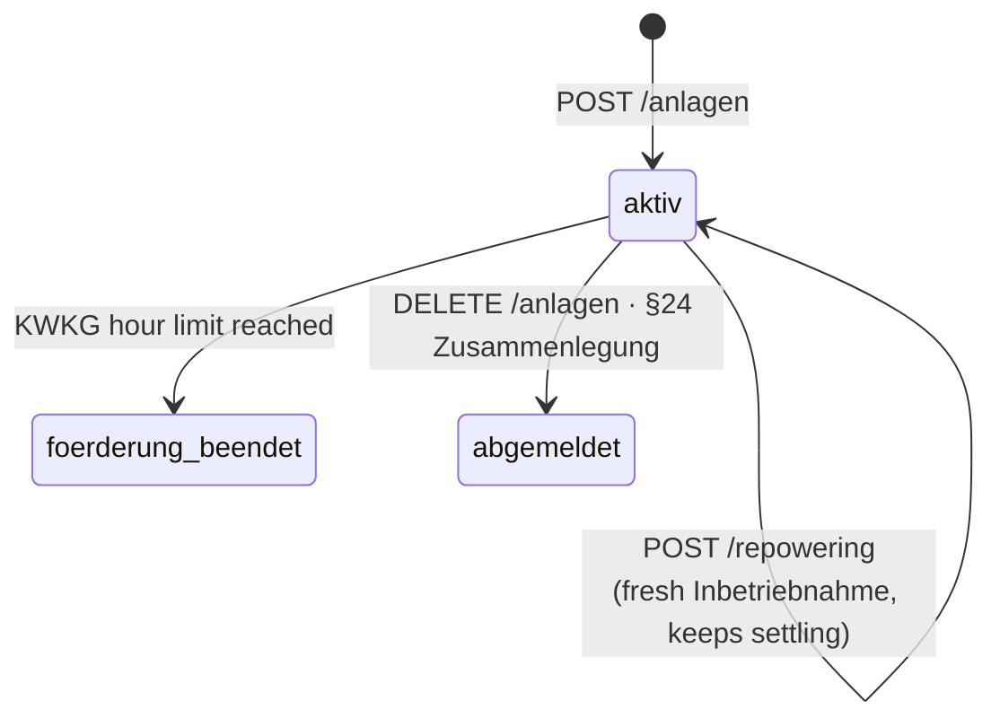
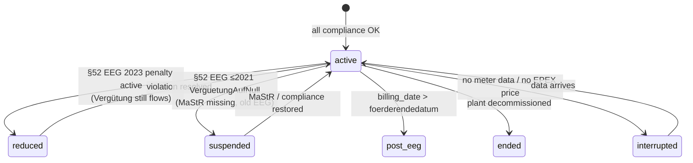
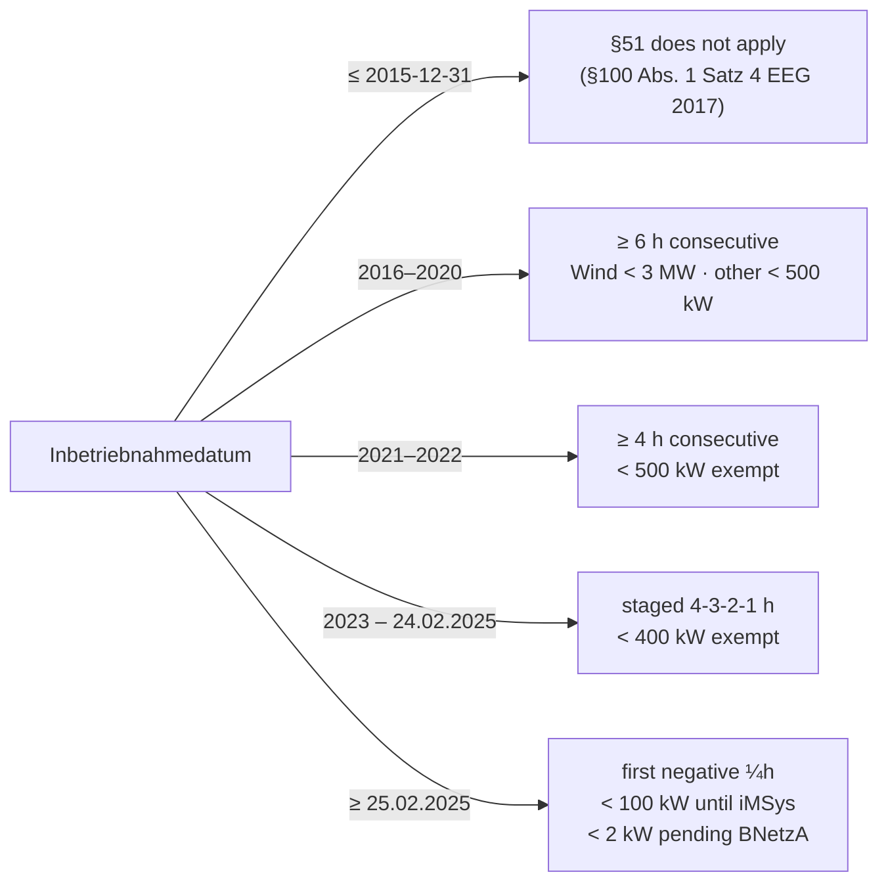
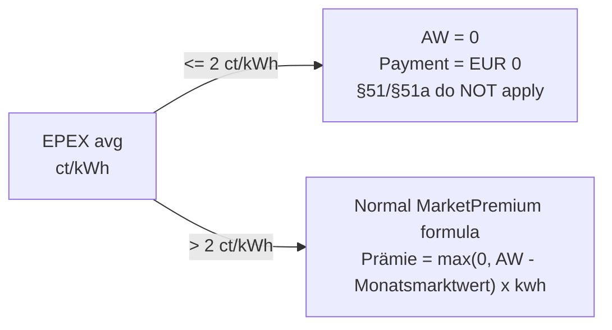
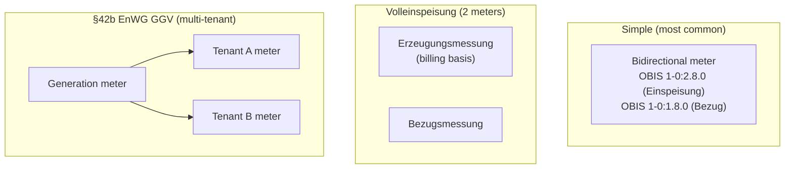
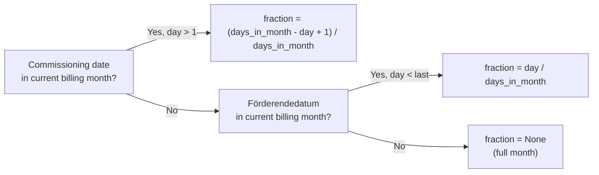

+++
title = "einsd Operator Guide"
description = "einsd operator guide — Einspeiser Registry + EEG/KWKG Settlement daemon. 12 settlement models, date-keyed §51 Negativpreisregel incl. the Solarspitzengesetz, EEG version-aware Bestandsschutz, Anlage 1 gleitende Marktprämie, §49 semi-annual solar degression, §36h Wind Korrekturfaktor, §42b EnWG GGV Messkonzept, §52 Pflichtzahlungen + §52 Abs. 6 Netting, SettlementPeriodState lifecycle, Repowering (§3 Nr. 30 i.V.m. §25), Zusammenlegung §24, KWKG Förderdauer, §14 UStG Gutschrift, §§53b–54 AW-Reduktionen, 19 MCP tools, eeg-agent."
weight = 28
[extra]
mermaid = true
+++
# `einsd` — Einspeiser Registry + EEG/KWKG Settlement

`einsd` is the **Einspeiser Registry and EEG/KWKG Settlement daemon**. It manages the full
lifecycle of decentralised renewable feed-in plants under the EEG (all versions 2000–2023+)
and CHP plants under the KWKG, covering **10 settlement schemes** and all generation technology
types.

Settlement arithmetic is implemented in the separate
[`eeg-billing`](https://github.com/hupe1980/mako/tree/main/crates/eeg-billing) library crate —
zero floating-point money, fully unit-tested, no I/O. The library is **EEG-version-aware**:
it enforces the correct §51/§52/§53 rules for each plant based on its `eeg_gesetz` year and
technology type, respecting Bestandsschutz for old plants commissioned before 2016.



Port: **`:9180`**

---

## Why `einsd` Exists

German EEG/KWKG law requires every **Netzbetreiber (NB)** to:

1. **Register** every feed-in plant with its commissioning date, capacity, applicable tariff,
   and governing EEG version — immutable for 20 years under EEG or fixed term under KWKG.
2. **Verify MaStR registration** before releasing Vergütung payments (§52 EEG 2023 / old
   §47 EEG 2021 via §100 Übergangsregelung).
3. **Calculate monthly remuneration** per the applicable settlement model and EEG version.
4. **Enforce the §51 Negativpreisregel version that governs each plant** — keyed on the
   commissioning **date**, because the Solarspitzengesetz rewrote §51 mid-year on
   25.02.2025; Bestandsanlagen keep their original rules.
5. **Alert** the asset owner ≥180 days before the Förderendedatum.
6. **Emit CloudEvents** to the ERP system for payment dispatch and accounting entries.

---

## EEG Version-aware Architecture

Every plant has an `eeg_gesetz` column that carries the version-**year**-dependent rules —
the §52 Pflichtverstoß regime and the §100 Übergangsbestimmungen. The `eeg-billing` library
exposes an `EegGesetz` enum (8 variants) for it:

```
EegGesetz::Kwkg       — KWKG plants (no EEG §52 rules)
EegGesetz::Eeg2000    — EEG 2000 plants
EegGesetz::Eeg2004    — EEG 2004 plants
EegGesetz::Eeg2009    — EEG 2009 plants
EegGesetz::Eeg2012    — EEG 2012 + 2014 amendment plants
EegGesetz::Eeg2017    — EEG 2017 plants (commissioned 2016-01-01 through 2020-12-31)
EegGesetz::Eeg2021    — EEG 2021 plants (commissioned 2021-01-01 through 2022-12-31)
EegGesetz::Eeg2023    — EEG 2023 plants (commissioned from 2023-01-01)
```

Adding a future EEG variant requires only one new enum variant — the Rust compiler enforces
exhaustive handling in all `match` sites across the codebase.

**§51 is deliberately not one of these rules.** `EegGesetz` exposes no §51 threshold and no
kW exemption, because §51 is not a function of the law year: the Solarspitzengesetz took
effect on 25 February 2025, inside the EEG 2023 range, so two "EEG 2023" plants can be
governed by different §51 rules. `NegativpreisRegime::fuer_inbetriebnahme` is the single
source — see [§51 EEG — Negativpreisregel](#ss51-eeg-negativpreisregel).

### Bestandsschutz

The applicable settlement rules are determined according to the transition provisions of §100 EEG.
Many rule aspects remain as originally commissioned; others (e.g. new sanctions, technical
requirements, Solarpaket I changes) may apply regardless of the original commissioning date.
Confirm specific plant scenarios against the applicable §100 provisions before relying on this
simplification.

The §51 thresholds are set out in
[§51 EEG — Negativpreisregel](#ss51-eeg-negativpreisregel) and are keyed on the commissioning
date, not on this column. Other rules may differ independently.

Sources: §100 Abs. 1 Satz 4 EEG 2017, §100 EEG 2021 Abs. 2 Nr. 13, §100 EEG 2023 Abs. 1.

Store `eeg_gesetz` as one of the canonical years (0, 2000, 2004, 2009, 2012, 2017, 2021,
2023). The `from_db_year()` function accepts intermediate years defensively
(e.g. 2018 → EEG 2017, 2022 → EEG 2021).

### §100 Transition Rules (`TariffSource::Transitional`)

For old plants with a specific `§100` transition provision, supply
`tariff_source = Transitional(rule)`. `eeg-billing` then derives both the effective
`EegGesetz` (for §52) and the §51 `NegativpreisRegime` from the rule rather than from the
plant record — preventing a silent miscalculation when `eeg_gesetz` or the commissioning date
is set incorrectly in the DB.



| `Paragraph100Rule` | Effective regime | Source |
|---|---|---|
| `Pre2016Bestandsschutz` | §51 never applies | §100 Abs. 1 Satz 4 EEG 2017 |
| `Eeg2017Negativpreis6h` | ≥ 6 h, 3 MW/500 kW | §100 Abs. 2 Nr. 13 EEG 2021 |
| `BiomassOldFuelClassContinuation` | EEG 2017 — old §42–44 fuel rules | §100 Abs. 6 EEG 2023 |
| `SmallBiomassBelow150kw` | EEG 2017 — small biomass FiT | §100 Abs. 11 EEG 2023 |
| `OldPlantBeforeEeg2023` | ≥ 4 h, 500 kW (all types) | §100 Abs. 1 EEG 2023 |
| all other rules | the plant's own commissioning date | — |

Enforced by `SettleInput::effective_eeg_gesetz()` and
`SettleInput::negativpreis_regime()` in the formula dispatcher.

### §53 EEG — Vergütungsabzug

All EEG versions (2017, 2021, 2023) deduct a flat amount from the gross `anzulegender Wert`
(AW) before paying Einspeisevergütung:

| Technology | §53 deduction | Formula for DB storage |
|---|---|---|
| Solar PV, Wind | **−0.4 ct/kWh** | `verguetungssatz_ct = AW − 0.4` |
| Biomasse, Wasserkraft, Gas variants | **−0.2 ct/kWh** | `verguetungssatz_ct = AW − 0.2` |

**Always store the net rate** in `verguetungssatz_ct`. Use the
`eeg_billing::rates::sect53_deduction(ErzeugungsArt)` helper to compute it from the gross AW.
§53 does **not** apply to Direktvermarktung, PostEegSpot, or KWKG plants.

---

## Generator Types (`erzeugungsart`)

| Value | Technology | Legal basis |
|---|---|---|
| `SOLAR_AUFDACH` | Rooftop PV | §21 + §48 EEG 2023 |
| `SOLAR_FREIFLAECHE` | Ground-mounted PV | §28 EEG 2023 |
| `SOLAR_AGRIPV` | Agri-PV | §37 Abs. 1 Nr. 3 + §48 EEG 2023 |
| `SOLAR_MIETERSTROM` | Building community solar | §21 Abs. 3 EEG 2023 |
| `SOLAR_STECKER` | Balkonkraftwerk <800 W | §9 EEG 2023 |
| `WIND_ONSHORE` | Wind onshore | §§21, 28, 36 EEG 2023 |
| `WIND_OFFSHORE` | Wind offshore | §§70ff EEG 2023 |
| `BIOMASSE` / `BIOMASSE_HOLZ` | Solid biomass | §42 EEG 2023 |
| `BIOGAS` / `BIOMETHAN` | Fermentation / upgraded gas | §42 EEG 2023 |
| `KLAEGAS` / `GRUBENGAS` / `DEPONIEGAS` | Sewage / mine / landfill gas | §41 EEG 2023 |
| `WASSERKRAFT` | Hydro | §40 EEG 2023 |
| `GEOTHERMIE` / `GEZEITEN` | Geothermal / tidal | §§45–46 EEG 2023 |
| `KWKG` | Combined heat & power | §7 KWKG 2023 |

There is deliberately **no generic `SOLAR`**: the §48 rate depends on the Bauform, so a plant
recorded as "solar, unspecified" cannot be priced. Every plant also carries a
`verguetungsform` (`UEBERSCHUSS` · `VOLLEINSPEISUNG` · `KWK_ZUSCHLAG`), because
Überschuss- and Volleinspeisung rates for the same band and date differ by the §48 Abs. 2a
bonus — 8,11 vs. 12,91 ct/kWh for a ≤ 10 kWp roof plant.

`ErzeugungsArt` also drives the §51 wind carve-out: under EEG 2017 wind turbines get the 3 MW
exemption (§51 Abs. 3 Nr. 1), while solar and biomasse plants get 500 kW (Nr. 2). EEG 2021
dropped the distinction.

---

## Settlement Models

`einsd` stores **one token per settlement model** in `eeg_anlagen.settlement_model`, and the
same token on every `settlement_receipts` row. The schema's `CHECK` list and
`einsd::models::ALL` are asserted equal by `tests/schema_code_guard.rs`, so a model cannot be
half-added.

There is exactly one token per model — no German/English aliases — so a gate cannot apply to
one spelling and miss the other.

| `settlement_model` | Regulation | Formula | CloudEvent |
|---|---|---|---|
| `VERGUETUNG` | §21 Abs. 1 EEG 2023 | `kwh × verguetungssatz_ct / 100` | `de.eeg.verguetung.berechnet` |
| `AUSFALLVERGUETUNG` | §21 Abs. 1 Nr. 2 EEG 2023 | same, at the statutory reduced rate | `de.eeg.verguetung.berechnet` |
| `MIETERSTROM` | §21 Abs. 3 EEG 2023 | `kwh × (verguetung + mieter_zuschlag) / 100` | `de.eeg.verguetung.berechnet` |
| `GGV` | §42b EnWG | §21 rate on the grid feed-in at the GGV MaLo | `de.eeg.verguetung.berechnet` |
| `DIREKTVERMARKTUNG` | §20 EEG 2023 | Anlage 1 gleitende Marktprämie, see below | `de.eeg.marktpraemie.berechnet` |
| `AUSSCHREIBUNG` | §22 EEG 2023 | same formula, AW from the BNetzA tender | `de.eeg.marktpraemie.berechnet` |
| `SONSTIGE_DIREKTVERMARKTUNG` | §21a EEG 2023 | EUR 0 EEG payment (revenue on the open market) | _(none)_ |
| `POST_EEG_SPOT` | after the Förderdauer | `kwh × Marktwert_ct / 100` (configurable floor) | `de.eeg.verguetung.berechnet` |
| `EIGENVERBRAUCH` | no grid feed-in | EUR 0 | _(none)_ |
| `KWKG_ZUSCHLAG` | §7 KWKG 2023 | `eligible_kwh × rate / 100` (hour-limit cap) | `de.eeg.verguetung.berechnet` |
| `FLEXIBILITAET` | §50b EEG 2023 | `kwh × (verguetung + flex_praemie) / 100` | `de.eeg.verguetung.berechnet` |
| `FLEXIBILITAET_ZUSCHLAG` | §50a EEG 2023 | `kw × rate_eur_per_kw / 12` (capacity payment) | `de.eeg.verguetung.berechnet` |

**Ausschreibung is not a separate formula.** It is the Marktprämie with
`TariffSource::Auction` — the same calculation on an **auction-determined anzulegender Wert**.
Award validity, reductions and revocation are the caller's responsibility; the library
receives the already-resolved AW.

### Anlage 1 EEG 2023 — die gleitende Marktprämie

Anlage 1 Nr. 3.1.2 defines the Marktprämie as the anzulegender Wert minus the
Monatsmarktwert, floored at zero:

```
Marktprämie = max(0, AW − Monatsmarktwert) × kwh / 100
```

There is **no additive Managementprämie**. Marketing costs have been folded into
the anzulegender Wert since EEG 2014 — the §53 Vergütungsabzug (0.4 ct/kWh solar
and wind, 0.2 ct/kWh biomass and gas) is that same cost appearing on the
Einspeisevergütung route instead. Adding a premium on top would pay it twice.

When the Monatsmarktwert exceeds the AW the payment is zero: the plant earns from
the market, and there is no guaranteed floor to fall back on.

**KWKG rates** (§7 Abs. 1 KWKG 2023, from 01.01.2023):

| Plant size | KWK-Zuschlag | Förderdauer |
|---|---|---|
| ≤50 kW\_el | 8.00 ct/kWh | 20 years |
| 50–100 kW\_el | 6.00 ct/kWh | 20 years |
| 100–250 kW\_el | 5.00 ct/kWh | 20 years |
| 250 kW–2 MW\_el | 4.00 ct/kWh | 10 years |
| >2 MW\_el | 3.00 ct/kWh | 30,000 full-load hours |

**Settlement positions:** Each calculation returns a `positions` array for full auditability.
`eeg-billing` guarantees `Σ(positions[*].eur) = settlement_eur`.

**Precision:** `rust_decimal::Decimal` — never `f64`.

---

## Plant Lifecycle



A plant is `aktiv` from registration. A missing MaStR entry does **not** hold it in a separate
state — under §52 EEG 2023 the Vergütung keeps flowing and a Pflichtzahlung accrues alongside
it, which `settlement_state` records rather than `status`. Repowering leaves the plant `aktiv`;
it is recorded by `ist_repowering` + `repowering_datum`.

### Monthly settlement state

In addition to the plant `status` column, each plant has a `settlement_state` that
reflects its current billing lifecycle:



| `settlement_state` | Meaning |
|---|---|
| `active` | Full Vergütung flows normally. |
| `reduced` | §52 EEG 2023 Pflichtzahlung active; Vergütung unchanged. |
| `suspended` | §52 EEG ≤2021 `VerguetungAufNull`; no payment. |
| `interrupted` | Temporary: no meter data or EPEX price missing. |
| `post_eeg` | Förderdauer expired; EPEX spot basis. |
| `ended` | Plant decommissioned. |

The `settlement_state_transitions` audit table logs every change with the reason
(`MastrRegistered`, `Sect52ViolationDetected`, `FoerderungExpired`, …).

| Status (plant) | Meaning |
|---|---|
| `aktiv` | Registered and settling. |
| `foerderung_beendet` | The KWKG kWh limit has been reached. |
| `abgemeldet` | Decommissioned, or merged into a parent under §24. |

These are the only three values the service writes. A plant past its EEG Förderende stays
`aktiv` — its receipts carry `status = foerderung_beendet` for the months concerned, and
`settlement_state = post_eeg` records the lifecycle position.

---

## Inbetriebnahmeprozess

1. Physical commissioning by operator.
2. NB registers in `einsd` via `POST /api/v1/anlagen` (`mastr_registriert: false` if pending).
3. Operator registers plant at [marktstammdatenregister.de](https://marktstammdatenregister.de).
4. NB confirms via `POST /api/v1/anlagen/{tr_id}/mastr-registrierung` → plant → `aktiv`.
5. Monthly settlement auto-runs. Vergütung dispatched via CloudEvent.

### Registering a plant

```http
POST /api/v1/anlagen
Content-Type: application/json

{
  "tr_id":              "DE0123456789012345678901234567890",
  "malo_id":            "51238696012",
  "eeg_gesetz":         2023,
  "inbetriebnahme":     "2024-06-01",
  "leistung_kwp":       9.8,
  "erzeugungsart":      "SOLAR_AUFDACH",
  "verguetungssatz_ct": 8.11,
  "settlement_model":   "VERGUETUNG",
  "mastr_registriert":  true,
  "mastr_nummer":       "SEE900000012345",
  "einspeiser_id":      "EB-4711"
}
```

`einspeiser_id` names the plant's Anlagenbetreiber (see below) and is mandatory:
§ 7 Abs. 1 EEG 2023 puts the payment on the Netzbetreiber, so a plant nobody can be
paid for is not one this service can act on. Register the operator first.

`verguetungssatz_ct` = **net rate** (gross AW − §53 deduction). For solar: 8.51 ct gross
AW (Solarpaket I) − 0.4 ct = **8.11 ct net**. Use `POST /api/v1/verguetungssatz-lookup`
to get the gross AW, then subtract with `eeg_billing::rates::sect53_deduction()`.

`foerderendedatum` is computed automatically:
- **Statutory plants** (no BNetzA tender): **December 31 of year+20** (§25 Abs. 1 Satz 2 EEG)
  — 2024-06-01 → `2044-12-31`
- **Ausschreibungsanlagen** (`ausschreibungs_zuschlag_id` set): exact 20-year anniversary
  — 2024-06-01 → `2044-06-01`

### Confirming MaStR registration

```http
POST /api/v1/anlagen/{tr_id}/mastr-registrierung
Content-Type: application/json

{ "mastr_nummer": "SEE900000012345", "mastr_datum": "2024-06-15" }
```

Clears the §52 Abs. 1 Nr. 11 violation clock and emits `de.eeg.anlage.mastr-registriert` so the ERP can release any withheld payment. The plant `status` is untouched — it was already `aktiv`.

---

## Einspeiser (Anlagenbetreiber)

The party behind the plants is a record of its own, `einspeiser`, keyed by an
operator-assigned `einspeiser_id` (a customer number, a MaStR Marktakteur-ID, or a
UUID the ERP mints — `einsd` does not invent identities for parties it did not
register). A plant points at one with `eeg_anlagen.einspeiser_id`.

It is deliberately **not** a Vertrag. § 7 Abs. 1 EEG 2023 („Gesetzliches
Schuldverhältnis") forbids the Netzbetreiber from making its EEG obligations
conditional on a contract, so what the settlement needs is a party record.

What it carries is the set of facts that belong to the person rather than to any one
installation:

| Field | Why it is per operator |
|---|---|
| `ust_status` | The § 19 UStG Kleinunternehmer election is made by the person, not per installation, and it decides the VAT on every feed-in Gutschrift issued to them (`KLEINUNTERNEHMER` → 0 %, EN 16931 category `E`; `REGELBESTEUERUNG` → 19 %, category `S`). § 12 Abs. 3 UStG (the 0 % on PV *hardware* supply) is not a feed-in category and never appears here |
| `bank_iban` / `bank_bic` / `zahlungsempfaenger` | One payout account; forwarded in the settlement CloudEvent so `accountingd` builds the pain.001 without a second lookup |
| `mastr_akteur_id` | The MaStR Marktakteursnummer (`SEE…`/`ABR…`), where the operator has one |

```http
PUT /api/v1/einspeiser/EB-4711
Content-Type: application/json

{
  "name":               "Max Mustermann",
  "mastr_akteur_id":    "ABR900000012345",
  "ust_status":         "KLEINUNTERNEHMER",
  "bank_iban":          "DE89370400440532013000",
  "bank_bic":           "COBADEFFXXX",
  "zahlungsempfaenger": "Max Mustermann"
}
```

One call switches the VAT on every one of the operator's plants. An `ust_status` this
build does not know aborts the settlement rather than falling back to a default — a
§ 14 UStG document may not carry a VAT rate the Netzbetreiber inferred.

---

## Registration is validated, not merely stored

`POST /api/v1/anlagen` refuses a plant the settlement could not honestly act on, and the
message names the field. The rules are in `validate::check`, and the ones that matter are
not stylistic:

| Rejected | Why |
|---|---|
| `DIREKTVERMARKTUNG` without a positive `direktverm_aw_ct` | the Marktprämie is `max(0, AW − Marktwert)`, so **every month would settle to EUR 0 with status `calculated`** and emit a payout event for it |
| `AUSSCHREIBUNG` without an AW **or** without `ausschreibungs_zuschlag_id` | same arithmetic; and an awarded value with no award behind it cannot be audited |
| `leistung_kwp ≤ 0` | it drives the §9 band, the §52 charge (10 €/kW — a negative capacity would *credit* the operator), the §44b quota and the §51 size test |
| `MIETERSTROM` without `mieter_zuschlag_ct` | the plant would settle as a plain Einspeisevergütung |
| `KWKG_ZUSCHLAG` without an hour or year limit | §8 KWKG bounds the Zuschlag by one or the other; with neither it never ends |
| technology and statute disagreeing | a KWK plant with `eeg_gesetz ≠ 0`, an EEG plant with `0`, a solar plant on the KWKG model, or a `verguetungsform` that belongs to the other statute |

A tender plant may carry its anzulegender Wert in **either** column. `zuschlagswert_ct` —
the field named after the award — takes precedence at settlement.

The engine holds the same line independently: a Marktprämie with no AW is `PriceMissing`,
not a zero settlement. Zero is only ever a *derived* AW (§51, §51b, §54 Abs. 4), and each
of those sets it after the check.

---

## §9 / §52 EEG — Steuerbarkeit und Pflichtzahlungen

§52 Abs. 1 lists **twelve** Pflichtverstöße. Each charges the operator 10 €/kW per
calendar month (Abs. 2), drops to 2 € once the obligation is met (Abs. 3), is capped at
10 €/kW in total (Abs. 5) and may be netted against the Vergütung (Abs. 6).

`einsd` derives the five the plant record can actually establish, in one place
(`sect52::derive_pflichtverstoesse`), and feeds them all into the settlement:

| §52 Abs. 1 | Violation | Derived from |
|---|---|---|
| Nr. 1 | §9 Steuerbarkeit not satisfied | `sect9_erfuellung` × capacity × technology |
| Nr. 4 | §10b Direktvermarktungspflicht | capacity > 100 kW on an Einspeisevergütung model |
| Nr. 5 | Ausfallvergütung past its Höchstdauer | the settlement receipts |
| Nr. 9 | §21c switch not notified | `veraeusserungsform_notification_sent_at` |
| Nr. 11 | MaStR registration missing | `mastr_registriert` |

The remaining seven (Nr. 2, 3, 6, 7, 8, 9a, 10, 12) turn on facts `einsd` does not hold —
storage behaviour, metering resolution, Doppelvermarktung. Record them on the plant's
`notes` and settle a correction.

### §9 is staged by capacity

The Steuerbarkeit obligation is **not** a single threshold:

| Installed capacity | Obligation | Basis |
|---|---|---|
| Steckersolargerät < 2 kW (≤ 800 VA) | none | §9 Abs. 1 Satz 2 |
| < 25 kW | 60 % Leistungsbegrenzung | §9 Abs. 2 Nr. 3 |
| 25 kW – < 100 kW | Fernsteuerbarkeit **or** the 60 % Leistungsbegrenzung | §9 Abs. 2 Nr. 2 |
| ≥ 100 kW | Fernsteuerbarkeit; the 60 % route is not available | §9 Abs. 2 Nr. 1 |

Each plant therefore records **how** it satisfies §9, not merely when a
Fernsteuerbarkeit was installed:

```json
{ "sect9_erfuellung": "LEISTUNGSBEGRENZUNG_60" }
```

`KEINE` (the default) is a Nr. 1 violation wherever §9 requires anything, so a compliant
plant has to say which route it took.

---

## §51 EEG — Negativpreisregel

During negative EPEX Spot periods the anzulegender Wert falls to zero. **Which version of
§51 applies is a function of the plant's Inbetriebnahmedatum, not of its EEG law year.**

The **Solarspitzengesetz** (Gesetz zur Änderung des EnWG, in force **25 February 2025**)
rewrote §51 mid-year. Two plants that are both "EEG 2023" plants are therefore governed by
entirely different rules depending on the day they were commissioned — a 200 kWp plant from
June 2024 is exempt, the same plant from June 2025 is not. `eeg-billing` models this with
`NegativpreisRegime::fuer_inbetriebnahme`, keyed on the exact date.

| Inbetriebnahme | §51 trigger | Exemption | §51a extension |
|---|---|---|---|
| ≤ 2015-12-31 | never applies (§100 Abs. 1 Satz 4 EEG 2017) | — | — |
| 2016-01-01 – 2020-12-31 | ≥ **6** consecutive hours | Wind < 3 MW · sonstige < 500 kW | none |
| 2021-01-01 – 2022-12-31 | ≥ **4** consecutive hours | < 500 kW (wind carve-out removed) | ausschreibungspflichtige only |
| 2023-01-01 – 2025-02-24 | staged **4-3-2-1 h** (4 h for IBN 2023, 3 h from IBN 2024) | < **400 kW** | ausschreibungspflichtige only |
| ≥ 2025-02-25 | from the **first negative quarter-hour** | < 100 kW until iMSys · < 2 kW until the §85 Abs. 2 Nr. 12 Festlegung | **all** plants |

Pilotwindenergieanlagen (§3 Nr. 37 EEG 2023) are carved out under every version at any size —
register them with `ist_pilotwindanlage: true`.

### §100 — the Bestandsanlagen opt-in

A plant on an older vintage may declare in Textform to the Netzbetreiber that §§ 51 and 51a
shall apply to it. The declaration runs **at the earliest from the end of the calendar year in
which the plant is fitted with an iMSys**, and from then the plant forgoes payment during
negative prices and is paid **0,6 ct/kWh more** on its anzulegender Wert for everything else.

Record the declaration date on the plant; `einsd` derives the effective date from it and
`imesys_rollout_datum`, and picks the regime per billing period:

```json
{ "sect51_optin_erklaert_am": "2026-03-01", "imesys_rollout_datum": "2026-09-01" }
```

A declaration on a plant without an iMSys is on file and simply does not run yet.



The reduction is driven by two inputs on the settle request — the feed-in that fell in
qualifying negative-price intervals (`kwh_during_negative_epex`, §51) and the count of those
quarter-hours (`negative_price_quarter_hours`, §51a):

```http
POST /api/v1/anlagen/{tr_id}/settle/2026/7
Content-Type: application/json

{ "einspeisemenge_kwh": 1000, "kwh_during_negative_epex": 80, "negative_price_quarter_hours": 16 }
```

Result: `effective_kwh = 920; settlement_eur = 920 × rate / 100`.

**Or omit both and let `einsd` derive them.** Load the EPEX day-ahead spot prices once, and
every settle (single, batch and the monthly auto-settle) that does **not** carry explicit
values fetches the plant's ¼h feed-in from edmd (`GET /api/v1/feed-in/{malo_id}`), overlays it
against the stored prices, and applies the plant's regime — including its run-length threshold
— in `eeg-billing::negativpreis`:

```http
PUT /api/v1/epex-spot
Content-Type: application/json

{ "source": "epex-day-ahead",
  "prices": [ { "delivery_start": "2026-07-01T12:00:00Z", "resolution_min": 15, "price_ct_kwh": -1.5 }, … ] }
```

The billing month is taken in **Europe/Berlin**, not UTC: both the day-ahead curve and edmd's
¼h series are published for the German market time, so a UTC window shifted the month by an
hour (two at DST) and matched the first hour against the previous month's prices.

A **§60 Abs. 2 MsbG gate** guards the auto-derivation: when edmd reports the month's feed-in
coverage below 95 % or any non-billable interval, `einsd` **skips** the automatic reduction and
logs it (deriving on incomplete data would find too few negative kWh and overpay) — supply
`kwh_during_negative_epex` manually or backfill substitute values in edmd instead. A month that
genuinely had no qualifying quarter-hour derives as **zero**, which is a different answer from
"nothing was known" and is recorded as such. The engine then applies the size / iMSys /
Pilotwind exemptions on top of the derived kWh. Explicit request values always win. The edmd
fetch authenticates with `edmd_api_key`, which must be registered in edmd's
`[[oidc.service_keys]]` (see below).

Applies to: `VERGUETUNG`, `AUSFALLVERGUETUNG`, `MIETERSTROM`, `GGV`, `DIREKTVERMARKTUNG`,
`AUSSCHREIBUNG`, `FLEXIBILITAET`.
Not to: `POST_EEG_SPOT` (no AW left to reduce), `KWKG_ZUSCHLAG` (a different statute),
`EIGENVERBRAUCH`, `SONSTIGE_DIREKTVERMARKTUNG`, `FLEXIBILITAET_ZUSCHLAG` (capacity-based).

### §51a — Verlängerung des Vergütungszeitraums

For the quarter-hours where §51 reduced the AW to null, the Vergütungszeitraum is extended.
**The claim is not universal**: before the Solarspitzengesetz it existed only for
ausschreibungspflichtige Anlagen, so a statutory-AW plant commissioned in 2024 loses those
quarter-hours outright. From 25 February 2025 it covers every plant §51 reduces.

`einsd` accrues the **raw** lost quarter-hours per plant (`negative_price_qh_gesamt`), and the
rounding is applied **once over the 20-year total** when settling — never per month — so the
extension never over-counts:

- **Solar PV**: the quarter-hours are multiplied by 0,5 into a Volllastviertelstunden
  contingent and drawn down against the §51a Abs. 2 monthly table (73 in December, 508 in
  June).
- **All others**: rounded up to whole calendar days (96 QH/day, Abs. 1 Satz 2).

The plant's stored `foerderendedatum` stays the statutory one; `effektives_foerderende`
derives the extended end at settlement time, so a plant keeps being paid through the
extension.

A correction settlement that carries no §51 figures leaves the period's accrual **unchanged**.
The accrual row holds each period's absolute contribution, so writing a zero would silently
hand back an extension the original settlement had earned.

### §36h Abs. 2 — Wind Standortgüte re-evaluation

An onshore wind plant's anzulegender Wert is location-corrected by a Korrekturfaktor derived
from its Gütefaktor (§36h Abs. 1, Anlage 2). Under **§36h Abs. 2**, that Gütefaktor is
**re-evaluated with effect from the start of the 6th, 11th and 16th operating year** against
the measured Standortertrag of the preceding five years. Record each one:

```http
POST /api/v1/anlagen/{tr_id}/wind-reevaluation
Content-Type: application/json

{ "wirksam_ab_jahr": 6, "guetefaktor": 0.95 }
```

`einsd` stores the re-evaluations in `wind_guetefaktor_reevaluations` and, at settle time,
`build_settle_input` selects the Korrekturfaktor whose effective year has been reached —
so a plant automatically steps to the re-evaluated rate from year 6/11/16. The response flags
`reconciliation_required` when the recomputed Gütefaktor deviates **more than 2 percentage
points** (§36h Abs. 2 Satz 2): settle the reviewed five-year period's over-/under-payment as a
`§147 AO` correction (repayment interest EURIBOR-12M + 1 pp, Satz 3).

### §51b — Biogas Ausschreibung at slightly-positive prices

§51b EEG 2023 applies exclusively to **biogas plants (fermentation only, not biomethane)**
whose Anzulegender Wert was set by BNetzA tender. The rule is triggered by a
**slightly-positive EPEX price**, not a negative one:

> When `epex_avg_ct_kwh ≤ 2 ct/kWh`, the AW reduces to **zero** for that period.
> No payment is made. §51/§51a do **not** apply to these plants (§51b Satz 2 EEG 2023).



Register biogas Ausschreibungsanlagen with `is_biogas_sect51b: true`.
The settlement formula automatically returns EUR 0 with position label `§51b EEG 2023`
for any period where the EPEX average is ≤ 2 ct/kWh.

---

## §21 Abs. 1 Satz 1 Nr. 3 — Ausfallvergütung

The fallback for a plant above 100 kW whose Direktvermarkter drops out. Two rules attach
to it, and both are enforced:

- **§53 Abs. 3**: the anzulegender Wert is reduced by **20 %**, rounded to two decimals.
  Register the plant's *ordinary* rate — the engine applies the cut.
- **Höchstdauern**: at most **three consecutive** calendar months and **six calendar
  months per calendar year**. Exceeding either is a §52 Abs. 1 Nr. 5 Pflichtverstoß at
  10 €/kW/month, counted from the settlement receipts.

```http
POST /api/v1/anlagen/{tr_id}/settle/2026/4
```

A plant in its fourth consecutive Ausfallvergütung month is still settled — the statute
does not stop the payment — but the receipt now carries the Pflichtzahlung alongside it.

### §51 Abs. 3 — the reporting duty

An operator on the Ausfallvergütung must report, with the §71 Abs. 1 Nr. 1 data, the
quantity it fed in while the Spotmarktpreis was **continuously** negative. Where nothing
establishes that quantity, the month's claim falls by **5 % per calendar day** on which
such a period fell, wholly or partly — twenty such days extinguish it.

`einsd` counts the days from the EPEX spot store (in Europe/Berlin, so a run across
midnight counts both days) and applies the cut only when the §51 feed-in figure could not
be established at all. A figure **derived** from edmd counts as established: it comes from
the Netzbetreiber's own metering, which is what the report would have supplied.

The two reductions compose in statutory order — §53 Abs. 3 cuts the anzulegender Wert,
then §51 Abs. 3 cuts the resulting claim.

---

## §23a EEG 2023 — Quarterly Solar PV Degression

Solar PV tariff rates decrease quarterly. The `eeg-billing` crate provides the degression
formula; actual BNetzA-published quarterly rates are stored in `eeg_verguetungssaetze`.

**Solarpaket I reference rates (Q2 2024, §48 EEG 2023 n.F.):**

| Capacity | Überschusseinspeisung | Volleinspeisung |
|---|---|---|
| ≤10 kWp | 8.51 ct/kWh | 13.31 ct/kWh |
| ≤40 kWp | 7.43 ct/kWh | 11.23 ct/kWh |
| ≤100 kWp | 7.64 ct/kWh | 12.74 ct/kWh |
| ≤400 kWp | 7.64 ct/kWh | 10.84 ct/kWh |
| ≤1 MWp | 7.64 ct/kWh | 9.54 ct/kWh |

For plants commissioned after Q2 2024, use `lookup_statutory_rate` MCP tool or
`GET /api/v1/verguetungssatz-lookup` to retrieve the correctly degresssed rate for the
commissioning quarter.

**§49 degression.** Solar anzulegende Werte fall by a fixed **1 %** every six
months, on 1 February and 1 August, starting 01.02.2024. The steps compound on
the unrounded value and each result is rounded kaufmännisch to the cent, which is
what reproduces the BNetzA-published series exactly. The GW-dependent "atmender
Deckel" of earlier EEG versions no longer exists.

---

## §§20–22 EEG 2023 — Direktvermarktung

### Mandatory threshold (§20)

Plants > 100 kW installed capacity must participate in Direktvermarktung. Plants that fail
to do so while above the threshold trigger `DirektvermarktungspflichtVerletzt` (§52 Abs. 1
Nr. 4). Use the `AUSFALLVERGUETUNG` model for plants whose Direktvermarkter is temporarily
unavailable (Ausfallvergütung per §21 Abs. 1 Nr. 2 EEG 2023 — `TemporaryFeedInTariff` is this
library's abstraction for the statutory fallback remuneration).

### Ausschreibungspflicht (§22)

| Technology | Threshold |
|---|---|
| Solar PV | > 1,000 kWp |
| Wind onshore | > 750 kW |
| Biomasse | > 150 kW |
| Wasserkraft | > 500 kW |
| Geothermie | > 150 kW |
| Wind offshore | always |

Plants above these thresholds must use `tariff_source = Auction` with the BNetzA-awarded AW.
The `direktvermarktung` and `capacity_blocks` columns track this.

---

## Multi-Meter Messkonzept

German EEG plants can have multiple measurement points. `einsd` stores none of that: the
metering **topology and computation** — the Eigenverbrauch/Überschuss split and the §42b EnWG GGV tenant
allocation — belong to the metering domain, owned by `edmd` and the external
[`metering`](https://github.com/hupe1980/metering) crate (`AggregationRule` with
`PvSelfConsumption`, `GgvConstantAllocation`, `GgvProportionalAllocation`;
`compute_virtual_meter`; `MeasurementPoint`). `einsd` settles on the **already-aggregated
Einspeisemenge** edmd returns (`arbeitsmenge_kwh`, or the ¼h `/feed-in` series for §51), so
the settlement engine never re-derives the metering split:



For §42b Gemeinschaftliche Gebäudeversorgung, the tenant-vs-grid split (constant
`CCI+ZG6` or proportional `Z74` allocation) is computed in edmd via
`metering::AggregationRule`; einsd receives the resulting feed-in quantity and settles it.

---

## §52 EEG — the full violation catalogue

The detection and the §9 bands are in
[§9 / §52 EEG — Steuerbarkeit und Pflichtzahlungen](#ss9-ss52-eeg-steuerbarkeit-und-pflichtzahlungen);
this is the catalogue the engine prices against.

### Old plants (EEG ≤2021 via §100 Übergangsregelung)

Old plants use the three-tier `SanktionAlt` model — the breach reduces the Vergütung
itself, and there is **no separate Pflichtzahlung** to charge:

| Tier | §52 EEG ≤2021 | Vergütung effect |
|---|---|---|
| `VerguetungAufNull` | Abs. 1 | → **EUR 0** (MaStR not registered, §10b, §27a) |
| `VerguetungAufMarktwert` | Abs. 2 | → **EPEX Monatsmarktwert** (§9 Fernsteuerbarkeit missing) |
| `VerguetungReduziert20Prozent` | Abs. 3 | → **×0.80**, rounded to 2dp (MaStR late/partial) |

### New plants (EEG 2023, commissioned from 2023-01-01)

§52 Abs. 2: **Pflichtzahlung** from operator to NB — the Vergütung keeps flowing and the
charge may be netted against it (Abs. 6).

| `SanktionsTyp` | Nr. | Rate | Retroactively reducible? | Derived by `einsd`? |
|---|---|---|---|---|
| `FernsteuerbarkeitmFehlend` | Nr. 1 | €10/kW/month | Yes → €2 on fulfilment | **yes** |
| `SpeicherAnforderungNichtErfuellt` | Nr. 2 | €10/kW/month | No | no |
| `IMssAnforderungNichtErfuellt` | Nr. 3 | €10/kW/month | Yes → €2 | no |
| `DirektvermarktungspflichtVerletzt` | Nr. 4 | €10/kW/month | Yes → €2 | **yes** |
| `AusfallverguetungHoechstdauerUeberschritten` | Nr. 5 | €10/kW/month | No | **yes** |
| `EinspeiseverguetungUnzulaessigeNutzung` | Nr. 6 | €10/kW/month | No | no |
| `VeraeusserungsformWechselUngueltig` | Nr. 7 | €10/kW/month | No | no |
| `VeraeusserungsformNachweispflichtVerletzt` | Nr. 8 | €10/kW/month | No | no |
| `ZuordnungsWechselNichtGemeldet` | Nr. 9 | €10/kW/month | No | **yes** |
| `InbetriebnahmeVorgabeVerletzt` | Nr. 9a | **€2/kW always** | N/A (Abs. 3 Nr. 2) | no |
| `VolleinspeisungspflichtVerletzt` | Nr. 10 | **€2/kW always** | N/A (Abs. 3 Nr. 2) | no |
| `MastrNichtRegistriert` | Nr. 11 | €10/kW/month | Yes → €2 | **yes** |
| `DoppelvermarktungsverbotVerletzt` | Nr. 12 | €10/kW/month | No | no |

§52 Abs. 4 extra months: Nr. 7 (+3m), Nr. 9 (+1m), Nr. 10 (full calendar year), Nr. 12 (+6m).
§52 Abs. 5 cap: simultaneous violations are capped at €10/kW/month in total.

### Violation start tracking

- **On registration** (`POST /api/v1/anlagen`): `mastr_registriert = false` sets
  `mastr_violation_start = CURRENT_DATE` when not already tracked.
- **On MaStR confirmation** (`POST .../mastr-registrierung`): clears it, stopping accrual.
- **At settlement**: `monate_des_verstosses` counts inclusive calendar months from the
  start date, because §52 Abs. 2 charges for every month the breach subsists "ganz oder
  teilweise".

---

## §13a EnWG — Einspeisemanagement Compensation

When the NB curtails a plant's output (Einspeisemanagement / Redispatch 2.0), §13a EnWG requires compensation for the entgangene Einnahmen — modelled here at the AW rate. The §51 Negativpreisregel does not touch these kWh (they were never fed in).

```http
POST /api/v1/anlagen/{tr_id}/settle/2024/6
Content-Type: application/json

{ "einspeisemenge_kwh": 850, "einspeisemanagement_kwh": 150 }
```

`einsd` adds a separate §13a EnWG position to the settlement:
- Regular kWh: 850 × rate / 100
- EInsMan compensation: 150 × AW / 100 (separate billing position)
- Total: as if 1,000 kWh were fed in

Source: §13a EnWG (Redispatch 2.0, historically §15 EEG Härtefallregelung); §51 Abs. 1 EEG 2023 (curtailed kWh explicitly excluded).

---

## §21b EEG 2023 — Veräußerungsform Wechsel

Plants switch between Einspeisevergütung and Direktvermarktung monthly. Rules enforced:

- Plants > 100 kW **cannot** switch back to Einspeisevergütung (mandatory Direktvermarktung, §20 EEG 2023).
- Only **one switch per calendar month** is permitted (§21b / §21c EEG 2023).
- Effective date must be the **1st of a calendar month**.

```http
POST /api/v1/anlagen/{tr_id}/switch-veraeusserungsform
Content-Type: application/json

{
  "new_model": "DIREKTVERMARKTUNG",
  "effective_date": "2026-08-01",
  "direktvermarkter_mp_id": "9910000000001",
  "direktverm_aw_ct": 6.28
}
```

Returns `422 Unprocessable Entity` when:
- `PflichtgemasseDirektvermarktung` — plant > 100 kW cannot revert
- `AlreadySwitchedThisMonth` — switch already performed this calendar month

`last_veraeusserungsform_switch` is updated on success. All subsequent settlements use the new model.

---

## §§53b–54 EEG 2023 — reductions of the anzulegender Wert

These three statutes cut the **anzulegender Wert** itself, before any settlement
formula runs. That ordering is not a detail. The gleitende Marktprämie is
`max(0, AW − Marktwert)`, floored at zero, so a euro deduction
taken *after* the floor is a different number from a cut applied *before* it:
where the Marktwert already exceeds the AW the premium is zero, and a post-hoc
deduction would push the settlement negative — charging the operator for
electricity they fed in. `eeg-billing` therefore applies all of them to the AW
and records each as a zero-euro audit position naming its §, so a Gutschrift
shows every statute that touched the rate without double-counting the money.

Only the **triggering facts** are stored. Every amount except §53c's is fixed by
statute, so there is no rate column a data-entry error could use to invent a
deduction the law does not provide for.

| § | Trigger | Amount | Table |
|---|---|---|---|
| 53b | A Regionalnachweis (§79a) was issued, **and** the AW is *gesetzlich bestimmt* | −0,1 ct/kWh | `eeg_regionalnachweise` |
| 53c | Electricity transited through a grid **and** exempt from Stromsteuer | −the granted exemption | `eeg_stromsteuerbefreiungen` |
| 54 | Solar first-segment auction, four distinct defects | −0,3 / −0,3 / −2,5 ct/kWh, or AW → 0 | `eeg_sect54_solar_defekte` |

### §53b — Regionalnachweise

> "Der anzulegende Wert für Strom, für den dem Anlagenbetreiber ein
> Regionalnachweis ausgestellt worden ist, verringert sich bei Anlagen, deren
> anzulegender Wert **gesetzlich bestimmt** ist, um 0,1 Cent pro Kilowattstunde."

The qualifier is about how the AW was *determined*, not how the electricity is
marketed: a statutory-AW plant in Direktvermarktung is in scope, a tender-awarded
plant is not. Regionalnachweise are issued by the Herkunfts- und
Regionalnachweisregister; no BNetzA certificate and no grid area is involved.

```http
POST /api/v1/anlagen/{tr_id}/aw-reduktionen/regionalnachweis
Content-Type: application/json

{ "nachweis_ref": "HKNR-RN-2026-0001", "effective_from": "2026-01-01" }
```

No amount is accepted — the response echoes the statutory 0,1 ct/kWh.

### §53c — Stromsteuerbefreiung

> "Der anzulegende Wert verringert sich für Strom, der durch ein Netz
> durchgeleitet wird und der von der Stromsteuer nach dem Stromsteuergesetz
> befreit ist, um die Höhe der pro Kilowattstunde gewährten
> Stromsteuerbefreiung."

The amount is the exemption actually granted, which is why it is the one stored
value here. It is capped — in the schema and again in the engine — at the full
§3 StromStG rate of 20,50 EUR/MWh = 2,05 ct/kWh: an exemption cannot exceed the
tax it exempts from.

The combination is narrow in practice. §9 Abs. 1 Nr. 1 and Nr. 3 StromStG both
require self-consumption at, or supply in spatial connection to, the generating
plant — neither of which involves grid transit. Record a row only where an
exemption has actually been granted for grid-transited electricity.

```http
POST /api/v1/anlagen/{tr_id}/aw-reduktionen/stromsteuerbefreiung
Content-Type: application/json

{
  "befreiung_ct_kwh": "2.05",
  "rechtsgrundlage": "§9 Abs. 1 Nr. 1 StromStG",
  "effective_from": "2026-01-01"
}
```

### §54 — Ausschreibungen für Solaranlagen des ersten Segments

Solar first-segment tenders only. Four independent defects; Abs. 1 and Abs. 2
stack, and Abs. 4 zeroes the AW outright and subsumes the rest.

| Absatz | Defect | Effect |
|---|---|---|
| 1 | Zahlungsberechtigung applied for only after the 18th calendar month following announcement of the Zuschlag | −0,3 ct/kWh |
| 2 | Plant location does not match, even partly, the Flurstücke named in the bid | −0,3 ct/kWh |
| 3 | Nachweis of simultaneous crop cultivation / agricultural use (§37 Abs. 1 Nr. 3, §85c Abs. 1 Satz 4) not supplied | −2,5 ct/kWh |
| 4 | Landesverordnung under §37c Abs. 2 not met | AW → 0 |

Abs. 3 Satz 2/3 make the deduction lapse for the future once the proof arrives,
and retroactively for the periods it covers — so a late Nachweis is recorded by
closing the row's validity period, not by deleting it.

```http
POST /api/v1/anlagen/{tr_id}/aw-reduktionen/sect54-defekt
Content-Type: application/json

{ "zahlungsberechtigung_nach_18_monaten": true, "effective_from": "2026-01-01" }
```

A request setting no defect is refused: a row that deducts nothing is a
data-entry error, not a record.

When the missing Nachweis arrives, close the period rather than deleting the
row — that the plant was short for the earlier periods is what the §147 AO trail
has to keep:

```http
POST /api/v1/anlagen/{tr_id}/aw-reduktionen/sect54-defekt/{id}/nachweis-erbracht
Content-Type: application/json

{ "effective_until": "2026-07-31" }
```

### Inspecting what is in force

A settlement shrinks silently when one of these rows exists, so the cuts are
readable without settling again:

```http
GET /api/v1/anlagen/{tr_id}/aw-reduktionen?on=2026-07-01
```

```json
{
  "tr_id": "DE_TR_...",
  "stichtag": "2026-07-01",
  "reduktionen": [
    { "paragraph": "§53b EEG 2023", "grund": "Regionalnachweis (§79a EEG) ausgestellt",
      "abzug_ct_kwh": "0.1", "hinweis": "gilt nur bei gesetzlich bestimmtem anzulegendem Wert" },
    { "paragraph": "§54 Abs. 3 EEG 2023",
      "grund": "Nachweis der gleichzeitigen landwirtschaftlichen Nutzung fehlt",
      "abzug_ct_kwh": "2.5", "setzt_aw_auf_null": false }
  ]
}
```

---

## §51a EEG 2023 — Verlängerungsanspruch (Förderzeitraum extension)

Every §51 reduction accrues an extension entitlement. Pass
`negative_price_quarter_hours` explicitly, or let the auto-derivation (see
[§51 Negativpreisregel](#ss51-eeg-negativpreisregel)) supply it from the ¼h feed-in:

```http
POST /api/v1/anlagen/{tr_id}/settle/2024/6
Content-Type: application/json

{
  "einspeisemenge_kwh": 1000,
  "kwh_during_negative_epex": 80,
  "negative_price_quarter_hours": 12
}
```

`einsd` accrues the **raw** lost quarter-hours per plant in
`negative_price_qh_gesamt`. The rounding is applied **once over the 20-year total** at
settle time (never per month, which would over-count), and `effektives_foerderende`
derives the extended end — the stored statutory `foerderendedatum` is left untouched:

- **Solar PV**: the `ceil(qh / 2)` Volllastviertelstunden contingent, drawn down month
  by month at the statutory monthly-table rate (§51a Abs. 2 EEG 2023).
- **All others**: the lost quarter-hours rounded **up to whole calendar days**
  (96 QH/day, §51a Abs. 1 Satz 2).

---

## Monthly Settlement

```http
POST /api/v1/anlagen/DE0123456789.../settle/2024/6
Content-Type: application/json

{
  "einspeisemenge_kwh": 312.5,
  "kwh_during_negative_epex": 0,
  "negative_price_quarter_hours": 0,
  "einspeisemanagement_kwh": 0,
  "billing_days_fraction": null
}
```

`billing_days_fraction` is computed automatically (§25 Abs. 1 Satz 3) when `null`.
Supply explicitly to override.

Response:
```json
{
  "id": "3fa85f64-...", "billing_year": 2024, "billing_month": 6,
  "settlement_eur": 23.22, "faelligkeitsdatum": "2024-07-15", "status": "calculated",
  "positions": [
    { "description": "Einspeisevergütung §21 EEG 2023", "legal_basis": "§21 EEG 2023",
      "kwh": 312.5, "rate_ct_kwh": 7.43, "eur": 23.22 }
  ]
}
```

`faelligkeitsdatum` = **15th of the following calendar month** (§26 Abs. 1 EEG 2023:
*„monatlich jeweils zum 15. Kalendertag für den Vormonat“*).

| Status | Meaning |
|---|---|
| `calculated` | Amount computed successfully |
| `no_data` | `einspeisemenge_kwh` not supplied |
| `price_missing` | EPEX price needed; import via `PUT /api/v1/epex-monthly` |
| `foerderung_beendet` | Förderdauer ended; this period was prorated |
| `sanctioned` | §52 Abs. 1 EEG ≤2021 — Vergütung = 0 (`SanktionAlt::VerguetungAufNull`) |

Idempotent: re-running overwrites the previous result.

---

## Batch Settlement

```http
POST /api/v1/settle/2024/6
Content-Type: application/json

{ "dry_run": false }
```

```json
{ "total_plants": 42, "settled": 39, "skipped_no_data": 2,
  "skipped_price_missing": 1, "total_settlement_eur": "4813.22" }
```

The monthly auto-settle background worker triggers daily (settles previous month on or after
the 2nd — §26 EEG: payments due by 15th of following month).

---

## Jahresabrechnung

```http
POST /api/v1/anlagen/{tr_id}/jahresabrechnung/{year}
```

Derived from the stored receipts, not recomputed — the monthly runs are what created the
payment obligation. Each month contributes its **latest** receipt: the correction where one
exists, the original otherwise.

That was wrong until now. The statement summed only the non-correction rows, reasoning that
a correction must not be *added* to its month. True — but a correction does not supersede
its original in place either: it is a separate row and the original stays as it was. So the
statement reported the superseded amounts, and the one artifact whose stated purpose is to
agree with what was paid disagreed with exactly the receipts that were.

`missing_months` is bounded by the commissioning date and the Förderende, so a plant
commissioned in June is not missing January. Demanding all twelve made a plant's first and
last years permanently `vorlaeufig`, listing months that were never owed.

---

## § 147 AO / GoBD — Correction Settlement

When meter data or tariffs are corrected, create a correction receipt:

```http
POST /api/v1/anlagen/{tr_id}/settlements/{year}/{month}/correction
Content-Type: application/json

{
  "einspeisemenge_kwh": 340.5,
  "reason": "MeterDataCorrected",
  "reason_detail": "Corrected reading after Zählernachlesung on 2024-07-20"
}
```

The correction:
1. Snapshots the original receipt to `settlement_receipt_history` (immutable, § 147 AO / GoBD)
2. Re-runs settlement with corrected inputs
3. Stores `is_correction = true` and `correction_of = <original_id>` in the new receipt

| `CorrectionReason` | Use case |
|---|---|
| `MeterDataCorrected` | Corrected Einspeisemenge after Zählernachlesung |
| `TariffCorrected` | Wrong `verguetungssatz_ct` applied |
| `MastrRegistrationConfirmed` | Retroactive §52 sanction removal after MaStR confirmed |
| `CapacityCorrected` | Wrong `leistung_kwp` applied |
| `RegulatoryReprocessing` | BNetzA ruling changed billing basis |
| `FoerderendedatumCorrected` | §25 Abs. 1 Satz 2 date recalculated |
| `Other` | Manual correction with free-text detail |

The original receipt is always preserved in `settlement_receipt_history`. The correction chain is queryable via `correction_of`.

---

## §25 EEG — Anteilige Zahlung (Partial Billing Period)

When a plant is commissioned or its Förderdauer ends **mid-month**, only the calendar days
with entitlement count. `einsd` computes
`billing_days_fraction` automatically:



| Case | Example | `billing_days_fraction` |
|---|---|---|
| Commissioned June 15, 30-day month | 16 eligible days | `16/30 = 0.5333` |
| Förderendedatum June 20, 30-day month | 20 eligible days | `20/30 = 0.6667` |
| Full month | any | `null` (full amount) |

`billing_days_fraction` is applied to `settlement_eur` and all position amounts.
`pflichtzahlung_eur` is **not** prorated (penalties are per-calendar-month).

---

## Repowering (§3 Nr. 30 i.V.m. §25 EEG 2023)

> ⚠ **Implementation model, not a complete legal statement.** Repowering law is nuanced:
> whether the Förderdauer resets, and what new tariff applies, depends on the type and extent
> of the repowering and the applicable EEG provisions. This endpoint models the most common
> full-repowering case. Always confirm the specific plant scenario with the applicable EEG
> provisions and BNetzA guidance.

For the **full-repowering case**: the Förderdauer resets from the repowering date.
New `foerderendedatum` = December 31 of (year + 20) per §25 Abs. 1 Satz 2 EEG.

```http
POST /api/v1/anlagen/{tr_id}/repowering
Content-Type: application/json

{ "repowering_datum": "2026-05-01", "leistung_kwp_neu": 6.2 }
```

`eeg_gesetz` and `verguetungssatz_ct` are updated to the current law/rate. Original
`inbetriebnahme` is preserved in `ursprungs_inbetriebnahme`.

---

## Zusammenlegung (§24 EEG 2023)

§24 Abs. 1 deems several plants **one plant** for the §19 Abs. 1 claim and the
§21 Abs. 1 / §22 size determination. Because tariff bands and the tender
threshold are size-dependent, a merge the statute does not support moves the
survivor into a band it never qualified for — for the rest of its 20-year
Förderdauer, and indistinguishably from a legitimate merge once written. The
endpoint therefore evaluates §24 and **refuses** with `422` when it does not
apply, naming the rule that decided.

Satz 1 fuses two plants only when **all four** hold:

1. same Grundstück, Gebäude or Betriebsgelände, or otherwise in unmittelbarer
   räumlicher Nähe (`standort_id`, or `unmittelbare_raeumliche_naehe` on the
   request),
2. gleichartige erneuerbare Energien (`erzeugungsart`),
3. the §19 Abs. 1 claim depends on Bemessungsleistung or installierte Leistung,
4. commissioned within twelve consecutive calendar months (`inbetriebnahme`).

Sätze 2–5 then override that result:

| Satz | Rule |
|---|---|
| 2 | Biogas (not biomethane) from the **same** Biogaserzeugungsanlage is fused regardless of Satz 1 — including across sites and outside the window (`biogaserzeugungsanlage_id`) |
| 3 | Freiflächenanlagen are never fused with solar on, in or at buildings and Lärmschutzwände (`solar_montage`) |
| 4 | Building/Lärmschutzwand solar behind **different** Netzverknüpfungspunkte is not one plant (`netzverknuepfungspunkt`) |
| 5 | Steckersolargeräte ≤ 2 kW installed and ≤ 800 VA inverter, behind a Letztverbraucher's Entnahmestelle, are disregarded entirely |

**Ownership is not a criterion.** Satz 1 opens "unabhängig von den
Eigentumsverhältnissen", so two plants with different operators fuse just the
same; a model that keyed on operator identity would under-fuse, the direction
that overpays.

```http
POST /api/v1/anlagen/{tr_id}/zusammenlegen
Content-Type: application/json

{
  "parent_tr_id": "DE_PARENT_MAIN",
  "combined_leistung_kwp": "19.0",
  "unmittelbare_raeumliche_naehe": false
}
```

`unmittelbare_raeumliche_naehe` supplies Nr. 1's second limb and is a human
judgement about the pair, so it is asserted per request rather than derived. It
matters only when the two `standort_id` values differ.

On a permitted merge the child becomes `abgemeldet`, the parent's
`foerderendedatum` is unchanged (only Repowering resets it), and future
settlements run on the parent alone. Update `verguetungssatz_ct` if the combined
capacity crosses a rate band boundary. A refused merge changes nothing.

---

## EPEX Monthly Price

Required for `DIREKTVERMARKTUNG` and `POST_EEG_SPOT`:

```http
PUT /api/v1/epex-monthly/2024/6
Content-Type: application/json

{ "avg_ct_kwh": 6.82, "source": "netztransparenz.de" }
```

---

## 180-Day Alerts

```http
GET /api/v1/anlagen/foerderung-auslaufend?days=180
```

Background worker runs every 6h; emits `de.eeg.anlage.foerderung-auslaufend` per plant.

---

## EEG Vergütungssätze Reference

Gross AW for solar PV roof installations (§48 EEG 2023). Net rate = AW − 0.4 ct (§53).

| Period | ≤10 kWp AW | 10–40 kWp AW | Source |
|---|---|---|---|
| 2023-02 to 2024-04 | 8.11–8.20 ct | 6.79–7.10 ct | EEG 2023 initial |
| from 2024-05 (Solarpaket I) | **8.51 ct** | **7.43 ct** | BGBl I 2024 Nr. 107 |

See [BNetzA Einspeisevergütungen](https://www.bundesnetzagentur.de/DE/Fachthemen/ElektrizitaetundGas/ErneuerbareEnergien/Einspeiseverguetung/start.html).

---

## Endpoints

| Method | Path | Description |
|---|---|---|
| `GET` | `/api/v1/einspeiser` | List Anlagenbetreiber |
| `GET` | `/api/v1/einspeiser/{einspeiser_id}` | Fetch one Anlagenbetreiber |
| `PUT` | `/api/v1/einspeiser/{einspeiser_id}` | Register or update an Anlagenbetreiber (§19 UStG election, payout account) |
| `POST` | `/api/v1/anlagen` | Register plant |
| `GET` | `/api/v1/anlagen` | List plants (`?malo_id=&erzeugungsart=&status=`) |
| `GET` | `/api/v1/anlagen/{tr_id}` | Fetch plant |
| `PUT` | `/api/v1/anlagen/{tr_id}` | Update plant |
| `DELETE` | `/api/v1/anlagen/{tr_id}` | Decommission |
| `POST` | `/api/v1/anlagen/{tr_id}/mastr-registrierung` | **Confirm MaStR** → `aktiv`; clears §52 violation clock |
| `POST` | `/api/v1/anlagen/{tr_id}/repowering` | **Vollrepowering** — a fresh Inbetriebnahme restarts §25 |
| `POST` | `/api/v1/anlagen/{tr_id}/zusammenlegen` | **Zusammenlegung** §24 EEG — refuses with `422` when §24 Abs. 1 does not fuse the pair |
| `GET` | `/api/v1/anlagen/{tr_id}/aw-reduktionen` | What cuts the anzulegender Wert on `?on=` (default today), with statutory amounts |
| `POST` | `/api/v1/anlagen/{tr_id}/aw-reduktionen/regionalnachweis` | §53b — record a Regionalnachweis period (§79a) |
| `POST` | `/api/v1/anlagen/{tr_id}/aw-reduktionen/stromsteuerbefreiung` | §53c — record a granted per-kWh Stromsteuerbefreiung |
| `POST` | `/api/v1/anlagen/{tr_id}/aw-reduktionen/sect54-defekt` | §54 — record solar first-segment defects |
| `POST` | `/api/v1/anlagen/{tr_id}/aw-reduktionen/sect54-defekt/{id}/nachweis-erbracht` | §54 Abs. 3 Satz 2/3 — close the period once the Nachweis arrives |
| `GET` | `/api/v1/anlagen/by-malo/{malo_id}/veraeusserungsform` | Veräußerungsform in force for a MaLo — read by `processd`'s NB module, which needs the *bestehende* form to pick the `E_0622` Vorlauffrist |
| `POST` | `/api/v1/anlagen/{tr_id}/switch-veraeusserungsform` | **§21b** monthly Veräußerungsform switch |
| `POST` | `/api/v1/anlagen/{tr_id}/wind-reevaluation` | **§36h Abs. 2** Standortgüte re-evaluation (year 6/11/16) |
| `GET` | `/api/v1/anlagen/foerderung-auslaufend` | Expiring within N days |
| `POST` | `/api/v1/anlagen/{tr_id}/settle/{year}/{month}` | Monthly settlement (§13a EnWG EInsMan + §51a QH supported) |
| `POST` | `/api/v1/anlagen/{tr_id}/settlements/{year}/{month}/correction` | **§ 147 AO / GoBD** correction receipt (original preserved in history) |
| `POST` | `/api/v1/settle/{year}/{month}` | Batch settle all active plants |
| `GET` | `/api/v1/anlagen/{tr_id}/settlements` | Settlement history |
| `POST` | `/api/v1/anlagen/{tr_id}/jahresabrechnung/{year}` | Annual reconciliation from the stored monthly receipts |
| `PUT/GET` | `/api/v1/epex-monthly/{year}/{month}` | EPEX monthly average |
| `PUT` | `/api/v1/epex-spot` | Bulk-load EPEX day-ahead spot prices (§51 auto-derivation) |
| `PUT/GET` | `/api/v1/jahresmarktwert/{year}/{month}/{erzeugungsart}` | §20 Abs. 2 Jahresmarktwert (ÜNB-published) |
| `POST` | `/api/v1/verguetungssatz-lookup` | Tariff rate lookup |
| `GET/POST` | `/mcp` | MCP server (Streamable HTTP 2025-11-25) |
| `GET` | `/health` | Liveness |
| `GET` | `/health/ready` | Readiness |

---

## Configuration

| Key | Required | Default | Description |
|---|---|---|---|
| `database.url` | yes | — | PostgreSQL connection string (`env:…` supported) |
| `port` | no | `9180` | HTTP listen port |
| `tenant` | yes | — | Tenant identifier — data-isolation key (any stable string; typically the operator’s BDEW- or DVGW-Codenummer) |
| `erp_webhook_url` | no | — | ERP webhook for CloudEvents |
| `erp_hmac_secret` | no | — | HMAC-SHA256 signing secret |
| `edmd_url` | no | — | `edmd` URL for auto-fetching Einspeisemenge |
| `edmd_api_key` | no | — | Bearer token for `edmd` |
| `alert_interval_secs` | no | `21600` | Förderendedatum alert interval (6h) |
| `jahresmarktwert_url` | no | — | ÜNB source for the §20 Abs. 2 Jahresmarktwert import |
| `jahresmarktwert_import_interval_secs` | no | — | How often to poll it |
| `auto_settle_from_day` | no | — | Day of month the auto-settle worker may start. The ÜNB publishes the Marktwert around the 5th, so running earlier writes `price_missing` receipts for plants that were merely early |
| `auto_settle_catchup_months` | no | `3` | How many months back each sweep revisits (clamped 1–24), so a period the service was down for is not left unpaid |
| `[mcp]` | no | — | MCP `/mcp` authentication — API key, OIDC, or dev mode (`api_key = "env:EINSD_MCP_API_KEY"`) |
| `[oidc]` | yes | — | OIDC token verification for the REST API; required unless `allow_insecure_no_auth` |
| `allow_insecure_no_auth` | no | `false` | Serve every REST route unauthenticated — local development only |

```toml
# Minimal einsd.toml
port     = 9180
tenant   = "9910000000002"
edmd_url = "http://edmd:8380"

[database]
url = "postgresql://einsd:secret@db:5432/einsd"  # or "env:DATABASE_URL"
```

---

## Database Schema

Single consolidated schema (`services/einsd/migrations/0001_schema.sql`).

### `eeg_anlagen`

One row per Technische Ressource. PK: `(tr_id, tenant)`.

| Column | Type | Notes |
|---|---|---|
| `tr_id` | TEXT | Technische Ressource ID |
| `tenant` | TEXT | Data-isolation key (any stable string; typically the operator's BDEW- or DVGW-Codenummer) |
| `malo_id` | TEXT | 11-digit MaLo-ID |
| `eeg_gesetz` | SMALLINT | EEG law year (0, 2000, 2004, 2009, 2012, 2017, 2021, 2023) |
| `inbetriebnahme` | DATE | Commissioning date |
| `leistung_kwp` | NUMERIC | Installed peak power kWp (or kW\_el for KWKG) |
| `erzeugungsart` | TEXT | `SOLAR_AUFDACH`, `WIND_ONSHORE`, `BIOMASSE`, … |
| `verguetungssatz_ct` | NUMERIC | **Net** rate ct/kWh (gross AW minus §53 deduction) |
| `foerderendedatum` | DATE | Dec 31 of year+20 (statutory); exact 20y for Ausschreibung |
| `settlement_model` | TEXT | `VERGUETUNG`, `DIREKTVERMARKTUNG`, … (see the model table) |
| `sect9_erfuellung` | TEXT | §9: `KEINE` · `FERNSTEUERBARKEIT` · `LEISTUNGSBEGRENZUNG_60` |
| `leistung_kwp` | NUMERIC | `CHECK (> 0)` |
| `verguetungssatz_ct` | NUMERIC | `CHECK (>= 0)` |
| `zuschlag_erloeschen_datum` | DATE | §36e/§37e/§39e: the award lapses on this date; the expiry is derived, not stored |
| `direktverm_aw_ct` | NUMERIC? | Statutory or tendered AW in ct/kWh |
| `mieter_zuschlag_ct` | NUMERIC? | Mieterstrom surcharge ct/kWh (§21 Abs. 3 EEG 2023) |
| `mastr_registriert` | BOOL | MaStR confirmed; `false` → §52 penalty |
| `mastr_nummer` | TEXT? | MaStR Registrierungsnummer (`SEE900000012345`) |
| `einspeiser_id` | TEXT | The plant's Anlagenbetreiber (FK → `einspeiser`, `NOT NULL`). The VAT status and the payout account live there, not here |
| `status` | TEXT | `aktiv`, `foerderung_beendet`, `abgemeldet` |
| `inbetriebnahme_typ` | TEXT? | `ERSTINBETRIEBNAHME`, `REPOWERING`, `ERWEITERUNG`, … |
| `solar_montage` | TEXT? | `GEBAEUDE`, `FREIFLAECHE`, `AGRI_PV`, `STECKER_PV`, … |
| `wind_guetegrad` | NUMERIC? | §36h Gütegrad (e.g. `0.85` = 85% of reference yield) |
| `wind_korrekturfaktor` | NUMERIC? | §36h initial certified Korrekturfaktor |
| `wind_guetefaktor_reevaluations` | JSONB | §36h Abs. 2 re-evaluations (year 6/11/16) — the effective Korrekturfaktor per billing period is derived from these |
| `fernsteuerbarkeit_datum` | DATE? | §9 EEG Fernsteuerbarkeit installation date |
| `direktvermarktung` | BOOL | `true` for plants > 100 kW (auto-set on creation) |
| `capacity_blocks` | JSONB? | §24 Erweiterung blocks |
| `settlement_state` | TEXT | `active`, `reduced`, `suspended`, `interrupted`, `post_eeg`, `ended` |
| `ausschreibungs_zuschlag_id` | TEXT? | BNetzA Zuschlag-ID (e.g. `"SEE-2024-001234"`) |
| `is_biogas_sect51b` | BOOL | §51b EEG 2023: biogas Ausschreibungsanlage (AW=0 when EPEX≤2ct) |
| `standort_id` | TEXT? | §24 Abs. 1 Satz 1 Nr. 1 — Grundstück / Gebäude / Betriebsgelände. NULL cannot establish a shared site |
| `solar_montage` | TEXT? | §24 Sätze 3/4 — `AN_GEBAEUDE_ODER_LAERMSCHUTZWAND` · `FREIFLAECHE` · `SONSTIGE` |
| `netzverknuepfungspunkt` | TEXT? | §24 Satz 4 — building solar behind different points is not one plant |
| `biogaserzeugungsanlage_id` | TEXT? | §24 Satz 2 — biogas from the same Biogaserzeugungsanlage is fused regardless of Satz 1 |
| `zuschlag_erloeschen_datum` → `award_expired` | *derived* | Zuschlag erloschen → FoerderungBeendet, derived from the date against the billing period. Technology-specific: **§36e** (Wind an Land), **§37e** (Solaranlagen des ersten Segments), **§39e** (Biomasseanlagen) EEG 2023 |
| `zuschlag_erloeschen_datum` | DATE? | Date the Zuschlag lapses for want of timely commissioning (§36e / §37e / §39e). Distinct from **§35a Entwertung von Zuschlägen**, which is a BNetzA act rather than a deadline |
| `last_veraeusserungsform_switch` | DATE? | §21b: date of last Veräußerungsform switch (monthly guard) |
| `mastr_violation_start` | DATE? | §52: date MaStR non-registration began (auto-set on registration) |
| `fernsteuerbarkeit_violation_start` | DATE? | §52: date Fernsteuerbarkeit violation began |
| `negative_price_qh_gesamt` | BIGINT | §51a: cumulative **raw** quarter-hours; `effektives_foerderende` rounds once over the total |
| `ist_pilotwindanlage` | BOOL | §3 Nr. 37: exempt from §51 under every Fassung |
| `sect51_optin_erklaert_am` | DATE | §100: Solarspitzengesetz opt-in declared (runs from the year-end after the iMSys) |
| `verguetungsform` | TEXT | `UEBERSCHUSS` · `VOLLEINSPEISUNG` · `KWK_ZUSCHLAG` — part of the rate-table key |
| `foerderung_alert_sent_at` | TIMESTAMPTZ | the 180-day alert fires once per plant, not once per sweep |

Views: `eeg_anlagen_mastr_ausstehend` · `eeg_anlagen_fernsteuerbarkeit_ausstehend` · `eeg_anlagen_direktverm_pflicht`

### `settlement_receipts`

One **initial** receipt per billing period, plus any number of corrections beside it. The
unique index is partial — `(tr_id, tenant, billing_year, billing_month) WHERE is_correction = false` —
so a re-settle upserts the initial row in place while a correction is inserted as a separate
row, leaving the original untouched. Upserts must repeat the predicate; Postgres cannot infer
a partial index from the column list alone.

Reading "the receipt for this month" therefore means the **latest** row — the correction where
one exists, the original otherwise (`DISTINCT ON (billing_month) … ORDER BY is_correction DESC, settled_at DESC`).

| Column | Notes |
|---|---|
| `pflichtzahlung_eur` | §52 EEG 2023 penalty for this period (separate from Vergütung) |
| `faelligkeitsdatum` | §26 Abs. 1 EEG 2023 — 15th of following calendar month |
| `verlaengerungsanspruch_qh` | §51a quarter-hours accrued this period |
| `billing_days_fraction` | §25 partial month factor (mid-month commissioning/expiry) |
| `positions_json` | § 147 AO / GoBD — itemized billing positions JSONB snapshot |
| `is_correction` | `true` when this receipt supersedes a prior calculation |
| `correction_of` | UUID of the original receipt this corrects (traceability chain) |

### `settlement_receipt_history`

§ 147 AO / GoBD immutable snapshots, captured as `to_jsonb(settlement_receipts)` before a
re-settle overwrites an initial receipt. Corrections write no snapshot — they leave the
original in place. Query this table to reconstruct the billing history for a plant and period.

### `settlement_state_transitions`

Audit log of every settlement state change: `from_state`, `to_state`, `effective_from`, `reason`.

### `eeg_regionalnachweise`

§53b EEG 2023: periods for which a Regionalnachweis (§79a) was issued for a
plant's electricity. The 0,1 ct/kWh deduction is statutory and is not stored.

### `eeg_stromsteuerbefreiungen`

§53c EEG 2023: the per-kWh Stromsteuerbefreiung granted for grid-transited
electricity, CHECK-capped at the §3 StromStG full rate of 2,05 ct/kWh.

### `eeg_sect54_solar_defekte`

§54 EEG 2023: the four statutory defects for solar first-segment auction plants,
per validity period. A row recording no defect is rejected by a CHECK.

### `eeg_verguetungssaetze`

Reference table for gross AW rates by technology, capacity band, and commissioning quarter.

### `epex_monthly_prices`

EPEX Spot monthly averages. Required for `DIREKTVERMARKTUNG`, `AUSSCHREIBUNG` and `POST_EEG_SPOT`.

---

## CloudEvents Emitted

| Type | When | Key payload fields |
|---|---|---|
| `de.eeg.verguetung.berechnet` | FEED\_IN\_TARIFF / POST\_EEG settled | `tr_id`, `billing_year`, `billing_month`, `settlement_eur` (net), `pflichtzahlung_eur`, **`gutschrift_nummer`**, **`gutschrift_steuer_eur`**, **`gutschrift_brutto_eur`**, **`bank_iban`**, **`bank_bic`**, **`zahlungsempfaenger`** |
| `de.eeg.marktpraemie.berechnet` | MARKET\_PREMIUM settled | + `epex_avg_ct_kwh`, `aw_ct`, `effective_aw_ct` |
| `de.eeg.anlage.mastr-registriert` | MaStR confirmed | `tr_id`, `mastr_nummer` |
| `de.eeg.anlage.foerderung-auslaufend` | Förderung ending ≤180 days | `tr_id`, `foerderendedatum`, `days_remaining` |
| `de.eeg.anlage.settlement_state_changed` | State machine transition | `tr_id`, `from_state`, `to_state`, `reason` |

`bank_iban`, `bank_bic`, and `zahlungsempfaenger` are forwarded from the plant's
`einspeiser` record so `accountingd` can generate a SEPA Credit Transfer pain.001 without
a secondary DB lookup. They are absent (null) for `EIGENVERBRAUCH` settlements (no payout).

### §14 UStG Gutschrift document

EEG feed-in is settled under the **Gutschriftverfahren** (§14 Abs. 2 Satz 2 UStG): the
Netzbetreiber *issues* the settlement document to the Anlagenbetreiber. The settlement
amount alone is not that document — VAT law requires a Gutschrift with the per-rate USt
breakdown (EN 16931 BG-23). For every **billable** settlement `run_settlement` therefore
builds one (`eeg-billing`'s `settlement_to_gutschrift`, VAT from the operator's declared
`einspeiser.ust_status`: Regelbesteuerung 19 % category `S` / §19 Kleinunternehmer 0 %
category `E`) and persists it as a BO4E
`rubo4e::current::Rechnung` in `settlement_receipts.rechnung_json`, with the
`gutschrift_nummer` (`GS-EEG-<tr>-<year>-<month>`) for lookup. The event carries the net
(`settlement_eur`), the USt (`gutschrift_steuer_eur`) and the brutto so `accountingd` books
the credit against an actual document, not just an amount. Non-billable statuses
(`no_data` / `price_missing` / `foerderung_beendet`) issue no Gutschrift.

```json
{
  "specversion": "1.0",
  "type":        "de.eeg.verguetung.berechnet",
  "source":      "urn:mako:einsd:tenant:9910000000002",
  "id":          "a1b2c3d4-...",
  "subject":     "TR-SOLAR-001",
  "data": {
    "tr_id":           "TR-SOLAR-001",
    "malo_id":         "51238696012",
    "billing_year":    2026,
    "billing_month":   7,
    "settlement_model": "VERGUETUNG",
    "einspeisemenge_kwh": "280.500",
    "settlement_eur":  "22.736",
    "status":          "calculated",
    "gutschrift_nummer":    "GS-EEG-TR-SOLAR-001-2026-07",
    "gutschrift_steuer_eur": "4.31984",
    "gutschrift_brutto_eur": "27.05584",
    "bank_iban":       "DE89370400440532013000",
    "bank_bic":        "COBADEFFXXX",
    "zahlungsempfaenger": "Franz Huber"
  }
}
```

All events: `application/cloudevents+json` + Standard Webhooks signature.

---

## MCP Server

At `/mcp` (Streamable HTTP 2025-11-25). Auth: `Authorization: Bearer <mcp_api_key>`.

**19 tools:**
`list_plants` · `get_plant` · `list_expiring` · `list_settlements` ·
`lookup_verguetungssatz` · `lookup_statutory_rate` · `trigger_settle` ·
`list_unsettled_plants` · `get_epex_monthly_price` · `import_epex_monthly_price` ·
`get_compliance_status` · `list_plants_without_mastr` ·
`check_direktvermarktung_compliance` · `check_sect44b_quota` ·
`import_jahresmarktwert` · `get_jahresmarktwert` ·
`get_settlement_state_history` · `explain_settlement` · `get_aw_reduktionen`

| Tool | Description |
|---|---|
| `check_direktvermarktung_compliance` | Lists active plants >100 kW settled under a non-Direktvermarktung scheme (§3 Nr. 1 + §20 EEG 2023). These are §52 Abs. 1 Nr. 4 violation candidates — Abs. 2 is the 10 €/kW rate, not the list of breaches. |
| `check_sect44b_quota` | Returns annual biogas production cap, YTD kWh, remaining quota, and alerts at 75 % (WARNING) and 90 % (CRITICAL) exhaustion (§44b EEG 2023, plants >100 kW). |

**6 prompts:**
`register-eeg-plant` · `settle-monthly` · `check-foerderung-expiry` ·
`ausschreibung-workflow` · `post-eeg-transition` · `anlagenerweiterung`

The `eeg-agent` specialist in `agentd` handles `de.eeg.*` CloudEvents **and** `de.messwert.reading.direct.stored` (for iMSys rollout detection — lifts the <100 kW §51 Negativpreisregel exemption on first iMSys push). Two more agentd specialists cover einsd: `eeg-compliance-agent` runs the §52/§44b/§20 compliance checks (get_compliance_status, check_sect44b_quota, check_direktvermarktung_compliance); `einsd-batch-agent` drives the monthly settlement batch + §52 Pflichtzahlungen sweep (list_unsettled_plants + POST /settlements/batch, triggered on de.eeg.anlage.foerderung-auslaufend or manual/cron).
See [agentd operator guide](@/docs/services/agentd.md) for the full trigger→action mapping.

---

## Testing

The `eeg-billing` engine is covered across four suites:

| Suite | Coverage |
|---|---|
| `eeg-billing` lib tests | Settlement formulas, §52 cap, positions-sum invariant |
| `prop_tests` (proptest) | INV-1–INV-10: FeedInTariff exactness, MarketPremium non-negativity, §51 bounds, API contract, PostEeg floor |
| `regulatory_showcase` | §51/§51a/§51b, §52, §53b, §100 rules, all schemes, Bestandsschutz, `InbetriebnahmeTyp` lifecycle, §40–41 Wasserkraft, §37a Stecker-PV |
| `eeg-billing` doctests | `EegGesetz::from_db_year`, rate helpers, foerderendedatum |

```bash
cargo test -p eeg-billing -p einsd --all-features
```
