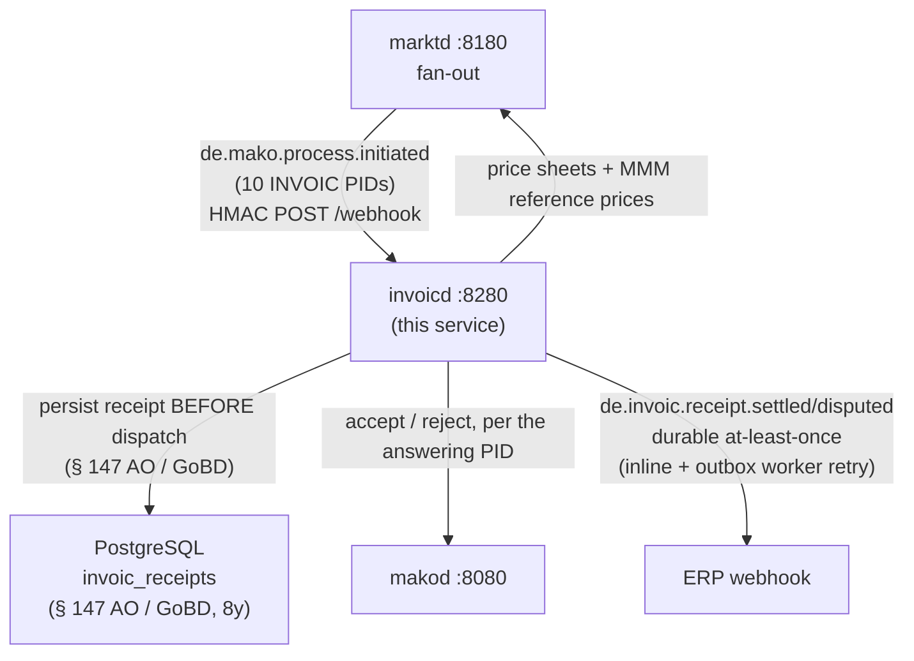
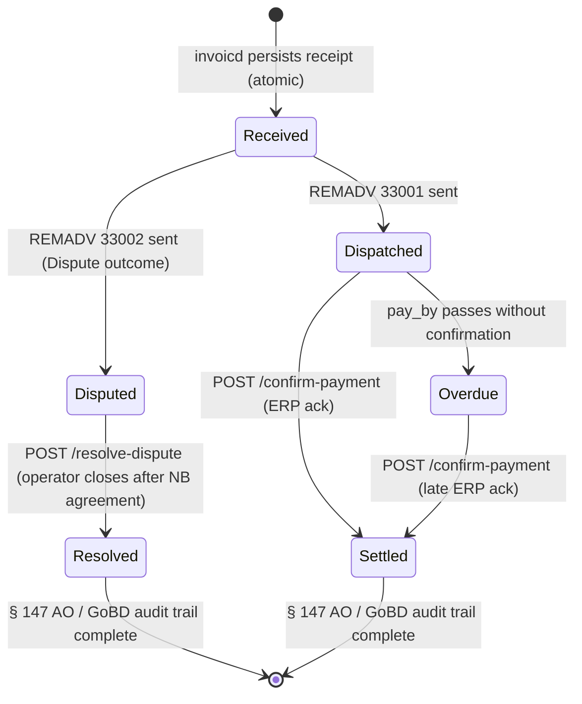

+++
title = "invoicd Operator Guide"
description = "invoicd operator guide: INVOIC plausibility-check daemon (LF role). Checks the ten inbound billing PIDs against marktd price sheets, persists every receipt for § 147 AO / GoBD, answers the counterparty through makod, and notifies the ERP."
weight = 24
[extra]
mermaid = true
+++
# `invoicd` Operator Guide

`invoicd` is the **INVOIC plausibility-check daemon** for the LF (Lieferant) role.
It subscribes to `marktd`'s fan-out, receives inbound INVOIC events, and:

1. Routes the PID through `src/routing.rs`, which decides the check, the price
   sheet and the answer commands.
2. Fetches the reference data that PID calls for from `marktd`, and runs the
   deterministic `invoic-checker` pipeline.
3. **Persists the receipt** for the § 147 AO / § 14b UStG audit trail (a
   received INVOIC is a Buchungsbeleg: 8-year retention). A failed write aborts
   the dispatch.
4. Answers the counterparty through `makod` — accept or dispute.
5. Notifies the ERP with `de.invoic.receipt.*`, durable at-least-once.

Every PID takes this path; what varies is data in the routing table, not a copy
of the pipeline. A PID with no route is ignored rather than answered with a
default command, and an event that cannot become a receipt goes to `invoic_dlq`
with the reason instead of vanishing.



---

## Port layout

```
┌─────────────────────────────────────────────────────────────────┐
│  invoicd  :8280                                                  │
│                                                                 │
│  POST /webhook                      ← marktd CloudEvents        │
│  GET  /api/v1/receipts              ← INVOIC receipt ledger     │
│  GET  /api/v1/receipts/{id}         ← single receipt by UUID    │
│  GET  /api/v1/receipts/{id}/rechnung← full BO4E Rechnung JSON   │
│  POST /api/v1/receipts/{id}/confirm-payment  ← ERP payment ack  │
│  POST /api/v1/receipts/{id}/dispatch-answer  ← re-send answer   │
│  POST /api/v1/receipts/{id}/resolve-dispute  ← close dispute    │
│  GET  /api/v1/disputes              ← open disputes             │
│  GET  /api/v1/overdue-remadv        ← receipts near pay_by      │
│  GET  /api/v1/zahlungsstatus/{malo_id}  ← payment status per MaLo│
│  POST /api/v1/selbstausstellen      ← self-issued MMM (31006)   │
│  GET  /invoicd/metrics              ← invoicd Prometheus gauges │
│  GET  /metrics  /health/live  /health/ready  ← runner infra     │
│  POST|GET /mcp      ← MCP Streamable HTTP (LLM tooling)         │
└─────────────────────────────────────────────────────────────────┘
```

---

## Authorization

`/webhook` is HMAC-authenticated (`marktd` is the caller, with replay protection
on the timestamp). Every `/api/v1/*` route requires a JWT and a Cedar action:

| Routes | Action | Granted to |
|---|---|---|
| `/receipts`, `/receipts/{id}`, `/receipts/{id}/rechnung`, `/zahlungsstatus/{malo_id}` | `read-receipt` | any caller in the tenant |
| `/disputes` | `read-disputes` | any caller in the tenant |
| `/overdue-remadv` | `read-overdue-remadv` | any caller in the tenant |
| `/receipts/{id}/confirm-payment`, `/dispatch-answer`, `/resolve-dispute` | `write-receipt` | **LF role** |
| `/selbstausstellen` | `dispatch-selbstausstellen` | **LF role** |

Cedar is deny-by-default, so an action the code checks and the policy does not
permit is a permanent 403 no configuration can lift. `tests/cedar_actions.rs`
pins the two lists together in both directions.

### `POST /api/v1/receipts/{id}/dispatch-answer`

Re-sends the market answer for a receipt whose automatic dispatch failed
(`dispatched_at IS NULL`). Both the routing key and the command come from the
receipt: the stored INVOIC message reference, and the answering PID's own
command from the routing table. Answers `409` when the receipt was already
dispatched and `422` when it carries no message reference.

---

## Handled PIDs

| PID | Description | Direction | Sparte | Status |
|-----|-------------|-----------|--------|--------|
| 31001 | Abschlagsrechnung Netznutzung (NB → LF) | Inbound | Strom | ✅ |
| 31002 | Netznutzungsabrechnung (NB → LF) | Inbound | Strom | ✅ |
| 31003 | WiM Gas Rechnung (NB → LF) | Inbound | Gas | ✅ |
| 31004 | Stornorechnung — universal Storno (GPKE/MMM/WiM/Kapazität/AWH/GeLi) | Inbound | **Strom + Gas** | ✅ arithmetic-only (`check_storno`) |
| 31005 | MMM-Rechnung Mehr-/Mindermengensaldo | Inbound | Strom | ✅ |
| 31006 | MMM Mehrmenge, selbst ausgestellt (LF → NB) | Inbound + Outbound | Strom | ✅ |
| 31007 | GaBi Gas Aggreg. MMM-Rechnung (NB → MGV) | Inbound | Gas | ✅ + MMM check 6 |
| 31008 | GaBi Gas selbst ausgest. Aggreg. MMM-Rechnung | Inbound | Gas | ✅ + MMM check 6 |
| 31009 | MSB-Rechnung (MSB → LF, WiM) | Inbound | Strom | ✅ PreisblattMessung |
| 31011 | GeLi Gas Rechnung sonstige Leistung (AWH) | Inbound | Gas | ✅ |

**PID 31009 (WiM MSB-Rechnung)** prices metering service, so it is checked
against `PreisblattMessung`, not the NNE tariff. When the Rechnung is not
embedded in the process payload, `invoicd` asks `makod` for it.

**PID 31004 (Stornorechnung)** is a single universal, **Sparte-neutral** Storno
(INVOIC AHB §3.1.2) cancelling an original invoice from any process — GPKE, MMM
Strom+Gas, WiM Strom+Gas, Kapazitätsabrechnung, AWH, GeLi Gas. The Sparte is
read from `Rechnung.sparte`, never assumed. It runs the arithmetic-only check
and answers with the Sparte-neutral `invoic.stornorechnung.{annehmen,ablehnen}`.

A Rechnung flagged `ist_storno` takes that same arithmetic-only check whatever
its PID: it carries the original's amounts negated, so a tariff comparison would
dispute every line.

**MMM reference prices.** The Strom Mehr-/Mindermengenpreise are one nationwide
monthly BDEW series (§ 13 Abs. 3 StromNZV; GPKE Teil 1 Kap. 8.4 from
01.01.2026), so the application month is the whole key — the sending NB is not
part of it. Gas prices are per Marktgebiet, and Trading Hub Europe is the single
German MGV.

---

## invoic-checker — checks

| # | Check | PIDs | Outcome on failure |
|---|-------|------|--------------------|
| 0 | **Storno reference** — `ist_storno=true` must have `original_rechnungsnummer` | all | `Dispute` |
| 1 | **Billing period validity** (boundaries consistent, in scope) | all | `Dispute` |
| 1.5 | **Zahlungsziel** — `faelligkeitsdatum` must not precede `rechnungsdatum` (invalid: `Dispute`) or exceed `max_zahlungsziel_days` (exceeded: `Warn`) | all | `Dispute` or `Warn` |
| 2 | **Position arithmetic** (unit price × quantity = line net; tolerance 1%) | all | `Dispute` |
| 3 | **Document total** (sum of positions = Gesamtnetto; tolerance 1%) | all | `Warn` |
| 4 | **Tariff unit price** within tolerance — ToU-aware: each INVOIC position’s text is matched against the `zaehlzeitregister` band code of `zeitvariablePreispositionen` entries. Flat positions fall back to `Preisstaffel` prices. **PID 31009:** uses `PreisblattMessung`. **Stornorechnungen: skipped** (`ist_storno=true` carries negated original amounts, not tariff positions) | all (not Storno) | `Warn` or `Dispute` |
| 5 | **Tariff entry found** in price sheet | all (not Storno) | `Warn` or `Dispute` |
| 6 | **MMM settlement price** — for Strom MMM PIDs (31005/31006): MMMA Strom reference; for Gas MMM PIDs (31007/31008): MMMA Gas reference (THE) | 31005/31006/31007/31008 | `Warn` or `Dispute` |
| 6 | **AufAbschlag discount validation** — for PID 31009: every negative position must match a contracted `AufAbschlag` name from `PreisblattMessung.auf_abschlaege` (WiM PRICAT 27001–27003). AufAbschlag names are fetched from `marktd` and passed to `check_msb_rechnung_with_aufabschlaege` | 31009 | `Dispute` |

`Warn` outcomes auto-approve unless the total net invoice exceeds
`auto_dispute_threshold_eur`. Set this to `0` to always approve warnings (default).

**Gas tariff (31009 / Gas PIDs):** Energy (kWh) = Volume (m³) × `brennwert_kwh_per_m3`
× `zustandszahl`. Both values are populated in `edmd` `MeterBillingPeriod` via
PID 13007 (Gas Datenabruf / `geli.datenabruf.anfragen`).

---

## Payment CloudEvents

`invoicd` emits **outbound payment CloudEvents** to your ERP after each validated
INVOIC when `[erp] webhook_url` is configured.

| CloudEvents `type` | Trigger |
|---|---|
| `de.invoic.receipt.settled` | Outcome `Ok`, `AcceptedPartial`, or `Warn` |
| `de.invoic.receipt.disputed` | Outcome `Dispute` |
| `de.invoic.receipt.dispatched` | Self-issued 31006 sent |
| `de.invoic.payment.overdue` | Zahlungsziel passed without `confirm-payment` |

Accepted or disputed, the ERP hears about every checked invoice. `dispatched` in
the payload says whether the market answer actually went out — a settled invoice
whose REMADV never left is not one the ERP may pay against.

```json
{
  "specversion": "1.0",
  "type": "de.invoic.receipt.settled",
  "source": "urn:mako:invoicd:tenant:9900357000004",
  "subject": "<process_id>",
  "data": {
    "process_id": "...",
    "pid": 31001,
    "direction": "inbound",
    "sender_mp_id": "9904234560001",
    "outcome": "Ok",
    "pay_by": "2026-10-15",
    "findings_count": 0,
    "dispatched": true
  }
}
```

`de.invoic.payment.overdue` — emitted by the `payment_overdue` worker (every
6 h) for each accepted, dispatched receipt whose `pay_by` has passed without
`payment_confirmed_at`. A disputed invoice is not overdue. Each receipt is
announced **once**: `overdue_notified_at` is stamped after delivery, so the
notice does not repeat every six hours until someone acts on it.

```json
{
  "specversion": "1.0",
  "type": "de.invoic.payment.overdue",
  "source": "urn:mako:invoicd:tenant:9900357000004",
  "subject": "<receipt_id>",
  "data": {
    "receipt_id": "550e8400-...",
    "process_id": "...",
    "pid": 31001,
    "sender_mp_id": "9904234560001",
    "pay_by": "2026-10-15T00:00:00Z",
    "tenant": "9900357000004"
  }
}
```

### Delivery guarantee — durable at-least-once

The first attempt runs inline, immediately after the market answer is
dispatched. On any failure the `erp_outbox` worker retries with backoff. It
claims each batch with a lease (`UPDATE … RETURNING`, not a pooled
`SELECT … FOR UPDATE`, whose locks do not survive the pooled statement), so
replicas do not double-deliver:

| Attempt | Delay before retry |
|---------|--------------------|
| 1       | 30 s               |
| 2       | 5 min              |
| 3       | 30 min             |
| 4       | 2 h                |
| 5       | dead-lettered      |

**HTTP status semantics:**
- **2xx** — success; `erp_notified_at` set in `invoic_receipts`
- **4xx** — permanent failure (bad config / auth); dead-lettered immediately
- **5xx / transport error** — transient; retried per schedule above

**Request signing** (`[erp] hmac_secret`): when configured, every POST includes
Standard Webhooks (`webhook-signature`) so the ERP can verify authenticity.

**The market answer is dispatched before ERP notification** — a failed ERP
webhook never blocks the regulatory obligation. Dead-lettered events are counted
by `invoicd_erp_dead_lettered_total`.

Without `[erp] webhook_url` the events are recorded and nothing delivers them;
the service warns at startup.

---

## Idempotency and § 147 AO / GoBD

`invoicd` writes each receipt to PostgreSQL **before** dispatching any command
to `makod`. The `invoic_receipts` table has a `UNIQUE (process_id)` constraint,
so re-delivery of the same `de.mako.process.initiated` event is a no-op.

Receipts must be retained for **8 years** — a received INVOIC is a Buchungsbeleg (§ 147 Abs. 3 AO / § 14b UStG).
The `received_at` column drives the retention query:

```sql
-- Receipts past the § 147 Abs. 3 AO retention period:
SELECT * FROM invoic_receipts
WHERE received_at < now() - INTERVAL '8 years';
```

---

## Payment Lifecycle & Zahlungsstatus

After `invoicd` dispatches a REMADV, the payment is settled via bank transfer
outside the EDIFACT process. `invoicd` provides an ERP callback endpoint to
close the § 147 AO / GoBD / §41 EnWG payment audit trail and a status query endpoint
for accounts-payable reconciliation.

### `POST /api/v1/receipts/{id}/confirm-payment`

The ERP calls this endpoint when it confirms that the bank transfer for an
invoice has been received. Sets `payment_confirmed_at = now()` on the receipt.

```bash
curl -X POST http://invoicd:8280/api/v1/receipts/550e8400-e29b-41d4-a716-446655440000/confirm-payment \
  -H "Authorization: Bearer <token>" \
  -H "Content-Type: application/json" \
  -d '{}'
# → 204 No Content
```

| Response | Meaning |
|---|---|
| `204 No Content` | Payment confirmed; `payment_confirmed_at` set |
| `404 Not Found` | Receipt not found or already confirmed |
| `403 Forbidden` | Caller lacks the `write-receipt` Cedar action (LF role) |

### `GET /api/v1/zahlungsstatus/{malo_id}`

Returns the payment status for all INVOIC receipts linked to a MaLo, with a
summary of overdue / pending / settled counts.

```bash
curl -s http://invoicd:8280/api/v1/zahlungsstatus/10001234558 \
  -H "Authorization: Bearer <token>" | jq .
```

```json
{
  "malo_id": "10001234558",
  "overdue_count": 1,
  "pending_count": 2,
  "settled_count": 14,
  "items": [
    {
      "id": "550e8400-...",
      "pid": 31001,
      "zahlungsstatus": "overdue",
      "pay_by": "2026-10-15T00:00:00Z",
      "dispatched_at": "2026-10-01T09:12:00Z",
      "payment_confirmed_at": null,
      "received_at": "2026-10-01T08:00:00Z"
    }
  ]
}
```

**`zahlungsstatus` values:**

| Value | Condition |
|---|---|
| `settled` | `payment_confirmed_at IS NOT NULL` |
| `overdue` | `dispatched_at IS NOT NULL` AND `pay_by < now()` AND `payment_confirmed_at IS NULL` |
| `pending` | `dispatched_at IS NOT NULL` AND `pay_by >= now()` AND `payment_confirmed_at IS NULL` |
| `undispatched` | `dispatched_at IS NULL` |

> **Alert rule:** `overdue_count > 0` should trigger an accounts-payable
> escalation. The `payment_overdue` background worker (runs every 6 hours)
> automatically emits `de.invoic.payment.overdue` CloudEvents to your ERP
> webhook for each overdue receipt, so dunning workflows can be triggered
> without polling this endpoint.

### Payment lifecycle state machine



---

## Configuration reference

`invoicd` reads its configuration from a **TOML file** (default: `invoicd.toml`),
with secrets deferred to environment variables via `"env:VAR_NAME"` values.

### Startup inputs

The lifecycle is owned by `mako_service::run`; the binary takes no config CLI
flags. It discovers everything from the environment:

| Setting | Source | Default | Description |
|---------|--------|---------|-------------|
| Config file path | `INVOICD_CONFIG` env | `invoicd.toml` | Path to `invoicd.toml` |
| Tracing filter | `LOG_LEVEL` / `RUST_LOG` env | `info` | Log level |
| `--check` | container HEALTHCHECK | — | Probe the running instance's `/health/ready` and exit `0`/non-zero. Used by the Dockerfile HEALTHCHECK. |

Any TOML key may be overridden by an `INVOICD_`-prefixed environment variable
(`__` separates nested sections, e.g. `INVOICD_DATABASE__URL`).

```bash
INVOICD_CONFIG=/etc/invoicd/invoicd.toml invoicd
```

### Full `invoicd.toml` reference

```toml
[http]
addr = "0.0.0.0:8280"          # default

[database]
# Required for § 147 AO / § 14b UStG receipt retention (Buchungsbelege, 8 years).
url             = "env:DATABASE_URL"   # required; use env: for secrets
max_connections = 5                    # default

[identity]
tenant = "9900357000004"               # required — MP-ID of the operator

[makod]
url     = "http://makod:8080"          # required
api_key = "env:INVOICD_MAKOD_API_KEY" # required

[marktd]
url     = "http://marktd:8180"            # required
api_key = "env:INVOICD_MARKTD_API_KEY"   # required

[webhook]
inbound_secret = "env:INVOICD_INBOUND_SECRET"  # optional; omit for dev

[subscription]
# Self-registers with marktd on startup — no manual curl required.
# The event type and PID filter are not configurable: invoicd acts on
# de.mako.process.initiated for the PIDs in its routing table and nothing else.
webhook_url   = "http://invoicd:8280/webhook"  # public URL marktd POSTs to
subscriber_id = "invoicd"                        # default

[check]
# Relative tolerances for invoic-checker plausibility pipeline.
arithmetic_tolerance       = 0.01   # 1 % — qty × price = line net
total_tolerance            = 0.01   # 1 % — Σ line nets = Gesamtnetto
tariff_tolerance           = 0.03   # 3 % — PRICAT unit price vs INVOIC
require_tariff             = false  # true → missing tariff escalates to Dispute
auto_dispute_threshold_eur = 0.0    # 0.0 → Warn always auto-approved
max_zahlungsziel_days      = 30     # 0 = disable; default 30 (§7 Allg. Festlegungen)

[erp]
# Required for ERP accounts-payable automation.
webhook_url = "https://erp.example.com/webhooks/invoicd"
# Optional: sign outbound requests with HMAC-SHA256.
# The ERP verifies via webhook-signature: v1,<base64>.
hmac_secret = "env:INVOICD_ERP_HMAC_SECRET"

[edmd]
# Required only for POST /api/v1/selbstausstellen (PID 31006), which reads the
# measured quantity for the Bilanzierungsmonat. Omitted, that endpoint answers
# 503; nothing else in the service needs it.
url = "http://edmd:8380"
# api_key = "env:INVOICD_EDMD_API_KEY"

# [oidc]          # omit to disable auth (dev only — never omit in production)
# issuer   = "https://login.microsoftonline.com/{tenant-id}/v2.0"
# audience = "api://mako-invoicd"
# jwks_refresh_secs = 300

# [otel]          # omit to disable tracing
# endpoint = "http://otel-collector:4317"
```

---

## marktd subscription

`invoicd` **auto-registers** its fan-out subscription with `marktd` on startup
when `subscription.webhook_url` is set in the config — no manual `curl` required.

To force re-registration or verify the subscription:

```bash
curl -s http://marktd:8180/api/v1/subscriptions/invoicd \
  -H "Authorization: Bearer <token>" | jq .
```

---

## Self-issued Mehrmengen-Rechnung (PID 31006)

PID 31006 is the **Mehrmenge leg of a Mehr-/Mindermengen settlement, written by
the receiving party itself** — the Gutschriftverfahren of § 14 Abs. 2 Satz 2
UStG. It is not a Netznutzungsrechnung; that is PID 31002.

The endpoint settles one Bilanzierungsmonat. Mehr-/Mindermengen settle per
month, and the price series is published per application month, so a period
straddling two months has no single price to settle against.

```bash
curl -X POST http://invoicd:8280/api/v1/selbstausstellen \
  -H "Authorization: Bearer <token>" \
  -H "Content-Type: application/json" \
  -d '{
    "malo_id":        "51238696012",
    "nb_mp_id":       "9900000000002",
    "year":           2026,
    "month":          6,
    "bilanziert_kwh": "12500.000"
  }'
```

| Input | Source |
|---|---|
| `gemessen_kwh` | `edmd GET /api/v1/imbalance/{malo}/{y}/{m}` — edmd measures |
| `bilanziert_kwh` | the caller — edmd does not balance; the allocated quantity is a commercial figure from the LF's own Bilanzkreis |
| Mehr-/Mindermengenpreise | `marktd GET /api/v1/mmm-preise/strom/{y}/{m}` |

A month with no imported prices is **refused** (422) rather than settled against
a neighbouring month's: an invoice wrong by that margin is one nobody notices.

The document is built by `grid_billing::settle_mmm` with `selbstausgestellt`,
so the rendered BO4E states `netznutzungrechnungsart = Selbstausgestellt` and
`netznutzungrechnungstyp = Mehrmindermengenrechnung`. An NNE settlement stamped
with PID 31006 renders as a Handelsrechnung instead — individually well-formed
fields, and a document the AHB rejects.

The receipt carries **`makod`'s** process id, so the answering REMADV, a later
Storno and the payment confirmation all find the same row.

Electricity needs *both* parties to hold §3g Wiederverkäufer status for § 13b
Abs. 2 Nr. 5 Buchst. b UStG to shift the tax, which a self-issued invoice cannot
assert from the issuer's side alone — so the endpoint settles at the ordinary
rate.

---

## MCP tools

| Tool | Description |
|------|-------------|
| `get_receipt` | Get a single INVOIC receipt by process UUID |
| `list_disputes` | List all receipts with outcome `Dispute` |
| `get_check_result` | Get the full invoic-checker findings for a process |
| `list_overdue_remadv` | Receipts approaching Zahlungsziel without dispatched REMADV |
| `get_zahlungsstatus` | Payment status per MaLo-ID (settled / pending / overdue counts) |
| `summarize_billing_month` | Monthly billing volume + dispute rate per NB counterparty |
| `list_exceptions` | The two operator queues: undispatched answers, and INVOICs that could not be processed at all |

## MCP prompts

| Prompt | Description |
|--------|-------------|
| `resolve-dispute` | Guided dispute investigation (check classification + resolution steps) |
| `check-overdue-remadv` | Monitor and action overdue REMADV dispatches |
| `monthly-billing-review` | § 147 AO / GoBD monthly reconciliation checklist |
| `detect-systematic-errors` | Find NB counterparties with systematic billing errors |

The `invoice-reconciliation-agent` in `agentd` subscribes to `de.invoic.payment.overdue` and `de.invoic.receipt.disputed`, runs the systematic-error detection workflow automatically, and escalates when a single NB exceeds 10% dispute rate over 2+ consecutive months.

---

## Monitoring

| Query / metric | Target |
|----------------|--------|
| `outcome IN ('Ok','AcceptedPartial','Warn')` rate | > 95 % |
| `outcome = 'Dispute'` count | < 1 % of volume |
| `pay_by < now() + INTERVAL '3 days' AND dispatched_at IS NULL` | 0 |
| `pay_by < now() AND payment_confirmed_at IS NULL AND dispatched_at IS NOT NULL` | 0 (trigger dunning) |
| `invoic_dlq WHERE resolved_at IS NULL` | 0 — an unprocessed Buchungsbeleg |

Alert when receipts approach `pay_by` without a `dispatched_at` — the
counterparty may not have received the answer and will begin a dispute window.
`POST /api/v1/receipts/{id}/dispatch-answer` re-sends it.

### Prometheus metrics (`/invoicd/metrics`)

These invoicd-specific gauges live at `/invoicd/metrics`; the runner mounts the
generic request-counter `/metrics` separately.

All gauges are tenant-scoped.

| Metric | Alert when |
|--------|------------|
| `invoicd_receipts_total` | — |
| `invoicd_disputes_total` | rising against a single counterparty |
| `invoicd_overdue_remadv_total` | `> 0` — an unanswered invoice past its Zahlungsziel |
| `invoicd_erp_dead_lettered_total` | `> 0` — the ERP is not hearing about settled invoices |
| `invoicd_dlq_open_total` | `> 0` — an unprocessed Buchungsbeleg |
| `invoicd_receipts_by_pid_outcome{pid, outcome}` | — |

```sql
-- invoic_receipts (§ 147 AO / § 14b UStG, 8-year retention)
SELECT
  process_id,    -- UUID, unique business key
  invoice_ref,   -- EDIFACT BGM 1004 — what makod routes the answer by
  pid,           -- 31001..31009, 31011
  direction,     -- 'inbound' | 'outbound'
  sender_mp_id,  -- NB/MSB MP-ID
  outcome,       -- 'Ok' | 'AcceptedPartial' | 'Warn' | 'Dispute'
                 -- | 'Resolved' | 'Dispatched' | 'Paid'
  pay_by,        -- Zahlungsziel from INVOIC DTM+92
  received_at,   -- first ingest timestamp
  dispatched_at, -- when the answer went out
  payment_confirmed_at  -- set by POST /confirm-payment
FROM invoic_receipts
WHERE tenant = 'your-tenant-gln';
```

An inbound receipt without `invoice_ref` is refused by the schema: it could be
checked but never answered, and discovering that at the Zahlungsziel is a day
too late.
