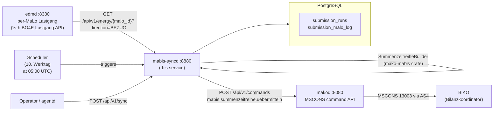
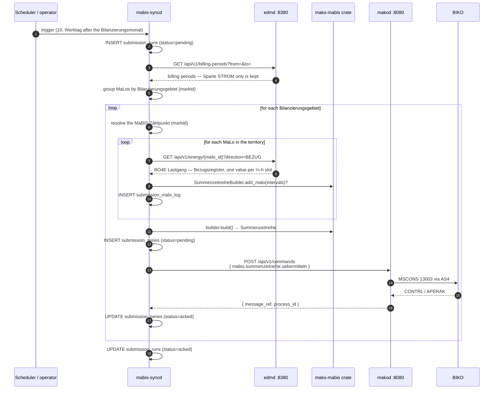

+++
title = "mabis-syncd Operator Guide"
description = "mabis-syncd operator guide: MaBiS Summenzeitreihe synchronisation daemon. Aggregates per-MaLo Lastgang time series from edmd and submits monthly Summenzeitreihen to the BIKO via makod as MSCONS PID 13003, per BK6-24-174 Anlage 3 MaBiS. PostgreSQL-backed status and Datenstatus tracking."
weight = 37
[extra]
mermaid = true
+++
# `mabis-syncd` Operator Guide

`mabis-syncd` is the **MaBiS synchronisation daemon** — the service that
aggregates per-MaLo Lastgang data from `edmd` and submits monthly
**Summenzeitreihen** to the BIKO (Bilanzkoordinator).

A Summenzeitreihe is an **MSCONS** message, Prüfidentifikator **13003**
("Übertragung Summenzeitreihe", MSCONS AHB 3.2 §8.3.1). UTILTS carries
Berechnungsformel and Zählzeit-/Schaltzeitdefinitionen and has no Summenzeitreihe
use case.

Submission goes out through `makod` as `mabis.summenzeitreihe.uebermitteln`
(Marktrolle `NB`/`ÜNB`). That command enqueues the MSCONS message directly rather
than spawning a workflow: a Summenzeitreihe is a statement of fact, and the
BIKO's answers — Datenstatus (IFTSTA 21003/21004) and Prüfmitteilung (21000/
21001) — arrive asynchronously here, where the version history lives. The
`mabis.abrechnung.*` commands are the other direction: the BKV receiving an
Abrechnungssummenzeitreihe and answering it.

The wire message carries the identifying 3-tuple as `LOC` (MaBiS-Zählpunkt),
`DTM+492` (Bilanzierungsmonat, `CCYYMM`) and `DTM+293` (Versionsangabe,
`CCYYMMDDHHMMSSZZZ`), and one `QTY+220` per settlement slot bounded by
`DTM+163`/`DTM+164`. A quantity without those bounds has no time reference, so
the BIKO cannot place it on the grid.

Quantities carry DE 6063 `79` — "Energiemenge summiert (Summenwert,
Bilanzsumme)" — not a consumption qualifier, which would describe one metering
point's draw rather than the aggregate of a Bilanzierungsgebiet. The OBIS in
`PIA` carries DE 7143 `SRW`, which marks the value as an OBIS-Kennzahl rather
than a Medium (`Z08`).

The renderer dispatches on the Prüfidentifikator:

| PID | Anwendungsfall | BGM 1001 | Shape |
|---|---|---|---|
| 13003 | Summenzeitreihe (MaBiS) | `BK` | summed series over settlement slots |
| 13023 | Redispatch 2.0 Ausfallarbeitssummenzeitreihe | `Z46` | same |
| 13015 | Arbeit / Leistungsmaximum im Kalenderjahr vor Lieferbeginn | `Z27` | work entry plus one or two monthly maxima |
| 13016 | Energiemenge und Leistungsmaximum | `Z28` | same |
| 13019 | Energiemenge (Strom) | `7` | work entry only |

`BGM` DE 1001 names what kind of document the message is and the receiver routes
by it, so it is set per Anwendungsfall rather than left at a default — a
Summenzeitreihe sent as `7` would arrive labelled a Prozessdatenbericht.

13019 carries energy alone: the AHB marks no Leistungsperiode row for it, so a
maximum sent under it would have no period to be attributed to. The renderer
refuses it and points at 13016.

Rendered messages are validated against the registered release profile by
`makod`'s conformance suite — parsed back and checked for mandatory segments,
segment order and code lists, rather than by asserting on segment substrings.

Units are validated against DE 6411's closed code list (`KWH`, `KWT`, `D54`,
`MTS`; MIG 2.5). The AHB's per-Anwendungsfall table has no DE 6411 row for
13015/13016/13019, so the unit follows the MIG: energy is `KWH`, a power maximum
is `KWT`.

Any other Anwendungsfall is refused by name rather than rendered in a shape that
would be syntactically valid and mean something else.

13015 repeats SG9 two to three times for one `NAD+DP`: once for the energy from
the start of the calendar year to Lieferbeginn, then once or twice for the
highest and second-highest monthly power maxima, which the KAV concession-levy
band depends on. Each maximum carries the period it fell in as `DTM+306` —
format `610` (`CCYYMM`) under a monthly or yearly Leistungspreissystem, `102`
(`CCYYMMDD`) under a daily one. Its quantities use DE 6063 `220` (Wahrer Wert)
or `67` (Ersatzwert), so a substitute is never reported as a measurement.



## Aggregation is per Bilanzierungsgebiet

MaBiS settles per territory, so `aggregate()` returns **one Summenzeitreihe per
Bilanzierungsgebiet**, not one per run.

Each MaLo's territory comes from `marktd` (`GET /api/v1/malos/{id}` →
`bilanzierungsgebiet`). `identity.bilanzierungsgebiet_id` is only a
**fallback** for MaLos whose master data names none, and those MaLos are logged
rather than silently folded into the fallback zone — energy filed against the
wrong territory is a settlement error the BIKO cannot detect.

### MaBiS-Zählpunkt vs Bilanzierungsgebiet

The Summenzeitreihe carries **two different SG6 `LOC` identifiers**, and MSCONS
AHB 3.2 gives each its own qualifier:

| Qualifier | Carries |
|---|---|
| `LOC+172` | **Meldepunkt** — the MaBiS-Zählpunkt (33-char Zählpunktbezeichnung) |
| `LOC+107` | **Bilanzierungsgebiet** (16-char EIC) |
| `LOC+237` | Bilanzkreis |

Both are free text at the MIG level, so a message that swaps them still parses
and still validates — the BIKO simply files the Summenzeitreihe against the
wrong Meldepunkt. Nothing downstream can detect it, which is why the two are
kept as separate inputs all the way from master data to the wire.

The assignment is **marktd master data**, not service configuration. Before each
submission `mabis-syncd` resolves it over HTTP:

```
GET /api/v1/bilanzierungsgebiete/{eic}/mabis-zp   → { "mabis_zp_id": "DE0004030099000000000000000012345", ... }
PUT /api/v1/bilanzierungsgebiete/{eic}/mabis-zp   (NB role, Cedar `write-mabis-zp`)
GET /api/v1/mabis-zp                             → every assignment for the tenant
```

Every failure path **refuses** rather than substituting — an unassigned
territory (`404`), an unreachable marktd, a malformed response, or a response
echoing the EIC back as the Meldepunkt all abort the submission. A Summenzeitreihe
filed against the wrong Meldepunkt is indistinguishable, to the BIKO, from a
correct one, so not sending is the safe failure.

Both ends refuse the EIC-as-Meldepunkt substitution: marktd rejects it on write
(a `400`, and a table `CHECK`), and the submission path re-checks it rather than
taking master data on trust.

This requires a `[marktd]` config section:

```toml
[marktd]
url     = "http://marktd:8180"
api_key = "..."
```

A submission that discovers **no** MaLos fails the run. An empty Summenzeitreihe
would settle the Bilanzierungsgebiet at zero, and the BIKO cannot tell that apart
from a territory that genuinely drew nothing.

## Aggregation is quarter-hourly

MaBiS settles electricity on a **¼-h grid**, so `fetch_lastgang` reads
`GET /api/v1/energy/{malo_id}?direction=BEZUG` — edmd's canonical register
projection, one entry per metered slot.

**Not `/api/v1/lastgang`.** That endpoint returns one BO4E object per OBIS
register — the right shape for a BO4E export and the wrong input for a settlement
figure, because folding it back into one series *is* the register projection.
A bare `ObisCode::is_import` filter is not that projection: on a dual-tariff MaLo
the total register `1-0:1.8.0` passes it **and so do** `1-0:1.8.1` and
`1-0:1.8.2`, its own decomposition, which puts the consumption into the
Summenzeitreihe twice — in a filing the BIKO cannot withdraw. A `1-0:1.6.0`
Jahreshöchstleistung in **kW** and the Fehlerregister `…63` are import too.
edmd's `domain::register` makes that decision once and serves the answer.

The resampled endpoints are not interchangeable here either. Aggregating monthly buckets
produces a Summenzeitreihe whose period total is right but whose **shape is
wrong**, and the BIKO cannot detect that from the message alone.

Two guards make the resolution explicit rather than implied:

- `SummenzeitreiheBuilder` is constructed with the slot length it expects
  (`MABIS_SLOT` = 15 min) and returns `SlotResolutionError` for any interval that
  does not match. The offending MaLo is excluded and logged, so the run
  under-reports rather than mis-reports.
- `Summenzeitreihe::missing_slot_count()` reports slots in the settlement period
  that no MaLo covered. A non-zero count means the BIKO would receive a series
  that silently omits energy rather than reporting zero, so **the run fails** —
  for the same reason an excluded MaLo fails it. Both under-report the territory
  identically, and a short series is indistinguishable from a complete one once
  the BIKO has acked it.
- The Meldepunkt is a validating newtype (`MabisZaehlpunktId`), so a malformed
  one — a 16-character territory EIC, an empty string — cannot be constructed at
  all, and `Deserialize` runs the same check because the value arrives as JSON
  from marktd. `Summenzeitreihe::validate_identifiers()` then refuses the one
  case the type cannot rule out: a Meldepunkt *equal* to its Bilanzierungsgebiet.
  MSCONS SG6 carries `LOC+172` (Meldepunkt), `LOC+107` (Bilanzierungsgebiet) and
  `LOC+237` (Bilanzkreis) as free text at the MIG level, so a swapped pair parses,
  validates and is accepted — filed against the wrong point. `marktd`'s
  `mabis_zp_not_the_gebiet` CHECK guards only rows written to that table; a series
  assembled from any other source reaches rendering without meeting it, which is
  why the check also lives in the pure crate.

Quality flags are mapped conservatively on the way in: the forward BO4E mapping
in `edmd` is lossy, so anything not plainly `ABGELESEN` counts as non-measured.
Over-reporting substitution costs a flag in the MaBiS log; under-reporting it
lets an estimate settle as a reading.

## Regulatory basis

| Rule | Requirement |
|---|---|
| **BK6-24-174 Anlage 3 §3.8.2** | Version ascending per (MaBiS-ZP, Bilanzierungsmonat) |
| **BK6-24-174 Anlage 3 §3.8.3** | Datenstatus assigned exclusively by the BIKO |
| **BK6-24-174 Anlage 3 §3.10** | Erstaufschlag 1.–10. WT, Clearingphase 11.–30. WT, KBKA to month 7 |
| **BK6-24-174 Anlage 3 §9.8.1** | Negative Prüfmitteilung → corrected Summenzeitreihe |
| **MSCONS AHB 3.2 §8.3.1** | PID 13003, Summenzeitreihe message format |
| **IFTSTA AHB 2.1** | PID 21000/21001 Prüfmitteilung, 21003/21004 Datenstatus |
| **§ 147 AO / GoBD** | Audit retention for billing-relevant data (Buchungsbelege: 8 years) |

---

## Port layout

```
┌────────────────────────────────────────────────────────────────────────────┐
│  mabis-syncd  :8880                                                         │
│                                                                            │
│  POST /api/v1/sync              ← trigger manual aggregation run          │
│  GET  /api/v1/runs              ← list recent submission runs             │
│  GET  /api/v1/runs/{id}         ← get single run with status + stats      │
│  PUT  /api/v1/runs/{id}/retry   ← retry a failed run (≤ 3 attempts)       │
│  POST /api/v1/datenstatus       ← record BIKO Datenstatus (IFTSTA 21003/4) │
│  POST /api/v1/pruefmitteilung   ← record Prüfmitteilung (IFTSTA 21000/1)   │
│  GET  /api/v1/korrekturbedarf   ← negative Prüfmitteilungen, uncorrected   │
│                                                                            │
│  /mcp                           ← read-only MCP server (agent plane)      │
│                                                                            │
│  GET  /health/live                                                        │
│  GET  /health/ready             ← PostgreSQL ping                         │
│  GET  /metrics                  ← Prometheus metrics                      │
└────────────────────────────────────────────────────────────────────────────┘
```

---

## MCP server and CloudEvents

The `/mcp` surface is **read-only** — the agent plane's window into submission
state, read by `agentd`'s `mabis-syncd-agent`. Filing a submission stays off MCP
deliberately: it is a binding filing with the BIKO, behind the
authenticated REST surface where Cedar authorises a person.

| Tool | Description |
|---|---|
| `get_submission_status` | Recent runs + failed / retry-exhausted / open-Korrekturbedarf counts |
| `list_failed_submissions` | Failed runs, newest first, with `attempt_count` and `error_msg` |
| `get_submission_run` | One run by UUID (version as RFC 3339) |
| `list_korrekturbedarf` | Open negative Prüfmitteilungen (§9.8.1 obligations) |

One prompt, `submission-triage`, carries the triage workflow. In `agentd`'s
`[mcp_servers]` the key is spelled `mabis_syncd` — agentplane refuses `-` in a
`tool://` server component.

Two CloudEvents leave through the transactional outbox
(persist-before-dispatch, drained to `erp_webhook_url`). Both are failure
signals — a healthy submission cycle is silent:

| Type | When |
|---|---|
| `de.mabis.submission.failed` | Aggregation or BIKO submission failed; carries `run_id`, `bilanzierungsgebiet_id`, period, phase, `attempt_count` (at 3 the scheduler stops retrying) |
| `de.mabis.korrekturbedarf.opened` | A negative Prüfmitteilung was recorded — a corrected Summenzeitreihe is owed within the Clearing window |

---

## Aggregation pipeline

`mabis-syncd` runs the standard MaBiS aggregation pipeline:



### Versionierung and Datenstatus

There is no preliminary/final pair. A Summenzeitreihe is identified by the
3-tuple **(MaBiS-Zählpunkt, Bilanzierungsmonat, Version)**, and §3.8.2 requires
only that the version ascend: *"Die Version einer Summenzeitreihe ist jeweils
aufsteigend zu vergeben und ist über die gesamte BKA beizubehalten."* A
correction is the same series resent under a higher version, so a period may
carry arbitrarily many.

The version is a timestamp — MSCONS carries it as `SG6 DTM+293`
(Fertigstellungsdatum/-zeit, format 304, `CCYYMMDDHHMMSSZZZ`) — which is what
makes "ascending" well defined. `BGM 1225` is always `9` (Original); there is no
replace or correction qualifier, so the version is the only thing distinguishing
a correction from the first submission.

**Datenstatus** is the separate, inbound axis. It is assigned exclusively by the
BIKO (§3.8.3: *"Der Datenstatus wird ausschließlich vom BIKO vergeben"*) and
arrives via IFTSTA `SG7 STS+Z04`:

| Datenstatus | Meaning |
|---|---|
| `Prüfdaten` | received, not yet accepted for settlement |
| `Abrechnungsdaten` | accepted for the ordinary BKA |
| `Abrechnungsdaten KBKA` | accepted for the Korrekturbilanzkreisabrechnung |
| `abgerechnete Daten` | settled in the BKA |
| `abgerechnete Daten KBKA` | settled in the KBKA |

Settlement uses the **highest version carrying `Abrechnungsdaten`** or
`Abrechnungsdaten KBKA` — not simply the newest version. `mabis-syncd` never
derives a Datenstatus; it only records what the BIKO sent.

### Fristen (§3.10, Tabelle 2)

Werktage after the end of the Bilanzierungsmonat, for a BG-SZR (Kategorie B):

| Phase | BKA | KBKA |
|---|---|---|
| Erstaufschlag | 1.–10. WT | — |
| Clearingphase | 11.–30. WT | 31. WT – end of month 7 |
| Abrechnungsstichtag | 42. WT | end of month 8 |

Within the Erstaufschlag a new version is assigned `Abrechnungsdaten`
automatically; after it a new version starts as `Prüfdaten` and needs a positive
Prüfmitteilung to be promoted. The scheduler therefore submits on the **10.
Werktag** by default, which maximises the input data while the automatic
assignment still applies.

---

## MaLo discovery

`mabis-syncd` discovers which MaLos to include from `edmd`'s billing-periods
API: every MaLo with `meter_billing_periods` rows in the submission period, with
no static configuration file.

**Strom only.** MaBiS is an electricity process — gas balances through GaBi Gas,
on the 06:00 Gastag and against a Marktgebiet rather than a Bilanzierungsgebiet.
`edmd` serves both commodities from one endpoint, so discovery filters on
`sparte`; the excluded Sparten are logged per run.

**A discovered MaLo that cannot be aggregated fails the run.** The BIKO cannot
tell a short Summenzeitreihe from a complete one, and a filing is irreversible
once acked, so omitting a MaLo silently would settle the territory low. The
same applies to a territory whose grid still has empty slots after every MaLo is
folded in. To exclude a MaLo deliberately, remove its billing-period records
from `edmd`.

Only the **Bezugsregister** (OBIS `1.x.y`) contributes. Reading every register
would fold a MaLo's Einspeisung into the same settlement slot as its draw.

---

## Submission target

`submission_target` selects where Summenzeitreihen are filed. One value is
accepted:

```toml
submission_target = "biko-bilateral"   # default
```

`"mabis-hub"` (BK6-24-210) parses and then **refuses at startup**: there is no
Beschluss, so no wire format, endpoint or payload shape is published. An
invented format that reaches a real Hub is indistinguishable, at the point of
failure, from a correct submission that was rejected.

---

## Configuration reference

```toml
[http]
addr = "0.0.0.0:8880"       # default

[database]
url = "env:MABIS_SYNCD_DATABASE_URL"   # required

[identity]
tenant                  = "env:MABIS_SYNCD_TENANT"             # BDEW Codenummer of ÜNB / NB
sender_mp_id            = "env:MABIS_SYNCD_SENDER_MP_ID"       # NAD+MS in MSCONS
receiver_mp_id          = "env:MABIS_SYNCD_RECEIVER_MP_ID"     # NAD+MR in MSCONS (BIKO)
bilanzierungsgebiet_id  = "env:MABIS_SYNCD_BILANZIERUNGSGEBIET_ID"  # Y-type (Area) EIC

[edmd]
url     = "http://edmd:8380"
api_key = "env:MABIS_SYNCD_EDMD_API_KEY"

[marktd]                    # required — per-MaLo Bilanzierungsgebiet lookup
url     = "http://marktd:8180"
api_key = "env:MABIS_SYNCD_MARKTD_API_KEY"

[makod]
url     = "http://makod:8080"
api_key = "env:MABIS_SYNCD_MAKOD_API_KEY"

[oidc]                      # required unless allow_insecure_no_auth = true
issuer   = "https://login.microsoftonline.com/{tenant-id}/v2.0"
audience = "api://mako-mabis-syncd"

[schedule]
erstaufschlag_werktag = 10   # Werktag after the Bilanzierungsmonat to submit on
run_hour_utc    = 5     # 05:00 UTC = 06:00 CET / 07:00 CEST

[mcp]                   # read-only MCP server at /mcp
api_key = "env:MABIS_SYNCD_MCP_API_KEY"

# Drains the de.mabis.* outbox (submission failures, Korrekturbedarf) —
# persist-before-dispatch, retry + dead-letter. Unset, events are enqueued
# but nothing delivers them, and the startup log says so.
erp_webhook_url = "http://erp:8000/events"
erp_hmac_secret = "env:MABIS_SYNCD_ERP_HMAC_SECRET"

# [otel]
# endpoint = "http://otel-collector:4317"
```

Two values are checked at startup, where refusing still costs nothing:

- **`bilanzierungsgebiet_id`** must be a 16-character EIC of ENTSO-E object type
  **`Y` (Area)**. A Bilanzkreis is type `X` (Party) and the same length, and
  `LOC+107` carries the value as free text, so the BIKO would accept either.
- **`submission_target`** must be one that has an implementation.

The alternative is discovering either at 05:00 on the Erstaufschlag-Werktag,
after a month of metering data has been aggregated and the run's version number
consumed.

### `env:` indirection

Every value above may be written as `env:VARNAME` and is resolved at startup by
`mako_service::config::resolve_env`. A referenced variable that is not set fails
the process with the variable named, rather than being used verbatim — an
unresolved `api_key = "env:MABIS_SYNCD_EDMD_API_KEY"` would otherwise be sent as
that literal string in the `Authorization` header, 401 against every upstream,
and produce a submission missing the MaLos it could not fetch.

## Authentication

A MaBiS submission settles a balance group under BK6-24-174 Anlage 3 and cannot
be withdrawn once the BIKO acks it. Every route is therefore authorised, and the
service refuses to start without `[oidc]` unless
`allow_insecure_no_auth = true` is set explicitly.

| Route | Cedar action | Granted to |
|---|---|---|
| `GET /api/v1/runs`, `/runs/{id}`, `/korrekturbedarf` | `read-mabis-run` | any caller in the tenant |
| `POST /api/v1/datenstatus`, `/pruefmitteilung` | `record-biko-response` | any caller in the tenant |
| `POST /api/v1/sync`, `PUT /api/v1/runs/{id}/retry` | `trigger-mabis-run` | **NB / ÜNB** |

Three different powers, three actions. Filing is restricted to the roles that
aggregate a Bilanzierungsgebiet and have standing to send a Summenzeitreihe in
the tenant's name. Recording an inbound BIKO response only states what arrived,
so the ingest identity that relays IFTSTA needs none of that power. Read access
is tenant-scoped because run history discloses which territories are settled.

Cedar is deny-by-default, so an action the code checks and the policy does not
permit is a permanent 403. `tests/authorization_guard.rs` pins both lists
together and asserts that the two ingest routes do **not** require
`trigger-mabis-run`.

Policies live in `services/mabis-syncd/policies/mabis-syncd.cedar`.

### Common BIKO BDEW codes (receiver_mp_id)

| BIKO | BDEW code | Control zone |
|---|---|---|
| Transnet BW | `9900077000006` | Baden-Württemberg |
| TenneT TSO | `9900357000004` | Bayern + Niedersachsen |
| Amprion | `9900629000001` | West + Mitte |
| 50Hertz | `9900255000008` | Ost + Hamburg |

---

## Submission run lifecycle

```
pending ──► submitted ──► acked      (terminal — every territory filed)
   │            │
   └────────────┴──► failed          (retry allowed, attempt_count < 3)
```

A `failed` run can be retried via `PUT /api/v1/runs/{id}/retry`; after three
attempts, manual intervention is required. A retry carries the original's
`corrects_run_id`, so a retried correction still closes its Korrekturbedarf.

**A run may be partly filed.** One MSCONS goes out per Bilanzierungsgebiet, and
an acked Summenzeitreihe cannot be withdrawn — so when one territory fails, the
others are already with the BIKO. `submission_series` records each territory
with its own `message_ref` or its reason for failing, a retry skips the ones
already acked, and the run still fails as a whole because a month settled short
is not a success.

`GET /api/v1/runs/{id}` returns the per-territory `series`.

`POST /api/v1/sync` refuses a period that already has a live run: filing it
again is a correction under a higher version, which is what `corrects_run_id`
is for.

---

## API examples

```bash
# Trigger a submission for May 2026. The version is assigned by the service —
# it must ascend (§3.8.2) — and the phase follows from the Werktag calendar.
curl -X POST http://mabis-syncd:8880/api/v1/sync \
  -H "Content-Type: application/json" \
  -d '{ "period_from": "2026-05-01", "period_to": "2026-05-31" }'

# Check status of all runs
curl http://mabis-syncd:8880/api/v1/runs \
  | jq '.runs[] | {id, version, abrechnungslauf, datenstatus, status, total_kwh}'

# Record the Datenstatus the BIKO assigned (IFTSTA 21003/21004)
curl -X POST http://mabis-syncd:8880/api/v1/datenstatus \
  -H "Content-Type: application/json" \
  -d '{ "bilanzierungsgebiet_id": "11YAPG4CTRDNZ--P",
        "period_from": "2026-05-01", "period_to": "2026-05-31",
        "version": "2026-06-15T05:00:00Z", "datenstatus": "Abrechnungsdaten" }'

# Record a Prüfmitteilung (IFTSTA 21000/21001). A negative one requires a
# corrected Summenzeitreihe under a higher version.
curl -X POST http://mabis-syncd:8880/api/v1/pruefmitteilung \
  -H "Content-Type: application/json" \
  -d '{ "bilanzierungsgebiet_id": "11YAPG4CTRDNZ--P",
        "period_from": "2026-05-01", "period_to": "2026-05-31",
        "version": "2026-06-15T05:00:00Z", "positiv": false,
        "sender_mp_id": "9900077000006", "pid": 21000,
        "begruendung": "Abweichung MaLo 51238696012" }'

# Open Korrekturbedarf — negative Prüfmitteilungen with no correction yet
curl http://mabis-syncd:8880/api/v1/korrekturbedarf

# Send the correction, naming the run it corrects
curl -X POST http://mabis-syncd:8880/api/v1/sync \
  -H "Content-Type: application/json" \
  -d '{ "period_from": "2026-05-01", "period_to": "2026-05-31",
        "corrects_run_id": "550e8400-e29b-41d4-a716-446655440000" }'

# Retry a failed run (a fresh attempt, so a new version)
curl -X PUT http://mabis-syncd:8880/api/v1/runs/550e8400-e29b-41d4-a716-446655440000/retry
```

---

## PostgreSQL schema

| Table | Purpose |
|---|---|
| `submission_runs` | One row per aggregation + submission attempt: status, period, version, Datenstatus. |
| `submission_series` | One row per **Bilanzierungsgebiet** per run — the MSCONS that actually went out, with its `message_ref` or its failure reason. |
| `submission_malo_log` | One row per MaLo per run: coverage and gap analysis. |
| `pruefmitteilung` | Inbound BIKO objections (IFTSTA 21000/21001) and the run that corrected each. |

---

## Monitoring

| Metric / Alert | Target |
|---|---|
| `submission_runs.status = failed` older than 24 h | Immediate escalation — regulatory deadline at risk |
| `submission_series.status <> 'acked'` on an otherwise finished run | A territory was not filed; the month is settled short |
| No acked submission by the 10. Werktag | Erstaufschlag window closed — a later version starts as `Prüfdaten` (§3.10) |
| Open Korrekturbedarf after the 30. Werktag | Clearingphase for the ordinary BKA closing (§3.10) |
| MaLo coverage < 95 % in `submission_malo_log` | Missing data — check `edmd` quality warnings |

The **`mabis-syncd-agent`** in `agentd` monitors submission deadlines automatically and escalates via the ERP webhook when a run is overdue or missing.

---

## Integration with `mako-mabis`

`mabis-syncd` uses the pure domain logic in `mako-mabis`:

```rust
// SummenzeitreiheBuilder — used in mabis-syncd/src/sync_engine.rs
use mako_mabis::{BilanzierungsgebietId, MABIS_SLOT, SummenzeitreiheBuilder};
use metering::MeterInterval;

let mut builder = SummenzeitreiheBuilder::new(
    BilanzierungsgebietId("11YAPG4CTRDNZ--P".to_owned()),
    period_from, period_to,
    version, // ascending timestamp; MSCONS SG6 DTM+293
    "9900357000004",  // sender (NB / ÜNB)
    "9900077000006",  // receiver (BIKO Transnet BW)
    MABIS_SLOT,       // ¼-h settlement grid — mismatched intervals are rejected
);

for malo in &malos {
    let intervals: Vec<MeterInterval> = fetch_from_edmd(malo).await;
    // Errs if any interval is not a ¼-h slot; exclude the MaLo rather than
    // fold it in at the wrong shape.
    if let Err(e) = builder.add_malo(&intervals) {
        warn!(malo, error = %e, "excluded from Summenzeitreihe");
    }
}

let series = builder.build();
println!("total kWh: {}, intervals: {}", series.total_kwh(), series.interval_count());
// Both checks fail the run rather than filing: a misidentified or short series
// cannot be withdrawn once the BIKO has acked it.
series.validate_identifiers()?;
if !series.is_complete() {
    anyhow::bail!("{} settlement slots uncovered", series.missing_slot_count());
}
// Monthly roll-up, for reporting only — the message carries the ¼-h slots:
let monthly = series.monthly_totals();
```

`BilanzierungsgebietId` and `BilanzkreisId` are canonical types from `mako-mabis`
(single source of truth — `mako-mabis` re-exports them, not duplicates).
