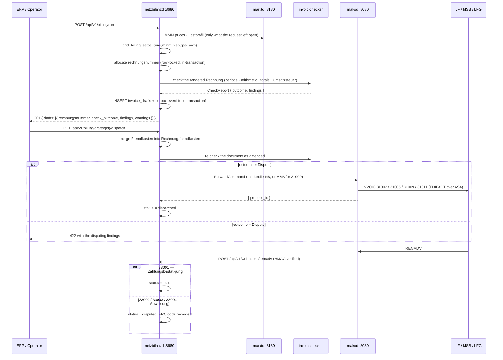
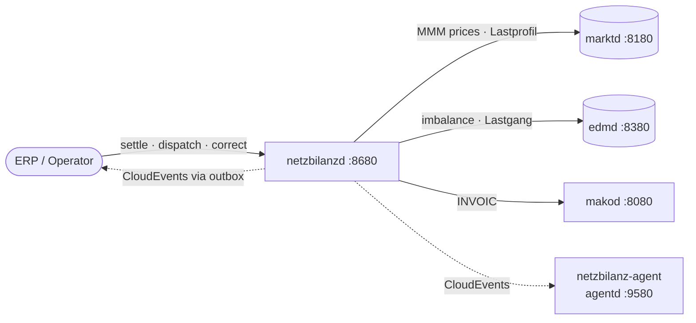
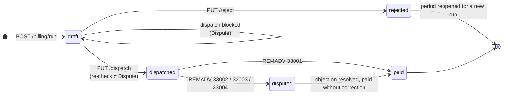
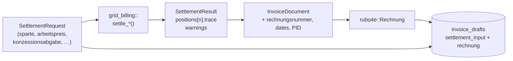

+++
title = "netzbilanzd Operator Guide"
description = "Operator guide for netzbilanzd — the NB-role billing daemon that settles Netznutzungsentgelt, Konzessionsabgabe, Mehr-/Mindermengen, Messstellenbetrieb and GeLi Gas Sperrprozess fees into INVOIC 31002/31005/31009/31011, checks them before they leave, dispatches via makod, and closes the payment lifecycle on REMADV."
weight = 25
[extra]
mermaid = true
+++
# `netzbilanzd` Operator Guide

`netzbilanzd` settles, checks and dispatches every invoice a German network operator owes
its counterparties, and carries the Redispatch 2.0 cost sheets. It is the outbound half of
the NB role: what the operator bills, under which paragraph, and what happened to the money.

**Port:** `:8680`
**Storage:** PostgreSQL — `invoice_drafts`, `invoice_number_seq`, `kostenblatt_records`, `fremdkosten_records`
**Role:** NB / GNB only

1. TOC
{:toc}

---

## Architecture

### The billing lifecycle



### Integration topology



---

## What it issues

| PID | Document | Direction | `billing_type` | Regulatory basis |
|---|---|---|---|---|
| 31001 | Abschlagsrechnung Netznutzung (payment on account) | NB → LF | `abschlag` | INVOIC AHB 1.0b · §14 Abs. 5 UStG |
| 31002 | NN-Rechnung (Netznutzungsentgelt + Konzessionsabgabe) | NB → LF | `nne` | StromNEV §§17/21 · GasNEV §§14/15 · KAV §2 |
| 31005 | Mehr-/Mindermengensaldo | NB → LF | `mmm` | GPKE (BK6-24-174) Teil 1 Kap. 8.4 · GaBi Gas 2.1 (BK7-24-01-008) |
| 31009 | MSB-Rechnung (Messstellenbetrieb) | **MSB → NB / LF / ESA** | `msb` | §30 MsbG |
| 31011 | Rechnung sonstige Leistung (AWH Sperrprozesse) | GNB → LFG | `gas_awh` | GeLi Gas 3.0 (BK7-24-01-009) §5.4 |

Two properties of this table are easy to get wrong, and both cost money.

**The Sparte is not in the Prüfidentifikator.** NN-Rechnung Strom and Gas share PID 31002;
the two MMM variants share 31005. Every settlement therefore states its `sparte`, and that
one field decides three things: whether the Arbeit position cites StromNEV §21 or
GasNEV §14, whether the three EnFG network levies are billed at all, and what
`Rechnung.sparte` says on the wire — the only place a receiver can read which Sparte a
31002 settles.

**PID 31009 runs the other way.** The Messstellenbetreiber issues it in all seven of its
Anwendungsfälle (*Anwendungsübersicht der Prüfidentifikatoren* 4.0); it is never addressed
to one. The draft stores the MSB as `sender_mp_id`, and the dispatch declares `marktrolle: MSB`.

---

## Regulatory baseline (2026)

**StromNZV and GasNZV ceased to apply with the end of 31.12.2025** (Art. 15 Abs. 4 resp.
Abs. 6 of the Gesetz v. 22.12.2023, BGBl. 2023 I Nr. 405). The successor competence is
§20 Abs. 3 EnWG, exercised through BNetzA Festlegungen — for MMM Strom that is
**GPKE (BK6-24-174) Teil 1 Kap. 8.4**, for MMM Gas **GaBi Gas 2.1 (BK7-24-01-008)**.

Two consequences for this service:

- **MMM prices come from the VNB, not the ÜNB.** GPKE Kap. 8.4 Nr. 3: *"Der Betreiber von
  Elektrizitätsverteilernetzen berechnet für Jahresmehr- und Jahresmindermengen auf
  Grundlage der monatlichen Marktpreise einen einheitlichen Preis."*
- **Konzessionsabgabe is KAV §2**, never StromNZV. The rate bands key on the municipality's
  inhabitant count, not on annual consumption.

### The network levies (EnFG)

Three levies ride on the electricity Netzentgelt and are billed to the network user through
the NN-Rechnung. `netzbilanzd` adds them to every Strom NNE settlement and to **no** Gas
settlement:

| Levy | 2026 rate (A′) | Basis |
|---|---|---|
| Aufschlag für besondere Netznutzung (§19 StromNEV-Umlage) | 1.559 ct/kWh | §19 Abs. 2 StromNEV |
| Offshore-Netzumlage | 0.941 ct/kWh | §17f EnWG |
| KWKG-Umlage | 0.446 ct/kWh | §26 KWKG |

The §19 StromNEV levy is published as an explicit A′/B′/C′ schedule — B′ is capped at
0.050 ct/kWh and C′ at 0.025 ct/kWh. Set `letztverbrauchergruppe` on the settlement to bill
a privileged band. The Offshore- and KWKG-Umlage are published as the non-privileged rate
only; a privilege under §§ 21 ff. EnFG is granted per Entnahmestelle, so supply the granted
rate through `offshore_umlage_ct_per_kwh` / `kwkg_umlage_ct_per_kwh` where one applies.

**The privilege is a tranche, not a rate.** B′ and C′ are published „für Strommengen
über 1 000 000 kWh" at one Entnahmestelle, so the year's first Gigawattstunde carries A′
whatever the group. The threshold is annual and a settlement covers one period, so supply
`enfg_jahresvorverbrauch_kwh` — the kWh already consumed there earlier in the same year.
A period straddling the boundary then bills **two** §19 positions. Omit the field and the
period is billed as though it opened the year — the over-billing direction — with
`ENFG_VORVERBRAUCH_MISSING`.

A levy with no published rate for the delivery year is **omitted with a warning**, never
billed at zero silently — an understated invoice is one the ÜNB reclaims later.

### The §30 MsbG Preisobergrenze is derived, not asserted

§30 Abs. 1 MsbG states five Nummern, each a disjunction over facts about the metering
point — Jahresstromverbrauch, installierte Leistung, and whether a §14a EnWG Vereinbarung
covers a steuerbare Verbrauchseinrichtung there. `messstellen_kategorie` therefore carries
those **facts**, not a band:

```json
{
  "messstellen_kategorie": {
    "Pflichteinbau": {
      "jahresverbrauch_kwh": "18000",
      "steuerbare_verbrauchseinrichtung": true
    }
  },
  "entgeltschuldner": "Letztverbraucher"
}
```

The engine walks the Nummern top down, so a point meeting several takes the highest and
a request cannot pick its own ceiling. `{"OptionalerEinbau": null}` is the §30 Abs. 3
case — 30 EUR each side, regardless of consumption. With no fact supplied the tightest
ceiling applies: a Pflichteinbaufall exists only above 6 000 kWh (§29 Abs. 1), so Nr. 5
is the catalogue's floor rather than a guess.

### Umsatzsteuer

Every invoice states its tax. §14 Abs. 4 Nr. 8 UStG requires "den anzuwendenden Steuersatz
sowie den auf das Entgelt entfallenden Steuerbetrag" — or a note saying why neither is stated —
and an invoice carrying only a net figure is worth no Vorsteuerabzug to the counterparty.

What is taxed how turns on **what is being supplied**, which is a different axis from the Sparte:

| Settlement | Nature | Treatment |
|---|---|---|
| NNE, MSB, Gas AWH | *sonstige Leistung* | 19 %. UStAE 13b.3a excludes them from §13b by name — the provision reaches the energy, not "die Bereitstellung und Unterhaltung des Netzes" |
| MMM Strom / Gas | **Lieferung** of the commodity | 19 %, or reverse-charged under §13b Abs. 2 Nr. 5 Buchst. b |

**The §13b condition is asymmetric**, and §13b Abs. 5 states it twice on purpose:

| Supply | Who must hold §3g status |
|---|---|
| Elektrizität | the supplier **and** the recipient |
| Gas über das Erdgasnetz | the **recipient** alone |

An MMM settlement therefore carries both facts rather than a `reverse_charge: bool` the caller
has to reason out — status is evidenced by a valid *USt 1 TH* (UStAE 13b.3a):

```jsonc
"wiederverkaeufer": { "leistender": true, "empfaenger": true }
```

Getting it backwards is not a rounding error. Tax shown on a reverse-charge invoice is owed
under §14c Abs. 1 UStG **and** gives the recipient no Vorsteuerabzug, because the recipient
still owes it under §13b — the worst of both. The pre-dispatch gate refuses both shapes: an
invoice with no tax block at all, and a reverse-charge invoice that states tax anyway.

**Rate windows.** The departures from 19 % the engine knows:

| Window | Rate | Applies to | Basis |
|---|---|---|---|
| 01.07.2020 – 31.12.2020 | 16 % | every supply | §28 Abs. 1–3 UStG a. F. |
| 01.10.2022 – 31.03.2024 | 7 % | gas through the Erdgasnetz | §28 Abs. 5 UStG |

The gas reduction reached the **Lieferung**, not the network: a Gas MMM inside that window is
7 % while a Netznutzung Gas invoice for the same period is 19 %. A delivery period that
**straddles** a rate change is refused rather than billed at one of the two — no single rate
describes it, and picking one misbills part of it invisibly, because the invoice still adds up.

### Mehr-/Mindermengen sign convention

Named from the network operator's side, which inverts the intuitive reading:

| Measurement vs profile | Quantity | Money |
|---|---|---|
| measured **<** profiled | ungewollte **Mehrmenge** | NB vergütet → credit |
| measured **>** profiled | ungewollte **Mindermenge** | NB stellt in Rechnung → charge |

Consuming below the profile leaves surplus energy the network absorbed, and that surplus is
reimbursed.

---

## Settling an invoice

A billing run carries an issue date, a due date, an optional Rechnungskreis and a list of
positions. Each position names one MaLo, one delivery period and one settlement.

The settlement is a **tagged union**: each `billing_type` carries exactly its own fields.
A field belonging to another settlement kind is a `422`, not a silently ignored key — which
is how a `grundpreis` on a GGV position once went unbilled, and how the documented §14a
time-of-use fields were accepted and never read.

```bash
curl -X POST http://localhost:8680/api/v1/billing/run \
  -H "Content-Type: application/json" \
  -d '{
    "invoice_date": "2026-02-01",
    "due_date": "2026-03-03",
    "rechnungskreis": "NNE",
    "positions": [{
      "malo_id": "51238696012",
      "period_from": "2026-01-01",
      "period_to": "2026-01-31",
      "settlement": {
        "billing_type": "nne",
        "nb_mp_id": "9900357000004",
        "lf_mp_id": "9900012345678",
        "sparte": "Strom",
        "arbeitspreis": { "Einheitlich": { "menge_kwh": "1500", "preis_ct_per_kwh": "3.5" } },
        "leistungspreis": { "spitzenleistung_kw": "40", "preis_eur_per_kw": "12.50" },
        "konzessionsabgabe": { "satz_ct_per_kwh": "0.11", "klasse": "Sondervertragskunde" },
        "netzebene": "Niederspannung",
        "jahresarbeit_kwh": "18000",
        "tariff_sheet_id": "Preisblatt-NNE-2026-Q1"
      }
    }]
  }'
```

```jsonc
{
  "drafted": 1,
  "drafts": [{
    "draft_id": "550e8400-…",
    "malo_id": "51238696012",
    "rechnungsnummer": "NNE-2026-000001",
    "pid": 31002,
    "sparte": "STROM",
    "check_outcome": "Ok",
    "check_findings": [],
    "settlement_warnings": [],
    "netto_eur":     "127.68000",
    "steuer_eur":     "24.25920",
    "brutto_eur":    "151.93920",
    // What is left to collect once the Abschläge this invoice settles are
    // deducted. Equal to the gross when there are none, and the figure the
    // payment run collects — see "Abschläge" below.
    "zu_zahlen_eur": "151.93920"
  }]
}
```

A run is **one transaction** and carries at most **1 000 positions**. Either every position is
billed or none is; a portfolio job belongs in several runs rather than one that holds the
Rechnungskreis row lock — and every concurrent billing job behind it — for minutes.

### Invoice numbers are allocated here

§14 Abs. 4 Nr. 4 UStG requires an *einmalig vergebene, fortlaufende* invoice number, so the
caller does not supply one. `rechnungskreis` only names the series; the running number comes
from `invoice_number_seq` under a row lock, **inside the drafting transaction**:

- a rolled-back run consumes no number, so the sequence has no gaps;
- a retried run cannot reuse one, and a reused number is refused by a unique index;
- the counter restarts per tenant, per series and per calendar year.

Numbers read `NNE-2026-000001`, or `2026-000001` when no series is named.

### Read the warnings

`check_findings` comes from `invoic-checker` — the same library the receiving LF runs on
arrival. `settlement_warnings` comes from the engine and records what it could not do. Both
are returned on the run, stored on the draft, and readable through `get_draft`.

The one most worth watching is `KA_ABOVE_KAV_MAXIMUM`. KAV §2 rates are *Höchstbeträge*, and
the ceiling depends on the customer group:

| `klasse` | Strom | Gas |
|---|---|---|
| `Sondervertragskunde` (§2 Abs. 3) | 0.11 | 0.03 |
| `Schwachlast` (§2 Abs. 2) | 0.61 | — |
| `Tarifkunde`, Gemeinde ≤ 25 000 | 1.32 | 0.22 (0.51 nur Kochen/Warmwasser) |
| `Tarifkunde`, ≤ 100 000 | 1.59 | 0.27 (0.61) |
| `Tarifkunde`, ≤ 500 000 | 1.99 | 0.33 (0.77) |
| `Tarifkunde`, > 500 000 | 2.39 | 0.40 (0.93) |

The rate and the group travel together in one value, so the ceiling check can never be
skipped. Sending 1.32 ct/kWh on a `Sondervertragskunde` — twelve times its lawful maximum —
raises the warning rather than passing silently.

### §14a EnWG

BNetzA BK6-22-300 / BK8-22/010-A define exactly three modules, and `ArbeitspreisModell`
makes them mutually exclusive by construction:

| Module | Mechanism | Shape |
|---|---|---|
| **Modul 1** | pauschale Reduzierung — a flat annual amount credited pro rata, not a rate change | `Modul1Pauschal { basis, pauschale_eur_pro_jahr, jahresanteil }` |
| **Modul 2** | prozentuale Reduzierung of the controllable device's own Arbeitspreis; scales with consumption, and needs that device separately metered | `Modul2ProzentualeReduzierung { basis, reduktion }` |
| **Modul 3** | zeitvariable Netzentgelte in three Tarifstufen, opt-in since 01.04.2025 | `Modul3ZeitVariabel { ht, st, nt }` |

```jsonc
"arbeitspreis": { "Modul3ZeitVariabel": {
  "ht": { "menge_kwh": "600", "preis_ct_per_kwh": "4.20" },
  "st": { "menge_kwh": "100", "preis_ct_per_kwh": "3.00" },
  "nt": { "menge_kwh": "400", "preis_ct_per_kwh": "1.50" }
}}
```

All three bands are required — a band with no energy carries `menge_kwh: "0"`. Permitting a
subset would reintroduce exactly the partial state the type exists to prevent: the old flat
request had four independent HT/NT fields, of which two combinations were valid, and setting
three of them fell through to flat billing with no error at all.

The Modul-2 `reduktion` is range-checked at the request boundary: a factor outside `(0, 1]`
is refused, so a request body carrying `5` cannot multiply the Arbeitspreis by five.

**Data sources.** Band quantities come from `edmd GET /api/v1/billing-period/{malo_id}`
(HT/NT OBIS registers); band prices from the `PreisblattNetznutzung`
(`zeitvariable_preispositionen`) in `marktd`.

### Positions by settlement type

| Settlement | Positions |
|---|---|
| NNE | Arbeit (flat, or one per §14a module) · Leistung (RLM) · Gas Grundpreis (§14 GasNEV) · Gas Kapazitätsentgelt (§15 GasNEV, pro-rated by calendar days over the actual year length) · Konzessionsabgabe · the three EnFG levies (Strom only) · Blindmehrarbeit |
| MMM | Mehrmengen (Gutschrift, negated) · Mindermengen |
| MSB | Grundgebühr Messstellenbetrieb · Messdienstleistung, both checked against the §30 MsbG Preisobergrenze when `messstellen_kategorie` is supplied |
| NNE (privileged) | the §19 Aufschlag splits into two positions where the period straddles the EnFG 1-GWh boundary |
| Gas AWH | one per chargeable action: `anzahl × preis_eur` |

---

## Abschläge and the invoice that settles them

An **Abschlagsrechnung** (PID 31001) asks the Lieferant for a payment on account against a
period the Netzbetreiber has not settled yet. It prices no energy, so it carries no quantity
and no Arbeitspreis — and **exactly one** Positionszeile, which the INVOIC AHB 1.0b requires
by name (Änd-ID 26817: *"Eine Abschlagsrechnung kann und muss genau eine Positionszeile
enthalten"*, with `LIN DE1082` fixed at 1).

How the amount was arrived at is **recorded, not computed**. The engine cannot check a
forecast; an audit can ask which basis was used, and an invoice that answers "a share of the
prior Turnusrechnung" is defensible where a bare figure is not:

| `grundlage` | Meaning |
|---|---|
| `Vorjahresverbrauch` | a share of the previous settled period's invoice |
| `Prognose` | a forecast of the period being paid for |
| `Vereinbarung` | a figure fixed in the Lieferantenrahmenvertrag |

### The deduction

The invoice that closes the period lists the Abschläge it settles, by draft ID:

```jsonc
{
  "malo_id": "51238696012",
  "period_from": "2026-01-01", "period_to": "2026-12-31",
  "cadence": "Abschlussrechnung",
  "abschlaege": ["550e8400-…", "6ba7b810-…"],
  "settlement": { "billing_type": "nne", … }
}
```

Three properties are enforced rather than trusted:

**It reduces what is owed, never what was supplied.** §14 Abs. 5 UStG taxes an Anzahlung when
it is received, so the invoice that settles the period must not tax the same money a second
time: `gesamtnetto` and `gesamtsteuer` stand unchanged and only `zuZahlen` moves. The INVOIC
AHB puts the deduction in the Summenteil (`SG50 MOA+113`, *Vorausbezahlter Betrag inkl. USt.*)
rather than among the positions for exactly that reason.

**The amount comes from the stored Abschlag, not from the request.** AHB rule **[526]**: the
deducted amount must be identical to the referenced Abschlagsrechnung's own `MOA+77`
Rechnungsbetrag — which the MIG defines as *"Rechnungsbetrag (inkl. USt.)"*, so the deduction
is gross. A caller-supplied figure is precisely the one that can disagree with the document
the counterparty holds.

**A reversed Abschlag is refused.** AHB rule **[519]**: a stornierte Abschlagsrechnung is not
listed. Nothing was paid on it, so deducting it would credit money that never moved. An
Abschlag that was never dispatched is refused on the same footing.

Each deduction names the invoice it reconciles against — `SG51 RFF+AFL` for the number and
`SG51 DTM+3` for its date — because a total the counterparty cannot break down is a total it
will dispute.

**A period carries many Abschläge and one final invoice.** A monthly Abschlag against a yearly
period is the ordinary case, so the double-billing guard excludes PID 31001; the invoice number
keeps them distinct and the Abschlussrechnung reconciles them by it.

**But "many" is not "unbounded".** Abschläge carry their own, looser guard: one per MaLo, period
and **Rechnungsdatum**. Instalments are billed on a cadence and differ by that date; a replayed
`POST /billing/run` does not, and a second Abschlag under a fresh invoice number would be deducted
twice by the Abschlussrechnung. A same-day duplicate answers `409`.

**The collectible amount is stored.** `zu_zahlen_eur_units` sits beside the three amounts the
invoice states, so the summary, the overdue alert and the audit export answer *what are we owed*
rather than *what did we invoice*. A CHECK keeps the deduction directional — it only reduces — but
lets it pass zero: an Abschlussrechnung settling for less than the Anzahlungen leaves a
**Guthaben** the Netzbetreiber owes back, which is ordinary.

### Billing cadence

`cadence` is `IMD+7081` on the wire, and a **document fact** rather than a calculation one: the
same settlement is the same arithmetic whether billed monthly, per Turnus, or as the
Abschlussrechnung that closes a year. Left unset, the field is omitted rather than guessed.

| `cadence` | `IMD+7081` |
|---|---|
| `Abschlagsrechnung` | `ABS` |
| `Abschlussrechnung` | `ABR` |
| `Turnusrechnung` | `JVR` |
| `Monatsrechnung` | `MVR` |
| `Zwischenrechnung` | `ZVR` |

---

## Dispatching

```bash
# Optional: attach typed external costs first.
curl -X PUT http://localhost:8680/api/v1/billing/fremdkosten/{draft_id} -d @fremdkosten.json

curl -X PUT http://localhost:8680/api/v1/billing/drafts/{draft_id}/dispatch
```

Dispatch does four things in order, inside one transaction:

1. **Merges the Fremdkosten** into `Rechnung.fremdkosten`. BO4E models external cost
   pass-through as a first-class field, so it does not travel as a free-text `ZusatzAttribut`
   and the LF's own parser reads it.

   Fremdkosten are **informational**: BO4E models them as a cost breakdown beside the invoice,
   not as positions that add to it, so attaching them changes what the document explains and not
   what it charges — `gesamtnetto`, `gesamtsteuer` and `zuZahlen` are untouched. Third-party
   costs the counterparty actually owes belong in the settlement, where the engine prices them,
   traces them and states the tax on them. `PUT /fremdkosten/{draft_id}` accepts them only while
   the invoice is a `draft`: the merge happens here, at dispatch, so a later attachment would
   store costs the counterparty never receives and `GET` would describe a document nobody was
   sent. That answers `409`.
2. **Runs the outbound BO4E gate** over the merged document
   ([`ensure_conformant`](@/docs/architecture/domain-model.md#the-bo4e-gate)).
   This is the one point in netzbilanzd where a document is *assembled at runtime*
   rather than emitted whole by the settlement engine — a stored `Rechnung` plus a
   separately stored `Fremdkosten`, each valid when written, combined here into a
   shape no test has seen. Step 3 covers the arithmetic; this covers what it does
   not, notably an out-of-schema enum anywhere in the merged tree. **mako does not
   send a document it would refuse to receive.**
3. **Re-checks the amended document.** The verdict stored at drafting time describes the
   document as drafted; the counterparty checks what actually arrives. A `Dispute` verdict
   blocks the send and returns the disputing findings.
4. **Hands it to `makod`** under the idempotency key `netzbilanzd-invoic-{draft_id}`, with:

   | Field | Value |
   |---|---|
   | `command` | `invoic.nne-abschlag.stellen` · `invoic.nne.stellen` · `invoic.nne.stellen` · `invoic.mmm.stellen` · `wim.msb-rechnung.stellen` · `invoic.sonstige-leistung.stellen` |
   | `marktrolle` | `MSB` for PID 31009, `GNB` for a gas invoice, `NB` otherwise |
   | `invoice_ref` | the **invoice number** — the business key the inbound REMADV correlates on |
   | `sender_mp_id` / `recipient_mp_id` | as the settlement resolved them |
   | `pid`, `sparte`, `rechnung` | the document and what identifies it |

   NN-Rechnung Strom and Gas share PID 31002 but not the command: the Gas one is
   permitted for the `GNB` role, so a gas operator's deployment would be refused the
   Strom command on role grounds alone.

   **The asserted role follows the Sparte too.** For a command permitted to more than one role,
   `makod` checks the assertion against the deployment's licensed roles. Three of the six here are
   permitted to `NB` **and** `GNB` (Abschlag, NN-Rechnung Gas, GeLi Gas AWH), so a gas invoice
   asserts `GNB` — a `--marktrollen GNB` deployment is the only kind that issues those three, and
   asserting `NB` fails its licence check. PID 31009 is the mirror image: the Messstellenbetreiber
   issues it, so the assertion is `MSB`.

Every PID this service issues has an issuer-side process in `makod`. PID 31011 included: the
GeLi Gas INVOIC workflow models both ends of the conversation — `SendInvoic` for the GNB and
`ReceiveInvoic` for the LFG — so an AWH invoice dispatches and its REMADV correlates back like
any other.

`POST /api/v1/billing/drafts/dispatch-batch` runs the same sequence per draft, each in its
own transaction, and reports `207 Multi-Status` when some refused: one rejection never rolls
back the invoices that already went out.

---

## Correcting

```bash
curl -X POST .../drafts/{id}/storno    -d '{"grund": "Messwertkorrektur"}'
curl -X POST .../drafts/{id}/korrektur -d '{"grund": "Messwertkorrektur", "settlement": { … }}'
```

A **Stornorechnung is recomputed, not edited.** The stored settlement input is replayed
through the engine and the result negated by `grid_billing::reverse`, so every position
flips sign, the total flips sign with them, and the rendered document declares itself a
reversal on `ist_storno` + `original_rechnungsnummer` — the two fields `invoic-checker`
stage 0 reads. A Storno that sets neither is not a Storno to any receiver; one that sets
`ist_storno` without the reference is disputed on arrival (BK6-24-174 §5).

**A Korrekturrechnung requires the Storno first.** It carries the *whole* corrected amount, not
the difference, so issuing one against a live invoice bills the period twice — and both documents
are well-formed, so nothing downstream notices. `/korrektur` answers `409` until the original is
reversed.

**Only a dispatched invoice can be reversed or corrected.** A `draft` was never sent and a
`rejected` one was discarded before it could be, so both answer `409`. Reversing an invoice the
counterparty never received issues a credit note against nothing — a negative amount an ERP will
pay out. A draft that was never dispatched needs no correction: reject it and bill again.

**A Korrekturrechnung must correct the *same* invoice.** The corrected settlement is a
caller-supplied `SettlementRequest`, and corrections are exempt from the double-billing guard, so
an unrelated second invoice would otherwise be stored linked to an original it has nothing to do
with. Changing `settlement_type`, `sparte`, `sender_mp_id` or `recipient_mp_id` is a `422` naming
the field.

The recomputation is **checked against the original** — net, Umsatzsteuer *and* gross. It normally
reproduces all three exactly, but the engine reads tabled figures (EnFG levy rates, KAV §2
ceilings, the UStG rate window, the regime for the period), and a table corrected since issue
produces a near-miss: a Storno that cancels most of an invoice and leaves a residue nothing
reconciles. A mismatch is a `409` naming both figures.

All three are compared because the tax is *derived* — from the §13b Wiederverkäufer status and the
rate window — so a corrected table can move the Umsatzsteuer while the net matches, and a reversal
that cancels the net but not the tax leaves a §14c Abs. 1 liability standing.

A **Korrekturrechnung is a new settlement** from corrected inputs, run through the same
engine and the same checks. It is not an operator-supplied document blob.

Both carry a `grund` (`grid_billing::KorrekturGrund`), and the choice is part of the audit
trail rather than decoration: `Rechenfehler` and `Stammdatenkorrektur` mark a defect in the
original worth counting, while `RegulatorischeAenderung` marks a lawful recalculation. Both
inherit the original's Rechnungskreis, so a correction stays in its series.

The original is never mutated. `original_draft_id` and `korrektur_grund` are enforced by a
CHECK constraint: an original carries neither, a correction carries both. A second Storno of
the same invoice is refused by a unique index — it would credit the counterparty twice, and
nothing downstream would notice, because both reversals are well-formed documents referencing
the same original. Korrekturrechnungen are not limited that way: re-issuing corrected amounts
is the point of having reversed.

---

## Draft lifecycle



**REMADV 33001 is the only Zahlungsbestätigung.** 33002, 33003 and 33004 are all Abweisungen;
33003 and 33004 are the itemised Strom rejections, not partial payments.

A dispute is its own status with its own columns (`dispute_erc_code`, `dispute_reason`). It
does **not** overwrite `check_outcome` — the NB's own pre-dispatch verdict is the evidence
that says whether the invoice left the house defensible, and losing it is losing the
argument.

Rejecting a draft reopens the period: the partial unique index excludes rejected rows, so a
corrected run can bill the same MaLo, period and PID again. Once dispatched, the way back is
a Storno — and *only* then: `draft` and `rejected` are both "never left the house", and both
refuse a Storno or a Korrektur.

**Inbound REMADV is idempotent.** Delivery is at-least-once, so the same event arrives more than
once. A replay that matches the state the invoice is already in answers `204`, not `404`: a sender
told the event failed never stops retrying it.

---

## Mehr-/Mindermengen

```bash
curl -X POST http://localhost:8680/api/v1/billing/mmm-run/51238696012 \
  -d '{"nb_mp_id":"9900357000004","lf_mp_id":"9900012345678","sparte":"Gas",
       "period_year":2026,"period_month":1,"bilanziert_kwh":"1000.000"}'
```

`bilanziert_kwh` is **required and cannot be fetched**. It is what the Bilanzkreis was
charged from the load profile, which lives on the balancing side; `edmd` holds only the
measured half. Supplying the measured total for both halves makes every saldo structurally
zero.

`sparte` does two jobs here. It selects the price series — Trading Hub Europe per Marktgebiet
for Gas, the nationwide BDEW series for Strom (§ 13 Abs. 3 StromNZV makes the
Mehr-/Mindermengenpreise *einheitlich*, so the application month is the whole key and there
is nothing per-operator to configure) — and it is passed through to `edmd` as the
aggregation basis. **Gas balances on the 06:00 Gastag**, so a Gas saldo aggregated over
calendar days misplaces six hours of every day's energy.

Prices are auto-fetched only when the request leaves them open, and the fetched values are
stored on the draft as part of the settlement input — an audit replays the same numbers
rather than re-querying a service whose published series has since been revised.

A monthly sweep settles every MaLo of one Sparte against the **same** published series, so the
fetch is memoised per run: one `marktd` round-trip per `(Sparte, year, month)` instead of one
per position. The memo is dropped with the run, so a later run reads the current series.

---

## §42b EnWG Gemeinschaftliche Gebäudeversorgung

```bash
curl -X POST http://localhost:8680/api/v1/billing/ggv-nne/{ggv_malo_id} \
  -d '{"nb_mp_id":"…","lf_mp_id":"…",
       "period_from":"2026-01-01","period_to":"2026-01-31",
       "arbeitspreis_ct_per_kwh":"5.50",
       "tenant_consumption":{"51238696781":"450.000","51238696129":"550.000"}}'
```

`tenant_consumption` is required. §42b attributes the Netzentgelt to each tenant
Marktlokation, and an equal split is not an attribution — it bills one tenant for another's
consumption. Meter the tenants, or do not bill them individually.

The building settles in one transaction: either every tenant is billed or none is. A run
that bills six of nine and reports success leaves the other three invisible, and a retry
trips the double-billing guard on the six that landed.

The response reports each tenant's share of the metered total; the shares add to 100 %.

---

## Redispatch 2.0

BK6-20-061 §4.2 — the VNB submits a monthly Kostenblatt to the ÜNB by the **15th of the
following month**.

| Method | Path | Description |
|---|---|---|
| `PUT` | `/api/v1/redispatch/kostenblatt/{activation_id}` | Create or update a record |
| `GET` | `/api/v1/redispatch/kostenblatt/{activation_id}` | Every TechnischeRessource under the activation |
| `GET` | `/api/v1/redispatch/kostenblatt?year=&month=&status=` | List a month |
| `POST` | `/api/v1/redispatch/kostenblatt/{activation_id}/compute` | Quantify from `edmd`'s projected feed-in series |
| `GET` | `/api/v1/redispatch/kostenblatt/gaps/{year}/{month}` | Activations registered but never quantified |
| `POST` | `/api/v1/redispatch/kostenblatt/submit/{year}/{month}` | Submit the month's pending records |
| `POST` | `/api/v1/redispatch/verguetung/{activation_id}/compute` | §13a Abs. 2 EnWG compensation |

### The Kostenblatt is built typed

The stored `kosten_json` is a BO4E `Kosten` with a `Kostenblock`, a
`Kostenposition` and its `Menge`, `Preis` and `Betrag` — seven objects the ÜNB
settles against. It is constructed as a struct and serialised, never assembled
as JSON: a struct literal fails to compile on a field rename, whereas a JSON
literal round-tripped through `from_value::<Kosten>()` proves nothing, because
`rubo4e` absorbs an unknown key into `_additional` and the decode still returns
`Ok`. `_typ` is stamped by `rubo4e` on all four nested components, and the value
crosses [the outbound gate](@/docs/architecture/domain-model.md#the-bo4e-gate)
before it is persisted.

### The dispatched energy comes from the projected series

The quantity the ÜNB is invoiced for is read from `edmd`'s
`GET /api/v1/energy?direction=EINSPEISUNG` — the canonical projected series, one
entry per interval in one direction. Both callers settle lost *generation*: the
Kostenblatt prices the curtailed energy, and §13a Abs. 2 Ausfallarbeit is by
definition what the resource would have produced.

`GET /api/v1/lastgang` is the BO4E **export** and is the wrong input to a
figure: one object per register, both directions, every quality, non-kWh
registers included. Folding it back into one number *is* the register
projection, and doing it here would sum the grid **draw** into a figure that
means feed-in, count a total register (`1-0:1.8.0`) on top of the tariff
registers that already cover the same energy, and keep qualities § 60 Abs. 2
MsbG excludes from settlement.

`coverage_pct` arrives with the projection, so a window `edmd` covers only in
part is a fact the caller can act on rather than a smaller number indistinguishable
from a small dispatch. It is logged; the figure is still produced, because the
resource was curtailed for the part that is there.

### Where the energy comes from

`compute` resolves the dispatched energy in one order, and records which path it took in
`dispatch_source`:

1. `manual_override` — a verified operator figure, when supplied;
2. `lastgang_sum` — `edmd`'s projected feed-in series
   (`/api/v1/energy?direction=EINSPEISUNG`) summed over the **exact** activation window,
   half-open `[start, end)`;
3. `billing_period` — the monthly aggregate, only when no series exists.

**Check `dispatch_source` on the result.** For a 15-minute activation the monthly aggregate
is wrong by roughly three orders of magnitude — 2 500 kWh/month is not 2.5 kWh/quarter-hour.
The fallback is logged loudly and should be replaced with a `dispatch_kwh_override`.

`Einsatzkosten = dispatch_kwh × arbeitspreis_eur_per_kwh` is a generated column, so it cannot
drift from its factors. The typed BO4E `Kosten` payload built for CIM export is validated
against `rubo4e` before it is stored: a field rename upstream fails here rather than shipping
a document the ÜNB's parser silently drops.

### The redispatch case selects the §13a counterfactual

§13a Abs. 2 measures the curtailed energy differently in the two cases, and the two produce
different figures for the same activation:

| `abwicklung` | Counterfactual | Ausfallarbeit source |
|---|---|---|
| `DULDUNGSFALL` | The NB steered the resource, so what the plant would have produced was never transmitted | the measured `edmd` feed-in series over the window |
| `AUFFORDERUNGSFALL` | The EIV steered to a transmitted schedule, and that schedule *is* the counterfactual | `ausfallarbeit_kwh_override` from that schedule — **required**; the request is refused `422` without it |

Using the measured series for an Aufforderungsfall settles against what happened rather than against
what was instructed — a money error in whichever direction the plant deviated, and one
nothing downstream can detect. The chosen basis travels into the result and its calculation
trace, so an audit can see which counterfactual a figure rests on.

### BilAReM Kap. 3

Every JSON request body in this service rejects unknown fields. A misspelt `konzessionsabgabe` on
a GGV run would drop that charge, a misspelt `dispatch_kwh_override` would fall back to `edmd`, and
a misspelt `p_bean` would remove the beanspruchbare-Leistung cap — each a money error a `400`
prevents. Query strings are deliberately *not* strict: an unknown query parameter is a proxy
artefact, not a missing charge.

The stateless Ausfallarbeit engine (BK6-23-241) sits at `/api/v1/redispatch/ausfallarbeit/*`:
`compute` (per-TR `W_A` series for every Abrechnungsvariante), `ueberbauung` (the Kap.-3.4
cap), `kf-bin` (the Kap.-3.2.3.2 offshore Wind-Bin factor) and `malo-split`
(§ 24 Abs. 3 S. 2 EEG 2023). Callers supply the quarter-hour series; sourcing them from
SCADA, `edmd` or DWD stays with the operator. These four return the same JSON problem body as
every other endpoint here.

---

## Calculation audit trail

Every position carries a `CalculationTrace` — the inputs it used, the arithmetic, the
paragraphs it applied and where the rate came from. It answers *"why is this amount on the
invoice?"* without re-running anything, which is what a §20 EnWG audit or an LF dispute needs.

```
GET /api/v1/billing/drafts/{id}
→ rechnung.rechnungspositionen[0]
    positionstext = "Netznutzung Arbeit HT (§14a Modul 3)"
    zusatzAttribute["mako:calculation_trace"]
      explanation   = "600.000 kWh × 0.042000 EUR/kWh = 25.20000 EUR"
      legal_refs    = ["StromNEV §21", "§14a EnWG Modul 3", "BNetzA BK6-22-300"]
      tariff_source = { sheet_id: "Preisblatt-NNE-2026-Q1" }
→ rechnung.zusatzAttribute
    "mako:legal_references"   — every paragraph the settlement rests on, deduplicated
    "mako:settlement_warnings" — what the engine could not do
→ settlement_input            — the request the figure was computed from, replayable
```

Storing the **input** as well as the rendered document is what makes the trail complete: the
document says what was billed, the input says what it was billed from, and a Storno
recomputes rather than guesses.



### BDEW Artikelnummern

`grid-billing` decides which code applies to which position; the BO4E bridge looks it up.
Source: BDEW Codeliste Artikelnummern und Artikel-ID v5.6 (valid 01.09.2025).

| Position | `BdewArtikelnummer` | Code |
|---|---|---|
| NNE Arbeit (all variants) | `Wirkarbeit` | `9990001 00026 9` |
| NNE Leistung | `Leistung` | `9990001 00005 3` |
| Gas Grundpreis | `Grundpreis` | `9990001 00008 7` |
| Konzessionsabgabe | `Konzessionsabgabe` | `9990001 00041 7` |
| Mehrmengen | `Mehrmenge` | `9990001 00074 8` |
| Mindermengen | `Mindermenge` | `9990001 00075 6` |
| MSB Grundgebühr | `EntgeltEinbauBetriebWartungMesstechnik` | `9990001 00061 5` |
| Messdienstleistung | `EntgeltMessungAblesung` | `9990001 00062 3` |
| Blindmehrarbeit | `Blindmehrarbeit` | `9990001 00047 5` |

> **NNE Strom.** BK6-20-160 replaced the classic `artikelnummer` with an `artikel_id` from
> the Netznutzungspreisblatt. Supply it through the price sheet; the settlement states what
> was charged, not how it is coded.

**Gas AWH (PID 31011)** codes come from section 3.2 of the codelist, set per
`AwhPositionInput.artikel_id`:

| Action | `artikel_id` |
|---|---|
| Unterbrechung (reguläre AZ) | `2-01-7-001` |
| Wiederherstellung (reguläre AZ) | `2-01-7-002` |
| Erfolglose Unterbrechung | `2-01-7-003` |
| Stornierung (bis Vortag) | `2-01-7-004` |
| Stornierung (am Sperrtag) | `2-01-7-005` |
| Wiederherstellung (außerhalb AZ) | `2-01-7-006` |

---

## Reporting and audit

| Method | Path | Description |
|---|---|---|
| `GET` | `/api/v1/billing/drafts` | Filter by MaLo, party, PID, **Sparte**, status, verdict, Rechnungsart |
| `GET` | `/api/v1/billing/drafts/{id}` | One invoice in full |
| `GET` | `/api/v1/billing/malo/{malo_id}` | Billing history for one MaLo |
| `GET` | `/api/v1/billing/summary?year=&month=` | Monthly net, Umsatzsteuer, gross **and `zu_zahlen`** by PID, Sparte, status, Rechnungsart |
| `GET` | `/api/v1/billing/audit?from=&to=&pid=&status=` | § 147 AO / § 14b UStG export, up to 50 000 rows per page |

Amounts are integers in units of 10⁻⁵ EUR, so a total never rounds through a float. The audit
export omits the JSONB columns to keep a full-portfolio export manageable; fetch the document
per draft.

### Filter by Sparte

```bash
curl '.../api/v1/billing/drafts?sparte=Gas&status=dispatched'
```

PID 31002 (NN-Rechnung) and 31005 (Mehr-/Mindermengen) are each shared between Strom and Gas, so
the Prüfidentifikator cannot answer *show me the gas invoices*. `sparte` is case-insensitive; a
value that is neither Strom nor Gas is a `400`, since ignoring a typo would answer the wider
question.

### Paging

```bash
curl '.../api/v1/billing/drafts?limit=100'
# → { "count": 100, "next_cursor": "2026-02-01T08:30:00Z_550e8400-…", "drafts": [ … ] }
curl '.../api/v1/billing/drafts?limit=100&after=2026-02-01T08:30:00Z_550e8400-…'
```

`/drafts` and `/audit` both return `next_cursor`, omitted on the last page. It is the
`(created_at, id)` of the last row, and the listing is ordered by that pair, so resuming is a range
scan on `id_tenant_created`.

It is a keyset, not an offset: `OFFSET n` re-reads the whole prefix, and it is unstable — a draft
inserted between two page requests shifts the window and the caller skips a row. The audit export
is ordered by `(created_at, id)` for the same reason; the delivery period is a filter, not the
sort key.

### What is owed, not what was invoiced

`summary` totals `zu_zahlen` alongside the gross. On a portfolio with Abschläge the two differ —
the gross is what the invoices state, `zu_zahlen` what is left to collect — so a month-end
reconciliation runs against `zu_zahlen`.

---

## Background workers

All three run only when `erp_webhook_url` is configured, and all three stop promptly on
shutdown rather than holding the process open until their next tick.

| Worker | Interval | Emits |
|---|---|---|
| Transactional outbox drain | continuous | every `de.netzbilanz.*` event, signed, with retry and dead-lettering |
| Undispatched-draft alert | 1 h (`dispatch_alert_interval_secs`) | `de.netzbilanz.invoic.dispatch-overdue` — two clocks: a draft older than `dispatch_stale_hours`, **or** one whose own `due_date` falls inside that window |
| Kostenblatt deadline alert | 1 d (`kostenblatt_alert_interval_secs`) | `de.netzbilanz.kostenblatt.deadline-approaching` on days 10–14 with pending records |

Both alerts **enqueue on the outbox** rather than posting for themselves, so every
`de.netzbilanz.*` event takes one delivery path with one retry policy and one dead-letter queue.

The overdue alert names each draft's `zu_zahlen_eur` and `due_date`, not the gross: an exposure
report over the gross overstates every period that carries Abschläge.

The overdue alert watches the Zahlungsziel as well as the age, because age alone cannot answer
the question: a 90-day payment term makes 48 hours meaningless, and a 7-day one makes it far
too slow. It excludes drafts the checker disputed — those are blocked, not overdue, and
alerting on them hourly trains an operator to ignore the alert.

## CloudEvents

Every event is written to `event_outbox` and drained by the worker — persist-before-dispatch, so a
crash never drops one. The five business events are enqueued in the same transaction as the change
they describe; the two timer alerts describe no write, so they are enqueued on their own.

| Event | Trigger | Key `data` fields |
|---|---|---|
| `de.netzbilanz.invoic.drafted` | a draft is settled | `draft_id`, `rechnungsnummer`, `pid`, `check_outcome`, `brutto_eur`, `zu_zahlen_eur` |
| `de.netzbilanz.invoic.dispatched` | dispatch succeeds | `draft_id`, `dispatch_ref`, `rechnungsnummer` |
| `de.netzbilanz.invoic.paid` | REMADV 33001 | `draft_id`, `remadv_ref` |
| `de.netzbilanz.invoic.disputed` | REMADV Abweisung | `draft_id`, `erc_code`, `reason` |
| `de.netzbilanz.invoic.dispatch-overdue` | hourly worker | `stale_hours`, `undispatched_count`, `drafts[]` (each with `due_date` and `zu_zahlen_eur`) |
| `de.netzbilanz.kostenblatt.computed` | an activation is quantified | `record_id`, `einsatzkosten_eur`, `dispatch_source` |
| `de.netzbilanz.kostenblatt.deadline-approaching` | daily worker | `period_year`, `period_month`, `pending_count`, `days_until_deadline` |

Inbound REMADV events arrive on `POST /api/v1/webhooks/remadv` and are HMAC-verified against
`inbound_secret`. Set it: without it, a forged REMADV can mark an invoice paid or contest one
that was not.

Ingest is **idempotent**. Delivery is at-least-once, so the same REMADV arrives more than once; a
replay whose target state the invoice already holds answers `204` rather than `404`, since a sender
told the event failed retries indefinitely.

---

## MCP server

At `/mcp` (Streamable HTTP). Authenticate with `Authorization: Bearer <mcp api_key>`; when
none is configured, everything is allowed (dev mode only).

**The surface is read-only.** Eight tools:

| Tool | Purpose |
|---|---|
| `list_drafts` | filter by MaLo, party, PID, **Sparte**, status, Rechnungsart, checker verdict |
| `get_draft` | one invoice: BO4E document, settlement input, findings, warnings |
| `list_disputed` | REMADV Abweisungen with their ERC codes |
| `list_undispatched` | drafts past their dispatch window |
| `list_corrections` | the Storno / Korrektur chain, as one limited window |
| `get_billing_summary` | monthly totals by PID, Sparte, status, Rechnungsart |
| `list_pending_kostenblatt` | cost sheets awaiting the 15th |
| `list_kostenblatt_gaps` | activations registered but never quantified |

Dispatching an invoice sends EDIFACT to a counterparty and starts a payment obligation whose
only reversal is a Stornorechnung. Model output is untrusted input, so settling, dispatching,
rejecting and correcting live on the REST API, where the action is attributable to an
operator. Read on MCP, act on REST.

Six prompts walk the common workflows: `nb-invoic-overview`, `run-nne-billing`,
`mmm-monthly-run`, `investigate-dispute`, `ggv-nne-billing`, `redispatch-monthly-submit`.

---

## Configuration

```toml
# netzbilanzd.toml
port   = 8680
tenant = "9900357000004"

marktd_url     = "http://marktd:8180"
marktd_api_key = "env:NETZBILANZD_MARKTD_API_KEY"
makod_url      = "http://makod:8080"
makod_api_key  = "env:NETZBILANZD_MAKOD_API_KEY"
edmd_url       = "http://edmd:8380"
edmd_api_key   = "env:NETZBILANZD_EDMD_API_KEY"

erp_webhook_url    = "http://erp:9000/webhooks/mako"
erp_webhook_secret = "env:NETZBILANZD_WEBHOOK_SECRET"
inbound_secret     = "env:NETZBILANZD_INBOUND_SECRET"

dispatch_alert_interval_secs    = 3600
dispatch_stale_hours            = 48
kostenblatt_alert_interval_secs = 86400

[database]
url = "postgres://nb:secret@db:5432/netzbilanzd"

[mcp]
api_key = "env:NETZBILANZD_MCP_API_KEY"
```

All keys support a `_FILE` suffix for Kubernetes secrets
(`NETZBILANZD_MAKOD_API_KEY_FILE=/run/secrets/makod-key`); nested keys use a double
underscore (`NETZBILANZD_DATABASE__URL`).

---

## PostgreSQL schema

Migrations run at startup via `sqlx::migrate!`. Every table is tenant-scoped, and every read
path filters on `tenant`.

```sql
-- Consecutive invoice numbering (§14 Abs. 4 Nr. 4 UStG), allocated under a row
-- lock inside the drafting transaction.
CREATE TABLE invoice_number_seq (
    tenant         TEXT     NOT NULL,
    rechnungskreis TEXT     NOT NULL,      -- '' when the caller names no series
    year           SMALLINT NOT NULL,
    last_number    BIGINT   NOT NULL DEFAULT 0,
    PRIMARY KEY (tenant, rechnungskreis, year)
);

CREATE TABLE invoice_drafts (
    id                  UUID PRIMARY KEY DEFAULT gen_random_uuid(),
    tenant              TEXT    NOT NULL,
    malo_id             TEXT    NOT NULL,
    sender_mp_id        TEXT    NOT NULL,   -- NB/GNB, or the MSB for 31009
    recipient_mp_id     TEXT    NOT NULL,   -- LF, or NB/LF/ESA for 31009
    pid                 INTEGER NOT NULL
                        CHECK (pid IN (31001, 31002, 31005, 31009, 31011)),
    sparte              TEXT    NOT NULL CHECK (sparte IN ('STROM', 'GAS')),
    settlement_type     TEXT    NOT NULL,
    period_from         DATE    NOT NULL,
    period_to           DATE    NOT NULL,
    CONSTRAINT id_period_ordered CHECK (period_from <= period_to),
    rechnungsnummer     TEXT    NOT NULL,
    -- The document's own dates: both are §14 UStG mandatory content, and both
    -- are asked for outside the document — `invoice_date` is what an Abschlag is
    -- referenced by (`SG51 DTM+3`), `due_date` is what an overdue report
    -- measures against. Kept only inside the JSONB, neither could be queried.
    invoice_date        DATE    NOT NULL,
    due_date            DATE    NOT NULL,
    CONSTRAINT id_due_after_invoice CHECK (due_date >= invoice_date),
    settlement_input    JSONB   NOT NULL,   -- replayable: what the figure was computed from
    rechnung            JSONB   NOT NULL,   -- rubo4e::current::Rechnung
    bo4e_version        TEXT    NOT NULL DEFAULT '202607.1.0',

    -- The three amounts an invoice states, each × 10⁻⁵ EUR, enforced to add up:
    -- an invoice whose parts do not sum to its whole is the one error nobody
    -- catches by reading it.
    netto_eur_units     BIGINT  NOT NULL,
    steuer_eur_units    BIGINT  NOT NULL,
    brutto_eur_units    BIGINT  NOT NULL,
    CONSTRAINT id_totals_add_up CHECK (netto_eur_units + steuer_eur_units = brutto_eur_units),
    -- What the recipient actually pays: the gross less every Abschlagsrechnung
    -- this invoice settles. Stored rather than derived — it is what the payment
    -- run collects and what the overdue report measures, and deriving it would
    -- mean re-reading the deducted drafts on every query.
    zu_zahlen_eur_units BIGINT  NOT NULL,
    -- A deduction reduces what is owed; it never flips the sign or exceeds the
    -- invoice it is deducted from.
    CONSTRAINT id_zu_zahlen_within_brutto CHECK (
        (brutto_eur_units >= 0 AND zu_zahlen_eur_units BETWEEN 0 AND brutto_eur_units)
     OR (brutto_eur_units <  0 AND zu_zahlen_eur_units BETWEEN brutto_eur_units AND 0)
    ),
    steuer_kategorie    TEXT    NOT NULL CHECK (steuer_kategorie IN ('S', 'AE')),
    steuer_satz_prozent NUMERIC(5, 2) NOT NULL,
    -- A reverse charge states no tax; a taxed supply states a rate.
    CONSTRAINT id_reverse_charge_states_no_tax CHECK (
        (steuer_kategorie = 'AE' AND steuer_eur_units = 0 AND steuer_satz_prozent = 0)
     OR (steuer_kategorie = 'S'  AND steuer_satz_prozent > 0)
    ),
    rechnungsart        TEXT    NOT NULL DEFAULT 'RECHNUNG'
                        CHECK (rechnungsart IN ('RECHNUNG','STORNORECHNUNG','KORREKTURRECHNUNG')),
    original_draft_id   UUID REFERENCES invoice_drafts(id) ON DELETE RESTRICT,
    korrektur_grund     TEXT,
    CONSTRAINT id_correction_is_linked CHECK (
        (rechnungsart =  'RECHNUNG' AND original_draft_id IS NULL     AND korrektur_grund IS NULL)
     OR (rechnungsart <> 'RECHNUNG' AND original_draft_id IS NOT NULL AND korrektur_grund IS NOT NULL)
    ),
    check_outcome       TEXT  NOT NULL CHECK (check_outcome IN ('Ok','Warn','Dispute')),
    check_findings      JSONB NOT NULL DEFAULT '[]',
    settlement_warnings JSONB NOT NULL DEFAULT '[]',
    status              TEXT  NOT NULL DEFAULT 'draft'
                        CHECK (status IN ('draft','dispatched','paid','disputed','rejected')),
    dispatch_ref        TEXT,
    dispatched_at       TIMESTAMPTZ,
    remadv_ref          TEXT,
    dispute_erc_code    TEXT,
    dispute_reason      TEXT,
    reject_reason       TEXT,
    created_at          TIMESTAMPTZ NOT NULL DEFAULT now(),
    updated_at          TIMESTAMPTZ NOT NULL DEFAULT now()
);

-- One invoice number identifies exactly one invoice.
CREATE UNIQUE INDEX id_rechnungsnummer_unique ON invoice_drafts (tenant, rechnungsnummer);

-- One live RECHNUNG per MaLo × period × PID. Corrections and rejected drafts
-- are excluded — rejecting is how an operator reopens a period.
-- Abschlagsrechnungen are excluded: a period legitimately carries several.
CREATE UNIQUE INDEX id_no_double_billing
    ON invoice_drafts (tenant, malo_id, period_from, period_to, pid)
    WHERE rechnungsart = 'RECHNUNG' AND status <> 'rejected' AND pid <> 31001;

-- Abschlagsrechnungen get their own, looser guard rather than none at all:
-- instalments differ by their Rechnungsdatum, a replayed billing run does not.
CREATE UNIQUE INDEX id_one_abschlag_per_invoice_date
    ON invoice_drafts (tenant, malo_id, period_from, period_to, invoice_date)
    WHERE rechnungsart = 'RECHNUNG' AND status <> 'rejected' AND pid = 31001;

-- One reversal per invoice. A second Storno credits the counterparty twice.
CREATE UNIQUE INDEX id_one_storno_per_original
    ON invoice_drafts (tenant, original_draft_id)
    WHERE rechnungsart = 'STORNORECHNUNG';

-- The listing orders by (created_at, id) and pages by that same pair, so the
-- cursor walks this index instead of counting rows it will discard.
CREATE INDEX id_tenant_created ON invoice_drafts (tenant, created_at DESC, id DESC);
```

`kostenblatt_records` (unique per `tenant, activation_id, tr_id`, with a generated
`einsatzkosten_eur` and a window-ordering CHECK) and `fremdkosten_records` (one per draft)
complete the schema.

---

## Regulatory basis

| Regulation | Requirement handled |
|---|---|
| StromNEV §§17, 21 · GasNEV §§14, 15 | NNE Arbeits-, Leistungs-, Grund- and Kapazitätspreis; the §17 Abs. 6 Arbeitspreis-only check |
| KAV §2 | Konzessionsabgabe as its own position, with the Höchstbetrag checked per customer group |
| EnFG §§ 21 ff. · §19 Abs. 2 StromNEV · §17f EnWG · §26 KWKG | the three network levies, per Letztverbrauchergruppe, Strom only |
| §14a EnWG (BK6-22-300, BK8-22/010-A) | Modul 1 pauschal, Modul 2 prozentual, Modul 3 zeitvariabel |
| GPKE (BK6-24-174) Teil 1 Kap. 8.4 | Mehr-/Mindermengensaldo Strom and its sign convention |
| GaBi Gas 2.1 (BK7-24-01-008) | Mehr-/Mindermengensaldo Gas, on the 06:00 Gastag |
| §30 MsbG | MSB-Rechnung and its Preisobergrenze |
| GeLi Gas 3.0 (BK7-24-01-009) §5.4 | AWH Sperrprozesse, billed per action |
| §42b EnWG | GGV: each tenant Marktlokation billed for its own metered Netzentgelt |
| §§13, 13a EnWG · BK6-20-061 §4.2 · BK6-23-241 | Redispatch Kostenblatt, angemessene Vergütung, BilAReM Ausfallarbeit |
| §14 Abs. 4 Nr. 4 UStG | consecutive, single-use invoice numbering |
| § 147 Abs. 3 AO · § 14b UStG | invoices are Buchungsbelege — 8 years, reduced from 10 with effect from 01.01.2025 |

---

## Informatorisches Unbundling

`netzbilanzd` is an **NB-only service**. The LF billing services (`billingd`, `accountingd`,
`invoicd`) run independently:

- Cedar ABAC policies restrict the REST API to `NB` role principals.
- `netzbilanzd` does not appear in the LF `agentd` MCP server list.
- `billingd` and `invoicd` do not receive `de.netzbilanz.*` CloudEvents.

See [§9 EnWG Informatorisches Unbundling](@/docs/services/portald.md#informatorisches-unbundling-ss9-enwg).
