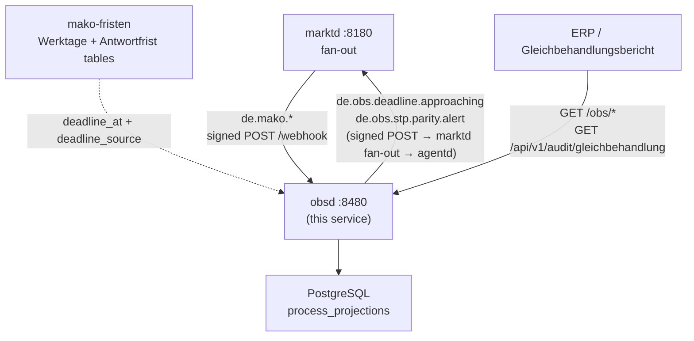

+++
title = "obsd Operator Guide"
description = "obsd operator guide: business-process observability. Process projections, the two deadline clocks, per-PID KPIs, § 7a Abs. 5 EnWG Gleichbehandlung parity evidence, and the de.obs.* producers. PostgreSQL-backed, OIDC-secured."
weight = 29
[extra]
mermaid = true
+++
# `obsd` Operator Guide

`obsd` subscribes to every `de.mako.*` CloudEvent from `marktd` and projects it
into one row per business process. From that row it answers three questions the
engine's own metrics cannot:

- **Which processes are at risk** of missing their business answer window?
- **How did this Prüfidentifikator perform** last month?
- **Did we treat our own Lieferant better** than a third party's?

It never connects to `makod`. It is a read-model with two producers of its own,
and an MCP surface `agentd`'s specialists read.



---

## Two deadline clocks

Every MaKo process carries **two independent deadlines**, and `obsd` reports them
as two numbers. Conflating them is the defect this service is shaped to prevent.

| Clock | Window | A breach means | Where it shows |
|---|---|---|---|
| **APERAK Frist** | 45 min Strom weekday; Gas next Werktag 12:00 (Folgeprozess) or 3 Werktage (Initialprozess) | the message was not *acknowledged* — a transport or validation fault | `state = aperak_timeout`, from `de.mako.aperak.timeout` |
| **Antwortfrist** | per PID — see below | the *business answer* is owed and has not been sent | `deadline_at`, computed on `process.initiated` |

They differ by orders of magnitude and fail for different reasons. Never report
one under the other's name: `total_aperak_timeout` and `total_frist_breached` are
separate fields on every report for exactly this reason.

`state = aperak_timeout` is **not terminal**. A counterparty that missed the
acknowledgement window can still answer the business message, so those processes
stay in the Antwortfrist sweep — they are the ones most likely to breach it too.

---

## Port layout

```
┌───────────────────────────────────────────────────────────────────────┐
│  obsd  :8480                                                          │
│                                                                       │
│  POST /webhook                       ← marktd CloudEvents (signed)    │
│  GET  /obs/processes                 ← list / filter projections      │
│  GET  /obs/processes/{id}            ← single process by UUID         │
│  GET  /obs/kpis                      ← per-PID KPIs for a month       │
│  GET  /obs/overdue                   ← past the business Antwortfrist │
│  GET  /api/v1/audit/gleichbehandlung ← § 7a Abs. 5 EnWG evidence      │
│  GET  /obs/metrics                   ← obsd business gauges (Prom)    │
│  GET  /metrics                       ← request metrics (runner)       │
│  GET  /health/live  /health/ready    ← liveness + real DB ping        │
│  POST|GET /mcp                       ← MCP Streamable HTTP            │
└───────────────────────────────────────────────────────────────────────┘
```

There are **no command-line flags**: `mako_service::run` owns the lifecycle and
`obsd.toml` owns the settings.

---

## ProcessProjection

| Field | Description |
|-------|-------------|
| `process_id` | UUID — the CloudEvent `subject` |
| `pid` | BDEW Prüfidentifikator (e.g. 55001) |
| `family` | `gpke`, `geli-gas`, `wim`, `wim-gas`, `gabi-gas`, `mabis`, `invoic-storno`, `unknown` — `wim-gas` is a **reporting** label derived from the Prüfidentifikator, not a workflow name, and covers only the Gas-only PIDs: the Sparte-neutral ones (INSRPT 23001–23012 minus 23005/23009, INVOIC 31003) report under `wim` |
| `workflow_name` | From the `makoworkflow` CE extension |
| `state` | `initiated` \| `running` \| `aperak_timeout` \| `completed` \| `rejected` \| `failed` |
| `malo_id` | 11-digit Marktlokations-ID |
| `partner_mp_id` | MP-ID of the counterparty (NB/GNB/MSB) |
| `mdm_role` | Canonical Marktrolle (`LF`, `NB`, …) |
| `started_at` | First event seen for this process |
| `last_event_at` | Most recent event |
| `completed_at` | Set once when the state first becomes terminal; cycle-time input |
| `deadline_at` | The **business Antwortfrist**. `null` = no published window for this PID |
| `deadline_source` | The Festlegung `deadline_at` came from |
| `deadline_risk` | `unknown` \| `green` \| `amber` (< 24 h) \| `red` (past) |
| `erc_code` | BDEW ERC code when `state = rejected` |
| `initiator_is_affiliate` | The Lieferant belongs to this operator's own undertaking |

`failed` is the projection of `de.mako.process.failed`. Not `cancelled`: nothing
in mako emits a cancellation, and that name puts unrecoverable failures in a
bucket the STP rate reads as a normal ending.

---

## The Antwortfrist

`obsd` does **not** compute deadlines. `mako-fristen` does — a leaf crate holding
the BDEW Werktage arithmetic, the MaKo holiday calendar and the
per-Prüfidentifikator Antwortfrist tables. `makod` registers the deadline on the
process from the same table and `processd` sizes its operator queue by it, so all
three name one instant.

| Family | Window | Source |
|---|---|---|
| GPKE Strom | **a clock time on the 1. Werktag after the ÜT**: 11:00 Anmeldung (55001/55077), 06:00 Abmeldung (55004), 05:00 Lieferende NB→LF (55007), 09:00 Beendigung der Zuordnung (55010); Kündigung 55016 to the end of the 1. WT | BK6-24-174 GPKE Teil 2 |
| GeLi Gas | Ablauf des **4. WT** Anmeldung (44001), **3. WT** Abmeldung (44004), **2. WT** Ersatz-/Grundversorgung (44013), **3. WT** Kündigung (44016) | BK7-24-01-009 Kap. 3.1–3.3 |
| WiM (Strom + Gas) | **3 / 5 / 7 / 1 Werktage** (55039/55042/55051/55168 resp. 44039/44042/44051/44168), 17:00 Berlin; REQOTE Preisanfrage 4/5/10 WT je PID; Rechnungsabwicklung 8 WT | BK6-22-024 Anlage 2a Kap. 2.2.2–2.5.2, 3.2.2, 3.3.1.2, 3.6.3 · AWH WiM Gas 2.0 |
| Everything else | `null` — **unknown, never unbounded** | — |

> **There is no 24-hour GPKE window and no 10-Werktage GeLi Gas answer window.**
> Both approximations fail in the direction that does not announce itself: a GPKE
> Anmeldung arriving Friday afternoon is answerable until Monday, and one
> arriving Tuesday evening has under sixteen hours — so a flat window breaches
> the first early and reports the second healthy after its Frist has lapsed. The
> GeLi Gas „10 Werktage" is the *supplier's* Vorlauffrist, how far ahead the LF
> must send; the Netzbetreiber's answer window is 4 Werktage.

### `null` is unknown, not compliant

A PID with no published window carries **no deadline** and is absent from every
breach sweep, rather than being measured against an instant nobody can cite. Its
`deadline_risk` is `unknown` — never `green`, because "we have not read that
Festlegung" and "there is time" are different statements.

Every stored deadline carries `deadline_source`, and it travels into the
CloudEvent and out through the MCP tools. Quote it: a recommendation that cites
the rule beats one that asserts a number.

---

## § 7a Abs. 5 EnWG Gleichbehandlung parity

A vertically integrated undertaking's Gleichbehandlungsbeauftragte files a report
with the Bundesnetzagentur **by 31 March** each year, covering the preceding
calendar year, and publishes it in non-personalised form (§ 7a Abs. 5 EnWG).
Lieferantenwechsel is among the areas those reports examine. `obsd` produces the
Lieferantenwechsel evidence for it.

The underlying duties are **§ 6a EnWG** (informatorische Entflechtung) and
**§ 20 Abs. 1 Satz 1 EnWG** (diskriminierungsfreier Netzzugang).

### What is compared

The processes the operator's **network arm answers for a Lieferant** — the ones
where the network operator is the party doing the treating. The set is derived
from the Antwortfrist table (`answered_by == "NB"` in the GPKE and GeLi Gas
families), so it cannot drift from the Festlegung: currently 55001, 55077, 55004,
44001 and 44004.

> The Kündigung (55016, 44016) is deliberately **not** in the set: it is answered
> by the *old supplier*, never by the Netzbetreiber.

`initiator_is_affiliate` is set when the Lieferant's MP-ID — `new_supplier` where
the message names one, the counterparty otherwise — matches any entry in
`[identity] own_mp_ids`.

### The sign convention

**`gap_pp = affiliate − third_party`, in percentage points. Positive means the
affiliate fared better**, which is the concern. The same convention is used by the
REST report, the `de.obs.stp.parity.alert` CloudEvent and the MCP tool.

`gap_pp` is `null` when either group has fewer than 10 processes: the gap is
**unstatable**, not zero — and not a hundred points off a single process.

### There is no regulatory threshold

The Bundesnetzagentur publishes no numeric parity limit for this figure. § 7a
Abs. 5 asks the Gleichbehandlungsbeauftragte to describe the measures taken, not
to meet a number. `[worker] parity_threshold_pp` is the **operator's own**
escalation policy and is labelled as such everywhere it appears. The same applies
to any STP-rate target.

### Multi-MP-ID configuration

An integrated NB+GNB instance operates under several MP-IDs. Configure all of
them, or affiliate processes under the unlisted ones count as third-party:

```toml
[identity]
tenant     = "9900357000004"   # primary — Cedar resource checks
# Strom NB (BDEW 99…) + Gas GNB (DVGW 98…)
own_mp_ids = ["9900357000004", "9800357000004"]
```

Omitting `own_mp_ids` defaults it to `[tenant]`.

### Export

```bash
# JSON, for the current year
curl -s "http://obsd:8480/api/v1/audit/gleichbehandlung?year=2026" \
  -H "Authorization: Bearer $TOKEN" | jq '.by_pid[] | {pid, process, gap_pp, favours}'

# CSV, for the filing
curl -s "http://obsd:8480/api/v1/audit/gleichbehandlung?year=2025&format=csv" \
  -H "Authorization: Bearer $TOKEN" > gleichbehandlung-2025.csv
```

The report year is the year each process **started**, not the year its row was
last touched — so re-running a closed year reproduces it. An annual filing that
changes when you re-run it is not evidence.

---

## Events produced

Two background sweeps produce `de.obs.*` CloudEvents. They run only when
`webhook.outbound_url` is configured (in production, `marktd`'s event-ingest
endpoint, whose fan-out delivers to `agentd`), and are HMAC-signed when
`webhook.outbound_secret` is set.

| Event | Producer | When | Consumed by |
|-------|----------|------|-------------|
| `de.obs.deadline.approaching` | deadline sweep (`deadline_sweep_secs`) | an open process has `deadline_at` within `deadline_warn_hours`, or already past it, and has not been alerted (idempotent per process via `deadline_alerted_at`) | agentd `deadline-alert-agent` |
| `de.obs.stp.parity.alert` | parity sweep (`parity_sweep_secs`) | the completion-rate gap passes `parity_threshold_pp`, with both groups ≥ 10 processes | agentd `compliance-agent` |

**`de.obs.deadline.approaching`:** `process_id`, `pid`, `family`,
`workflow_name`, `malo_id`, `partner_mp_id`, `due_at` (RFC 3339),
`hours_remaining`, `breached`, `deadline_risk`, **`deadline_source`**, `tenant`.

**`de.obs.stp.parity.alert`:** `tenant`, `window_days`, `threshold_pp`,
`affiliate` + `third_party` `{total, completed, rejected, frist_breached}`,
`gap_pp` (signed), `favours`, `min_sample`, `gap_convention`, `basis`.

Only a **delivered** alert is stamped, so a downed webhook target cannot silently
consume a warning. A sweep that returns a full batch reports `saturated`: at least
the cap was waiting — never that the cap was all there was. A quiet sweep logs
nothing, so a line in the log is worth reading.

---

## Configuration reference

`obsd` reads a **TOML file** (default `obsd.toml`, or the path in `OBSD_CONFIG`),
with secrets deferred to environment variables via `"env:VAR_NAME"`. Individual
keys may be overridden by `OBSD_`-prefixed variables (`__` separates nested
sections, e.g. `OBSD_DATABASE__URL`); `RUST_LOG` sets the log level.

Unknown keys are **refused at startup**, at every level — a typo is a refusal to
boot rather than a setting that silently does nothing.

```toml
[http]
addr = "0.0.0.0:8480"          # default

[database]
url       = "env:DATABASE_URL"  # required
pool_size = 10                  # default

[identity]
tenant     = "9900357000004"    # required — MP-ID of the operator
own_mp_ids = ["9900357000004", "9800357000004"]   # § 7a Abs. 5 affiliate detection

[marktd]
url     = "http://marktd:8180"      # required
api_key = "env:OBSD_MARKTD_API_KEY" # required

[webhook]
inbound_secret  = "env:OBSD_INBOUND_SECRET"   # verifies inbound POST /webhook
# Outbound target for the de.obs.* events. In production the marktd
# event-ingest endpoint, whose fan-out delivers to agentd. Omit to disable
# the sweep producers entirely.
outbound_url    = "env:OBSD_OUTBOUND_URL"     # e.g. http://marktd:8180/api/v1/mako/events
outbound_secret = "env:OBSD_OUTBOUND_SECRET"  # HMAC; must match the target's inbound secret

[worker]
deadline_sweep_secs = 900     # deadline sweep interval (default 15 min)
deadline_warn_hours = 24      # alert when an Antwortfrist is within this many hours
parity_sweep_secs   = 86400   # parity sweep interval (default daily)
# The OPERATOR'S escalation threshold, in percentage points. Not a regulatory
# limit — the BNetzA publishes none for this figure.
parity_threshold_pp = 5.0
parity_window_days  = 90      # parity look-back window

[subscription]
# Self-registers with marktd on startup — no manual curl required.
webhook_url   = "http://obsd:8480/webhook"
subscriber_id = "obsd"
event_types   = [
  "de.mako.process.initiated",
  "de.mako.process.completed",
  "de.mako.aperak.accepted",
  "de.mako.aperak.timeout",
  "de.mako.aperak.rejected",
  "de.mako.process.failed",
]

# [oidc]          # omit to disable auth (dev only — never omit in production)
# issuer   = "https://login.microsoftonline.com/{tenant-id}/v2.0"
# audience = "api://mako-obsd"

# [mcp]           # MCP server auth: OIDC + optional API-key fallback
# api_key = "env:OBSD_MCP_API_KEY"

# [otel]          # omit to disable tracing
# endpoint = "http://otel-collector:4317"
```

---

## Query examples

```bash
# Open GPKE Anmeldungen, newest first
curl -s "http://obsd:8480/obs/processes?family=gpke&state=initiated&pid=55001" \
  -H "Authorization: Bearer $TOKEN" \
  | jq '.[] | {process_id, started_at, deadline_at, deadline_source}'

# Per-PID KPIs for one calendar month
curl -s "http://obsd:8480/obs/kpis?pid=55001&period=2026-07" \
  -H "Authorization: Bearer $TOKEN" | jq .

# Past the business Antwortfrist
curl -s "http://obsd:8480/obs/overdue" \
  -H "Authorization: Bearer $TOKEN" \
  | jq '.[] | {pid, malo_id, deadline_at, deadline_source, deadline_risk}'
```

`state` accepts exactly the six stored spellings; anything else is a `400` naming
them, not a silently dropped filter.

### Reading a KPI report honestly

```json
{
  "pid": 55001,
  "total_initiated": 412,
  "total_aperak_timeout": 3,
  "total_frist_breached": 11,
  "total_with_frist": 412,
  "frist_compliance_rate": 0.9733,
  "avg_cycle_time_hours": 9.4,
  "p95_cycle_time_hours": 21.8
}
```

- `total_aperak_timeout` and `total_frist_breached` are **different clocks**.
- Check `total_with_frist` before quoting `frist_compliance_rate`: a small
  denominator means the bucket is mostly *unmeasured*, not compliant.
- A `null` rate means nothing measurable in the bucket. It is not `0`, and it is
  not perfect performance.

---

## Monitoring

`GET /obs/metrics` serves business gauges, computed by querying the store on each
scrape (a counter loses its decrement when a process crashes; a census does not):

| Gauge | Meaning |
|---|---|
| `obsd_process_projections_total` | rows in the read-model |
| `obsd_open_processes_total` | non-terminal processes |
| `obsd_overdue_processes_total` | open and past their Antwortfrist |
| `obsd_db_pool_size` / `obsd_db_pool_idle` | connection pool |

It is unauthenticated by design — restrict it at the ingress. Every other route
that returns business data requires OIDC and passes Cedar.

There is **no Alertmanager bridge**. Alerting is Prometheus's job over these
gauges, or `agentd`'s over `de.obs.deadline.approaching`.

---

## MCP server

`obsd` exposes a read-only MCP server at `/mcp`. Every tool goes through the same
repository the REST surface uses, so the two cannot answer differently.

### Tools (6)

| Tool | Description |
|---|---|
| `get_process(process_id)` | Full projection — state, deadline, `deadline_source`, ERC code |
| `list_overdue_processes` | Past the business Antwortfrist, most urgent first; reports `saturated` |
| `get_kpi_report(pid, period)` | Per-PID KPIs for a `YYYY-MM` month, both clocks separately |
| `get_parity_report(days)` | § 7a Abs. 5 parity; `gap_pp` = affiliate − third_party |
| `get_stp_rate(days)` | Completions over processes that **ended** |
| `list_processes_by_family(family, state, limit)` | Drill into one family |

### Prompts (2)

| Prompt | Description |
|---|---|
| `process-kpis` | Read a period's KPIs without confusing the two clocks |
| `investigate-overdue-process` | Root-cause a missed Antwortfrist |

### Example

```bash
curl -X POST http://obsd:8480/mcp \
  -H "Authorization: Bearer $TOKEN" -H "Content-Type: application/json" \
  -d '{"jsonrpc":"2.0","id":1,"method":"tools/call",
       "params":{"name":"get_stp_rate","arguments":{"days":30}}}'
```

Returns `ended`, `completed`, `rejected`, `failed`, `in_flight`,
`aperak_timeout`, `frist_breached` and `stp_rate` — `null` when nothing ended in
the window, because a window with no endings has no rate.

---

## See also

- [`concepts/OBSD.md`](https://github.com/hupe1980/mako/blob/main/concepts/OBSD.md)
  — the two clocks, the § 7a argument, and what obsd deliberately does not do.
- [agentd Operator Guide](@/docs/services/agentd.md) — the specialists that
  consume `de.obs.*`.
- [processd Operator Guide](@/docs/services/processd.md) — the operator queue
  sized by the same Antwortfrist table.
