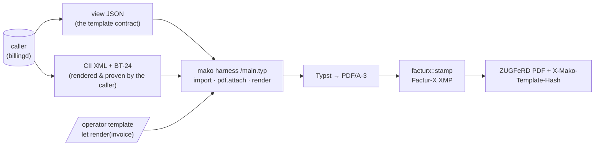

+++
title = "outputd Operator Guide"
description = "Operator guide for outputd, the customer-communications daemon: operator-owned Typst templates, the ZUGFeRD PDF/A-3 carrier, and delivery with per-channel evidence."
weight = 33
+++
`outputd` renders the documents a customer receives and delivers them. It owns
**how documents look** — the operator's Typst templates, the render engine, the
ZUGFeRD PDF/A-3 carrier, the publish gates and the append-only template store —
and **whether they arrived**: the store of issued documents and the per-channel
delivery evidence. What a document **says** — amounts, VAT, legal basis — stays
with the issuing service: billingd for invoices, accountingd for the Mahnwesen
figures, vertragd for a price change. outputd never recomputes a number.

The template system is deliberately not invoice-specific: one brand has one
template store, and a logo change must reach the invoice *and* the Mahnung.

**The vocabulary this page runs on.** A **Mahnung** is a dunning letter and a
**Preisanpassung** a price-change notice; both must reach the customer in
**Textform** (§ 126b BGB — a durable, readable, non-signed medium). **EN 16931**
is the European semantic standard for an electronic invoice; **XRechnung** is
Germany's national implementation of it, and **ZUGFeRD** a PDF/A-3 that carries
the same data as an embedded XML attachment. The services named above act in the
**LF** (Lieferant, supplier) role of German market communication; the roles and
the market objects are the [domain model](@/docs/architecture/domain-model.md), and the shared vocabulary is
the [glossary](@/docs/architecture/domain-model.md#glossary).

Three kinds of document and one carrier format run through the page. A
**Mahnung** is a dunning letter — a formal payment demand, computed by
[accountingd](@/docs/services/accountingd.md). A **Preisanpassung** is the
statutory price-change notice a supplier owes under § 41 Abs. 5 EnWG. Both are
**Textform** documents: § 126b BGB wants a readable declaration on a durable
medium naming the sender and the recipient, and nothing more — no signature, no
registered post. An invoice, by contrast, goes out as **ZUGFeRD**: a PDF that
also carries the machine-readable invoice XML inside it, so one file is both the
page a human reads and the data a recipient's system books. **XRechnung** is
Germany's national restriction of the same EN 16931 invoice model, mandatory
toward public authorities; a document declares which of the two it is in the
EN 16931 term **BT-24**, and outputd stamps the carrier from that.

Port: `:9880`

| Method | Path | Description |
|---|---|---|
| `POST` | `/api/v1/render/{kind}` | Render a view with the current or a pinned template; `X-Mako-Template-Hash` names the layout used. Stores nothing |
| `POST` | `/api/v1/documents/{kind}` | Render, **record** and queue for delivery; idempotent on `subject_ref` |
| `GET` | `/api/v1/documents` | A customer's documents (`?malo_id=` or `?kunden_nr=`, `&kind=`) — the portal inbox |
| `GET` | `/api/v1/documents/{id}` | One document with every delivery track |
| `GET` | `/api/v1/documents/{id}/content` | The bytes as issued — a reproduction, never a re-render |
| `POST` | `/api/v1/deliveries/{id}/read` | The customer opened it in the portal |
| `POST` | `/api/v1/deliveries/{id}/status` | A channel reports arrival or a bounce |
| `GET` | `/api/v1/spool` | What a print service collects |
| `GET` | `/api/v1/templates` | Every template this tenant published (`?kind=&limit=`) |
| `POST` | `/api/v1/templates` | Prove a template, then store it forever |
| `POST` | `/api/v1/templates/preview` | Render an `INVOICE`/`MAHNUNG` candidate against its specimen; stores nothing |
| `GET` | `/api/v1/templates/reference/{kind}` | The reference layout mako ships, one per kind |
| `GET`/`PUT` | `/api/v1/templates/{kind}/current` | Which template is rolled out |
| `GET` | `/api/v1/templates/by-hash/{hash}` | Resolve the layout an issued document used |

## The render API — `POST /api/v1/render/{kind}`

The caller sends what the document is *about*, optionally a **template hash**
(a pinned document; omitted, the tenant's current template renders), and — for
`INVOICE` — the **CII payload with its BT-24**, so the ZUGFeRD carrier is
stamped exactly as the document declares itself. The answer is the PDF, with
`X-Mako-Template-Hash` naming the template used; the issuing service pins that
hash next to its record.

What "about" means depends on the kind:

| Kind | Field | Why |
|---|---|---|
| `INVOICE` | `model` — the EN 16931 semantic model | outputd projects the page view from it, so the projection the publish gate proves templates against is the one production feeds them |
| `MAHNUNG`, `PREISANPASSUNG` | `view` — the kind's own view | their producer has no EN 16931 model, and the view *is* the contract |

`POST /api/v1/documents/{kind}` takes the same body plus a `subject_ref`, a
`recipient` and the `channels` to queue. See *Issuing and delivery* below.

A caller projecting `en16931::Invoice → DocumentView` itself and sending the
result would be two implementations of one contract with nothing tying them
together: the gate proves templates against outputd's, production would feed
them the caller's, and a field added to either yields templates that pass the
gate and fail in production. Both services already depend on `en16931`, so the
model is a type they share the way they share `zugferd::Profile`.

Admission is checked before anything renders, each refusal a `422` naming the
fix: a pinned hash must belong to **this kind** (a Textform template must never
become a carrier — `RENDERED_PDFA` is exactly the proof it lacks), the subject
must match the kind, an `INVOICE` render **requires** the attachment (a handsome
PDF without its embedded invoice is the failure mode that looks like success),
and a Textform render must not carry one.

A pinned hash belonging to another tenant does not resolve at all —
`template_store::by_hash` is tenant-scoped, so the rule lives in the query
rather than in a check each caller-facing path has to remember.

## Authorization

Authentication establishes *who* is calling; `policies/outputd.cedar` decides
what they may do, and every route checks it before touching the database.

| Action | Routes | Who |
|---|---|---|
| `read-template` | `GET /templates`, `/{kind}/current`, `/by-hash/{hash}`, `/reference/{kind}` | any authenticated caller in the tenant |
| `preview-template` | `POST /templates/preview` | any authenticated caller in the tenant |
| `publish-template` | `POST /templates` | `LF`, `MSB`, `ESA` |
| `rollout-template` | `PUT /templates/{kind}/current` | `LF`, `MSB`, `ESA` |
| `render-document` | `POST /render/{kind}` | `LF`, `MSB`, `ESA` |
| `issue-document` | `POST /documents/{kind}` | `LF`, `MSB`, `ESA` |
| `report-delivery` | `POST /deliveries/{id}/status` | `LF`, `MSB`, `ESA` |
| `read-document` | `GET /documents…`, `/spool`, `POST /deliveries/{id}/read` | any authenticated caller in the tenant |

Authentication alone is not enough here: without a policy, any token the OIDC
verifier accepts could roll out the layout every invoice and Mahnung of the
tenant renders with, or render arbitrary content under the operator's
Briefkopf. A template is not one document — it is the shape of all of them.

`tests/authorization.rs` pins the two lists together in both directions: an
action a handler checks and `policies/outputd.cedar` does not grant is a
permanent 403 (Cedar is default-deny), and an action the policy grants that no
handler checks usually means a route lost its guard.

A preview is a read on purpose: it renders mako's own specimen, stores nothing,
moves nothing and reaches no customer.

Reading issued documents is a tenant read rather than a role-gated act, because
the scope that protects a customer here is the **query**:
`GET /api/v1/documents` refuses to answer without a `malo_id` or a `kunden_nr`,
so no token can ask for the portfolio. `portald` is the caller that turns a
customer's OIDC identity into that scope, and it resolves the scope from
`vertragd`.

## Issuing and delivery

`POST /render/{kind}` produces bytes and keeps none — the right endpoint for a
preview, a re-print, or a caller with its own archive. `POST /documents/{kind}`
is the same render **recorded and queued**, which is what makes two regulated
questions answerable:

- **reproduce what was issued.** § 14 Abs. 1 Satz 2 UStG and
  § 147 Abs. 1 Nr. 2–3 AO keep the Rechnungsdoppel for eight years *in the form
  in which it was issued*. A pinned template hash makes the layout resolvable;
  it does not make the document resolvable, because the data behind it moves.
  `GET /documents/{id}/content` returns the stored bytes, never a re-render.
- **did the customer receive it.** § 126b BGB and § 41f Abs. 1/Abs. 5 EnWG rest
  on notices that must have *reached* the customer, four weeks and eight
  Werktage before a disconnection.

Both stores are append-only, like `document_templates` and for the same statute.
A corrected document is a new row.

### Idempotency

`subject_ref` names what the document is about, in the issuing service's own
terms — a Rechnungsnummer for an `INVOICE`, a dunning-case id for a `MAHNUNG`, a
product-slice id for a `PREISANPASSUNG`. It is unique per `(tenant, kind)`, so a
service that retries after a timeout gets back the document it already issued.
That matters most where a duplicate is not untidy but unlawful: a second Mahnung
is a second statutory demand with its own payment deadline and a second § 41f
clock nobody can reconcile with the first.

### Channels

| Channel | How outputd delivers | Evidence | `DELIVERED` when |
|---|---|---|---|
| `PORTAL` | the document is in the store; `portald` serves it | published, then `read_at` when the customer opens it | on publish — it is then in the recipient's sphere, which is what § 126b BGB asks of a durable medium |
| `EMAIL` | `POST` to a configured mail relay | the relay's message id | the relay reports the recipient's server accepted it |
| `POST` | a spool a print service pulls (`GET /api/v1/spool`); an optional push when `postal_relay_url` is set | the batch reference it reports back | the service reports it posted |
| `ERP` | `POST` to the operator's own webhook | its response | the ERP reports it |

outputd embeds **no SMTP client and no print driver**. Both are adapters an
operator already runs, and embedding them turns a document daemon into a mail
server. Each outbound channel is an HTTP relay — a URL, a bearer token, JSON
with the document base64-encoded — the same contract `accountingd` uses for its
bank adapter. A deployment that configures none still has the portal channel,
which is what § 41 Abs. 5 EnWG and § 126b BGB actually ask for: Textform on a
durable medium, not registered post.

A channel with nothing to send to — `EMAIL` with no address on file — is stored
`SUPPRESSED` **with its reason**, never omitted, so *why did this never go out*
is answerable from the row rather than from its absence.

`SENT` and `DELIVERED` are deliberately different states. A relay accepting a
message is not the recipient's server accepting it, and a spool being collected
is not a letter being posted; those become `DELIVERED` only when the far end
reports it through `POST /deliveries/{id}/status`. A bounce reported there turns
an apparently-successful notice into the failure it was.

### The worker

One loop drains what is `PENDING`, with doubling backoff from 60 s to 6 h and a
configurable attempt ceiling (default 8, about half a day). Replicas are safe:
the claim is `FOR UPDATE SKIP LOCKED` with an immediate `next_attempt_at` push,
so a replica that dies mid-send releases its claim when the backoff elapses.

At the ceiling a delivery becomes `FAILED` and is logged at `error`. That is the
one outcome an operator must not have to go looking for: the platform believes
it communicated something and the customer never received it.

**A `POST` delivery with no `postal_relay_url` is not on that clock.** The pull
model — the print service calls `GET /api/v1/spool`, fetches each document's
bytes and reports back through `POST /deliveries/{id}/status` — is a supported
integration and not a failed push, so the worker does not claim those rows at
all: no attempt is recorded, the ceiling is never reached, and the letter stays
`PENDING` in the spool for as long as nobody has collected it. Configuring
`postal_relay_url` switches the same rows to the push model, where they are on
the clock like any other channel.

That the two agree matters more than which behaviour is chosen: the spool lists
`PENDING` rows, so a `POST` row driven to `FAILED` by a retry budget disappears
from the only list anyone looks at. It did, until this was fixed — a pull-only
deployment lost every letter about half a day after issuing it, silently.

## Errors

Every route answers failures with one envelope and a stable code. A template
that does not compile returns its diagnostics as a **list** — each already
`path:line:col: message`, pointing into the operator's own file — because
flattening them into one string is the single thing that makes them useless to
the editor the operator is writing the template in:

```json
{ "error": { "code": "TEMPLATE_DID_NOT_COMPILE",
             "message": "the template did not render",
             "diagnostics": ["/template.typ:12:4: unknown variable: invoce"] } }
```

| Code | Status | Meaning |
|---|---|---|
| `UNKNOWN_TEMPLATE_KIND`, `INVALID_DATE`, `EMPTY_SOURCE` | 400 | a malformed request |
| `SUBJECT_REF_REQUIRED`, `NO_CHANNEL`, `UNSCOPED_QUERY` | 400 | an issue or a query missing the key that scopes it |
| `FORBIDDEN` | 403 | the Cedar policy denied the action |
| `TEMPLATE_NOT_FOUND`, `NO_CURRENT_TEMPLATE` | 404 | nothing of this tenant answers to that |
| `DOCUMENT_NOT_FOUND`, `PORTAL_DELIVERY_NOT_FOUND` | 404 | no such issued document / portal delivery in this tenant |
| `TEMPLATE_IDENTITY_TAKEN` | 409 | you have already published this exact source under another kind |
| `TEMPLATE_DID_NOT_COMPILE`, `TEMPLATE_REJECTED_BY_GATE` | 422 | with `diagnostics` |
| `TEMPLATE_NOT_PUBLISHED` | 422 | the rollout names a hash never published as this kind |
| `TEMPLATE_WRONG_KIND`, `SUBJECT_MUST_BE_A_MODEL`, `SUBJECT_MUST_BE_A_VIEW` | 422 | the render's parts do not agree |
| `ATTACHMENT_REQUIRED`, `ATTACHMENT_NOT_ALLOWED`, `ATTACHMENT_UNUSABLE`, `ATTACHMENT_NAME_INVALID` | 422 | the carrier contract |
| `PDF_STANDARD_UNUSABLE` | 422 | a level that would silently drop the invoice |
| `DATE_NOT_REPRESENTABLE` | 422 | a document date the PDF date format cannot carry |
| `NO_SPECIMEN` | 422 | this kind has no preview specimen — publish it instead |
| `RENDER_BUDGET_EXCEEDED` | 422 | the template is doing far more work than one document needs |

## Templates

The **layout** belongs to the operator — a [Typst](https://typst.app) template
published over the API and pinned by hash. The **content** belongs to the
issuing service: outputd renders what it is handed and never recomputes an
amount, which is why the payload arrives rendered and (for B2G) proven —
billingd validates against the profile the document declares before anything
crosses this boundary. That is the whole design, and it is enforced rather than
agreed.



### The template contract

A template exports exactly one function:

```typst
#let render(invoice) = { .. }
```

`invoice` is `document::view::DocumentView` as a Typst dictionary — projected by
outputd from the caller's EN 16931 model, and the §14
Abs. 4 UStG Pflichtangaben, the lines, the VAT breakdown per rate and the
totals, each field documented with its EN 16931 BT/BG term. Amounts are exact
decimal strings, never floats, and they keep the scale their business term
carries (money two decimals, a unit price four), so a template must **pad** a
value to the precision it wants and never truncate one. This view is the
**normative** contract — the publish gate proves templates against it; a caller
(billingd) serialises its own copy of the same shape at the HTTP boundary.

`GET /api/v1/templates/reference/{kind}` serves the layout mako ships — a complete §14
Abs. 4-conformant invoice with DIN 5008 margins and German number formatting.
It is compiled by the test suite on every run against the same specimen an
operator's template will face, so the starting point is never stale.

### What a template cannot do

mako compiles **its own** entry file, not the operator's. The harness imports
the template, hands it the view, and emits the `pdf.attach` itself:

```typst
#import "/template.typ": render
#pdf.attach("factur-x.xml", bytes("<?xml version=\"1.0\" .."), relationship: "alternative", ..)
#render(json("/document.json"))
```

So a template cannot omit the invoice, rename it, replace it (Typst refuses a
duplicate attachment path), or read it — the XML is a *literal* in mako's file,
not a file served to the compiler, because a `World` cannot tell its callers
apart and anything readable by the harness would be readable by the template.

Beyond that, the compilation environment is the smallest one that can still
typeset an invoice:

| Capability | Available to a template |
|---|---|
| Host filesystem | none — three in-memory files exist and nothing else |
| Network, `@preview` packages | refused, with a message explaining why |
| Fonts | the bundled Typst set; never the host's, never the operator's |
| Wall clock | none — `datetime.today()` returns the *document's* date (BT-2) |

Compute is *not* sandboxed. Typst caps loop iterations and call depth, but
nested loops still multiply, so a render runs on a blocking thread under a
20 s budget; on timeout the caller is freed and the thread finishes on its own,
because Typst offers no way to interrupt a compilation.

Concurrent renders are **capped** at one fewer than the machine's cores.
Typesetting is CPU-bound and runs on tokio's blocking pool — the same pool
`sqlx` uses — so an unbounded burst of publishes would contend for cores, take
proportionally longer each, and in the limit stall database work unrelated to
rendering. Queuing is strictly better than thrashing: the work is serialised
either way, and this way the rest of the service keeps moving. Waiting for a
slot counts against the caller's budget, so a queue can never outlast the
deadline a caller asked for. The permit is held by the render itself rather than
by the caller, so a timed-out render keeps its slot until it genuinely ends —
which is the truth about the machine.

### The Factur-X carrier

A PDF/A-3 with the XML stapled inside it is not yet a ZUGFeRD document.
ZUGFeRD 2.3 requires four things of the carrier, and a receiver's validator
checks all four:

| Requirement | Written by |
|---|---|
| PDF/A-3 conformance | `typst-pdf` (enforced, not claimed) |
| `factur-x.xml` — or `xrechnung.xml` for the XRECHNUNG profile | the harness |
| `/AFRelationship /Alternative` + catalogue `/AF` | Typst |
| XMP `fx:DocumentType` / `DocumentFileName` / `Version` / `ConformanceLevel`, **plus** the PDF/A extension schema description | `document::facturx::stamp` |

The last one has no hook in `typst-pdf`, so mako adds it by **incremental
update**: every byte the renderer produced stays in place and a new definition
of the metadata object is appended with its own cross-reference section — the
same mechanism a digital signature uses. Re-serialising the file through a
general-purpose PDF library would be less code and would risk quietly breaking
a conformance property nobody re-validates.

Only the *writing* half is mako's. Reading a finished document — walking the
catalogue to the payload, parsing it back as CII, and reporting any
disagreement between what the PDF declares and what it contains — is
`en16931-formats::zugferd::extract`, and the profile vocabulary is that crate's
`Profile`. mako had its own name-tree walk and its own two-variant profile enum;
both are gone. A private enum that knows two of six profiles is how a MINIMUM
document — which carries no lines and is **not** an EN 16931 invoice — ends up
wrapped in a carrier claiming it is one.

The profile is derived from BT-24, never configured: a document declaring plain
EN 16931 gets `factur-x.xml` and conformance level `EN 16931`; one declaring the
XRechnung CIUS gets `xrechnung.xml` and `XRECHNUNG`. A carrier whose XMP claims
a profile the XML does not satisfy is exactly the mismatch a validator exists to
find, so it is made unrepresentable.

### Publishing is gated by proof

`POST /api/v1/templates` does not store what it is given. It renders the
candidate against a specimen chosen to be *awkward* — two VAT rates, an exempt
position with a BT-120 reason, a credit line, a four-decimal unit price beside
two-decimal money, umlauts, a long item name, absent optional fields — then:

1. enforces the declared PDF/A level (a level that cannot carry an embedded
   file is **refused**, because it would produce a handsome PDF with no invoice
   in it — the one failure mode that looks like success);
2. stamps the Factur-X XMP;
3. **reads the finished document back with the counterparty's reader** —
   `en16931-formats::zugferd::extract`, the same code a receiver runs, not
   mako's. The payload must come out byte-identical, re-parse as CII, carry the
   same BT-1 and BT-115 that went in, and produce **no `Divergence`**: the four
   ways a hybrid invoice is wrong while still opening cleanly — XMP profile ≠
   BT-24, XMP filename ≠ the file attached, an `/AFRelationship` calling the
   invoice supplementary, or no XMP at all;
4. reads the text back off the **page** and requires the § 14 Abs. 4 UStG terms
   that are not a matter of taste — the invoice number (Nr. 4), both party
   names (Nr. 1), and the seller's tax identifier (Nr. 2). Without this,
   `#let render(invoice) = []` passes: conformant PDF/A-3, perfectly
   extractable CII invoice, blank page.

   Nr. 2 is checked as the **disjunction** the statute writes — the USt-IdNr.
   (BT-31) *or* the Steuernummer (BT-32), either one satisfying it, so a § 19
   UStG Kleinunternehmer prints a lawful page from the Steuernummer alone;
5. refuses a layout that spends more than 8 pages on the specimen.

The specimen is a real `en16931::Invoice`, reconciled by the crate that owns
BG-23 and BG-22. The view the template renders comes from `DocumentView::of`
and the payload from `en16931_formats::cii` — the same shapes production sends
— so the gate proves the pipeline rather than an approximation of it. A
two-sided test tripwire pins the specimen's stamped terms (BT-23, BT-34,
BG-14, BG-16) to what billingd's `einvoice::build` actually stamps, so the two
cannot drift apart across the service boundary unnoticed.

Only then is a row written. A template that fails answers **422** with the
compiler's diagnostics, each formatted `path:line:col` and pointing into the
operator's own file.

`document_templates.proof` records *which* proof was obtained —
`RENDERED_PDFA` for a carrier, `RENDERED_TEXTFORM` for a Textform kind — and a
`CHECK` constraint ties each kind to the one its contract requires, so a
Textform template can never be stored as a proven carrier or the reverse.

`POST /api/v1/templates/preview` runs the same render and returns the PDF
without storing anything — the loop an operator actually works in, so iterating
on a layout does not put a row in an append-only table each time. It covers
`INVOICE` (stamped exactly as an issued one, so the file can go straight into
veraPDF) and `MAHNUNG`. A `PREISANPASSUNG` candidate answers **422
`NO_SPECIMEN`** and has to be checked by publishing it — the gate proves that
kind, the preview path does not.

### Renders are reproducible

Nothing ambient reaches the output. The date is BT-2, the PDF `/ID` is derived
from tenant, template hash and record id, and the fonts are compiled into the
binary — so re-rendering an issued invoice produces the *same bytes*, not an
equivalent document. `rendering_the_same_invoice_twice_produces_the_same_file`
is the test that keeps it true.

The template that rendered an issued document is **pinned by the issuing
service**: `X-Mako-Template-Hash` goes back with every render, billingd writes
it next to the record on the first render after dispatch, and every later
request sends the hash back to reproduce that document. Rolling out a redesign
changes what new invoices look like and nothing about one already sent.

A draft renders with the current layout every time and pins nothing. That
matters because the store never deletes — pinning a draft would trap an
operator's own preview on the version they were about to fix, permanently.

### The template store

Templates live in `document_templates`, **content-addressed and append-only**: a
template is identified by `(tenant, SHA-256 of its source)`, rows are never
updated or deleted, and the issuing service records which one rendered each
document (for
an invoice: `billing_records.template_hash` in billingd). The pin lives in
*another service's database*, so no foreign key can guard it — this store's
append-only policy is the whole guarantee that it stays resolvable. `document_template_current` is a separate, mutable pointer per
`(tenant, kind)` — the pointer moves, the templates it references do not.

The identity is scoped to the **tenant**, not global. outputd ships a reference
layout (`GET /api/v1/templates/reference/{kind}`) that operators are told to start
from, so a globally unique hash would make the first tenant to publish it
unchanged its owner for everyone: every other tenant is refused and told to add
a cosmetic comment — which makes the audit identity of an eight-year document
depend on filler — and the refusal itself discloses that some other tenant holds
those exact bytes. Two tenants publishing the same source get two rows and never
observe each other.

That shape is required, not chosen. An invoice is a Buchungsbeleg kept **8 years**
(§ 14b UStG / § 147 AO) and GoBD requires *Unveränderbarkeit*, so a document
issued today must still be explicable in 2034 — including why it looked the way
it did. Editing a template in place would silently rewrite the history of every
document it ever rendered.

| Kind | Output | Default conformance | Proof |
|---|---|---|---|
| `INVOICE` | ZUGFeRD PDF/A-3 carrier | `a-3b` | `RENDERED_PDFA` |
| `MAHNUNG` | Textform (§ 126b BGB) | — | `RENDERED_TEXTFORM` |
| `PREISANPASSUNG` | § 41 Abs. 5 EnWG notice, Textform | — | `RENDERED_TEXTFORM` |

There is no weaker level: every kind has a specimen and a page-content check, so
every template is proven against one, and the schema refuses a row on anything
else.

A **Mahnung** is proven against the **Stufe-3 specimen** — the most legally
loaded variant — which requires the § 126b declarant, the Gesamtforderung, the
Zahlungsfrist and the § 41f Sperrtermin on the page.
`document::mahnung::MahnungView` projects what `accountingd`'s Mahnwesen
computes: Stufe 1–3, the open Posten, § 288 BGB Verzugszinsen with their basis,
the Mahngebühr, and the Stufe-3 § 41f EnWG Sperrandrohung.

A **Preisanpassung** is the kind whose *content* the statute fixes rather than
its form. § 41 Abs. 5 Satz 1 EnWG wants the change, its Anlass and its
**Umfang**; Satz 4 gives the customer a termination right without notice to the
day the change takes effect, and Satz 1 obliges the supplier to state that right
**in the same notice**. A letter that announces the price and omits the right is
not a valid Preisänderungsanzeige, so the gate renders a **mixed** specimen —
one price up, one down — and requires the declarant, the Wirksamkeit, *both*
changed prices and the Sonderkündigungsrecht date on the page. A template that
prints one position, or assumes every price rises, is refused.

The views live with the renderer rather than with the data — `accountingd` and
`vertragd` conform to them the way a browser conforms to HTML. That is what made
this daemon extractable.

The Textform kinds share the store and the engine deliberately: two template
systems for one brand is how a logo change reaches the invoice and not the
Mahnung.

| Method | Path | Purpose |
|---|---|---|
| `GET` | `/api/v1/templates` | Every template this tenant published (`?kind=&limit=`), newest first, `is_current` marking the one in use — how a rollback finds its hash |
| `POST` | `/api/v1/templates` | Prove a template and publish it; returns its hash, proof, page count and any Typst warnings. Idempotent — identical source stores nothing new |
| `POST` | `/api/v1/templates/preview` | Render an `INVOICE` or `MAHNUNG` candidate against its specimen and return the PDF. Stores nothing; `PREISANPASSUNG` answers `422 NO_SPECIMEN` |
| `GET` | `/api/v1/templates/reference/{kind}` | The reference layout mako ships — one per kind, each passing its own gate |
| `PUT` | `/api/v1/templates/{kind}/current` | Roll a published template out. `422` when the hash was never published |
| `GET` | `/api/v1/templates/{kind}/current` | What this tenant renders with now |
| `GET` | `/api/v1/templates/by-hash/{hash}` | Resolve any template by hash — how an audit answers *why did the 2027 invoice look like that* |

Publishing and rolling out are separate calls because they are separate
decisions: a template is stored before anyone is billed with it, and rolling back
is the same `PUT` with the previous hash — possible only because the store never
deletes, and *performable* only because `GET /api/v1/templates` says what the
previous hash was. There is **no update and no delete** endpoint by design.

The listing omits the source: a template runs to tens of kilobytes and the point
is to choose one, not to ship every version of a layout at once. `GET
/api/v1/templates/by-hash/{hash}` fetches the source for the one chosen.


### Verifying a generated document

`just zugferd-specimen` writes a stamped ZUGFeRD file to `target/`. It exists
because two properties cannot be checked from inside mako, and both need an
artefact:

| Check | Tool | Status |
|---|---|---|
| Payload against the 227 EN 16931 rules | `en16931 validate` (`cargo install en16931-cli`) | **valid — 0 findings**, an independent implementation reading what mako wrote |
| Payload validity *before* embedding | the caller (billingd), and the publish gate for its specimen | enforced |
| Carrier round-trip, `Divergence`, page content | mako's publish gate | enforced on every publish |
| XMP well-formed, every `fx:` property declared in its extension schema | `tests/zugferd_carrier.rs` | enforced |
| The incremental update disturbs **exactly one object**, `/ID` `/Root` `/Size` preserved | `tests/zugferd_carrier.rs` | enforced |
| **PDF/A-3b conformance** | veraPDF (`verapdf/cli:latest`) | **compliant, 0 failed rules** — both profiles and the pre-stamp control |
| XRechnung-profile payload (core + BR-DE) | `en16931 validate` | **valid — 0 findings of 282 rules** |
| Carrier + payload against the ZUGFeRD specification | Mustang 2.25.0 (reference validator) | **valid, both profiles** — XRechnung profile with zero findings; core profile carries one upstream warning (below) |

The independent payload check is not decoration: it is what found a missing
BT-152 on the exempt line of mako's own gate specimen, which every internal
check had passed because a carrier round-trips an invalid payload exactly as
faithfully as a valid one. The gate now validates the payload before embedding
it, so that class of defect cannot recur.

The XMP check is the one PDF/A property that *is* testable without veraPDF, and
it matters because `stamp` splices into the metadata stream as a **string** — a
`contains` assertion passes just as happily on a packet that is no longer
well-formed. The test parses it, and requires every `fx:` property to be
declared in the fx extension schema's own entry, because PDF/A rejects an
undeclared property and Typst writes an extension schema of its own that would
otherwise appear to satisfy the requirement.

The object-isolation check is the closest mako can get to the PDF/A question
without veraPDF. It cannot prove the file conforms — but it proves the thing
mako is *responsible* for: that appending the update left a document whose
conformance the generator had already established otherwise untouched. It walks
every object in the pre-stamp file and requires the post-stamp file to resolve
each identically, with the `/Metadata` stream the single permitted exception.

**The stamp must respect an XMP data-model rule that XML well-formedness does
not imply:** a property may appear **once** per packet, and
`pdfaExtension:schemas` is one Typst already writes. mako's schema description
therefore joins the existing bag rather than opening a second, a test pins the
single occurrence, and all three specimens (`just zugferd-specimen`) validate
compliant. A second occurrence renders the file unparseable (veraPDF 6.6.2.1)
with no PDF/A identification (6.6.4). veraPDF is not part of `just ci` — re-run
it after any change to `document::facturx`.

**`just zugferd-verify` runs the whole panel containerized** — veraPDF via the
foundation's `verapdf/cli` image, Mustang under Temurin — so verification needs
Docker and nothing else. Every file must come back valid; the pre-stamp control
is what isolates a future stamp regression from a renderer one.

One expected notice on the core-profile file, and it is a **false positive**:
Mustang raises `PEPPOL-EN16931-R008` (*document must not contain empty
elements*) on the empty `<ram:ApplicableHeaderTradeDelivery/>` a document
without delivery terms carries. The element is mandatory in the CII D16B XSD
(no `minOccurs`, which defaults to 1 — omitting it fails schema validation
outright), and KoSIT's own Schematron carves exactly this element out of the
R008 empty-element rule when translating Peppol's UBL-targeted rule to CII;
Peppol publishes no CII Schematron at all. Empty is correct — do not "fix" it
by omitting the element. The XRechnung-profile specimen validates with zero
findings.

> **Version note:** `en16931`/`en16931-formats` are pinned exactly at **0.6.0**.
> The ZUGFeRD PDF/A-3 carrier is written by `document::facturx` on top of Typst's
> PDF/A enforcement; the `en16931-formats` `zugferd` feature is the *reader* the
> publish gate checks the result with.

## Configuration

```toml
# outputd.toml
port   = 9880
tenant = "9900357000004"   # the operator's MP-ID — every template row is scoped to it

[database]
url = "postgresql://outputd:secret@db:5432/outputd"

# OIDC token verification for the HTTP API. outputd refuses to start without
# it unless `allow_insecure_no_auth = true` (dev only) — an open outputd lets
# anyone publish the layout every customer document renders with, and render
# arbitrary content under the operator's Briefkopf.
[oidc]
issuer   = "https://idp.example/realms/mako"
audience = "outputd"

# How issued documents reach the customer. Every outbound channel is an HTTP
# relay pointed at whatever the operator already runs; with none configured,
# documents are still stored and served and the portal channel still delivers.
[delivery]
enabled             = true          # default
max_attempts        = 8             # default; with the doubling backoff, ~half a day
from_address        = "rechnung@stadtwerke-musterstadt.example"
email_relay_url     = "https://mail-relay.internal/api/v1/send"
email_relay_api_key = "env:OUTPUTD_MAIL_RELAY_KEY"
# Optional: most print services pull from GET /api/v1/spool instead. Leaving it
# unset selects the pull model — POST rows are never claimed by the worker and
# wait in the spool; setting it switches them to the push model and its retries.
postal_relay_url    = "https://druckdienstleister.example/api/v1/jobs"
postal_relay_api_key = "env:OUTPUTD_PRINT_KEY"
# The ERP channel — the operator's own system, which then owns delivery.
erp_webhook_url     = "https://erp.internal/api/v1/documents"
erp_api_key         = "env:OUTPUTD_ERP_KEY"

# Subject lines per kind; a kind with no entry falls back to a built-in.
[delivery.subjects]
INVOICE        = "Ihre Rechnung"
MAHNUNG        = "Zahlungserinnerung"
PREISANPASSUNG = "Änderung Ihrer Preise"
```

Callers configure the counterpart: `outputd_url` plus an optional
`outputd_api_key` bearer in billingd, accountingd, vertragd and portald. Without
a reachable outputd, billingd's PDF endpoint answers `502` (the XML endpoints
need no renderer), and accountingd and vertragd record their dunning and
price-change facts without producing a document — visibly, in the log.
