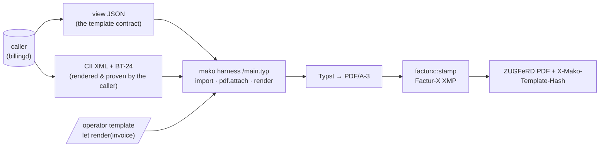

+++
title = "outputd Operator Guide"
description = "outputd operator guide: customer-communications daemon. Operator-owned Typst templates (content-addressed, append-only, publish gated by proof), the ZUGFeRD PDF/A-3 carrier around a caller's EN 16931 CII payload, Textform documents (Mahnung § 126b BGB), and the containerized external validation panel (veraPDF + Mustang)."
weight = 33
[extra]
mermaid = true
+++
# `outputd` — Customer Communications

`outputd` renders the documents a customer receives. It owns **how documents
look** — the operator's Typst templates, the render engine, the ZUGFeRD PDF/A-3
carrier, the publish gates and the append-only template store. What a document
**says** — amounts, VAT, legal basis — stays with the issuing service: billingd
for invoices, accountingd for the Mahnwesen figures. outputd never recomputes a
number; it renders what it is handed and proves the rendering.

Extracted from billingd (2026-08-10) because the template system was never
invoice-specific: one brand has one template store, and a logo change must reach
the invoice *and* the Mahnung. The delivery channel — mail, e-mail, portal
inbox, with per-document evidence — is this daemon's designed growth; see the
ROADMAP's customer-communications item.

Port: `:9880`

| Method | Path | Description |
|---|---|---|
| `POST` | `/api/v1/render/{kind}` | Render a view with the current or a pinned template; `X-Mako-Template-Hash` names the layout used |
| `GET` | `/api/v1/templates` | Every template this tenant published (`?kind=&limit=`) |
| `POST` | `/api/v1/templates` | Prove a template, then store it forever |
| `POST` | `/api/v1/templates/preview` | Render a candidate against the kind's specimen; stores nothing |
| `GET` | `/api/v1/templates/reference/{kind}` | The reference layout mako ships (`INVOICE`, `MAHNUNG`) |
| `GET`/`PUT` | `/api/v1/templates/{kind}/current` | Which template is rolled out |
| `GET` | `/api/v1/templates/by-hash/{hash}` | Resolve the layout an issued document used |

## The render API — `POST /api/v1/render/{kind}`

The caller sends the **view** (the JSON its document kind's template consumes),
optionally a **template hash** (a pinned document; omitted, the tenant's current
template renders), and — for `INVOICE` — the **CII payload with its BT-24**, so
the ZUGFeRD carrier is stamped exactly as the document declares itself. The
answer is the PDF, with `X-Mako-Template-Hash` naming the template used; the
issuing service pins that hash next to its record.

Admission is checked before anything renders, each refusal a `422` naming the
fix: a pinned hash must belong to **this kind and this tenant** (a Textform
template must never become a carrier — `RENDERED_PDFA` is exactly the proof it
lacks), an `INVOICE` render **requires** the attachment (a handsome PDF without
its embedded invoice is the failure mode that looks like success), and a
Textform render must not carry one.

The **layout** belongs to the operator — a [Typst](https://typst.app) template
published over the API and pinned by hash. The **content** belongs to the
issuing service: outputd renders what it is handed and never recomputes an
amount, which is why the payload arrives rendered and (for B2G) proven —
billingd validates against the profile the document declares before anything
crosses this boundary. That is the whole design, and it is enforced rather than
agreed.



### The template contract

A template exports exactly one function:

```typst
#let render(invoice) = { .. }
```

`invoice` is `document::view::DocumentView` as a Typst dictionary — the §14
Abs. 4 UStG Pflichtangaben, the lines, the VAT breakdown per rate and the
totals, each field documented with its EN 16931 BT/BG term. Amounts are exact
decimal strings, never floats, and they keep the scale their business term
carries (money two decimals, a unit price four), so a template must **pad** a
value to the precision it wants and never truncate one. This view is the
**normative** contract — the publish gate proves templates against it; a caller
(billingd) serialises its own copy of the same shape at the HTTP boundary.

`GET /api/v1/templates/reference` serves the layout mako ships — a complete §14
Abs. 4-conformant invoice with DIN 5008 margins and German number formatting.
It is compiled by the test suite on every run against the same specimen an
operator's template will face, so the starting point is never stale.

### What a template cannot do

mako compiles **its own** entry file, not the operator's. The harness imports
the template, hands it the view, and emits the `pdf.attach` itself:

```typst
#import "/template.typ": render
#pdf.attach("factur-x.xml", bytes("<?xml version=\"1.0\" .."), relationship: "alternative", ..)
#render(json("/document.json"))
```

So a template cannot omit the invoice, rename it, replace it (Typst refuses a
duplicate attachment path), or read it — the XML is a *literal* in mako's file,
not a file served to the compiler, because a `World` cannot tell its callers
apart and anything readable by the harness would be readable by the template.

Beyond that, the compilation environment is the smallest one that can still
typeset an invoice:

| Capability | Available to a template |
|---|---|
| Host filesystem | none — three in-memory files exist and nothing else |
| Network, `@preview` packages | refused, with a message explaining why |
| Fonts | the bundled Typst set; never the host's, never the operator's |
| Wall clock | none — `datetime.today()` returns the *document's* date (BT-2) |

Compute is *not* sandboxed. Typst caps loop iterations and call depth, but
nested loops still multiply, so a render runs on a blocking thread under a
20 s budget; on timeout the caller is freed and the thread finishes on its own,
because Typst offers no way to interrupt a compilation.

Concurrent renders are **capped** at one fewer than the machine's cores.
Typesetting is CPU-bound and runs on tokio's blocking pool — the same pool
`sqlx` uses — so an unbounded burst of publishes would contend for cores, take
proportionally longer each, and in the limit stall database work unrelated to
rendering. Queuing is strictly better than thrashing: the work is serialised
either way, and this way the rest of the service keeps moving. Waiting for a
slot counts against the caller's budget, so a queue can never outlast the
deadline a caller asked for. The permit is held by the render itself rather than
by the caller, so a timed-out render keeps its slot until it genuinely ends —
which is the truth about the machine.

### The Factur-X carrier

A PDF/A-3 with the XML stapled inside it is not yet a ZUGFeRD document.
ZUGFeRD 2.3 requires four things of the carrier, and a receiver's validator
checks all four:

| Requirement | Written by |
|---|---|
| PDF/A-3 conformance | `typst-pdf` (enforced, not claimed) |
| `factur-x.xml` — or `xrechnung.xml` for the XRECHNUNG profile | the harness |
| `/AFRelationship /Alternative` + catalogue `/AF` | Typst |
| XMP `fx:DocumentType` / `DocumentFileName` / `Version` / `ConformanceLevel`, **plus** the PDF/A extension schema description | `document::facturx::stamp` |

The last one has no hook in `typst-pdf`, so mako adds it by **incremental
update**: every byte the renderer produced stays in place and a new definition
of the metadata object is appended with its own cross-reference section — the
same mechanism a digital signature uses. Re-serialising the file through a
general-purpose PDF library would be less code and would risk quietly breaking
a conformance property nobody re-validates.

Only the *writing* half is mako's. Reading a finished document — walking the
catalogue to the payload, parsing it back as CII, and reporting any
disagreement between what the PDF declares and what it contains — is
`en16931-formats::zugferd::extract`, and the profile vocabulary is that crate's
`Profile`. mako had its own name-tree walk and its own two-variant profile enum;
both are gone. A private enum that knows two of six profiles is how a MINIMUM
document — which carries no lines and is **not** an EN 16931 invoice — ends up
wrapped in a carrier claiming it is one.

The profile is derived from BT-24, never configured: a document declaring plain
EN 16931 gets `factur-x.xml` and conformance level `EN 16931`; one declaring the
XRechnung CIUS gets `xrechnung.xml` and `XRECHNUNG`. A carrier whose XMP claims
a profile the XML does not satisfy is exactly the mismatch a validator exists to
find, so it is made unrepresentable.

### Publishing is gated by proof

`POST /api/v1/templates` does not store what it is given. It renders the
candidate against a specimen chosen to be *awkward* — two VAT rates, an exempt
position with a BT-120 reason, a credit line, a four-decimal unit price beside
two-decimal money, umlauts, a long item name, absent optional fields — then:

1. enforces the declared PDF/A level (a level that cannot carry an embedded
   file is **refused**, because it would produce a handsome PDF with no invoice
   in it — the one failure mode that looks like success);
2. stamps the Factur-X XMP;
3. **reads the finished document back with the counterparty's reader**. Not
   mako's — `en16931-formats::zugferd::extract`, the same code a receiver runs.
   The payload must come out byte-identical, re-parse as CII, carry the same
   BT-1 and BT-115 that went in, and produce **no `Divergence`** — the reader's
   term for the four ways a hybrid invoice is wrong while still opening
   cleanly: XMP profile ≠ BT-24, XMP filename ≠ the file attached, an
   `/AFRelationship` that calls the invoice supplementary, or no XMP at all;
4. reads the text back off the **page** and requires the § 14 Abs. 4 UStG terms
   that are not a matter of taste — the invoice number (Nr. 4) and both party
   names (Nr. 1). Without this, `#let render(invoice) = []` passes: conformant
   PDF/A-3, perfectly extractable CII invoice, blank page;
5. refuses a layout that spends more than 8 pages on the specimen.

The specimen is a real `en16931::Invoice`, reconciled by the crate that owns
BG-23 and BG-22. The view the template renders comes from `DocumentView::of`
and the payload from `en16931_formats::cii` — the same shapes production sends
— so the gate proves the pipeline rather than an approximation of it. A
two-sided test tripwire pins the specimen's stamped terms (BT-23, BT-34,
BG-14, BG-16) to what billingd's `einvoice::build` actually stamps, so the two
cannot drift apart across the service boundary unnoticed.

Only then is a row written. A template that fails answers **422** with the
compiler's diagnostics, each formatted `path:line:col` and pointing into the
operator's own file.

`document_templates.proof` records *which* proof was obtained —
`RENDERED_PDFA` or `PARSED` — and a `CHECK` constraint refuses an `INVOICE` row
carrying anything less than the full one. The Textform kinds get the weaker
proof today: their data contracts live in `accountingd` (Mahnwesen) and
`vertragd` (§ 41 Abs. 5 EnWG notice), so there is no view to render them
against, and a column that says so is better than a comment that implies
otherwise.

`POST /api/v1/templates/preview` runs the same render and returns the PDF
without storing anything — the loop an operator actually works in, so iterating
on a layout does not put a row in an append-only table each time.

### Renders are reproducible

Nothing ambient reaches the output. The date is BT-2, the PDF `/ID` is derived
from tenant, template hash and record id, and the fonts are compiled into the
binary — so re-rendering an issued invoice produces the *same bytes*, not an
equivalent document. `rendering_the_same_invoice_twice_produces_the_same_file`
is the test that keeps it true.

The template that rendered an issued document is **pinned by the issuing
service**: `X-Mako-Template-Hash` goes back with every render, billingd writes
it next to the record on the first render after dispatch, and every later
request sends the hash back to reproduce that document. Rolling out a redesign
changes what new invoices look like and nothing about one already sent.

A draft renders with the current layout every time and pins nothing. That
matters because the store never deletes — pinning a draft would trap an
operator's own preview on the version they were about to fix, permanently.

### The template store

Templates live in `document_templates`, **content-addressed and append-only**: a
template is identified by the SHA-256 of its source, rows are never updated or
deleted, and the issuing service records which one rendered each document (for
an invoice: `billing_records.template_hash` in billingd). The pin lives in
*another service's database*, so no foreign key can guard it — this store's
append-only policy is the whole guarantee that it stays resolvable. `document_template_current` is a separate, mutable pointer per
`(tenant, kind)` — the pointer moves, the templates it references do not.

That shape is required, not chosen. An invoice is a Buchungsbeleg kept **8 years**
(§ 14b UStG / § 147 AO) and GoBD requires *Unveränderbarkeit*, so a document
issued today must still be explicable in 2034 — including why it looked the way
it did. Editing a template in place would silently rewrite the history of every
document it ever rendered.

| Kind | Output | Default conformance | Proof |
|---|---|---|---|
| `INVOICE` | ZUGFeRD PDF/A-3 carrier | `a-3b` | `RENDERED_PDFA` |
| `MAHNUNG` | Textform (§ 126b BGB) | — | `RENDERED_TEXTFORM` |
| `PREISANPASSUNG` | § 41 Abs. 5 EnWG notice, Textform | — | `PARSED` |

A **Mahnung has a full rendering contract** since 2026-08: `document::mahnung::MahnungView`
projects what `accountingd`'s Mahnwesen computes (Stufe 1–3, Posten, § 288 BGB
Verzugszinsen with their basis, Mahngebühr, and the Stufe-3 § 41f EnWG
Sperrandrohung with Sperrtermin), and the gate renders the **Stufe-3 specimen**
— the most legally loaded variant — then requires the § 126b declarant, the
Gesamtforderung, the Zahlungsfrist and the Sperrtermin on the page. The schema
refuses a `MAHNUNG` row on any weaker proof. The view lives with the renderer
rather than with the data — `accountingd` conforms to it the way a browser
conforms to HTML; that is what made this daemon extractable. `PARSED` remains
only for `PREISANPASSUNG`, whose data contract lives in `vertragd`.

The Textform kinds share the store and the engine deliberately: two template
systems for one brand is how a logo change reaches the invoice and not the
Mahnung.

| Method | Path | Purpose |
|---|---|---|
| `GET` | `/api/v1/templates` | Every template this tenant published (`?kind=&limit=`), newest first, `is_current` marking the one in use — how a rollback finds its hash |
| `POST` | `/api/v1/templates` | Prove a template and publish it; returns its hash, proof, page count and any Typst warnings. Idempotent — identical source stores nothing new |
| `POST` | `/api/v1/templates/preview` | Render a candidate against the gate specimen and return the PDF. Stores nothing |
| `GET` | `/api/v1/templates/reference/{kind}` | The reference layout mako ships (`INVOICE`, `MAHNUNG`; `404` for a kind without one) |
| `PUT` | `/api/v1/templates/{kind}/current` | Roll a published template out. `422` when the hash was never published |
| `GET` | `/api/v1/templates/{kind}/current` | What this tenant renders with now |
| `GET` | `/api/v1/templates/by-hash/{hash}` | Resolve any template by hash — how an audit answers *why did the 2027 invoice look like that* |

Publishing and rolling out are separate calls because they are separate
decisions: a template is stored before anyone is billed with it, and rolling back
is the same `PUT` with the previous hash — possible only because the store never
deletes, and *performable* only because `GET /api/v1/templates` says what the
previous hash was. There is **no update and no delete** endpoint by design.

The listing omits the source: a template runs to tens of kilobytes and the point
is to choose one, not to ship every version of a layout at once. `GET
/api/v1/templates/by-hash/{hash}` fetches the source for the one chosen.


### Verifying a generated document

`just zugferd-specimen` writes a stamped ZUGFeRD file to `target/`. It exists
because two properties cannot be checked from inside mako, and both need an
artefact:

| Check | Tool | Status |
|---|---|---|
| Payload against the 227 EN 16931 rules | `en16931 validate` (`cargo install en16931-cli`) | **valid — 0 findings**, an independent implementation reading what mako wrote |
| Payload validity *before* embedding | the caller (billingd), and the publish gate for its specimen | enforced |
| Carrier round-trip, `Divergence`, page content | mako's publish gate | enforced on every publish |
| XMP well-formed, every `fx:` property declared in its extension schema | `tests/zugferd_carrier.rs` | enforced |
| The incremental update disturbs **exactly one object**, `/ID` `/Root` `/Size` preserved | `tests/zugferd_carrier.rs` | enforced |
| **PDF/A-3b conformance** | veraPDF 1.30.2 | **compliant, 0 failed rules** — both profiles and the pre-stamp control |
| XRechnung-profile payload (core + BR-DE) | `en16931 validate` | **valid — 0 findings of 282 rules** |
| Carrier + payload against the ZUGFeRD specification | Mustang 2.25.0 (reference validator) | **valid, both profiles** — XRechnung profile with zero findings; core profile carries one upstream warning (below) |

The independent payload check is not decoration: it is what found a missing
BT-152 on the exempt line of mako's own gate specimen, which every internal
check had passed because a carrier round-trips an invalid payload exactly as
faithfully as a valid one. The gate now validates the payload before embedding
it, so that class of defect cannot recur.

The XMP check is the one PDF/A property that *is* testable without veraPDF, and
it matters because `stamp` splices into the metadata stream as a **string** — a
`contains` assertion passes just as happily on a packet that is no longer
well-formed. The test parses it, and requires every `fx:` property to be
declared in the fx extension schema's own entry, because PDF/A rejects an
undeclared property and Typst writes an extension schema of its own that would
otherwise appear to satisfy the requirement.

The object-isolation check is the closest mako can get to the PDF/A question
without veraPDF. It cannot prove the file conforms — but it proves the thing
mako is *responsible* for: that appending the update left a document whose
conformance the generator had already established otherwise untouched. It walks
every object in the pre-stamp file and requires the post-stamp file to resolve
each identically, with the `/Metadata` stream the single permitted exception.

**Running veraPDF found a real defect, then verified the fix.** The first run
reported the stamped file unparseable (6.6.2.1) with no PDF/A identification
(6.6.4) — while the pre-stamp control was compliant, isolating the stamp. The
cause is an XMP data-model rule that XML well-formedness does not imply: a
property may appear **once** per packet, and `pdfaExtension:schemas` is a
property Typst already writes. mako's schema description had been added as a
second one; it now joins the existing bag, a test pins the single occurrence,
and all three specimens (`just zugferd-specimen`) validate compliant. veraPDF
is not part of `just ci` — re-run after any change to `document::facturx`.

**`just zugferd-verify` runs the whole panel containerized** — veraPDF via the
foundation's `verapdf/cli` image, Mustang under Temurin — so verification needs
Docker and nothing else. Every file must come back valid; the pre-stamp control
is what isolates a future stamp regression from a renderer one.

One expected notice on the core-profile file, and it is a **false positive**:
Mustang raises `PEPPOL-EN16931-R008` (*document must not contain empty
elements*) on the empty `<ram:ApplicableHeaderTradeDelivery/>` a document
without delivery terms carries. The element is mandatory in the CII D16B XSD
(no `minOccurs`, which defaults to 1 — omitting it fails schema validation
outright), and KoSIT's own Schematron carves exactly this element out of the
R008 empty-element rule when translating Peppol's UBL-targeted rule to CII;
Peppol publishes no CII Schematron at all. Empty is correct — do not "fix" it
by omitting the element. The XRechnung-profile specimen validates with zero
findings.

> **Version note:** `en16931`/`en16931-formats` are pinned exactly at **0.5.0**.
> The ZUGFeRD PDF/A-3 carrier is written by `document::facturx` on top of Typst's
> PDF/A enforcement; the `en16931-formats` `zugferd` feature is the *reader* the
> publish gate checks the result with.

## Configuration

```toml
# outputd.toml
port   = 9880
tenant = "9900357000004"   # the operator's MP-ID — every template row is scoped to it

[database]
url = "postgresql://outputd:secret@db:5432/outputd"

# OIDC token verification for the HTTP API. outputd refuses to start without
# it unless `allow_insecure_no_auth = true` (dev only) — an open outputd lets
# anyone publish the layout every customer document renders with, and render
# arbitrary content under the operator's Briefkopf.
[oidc]
issuer   = "https://idp.example/realms/mako"
audience = "outputd"
```

Callers configure the counterpart: billingd's `outputd_url` (default
`http://localhost:9880`) and optional `outputd_api_key` bearer. Without a
reachable outputd, billingd's PDF endpoint answers `502`; the XML endpoints
need no renderer.
