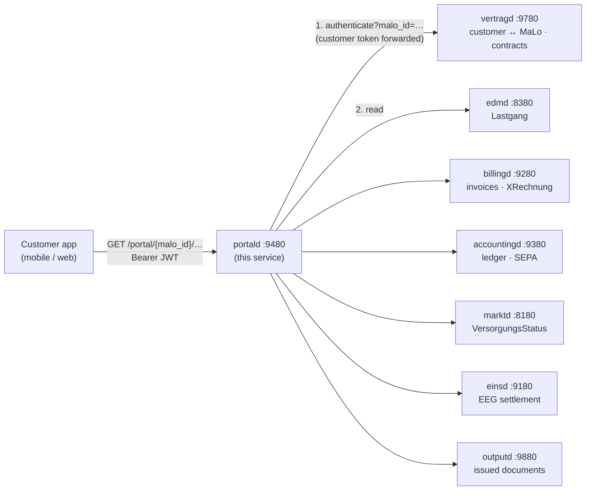

+++
title = "portald Operator Guide"
description = "Operator guide for portald, the customer-portal read-model gateway: one REST API over Lastgang, invoices, ledger and supply status, plus §41 EnWG self-service."
weight = 36
+++
`portald` is a **stateless read-model gateway** that aggregates the LF back-end
services into one customer-facing REST API, and proxies the § 41 EnWG
self-service writes to the services that own them.

**LF** (Lieferant) is the retail-supplier Marktrolle — the counterpart to the **NB**
(grid operator) and **MSB** (metering operator); see
[Party Roles](@/docs/architecture/domain-model.md#party-roles-marktrollen). Every route is
keyed on a **Marktlokation** (MaLo) — the delivery point, an 11-digit id, not a meter; see
[MaLo vs MeLo](@/docs/architecture/domain-model.md#malo-vs-melo-the-critical-distinction).
A **Lastgang** is the quarter-hourly consumption series behind `/lastgang`.



Port: **`:9480`**

---

## Design principles

- **Stateless.** No database, no cache, no session store. Every response is
  assembled from the authoritative services on the request path, so a portal
  reply can never be staler than they are and replicas need no coordination.
- **No domain policy.** Notice periods, tariff rules, IBAN validation and
  invoice rendering belong to the services that own them. `portald` validates
  request *shape* and relays their verdicts unchanged.
- **Degrade a tile, not the screen.** On the dashboard, a field is `null` when
  its upstream is unconfigured or has no data.

---

## Authorization

`portald` verifies no tokens and holds no customer↔MaLo map. It forwards the
customer's `Authorization: Bearer` header to
`vertragd GET /api/v1/kunden/authenticate?malo_id=…` and relays the verdict.
`vertragd` owns the OIDC verifier, the customer record and the mapping, so it is
the only place that can answer "may this identity read this delivery point" —
and a second verifier here could only ever disagree with it.

The service credential rides as `X-Api-Key`, never as a second `Authorization`
header: which identity `vertragd` sees must not depend on header ordering.

| `vertragd` answers | `portald` answers |
|---|---|
| `2xx` with a `kunden_id` | the request proceeds |
| `401` / no bearer / no customer profile | `401` |
| `403` | `403` |
| unreachable, `5xx`, or `2xx` without a `kunden_id` | `503` |

An authorization service that cannot answer is not an answer of yes.

**One gate, applied everywhere.** `auth::authorize` is the only way to obtain a
`PortalAuthCtx`, and every customer-scoped handler takes one by value — a route
that skips the check has no context to work with.
`tests/authorization_guard.rs` drives all 17 customer-scoped routes against a refusing
`vertragd` and fails if any of them answers with upstream data.

**Object ownership is checked too.** `GET …/invoices/{record_id}/download`
re-reads the billing record and compares its `malo_id` to the authorised one
before rendering. Authorising the path parameter alone would let any customer
stream any invoice in the tenant by id.

Starting without `vertragd_url` is refused unless `allow_insecure_no_auth = true`
is set explicitly — an omitted URL is a mistake, not a request to serve every
customer's data to every caller.

---

## Endpoints

All paths are prefixed `/api/v1/portal/{malo_id}`.

| Method | Path | Upstream |
|--------|------|----------|
| `GET` | `/dashboard` | `marktd` · `accountingd` · `billingd` · `edmd` — five reads, concurrently |
| `GET` | `/lastgang?from=&to=` | `edmd` — BO4E `Lastgang` array |
| `GET` | `/invoices?limit=&outcome=` | `billingd` — page size defaults to 24, clamped to 1–100 |
| `GET` | `/invoices/{record_id}/download` | `billingd` — the EN 16931 CII XML of the stored model (`GET /billing/{id}/xrechnung`). BT-24 declares plain EN 16931 for a retail invoice; only the B2G path declares the XRechnung CIUS |
| `GET` | `/dokumente?kind=&limit=` | `outputd` — the **document inbox**: what was issued and sent. `kind` is an allowlist (`INVOICE`, `MAHNUNG`, `PREISANPASSUNG`); page size defaults to 50, clamped to 1–200 |
| `GET` | `/dokumente/{document_id}` | `outputd` — the bytes as issued; opening it records the portal read receipt |
| `GET` | `/balance` | `accountingd` — open-items balance |
| `GET` | `/kontoauszug?from=&to=` | `accountingd` — account statement (§ 666 BGB); both bounds together scope it to a period and open it at that period's balance |
| `GET` | `/vorauszahlung` | `accountingd` — Abschlag schedule (§ 40 Abs. 1 EnWG) |
| `GET` | `/eeg` | `einsd` — plants + settlements |
| `GET` | `/versorgung` | `marktd` — supply state |
| `GET` | `/vertrag` | `vertragd` — active supply contract |
| `GET` | `/kuendigungsfrist` | `vertragd` — reachable end dates per reason |
| `POST` | `/tarifwechsel` | `vertragd` |
| `POST` | `/kuendigen` | `vertragd` |
| `PUT` | `/kontakt` | `vertragd` — GDPR Art. 16 |
| `PUT` | `/sepa` | `accountingd` |

`/health/live`, `/health/ready` and `/metrics` come from the service runner.

### Invoices and documents are two different lists

`/invoices` is what `billingd` **calculated** — drafts the risk gate is holding
included. `/dokumente` is what the customer was **sent**, byte for byte, with the
delivery evidence beside it. An inbox shows the second; opening a document there
records the read receipt a § 41f EnWG dispute asks about, which is more than
§ 126b BGB requires and exactly what is asked for afterwards.

Both are scoped twice: portald forwards the authorised MaLo, and `outputd`
refuses a document query that names neither a MaLo nor a Kundennummer.

---

## Dashboard

`GET /api/v1/portal/{malo_id}/dashboard` fetches from every configured upstream
concurrently and returns one object:

```json
{
  "malo_id": "51238696012",
  "tenant": "9900357000004",
  "kundentyp": "B2C",
  "versorgung":    { "lieferstatus": "Beliefert", "lf_mp_id": "9900357000004" },
  "balance":       { "balance_ct": -4500, "currency": "EUR" },
  "last_invoice":  [ { "id": "…", "total_brutto_eur": "126.14" } ],
  "meter_summary": { "arbeitsmenge_kwh": "312.5", "sparte": "STROM" },
  "vorauszahlung": { "betrag_ct": 8900, "naechste_faelligkeit": "2026-07-01" }
}
```

---

## Self-service writes (§ 41 EnWG)

### Notice periods live in `vertragd`

`portald` validates the date *format* and nothing else. Whether a `lieferende`
or `wirksamkeit` is reachable depends on the Vertragsart, on whether the
customer is a Haushaltskunde (§ 3 Nr. 57 EnWG) and on the reason —
§ 20 Abs. 1 StromGVV/GasGVV in the Grundversorgung, § 41b Abs. 5 EnWG on a move,
§ 41 Abs. 5 Satz 4 EnWG after a price change, § 309 Nr. 9 lit. c BGB on term
length. `vertragd` holds all of them.

A second, simpler rule here could only disagree with the one that decides, and
would reject terminations the contract allows. `vertragd` answers `422` with the
rule it applied, and that answer is relayed unchanged.

Call `GET /kuendigungsfrist` first to show the customer the reachable dates.

### SEPA mandates

`PUT /sepa` registers a mandate with `accountingd`, which validates the IBAN
(ISO 13616 mod-97) and the debtor address.

Two fields the caller does not supply. **`sequence_type`** — the scheme requires
a `FRST` collection before any `RCUR`, and the sequence is `accountingd`'s to
track across the mandate's life. **`mandatsref`** — derived here with a random
suffix (35 characters, the SEPA `MndtId` limit), so a customer correcting a
mistyped IBAN the same day gets a new mandate rather than reusing the reference
of the one being replaced.

`debtor_address` is optional until **15 November 2026**, when version 1.1 of the
2025 SEPA rulebooks ends the unstructured address and the schemes begin
requiring `town` + `country` on every collection.

---

## Configuration

```toml
# portald.toml
port   = 9480
tenant = "9900357000004"

# Required — the authorization authority for every route.
vertragd_url     = "http://vertragd:9780"
vertragd_api_key = "env:PORTALD_VERTRAGD_SERVICE_KEY"   # sent as X-Api-Key

edmd_url        = "http://edmd:8380"
billingd_url    = "http://billingd:9280"
accountingd_url = "http://accountingd:9380"
einsd_url       = "http://einsd:9180"
marktd_url      = "http://marktd:8180"
outputd_url     = "http://outputd:9880"

# Opaque service Bearer tokens; register each in the upstream's service keys.
# edmd_api_key        = "env:PORTALD_EDMD_SERVICE_KEY"
# billingd_api_key    = "env:PORTALD_BILLINGD_SERVICE_KEY"
# accountingd_api_key = "env:PORTALD_ACCOUNTINGD_SERVICE_KEY"
# einsd_api_key       = "env:PORTALD_EINSD_SERVICE_KEY"
# marktd_api_key      = "env:PORTALD_MARKTD_SERVICE_KEY"
# outputd_api_key     = "env:PORTALD_OUTPUTD_SERVICE_KEY"

# MP-ID a self-service SEPA mandate is registered under. Defaults to `tenant`;
# must match accountingd's `lf_mp_id`.
# lf_mp_id = "9900357000004"

# Local development only: serve portal routes without resolving ownership.
# allow_insecure_no_auth = true

[mcp]
api_key = "env:PORTALD_MCP_API_KEY"
```

There is deliberately no `oidc_issuer` / `oidc_audience`: `portald` verifies no
tokens, and a key suggesting otherwise would misstate where the trust boundary
is.

---

## Deployment

Stateless — no schema, no migrations. Deploy as many replicas as needed behind a
load balancer.

```yaml
# docker-compose.yml (excerpt)
portald:
  image: ghcr.io/hupe1980/mako-portald:latest
  ports: ["9480:9480"]
  volumes:
    - ./portald.toml:/etc/mako/portald.toml:ro
  environment:
    PORTALD_VERTRAGD_SERVICE_KEY: "${PORTALD_VERTRAGD_SERVICE_KEY}"
```

---

## MCP server

`/mcp` (Streamable HTTP), 8 read-only tools:

| Tool | Description |
|---|---|
| `get_dashboard` | Aggregated snapshot: supply status, latest invoice, balance |
| `get_lastgang` | Consumption time-series, optional ISO-8601 range |
| `get_invoices` | Billing history, newest first |
| `get_balance` | Open-items net balance (positive = owed) |
| `get_kontoauszug` | Full account statement, for dispute investigation |
| `get_vorauszahlung` | Abschlag amount, cycle, next due date |
| `get_eeg_status` | EEG/KWKG plants + settlements |
| `get_versorgung` | Supply status and effective date |

Prompts: `customer-overview`, `billing-dispute`, `eeg-foerderung-check`.

**This surface is operator-facing, not customer-facing.** Its tools take a
`malo_id` and carry no customer token, so they do not run through the
authorization gate the REST routes do — whoever can call `/mcp` can read every
customer in the tenant. That is the right shape for a customer-service agent and
the wrong one for a portal: gate it with `[mcp]`, keep it off the public
ingress, and never hand its credential to an end user.

---

## Informatorisches Unbundling (§ 6a EnWG)

An **LF-role** service. It reads `marktd` only for VersorgungsStatus — the LF's
own supply records — never NB grid topology or NB billing data. The unbundled NB
services (`netzbilanzd`, `sperrd`) are not reachable through it.

---

## Related services

| Service | Role |
|---------|------|
| [`vertragd`](@/docs/services/vertragd.md) | Authorization authority; contracts, Tarifwechsel, Kündigung |
| [`edmd`](@/docs/services/edmd.md) | Meter data |
| [`billingd`](@/docs/services/billingd.md) | Invoices + XRechnung rendering |
| [`accountingd`](@/docs/services/accountingd.md) | Account ledger + SEPA |
| [`einsd`](@/docs/services/einsd.md) | EEG/KWKG settlement |
| [`marktd`](@/docs/services/marktd.md) | Supply status + MaLo master data |
| [`outputd`](@/docs/services/outputd.md) | Issued documents + delivery evidence (the inbox) |
