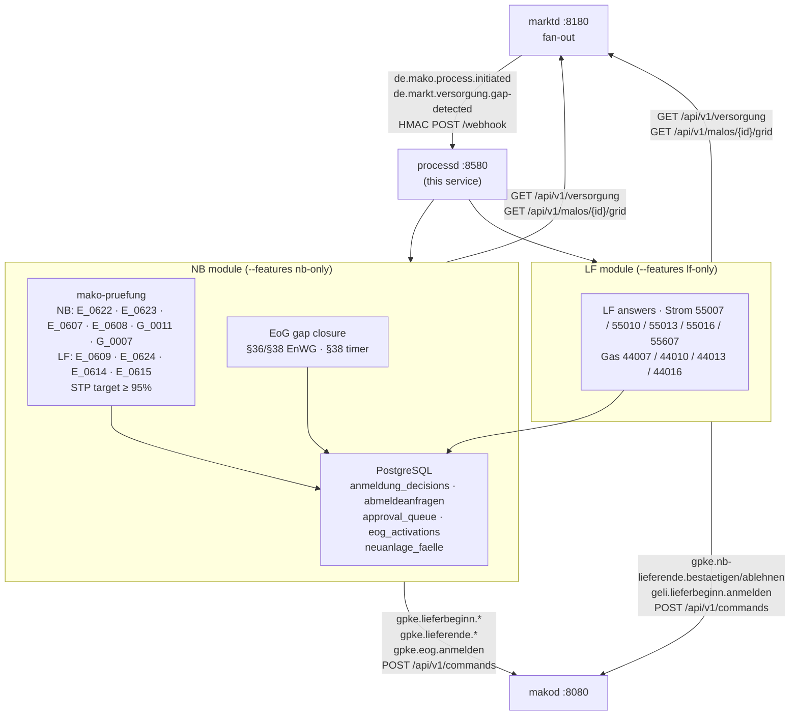
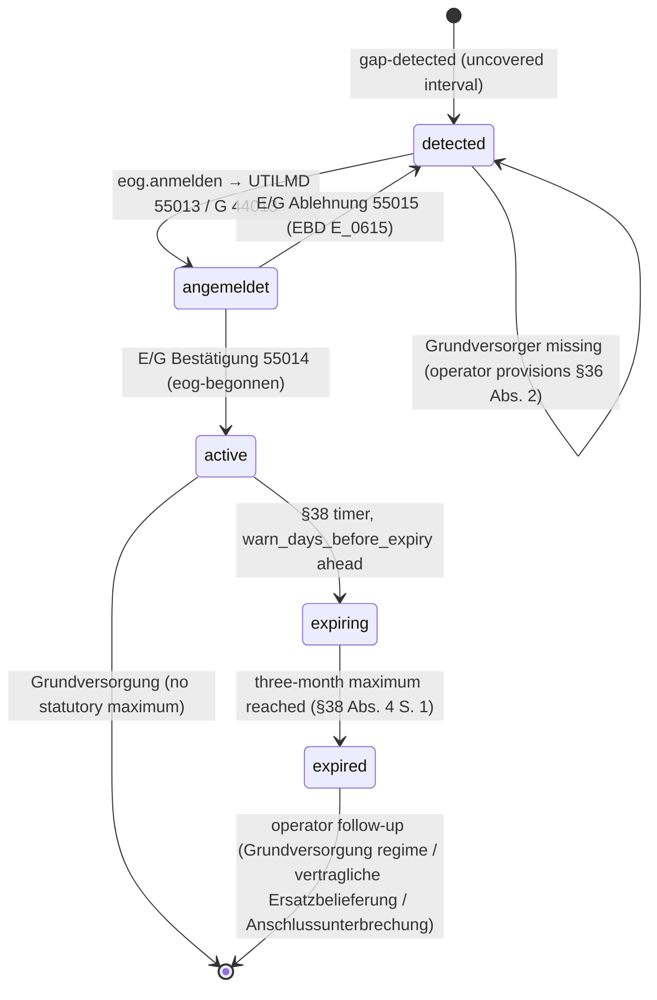

+++
title = "processd Operator Guide"
description = "Operator guide for processd, the process decision engine: NB Anmeldung straight-through processing, LF and MSB answers, role-gated binaries and Cedar ABAC."
weight = 23
+++
`processd` is the **process decision engine** — the service that automates
regulatory decisions within mandatory deadlines.

**What it decides, in plain terms.** German market communication (MaKo) runs on
EDIFACT messages between four roles: the **LF** (Lieferant, the supplier), the
**NB** (Netzbetreiber, the grid operator), the **MSB** (Messstellenbetreiber, the
metering operator) and the **BKV** (Bilanzkreisverantwortlicher, who answers for
a balancing circle). Each message carries a
[**Prüfidentifikator (PID)**](@/docs/architecture/domain-model.md#prufidentifikator-pid) — a five-digit code
naming the business case, so `55001` *is* „Anmeldung Lieferbeginn" — and each one
the recipient must answer carries a [**Frist**](@/docs/architecture/domain-model.md#frist-and-werktag), a
regulatory answer deadline counted in Werktage or fixed to a clock time. The
BNetzA publishes the decision itself as an
[**EBD**](@/docs/architecture/domain-model.md#ebd-entscheidungsbaumdiagramm) (Entscheidungsbaumdiagramm),
a numbered decision tree such as `E_0622` whose leaves are the Antwortcodes the
answer may state. `processd` walks those trees, dispatches the answer through
[`makod`](@/docs/services/makod.md) before the Frist, and queues anything the
tree cannot decide for an operator.

Every term above is defined once in the [glossary](@/docs/architecture/domain-model.md#glossary). The objects,
the roles and the identifier formats are the [domain model](@/docs/architecture/domain-model.md); which PID
belongs to which business process is the
[process map](@/docs/reference/processes.md).



---

## Port layout

```
┌────────────────────────────────────────────────────────────────────┐
│  processd  :8580                                                  │
│                                                                  │
│  POST /webhook              ← marktd CloudEvents (HMAC)          │
│  GET  /api/v1/decisions     ← NB STP audit log (OIDC+Cedar)     │
│  GET  /api/v1/queue         ← approval queue (every role)       │
│  POST /api/v1/queue/{id}/approve|reject  ← operator action       │
│  POST /api/v1/start-supply              ← LFN Strom bootstrap    │
│  POST /api/v1/start-supply-gas          ← LFN Gas 44001 bootstrap│
│  POST /api/v1/end-supply[-gas]          ← LF Lieferende bootstrap│
│  GET  /api/v1/eog           ← EoG gap-closure case log (§36/§38) │
│  GET  /api/v1/neuanlage     ← E_0608 case log                    │
│  PUT  /api/v1/neuanlage/{id}/identifikation                      │
│  GET  /health/live  /health/ready  /metrics                      │
│  POST|GET /mcp       ← MCP Streamable HTTP (2025-11-25)          │
└────────────────────────────────────────────────────────────────────┘
```

---

## Role isolation

`processd` is compiled with **feature flags** that gate which modules are included.
This ensures § 6a EnWG separation: an `nb-only` binary provably contains no LF PIDs.

```toml
[features]
role-lf-strom  = ["mako-pruefung/role-lf"]  # LF answers 55007/55010/55013/55016/55607
role-lf-gas    = ["mako-pruefung/role-lf"]  # LF Gas 44007 / 44010 / 44013 / 44016
role-nb-strom  = ["mako-pruefung/role-nb"]  # GPKE STP (55001, 55077, 55004, 55600/55601), EoG closure
role-nb-gas    = ["mako-pruefung/role-nb"]  # GeLi Gas An-/Abmeldung STP (44001, 44004)
role-msb       = ["mako-pruefung/role-msb"]   # REQOTE→QUOTES, §14a ORDRSP, MSB-answered MSB-Wechsel,
                                             # ESA Wertebestellung (35003/17007/17008/39002)

lf-only    = ["role-lf-strom", "role-lf-gas"]
nb-only    = ["role-nb-strom", "role-nb-gas"]
msb-only   = ["role-msb"]
integrated = ["role-lf-strom", "role-lf-gas", "role-nb-strom", "role-nb-gas", "role-msb"]
```

**PID 55016 „Kündigung" is not an NB process.** The *Anwendungsübersicht der
Prüfidentifikatoren 4.0* (lfd. Nr. 20030) has it going LFN → LFA, answered
55017/55018 by the Altlieferant under EBD `E_0614` — so it belongs to
`role-lf-strom`. Routing it into the NB module would make an `nb-only` binary
answer a supplier-role message, exactly what these feature flags exist to
prevent.

For §7 EnWG deployments (≥ 100k Netzkunden): BNetzA inspects the binary SHA to
confirm no cross-contamination. Use separate container images compiled with
`nb-only` and `lf-only` respectively.

---

## Authorization

Every REST route authenticates through the `Claims` extractor and then evaluates
one [Cedar](https://cedarpolicy.com) action against
`services/processd/policies/processd.cedar`. There is **no global auth
middleware**: a handler that does not name `Claims` is served to anyone, which is
why the mapping is pinned by a guard rather than by review.

| Route | Cedar action | Granted to |
|---|---|---|
| `GET /api/v1/decisions` | `read-decisions` | any caller of the tenant |
| `GET /api/v1/queue` | `read-queue` | any caller of the tenant |
| `GET /api/v1/eog` | `read-eog` | any caller of the tenant |
| `GET /api/v1/neuanlage` | `read-neuanlage` | any caller of the tenant |
| `POST /api/v1/queue/{id}/approve` · `/reject` | `decide-queue` | `NB`, `LF` or `MSB` — the role that owes the answer |
| `PUT /api/v1/neuanlage/{id}/identifikation` | `identify-neuanlage` | `NB` — it ends the `E_0608` Prüflauf |
| `POST /api/v1/start-supply[-gas]` · `end-supply[-gas]` | `initiate-supply` | `LF` — it commits the operator to a market position |
| `POST`/`GET /mcp` | `use-mcp` | any caller of the tenant |

The roles come from the `mako_roles` JWT claim and the tenant from
`mako_tenant`, which must equal the deployment's own. `POST /webhook` is outside
this table: it is authenticated by the `marktd` HMAC signature and its
timestamp, not by a token.

Cedar is default-deny, so the two directions fail differently: an action checked
in a handler but named in no policy is a permanent `403`, and an action granted
in the policy that no handler checks is a dead grant — an endpoint that lost its
check, or one that no longer exists. `services/processd/tests/authorization_guard.rs`
pins both, plus the `Claims` extractor on every route.

Omitting `[oidc]` disables authentication entirely and accepts every request
with synthetic dev-admin claims. That is a local-development mode; never ship it.

---

## NB module — Anmeldung STP

### Decision pipeline (`nb_module.rs`)

```text
de.mako.process.initiated
  ├─ Anmeldung (55001 verb. MaLo / 55077 erz. MaLo / 44001 Gas)
  │    → GET marktd /api/v1/versorgung/{malo_id}       → VersorgungsStatus
  │    → GET marktd /api/v1/malos/{malo_id}/grid       → MaloGridRecord
  │    → GET marktd /api/v1/partners/{lf_mp_id}        → partner_known
  │    → mako_pruefung::evaluate(…)             ← E_0622 / E_3005, the Vorprüfung
  │    → mako_pruefung::evaluate_lieferbeginn(…) ← E_0623 / E_3007, what is answered
  └─ Abmeldung (55004 Strom / 44004 Gas)
       → GET marktd /api/v1/versorgung/{malo_id}       → VersorgungsStatus
       → mako_pruefung::evaluate_abmeldung(…)

  Accept   → anmeldung_decisions(Accept, Zustimmungscode)
             [if auto_accept] → makod …bestaetigen (antwort_code, antwort_ebd)
             else             → approval_queue
  Reject   → anmeldung_decisions(Reject, Antwortcode)
             → makod …ablehnen (antwort_code, antwort_ebd, bemerkung)
  Escalate → anmeldung_decisions(Escalate) → approval_queue
  AnfrageErforderlich
           → INSERT abmeldeanfragen (the waiting AnmeldungAnfrage)
           → makod gpke.beendigung-zuordnung.anfragen  → UTILMD 55010 to the LFA
             …09:00 Uhr des 1. WT, or the LFA answers 55011/55012…
de.mako.abmeldeanfrage.beantwortet
           → take abmeldeanfragen → mako_pruefung::evaluate_lieferbeginn(…)
           → the Accept / Reject / Escalate paths above
```

**The Anmeldung is two trees, and on an assigned Marktlokation two phases.**
`E_0622` is a *Vorprüfung*: surviving it means only that the Anmeldung is not
**directly** refusable. GPKE Teil 2 § 2.1.2 SD Lieferbeginn Nr. 1 Prüfschritt 4
then asks whether the Marktlokation is already assigned at the Zuordnungsbeginn —
and if it is, the NB owes the incumbent LFA an **Anfrage zur Beendigung der
Zuordnung** (55010, Nr. 3) before it may answer the LFN at all, because `E_0623`
Prüfschritte 20–50 read that answer.

The waiting decision is persisted in `abmeldeanfragen` as the serialised
`AnmeldungAnfrage`, so phase two replays the same pure evaluation with one more
fact. The row is written **before** the Anfrage goes out — a loopback answer can
arrive in milliseconds, and one that finds no waiting row would leave the
Anmeldung unanswered past its own 11:00 Frist. Resolving it is a single
`UPDATE … WHERE resolved_at IS NULL`, because the LFA's answer and the 09:00
lapse race by design and exactly one of them may answer the LFN.

**Silence releases the Marktlokation.** „Verstreicht die Frist, ohne dass eine
Antwort beim NB eingeht, gilt dies als Bestätigung nach Fall a). Nach Ablauf der
Frist eingehende Antworten sind für den Fortlauf dieses Prozesses unerheblich."
A Widerspruch that is **not** `A30` / `A41` („bereits abgemeldet") refuses the
Anmeldung with `E_0623` `A50` / `A57` — `Z35` in Gas — outcomes an NB that never
sends an Anfrage cannot reach at all. Those two codes oblige the Ablehnung to
carry a second `SG4 STS`: `STS+Z35` restates the LFA's own `E_0624` code, which
is GPKE Teil 2 § 2.1.2 Nr. 6's „der NB gibt zusätzlich den Grund der Ablehnung
des LFA an". `processd` puts it on the `ablehnen` command and `makod` refuses to
render the message without it.

Which Geschäftsvorfall an Anmeldung is, is **on the wire**: `SG4 STS+7` DE 9013
element 3 carries `ZW0` (1 — die ganze Marktlokation), `ZW1` (2 — eine
bestehende Tranche) or `ZW2` (3 — eine neu zu bildende Tranche), and the AHB
marks exactly those three on 55077/55078. `E_0622` Prüfschritte 300/310 send the
three to different subtrees, so a message carrying none of them escalates rather
than being read as the common case.

Geschäftsvorfall 3 decides on **arithmetic**, not on one LFA's answer. A
tranchierte Marktlokation is held by several LFA at once, so the NB asks all of
them („im Fall von Geschäftsvorfall 3 allen LFA"), and Prüfschritte 500–540 count
what came free: at least one release (510 → `A53`), enough percentage (520 →
`A54`), and whether an unassigned share is left in the NB's own Bilanzkreis on a
direktvermarktungspflichtige Marktlokation (530/540 → `A55` against `A56`, the
trigger for „Herstellung einer 100 % LF-Zuordnung"). Four of the eight
Antwortcodes the tree publishes exist only here.

Prüfschritt 540 is not cosmetic. §20 Satz 1 Nr. 3 EEG pays the Marktprämie only
while the Strom sits in a Bilanz- oder Unterbilanzkreis holding nothing but
direkt vermarkteten EE-Strom, so a residual share in the NB's own Bilanzkreis
costs a direktvermarktungspflichtige plant its claim.

The fact is register data — installed capacity against the §21 Abs. 1 Satz 1
Nr. 1 ceiling of 100 kW — and `processd` reads it from `einsd` on the same call
that answers the `E_0622` Vorlauffrist. A register that cannot answer it (a plant
commissioned before 2016 falls under an EEG version outside mako's corpus) leaves
`processd` with no `TranchenLage`, and `E_0623` escalates rather than choosing
between `A55` and `A56`.

The share the LFN registers rides the Produktpaket beside the Bilanzkreis —
`SG8` Produkt-Code `9991000002090` with the Produkteigenschaft „prozentuale
Aufteilung", which the AHB makes Muss on a Geschäftsvorfall 3. The same product
also carries an Aufteilungsfaktor and an Aufteilung auf Technische Ressourcen;
neither is a share Prüfschritte 510–530 can add up, so an Anmeldung stating one
escalates instead of being measured against a number that means something else.

`marktd` projects the assignments as a list with a share per LFA, and the waiting
Anmeldung collects **one answer per Tranchen-LFA** before deciding — resolving on
the first to arrive would settle a tranchierte Marktlokation on one share of it.
A lapsed 09:00 Frist resolves it whatever is outstanding: silence is a Zustimmung.
An LFA answering with a code `E_0624` does not publish as an Ablehnung escalates
the whole Geschäftsvorfall, because that share is then neither free nor held.

**Three trees, three alphabets.** `E_0622` Prüfschritt 10 splits Strom into two
branches that share no Antwortcode, and Gas answers from a different Codeliste:

| Anwendungsfall | Tree | „andere Anmeldung in Bearbeitung" | Fristüberschreitung | Zustimmung |
|---|---|---|---|---|
| Strom, verbrauchende / ruhende MaLo | `E_0622` 15–70 | `A06` | `A07` | `A51` (`E_0623`) |
| Strom, erzeugende MaLo / Tranche | `E_0622` 220–830 | `A45` | `A34`/`A28`/`A29`/`A30`/`A32`/`A35`/`A44` | `A58` (`E_0623`) |
| Gas | `E_3005` / `G_0011` | `ZC5` | `E17` | `E15` (`G_0012`) |
| Abmeldung Strom, verbrauchende / ruhende MaLo | `E_0607` 10–140 | — | `A02` | `A11` |
| Abmeldung Strom, erzeugende MaLo / Tranche | `E_0607` 500–620 | — | `A22` (`A21` Datum) | `A27` |
| Abmeldung Gas | `E_3019` / `G_0007` | — | `E17` | `E15` |

Putting `A06` on a 44003 is not a wrong reason — it is a code the Gas Codeliste
does not define. Every code is resolved through `mako_pruefung::codes` against
the tree that publishes it, `RejectReason` can only be built from a resolved
entry, and `makod` re-checks it at the command boundary where the published
**Cluster decides the response PID**.

**A Bestätigung carries a code too.** `SG4 STS+E01` is Muss on every
Antwortnachricht: `E_0622` is a *Vorprüfung* whose codes are all Ablehnungen, and
a message that survives it is confirmed out of `E_0623`. `NbEntscheidung::Accept`
therefore carries `A51` / `A58` / `E15`.

### `mako_pruefung::nb::evaluate` — the Anmeldung

**Strom, verbrauchende / ruhende Marktlokation** (`E_0622` Prüfschritte 15–70):

| Prüfschritt | Rule | On failure |
|---|------|------------|
| — | `MaloGridRecord` exists for the MaLo | `Escalate` (a mako data gap, not a ground to refuse) |
| 15 | Vorlauffrist — one full Werktag between receipt and Zuordnungsbeginn (LFW24, all Transaktionsgründe) | `Reject A07` |
| 30 | MaLo participates in MaKo | `Reject A02` |
| 60 | Zuordnungsermächtigung: Bilanzierungsgebiet matches, LF in the partner directory | `Reject A05` |
| 70 | No other Anmeldung in Bearbeitung | `Reject A06` |

A **ruhende** Marktlokation is not refused: Prüfschritt 30's own Hinweis names
only stillgelegte Marktlokationen and the Modell-2-Zuordnung, and Prüfschritte
16–28 exist to check a ruhende one.

**Strom, erzeugende Marktlokation** (Prüfschritte 220–830) uses `A45` / `A25` for
the same two questions and then picks between the **six** Vorlauffristen GPKE
Teil 2 § 2.1.1 publishes, keyed on `(Geschäftsvorfall, bestehende, angemeldete
Veräußerungsform)`. The *angemeldete* one is `SG10 CCI+Z22` on the wire; the
*bestehende* one and the Ausfallvergütung flag come from `einsd`
(`GET /api/v1/anlagen/by-malo/{malo_id}/veraeusserungsform`, configured as
`[nb] einsd_url`) — wire code `Z90` covers both the uneingeschränkte
Einspeisevergütung and the Ausfallvergütung, whose Fristen differ by a month
versus five Werktage. The same call answers `E_0623` Prüfschritt 540. A missing
fact escalates and is named; the statutory anchor for the Monatserster rule is
**§ 21b Abs. 1 Satz 2 EEG 2023**, not § 10c.

**Gas** (`G_0011`) runs the `A03`/`A04`/`A16`/`A17` identification checks first,
as the AHB requires, then `E17` for a Fristüberschreitung, `E13` for a
Bilanzierungsproblem and `ZC5` / `Z08` for a conflicting or duplicate Anmeldung.

### `mako_pruefung::nb::evaluate_neuanlage` — the Neuanlage, `E_0608`

Inbound **55600** / **55601**: a Lieferant registers a Marktlokation being
commissioned for the first time. The tree has a **third outcome** — Prüfschritte
110 / 590 loop, so a Marktlokation the NB cannot yet identify is re-checked
**daily for 60 Werktage** and may only then be refused `A07` / `A16`.

`processd` therefore keeps a case log (`neuanlage_faelle`) and a daily worker
rather than deciding once:

| Endpoint | Purpose |
|---|---|
| `GET /api/v1/neuanlage?status=offen` | The Prüflauf view — each row carries the `letzter_pruefungstag` a refusal only becomes admissible after, and the `pruefungen` count that evidences the daily attempts |
| `PUT /api/v1/neuanlage/{id}/identifikation` | The MaLo-ID the NB matched from its NIS/GIS. A Neuanlage carries address and device data, not an ID, so this is where the identification arrives — the next pass then walks the tree with it |

The two branches share no code (`A01`–`A09` verbrauchend, `A10`–`A19`
erzeugend), and the Vorlauffrist is measured against the **Übertragungstag**, so
a case re-evaluated on day 40 reaches the same verdict it did on day one.

### `mako_pruefung::nb::evaluate_abmeldung` — the Abmeldung, `E_0607` / `E_3019`

Inbound **55004** (Strom) / **44004** (Gas): the supplier ends the assignment
and the NB answers 55005/55006 (44005/44006).

Prüfschritt 10 („verbrauchende oder ruhende Marktlokation?") splits Strom into
**two branches that share no Antwortcode**, including the Zustimmung. Every
question is asked twice, once per branch:

| Prüfschritt | Rule | verbrauchend / ruhend | erzeugend |
|---|---|---|---|
| — | The MaLo is known to this NB, and the requesting LF holds an assignment — or a Lieferende at this very date is already settled, which is the state Prüfschritt 100 exists to recognise | `Escalate` | `Escalate` |
| 50 / 500+520 | Vorlauffrist — verbrauchend: one full Werktag between receipt and Zuordnungsende; erzeugend: the Zuordnungsende must be a Monatserster (`A21`) and lie one month ahead (`A22`), § 21b Abs. 1 EEG 2023 | `A02` | `A21` / `A22` |
| 90 / 570 | Eine Aufhebung einer zukünftigen Zuordnung (`ZH2`) nennt den Zeitpunkt, den der NB im Lieferbeginn bestätigt hat | `A06` | `A23` |
| 80 | „Ende der ESV ohne Folgelieferung" (`Z41`) setzt eine E/G voraus, die innerhalb von 3 Monaten vor dem Endezeitpunkt begann | `A05` | — |
| 100–130 / 580–610 | Kein bereits bestätigtes Lieferende zum selben Datum | `A09` | `A25` |
| 140 / 620 | — | Zustimmung `A11` | Zustimmung `A27` |

Gas has no such split: `G_0007` publishes one code space (`E17` Vorlauffrist,
`Z08` bereits bestätigt, `E15` Zustimmung).

**What is not decided here.** Prüfschritte 10–30 (Kundenanlagen-Herauslösung)
turn on whether the Marktlokation is a „ruhende Marktlokation" of a Kundenanlage
(§ 20 Abs. 1d EnWG / § 10c EEG), which the projection does not record, so `A01`
is catalogued and unreachable. Prüfschritt 130 / 610 asks about the *already
confirmed* Abmeldung's Transaktionsgrund — a fact about an earlier message —
where `A10` / `A26` and „confirm" are both live outcomes, so it escalates rather
than guess. Escalation is the § 20 Abs. 1 Satz 1 EnWG-safe direction: an unfounded Ablehnung
keeps a customer bound to a supplier they have left.

### STP rate targets

`processd` targets ≥ 95 % straight-through processing on a **verbrauchende**
Anmeldung. The `malo_grid` record is a prerequisite — a missing one escalates —
so STP improves markedly once it is provisioned. An **erzeugende** Marktlokation additionally needs
`[nb] einsd_url`: `E_0622` chooses between six published Vorlauffristen from the
*bestehende* Veräußerungsform, and `E_0623` Prüfschritt 540 needs the
Direktvermarktungspflicht — both register data, neither on the wire. A
deployment without it escalates every 55077 — the § 20 Abs. 1 Satz 1 EnWG-safe outcome, since
none of the six is a defensible default.

Grid records are the NB’s own grid topology — **not** from MaStR. Provision them via
marktd’s NB-role `PUT /api/v1/malos/{malo_id}/grid` endpoint (manual / ERP provisioning).

Monitor via `GET /api/v1/decisions` or the `get_stp_rate` MCP tool.

### `[nb] auto_accept`

Set `auto_accept = false` (the default; `PROCESSD_NB__AUTO_ACCEPT` in the
environment) until you have verified:

1. Grid record coverage for your MaLo portfolio (`GET /api/v1/malos/{id}/grid`)
2. Partner directory populated for all expected LF MP-IDs
3. At least one manual review cycle confirmed correct ERC codes

### Affiliate guard — § 20 Abs. 1 Satz 1 EnWG

When `processd` is deployed in an **integrated NB+LF utility** (§6b EnWG),
auto-acceptance is **always blocked** for Anmeldungen where the requesting LF
is an **affiliate** of the NB operator. This implements the § 20 Abs. 1 Satz 1 EnWG
Diskriminierungsfreiheitspflicht non-discrimination obligation.

It applies to Abmeldungen as well as Anmeldungen — an affiliate must not get a
faster automatic path in either direction.

Detection logic:

```text
initiating LF MP-ID == [identity] own_mp_id  →  initiator_is_affiliate = true
                                                auto_accept overridden to false
                                                → approval_queue (operator review)
```

The operator's own MP-ID comes from `processd.toml`:

```toml
[identity]
own_mp_id = "9900357000004"   # BDEW 99… / DVGW 98…; must match makod's primary party
```

Startup logs the coding authority derived from it (293 = BDEW, 332 = DVGW) and
warns on a GS1 GLN, because a mismatched prefix makes every parity comparison
fail silently.

`obsd` records `initiator_is_affiliate = true` on the resulting `ProcessProjection`
and the KPI report exposes the parity delta for **BNetzA audit evidence**.
See [the obsd Gleichbehandlung parity report](@/docs/services/obsd.md#ss-7a-abs-5-enwg-gleichbehandlung-parity)
for query examples.

### Selbstzahler — the Lieferantenwechsel carve-out

GPKE Teil 1 (BK6-24-174 Anlage 1a), Vorbemerkung: „Ist der Letztverbraucher selbst
Netznutzer, so tritt er in die Rolle des Lieferanten i.S. dieser Prozessbeschreibung
[…]. **Eine Ausnahme bilden die Meldungen des Lieferanten im Rahmen des
Lieferantenwechsels.**"

A Selbstzahler („Netznutzer ohne All-Inklusiv-Vertrag") is an ordinary LF in every
other GPKE process, so nothing routes differently. But when a Wechsel displaces one,
the incumbent is not acting in the LF role the automation assumes. `processd` reads
the Netznutzungsvertrag in force the day before the requested Zuordnungsbeginn
(`GET /api/v1/nb-contracts/by-malo/{malo_id}?on=`) and, when its `netznutzer_typ` is
`LETZTVERBRAUCHER`, holds the decision for the operator instead of dispatching a
Bestätigung:

```text
transaktionsgrund == "E03" (Wechsel)
  ∧ incumbent netznutzer_typ == LETZTVERBRAUCHER
  → approval_queue (operator review), Antwortfrist attached
```

Only the Wechsel Transaktionsgrund triggers it. An Einzug (`E01`) or Einzug in
Neuanlage (`E02`) on the same MaLo stays on the automated path, and the lookup does
not run at all for those — widening the hold would take an industrial customer's
whole MaLo portfolio off automation for no regulatory reason.

---

## NB module — EoG gap closure (§36/§38 EnWG)

Every consuming Marktlokation must be assigned to a Bilanzkreis at all times
(GPKE Teil 2 Kap. 2.3). The EoG module closes supply gaps automatically:

```
de.markt.versorgung.gap-detected           (marktd: an interval no supplier
  │                                         covers — a Lieferende the successor
  │                                         does not follow on, or a Fall-b
  │                                         Bestätigung 55002/55078/44002)
  ├─ record case in eog_activations         (idempotent per MaLo)
  ├─ [eog.auto_activate] GET /api/v1/grundversorger/{nb_mp_id}?sparte=…
  │    └─ found → Strom: gpke.eog.anmelden → UTILMD 55013;
  │             Gas:   geli.eog.anmelden → UTILMD G 44013 → makod → E/G
  │       (Zuordnungsbeginn = day after Lieferende — retroactive allowed)
  │    └─ missing → case stays `detected`; operator provisions the
  │       §36 Abs. 2 Feststellung and re-triggers
  └─ de.markt.versorgung.eog-begonnen → case `active`
       (eog_art = Ersatz-/Grundversorgung as classified by the E/G in 55014;
        eog_seit = Zuordnungsbeginn)
```

The case lifecycle — the states exposed by `GET /api/v1/eog?status=…`:



**§38 timer.** A daily worker enforces the three-month maximum
(§38 Abs. 4 S. 1 EnWG, calendar months from `eog_seit` — not from detection):
`warn_days_before_expiry` days ahead the case turns `expiring`, at expiry
`expired`; both emit `de.markt.versorgung.ersatz-auslaufend` to
`eog.notify_webhook_url`. `Grundversorgung` cases have no statutory maximum.
After expiry the follow-up is operator-driven: Haushaltskunden transition into
Grundversorgung automatically **without a market message** (the E/G's billing
switches regime); otherwise the NB secures the Bilanzkreis (vertragliche
Ersatzbelieferung, STS `E06`) or interrupts the Anschlussnutzung.

**Operator surface.** `GET /api/v1/eog?status=detected|angemeldet|active|expiring|expired`.

```toml
[eog]
auto_activate            = true       # default false — record-only
default_transaktionsgrund = "ZT6"     # SG4 STS DE9013 for automatic Anmeldungen
warn_days_before_expiry  = 14
notify_webhook_url       = "https://erp.example/hooks/eog"
```

---

## LF module — answering what the market asks a supplier

Nine inbound processes, each with its own Entscheidungsbaum, its own Codeliste
and its own Antwortfrist:

| Sparte | Inbound | Process | EBD | Answers | Frist |
|---|---|---|---|---|---|
| Strom | 55007 | Lieferende von NB an LF | `E_0609` | 55008 / 55009 | 05:00 Uhr des 1. WT nach dem ÜT |
| Strom | 55010 | Beendigung der Zuordnung | `E_0624` | 55011 / 55012 | 09:00 Uhr des 1. WT nach dem ÜT |
| Strom | 55013 | Anmeldung E/G (§ 36 / § 38 EnWG) | `E_0615` | 55014 / 55015 | **15:00 Uhr am ÜT**, sonst 15:00 Uhr des 1. WT |
| Strom | 55016 | Kündigung (LFN → LFA) | `E_0614` | 55017 / 55018 | Ablauf des 1. WT nach dem ÜT |
| Strom | 55607 | Ankündigung Zuordnung LF (erz. MaLo / Tranche) | `E_0603`–`E_0606` | 55608 / 55609 | **15:00 Uhr am ÜT**, sonst 15:00 Uhr des 1. WT |
| Gas | 44007 | Lieferende von NB an LF | `E_3002` | 44008 / 44009 | Ablauf des 3. WT |
| Gas | 44010 | Beendigung der Zuordnung | `E_3020` | 44011 / 44012 | Ablauf des 3. WT |
| Gas | 44013 | Anmeldung E/G | `E_3008` | 44014 / 44015 | Ablauf des 2. WT |
| Gas | 44016 | Kündigung beim Altlieferanten | `E_3001` | 44017 / 44018 | Ablauf des 3. WT |

GPKE Teil 2 states two windows for the two „am ÜT" rows, selected by whether the
Zuordnungsbeginn lies in the future (§ 2.3.2.2 resp. § 2.4.2.2). Keyed on the
Prüfidentifikator alone the table cannot see which applies, so `mako-fristen`
publishes the tighter same-day instant — except where that instant is already
behind the message, after the cut-off or on a non-Werktag, in which case it rolls
to 15:00 on the next Werktag. A deadline in the past reports a breach against a
party that never had a window.

The same business process carries the same command name in both Sparten —
`{gpke,geli}.nb-lieferende.*`, `{gpke,geli}.beendigung-zuordnung.*`,
`{gpke,geli}.kuendigung.*` — and one walk decides both, from one
`de.mako.process.initiated` contract.

**55607 is the one where silence is not a lapsed Frist.** GPKE Teil 2 § 2.4.2.2
Nr. 3 has the NB assign the supplier to the erzeugende Marktlokation „aufgrund
fehlender Antwort" anyway, using whichever Bilanzkreis it has on file. The
substance of the answer is that **Bilanzkreis**, not the code: `A01` and `A99`
are the only two the four trees publish. Which BK is admissible is the BKV's
grant — MaBiS § 10.2.1 issues the Zuordnungsermächtigung „je ZRT, BG, BK und
LF" — so `[[lf.bilanzkreise]]` is keyed on the Bilanzierungsgebiet, and a regime
with several authorised BKs is a choice the supplier makes, not a default.

Which of the four Anwendungsfälle a 55607 belongs to is **on the wire**, not
inferred: `SG4 STS+7` DE 9013 element 3 carries `ZW8` (Fall 1) to `ZX1`
(Fall 4), and UTILMD AHB Strom 2.2 Bedingungen [161]–[164] map the four onto
`E_0603`–`E_0606` in DE 1131 of the answer. That is a *different code space*
from the `ZW3`/`ZW4`/`ZW5`/`ZAP` Lokationsart every other LF-answered Vorgang
puts in the same element — and from the `ZW0`/`ZW1`/`ZW2` Geschäftsvorfall the
Anmeldung erzeugende Marktlokation puts there. One element, three code spaces,
and the Prüfidentifikator decides which one applies.

The Bilanzkreis itself rides the Produktpaket — `SG8 SEQ+Z79` with Produkt-Code
`9991000002082`, Merkmalswert in `SG10 CAV+ZV4` — because the UTILMD AHB admits
`SG4 FTX+ACB` on the **55609 Ablehnung** only (Bedingung [48]).

Two of the questions the trees ask decide the answer before any contract data is
consulted, and both come from the message itself:

- **Which object is the Vorgang about?** `SG4 STS+7` DE 9013 element 3 —
  `ZW3` erzeugende, `ZW4` verbrauchende, `ZW5` Tranche, `ZAP` ruhende
  Marktlokation. The two halves of `E_0609` and `E_0624` answer from *different
  code ranges*, so a missing Ergänzung is an escalation rather than a default.
  On 55077 the same element carries the Geschäftsvorfall instead, and the PID
  is what says the Marktlokation is erzeugend.
- **Was the Vorlauffrist kept?** (`E_0609` Prüfschritt 40, `E_3002` `E17`.)
  Arithmetic on the Übertragungstag and the Zuordnungsende, resolved by
  `mako_fristen::abmeldung` against GPKE Teil 2 § 2.5.2 Nr. 1. The window is a
  calendar month for EEG-Marktlokationen and the day before the last Werktag for
  everything else, so an erzeugende Marktlokation escalates unless the deployment
  can say which it is.

### How a decision is made

`mako-pruefung` walks the published Prüfschritte. `processd` assembles the facts
they ask about and routes the outcome:

```
de.mako.process.initiated (an answerable PID)
  → LfAnfrage from the CloudEvent — Transaktionsgrund and its Ergänzung
    (ZW3/ZW4/ZW5/ZAP, which selects the tree's branch), Termin, ÜT
  → LfVertragslage from marktd (supply state) + vertragd (contract state)
  → pruefe_*(…)
      Antwort    → makod command carrying the Antwortcode and its EBD
      Eskalation → approval_queue, naming the Prüfschritt it stopped at
```

The Antwortcode's published **Cluster** selects the answer PID, not the command
name: `A36` „Vertragsverhältnis wurde beendet" rides 55011, `A35` „Es besteht
eine Vertragsbindung" rides 55012.

### Contract facts

Half of what the trees ask is about a contract, not about supply state:

| Prüfschritt | Question | Source |
|---|---|---|
| `E_0624` 50 | Ist der Kunde aus der Anfrage identisch mit dem Kunden beim LFA? | `vertragd` |
| `E_0624` 60 | Hat der LFA Informationen, dass sein Kunde nicht ausgezogen ist? | `vertragd` |
| `E_0624` 90 / 220 | Bleibt das Vertragsverhältnis zum Folgetag bestehen? | `vertragd` — `kuendigung_zum` **and** `vertragsende`, whichever cuts first |
| `E_0614` 40 / 50 / 80 | Wurde der Vertrag bereits gekündigt, und zu welchem Datum? | `vertragd` — `kuendigung_zum` **only** |
| `E_0614` 70 / 580 | Ist der Vertrag zum Kündigungstermin kündbar? | `vertragd` — `naechstmoeglicher_kuendigungstermin ≤ Termin` |
| `E_0614` 500 | Liegt zu dem genannten Objekt ein Vertrag vor? | `vertragd` — a contract row, not its absence |
| `E_0609` 40 | Wurde die Vorlauffrist eingehalten? | `mako-fristen` |
| `E_0624` 5 | Ging die Anfrage bis 07:00 Uhr des nächsten WT ein? | `SG4 DTM+154` on the message |
| `E_0624` 50 | Ist der Kunde aus der Anfrage identisch mit dem Kunden beim LFA? | `SG12 NAD+Z09` on the message, compared by `vertragd` |
| `E_0624` 20 | Besteht zum Folgetag noch eine Zuordnung? | `marktd` |
| `E_0615` 20 | Liegt die MaLo im Grundversorgungsgebiet des Empfängers? | `[lf] grundversorgungs_netzgebiete` |

**Prüfschritt 50 compares names, not strings.** `processd` forwards the
`SG12 NAD+Z09` „Kunde des LF" as `?kunde=` and `vertragd` matches it against the
contract holder on the **set** of normalised tokens. A shared Nachname and
nothing else — a family member moving in — is `Unklar` and escalates, because
`A32` refuses the Einzug and `A34` releases the Marktlokation. See
[vertragd](@/docs/services/vertragd.md) for the matching rule.

**`vertragd`'s three dates are three different facts.** `kuendigung_zum` records
that somebody *has* terminated; `vertragsende` is the agreed Laufzeitende, which
nobody terminated; `naechstmoeglicher_kuendigungstermin` is when notice could
next take effect. The table above says which Prüfschritt reads which.

Set `[vertragd] url` to answer them. Without it those facts are
`Bekannt::Unbekannt` and any decision reaching one escalates to an operator —
deliberately: a supplier with no contract database cannot claim a
Vertragsbindung, and must not agree to release the customer instead.

`auto_respond = false` means *an operator decides*, not *nobody answers*: the
walk still runs and its outcome is queued with the Antwortfrist attached.

### The E/G Anmeldung has its own switch

`E_0615` / `E_3008` is the only **Anmeldung** a supplier is asked to check, and
the only one whose Zustimmung accepts a statutory duty — § 36 / § 38 EnWG — for
a customer this supplier has no contract with. Prüfschritt 20 asks whether the
Marktlokation lies in the recipient's Grundversorgungsgebiet, which no BDEW
process transports: `[lf] grundversorgungs_netzgebiete` lists the Netzbetreiber
MP-IDs whose area this supplier serves, and an empty list escalates every 55013
with its 15:00-Uhr Frist attached rather than answering from an absent record.

Dispatch needs a second opt-in, `[lf] eog_auto_respond` (default `false`), on
top of `auto_respond`. The walk runs either way, so the Frist is always
visible.

A **Zustimmung** additionally needs two facts no tree produces and the AHB marks
Muss on a 55014: the Versorgungsart (`SG10 CCI+Z36` — `ZC9`, `ZD0`, `ZE3` and no
more, since `ZZD` Übergangsversorgung is a Transaktionsgrund) from
`[lf] eog_versorgungsart`, and the Bilanzkreis (`SG8 SEQ+Z79`) from
`[[lf.bilanzkreise]]`. Missing either, the answer is queued with the missing
field named.

### Approval queue

The queue is shared by **every** compiled role: the NB queues escalated and held-back
Anmeldungen, the MSB escalated MSB-Wechsel and § 14a Steuerungsaufträge, the LF its GPKE
answers. Each entry stores the `makod` command to dispatch on approve and on reject,
resolved from the trigger PID at enqueue time.

`expires_at` is the **business** answer Frist of that process, less headroom:

| Trigger | Frist | Source |
|---|---|---|
| GPKE Anmeldung 55001 / 55077 | 11:00 Uhr des 1. WT nach dem ÜT | BK6-24-174 Teil 2, SD Lieferbeginn 5/6 |
| GPKE Abmeldung 55004 | 06:00 Uhr des 1. WT nach dem ÜT | BK6-24-174 Teil 2, SD Lieferende von LF an NB 2/3 |
| GPKE LF answer 55007 | 05:00 Uhr des 1. WT nach dem ÜT | BK6-24-174 Teil 2, SD Lieferende von NB an LF 2 |
| GPKE LFA answer 55010 | 09:00 Uhr des 1. WT nach dem ÜT | BK6-24-174 Teil 2, SD Lieferbeginn 4 |
| GPKE LFA answer 55016 | Ablauf des 1. WT nach dem ÜT | BK6-24-174 Teil 2, SD Kündigung 2 |
| GeLi Gas LF answer 44007 | Ablauf des 3. WT | AWH GeLi Gas 2.0 Kap. 2.3.2 Nr. 2 |
| GeLi Gas LFA answer 44010 | Ablauf des 3. WT | AWH GeLi Gas 2.0 Kap. 2.5.2 Nr. 4 |
| GeLi Gas LFA answer 44016 | Ablauf des 3. WT | GeLi Gas 3.0 Kap. 3.1 |
| GeLi Gas Anmeldung 44001 | Ablauf des 4. WT nach Eingang | BK7-24-01-009 Kap. 3.2.3 |
| GeLi Gas Abmeldung 44004 | Ablauf des 3. WT nach Eingang | BK7-24-01-009 Kap. 3.2.2 |
| WiM MSB-Wechsel 55039 / 55042 / 55051 / 55168 | 3 / 5 / 7 / 1 WT | WiM Strom Teil 1 |
| GPKE Neuanlage 55600 / 55601 | 00:00 Uhr des 61. WT nach dem ÜT | BK6-24-174 Teil 2 § 2.2.2 (60 WT täglicher Prüflauf, `E_0608`) |
| GPKE Sperr-/Entsperrauftrag 17115 / 17117 / 39000 | spätester ÜT ist der 1. WT nach dem ÜT | BK6-24-174 Teil 2 §§ 3.5.1.2 / 3.5.2.2 / 3.5.3.2 Nr. 2 |
| GPKE Anfrage Sperrung an den MSB 17116 | 3. WT nach dem ÜT — Fristverstreichen gilt als Zustimmung | BK6-24-174 Teil 2 § 3.5.1.2 Nr. 4 |
| GPKE Teil 4 Stammdaten-Rückmeldung 55109 / 55230 / 55557 / 55639–55643 / 55693 | 2. WT nach dem ÜT | BK6-22-024 Anlage 1d (GPKE Teil 4) §§ 1.4.3 / 1.4.4 Nr. 2 |
| GPKE Teil 2 Bearbeitungsstand Abrechnungsdaten 55156 / 55220 / 55673 | 2. WT nach dem ÜT | BK6-24-174 Teil 2 §§ 3.1.1.2 / 3.1.2.2 / 3.1.3.2 |

The 45-minute APERAK window on the same message is a separate clock and is `makod`'s to
answer.

A background task runs every 60 s and sets `status = Expired` for stale entries. It is
deliberately **not** role-gated, since every role build can enqueue.

`decided_by` records the `sub` of the principal who approved or rejected (Gleichbehandlung
evidence and the GoBD trail both have to say *who* decided).

**Operator workflow:**
```
GET /api/v1/queue                     → list Pending entries (review before expires_at)
POST /api/v1/queue/{id}/approve       → dispatch consent command via makod AND mark Approved
POST /api/v1/queue/{id}/reject        → dispatch reject command via makod AND mark Rejected
```

> **Regulatory deadline:** `expires_at` is the per-PID business Frist less an
> hour of headroom (`OPERATOR_HEADROOM`), read from `mako_fristen::antwort` —
> the table `makod` also registers the process deadline from.
>
> The approve/reject handlers **claim** the entry (`status = 'Pending'` guard)
> before dispatching to `makod`, releasing the claim if the dispatch fails so the
> operator can retry. Claiming first is what stops a terminal entry re-sending
> its market message, and two operators deciding at once from sending both an
> einwilligung and an ablehnen. Expired entries log a `WARN` and must be
> reconciled manually.

---

## LF module — LFN bootstrap

### Strom: `POST /api/v1/start-supply`

Initiates a GPKE Lieferbeginn (UTILMD 55001) with **LFW24 Vorlauffrist validation**
(BK6-22-024, effective 2025-06-06).

```bash
curl -X POST http://processd:8580/api/v1/start-supply \
  -H "Authorization: Bearer <token>" \
  -H "Content-Type: application/json" \
  -d '{"malo_id": "10001234558", "lieferbeginn_datum": "2026-10-01",
       "bilanzkreis": "11XBK-STD-----9"}'
```

| Field | Required | Notes |
|---|---|---|
| `malo_id` | ✓ | 11-digit Strom Marktlokations-ID |
| `lieferbeginn_datum` | ✓ | ISO-8601 date (YYYY-MM-DD) |
| `bilanzkreis` | ✓* | `SG8 SEQ+Z79` Produktpaket, Produkt-Code `9991000002082` |

\* Optional only where `[[lf.bilanzkreise]]` declares exactly one `standard`
entry, which is then used. UTILMD AHB Strom 2.2 Kap. 5.3 makes the Produktpaket
Muss on a 55001 — „ohne die Angabe eines für den LF gültigen Bilanzkreises
[kann] der NB den LF der Marktlokation bzw. Tranche nicht zuordnen" — so a
request that resolves to none is `422 MISSING_BILANZKREIS` rather than a message
the NB must reject.

**Vorlauffrist rules (LFW24, BK6-24-174 GPKE Teil 2, SD Lieferbeginn Prozessschritt 1):**

"Spätester ÜT ist der Tag vor dem letzten WT vor dem Zuordnungsbeginn" — the
Frist is day-granular (ÜT = calendar day of the AS4 receipt); there is no
time-of-day cutoff.

| Submission (Berlin date) | Earliest allowed Lieferbeginn |
|---|---|
| Today | Calendar day after the next Werktag after today |
| Retroactive date (before today's Berlin date) | Rejected with `RETROACTIVE_DATE` |

Response includes `earliest_lieferbeginn` and `berlin_date_at_submission` for
operator transparency.

### Gas: `POST /api/v1/start-supply-gas`

Initiates a GeLi Gas Lieferbeginn (UTILMD 44001). Both `malo_id` and `zaehlpunkt`
**are mandatory** per BK7-24-01-009 AHB rules.

```bash
curl -X POST http://processd:8580/api/v1/start-supply-gas \
  -H "Authorization: Bearer <token>" \
  -H "Content-Type: application/json" \
  -d '{
    "malo_id":    "10001234558",
    "zaehlpunkt": "DE00123456789012345678901234567890",
    "process_date": "20261001",
    "bilanzkreis": "9870000000006"
  }'
```

| Field | Required | Notes |
|---|---|---|
| `malo_id` | ✓ | Gas-MaLo-ID — rendered into `SG5 LOC+Z16` |
| `zaehlpunkt` | ✓ | Zählpunktbezeichnung (RFF+Z13) |
| `process_date` | ✓ | Lieferbeginn date (YYYYMMDD, CET/CEST) |
| `bilanzkreis` | ✓* | `SG10 CCI+Z19` DE 7037 — **not** the Strom Produktpaket |
| `transaktionsgrund` | — | `E03` Wechsel (default), `E01`/`E02` Einzug |

\* Same fallback as the Strom endpoint. GeLi Gas has no Produktpaket at all:
UTILMD AHB Gas 1.2 marks `SG10 CCI+Z19` Muss on a 44001, and the renderer emits
that segment rather than `SG8 SEQ+Z79`. Sending either shape on the other Sparte
is a segment the receiving AHB does not define.

**Mindestvorlauffrist: 10 WT** for a Lieferantenwechsel (AWH GeLi Gas 2.0
Kap. 2.5.2 Nr. 1), enforced here. An Einzug passes with a
`vorlauffrist_hinweis`: the NB corrects the date to the second Werktag after
confirmation rather than rejecting (Kap. 4).

The GNB responds with PID 44002 (Bestätigung) or 44003 (Ablehnung) by the
**Ablauf des 4. WT** (Kap. 3.2.3) — a different clock from the supplier's own
10-WT lead time.

> **No API-Webdienste equivalent for Gas.** The ERP must supply the Gas-MaLo-ID
> (`malo_id`) upfront from the customer contract, MaStR, or DVGW Codevergabe.

### Gas Datenabruf: `geli.datenabruf.anfragen`

Request Abrechnungsbrennwert and Zustandszahl on-demand (ORDERS 17103):

```bash
curl -X POST http://makod:8080/api/v1/commands \
  -H "Authorization: Bearer <token>" \
  -H "Content-Type: application/json" \
  -d '{"command": "geli.datenabruf.anfragen", "payload": {"malo_id": "10001234558"}}'
```

The GNB responds with MSCONS 13007 (data delivery) or ORDRSP 19103 (rejection).
Successful delivery automatically updates `edmd` `meter_billing_periods` via the
existing `record_gas_quality` path.

---

## Gleichbehandlung evidence

Every `anmeldung_decisions` row includes:

```sql
initiator_is_affiliate BOOLEAN  -- TRUE when lf_mp_id == own_mp_id (integrated deployment)
```

This field is the evidence behind the § 7a Abs. 5 EnWG Gleichbehandlungsbericht, which `obsd` assembles and the Gleichbehandlungsbeauftragte files with the Bundesnetzagentur by 31 March for the preceding calendar year. The duty it evidences is § 20 Abs. 1 Satz 1 EnWG, which mandates no report of its own.
A systematically faster decision time for `initiator_is_affiliate = true` is
a § 20 Abs. 1 Satz 1 EnWG violation in integrated § 6b EnWG deployments.

Use `obsd`'s parity report or query directly:

```sql
SELECT
    initiator_is_affiliate,
    COUNT(*) AS total,
    AVG(EXTRACT(EPOCH FROM (decided_at - created_at))) AS avg_response_secs
FROM anmeldung_decisions
WHERE tenant = $1 AND decided_at >= now() - interval '90 days'
GROUP BY initiator_is_affiliate;
```

---

## Configuration reference

`processd` reads its configuration from a **TOML file** (default: `processd.toml`),
with secrets deferred to environment variables via `"env:VAR_NAME"` values.

```bash
# The config-file path defaults to ./processd.toml; override with PROCESSD_CONFIG.
PROCESSD_CONFIG=/etc/processd/processd.toml processd
```

### Full `processd.toml` reference

```toml
[http]
addr = "0.0.0.0:8580"          # default

[database]
url       = "env:DATABASE_URL"  # required; use env: for secrets
pool_size = 10                  # default

[identity]
own_mp_id = "9900357000004"     # required — must match makod.toml [[party]] primary
tenant    = ""                  # optional; defaults to own_mp_id

[makod]
url     = "http://makod:8080"   # required
api_key = "env:MAKOD_API_KEY"   # required

[marktd]
url     = "http://marktd:8180"  # required
api_key = "env:MARKTD_API_KEY"  # required

# The contract layer. Optional — a pure NB deployment holds no contracts of its
# own — but the LF and MSB modules both read it, so omitting it leaves every
# contract fact `Unbekannt` and escalates the decisions that ask one.
[vertragd]
url     = "http://vertragd:9780"
api_key = "env:VERTRAGD_API_KEY"

[webhook]
inbound_secret = "env:INBOUND_WEBHOOK_SECRET"   # optional; omit for dev

[subscription]
# Self-register this subscription with marktd on startup.
# No manual curl required — topology is fully config-driven.
webhook_url   = "http://processd:8580/webhook"  # optional; omit to skip registration
subscriber_id = "processd"                       # default
# default: de.mako.process.initiated + de.markt.versorgung.{gap-detected,eog-begonnen,changed}
event_types   = "de.mako.process.initiated"

[nb]
auto_accept              = false  # true → dispatch bestaetigen automatically on Accept
gas_bearbeitungsfrist_wt = 3      # AWH GeLi Gas 2.0 Kap. 2.2
einsd_url                = ""     # EEG-/KWKG-Register; without it every 55077 escalates
einsd_api_key            = ""

[lf]
auto_respond = true   # false → every inbound LF process routed to approval_queue

# The Netzgebiete this supplier is Grund-/Ersatzversorger in, by NB MP-ID.
# `E_0615` Prüfschritt 20 asks for exactly this and no market message carries
# it. Empty → every 55013 / 44013 escalates.
grundversorgungs_netzgebiete = ["9900000000001"]
# A resolved E_0615 / E_3008 answer accepts or declines a statutory supply duty,
# so it needs its own opt-in on top of `auto_respond`.
eog_auto_respond = false
# SG10 CCI+Z36 — which fallback supply an automatic Zustimmung states:
# ZC9 §38 Ersatzversorgung, ZD0 §36 Grundversorgung, ZE3 vertragliche
# Ersatzbelieferung — the three codes DE 7037 publishes. The AHB marks it Muss on a
# 55014 and no Entscheidungsbaum produces it; without it an automatic Zustimmung
# is queued rather than dispatched.
eog_versorgungsart = "ZD0"

# The Bilanzkreise a 55607 Zustimmung may name, by Bilanzierungsgebiet and
# regime. MaBiS § 10.2.1 grants the Zuordnungsermächtigung „je ZRT, BG, BK und
# LF", so one BK per regime answers automatically and several is an operator
# choice. Omit `bilanzierungsgebiet` for the fallback row; omit the table
# entirely and every 55607 escalates with its 15:00-Uhr Frist attached.
[[lf.bilanzkreise]]
bilanzierungsgebiet = "11YN-BG-EON---X"
eeg      = ["11XBK-EEG-----1"]
kwkg     = ["11XBK-KWKG----5"]
standard = ["11XBK-STD-----9"]

[msb]
auto_accept       = false   # true → dispatch the MSB-Wechsel Bestätigung
auto_preisanfrage = true    # false → the REQOTE goes to the approval queue

[esa]                                 # WiM Teil 2 Kap. 4 — the MSB's answers to an ESA
auto_accept                = false    # true → dispatch the E_0256/E_0257/E_0254 Zustimmungscode
auto_reject                = false    # true → dispatch a deterministic Ablehnungscode
accept_after_bindungsfrist = false    # E_0256 Prüfschritt 2 — a commercial decision

[eog]                                     # §36/§38 EnWG gap closure (NB role)
auto_activate             = false         # true → dispatch gpke.eog.anmelden on gap-detected
default_transaktionsgrund = "ZT6"         # SG4 STS DE9013 for automatic Anmeldungen
warn_days_before_expiry   = 14            # §38 Abs. 4 3-month warning lead
# notify_webhook_url      = "https://erp.example/hooks/eog"   # ersatz-auslaufend CloudEvents

# [oidc]                # omit to disable auth (dev only — never omit in production)
# issuer   = "https://login.microsoftonline.com/{tenant-id}/v2.0"
# audience = "api://mako-processd"
# jwks_refresh_secs = 300

# [mcp]                 # /mcp bearer keys; omit *and* omit [oidc] and the MCP
# api_key = "env:PROCESSD_MCP_API_KEY"        # surface runs unauthenticated
# [[mcp.named_keys]]    # one named key per agent, so audit logs say which
# name    = "agentd"
# api_key = "env:AGENTD_MCP_KEY"

# Tracing/OTel is configured from the environment (see the table below), not
# from a [otel] block.
```

### CLI flags & environment

The daemon lifecycle is owned by the shared `mako_service` runner. There is a
single CLI flag; everything else is environment-driven.

| Flag / Env var | Default | Description |
|----------------|---------|-------------|
| `--check` | — | Probe the running instance's `/health/ready` on loopback and exit 0/non-zero (container HEALTHCHECK) |
| `PROCESSD_CONFIG` | `processd.toml` | Path to the config file |
| `RUST_LOG` / `LOG_LEVEL` | `info` | Log level (`info`, `debug`, `processd=trace`) |
| `OTEL_EXPORTER_OTLP_ENDPOINT` | — | OTLP endpoint; unset disables tracing export |

Any config key may also be overridden via a `PROCESSD_<SECTION>__<KEY>` env var
(e.g. `PROCESSD_DATABASE__URL`).

---

## marktd subscription — self-registration

`processd` **self-registers** its subscription with `marktd` on startup.
Set `[subscription] webhook_url` in `processd.toml` to the URL `marktd` should POST
events to, and `processd` calls `PUT /api/v1/subscriptions/{subscriber_id}`
automatically with exponential-backoff retry (up to 30 s).

This makes subscription topology **configuration-driven** (TOML / Helm
`values.yaml`) rather than an imperative bootstrap step.

For Helm charts, map `[subscription]` to `values.yaml` under `processd.subscription.*`.

---

## MCP tools

An MCP client reaches `/mcp` with a bearer token — an OIDC token or an `[mcp]`
API key — and the transport evaluates `use-mcp` once for the whole surface. The
`Role` column below is the module a tool reports on, not a separate grant: the
approval queue itself is shared by every compiled role, so its tools reach NB and
MSB entries too. `approve_queue_entry` and `reject_queue_entry` call processd's
own REST route back over the loopback — `POST /api/v1/queue/{id}/approve` and
`/reject`, built from the same constant the router registers — so the
`decide-queue` check runs on them exactly as it would for an operator.

| Tool | Role | Description |
|------|------|-------------|
| `list_decisions` | NB | Last N Anmeldung decisions with ERC codes and affiliate flag |
| `get_decision` | NB | Single Anmeldung decision by `process_id` (UUID) |
| `get_stp_rate` | NB | STP rate over last N days vs. 95 % target |
| `get_stp_breakdown_by_erc` | NB | Rejection breakdown by ERC code |
| `list_affiliate_decisions` | NB | Decisions involving affiliated suppliers (Gleichbehandlung evidence) |
| `list_pending_approvals` | LF | Pending approval queue entries (most urgent first) |
| `get_queue_entry` | LF | Single queue entry by UUID |
| `approve_queue_entry` | LF | Approve a queue entry (dispatches the response) |
| `reject_queue_entry` | LF | Reject a queue entry with a reason code |

Four guided prompts ship alongside them — `triage-nb-rejection`,
`investigate-stp-drop`, `triage-msb-wechsel` and `trigger-lieferbeginn` — each
pre-filling the tool calls for that investigation.

---

## Monitoring

Domain metrics register on the shared `/metrics` served by `mako_service::run`:

| Metric | Type | Description |
|--------|------|-------------|
| `processd_decisions_total{decision,pid}` | counter | NB STP decisions by outcome (`Accept`/`Reject`/`Escalate`) and PID (`55001`/`55077`/`55004`/`44001`/`44004`) |
| `processd_approval_queue_pending` | gauge | Processes waiting for an operator decision |
| `processd_approval_queue_overdue` | gauge | Pending entries past `expires_at` — the answer deadline has been missed. **Alert on > 0** |
| `processd_eog_open` | gauge | Ersatz-/Grundversorgung cases not yet closed (§ 36/§ 38 EnWG) |

### Alert rules

| Metric / Query | Target |
|----------------|--------|
| `processd_decisions_total{decision="Accept"} / processd_decisions_total` | ≥ 95 % (STP rate) |
| `processd_approval_queue_overdue` | 0 |
| `processd_decisions_total{decision="Escalate"}` / total | < 5 % (grid coverage indicator) |

Alert when:
- STP rate drops below 90 % (grid record coverage degraded — provision missing `malo_grid` records via marktd’s NB-role `PUT /api/v1/malos/{malo_id}/grid` endpoint)
- `processd_approval_queue_overdue` > 0 (a business answer Frist has been missed)
- Decision latency > 10 s (marktd connectivity issue)

---

## MSB module — WiM MSB-Wechsel STP

`processd` evaluates inbound WiM MSB-Wechsel requests automatically:
an NB build (`role-nb-strom` or `role-nb-gas`) answers 55042/44042 (Anmeldung
MSB) and 55051/44051 (Ende MSB), `role-msb` answers 55039/44039 (Kündigung MSB)
and 55168/44168 (Verpflichtungsanfrage). Both sets carry **beide Sparten**,
because AWH WiM Gas 2.0 restates WiM Strom Teil 1 use-case for use-case and one
handler serves both.
STP target: **≥ 80 %**.

The Prüfschritte are `mako_pruefung::msb`, the executable form of the published
Entscheidungsbäume; `msb_module.rs` is the plumbing around them.

### Decision pipeline (`msb_module.rs`)

```
de.mako.process.initiated (PID 55039 / 55042 / 55051 / 55168)
  → GET marktd /api/v1/melos/{melo_id}          ← MeLo known?
  → GET marktd /api/v1/partners/{msb_mp_id}     ← Rahmenvertrag § 9 Abs. 1 Nr. 3 MsbG?
  → mako_pruefung::msb::pruefe_{anmeldung,abmeldung,kuendigung}
      Accept   → wim.geraetewechsel.bestaetigen (antwortcode) [if auto_accept]
                 else approval_queue with the WiM Frist
      Reject   → wim.geraetewechsel.ablehnen (antwortcode from the process's EBD)
      Escalate → approval_queue with the WiM Frist
```

The Frist runs from the Übertragungstag the CloudEvent carries in `time`, so a
redelivery does not restart it.

### Anmeldung MSB (55042) — `E_0201`, answered by the NB

WiM Strom Teil 1 Kap. 2.3.2 Nr. 2 names three duties, and no others; the
identification the tree asks ahead of them makes four rows:

| Check | Outcome on failure |
|---|---|
| Messlokation known to this NB | `ZC9` |
| Versicherung über die Beauftragung durch den AN vorhanden | `ZB6` |
| Mindestvorlaufzeit eingehalten — 15 WT, 7 WT bei erstmaliger Einrichtung | `E17`, naming the earliest reachable Zuordnungsbeginn |
| Vertrag nach § 9 Abs. 1 Nr. 3 MsbG mit dem MSBN | Escalate — `E_0201` publishes no code |

The metering technology at the Messlokation is **not** a ground: §5 MsbG gives the
Anschlussnutzer a free choice of MSB and §14 MsbG the right to switch, and `E_0201`
publishes no code for it.

### Ende MSB (55051) — `E_0202`, answered by the NB

A Zuordnungsende inside the 20-Werktage Mindestvorlauffrist is not refused: Kap. 2.4.2
Nr. 2 has the NB set it to the nächstmögliches Zuordnungsende and confirm with `Z01`.
An Außerbetriebnahme carries no lead time at all — it is reported after the
Geräteausbau.

### Kündigung MSB (55039) — `E_0200`, answered by the **MSBA**

The Kündigung runs on the contract layer between the two MSB (Kap. 2.1.3); the
Netzbetreiber is not a party. Every Prüfschritt is a question about the MSBA's own
Messstellenbetriebsvertrag, which `vertragd` holds
(`GET /api/v1/messstellenvertraege/{melo_id}/{msb_mp_id}`) — the same split the LF
module uses: supply and market state from `marktd`, contract state from `vertragd`:

| Contract state | Outcome |
|---|---|
| `vertragd` unreachable or unconfigured | Escalate |
| `404` — this MSB holds no contract here | `ZC9` |
| `beendet_am` set | `Z29` |
| `kuendigung_zum` set | the Kap. 2.2.3 table — `E15`, `Z01` to an earlier date, or `Z34` |
| Live, requested date on or after `naechstmoeglich` | `E15` |
| Live, requested date inside the binding | `Z12`, naming `naechstmoeglich` |
| Live, no `naechstmoeglich` recorded | Escalate |
| „Nächstmöglicher Termin" requested (`DTM+471`) | `Z01`, naming the date |

`vertragd` derives `naechstmoeglich` from the contract's notice period, capped by
§ 309 Nr. 9 lit. c BGB. Its absence on a live contract escalates rather than
confirming: „no Kündigungsfrist recorded" and „terminable at any time" look identical,
and only one of them makes every requested date admissible.

### Verpflichtungsanfrage (55168) — `E_0240`

Kap. 2.4.2 Nr. 4 leaves the answer to the gMSB's own commercial judgement („nach
eigenem Ermessen"), so it escalates with its 1-Werktag window attached.

All escalated decisions still generate an `anmeldung_decisions` row for the Gleichbehandlung
audit trail.

---

## MSB module — REQOTE auto-response

When `processd` receives `de.mako.process.initiated` for PIDs 35001, 35002, 35004 or 35005 (REQOTE Preisanfrage from an nMSB), it **automatically dispatches a QUOTES response** sourced from the active `PreisblattMessung` in `marktd`. Dispatching from master data rather than from a manual ERP trigger is what keeps the response inside the REQOTE answer window.

### Decision pipeline (REQOTE)

```
de.mako.process.initiated (PIDs 35001/35002/35004/35005, REQOTE)
  → GET marktd /api/v1/preisblaetter-messung/{own_mp_id}  ← PreisblattMessung current?
      Found   → wim.preisanfrage.angebot-senden
                 (includes preisblatt_gueltigkeit in payload for makod QUOTES build)
      Not found → approval_queue with the REQOTE Frist — an operator quotes
```

Enable in `processd.toml`:

```toml
[msb]
auto_preisanfrage = true   # default: true
```

Set `auto_preisanfrage = false` to route every REQOTE to the approval queue instead (e.g. during PreisblattMessung update windows); it lands there with its Frist either way.

---

## MSB module — ESA Wertebestellung (WiM Teil 2 Kap. 4)

Serving an Energieserviceanbieter is a **mandatory** Zusatzleistung (§34 Abs. 2
S. 2 Nr. 10 MsbG), so `role-msb` always carries these four obligations:

| Inbound PID | Process | Answered with | Frist | EBD |
|---|---|---|---|---|
| **35003** | Werteanfrage (REQOTE) | QUOTES 15003 | 5 WT | `E_0252` |
| **17007** | Bestellung von Werten | ORDRSP 19011/19012 | 2 WT | `E_0256` |
| **39002** | Stornierung der Bestellung | ORDRSP 19013/19014 | 2 WT | `E_0257` |
| **17008** | Abbestellung von Werten | ORDRSP 19011/19012 | 2 WT | `E_0254` |

The Prüfschritte are `mako_pruefung::esa::wertebestellung`; `esa_module.rs` is the plumbing.

### Decision pipeline (`esa_module.rs`)

```
de.mako.process.initiated (PID 35003 / 17007 / 17008 / 39002)
  → GET marktd /api/v1/esa/framework/{msb}/{esa}   ← Rahmenvertrag established?   (E_0256 Nr. 6)
  → GET marktd /api/v1/esa/consent-check           ← Einwilligung still valid?    (E_0256 Nr. 8)
  → GET marktd /api/v1/melos/{melo}/msb?at=        ← MSB assigned for the period? (E_0256 Nr. 7)
  → GET marktd /api/v1/malos/{malo}/buendel?at=    ← one MSB across the bundle?  (E_0256 Nr. 11)
  → mako_pruefung::esa::wertebestellung::pruefe_{anfrage,bestellung,stornierung,beendigung}
      Accept   → wim.wertebestellung.*-beantworten (Zustimmungscode) [if auto_accept]
                 else approval_queue with the WiM Frist
      Reject   → the same command with the tree's Ablehnungscode      [if auto_reject]
      Escalate → approval_queue with the WiM Frist
```

The answer command is the same for both clusters: the code's **Cluster** picks
the PID, so there is no separate „ablehnen" command to route to.

### The Werteanfrage: `E_0252`, not `E_0253`

Two trees answer the Werteanfrage and only one is the MSB's. **`E_0252` „Anfrage
prüfen"** is the MSB's check of an inbound 35003 — eight Prüfschritte, refusals
`A02`–`A07` (EBD 4.3 Kap. 8.25.1). Published **without** a tree are `E_0253`
„Angebot zur Anfrage prüfen", the **ESA's** look at the offer that comes back,
and `E_0258`, its look at the ORDRSP. One letter apart, opposite sides of the
relationship.

A **refused** Anfrage is dispatched like any other answer: the code's own
wording rides `FTX+ACB` on the QUOTES via
`wim.wertebestellung.anfrage-ablehnen`, since the 15003 has no `AJT` for a code
to sit in.

A **surviving** Anfrage reaches an operator: `E_0252`'s two positive exits both
read „Angebot zur Anfrage erstellen", and the Angebot's Bindungsfrist, earliest
start, per-Artikel-ID prices and OBIS registers are commercial terms the
Festlegung does not specify. It queues with its 5-Werktage window and both
candidate commands (`anbieten` / `anfrage-ablehnen`) attached.

`A02`–`A07` mean different things in `E_0252` than the same letters do in
`E_0256`: the two ask six of the same questions at different moments — the
Anfrage against today, the Bestellung against the Zeitraum der
Messwertermittlung.

### The Messprodukt-Katalog answers the commercial question

Whether *this* MSB offers an optional Kapitel-4.6 product is commercial, and
`marktd`'s `esa_messprodukt_katalog` is where an operator states it —
`PUT /api/v1/esa/messprodukte/{msb_mp_id}`, dated, with **separate flags for the
two Abo modes** because `E_0256` refuses them with different codes (`A04` for a
declined Abo, `A05` for a declined one-shot).

Two rules keep the catalogue from deciding things it may not:

- **Nothing recorded is not a refusal.** An absent row escalates; only a
  catalogue that exists and omits the product yields `A02`/`A04`/`A05`. Those
  codes are statements the MSB made, and a table nobody filled in has made none.
- **The Pflichtprodukte are outside the operator's gift.** BNetzA *Mitteilung
  Nr. 3* removed the MSB's discretion over the seven and §34 Abs. 2 S. 2 Nr. 10
  MsbG makes serving an ESA a mandatory Zusatzleistung, so one is served
  whatever the catalogue holds. „Pflicht" is **dated** — the Codeliste lists
  `9991 00000 077 1` and `078 9` as „Optional ab 01.10.2023, Pflicht ab
  06.08.2024" — and a Vergangenheitswerte-Bestellung may reach back before the
  cut-over, where the MSB's discretion still stood and the catalogue is the
  whole answer again.

### Gerätetechnik — a device fact, read from the Zähler-Stammdaten

`E_0252` Nr. 6 and `E_0256` Nr. 9 ask whether the installed equipment can
produce the values the Messprodukt names. Three rules answer it from the
Messlokation's own meters, and each is a fact about the device:

| Rule | Source |
|---|---|
| A Kapitel-**4.6.2** product without an **iMS** cannot be served | UC 4.1.1 Vorbedingung: „Bei Übermittlung von Werten aus dem iMS: Alle … benötigten Messlokationen sind mit einem iMS ausgestattet." |
| A **direction** with no register | `Zaehlwerk.richtung` — `AUSSP` Verbrauch, `EINSP` Erzeugung |
| **Blindarbeit** with no Blindarbeit register | the OBIS **C group**: `1`/`2` Wirkarbeit, `3`–`8` Blindarbeit |

Several meters at one Messlokation are judged on the **union** of their
registers: the values come from the location, not from one device.

### What still escalates on the order PIDs

- **A ¼h Lastgang on a non-iMS meter.** It plainly needs registrierende
  Leistungsmessung, but mako holds the `Zaehlertyp` and not the RLM capability,
  and a refusal is a binding statement. An operator confirms it.
- **No meter, or no registers, on record.** „Not established" is not
  „established as impossible", and refusing there denies a §34-mandated
  Zusatzleistung on a missing record.
- **An unknown Abo start.** `E_0254` Prüfschritt 2 compares the requested end
  against it, and it is the `DTM+203` of the *Bestellung* — carried on the
  `ProcessInitiated` payload as `abo_beginn`. Never the Bindungsfrist of the
  MSB's own Angebot, and never the Abbestellung's `ausfuehrungsdatum`: that
  field *is* the requested end, so comparing the two can only ever refuse.

Enable in `processd.toml`:

```toml
[esa]
auto_accept = false                 # true → dispatch the Zustimmungscode directly
auto_reject = false                 # true → dispatch a deterministic Ablehnungscode
accept_after_bindungsfrist = false  # E_0256 Prüfschritt 2 — a commercial decision
```

Both automation flags default to `false` and are deliberately separate: a wrong
Bestätigung commits the MSB to a delivery it may not be able to make, a wrong
Ablehnung denies a §34-mandated Zusatzleistung.

---

## MSB module — §14a Steuerungsauftrag auto-ORDRSP

When an MSB receives a WiM Steuerungsauftrag (iMS ORDERS, `makoworkflow = wim-steuerungsauftrag`), `processd` auto-confirms if:

1. The `SteuerbareRessource.istFernschaltbar = true` (remote-switchable), **and**
2. The dispatched `produktcode` is in the contracted `konfigurationsprodukte` list (GPKE Teil 3 Kap. 1.3).

If the `produktcode` is not contracted, `processd` dispatches `wim.steuerungsauftrag.ablehnen` immediately — preventing unauthorized control of customer assets.

### Decision pipeline (§14a Steuerungsauftrag)

```
de.mako.process.initiated (wim-steuerungsauftrag)
  → [parallel]
      GET marktd /api/v1/steuerbare-ressourcen/{sr_id}                 ← istFernschaltbar?
      GET marktd /api/v1/steuerbare-ressourcen/{sr_id}/konfigurationsprodukte  ← contracted?
  → istFernschaltbar=true + produktcode contracted  → bestaetigen
  → istFernschaltbar=true + produktcode NOT contracted  → ablehnen (GPKE Teil 3 Kap. 1.3)
  → istFernschaltbar=false  → Escalate (manual ORDRSP required)
  → SR not found  → Escalate
```

Register contracted products via `PUT /api/v1/steuerbare-ressourcen/{sr_id}/konfigurationsprodukte` in `marktd`. Each entry requires a non-empty `zaehlzeitregister`-linked `produktcode`.
