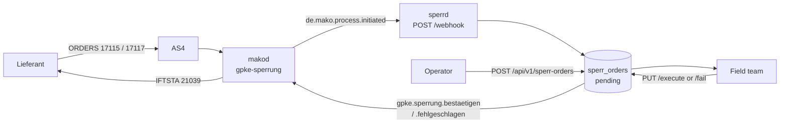

+++
title = "sperrd Operator Guide"
description = "Operator guide for sperrd — the Netzbetreiber's Sperr-/Entsperrauftrag execution queue: ORDERS 17115/17117 in, field dispatch, IFTSTA 21039 out, with a retry queue for the outcomes that do not reach the Lieferant."
weight = 26
+++
`sperrd` is the Netzbetreiber's work queue for the physical acts GPKE orders it
to perform. An **ORDERS 17115 Sperrauftrag** or **17117 Entsperrauftrag** from a
Lieferant becomes a job for the field team; the outcome goes back as **IFTSTA
21039** (Auftragsstatus Sperren/Entsperren).

Three terms carry the page. A **Sperrung** is the physical interruption of a
supply point and an **Entsperrung** its restoration. **ORDERS** and **IFTSTA**
are [EDIFACT message types](@/docs/architecture/domain-model.md#edifact-message-types) — the order and the status
report — and the five-digit number after each is its
[**Prüfidentifikator (PID)**](@/docs/architecture/domain-model.md#prufidentifikator-pid), the BDEW code that says
which business case a message carries (the platform-wide list is the
[PID reference](@/docs/regulatory/pid-reference.md)). **Lieferant (LF)** and
**Netzbetreiber (NB)** are two of the four market roles the platform models; see
[Party Roles](@/docs/architecture/domain-model.md#party-roles-marktrollen). The
supply point itself is a **Marktlokation (MaLo)** —
[MaLo vs MeLo](@/docs/architecture/domain-model.md#malo-vs-melo-the-critical-distinction).

Without that outcome message the Lieferant's `gpke-sperrung-lf` process never
reaches a terminal state, and GPKE gives them no way to find out what happened
but to ask. Dispatching it is the service's reason to exist, and the one state it
will not let fall silently on the floor.

**Port:** `:8780`
**Storage:** PostgreSQL (`sperr_orders`)
**Role:** NB (Netzbetreiber)

1. TOC
{:toc}

## Where orders come from



Two producers, one queue:

* **The market inbox.** `POST /webhook` consumes `de.mako.process.initiated` and
  turns PIDs 17115 and 17117 into work orders, keyed on the `makod` process so a
  redelivery over AS4 does not queue a second disconnection. This is what makes
  `sperrd` an NB service: a Sperrauftrag arriving from a third-party Lieferant
  reaches an executing party rather than only a `makod` process.
* **Operators.** `POST /api/v1/sperr-orders` for an order with no market
  correspondent. It has no `process_id`, so no IFTSTA is owed for it.

PID **17116** (Anfrage Sperrung) is deliberately *not* queued: it is the NB asking
the Messstellenbetreiber whether the meter is reachable, not an order to execute.

## What the queue carries

The row is shaped by what the ORDERS AHB actually sends:

| Column | EDIFACT | Meaning |
|---|---|---|
| `order_type` | `BGM+Z51` / `Z52` | Sperrung / Entsperrung |
| `ausfuehrung_am` | `DTM+203` | A **fixed** date the LF requires (hint [533]: a Gerichtsvollzieher may have set it) |
| `fruehestens_am` | `DTM+469` | Execute at the next opportunity, but **not before** this date |
| `arbeitszeit` | `IMD+7081` `Z53`/`Z54` | Entsperrauftrag: within working hours, or also outside |
| `treffpunkt_*` | `SG2 NAD+Z24` | Where the technician goes |
| `hinweis` | `SG29 FTX+ACB` | The LF's free-text hints |

`ausfuehrung_am` and `fruehestens_am` are alternatives — AHB conditions [55]/[56]
— enforced in the API and by a database `CHECK`. The distinction matters
operationally: a missed fixed date is a broken commitment to the Lieferant, while
a passed earliest-start only means the job became schedulable.

## Timing — three clocks, all published

BK6-24-174 GPKE Teil 2 §§ 3.5.1.2 / 3.5.2.2 state every deadline on a
Sperr-/Entsperrauftrag, and they are three different ones. A **Frist** is a
regulated deadline and **WT** is *Werktag*, the market's business day — never a
calendar day, so every window here is counted on the BDEW-MaKo calendar
([business dates](@/docs/architecture/domain-model.md#dates-and-days)). **ÜT**
is the *Übertragungszeitpunkt*, the moment a message must be on the wire.

| Clock | Frist | Tracked by |
|---|---|---|
| **ORDRSP** 19116 / 19117 answering the order | „spätester ÜT ist der 1. WT nach dem ÜT" (Prozessschritt 2) | `makod`, from `mako_fristen::antwort` |
| **The physical act** | „…spätestens innerhalb von 6 WT nach dem frühestmöglichen Sperrtermin" (Prozessschritt 1) | `sperrd` — `ausfuehrung_faellig_am` |
| **IFTSTA 21039** | „spätester ÜT ist der 1. WT nach dem Abschluss des Sperrauftrags" (Prozessschritt 5) | `sperrd` — `iftsta_faellig_am` |

The Lieferant's `DTM+203` / `DTM+469` is a fourth date and a different question:
when the LF wanted the work done, not when the Festlegung requires it.
`/stats` reports both — `overdue_pending` for the LF's date,
`frist_ueberschritten` for the regulatory window. A pending order past its
6-Werktage window is announced once as `de.sperr.ausfuehrung.ueberfaellig`.

### …and three Vorlauffristen, which count the other way

Every clock above runs *forward*. Prozessschritt 1 and 3 state windows that run
**backwards from the Sperrtermin**, so reading either as „n Werktage nach
Eingang" is wrong by the whole lead time:

| Prozessschritt | Frist | Owed by |
|---|---|---|
| Sperrauftrag, nicht termingebunden (Nr. 1) | spätester ÜT ist der **6. WT** vor dem frühestmöglichen Sperrtermin | LF |
| Sperrauftrag, **termingebunden** (Nr. 1) | spätester ÜT ist der **12. WT** vor dem Sperrtermin | LF |
| Anfrage Sperrung an den MSB (Nr. 3) | spätester ÜT ist der **3. WT** vor dem Sperrtermin | NB |

The termingebundene case is not a variant of the ordinary one: it fixes Datum,
Uhrzeit und Ort — the Festlegung's example is a Gerichtsvollzieher — so the NB
cannot move the visit to fit its own scheduling and the LF has to give it twice
the room. The wire tells the two apart on its own, because `DTM+203` and
`DTM+469` are mutually exclusive on a 17115.

`sperrd` records the verdict per order (`vorlauffrist_eingehalten`, plus the
latest ÜT the order could have carried) and reports the total as
`vorlauffrist_verletzt`. It does **not** refuse on it: Prozessschritt 2 lists
what the NB checks before it answers — „ob die Marktlokation dem LF zugeordnet
ist, ob die Marktlokation identifiziert werden kann und die Zusicherung der
Berechtigung nach Netznutzungsvertrag vorliegt" — and the Vorlauffrist is not
among them.

Nr. 2 puts a floor on the **NB** instead: without a generelle Zustimmung des MSB
„ist der Sperrtermin vom NB so festzulegen, dass dem MSB noch eine fristgerechte
Antwort auf Anfrage vor dem Sperrtermin möglich ist" — the Anfrage's 3 WT plus
the MSB's own 3 WT to answer, so six Werktage out.

### Two Sperrversuche

„Der NB führt bis zu zwei Sperrversuche innerhalb eines Sperrauftrags durch"
(Prozessschritt 5). `PUT .../fail` records the first unsuccessful visit and
leaves the order `pending`; the second closes it, as does `endgueltig: true` for
a legal or factual impossibility — a gerichtliche Verfügung, or a glaubhaft
gemachter Verhinderungsgrund such as lebenserhaltende medizinische Geräte.

A guard test rejects the two claims that contradict Prozessschritt 1: a
„2 Werktage" window, and the assertion that GPKE fixes none.

## Reporting the outcome

`PUT /api/v1/sperr-orders/{id}/execute` and `.../fail` are the two terminal
transitions. Both **claim the order first** with a single guarded `UPDATE … WHERE
status = 'pending'` and only then dispatch, so a concurrent execute and fail
cannot both put a message on the wire — which would send the Lieferant an
Ausführungs- *and* a Fehlmeldung for the same order.

What the IFTSTA carries, per AHB 2.1 §7.2:

| Field | Source |
|---|---|
| `SG15 STS DE9015` | `Z37` Auftragsstatus Sperren / `Z38` Entsperren — derived from `order_type` |
| `SG15 STS DE4405` | `Z14 erfolgreich` (execute) / `Z13 gescheitert` (fail) |
| `SG15 STS DE9013` | The Prüfschritt code from the EBD (*Entscheidungsbaumdiagramm* — BDEW's published decision tree for this answer). A **Muss**, so `pruefschritt_code` is what makes the message valid |
| `DTM+293` | Fertigstellungsdatum — **Muss** on `Z14`, and condition [495] requires it ≤ the document date, so a future `executed_at` is refused at the API |
| `SG25 FTX+ACB` | The `note` or `reason` free text |

The response tells you which of two things happened:

* **204** — recorded, and the IFTSTA is with `makod`.
* **202** — recorded, but the dispatch failed. The order is in the retry queue and
  the Lieferant has **not** been told. The outcome is kept regardless: a field
  team's report is a fact about the physical world, and discarding it because a
  downstream service was unreachable is worse than retrying.

## The IFTSTA retry queue

A terminal order whose `iftsta_dispatched_at` is NULL is an order whose Lieferant
does not know the outcome.

A background worker drains it, re-sending under the same idempotency key
`makod` deduplicates on, so a re-send after a lost response is the same command
rather than a second IFTSTA. Replicas are safe because the claim and the backoff
are one column: taking an order pushes `iftsta_next_attempt_at` forward, so no
second worker's `<= now()` still matches it. It announces `de.sperr.iftsta.ausstehend` once and
stops on **either** of two triggers:

| Trigger | Why it is there |
|---|---|
| `iftsta_attempts` reaches `IFTSTA_MAX_ATTEMPTS` | A dispatch that has failed eight times is not a transport problem but a `makod` process in the wrong state, and retrying that forever only hides it behind a rising attempt count |
| `iftsta_faellig_am` has passed | The Frist — 1. Werktag nach Abschluss (GPKE Teil 2 § 3.5.1.2 Nr. 5) — is stamped once when the order goes terminal, so it escalates even if the attempt counter never advanced |

The second trigger exists because the counter is not trustworthy on its own: a
failure whose *own* write is lost never increments it, so an order could retry
indefinitely without ever reaching the cap. The Frist holds whatever happens to
the count, and the event reports the real attempt total rather than assuming the
cap was the reason.

`/stats` reports the three apart:

| Field | Meaning |
|---|---|
| `iftsta_outstanding` | Dispatches in flight. Normal for seconds after an execution. |
| `iftsta_ueberfaellig` | Past the 1-WT window of GPKE Teil 2 § 3.5.1.2 Nr. 5. |
| `iftsta_stuck` | Past the retry budget. **This is the number that needs a human.** |
| `vorlauffrist_verletzt` | Orders the *Lieferant* sent later than its own Vorlauffrist allowed. A contract question, not an operations one — the NB executes them anyway. |

### Diagnosing a stuck IFTSTA

Read `iftsta_last_error` on the order. The usual cause is that `makod` has no
`gpke-sperrung` process for that MaLo in `ValidationPassed` — its
`BestaetigueSperrung` command refuses any other state. Check whether the inbound
ORDERS spawned a process at all; if it did not, the order reached the queue by
another route and there is no market correspondent to report to. After fixing the
cause, reset `iftsta_attempts` and the worker picks the order up again.

## Emitted events

All through the transactional outbox.

| CloudEvent | Emitted when |
|---|---|
| `de.sperr.auftrag.eingegangen` | An order entered the queue, from ORDERS or an operator |
| `de.sperr.ausgefuehrt` | Carried out — IFTSTA `Z14` |
| `de.sperr.versuch.gescheitert` | The **first** Sperrversuch failed and the order stayed `pending`. Deliberately not `fehlgeschlagen`: nothing has been reported to the LF yet, because Nr. 5 still owes a second visit |
| `de.sperr.fehlgeschlagen` | Not carried out — IFTSTA `Z13`, with the Prüfschritt code |
| `de.sperr.storniert` | A pending order was withdrawn; no IFTSTA |
| `de.sperr.ausfuehrung.ueberfaellig` | The 6-WT execution window closed with the order still open |
| `de.sperr.iftsta.ausstehend` | The retry budget is spent **or** the § 3.5.1.2 Nr. 5 Frist has passed, and the LF is still uninformed |

`agentd`'s `sperrd-agent` subscribes to the `de.sperr.*` glob.

## Authentication and authorization

Every REST route requires an OIDC token **and** passes a Cedar check.
Authentication alone would let a valid token from any tenant order a
disconnection in this operator's name.

| Action | Routes |
|---|---|
| `read-sperr-order` | `GET` the queue, an order, `/stats` |
| `create-sperr-order` | `POST /api/v1/sperr-orders` |
| `execute-sperr-order` | `PUT .../execute`, `.../fail` |
| `cancel-sperr-order` | `PUT .../cancel` |

All four require the `NB` market role in `mako_roles` and a tenant match. The
`/webhook` ingest is authenticated by the inbound Standard Webhooks signature instead,
because `makod` holds no bearer token for this service.

`tests/authorization_guard.rs` fails the build if a handler loses its `Claims`
extractor or its Cedar check, if a checked action appears in no policy (Cedar is
default-deny, so that is a permanent 403), or if a policy grants an action nothing
checks.

## Schema

```sql
CREATE TABLE sperr_orders (
    id                   UUID PRIMARY KEY DEFAULT gen_random_uuid(),
    tenant               TEXT NOT NULL,
    malo_id              TEXT NOT NULL,
    lf_mp_id             TEXT NOT NULL,
    order_type           TEXT NOT NULL CHECK (order_type IN ('sperrung','entsperrung')),
    pruefidentifikator   INTEGER CHECK (pruefidentifikator IN (17115, 17117)),
    process_id           TEXT,
    ausfuehrung_am       DATE,
    fruehestens_am       DATE,
    CHECK (ausfuehrung_am IS NULL OR fruehestens_am IS NULL),
    ausfuehrung_faellig_am   DATE,          -- 6 WT, GPKE Teil 2 § 3.5.1.2 Nr. 1
    ausfuehrung_eskaliert_at TIMESTAMPTZ,
    sperrversuche            INTEGER NOT NULL DEFAULT 0
                             CHECK (sperrversuche BETWEEN 0 AND 2),   -- Nr. 5
    letzter_versuch_am       TIMESTAMPTZ,
    letzter_versuch_grund    TEXT,
    vorlauffrist_eingehalten   BOOLEAN,     -- recorded, never enforced
    vorlauffrist_spaetester_ut DATE,        -- the latest ÜT the order could have carried
    iftsta_faellig_am        DATE,          -- 1. WT nach Abschluss, Nr. 5
    arbeitszeit          TEXT CHECK (arbeitszeit IN ('innerhalb','auch_ausserhalb')),
    treffpunkt_hinweis   TEXT,
    treffpunkt_strasse   TEXT,
    treffpunkt_plz       TEXT,
    treffpunkt_ort       TEXT,
    treffpunkt_land      TEXT CHECK (treffpunkt_land IS NULL OR treffpunkt_land ~ '^[A-Z]{2}$'),
    hinweis              TEXT,
    status               TEXT NOT NULL DEFAULT 'pending'
                         CHECK (status IN ('pending','executed','failed','cancelled')),
    executed_at          TIMESTAMPTZ,
    execution_note       TEXT,
    fail_reason          TEXT,
    pruefschritt_code    TEXT,
    CHECK (status <> 'executed' OR executed_at IS NOT NULL),
    CHECK (status <> 'failed'   OR fail_reason IS NOT NULL),
    iftsta_ref           TEXT,
    iftsta_dispatched_at TIMESTAMPTZ,
    iftsta_attempts      INTEGER NOT NULL DEFAULT 0,
    iftsta_last_error    TEXT,
    -- The claim lease *and* the retry backoff in one column: a worker takes an
    -- order by pushing this forward, so a second replica's `<= now()` no longer
    -- matches and cannot dispatch the same 21039 twice.
    iftsta_next_attempt_at TIMESTAMPTZ NOT NULL DEFAULT now(),
    iftsta_escalated_at  TIMESTAMPTZ,
    created_at           TIMESTAMPTZ NOT NULL DEFAULT now(),
    updated_at           TIMESTAMPTZ NOT NULL DEFAULT now(),
    UNIQUE (tenant, process_id)
);
```

## MCP surface

Read-only by construction: withdrawing a § 41f disconnection order stays on the
authenticated REST routes, with an operator.

| Tool | Description |
|---|---|
| `list_sperr_orders(status, malo_id, due, limit)` | The queue |
| `get_sperr_order(id)` | One order, with ORDERS provenance and IFTSTA state |
| `get_sperr_stats` | Counters, incl. `iftsta_outstanding` / `iftsta_stuck` |
| `list_due_orders` | The field-dispatch list, with the Treffpunkt |

Prompts: `execute-sperrung`, `iftsta-sweep`.

## Configuration

```toml
port           = 8780
tenant         = "9900357000004"

makod_url      = "http://makod:8080"
makod_api_key  = "env:SPERRD_MAKOD_API_KEY"
inbound_hmac_secret = "env:SPERRD_INBOUND_HMAC_SECRET"

[database]
url       = "env:SPERRD_DATABASE_URL"
pool_size = 10

[oidc]
issuer   = "https://keycloak:8080/realms/mako"
audience = "sperrd"

# Optional: MCP authentication (API key or OIDC). Omitted, the MCP surface
# follows the same dev-mode rules as the REST API.
# [mcp]
# api_key = "env:SPERRD_MCP_API_KEY"
```

Omitting `[oidc]` is a startup failure unless `allow_insecure_no_auth = true` is
written down explicitly: these routes create and confirm physical disconnections.

## Tests

`cargo test -p sperrd` runs the unit and guard tests. `just test-sperrd-db` runs
16 scenarios against real PostgreSQL: the redelivery guard, two replicas unable
to claim the same IFTSTA, a failed dispatch keeping the report and queueing a
retry, budget exhaustion escalating once, an overdue IFTSTA escalating even when
no attempt was ever counted, exactly one terminal outcome per order, the first
Sperrversuch leaving the order open, tenant isolation, and the
mutually-exclusive ORDERS dates.
