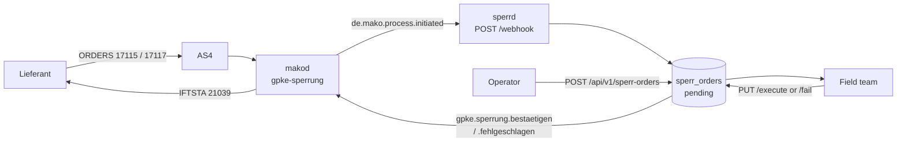

+++
title = "sperrd Operator Guide"
description = "Operator guide for sperrd — the Netzbetreiber's Sperr-/Entsperrauftrag execution queue: ORDERS 17115/17117 in, field dispatch, IFTSTA 21039 out, with a retry queue for the outcomes that do not reach the Lieferant."
weight = 26
[extra]
mermaid = true
+++
# `sperrd` Operator Guide

`sperrd` is the Netzbetreiber's work queue for the physical acts GPKE orders it
to perform. An **ORDERS 17115 Sperrauftrag** or **17117 Entsperrauftrag** from a
Lieferant becomes a job for the field team; the outcome goes back as **IFTSTA
21039** (Auftragsstatus Sperren/Entsperren).

Without that outcome message the Lieferant's `gpke-sperrung-lf` process never
reaches a terminal state, and GPKE gives them no way to find out what happened
but to ask. Dispatching it is the service's reason to exist, and the one state it
will not let fall silently on the floor.

**Port:** `:8780`
**Storage:** PostgreSQL (`sperr_orders`)
**Role:** NB (Netzbetreiber)

1. TOC
{:toc}

## Where orders come from



Two producers, one queue:

* **The market inbox.** `POST /webhook` consumes `de.mako.process.initiated` and
  turns PIDs 17115 and 17117 into work orders, keyed on the `makod` process so a
  redelivery over AS4 does not queue a second disconnection. This is what makes
  `sperrd` an NB service — before it existed, a Sperrauftrag arriving from a
  third-party Lieferant spawned a `makod` process and then reached nobody.
* **Operators.** `POST /api/v1/sperr-orders` for an order with no market
  correspondent. It has no `process_id`, so no IFTSTA is owed for it.

PID **17116** (Anfrage Sperrung) is deliberately *not* queued: it is the NB asking
the Messstellenbetreiber whether the meter is reachable, not an order to execute.

## What the queue carries

The row is shaped by what the ORDERS AHB actually sends:

| Column | EDIFACT | Meaning |
|---|---|---|
| `order_type` | `BGM+Z51` / `Z52` | Sperrung / Entsperrung |
| `ausfuehrung_am` | `DTM+203` | A **fixed** date the LF requires (hint [533]: a Gerichtsvollzieher may have set it) |
| `fruehestens_am` | `DTM+469` | Execute at the next opportunity, but **not before** this date |
| `arbeitszeit` | `IMD+7081` `Z53`/`Z54` | Entsperrauftrag: within working hours, or also outside |
| `treffpunkt_*` | `SG2 NAD+Z24` | Where the technician goes |
| `hinweis` | `SG29 FTX+ACB` | The LF's free-text hints |

`ausfuehrung_am` and `fruehestens_am` are alternatives — AHB conditions [55]/[56]
— enforced in the API and by a database `CHECK`. The distinction matters
operationally: a missed fixed date is a broken commitment to the Lieferant, while
a passed earliest-start only means the job became schedulable.

## Timing — read this before building an SLA

GPKE fixes **no execution deadline in Werktagen** for the physical act. The only
date is the Lieferant's own, from `DTM+203` or `DTM+469`.

What BK6-22-024 §5 *does* fix is **24 wall-clock hours** for the NB's **ORDRSP**
(Bestätigung 19116 / Ablehnung 19117), which `makod` tracks — not this service.

A guard test fails the build if a Werktage execution window is asserted
anywhere in the service.

## Reporting the outcome

`PUT /api/v1/sperr-orders/{id}/execute` and `.../fail` are the two terminal
transitions. Both **claim the order first** with a single guarded `UPDATE … WHERE
status = 'pending'` and only then dispatch, so a concurrent execute and fail
cannot both put a message on the wire — which would send the Lieferant an
Ausführungs- *and* a Fehlmeldung for the same order.

What the IFTSTA carries, per AHB 2.1 §7.2:

| Field | Source |
|---|---|
| `SG15 STS DE9015` | `Z37` Auftragsstatus Sperren / `Z38` Entsperren — derived from `order_type` |
| `SG15 STS DE4405` | `Z14 erfolgreich` (execute) / `Z13 gescheitert` (fail) |
| `SG15 STS DE9013` | The EBD Prüfschritt code — a **Muss**, so `pruefschritt_code` is what makes the message valid |
| `DTM+293` | Fertigstellungsdatum — **Muss** on `Z14`, and condition [495] requires it ≤ the document date, so a future `executed_at` is refused at the API |
| `SG25 FTX+ACB` | The `note` or `reason` free text |

The response tells you which of two things happened:

* **204** — recorded, and the IFTSTA is with `makod`.
* **202** — recorded, but the dispatch failed. The order is in the retry queue and
  the Lieferant has **not** been told. The outcome is kept regardless: a field
  team's report is a fact about the physical world, and discarding it because a
  downstream service was unreachable is worse than retrying.

## The IFTSTA retry queue

A terminal order whose `iftsta_dispatched_at` is NULL is an order whose Lieferant
does not know the outcome.

The previous design created that state on every crash between claiming an order
and dispatching its IFTSTA, counted it in `/stats`, indexed it — and had **no way
to clear it**. The documented recovery, "call `PUT .../execute` again, it is
idempotent", could not work: the claim guards on `status = 'pending'`, so a second
call returned 404 and dispatched nothing.

It is now a queue. A background worker re-sends under the same idempotency key
`makod` deduplicates on, so a re-send after a lost response is the same command
rather than a second IFTSTA. After `IFTSTA_MAX_ATTEMPTS` it announces
`de.sperr.iftsta.ausstehend` once and stops — a dispatch that has failed eight
times is not a transport problem but a `makod` process in the wrong state, and
retrying that forever only hides it behind a rising attempt count.

`/stats` reports the two apart:

| Field | Meaning |
|---|---|
| `iftsta_outstanding` | Dispatches in flight. Normal for seconds after an execution. |
| `iftsta_stuck` | Past the retry budget. **This is the number that needs a human.** |

### Diagnosing a stuck IFTSTA

Read `iftsta_last_error` on the order. The usual cause is that `makod` has no
`gpke-sperrung` process for that MaLo in `ValidationPassed` — its
`BestaetigueSperrung` command refuses any other state. Check whether the inbound
ORDERS spawned a process at all; if it did not, the order reached the queue by
another route and there is no market correspondent to report to. After fixing the
cause, reset `iftsta_attempts` and the worker picks the order up again.

## Emitted events

All through the transactional outbox.

| CloudEvent | Emitted when |
|---|---|
| `de.sperr.auftrag.eingegangen` | An order entered the queue, from ORDERS or an operator |
| `de.sperr.ausgefuehrt` | Carried out — IFTSTA `Z14` |
| `de.sperr.fehlgeschlagen` | Not carried out — IFTSTA `Z13`, with the Prüfschritt code |
| `de.sperr.storniert` | A pending order was withdrawn; no IFTSTA |
| `de.sperr.iftsta.ausstehend` | The retry budget is spent and the LF is still uninformed |

`agentd`'s `sperrd-agent` subscribes to the `de.sperr.*` glob.

## Authentication and authorization

Every REST route requires an OIDC token **and** passes a Cedar check.
Authentication alone would let a valid token from any tenant order a
disconnection in this operator's name.

| Action | Routes |
|---|---|
| `read-sperr-order` | `GET` the queue, an order, `/stats` |
| `create-sperr-order` | `POST /api/v1/sperr-orders` |
| `execute-sperr-order` | `PUT .../execute`, `.../fail` |
| `cancel-sperr-order` | `PUT .../cancel` |

All four require the `NB` market role in `mako_roles` and a tenant match. The
`/webhook` ingest is authenticated by the inbound `X-Mako-Signature` HMAC instead,
because `makod` holds no bearer token for this service.

`tests/authorization_guard.rs` fails the build if a handler loses its `Claims`
extractor or its Cedar check, if a checked action appears in no policy (Cedar is
default-deny, so that is a permanent 403), or if a policy grants an action nothing
checks.

## Schema

```sql
CREATE TABLE sperr_orders (
    id                   UUID PRIMARY KEY DEFAULT gen_random_uuid(),
    tenant               TEXT NOT NULL,
    malo_id              TEXT NOT NULL,
    lf_mp_id             TEXT NOT NULL,
    order_type           TEXT NOT NULL CHECK (order_type IN ('sperrung','entsperrung')),
    pruefidentifikator   INTEGER CHECK (pruefidentifikator IN (17115, 17117)),
    process_id           TEXT,
    ausfuehrung_am       DATE,
    fruehestens_am       DATE,
    CHECK (ausfuehrung_am IS NULL OR fruehestens_am IS NULL),
    arbeitszeit          TEXT CHECK (arbeitszeit IN ('innerhalb','auch_ausserhalb')),
    treffpunkt_hinweis   TEXT,
    treffpunkt_strasse   TEXT,
    treffpunkt_plz       TEXT,
    treffpunkt_ort       TEXT,
    treffpunkt_land      TEXT CHECK (treffpunkt_land IS NULL OR treffpunkt_land ~ '^[A-Z]{2}$'),
    hinweis              TEXT,
    status               TEXT NOT NULL DEFAULT 'pending'
                         CHECK (status IN ('pending','executed','failed','cancelled')),
    executed_at          TIMESTAMPTZ,
    execution_note       TEXT,
    fail_reason          TEXT,
    pruefschritt_code    TEXT,
    CHECK (status <> 'executed' OR executed_at IS NOT NULL),
    CHECK (status <> 'failed'   OR fail_reason IS NOT NULL),
    iftsta_ref           TEXT,
    iftsta_dispatched_at TIMESTAMPTZ,
    iftsta_attempts      INTEGER NOT NULL DEFAULT 0,
    iftsta_last_error    TEXT,
    iftsta_escalated_at  TIMESTAMPTZ,
    created_at           TIMESTAMPTZ NOT NULL DEFAULT now(),
    updated_at           TIMESTAMPTZ NOT NULL DEFAULT now(),
    UNIQUE (tenant, process_id)
);
```

## MCP surface

Read-only by construction. The previous version exposed `cancel_sperr_order` — a
tool that withdraws a §41f disconnection order — on a surface a language model
drives; every other MCP server on this platform is read-only and keeps the
mutating decision with an operator.

| Tool | Description |
|---|---|
| `list_sperr_orders(status, malo_id, due, limit)` | The queue |
| `get_sperr_order(id)` | One order, with ORDERS provenance and IFTSTA state |
| `get_sperr_stats` | Counters, incl. `iftsta_outstanding` / `iftsta_stuck` |
| `list_due_orders` | The field-dispatch list, with the Treffpunkt |

Prompts: `execute-sperrung`, `iftsta-sweep`.

## Configuration

```toml
port           = 8780
tenant         = "9900357000004"

makod_url      = "http://makod:8080"
makod_api_key  = "env:SPERRD_MAKOD_API_KEY"
inbound_hmac_secret = "env:SPERRD_INBOUND_HMAC_SECRET"

[database]
url       = "env:SPERRD_DATABASE_URL"
pool_size = 10

[oidc]
issuer   = "https://keycloak:8080/realms/mako"
audience = "sperrd"
```

Omitting `[oidc]` is a startup failure unless `allow_insecure_no_auth = true` is
written down explicitly: these routes create and confirm physical disconnections.

## Tests

`cargo test -p sperrd` runs the unit and guard tests. `just test-sperrd-db` runs
10 scenarios against real PostgreSQL: the redelivery guard, the claim guard, a
failed dispatch keeping the report and queueing a retry, budget exhaustion
escalating once, tenant isolation, and the mutually-exclusive ORDERS dates.
