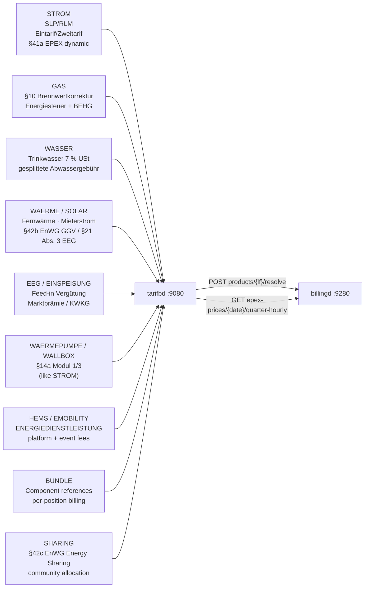

+++
title = "tarifbd Operator Guide"
description = "tarifbd operator guide: Product & Tariff Catalog daemon (LF role). User-defined energy products (STROM/GAS/WAERME/SOLAR/EEG/EINSPEISUNG/WAERMEPUMPE/WALLBOX/HEMS/EMOBILITY/ENERGIEDIENSTLEISTUNG/BUNDLE/SHARING); all prices in Tarifpreisblatt JSONB; product version history; MaLo→product assignment, 15-min EPEX Spot day-ahead prices for §41a dynamic tariffs."
weight = 31
[extra]
mermaid = true
+++
# `tarifbd` — Product & Tariff Catalog

`tarifbd` is the single source of truth for **everything the LF sells** to end customers.
`billingd` and the customer portal query it exclusively for pricing — `marktd` is never used
for retail product pricing.

Port: **`:9080`**

---

## Why a separate catalog?

`marktd` is a B2B MaKo grid communication data hub. Retail tariffs evolve weekly; grid
data is annual (BDEW format versions). Mixing them violates the single-responsibility
principle and makes §20 EnWG audits harder.

`tarifbd` mirrors the product catalog pattern of every mature energy billing platform
(SAP IS-U FI-CA, powercloud, Wilken ENER:GY): a separate service, its own lifecycle,
queried only by billing engines and portals.

---

## Product categories



---

## Endpoints

| Method | Path | Description |
|--------|------|-------------|
| `PUT` | `/api/v1/products/{lf_mp_id}/{product_code}` | Upsert product; archives previous version in `product_history`; validates `_typ`, `_version`, enum fields, 30-value `preistyp` whitelist |
| `GET` | `/api/v1/products/{lf_mp_id}/{product_code}` | Fetch latest product |
| `DELETE` | `/api/v1/products/{lf_mp_id}/{product_code}` | **Soft-delete** — sets `valid_to = today`; product retained for billing history; excluded from comparison feed |
| `GET` | `/api/v1/products/{lf_mp_id}` | List products (`?category=&sparte=&kundentyp=&include_drafts=&include_expired=`) |
| `GET` | `/api/v1/products/{lf_mp_id}/{product_code}/history` | Immutable version audit log (includes `energiemix` history for §42 audit trail) |
| `POST` | `/api/v1/products/{lf_mp_id}/resolve` | Product versions by code + date, batched — what `billingd` prices each leg of a period from |
| `PUT/GET/DELETE` | `/api/v1/products/{lf_mp_id}/{product_code}/energiemix` | §42 EnWG Energiemix sub-resource — does NOT archive product or trigger billing-period changes |
| `GET` | `/api/v1/comparison-feed` | **Comparison portal feed** — ETag-cached, cursor-paginated tariff listing (PUBLISHED non-expired only); `jahreskosten_supply_*` for `verbrauch_kwh` |
| `GET` | `/api/v1/comparison-feed/bo4e` | **BO4E Tarifinfo array** — § 41c EnWG canonical form; direct import by Verivox / Check24 / BNetzA MTS |
| `PUT` | `/api/v1/epex-prices/{date}` | Import EPEX day-ahead prices (96/92/100 15-min MTUs, or 24 hourly; idempotent) |
| `GET` | `/api/v1/epex-prices/{date}/quarter-hourly` | 15-min MTU points `{mtu_start, price_ct_kwh}` |
| `GET` | `/api/v1/epex-prices/{year}/{month}/average` | Monthly average — used by `einsd` Direktvermarktung |
| `PUT` | `/api/v1/nehs-prices/{date}` | Import a dated nEHS certificate price (EUR/t CO₂) — EEX auction clearing (weekly from 01.07.2026, §10 BEHG corridor 55–65 €/t), Verkaufsphase (68 €) or manual. `source` ∈ `auktion`/`verkaufsphase`/`nachkauf`/`manual` (CHECK-constrained; anything else → 422) |
| `GET` | `/api/v1/nehs-prices/latest?date=` | Most recent nEHS price at or before `date` — used by `billingd` for the Gas CO₂ component (CO2KostAufG §3) |
| `POST/GET` | `/api/v1/angebote` | B2B Angebot (quotation) — ANGELEGT→VERSANDT→ANGENOMMEN/ABGELEHNT/ABGELAUFEN |
| `GET` | `/health` | Liveness |
| `GET` | `/health/ready` | Readiness |

---

## Registering a product

```http
PUT /api/v1/products/9910000000002/STROM-H0-2026
Content-Type: application/json

{
  "category": "STROM",
  "name": "Strom Zuhause Classic",
  "sparte": "STROM",
  "register_count": "Eintarif",
  "kundentyp": "Haushalt",
  "valid_from": "2026-01-01",
  "data": {
    "_typ": "TARIFPREISBLATT",
    "bezeichnung": "Strom Zuhause Classic 2026",
    "gueltigkeit": { "startdatum": "2026-01-01" },
    "tarifpreispositionen": [
      { "preistyp": "GRUNDPREIS",          "preisstaffeln": [{ "preis": "0.20" }] },
      { "preistyp": "ARBEITSPREIS_EINTARIF", "preisstaffeln": [{ "preis": "0.32" }] }
    ]
  }
}
```

`billingd` extracts `grundpreis_ct_per_day` (20 ct/day) and `arbeitspreis_ct_per_kwh`
(32 ct/kWh) by traversing `data.tarifpreispositionen` keyed on `preistyp`.

---

## What tarifbd is *not*

**Which product a customer is on does not live here.** Agreeing it is a
Tarifwechsel — a contract act under § 41 Abs. 5 EnWG, guarded by the contract's
Preisgarantie — so the valid-time MaLo→product assignment lives in
[`vertragd`](@/docs/services/vertragd.md), with the contract.

`tarifbd` answers the other half — what a product **costs** on a given day:

```http
POST /api/v1/products/{lf_mp_id}/resolve
Content-Type: application/json

{ "anfragen": [
    { "product_code": "STROM-H0-2026", "as_of": "2026-03-01" },
    { "product_code": "STROM-H0-2027", "as_of": "2026-03-15" } ] }
```

`billingd` bills a period as one leg per assignment slice, so it resolves every
leg's product in **one** round trip. Asking per leg would be an N+1 on every
invoice, and two calls could disagree if the catalogue changed between them. A
code with no version valid on its date comes back as `null` **in place**, so the
caller can name which leg is unpriceable rather than getting a shorter list than
it asked for.

Both validity bounds are applied, so a withdrawn product stops pricing new
periods immediately and still prices the past — which is what a Schlussrechnung
for a closed period needs.

## §41a EPEX Spot feed

The SDAC day-ahead auction settles on **15-minute Market Time Units (MTU)**
since 2025-10-01 (EPEX SPOT go-live) — 96 quarter-hours per delivery day
(92/100 on the DST days). Import the day-ahead prices daily (D-1) as an ordered
array of the delivery day's MTUs, in UTC-instant order (= local wall-clock
order). `mtu_minutes` defaults to `15`; legacy `60`-minute source data is
accepted and expanded to quarter-hours on fetch.

```bash
# Import 2026-07-15 (96 quarter-hour prices, ct/kWh)
curl -s -X PUT "http://tarifbd:9080/api/v1/epex-prices/2026-07-15" \
  -H "Content-Type: application/json" \
  -d '{
    "prices": [6.2, 6.1, 6.0, 5.9, /* … 96 entries … */ 6.5],
    "mtu_minutes": 15,
    "source": "entsoe-transparency"
  }'
```

For `billingd` dynamic billing: `GET /api/v1/epex-prices/2026-07-15/quarter-hourly`
returns the day's 15-min points, each `{ mtu_start (UTC RFC3339), price_ct_kwh }`,
for the 15-min Lastgang × EPEX-MTU multiplication (§41a pipeline). The price map
is keyed on the UTC MTU start (DST-safe).

For `einsd` Direktvermarktung: `GET /api/v1/epex-prices/2026/7/average` returns the
monthly average used in `max(0, AW − EPEX)`.

---

## nEHS certificate prices (BEHG)

The CO₂ component of every Gas and Wärme invoice is derived from what the
supplier paid for its certificates (CO2KostAufG § 3 passes through the actual
cost), so a decimal slip in this series mis-bills every gas customer at once and
shows on no single invoice. § 10 BEHG fixes enough about the price to catch the
mistake at import.

| Phase | Period | Price | § 10 BEHG |
|---|---|---|---|
| **Einführungsphase** (`verkaufsphase`) | 2021–2025 | 25 / 30 / 30 / 45 / **55** EUR/t — checked exactly | Abs. 2 |
| **Versteigerung** (`auktion`) | 2026 | clearing price inside the **55–65** EUR/t corridor | Abs. 1, Abs. 2 |
| **Nachkauf** (`nachkauf`) | after the 2026 auctions | **68** EUR/t (Mehrmengenpreis) | Versteigerungsbedingungen |
| `manual` | any | plausibility only (5–500 EUR/t) | — |

68 EUR/t is the **Nachkauf** price for supplementary purchases once the
auctioned volume no longer covers demand; the Verkaufsphase ended at 55 EUR/t in
2025. From 2027 § 10 Abs. 2 fixes no figures of its own (it defers to the
decision under § 24 Abs. 2 Nr. 2), so nothing is asserted about those years and
any positive price is accepted.

```bash
PUT /api/v1/nehs-prices/2026-07-08   { "eur_per_t": "63.50", "source": "auktion" }

# A decimal slip is refused with the rule named:
PUT /api/v1/nehs-prices/2026-07-15   { "eur_per_t": "6.35", "source": "auktion" }
# → 422 "der Zuschlagspreis 6.35 EUR/t liegt außerhalb des Preiskorridors
#        55–65 EUR/t für 2026 (§ 10 Abs. 2 BEHG)"

GET /api/v1/nehs-prices/latest?date=2026-08-01
```

The rules live in `src/behg.rs` as pure functions with a test per phase.

---

## § 41c EnWG comparison feed

§ 41c EnWG obliges suppliers to let third parties operating **independent
comparison tools** use offer-relevant information free of charge, **in open data
formats**, for Haushaltskunden and Kleinstunternehmen with an expected annual
consumption below 100 000 kWh. That obligation is why these two routes — and
only these two — carry no token; every other route in the service is
authenticated.


`GET /api/v1/comparison-feed` returns a machine-readable tariff listing for **Verivox,
Check24**, BNetzA Markttransparenzstelle, and similar integrators. The feed is also
compliant with § 41c EnWG (mandatory machine-readable tariff publication since 2024).

Each entry includes a `tarifinfo` field — a pre-built **BO4E `Tarifinfo` Business
Object** that portals can import directly without custom ETL.  For portals that require
a pure BO4E array, use `GET /api/v1/comparison-feed/bo4e`.

### BO4E Tarifinfo endpoint (§ 41c EnWG canonical form)

`GET /api/v1/comparison-feed/bo4e` returns the same products but wrapped entirely in
standard BO4E `Tarifinfo` objects — the format Verivox, Check24, and the BNetzA
Markttransparenzstelle can import schema-validated without any custom transformation.

```bash
curl -s "http://tarifbd:9080/api/v1/comparison-feed/bo4e?sparte=STROM&kundentyp=Haushalt" | jq .
```

```json
{
  "meta": { "generated_at": "...", "total_returned": 3 },
  "tarife": [
    {
      "_typ": "TARIFINFO",
      "_version": "v202607.0.0",
      "_id": "STROM-PREMIUM-2026",
      "bezeichnung": "Mako Strom Premium",
      "anbietername": "9900357000004",
      "sparte": "STROM",
      "kundentypen": ["Privat"],
      "registeranzahl": "Eintarif",
      "tariftyp": "SONDERTARIF",
      "tarifmerkmale": ["FESTPREIS"],
      "energiemix": { "anteilErneuerbareEnergien": 100, "co2Emission": 0 },
      "zeitlicheGueltigkeit": { "startdatum": "2026-01-01" },
      "vertragskonditionen": { "laufzeit": { "wert": 12, "einheit": "MONAT" } }
    }
  ]
}
```

#### TarifInfo field mapping

| BO4E field | Source in tarifbd |
|---|---|
| `bezeichnung` | `product.name` |
| `anbietername` | `lf_mp_id` |
| `_id` | `product.product_code` |
| `sparte` | `product.sparte` → `rubo4e::Sparte` |
| `kundentypen` | `product.kundentyp` → `[rubo4e::Kundentyp]` |
| `registeranzahl` | `product.register_count` → `rubo4e::Registeranzahl` |
| `tariftyp` | `data.tariftyp` → `rubo4e::Tariftyp` |
| `tarifmerkmale` | Derived: `FESTPREIS` if preisgarantie set; `PAKET` if BUNDLE; `ONLINE` if dynamic |
| `energiemix` | `product.energiemix` → `rubo4e::Energiemix` |
| `zeitlicheGueltigkeit` | `product.valid_from/valid_to` → `rubo4e::Zeitraum` |
| `vertragskonditionen` | `data.vertragskonditionen` → `rubo4e::Vertragskonditionen` |

Both endpoints accept identical query parameters and return the same ETag/caching headers.

### Query parameters

| Parameter | Type | Default | Description |
|---|---|---|---|
| `sparte` | string | all | Filter: `STROM` \| `GAS` \| `WAERME` |
| `kundentyp` | string | all | Filter: `Haushalt` \| `Gewerbe` \| `Waermepumpe` \| `Ladesaeule` \| `Einspeiser` \| `HEMS` \| `Gewerbe_RLM` |
| `verbrauch_kwh` | decimal | `3500` | Annual consumption for `jahreskosten` estimation |
| `oekolabel` | string | — | Show only products with this label (e.g. `OK_POWER`) |
| `include_dynamic` | bool | `true` | Include §41a EPEX-linked dynamic tariffs |
| `only_dynamic` | bool | `false` | Return only §41a dynamic tariffs |
| `limit` | integer | `100` | Page size (1–500) |
| `cursor` | string | — | Pagination cursor from `meta.next_cursor` |
| `lf_mp_id` | string | `cfg.tenant` | Override operator ID |

### Example: Household electricity tariffs

```bash
curl -s "http://tarifbd:9080/api/v1/comparison-feed?sparte=STROM&kundentyp=Haushalt&verbrauch_kwh=3500" | jq .
```

```json
{
  "meta": {
    "generated_at": "2026-07-17T12:00:00Z",
    "lf_mp_id": "9900357000004",
    "verbrauch_kwh": "3500",
    "sparte_filter": "STROM",
    "kundentyp_filter": "Haushalt",
    "total_returned": 3,
    "next_cursor": null
  },
  "tarife": [
    {
      "product_code": "STROM-PREMIUM-2026",
      "name": "Mako Strom Premium",
      "category": "STROM",
      "sparte": "STROM",
      "kundentyp": "Haushalt",
      "register_count": "Eintarif",
      "ist_oekostrom": true,
      "ist_dynamisch": false,
      "valid_from": "2026-01-01",
      "valid_to": null,
      "preise": {
        "grundpreis_ct_per_day": "5.50",
        "arbeitspreis_ct_per_kwh": "28.40",
        "arbeitspreis_ht_ct_per_kwh": null,
        "arbeitspreis_nt_ct_per_kwh": null,
        "leistungspreis_ct_per_kw_month": null
      },
      "jahreskosten_supply_netto_eur": "1014.08",
      "jahreskosten_supply_brutto_eur": "1206.75",
      "mwst_pct": "19",
      "laufzeit_monate": 12,
      "kuendigungsfrist_wochen": 4,
      "mindestlaufzeit_monate": 12,
      "preisgarantie_bis": "2027-06-30",
      "bonus_rabatt_eur": "50.00",
      "energiemix": { "anteil": [...], "co2Emission": 42.0 },
      "oekolabel": ["OK_POWER"],
      "tarifpreisblatt": { "...": "full BO4E payload" },
      "updated_at": "2026-07-17T10:00:00Z"
    }
  ]
}
```

### Caching and efficiency

Responses include `ETag` and `Cache-Control: public, max-age=300` (5-minute cache).
**Comparison portals should send `If-None-Match` on every poll** — the server returns
`304 Not Modified` (no body) when no products have changed since the last request.

The ETag changes whenever any product in the result set is updated (`PUT /products`),
so changes propagate to portals within 5 minutes of the next poll.

### What `jahreskosten_supply_*` includes and excludes

`jahreskosten_supply_netto_eur` = Grundpreis (EUR/a) + Arbeitspreis (EUR/a) **only**.

**Excluded:** NNE, Konzessionsabgabe, Stromsteuer, and MwSt — these vary by DSO/PLZ
and must be added by the portal integrator:

```
Jahresgesamtkosten = jahreskosten_supply_brutto_eur
                   + NNE_brutto (from marktd PreisblattNetznutzung by PLZ)
                   + Stromsteuer (2.05 ct/kWh × verbrauch_kwh / 100)
```

### Pagination

The feed is ordered `(updated_at DESC, product_code ASC)`. When `meta.next_cursor`
is non-null, pass it as `?cursor=<value>` in the next request. New products always
appear on page 1; existing pages remain stable.

```bash
# Page 1
curl "http://tarifbd:9080/api/v1/comparison-feed?limit=2"
# → meta.next_cursor: "2026-07-17T10:00:00Z,STROM-BASIC"

# Page 2
curl "http://tarifbd:9080/api/v1/comparison-feed?limit=2&cursor=2026-07-17T10:00:00Z,STROM-BASIC"
```

---

## B2B Angebot as BO4E

`tarifbd` emits typed BO4E for its tariff data (`Tarifinfo`, `Tarifpreisblatt`),
and a B2B quotation is emitted the same way — a quotation is the natural CPQ/ERP
interchange payload, which is the point of the format.

`GET /api/v1/angebote/{id}/comparison` prices the scenarios, returns the BO4E
document under `bo4e`, and persists it to `angebote.bo4e`.

### Structure

BO4E nests one level deeper than the internal breakdown, and the extra level
carries real meaning:

```text
Angebot                     one quotation      — angebotsnummer, bindefrist, sparte
└── Angebotsvariante        one scenario       — angebotsstatus, gesamtkosten, gesamtmenge
    └── Angebotsteil        one supply point   — lieferstellenangebotsteil (Marktlokation),
        │                                        lieferzeitraum, gesamtkostenangebotsteil
        └── Angebotsposition  one cost line    — positionsbezeichnung, positionskosten,
                                                 positionsmenge, positionspreis
```

The internal `PositionCostBreakdown` conflated the supply point with its cost
lines. Splitting them is what makes the payload interchangeable: a receiving ERP
reads `lieferstellenangebotsteil` for the Marktlokation and `positionen` for what
was charged against it.

### Field mapping

| Internal | BO4E |
|---|---|
| `angebotsnummer` | `Angebot.angebotsnummer` |
| `gueltig_bis` | `Angebot.bindefrist` — BO4E's own term for the binding period |
| `status` | `Angebotsvariante.angebotsstatus` |
| `jahreskosten_netto_eur` | `Angebotsvariante.gesamtkosten` (`Betrag`, EUR) |
| `jahresverbrauch_kwh` | `Angebotsteil.gesamtmengeangebotsteil` (`Menge`, kWh) |
| `malo_id` | `Angebotsteil.lieferstellenangebotsteil[].marktlokationsId` |
| supply / NNE / KA / levies | one `Angebotsposition` each |

`ANGELEGT` maps to `Angebotsstatus::Konzeption`, not `Unverbindlich`: it has not
been sent, so it is not yet an offer to the counterparty at all.

### Extension points

`Angebotsvariante` has no discount or label field and `Angebotsteil` has no
product code, so those ride in `zusatz_attribute` — BO4E's sanctioned extension
point, rather than a parallel private blob:

| Attribute | Carries |
|---|---|
| `mako.angebot.variante.label` | scenario name |
| `mako.angebot.variante.rabattProzent` | discount applied to the Arbeitspreis |
| `mako.angebot.variante.istBasis` | marks the base scenario |
| `mako.angebot.teil.produktCode` | internal product code |
| `mako.angebot.teil.standortBezeichnung` | free-text site label |

### Two deliberate omissions

A **zero cost line is omitted**, not sent as `0.00`: BO4E cannot express "this
levy does not apply here", and a receiving ERP cannot tell an exemption from an
unpriced position.

An **invalid MaLo-ID yields no `lieferstellenangebotsteil`** rather than a
Marktlokation carrying a bad key — `MaloId` validates the BDEW check digit.

## Database schema

### `products`

| Column | Type | Notes |
|--------|------|-------|
| `id` | UUID | Primary key |
| `lf_mp_id` | TEXT | The **market identity** products are sold under. Not the tenant: the isolation key and the market identity are the same string in a single-mandant install and different in a shared one |
| `product_code` | TEXT | Operator-assigned product identifier |
| `category` | TEXT | 14 values: `STROM`/`GAS`/`WAERME`/`WASSER`/`SOLAR`/`EEG`/`EINSPEISUNG`/`WAERMEPUMPE`/`WALLBOX`/`HEMS`/`EMOBILITY`/`ENERGIEDIENSTLEISTUNG`/`BUNDLE`/`SHARING` |
| `product_status` | TEXT | `PUBLISHED` (default) — visible to billingd and portals; `DRAFT` — staged, invisible until published |
| `name` | TEXT | Human-readable name |
| `sparte` | TEXT | `STROM` / `GAS` / `WAERME` / NULL |
| `register_count` | TEXT | `Eintarif` / `Zweitarif` / `Mehrtarif` |
| `kundentyp` | TEXT | `Haushalt` / `Gewerbe` / `Waermepumpe` / `Ladesaeule` / `Einspeiser` / `HEMS` / `Gewerbe_RLM` |
| `dyn_source` | TEXT | `"epex-spot-day-ahead"` for §41a; NULL for fixed. Only this value is accepted — all others are rejected with 422 |
| `valid_from` | DATE | Tariff validity start. Staging a version with a later start end-dates the running one automatically; `products_no_overlap` (GiST) forbids two versions covering the same day |
| `valid_to` | DATE | Tariff validity end, inclusive. `DELETE` is a withdrawal that sets it to today. Both bounds are applied on read, so a withdrawn product stops pricing new periods and still prices the past |
| `data` | JSONB | `Tarifpreisblatt` / `Preisblatt` BO4E payload (validated on PUT: `_typ`, `_version = v202607.0.0`, enum fields, 30-value `preistyp` whitelist) |
| `energiemix` | JSONB | §42 EnWG `Energiemix` COM — CO₂ emissions, fuel mix, certification labels |
| `oekolabel` | TEXT[] | Extracted from energiemix for GIN `@>` filter queries |

### `epex_prices`

One row per 15-min MTU, keyed on `mtu_start` (UTC). `price_date` (local delivery date) is indexed for day/range queries; `mtu_minutes` records the source resolution (15 or 60).

---

---

## Product lifecycle — DRAFT vs. PUBLISHED

Products support a two-stage publishing workflow:

| `product_status` | Visible to | Use case |
|---|---|---|
| `DRAFT` | Operators only | Stage a price change before go-live; `billingd` never sees DRAFT products |
| `PUBLISHED` (default) | billingd, portald, comparison feed, customer assignments | Live tariff |

```http
# Stage a new price version (operator-only preview)
PUT /api/v1/products/9910000000002/STROM-PREMIUM-2027
Content-Type: application/json

{ "category": "STROM", "product_status": "DRAFT", "name": "...", "data": {...} }

# Publish when ready (makes it live instantly)
PUT /api/v1/products/9910000000002/STROM-PREMIUM-2027
Content-Type: application/json

{ "category": "STROM", "product_status": "PUBLISHED", "name": "...", "data": {...} }
```

---

## MCP tools

`tarifbd` ships a built-in MCP server at `/mcp` (Streamable HTTP 2025-11-25) with
**14 read-only tools** and **3 prompts**.

| Tool | Description |
|---|---|
| `list_products` | List products for an LF MP-ID (filter by category / sparte) |
| `get_product` | Full Tarifpreisblatt JSONB including Preisstaffeln and Energiemix |
| `get_product_history` | Version history including Energiemix changes (§42 audit trail) |
| `get_customer_product` | Currently active product for a MaLo |
| `get_epex_price` | 15-min MTU EPEX day-ahead prices for a date (§41a compliance check) |
| `list_expiring_contracts` | MaLo→product assignments ending within N days (churn prevention) |
| `list_angebote` | B2B quotations by status (ANGELEGT/VERSANDT/ANGENOMMEN/…) |
| `get_angebot` | Full Angebot with enriched positions and variant comparisons |
| — | The BO4E `Angebot` document is returned by `GET /angebote/{id}/comparison` and stored in `angebote.bo4e` |
| `get_angebot_summary` | Plain-text Angebot summary for sales staff review |
| `check_41a_epex_status` | §41a compliance: are tomorrow's EPEX prices imported? CRITICAL/WARNING/OK |
| `get_product_energiemix` | §42 EnWG Energiemix disclosure (CO₂, fuel mix, certification) |
| `validate_tariff_config` | Validate Tarifpreisblatt JSONB before PUT (same logic as REST) |
| `explain_invoice_position` | How a `preistyp` maps to a billingd invoice output + formula |
| `get_comparison_feed` | Retrieve the § 41c comparison portal feed (proxies the REST endpoint) |

**Prompts:**
- `configure-41a-tariff` — Step-by-step: configure a §41a EPEX dynamic tariff product (iMSys requirement, §41a guard)
- `assign-product` — Step-by-step: assign a tariff to a MaLo and verify the assignment
- `create-b2b-quotation` — Step-by-step: create a formal B2B Angebot for a C&I customer

---
## Configuration

```toml
# tarifbd.toml
port   = 9080
tenant = "9910000000002"   # operator LF BDEW-Codenummer

[database]
url = "postgresql://tarifbd:secret@db:5432/tarifbd"
```
