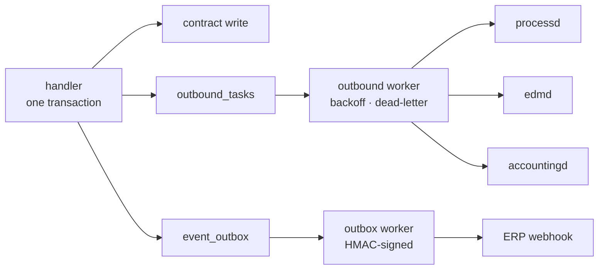
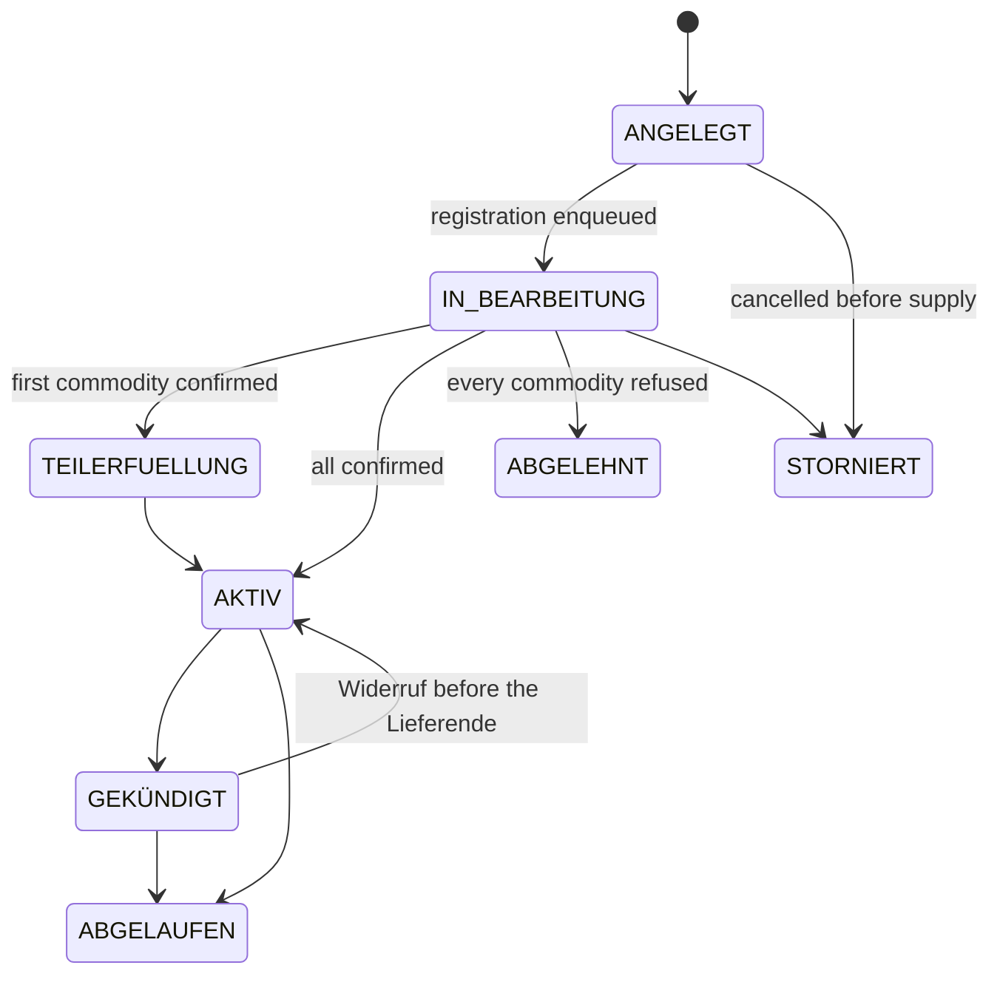

+++
title = "vertragd Operator Guide"
description = "vertragd operator guide: retail contract lifecycle for B2C and B2B. The statutory notice periods (§ 20 GVV, § 41 Abs. 5 and § 41b Abs. 5 EnWG, § 309 Nr. 9 BGB) as testable rules, durable outbound dispatch, DSGVO Art. 15/17, and OIDC → MaLo authorization for portald."
weight = 35
[extra]
mermaid = true
+++
# `vertragd` — Contract & Customer Management

`vertragd` is the **customer registry and retail contract lifecycle engine** for
both B2C (private households) and B2B (commercial, RLM) customers. It owns the
chain from customer identity to supply contract to billing-account provisioning,
and it is the single authorization gateway between OIDC identities and MaLo IDs.

Port: **`:9780`** · PostgreSQL · OIDC/JWT on every route

## The rules live in one module

Every deadline `vertragd` enforces comes from a statute, and the statute differs
by *which* contract and *which* customer. Spreading that across handlers is how
a service ends up with four notice periods and no way to say which one is right,
so they are pure functions in `src/domain.rs` — no HTTP, no SQL, no clock.

| Rule | Source | Value |
|---|---|---|
| Kündigung Grundversorgung | § 20 Abs. 1 StromGVV / GasGVV | 2 Wochen, jederzeit |
| Kündigungsbestätigung | § 41 Abs. 8 Nr. 2 EnWG, § 20 Abs. 2 GVV | unverzüglich, Textform |
| Kündigung Sondervertrag | Vertrag, gedeckelt durch § 309 Nr. 9 lit. c BGB | ≤ 1 Monat für Verbraucher |
| Sonderkündigung Preisanpassung | § 41 Abs. 5 Satz 4 EnWG, § 5 Abs. 3 GVV | fristlos zum Wirksamwerden |
| Sonderkündigung Umzug | § 41b Abs. 5 EnWG | 6 Wochen (Haushaltskunden) |
| Preisänderungsanzeige Sondervertrag | § 41 Abs. 5 Satz 2 EnWG | 1 Monat (Haushaltskunde) — ein **Kalendermonat** nach § 188 Abs. 2 BGB, kein 30-Tage-Fenster; sonst 2 Wochen |
| Preisänderungsanzeige Grundversorgung | § 5 Abs. 2 StromGVV / GasGVV | 6 Wochen, nur zum Monatsersten |
| Erstlaufzeit Verbrauchervertrag | § 309 Nr. 9 lit. a BGB | ≤ 24 Monate |
| Stillschweigende Verlängerung | § 309 Nr. 9 lit. b BGB | nur unbefristet, ≤ 1 Monat kündbar |
| Ersatzversorgung | § 38 Abs. 4 EnWG | endet spätestens nach 3 Monaten |

### Two stored facts pick the column

- **`versorgungsvertraege.vertragsart`** — `GRUNDVERSORGUNG`,
  `ERSATZVERSORGUNG` or `SONDERVERTRAG`. An unrecognised value reads as
  `SONDERVERTRAG`, the regime with the least statutory privilege, so a typo
  cannot silently claim Grundversorgungs-Fristen.
- **`kunden.haushaltskunde`** — § 3 Nr. 57 EnWG. This is deliberately **not** the
  same fact as `kundentyp`: a commercial customer consuming no more than
  10 000 kWh a year is a Haushaltskunde, and three deadlines turn on it. It
  defaults to `kundentyp == "B2C"` and is correctable afterwards, because
  consumption changes.

## Nothing is dispatched from a detached task

A Lieferbeginn is an obligation — the customer has a contract and the NB is
waiting for the UTILMD. Firing it from a `tokio::spawn` meant a restart between
the contract insert and the `processd` call dropped the registration in silence,
leaving the component in `ANGELEGT` with nothing left to retry it. The same held
for the Schlussablesung, the tariff assignment and the billing account.

So the *intent* is written in the same transaction as the contract change, and
workers perform it afterwards.



**`outbound_tasks`** carries every service-to-service call — `LIEFERBEGINN`,
`LIEFERENDE`, `ABLESUNG_BEGINN`, `ABLESUNG_ENDE`, `ABRECHNUNGSKONTO`. Exponential backoff from 30 s to an hour, dead-lettered
after eight attempts, claimed with `FOR UPDATE SKIP LOCKED` so several replicas
share one queue. A unique `dedupe_key` makes the enqueue exactly-once: a
repeatable action varies its key by what makes it distinct
(`PRODUKTZUORDNUNG:{komp}:{wirksamkeit}:{code}`), a one-shot one does not
(`LIEFERBEGINN:{komp}`) — which is what stops an idempotent re-POST of the same
`erp_contract_id` producing a second UTILMD.

**`event_outbox`** carries every customer-facing `de.vertrag.*` CloudEvent,
including the statutory notices. A notice the supplier owes must not depend on
the ERP being reachable at the moment a worker happens to run.

A crash therefore costs a retry, never an obligation. What the retries could not
discharge is the operator's work queue:

```bash
curl -s http://vertragd:9780/api/v1/outbound/dead
curl -X POST http://vertragd:9780/api/v1/outbound/dead/{id}/retry
```

## Authentication

Every REST route extracts `Claims`. The extractor verifies the token *and*
rejects one whose `mako_tenant` is not this deployment's — a validly signed
token from another operator in the same OIDC realm is otherwise
indistinguishable from a local one. The check sits in extraction rather than in
the handlers, so a route added later cannot skip it without also dropping
authentication; the `401` detail is generic and the mismatch is logged at `WARN`.

The two webhook routes carry no operator token and are authenticated by the
shared Standard Webhooks signature over the raw body. `vertragd` refuses to start
without **both** `[oidc]` and `inbound_secret` unless the deployment sets
`allow_insecure_no_auth = true`: a forged event on `POST /api/v1/events`
confirms supply, and one on `POST /api/v1/webhooks/angebot` creates a contract.

`billingd` and `portald` read contract data with an `[[oidc.service_keys]]`
credential.

## Data model

```text
Kunde (B2C: Haushalt/SLP, B2B: Unternehmen/RLM/HV)
├── N × KundenIdentitaet   OIDC portal users; 1:1 for B2C, 1:N for B2B
├── [B2B] Rahmenvertrag    shared pricing, Sammelrechnung, indexation, angebot_id
│    └── N × Versorgungsvertrag        one per site
│          └── N × Vertragskomponente  one per commodity
└── [B2C] Versorgungsvertrag
       └── N × Vertragskomponente
```

`vertrags_nr` and `rahmenvertrag_nr` come from a sequence, so no contract exists
without the number § 41 Abs. 1 Nr. 1 EnWG expects it to identify itself by — and
that every invoice, Mahnung and support call quotes.

### Contract status



The status is derived from the component statuses and never returns from a
terminal state: a late or replayed MaKo outcome re-derives it, and that
derivation knows nothing about a Kündigung. Note that `ABGELEHNT` and
`STORNIERT` are different answers — a registration the NB refused is not a
cancellation by the customer.

## Portal authorization (OIDC → MaLo)

`vertragd` decouples the **legal entity** (Kunde) from **portal users**
(KundenIdentitaeten). A B2B company has one Kunde record and N employee logins.

```text
Customer logs into portald
  → portald extracts the verified JWT `sub`
  → GET vertragd /api/v1/kunden/by-sub/{sub}
     → { kunde, rolle, standort_filter, active_malo_ids }
  → portald scopes every later request to those MaLos
```

| rolle | Portal access |
|---|---|
| `VOLLZUGRIFF` | Full read/write |
| `ADMIN` | All data + identity management |
| `FINANZEN` | Invoices, balance, SEPA mandates |
| `TECHNIK` | Lastgang, readings, device status — no billing |
| `READONLY` | Read-only within the site scope |

`GET /api/v1/kunden/authenticate?malo_id=…` is the per-request check. Every
"not authorized" outcome — unknown sub, sub with no customer, customer that does
not own the MaLo, MaLo outside the identity's `standort_filter` — returns the
**same `403`**. A distinct `404` for "no such customer" would let a holder of any
valid token probe which subjects and MaLo IDs exist (DSGVO Art. 32).

`portald`, `billingd` and `accountingd` never decode JWTs or keep their own
customer↔MaLo maps. All authorization flows through here, which is what closes
IDOR and enables DSGVO Art. 5 Abs. 1 lit. f data minimisation.

## Kündigung

The notice period comes from the **reason**, not from the contract record, so
the API answers what is possible before it is asked to do it:

```bash
curl -s http://vertragd:9780/api/v1/vertraege/{id}/kuendigungsfrist
```

```json
{
  "vertragsart": "GRUNDVERSORGUNG",
  "haushaltskunde": true,
  "eingang": "2026-09-01",
  "fristen": {
    "ORDENTLICH":         { "fruehestens": "2026-09-15", "frist": "2 Wochen",
                            "rechtsgrundlage": "§ 20 Abs. 1 StromGVV / GasGVV" },
    "UMZUG":              { "fruehestens": "2026-10-13", "frist": "6 Wochen",
                            "rechtsgrundlage": "§ 41b Abs. 5 EnWG" },
    "PREISANPASSUNG":     { "fruehestens": "2026-09-01",
                            "frist": "fristlos zum Wirksamwerden der Änderung",
                            "rechtsgrundlage": "§ 5 Abs. 3 StromGVV / GasGVV" },
    "LIEFERANTENWECHSEL": { "fruehestens": "2026-09-15", "frist": "2 Wochen" }
  }
}
```

```bash
curl -X POST http://vertragd:9780/api/v1/vertraege/{id}/kuendigen \
  -H 'Content-Type: application/json' \
  -d '{"lieferende":"2026-10-13","grund":"UMZUG","eingang":"2026-09-01"}'
# → 202 { "status": "GEKÜNDIGT", "frist": "6 Wochen",
#         "rechtsgrundlage": "§ 41b Abs. 5 EnWG", "mako_dispatched": 1 }
```

A `lieferende` earlier than the rule allows is a **422 that quotes the rule**.
One transaction then records the end date on each live component, enqueues the
Lieferende UTILMDs *and* the Schlussablesung, sets `vertragsende` to the
Kündigungstermin, clears `auto_renewal`, and emits `de.vertrag.kuendigung`
carrying the § 41 Abs. 8 Nr. 2 EnWG Textform confirmation the supplier owes the
customer.

**Supply does not end when the Kündigung is filed.** A termination three months
out leaves the customer supplied — and billable — for those three months, so the
components keep their status until the date arrives. The daily worker then ends
them and closes the contract, emitting `de.vertrag.abgeschlossen`, which is what
a Schlussrechnung and the § 147 AO retention clock hang off. Ending them at
filing time took the remaining months and the Schlussrechnung out of the § 40b
feed, and left the contract in `GEKÜNDIGT` for ever.

`eingang` exists because the notice period runs from **receipt**: an operator
keying in a letter that arrived last week has to be able to say so.

The Schlussablesung is enqueued as a task of its own rather than as a step of
the Lieferende, because it is the LF's own obligation — a `processd` outage must
not cost the customer the reading their Schlussrechnung is built from.

### Widerruf and Stornierung

`POST /api/v1/vertraege/{id}/widerruf-kuendigung` reverts a Kündigung while its
Lieferende is still ahead, restoring exactly the components it ended.
`POST /api/v1/vertraege/{id}/stornieren` cancels a contract that never went into
supply and **withdraws a registration still waiting in the queue**; one already
sent to `processd` is cancelled there, and the response says which case it was.

## Tarifwechsel

A Tarifwechsel changes price, not supply — no UTILMD, no MaKo status change.
Three things are enforced at the API boundary, so compliance is structural
rather than something a worker notices afterwards:

| Refusal | Rule |
|---|---|
| Wirksamkeit inside the price-guarantee window | the contract's `preisgarantie_bis` |
| Wirksamkeit closer than the notice period | § 41 Abs. 5 Satz 2 EnWG / § 5 Abs. 2 GVV |
| Grundversorgungspreis mid-month | § 5 Abs. 2 StromGVV / GasGVV |

```bash
curl -X POST …/tarifwechsel -d '{"komp_id":"…","new_product_code":"STROM-PREMIUM-2027","wirksamkeit":"2026-09-05"}'
# → 422 { "error": "die Wirksamkeit wahrt die gesetzliche Ankündigungsfrist nicht",
#         "fruehestens": "2026-09-18", "frist": "1 Monat",
#         "rechtsgrundlage": "§ 41 Abs. 5 Satz 2 EnWG" }
```

An operator bypass of the price guarantee requires a documented customer waiver
and is written to `preisgarantie_override_log` with the operator's token
subject. A retroactive correction (`wirksamkeit ≤ today`) applies immediately
and is exempt from the notice rules: it is not an announced price change but the
repair of one already agreed.

Whichever branch runs, the change is **one slice write in the contract's own
transaction**. There is nothing to project anywhere and nothing to reconcile.

### Which product a MaLo is on lives here

Agreeing it is a Tarifwechsel — a contract act under § 41 Abs. 5 EnWG, guarded
by the Preisgarantie — so it is a contract fact, stored once, as valid-time
slices on the component:

```text
[gueltig_von, gueltig_bis)   gueltig_bis is the first day NOT covered
```

`kp_no_overlap` (GiST) makes two products for one component on one day
unrepresentable, and half-open ranges make consecutive slices tile a billing
period exactly.

```http
GET /api/v1/malo/{malo_id}/produkte?from=2026-11-01&to=2026-11-30
```

```json
{
  "slice_count": 2,
  "fully_covered": true,
  "slices": [
    { "product_code": "STROM-ALT", "gueltig_von": "2026-11-01", "gueltig_bis": "2026-11-15" },
    { "product_code": "STROM-NEU", "gueltig_von": "2026-11-15", "gueltig_bis": "2026-12-01" }
  ]
}
```

`billingd` bills one leg per slice; [`tarifbd`](@/docs/services/tarifbd.md)
answers what each code costs on its own dates and does not know who is on it.

**A future-dated Tarifwechsel is a slice that starts in the future** — no
pending state, nothing to apply on the day. Re-applying the same change is
idempotent; a change dated *behind* a later one is refused, because it would
reprice a period already decided.

## DSGVO

### Art. 15 / Art. 20 — access and portability

`GET /api/v1/kunden/{id}/export` returns the complete record: Kunde, Person,
Zahlungsinformation, portal identities, contracts and components. Every read
propagates its error rather than being swallowed — an Auskunft that silently
omits a category because a query failed is worse than no answer.

### Art. 17 — erasure

```bash
curl -X POST http://vertragd:9780/api/v1/kunden/{id}/anonymize \
  -d '{"requested_by":"dpo"}'
```

**`409` while supply runs.** The data is needed to perform the contract
(Art. 6 Abs. 1 lit. b DSGVO), so Art. 17 Abs. 1 lit. a does not apply and
Art. 17 Abs. 3 lit. b keeps what the § 41 EnWG obligations require. The response
names the contracts, so the answer to the data subject writes itself. `force`
covers the cases where erasure applies regardless (Art. 17 Abs. 1 lit. d,
unlawful processing) and demands a `request_reason` on record.

Once it applies, **one transaction** pseudonymises the Geschäftspartner, the
Person, the Zahlungsinformation, the VAT-ID, the notes, **the supply address**
and every portal login — each with its own pseudonym, because a B2B customer has
several and one token for all of them violates `UNIQUE (tenant, oidc_sub)`.
The contract rows survive without personal data for § 147 Abs. 3 AO
(Handelsbriefe 6 Jahre, Buchungsbelege 8 Jahre), and `anonymization_log` records
what was overwritten, by whom and why.

## Background workers

| Worker | Cadence | What it does |
|---|---|---|
| Outbound | 5 s | Drains `outbound_tasks`, up to 64 per wake-up |
| Outbox | per `mako_service::outbox` | Delivers `de.vertrag.*` to the ERP webhook |
| Preisanpassung | daily | Sends the § 41 Abs. 5 notice for every scheduled Tarifwechsel whose notice is still owed, and issues it as a document where `outputd` is configured |
| Auto-renewal | daily | Announces the extension once per term, then applies it |
| Ablauf | daily | Ends supply whose Lieferende has passed and closes the contract behind it; announces a term or price guarantee running out, once per date |

### The price-change notice

The notice is sent as soon as the change is scheduled, not inside a window
before it. § 41 Abs. 5 Satz 1 EnWG wants it *rechtzeitig* and Satz 2 sets a
floor, not a ceiling, so a window could only ever make the notice later — and
skipped it entirely whenever the worker missed the one day the window was open.
The event carries the regime that applied, whether the statutory lead was
actually met, and the Sonderkündigungsrecht § 41 Abs. 5 Satz 4 EnWG grants the
customer to the day the change lands, free of charge.

Where `outputd_url` is configured the notice is additionally **rendered and
delivered** as a `PREISANPASSUNG` document — portal, e-mail and post as the
customer's master data allows — and the document id is stamped on the slice. The
CloudEvent goes out either way and first, since it is the durable obligation and
must not depend on a renderer being up.

Three things make a notice unissuable, each logged with what is missing rather
than silently skipped: no `[absender]` configured (§ 126b BGB names the
declarant), no customer on file for the Marktlokation (§ 126b names the
recipient), and **no announced prices**.

That last one is the substantive constraint. § 41 Abs. 5 Satz 1 wants the
**Umfang** of the change, which one sentence cannot state — a customer whose
Arbeitspreis rises while their Grundpreis falls has to see both — so a notice
that lists no price lines is not a valid Preisänderungsanzeige and is not
issued. The lines travel with the Tarifwechsel that schedules the change:

```bash
curl -X POST …/tarifwechsel -d '{
  "komp_id": "…", "new_product_code": "STROM-PREMIUM-2027",
  "wirksamkeit": "2026-11-01",
  "grund": "Gestiegene Beschaffungskosten und geänderte Netzentgelte.",
  "preise": [
    {"bezeichnung":"Arbeitspreis","einheit":"ct/kWh","bisher":"34.90","neu":"37.20"},
    {"bezeichnung":"Grundpreis","einheit":"EUR/Jahr","bisher":"143.88","neu":"131.40"}
  ]
}'
```

The caller supplies them because the caller chose the tariff and holds both
price sheets — `vertragd` owns which product a Marktlokation is on, `tarifbd`
owns what it costs, and the two are deliberately uncoupled. More to the point,
what a notice *said* is a fact about the notice: a catalogue lookup years later
answers what the price is, not what the customer was told, which is exactly the
question a Schlichtungsstelle asks.

### The automatic extension

For a **consumer** the contract becomes **unbefristet** with at most a month's
notice — the only tacit extension § 309 Nr. 9 lit. b BGB permits. Rolling such a
contract into another twelve-month term is an unenforceable clause, and it is
the customer who finds that out. A **business** contract may take a further
fixed term (§ 310 Abs. 1 BGB puts it outside § 309).

Each notice is tracked against the term or date it announces
(`autoerneuerung_notif_fuer`, `ablauf_notif_fuer`), so the daily loop sends it
once instead of once a day — and the next term's notice is still due.

## § 40b EnWG billing cadence

Every Versorgungsvertrag carries an `abrechnungszyklus` (`MONATLICH` /
`VIERTELJAEHRLICH` / `HALBJAEHRLICH` / `JAEHRLICH`, default annual). § 40b EnWG
obliges the supplier to offer the shorter cadences; the customer's choice is a
contract fact. `GET /api/v1/vertraege/billing-candidates` lists every active
supply component with its cadence and supply window, and billingd's billing-run
worker consumes it.

A component is in supply from the moment the MaKo Lieferbeginn is confirmed —
`BESTAETIGT` is that state, and nothing ever promotes it to `AKTIV`, so the feed
accepts both.

## § 41e EnWG Aggregatorverträge

VPP contracts between an Aggregator and a plant operator or Letztverbraucher,
the German transposition of Art. 17 RL (EU) 2019/944. `PUT`/`GET
/api/v1/aggregatorvertraege` map an SR-ID to the agreed Einsatzkosten and a
validity window; `billingd` reads them per dispatch and keeps no copy. An
`EXCLUDE USING gist` constraint makes two simultaneously active contracts per
resource unrepresentable, surfaced as a `409`.

## §§ 9, 10 MsbG Messstellenverträge

The contract a Messstellenbetreiber holds with the Anschlussnutzer for one
Messlokation. `GET`/`PUT /api/v1/messstellenvertraege/{melo_id}/{msb_mp_id}`;
`processd` reads it to answer a WiM Kündigung MSB out of `E_0200` and keeps no
copy.

WiM Strom Teil 1 Kap. 2.1.3 makes that Kündigung a **contract-layer** process
between the two MSB — the Netzbetreiber is not a party — so every Prüfschritt is
a question about this row: the notice period binds a requested Termin (`Z12`),
an existing `kuendigung_zum` opens the Kap. 2.2.3 table (`Z34`), `beendet_am` is
`Z29`, and no row at all is `ZC9`.

The `GET` returns the contract plus `naechstmoeglich`, the date a Kündigung
received on `?on=` could take effect. It is **derived** from
`kuendigungsfrist_monate` by the same [`domain`](#the-rules-live-in-one-module)
cap that governs a Versorgungsvertrag, so there is one date to keep correct
rather than two. `?haushaltskunde=false` opts out of the § 309 Nr. 9 lit. c BGB
one-month cap for a business customer.

`kunden_id` is optional: a gMSB serving a Messlokation under its statutory
Grundzuständigkeit (§ 3 MsbG) has no contract with a named customer, and a
required foreign key would force a phantom Kunde for every such Messlokation.

## § 42b EnWG GGV-Betreiber

The operator of a Gemeinschaftliche Gebäudeversorgung is the LF's *customer* for
the bundled GGV Sammelrechnung — the BG-7 buyer of that document. It is
deliberately not a Marktpartner: a GGV-Betreiber has no MP-ID and never appears
in MaKo, so its master data lives here with every other buyer rather than in
`marktd`. `GET`/`PUT /api/v1/ggv/{ggv_id}/betreiber` maps the operator-assigned
`ggv_id` to a Kunde.

## Which contracts live here

Two services hold contracts and the line between them is the counterparty. A
contract whose parties are both Marktpartner with an MP-ID is market data and
lives in `marktd` — the Netznutzungsvertrag (`nb_contracts`, NB ↔ LF) and the
MSB-Rahmenvertrag Gas (`msb_rahmenvertraege_gas`, GNB ↔ MSB), where every
settlement already reads Netzebene and Bilanzierungsmethode. A contract with a
Kunde on one side lives here, with the lifecycle and the statutory notice
periods that govern it: Versorgungs-, Rahmen-, Messstellen- and
Aggregatorverträge, and the GGV-Betreiber behind a § 42b Sammelrechnung.

There is deliberately no *Einspeisevertrag*. § 7 Abs. 1 EEG 2023 („Gesetzliches
Schuldverhältnis") forbids the Netzbetreiber from making its EEG obligations
conditional on a contract, so the feed-in relationship is not one. What the
settlement needs is a party record, and that lives with the plants in
[`einsd`](@/docs/services/einsd.md) as `einspeiser`.

## Configuration

```toml
# vertragd.toml
port     = 9780
tenant   = "9900357000004"   # data-isolation key (here: the operator's BDEW-Codenummer)
lf_mp_id = "9900357000004"   # market identity registered on the UTILMD

processd_url    = "http://processd:8580"
tarifbd_url     = "http://tarifbd:9080"
accountingd_url = "http://accountingd:9380"
edmd_url        = "http://edmd:8380"
edmd_api_key    = "env:VERTRAGD_EDMD_SERVICE_KEY"

erp_webhook_url = "http://erp:8000/events"
erp_hmac_secret = "env:VERTRAGD_ERP_HMAC_SECRET"
inbound_secret  = "env:VERTRAGD_INBOUND_SECRET"

max_identitaeten_per_kunde = 50

[database]
url = "postgresql://vertragd:secret@db:5432/vertragd"

[oidc]
issuer   = "https://auth.example.de/realms/mako"
audience = "vertragd"
```

`tenant` and `lf_mp_id` are the same string in a single-mandant install and
different in a shared one. Sending the wrong one produces UTILMDs from a party
the NB does not know, which is why they are separate settings rather than one.

## MCP

17 read-only tools and 4 prompts at `/mcp`, behind an independent API-key or
OIDC layer. `compute_kuendigungsfrist` returns the earliest lawful end date for
**every** termination reason with the rule that produced it;
`check_mako_trigger_status` distinguishes a registration still waiting in the
outbound queue from one the NB has not answered — a distinction an operator
otherwise cannot see.

## Related

| | |
|---|---|
| [`portald`](@/docs/services/portald.md) | Customer portal; authorizes every request here |
| [`billingd`](@/docs/services/billingd.md) | Reads § 40 Abs. 1 facts, BG-7 buyers, § 40b candidates |
| [`tarifbd`](@/docs/services/tarifbd.md) | Product catalog; receives the tariff assignments |
| [`processd`](@/docs/services/processd.md) | Runs the GPKE / GeLi Gas Lieferbeginn and Lieferende |
| [`edmd`](@/docs/services/edmd.md) | Beginn- and Schlussablesung reading orders |
