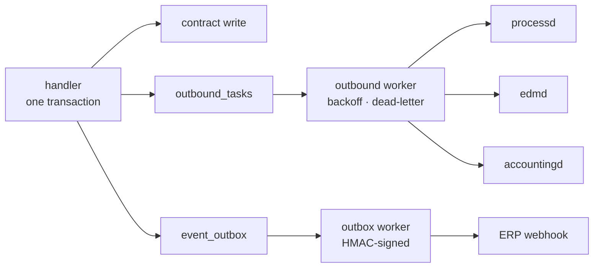
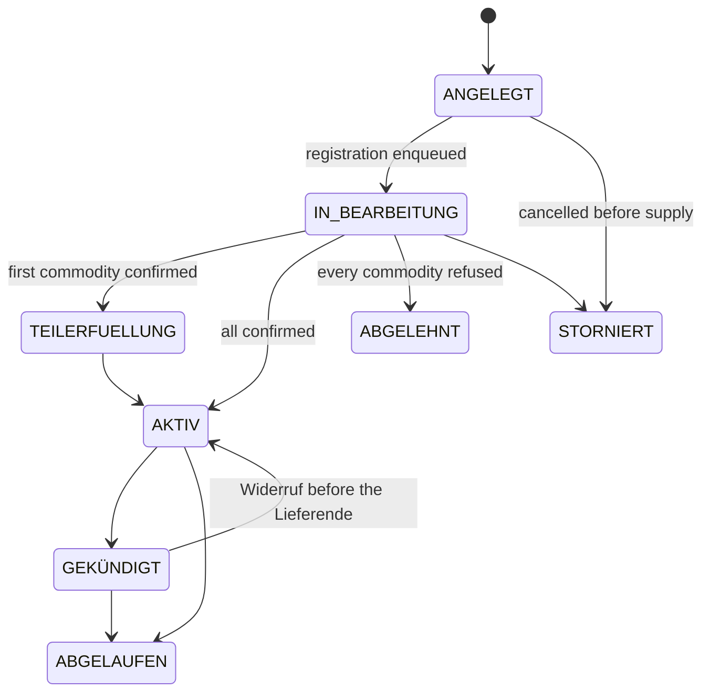

+++
title = "vertragd Operator Guide"
description = "Operator guide for vertragd, contract and customer management: B2C and B2B Verträge, Rahmenverträge, Kündigungsfristen and §41 EnWG price-change duties."
weight = 35
+++
`vertragd` is the **customer registry and retail contract lifecycle engine** for
both B2C (private households) and B2B (commercial, RLM) customers. It owns the
chain from customer identity to supply contract to billing-account provisioning,
and it is the single authorization gateway between OIDC identities and MaLo IDs.

A **MaLo** (Marktlokation) is the grid point a customer takes energy at — the thing
a supply contract is *about*, and the key every market message carries
([Market Objects](@/docs/architecture/domain-model.md#market-objects-objekte)). The
operator running this service holds the **LF** role (Lieferant, the supplier); its
counterparties are the **NB** (Netzbetreiber, grid operator) and the **MSB**
(Messstellenbetreiber, metering operator)
([Party Roles](@/docs/architecture/domain-model.md#party-roles-marktrollen)). Where
this page says a contract change is "dispatched to MaKo", it means an EDIFACT
**UTILMD** message to one of them, sent by
[`processd`](@/docs/services/processd.md) and
[`makod`](@/docs/services/makod.md) — `vertragd` itself speaks no EDIFACT.

Port: **`:9780`** · PostgreSQL · OIDC/JWT on every route

## The rules live in one module

Every deadline `vertragd` enforces comes from a statute, and the statute differs
by *which* contract and *which* customer. Spreading that across handlers is how
a service ends up with four notice periods and no way to say which one is right,
so they are pure functions in `src/domain.rs` — no HTTP, no SQL, no clock.

| Rule | Source | Value |
|---|---|---|
| Kündigung Grundversorgung | § 20 Abs. 1 StromGVV / GasGVV | 2 Wochen, jederzeit |
| Kündigungsbestätigung | § 41 Abs. 8 Nr. 2 EnWG, § 20 Abs. 2 GVV | unverzüglich, Textform |
| Kündigung Sondervertrag | Vertrag, gedeckelt durch § 309 Nr. 9 lit. c BGB | ≤ 1 Monat für Verbraucher |
| Sonderkündigung Preisanpassung | § 41 Abs. 5 Satz 4 EnWG, § 5 Abs. 3 GVV | fristlos zum Wirksamwerden |
| Sonderkündigung Umzug | § 41b Abs. 5 EnWG | 6 Wochen (Haushaltskunden) |
| Preisänderungsanzeige Sondervertrag | § 41 Abs. 5 Satz 2 EnWG | 1 Monat (Haushaltskunde) — ein **Kalendermonat** nach § 188 Abs. 2 BGB, kein 30-Tage-Fenster; sonst 2 Wochen |
| Preisänderungsanzeige Grundversorgung | § 5 Abs. 2 StromGVV / GasGVV | 6 Wochen, nur zum Monatsersten |
| Erstlaufzeit Verbrauchervertrag | § 309 Nr. 9 lit. a BGB | ≤ 24 Monate |
| Stillschweigende Verlängerung | § 309 Nr. 9 lit. b BGB | nur unbefristet, ≤ 1 Monat kündbar |
| Ersatzversorgung | § 38 Abs. 4 EnWG | endet spätestens nach 3 Monaten |

### Two stored facts pick the column

- **`versorgungsvertraege.vertragsart`** — `GRUNDVERSORGUNG`,
  `ERSATZVERSORGUNG` or `SONDERVERTRAG`. An unrecognised value reads as
  `SONDERVERTRAG`, the regime with the least statutory privilege, so a typo
  cannot silently claim Grundversorgungs-Fristen.
- **`kunden.haushaltskunde`** — § 3 Nr. 57 EnWG. This is deliberately **not** the
  same fact as `kundentyp`: a commercial customer consuming no more than
  10 000 kWh a year is a Haushaltskunde, and three deadlines turn on it. It
  defaults to `kundentyp == "B2C"` and is correctable afterwards, because
  consumption changes.

## Nothing is dispatched from a detached task

A Lieferbeginn is an obligation — the customer has a contract and the NB is
waiting for the UTILMD. Firing it from a `tokio::spawn` meant a restart between
the contract insert and the `processd` call dropped the registration in silence,
leaving the component in `ANGELEGT` with nothing left to retry it. The same held
for the Schlussablesung and the billing account.

So the *intent* is written in the same transaction as the contract change, and
workers perform it afterwards.



**`outbound_tasks`** carries every service-to-service call — `LIEFERBEGINN`,
`LIEFERENDE`, `ABLESUNG_BEGINN`, `ABLESUNG_ENDE`, `ABRECHNUNGSKONTO`. Exponential backoff from 30 s to an hour, dead-lettered
after eight attempts, claimed with `FOR UPDATE SKIP LOCKED` so several replicas
share one queue. A unique `dedupe_key` makes the enqueue exactly-once: a
repeatable action varies its key by what makes it distinct
(`ABLESUNG_ENDE:{komp}:{geplant_am}`), a one-shot one does not
(`LIEFERBEGINN:{komp}`) — which is what stops an idempotent re-POST of the same
`erp_contract_id` producing a second UTILMD. The reading order carries its planned
date for exactly that reason: keyed on the component alone, a Kündigung withdrawn
and re-issued to a different Lieferende collided with its own predecessor and
`ON CONFLICT DO NOTHING` dropped it — `edmd` then read the meter on the withdrawn
date and nothing reported a failure.

**`event_outbox`** carries every customer-facing `de.vertrag.*` CloudEvent,
including the statutory notices. A notice the supplier owes must not depend on
the ERP being reachable at the moment a worker happens to run.

A crash therefore costs a retry, never an obligation. What the retries could not
discharge is the operator's work queue:

```bash
curl -s http://vertragd:9780/api/v1/outbound/dead
curl -X POST http://vertragd:9780/api/v1/outbound/dead/{id}/retry
```

## Authentication

Every REST route extracts `Claims`. The extractor verifies the token *and*
rejects one whose `mako_tenant` is not this deployment's — a validly signed
token from another operator in the same OIDC realm is otherwise
indistinguishable from a local one. The check sits in extraction rather than in
the handlers, so a route added later cannot skip it without also dropping
authentication; the `401` detail is generic and the mismatch is logged at `WARN`.

The two webhook routes carry no operator token and are authenticated by the
shared Standard Webhooks signature over the raw body. `vertragd` refuses to start
without **both** `[oidc]` and `inbound_secret` unless the deployment sets
`allow_insecure_no_auth = true`: a forged event on `POST /api/v1/events`
confirms supply, and one on `POST /api/v1/webhooks/angebot` creates a contract.

`billingd` and `portald` read contract data with an `[[oidc.service_keys]]`
credential.

## Authorization

Two kinds of principal reach this service, and the split between them is the
`mako_roles` claim:

- an **operator** — the supplier's own staff, and the peer services (`portald`,
  `processd`, `billingd`, `makod`) calling with a service credential — carries a
  market role: `LF`, `MSB`, `ESA` or `ADMIN`;
- a **portal customer** carries a token from the portal realm and **no market
  role at all**.

`services/vertragd/policies/vertragd.cedar` states 24 actions over that split.
Two are customer-scoped, because their answer is about the token's own subject:
`authenticate-portal-identity` (does this identity own this Marktlokation?) and
`read-own-portal-identity` (the `by-sub` lookup, admitted only once the handler
has established that the requested subject *is* the caller's). Neither can be
pointed at another customer, so neither needs a role.

Every other action — reading a customer's profile or bank details, creating or
terminating supply, a Tarifwechsel, granting portal access, a DSGVO Art. 15/17
export or erasure, the outbound queue, the whole `/mcp` surface — requires one
of the four market roles *and* a matching tenant.

> **Deployment invariant: the portal IdP realm must not issue `mako_roles`.** An
> IdP that puts a market role on a customer token makes that customer an operator
> of this service, with reach across every customer in the tenant.

### The 24 actions

Every action below is checked with `authorize(&enforcer, &claims, …)` in its
handler; the policy tests `context.principal_tenant`, `context.principal_roles`
and `context.resource_tenant` — never attributes on the principal entity. A
denial is a `403`.

| Action | Routes |
|---|---|
| `authenticate-portal-identity` ᶜ | `GET /kunden/authenticate` |
| `read-own-portal-identity` ᶜ | `GET /kunden/by-sub/{sub}`, own subject only |
| `read-kunde` | `GET /kunden[/{id}]`, `/{id}/person`, `/{id}/portfolio`, `/by-sub/{sub}` for a foreign subject |
| `write-kunde` | `POST /kunden`, `PUT /kunden/{id}`, `PUT /kunden/{id}/person` |
| `read-zahlungsinformation` · `write-zahlungsinformation` | `GET` / `PUT /kunden/{id}/zahlungsinformation` |
| `read-portal-identitaeten` | `GET /kunden/{id}/identitaeten` |
| `manage-portal-identitaeten` | `POST /kunden/{id}/identitaeten`, `DELETE …/{sub}` |
| `export-kunde` | `GET /kunden/{id}/export` (DSGVO Art. 15/20) |
| `anonymize-kunde` | `POST /kunden/{id}/anonymize` (DSGVO Art. 17) |
| `read-vertrag` | every contract `GET` — `/malo/{id}/produkte`, `billing-candidates`, `expiring`, `by-malo`, Kündigungsfrist, Preisgarantie |
| `create-vertrag` | `POST /kunden/{id}/vertraege` |
| `kuendigen-vertrag` | `POST /vertraege/{id}/kuendigen`, `/widerruf-kuendigung` |
| `stornieren-vertrag` | `POST /vertraege/{id}/stornieren` |
| `tarifwechsel-vertrag` | `POST /vertraege/{id}/tarifwechsel` |
| `write-preisgarantie` | `PUT /vertraege/{id}/preisgarantie` |
| `read-rahmenvertrag` | `GET /rahmenvertraege[/{id}[/malos]]`, `GET /kunden/{id}/rahmenvertraege` |
| `create-rahmenvertrag` | `POST /kunden/{id}/rahmenvertraege` |
| `kuendigen-rahmenvertrag` | `POST /rahmenvertraege/{id}/kuendigen` |
| `read-stammdaten` · `write-stammdaten` | `GET` / `PUT` of `/ggv/{id}/betreiber`, `/aggregatorvertraege`, `/messstellenvertraege/{melo}/{msb}` |
| `read-outbound-tasks` | `GET /outbound/dead` |
| `retry-outbound-task` | `POST /outbound/dead/{id}/retry` |
| `use-mcp` | the whole `/mcp` surface, gated once by the shared `McpAuth` middleware rather than per tool |

ᶜ = customer-scoped: tenant equality only, no market role.

The two inbound webhooks (`POST /api/v1/events`,
`POST /api/v1/webhooks/angebot`) carry no token at all — they are authenticated
by the `inbound_secret` HMAC — so they carry no Cedar action either.

`use-mcp` is an operator's despite being read-only by construction: it reads
customer profiles and bank details across the whole tenant.

### Why the operator split stops here

A finer split — separating the DSGVO erasure and the IBAN write from ordinary
contract work — would need a job-function axis, and `mako_roles` carries market
roles only. `anonymization_log` records who erased what and why, and
`preisgarantie_override_log` who bypassed a price lock, so those acts stay
attributable where they are not separately authorised.

## Data model

```text
Kunde (B2C: Haushalt/SLP, B2B: Unternehmen/RLM/HV)
├── N × KundenIdentitaet   OIDC portal users; 1:1 for B2C, 1:N for B2B
├── [B2B] Rahmenvertrag    shared pricing, Sammelrechnung, indexation, angebot_id
│    └── N × Versorgungsvertrag        one per site
│          └── N × Vertragskomponente  one per commodity
└── [B2C] Versorgungsvertrag
       └── N × Vertragskomponente
```

`vertrags_nr` and `rahmenvertrag_nr` come from a sequence, so no contract exists
without the number § 41 Abs. 1 Nr. 1 EnWG expects it to identify itself by — and
that every invoice, Mahnung and support call quotes.

### Contract status



The status is derived from the component statuses and never returns from a
terminal state: a late or replayed MaKo outcome re-derives it, and that
derivation knows nothing about a Kündigung. Note that `ABGELEHNT` and
`STORNIERT` are different answers — a registration the NB refused is not a
cancellation by the customer.

## Portal authorization (OIDC → MaLo)

`vertragd` decouples the **legal entity** (Kunde) from **portal users**
(KundenIdentitaeten). A B2B company has one Kunde record and N employee logins.

```text
Customer logs into portald
  → portald extracts the verified JWT `sub`
  → GET vertragd /api/v1/kunden/by-sub/{sub}
     → { kunde, rolle, standort_filter, active_malo_ids }
  → portald scopes every later request to those MaLos
```

| rolle | Portal access |
|---|---|
| `VOLLZUGRIFF` | Full read/write |
| `ADMIN` | All data + identity management |
| `FINANZEN` | Invoices, balance, SEPA mandates |
| `TECHNIK` | Lastgang, readings, device status — no billing |
| `READONLY` | Read-only within the site scope |

`GET /api/v1/kunden/authenticate?malo_id=…` is the per-request check. Every
"not authorized" outcome — unknown sub, sub with no customer, customer that does
not own the MaLo, MaLo outside the identity's `standort_filter` — returns the
**same `403`**. A distinct `404` for "no such customer" would let a holder of any
valid token probe which subjects and MaLo IDs exist (DSGVO Art. 32).

`portald`, `billingd` and `accountingd` never decode JWTs or keep their own
customer↔MaLo maps. All authorization flows through here, which is what closes
IDOR and enables DSGVO Art. 5 Abs. 1 lit. f data minimisation.

## Kündigung

The notice period comes from the **reason**, not from the contract record, so
the API answers what is possible before it is asked to do it:

```bash
curl -s http://vertragd:9780/api/v1/vertraege/{id}/kuendigungsfrist
```

```json
{
  "vertragsart": "GRUNDVERSORGUNG",
  "haushaltskunde": true,
  "eingang": "2026-09-01",
  "fristen": {
    "ORDENTLICH":         { "fruehestens": "2026-09-15", "frist": "2 Wochen",
                            "rechtsgrundlage": "§ 20 Abs. 1 StromGVV / GasGVV" },
    "UMZUG":              { "fruehestens": "2026-10-13", "frist": "6 Wochen",
                            "rechtsgrundlage": "§ 41b Abs. 5 EnWG" },
    "PREISANPASSUNG":     { "fruehestens": "2026-09-01",
                            "frist": "fristlos zum Wirksamwerden der Änderung",
                            "rechtsgrundlage": "§ 5 Abs. 3 StromGVV / GasGVV" },
    "LIEFERANTENWECHSEL": { "fruehestens": "2026-09-15", "frist": "2 Wochen" }
  }
}
```

The MaKo side asks the same question through `GET
/api/v1/vertraege/by-malo/{malo_id}`, which returns the contract row together
with `naechstmoeglicher_kuendigungstermin`. It takes `?stichtag=YYYY-MM-DD`:
`E_0614` Prüfschritt 70 measures the notice period „unter Berücksichtigung des
**Eingangsdatums der Kündigung**", so `processd` passes the date the 55016
arrived rather than the day it computes the answer. Inside the one-Werktag
window the two usually agree; across a month boundary they differ by a whole
notice period.

It also takes `?kunde=<Name>` and answers `E_0624` Prüfschritt 50 — „Ist der
Kunde aus der Anfrage identisch mit dem Kunden beim LFA?" — as
`kunde_identisch_mit_anfrage`, with the verdict in `kundenidentitaet`
(`IDENTISCH` / `VERSCHIEDEN` / `UNKLAR`). The comparison is on the **set** of
normalised name tokens, not their order: the wire splits a person across
`SG12 NAD+Z09`'s five interchangeable `C080` components while `vertragd` stores
`vorname`/`nachname`, umlauts fold and Rechtsformzusätze are dropped.

**Similarity widens `UNKLAR` and nothing else.** `IDENTISCH` needs the token
sets to be equal — it drives `A32`, an Ablehnung, and a score is not a statement
that two customers are one person. `VERSCHIEDEN` needs no token pair to be even
*similar*, because it walks the tree toward `A34`, which releases the
Marktlokation: „Meier" against „Meyer" must not get there. Between them sit
Jaro-Winkler ≥ 0.90 and Kölner Phonetik — the latter because Soundex and
Metaphone are English-tuned and the German variants that matter
(`Meyer`/`Maier`/`Mayer`) score ≈ 0.87 on any string metric.

```bash
curl -X POST http://vertragd:9780/api/v1/vertraege/{id}/kuendigen \
  -H 'Content-Type: application/json' \
  -d '{"lieferende":"2026-10-13","grund":"UMZUG","eingang":"2026-09-01"}'
# → 202 { "status": "GEKÜNDIGT", "frist": "6 Wochen",
#         "rechtsgrundlage": "§ 41b Abs. 5 EnWG", "mako_dispatched": 1 }
```

A `lieferende` earlier than the rule allows is a **422 that quotes the rule**.
One transaction then records the end date on each live component, enqueues the
Lieferende UTILMDs *and* the Schlussablesung, sets both `vertragsende` and
`kuendigung_zum` to the Kündigungstermin, clears `auto_renewal`, and emits
`de.vertrag.kuendigung`
carrying the § 41 Abs. 8 Nr. 2 EnWG Textform confirmation the supplier owes the
customer.

**Supply does not end when the Kündigung is filed.** A termination three months
out leaves the customer supplied — and billable — for those three months, so the
components keep their status until the date arrives. The daily worker then ends
them and closes the contract, emitting `de.vertrag.abgeschlossen`, which is what
a Schlussrechnung and the § 147 AO retention clock hang off. Ending them at
filing time took the remaining months and the Schlussrechnung out of the § 40b
feed, and left the contract in `GEKÜNDIGT` for ever.

`eingang` exists because the notice period runs from **receipt**: an operator
keying in a letter that arrived last week has to be able to say so.

The Schlussablesung is enqueued as a task of its own rather than as a step of
the Lieferende, because it is the LF's own obligation — a `processd` outage must
not cost the customer the reading their Schlussrechnung is built from.

### Widerruf and Stornierung

`POST /api/v1/vertraege/{id}/widerruf-kuendigung` reverts a Kündigung while its
Lieferende is still ahead, restoring exactly the components it ended.
`POST /api/v1/vertraege/{id}/stornieren` cancels a contract that never went into
supply and **withdraws a registration still waiting in the queue**; one already
sent to `processd` is cancelled there, and the response says which case it was.

## Tarifwechsel

A Tarifwechsel changes price, not supply — no UTILMD, no MaKo status change.

`initiator` is required and has no default, because the two acts are legally
different. `"LIEFERANT"` is the supplier exercising a reserved change right:
§ 41 Abs. 5 Satz 1 EnWG obliges it to announce that, and Satz 4 gives the
customer a fee-free termination right *because* it did. `"KUNDE"` is a tariff the
customer asked for — an agreed change, confirmed rather than announced, carrying
no Sonderkündigungsrecht and held to none of the supplier's notice periods.
Guessing either way misstates the customer's rights.

Three things are enforced at the API boundary, so compliance is structural
rather than something a worker notices afterwards. All three run only for a
supplier-initiated change still ahead of its Wirksamkeit:

| Refusal | Rule |
|---|---|
| Wirksamkeit inside the price-guarantee window | the contract's `preisgarantie_bis` (this one applies to every Tarifwechsel) |
| Wirksamkeit closer than the notice period | § 41 Abs. 5 Satz 2 EnWG / § 5 Abs. 2 GVV |
| Grundversorgungspreis mid-month | § 5 Abs. 2 StromGVV / GasGVV |

```bash
curl -X POST …/tarifwechsel -d '{"komp_id":"…","new_product_code":"STROM-PREMIUM-2027",
                                 "initiator":"LIEFERANT","wirksamkeit":"2026-09-05"}'
# → 422 { "error": "die Wirksamkeit wahrt die gesetzliche Ankündigungsfrist nicht",
#         "fruehestens": "2026-09-18", "frist": "1 Monat",
#         "rechtsgrundlage": "§ 41 Abs. 5 Satz 2 EnWG" }
```

An operator bypass of the price guarantee requires a documented customer waiver
and is written to `preisgarantie_override_log` with the operator's token
subject. A retroactive correction (`wirksamkeit ≤ today`) applies immediately
and is exempt from the notice rules: it is not an announced price change but the
repair of one already agreed.

Whichever branch runs, the change is **one slice write in the contract's own
transaction**. There is nothing to project anywhere and nothing to reconcile.

### BO4E payloads cross the gate

`PUT /kunden/{id}/person`, `/kunden/{id}/zahlungsinformation` and
`/vertraege/{id}/preisgarantie` take BO4E COMs, and each runs
[the gate](@/docs/architecture/domain-model.md#the-bo4e-gate) before storing.

All three store the **canonical round-trip**, not the request body — and a BO4E
enum that decodes to the `Unknown` catch-all serialises back as the literal
string `"UNKNOWN"`. The strict-enum stage is therefore what keeps an
unrecognised `anrede` or `zahlungsart` from *replacing* what the caller sent.

For a `Preisgarantie` the gate also checks the `Zeitraum` in
`zeitlicheGueltigkeit` — the field `preisgarantie_bis` is derived from, and the
one the Tarifwechsel guard below reads. A period running backwards there is a
guard that opens the wrong window.

### Which product a MaLo is on lives here

Agreeing it is a Tarifwechsel — a contract act under § 41 Abs. 5 EnWG, guarded
by the Preisgarantie — so it is a contract fact, stored once, as valid-time
slices on the component:

```text
[gueltig_von, gueltig_bis)   gueltig_bis is the first day NOT covered
```

`kp_no_overlap` (GiST) makes two products for one component on one day
unrepresentable, and half-open ranges make consecutive slices tile a billing
period exactly.

```http
GET /api/v1/malo/{malo_id}/produkte?from=2026-11-01&to=2026-11-30
```

```json
{
  "slice_count": 2,
  "fully_covered": true,
  "slices": [
    { "product_code": "STROM-ALT", "gueltig_von": "2026-11-01", "gueltig_bis": "2026-11-15" },
    { "product_code": "STROM-NEU", "gueltig_von": "2026-11-15", "gueltig_bis": "2026-12-01" }
  ]
}
```

`billingd` bills one leg per slice; [`productd`](@/docs/services/productd.md)
answers what each code costs on its own dates and does not know who is on it.

**A future-dated Tarifwechsel is a slice that starts in the future** — no
pending state, nothing to apply on the day. Re-applying the same change is
idempotent. Two replays are refused:

- a change dated **behind** a later slice, because it would reprice a period
  already decided and possibly announced;
- a replay at the same date that **flips `initiator`** while the § 41 Abs. 5
  notice is still owed. Re-writing a pending `LIEFERANT` change as `KUNDE` takes
  the row out of the notice worker's queue: the customer never receives the
  Preisänderungsanzeige, loses the Sonderkündigungsrecht, and the breach report
  below comes back clean — because the record, not the fact, had been changed.

## DSGVO

### Art. 15 / Art. 20 — access and portability

`GET /api/v1/kunden/{id}/export` returns the complete record: Kunde, Person,
Zahlungsinformation, portal identities, contracts and components. Every read
propagates its error rather than being swallowed — an Auskunft that silently
omits a category because a query failed is worse than no answer.

### Art. 17 — erasure

```bash
curl -X POST http://vertragd:9780/api/v1/kunden/{id}/anonymize \
  -d '{"requested_by":"dpo"}'
```

**`409` while supply runs.** The data is needed to perform the contract
(Art. 6 Abs. 1 lit. b DSGVO), so Art. 17 Abs. 1 lit. a does not apply and
Art. 17 Abs. 3 lit. b keeps what the § 41 EnWG obligations require. The response
names the contracts, so the answer to the data subject writes itself. `force`
covers the cases where erasure applies regardless (Art. 17 Abs. 1 lit. d,
unlawful processing) and demands a `request_reason` on record.

Once it applies, **one transaction** pseudonymises the Geschäftspartner, the
Person, the Zahlungsinformation, the VAT-ID, the notes, **the supply address**
and every portal login — each with its own pseudonym, because a B2B customer has
several and one token for all of them violates `UNIQUE (tenant, oidc_sub)`.
The contract rows survive without personal data for § 147 Abs. 3 AO
(Handelsbriefe 6 Jahre, Buchungsbelege 8 Jahre), and `anonymization_log` records
what was overwritten, by whom and why.

## Background workers

| Worker | Cadence | What it does |
|---|---|---|
| Outbound | 5 s | Drains `outbound_tasks`, up to 64 per wake-up |
| Outbox | per `mako_service::outbox` | Delivers `de.vertrag.*` to the ERP webhook |
| Preisanpassung | daily | Sends the § 41 Abs. 5 notice for every scheduled Tarifwechsel whose notice is still owed, issues it as a document where `outputd` is configured, and logs at `ERROR` every change that took effect **without** its notice |
| Auto-renewal | daily | Announces the extension once per term, then applies it |
| Ablauf | daily | Ends supply whose Lieferende has passed and closes the contract behind it; announces a term or price guarantee running out, once per date |

The three daily workers sleep **23 hours**, not 24: a delayed run then drifts
earlier instead of skipping a calendar day, and the interval is DST-safe either
way. Each holds its own advisory lock, so several replicas do not run the same
sweep twice.

### The price-change notice

The notice is sent as soon as the change is scheduled, not inside a window
before it. § 41 Abs. 5 Satz 1 EnWG wants it *rechtzeitig* and Satz 2 sets a
floor, not a ceiling, so a window could only ever make the notice later — and
skipped it entirely whenever the worker missed the one day the window was open.
The event carries the regime that applied, whether the statutory lead was
actually met, and the Sonderkündigungsrecht § 41 Abs. 5 Satz 4 EnWG grants the
customer to the day the change lands, free of charge.

Where `outputd_url` is configured the notice is additionally **rendered and
delivered** as a `PREISANPASSUNG` document — portal, e-mail and post as the
customer's master data allows — and the document id is stamped on the slice. The
CloudEvent goes out either way and first, since it is the durable obligation and
must not depend on a renderer being up.

Two things make a rendered notice unissuable, each logged with what is missing
rather than silently skipped: no `[absender]` configured (§ 126b BGB names the
declarant) and no customer on file for the Marktlokation (§ 126b names the
recipient). Either way the failure is recorded **on the slice**
(`notif_versuche`, `notif_letzter_fehler`), never only in a log line: the notice
stays owed, the next run retries it, and why it failed is answerable from the
data.

The document is issued **first**; only then do the CloudEvent and the
`preisanpassung_notif_sent` flag commit together, so the flag never claims a
notice that does not exist. A crash between the two re-issues the document,
which `outputd` answers with the one it already recorded for that slice.

A price change that took effect *without* its notice is a breach nothing can
repair afterwards. The API refuses to create that state, but a row written
around it still has to be visible, so the worker logs one `ERROR` per such slice
on **every** run until an operator resolves it.

§ 41 Abs. 5 Satz 1 also wants the **Umfang** of the change, which one sentence
cannot state — a customer whose Arbeitspreis rises while their Grundpreis falls
has to see both. That requirement binds whoever composes the notice, so where it
lands depends on the deployment:

| Deployment | Where the Umfang comes from | `preise[]` |
|---|---|---|
| `outputd_url` configured — `vertragd` renders the Preisänderungsanzeige | the `preise[]` lines *are* the document's content | **mandatory**; a supplier-initiated future change without them is refused at the API with § 41 Abs. 5 Satz 3 EnWG |
| No `outputd_url` — the CloudEvent *is* the notice | the ERP composing the letter states it from its own price sheets | optional; the event carries the lines when they are given and `umfang_vollstaendig: false` when they are not |

A retroactive correction and a customer-initiated switch announce nothing and
need no lines either way. They travel with the Tarifwechsel that schedules the
change:

```bash
curl -X POST …/tarifwechsel -d '{
  "komp_id": "…", "new_product_code": "STROM-PREMIUM-2027",
  "initiator": "LIEFERANT",
  "wirksamkeit": "2026-11-01",
  "grund": "Gestiegene Beschaffungskosten und geänderte Netzentgelte.",
  "preise": [
    {"bezeichnung":"Arbeitspreis","einheit":"ct/kWh","bisher":"34.90","neu":"37.20"},
    {"bezeichnung":"Grundpreis","einheit":"EUR/Jahr","bisher":"143.88","neu":"131.40"}
  ]
}'
```

The caller supplies them because the caller chose the tariff and holds both
price sheets — `vertragd` owns which product a Marktlokation is on, `productd`
owns what it costs, and the two are deliberately uncoupled. More to the point,
what a notice *said* is a fact about the notice: a catalogue lookup years later
answers what the price is, not what the customer was told, which is exactly the
question a Schlichtungsstelle asks.

### The automatic extension

For a **consumer** the contract becomes **unbefristet** with at most a month's
notice — the only tacit extension § 309 Nr. 9 lit. b BGB permits. Rolling such a
contract into another twelve-month term is an unenforceable clause, and it is
the customer who finds that out. A **business** contract may take a further
fixed term (§ 310 Abs. 1 BGB puts it outside § 309).

Each notice is tracked against the term or date it announces
(`autoerneuerung_notif_fuer`, `ablauf_notif_fuer`), so the daily loop sends it
once instead of once a day — and the next term's notice is still due.

## CloudEvents emitted

Eleven `de.vertrag.*` types, all through `event_outbox` and all HMAC-signed. Each
carries `subject` = the Vertrags-UUID, plus the `tenantid` and `correlationid`
extensions — `correlationid` repeats the subject, so a consumer can join every
event of one contract without parsing `data`.

| `type` | When | Beyond `vertrag_id` |
|---|---|---|
| `de.vertrag.aktiv` | Every component NB-confirmed | — |
| `de.vertrag.kuendigung` | A Kündigung is accepted and the Lieferende dispatched | `lieferende`, `grund`, `frist`, `rechtsgrundlage`, and the § 41 Abs. 8 Nr. 2 EnWG `kuendigungsbestaetigung` block |
| `de.vertrag.gekuendigt` | One child of a Rahmenvertrag-Kündigung cascade | as above, plus `rahmenvertrag_id` / `rahmenvertrag_nr` |
| `de.vertrag.kuendigung-widerrufen` | `POST /widerruf-kuendigung` reverted a Kündigung still ahead of its Lieferende | — |
| `de.vertrag.abgeschlossen` | The daily Ablauf worker ended the last component | `status: "ABGELAUFEN"` |
| `de.vertrag.tarifwechsel` | A product change effective **today or earlier** | `komp_id`, `malo_id`, `old`/`new_product_code`, `wirksamkeit`, `initiator`, `sonderkuendigungsrecht` |
| `de.vertrag.tarifwechsel-geplant` | The same change dated in the **future** — a slice that starts later, not a pending state | same payload, `geplant: true` |
| `de.vertrag.preisaenderung.ankuendigung` | The § 41 Abs. 5 notice, sent as soon as the change is scheduled | the regime, `frist_gewahrt`, `umfang[]` + `umfang_vollstaendig`, `sonderkuendigungsrecht`, `dokument_id` |
| `de.vertrag.preisgarantie-hinterlegt` | `PUT /vertraege/{id}/preisgarantie` stored or replaced a price lock | `preisgarantie_bis` |
| `de.vertrag.autoerneuerung.ankuendigung` | 30 days before an automatic extension | `vertragsende`, `verlaengerung` (`UNBEFRISTET` with § 309 Nr. 9 lit. b BGB, or `BEFRISTET` with the new end) |
| `de.vertrag.ablauf.ankuendigung` | 30 days before a `vertragsende` or a `preisgarantie_bis` | `faellig_am`, `auto_renewal`, `standort_bezeichnung` |

The pair to subscribe to together is
`de.vertrag.kuendigung` / `de.vertrag.kuendigung-widerrufen`: a consumer that
acts on the first and never learns of the second holds a termination that was
undone. The same holds for `tarifwechsel-geplant`, which announces a price a
customer is not yet on.

## § 40b EnWG billing cadence

Every Versorgungsvertrag carries an `abrechnungszyklus` (`MONATLICH` /
`VIERTELJAEHRLICH` / `HALBJAEHRLICH` / `JAEHRLICH`, default annual). § 40b EnWG
obliges the supplier to offer the shorter cadences; the customer's choice is a
contract fact. `GET /api/v1/vertraege/billing-candidates` lists every active
supply component with its cadence and supply window, and billingd's billing-run
worker consumes it.

A component is in supply from the moment the MaKo Lieferbeginn is confirmed —
`BESTAETIGT` is that state, and nothing ever promotes it to `AKTIV`, so the feed
accepts both.

## § 41e EnWG Aggregatorverträge

VPP contracts between an Aggregator and a plant operator or Letztverbraucher,
the German transposition of Art. 17 RL (EU) 2019/944.
`PUT /api/v1/aggregatorvertraege/{sr_id}` maps an SR-ID to the agreed
Einsatzkosten and a validity window; `GET /api/v1/aggregatorvertraege` lists them. `billingd` reads them per dispatch and keeps no copy. An
`EXCLUDE USING gist` constraint makes two simultaneously active contracts per
resource unrepresentable, surfaced as a `409`.

## §§ 9, 10 MsbG Messstellenverträge

The contract a Messstellenbetreiber holds with the Anschlussnutzer for one
Messlokation. `GET`/`PUT /api/v1/messstellenvertraege/{melo_id}/{msb_mp_id}`;
`processd` reads it to answer a WiM Kündigung MSB out of `E_0200` and keeps no
copy.

WiM Strom Teil 1 Kap. 2.1.3 makes that Kündigung a **contract-layer** process
between the two MSB — the Netzbetreiber is not a party — so every Prüfschritt is
a question about this row: the notice period binds a requested Termin (`Z12`),
an existing `kuendigung_zum` opens the Kap. 2.2.3 table (`Z34`), `beendet_am` is
`Z29`, and no row at all is `ZC9`.

The `GET` returns the contract plus `naechstmoeglich`, the date a Kündigung
received on `?on=` could take effect. It is **derived** from
`kuendigungsfrist_monate` by the same [`domain`](#the-rules-live-in-one-module)
cap that governs a Versorgungsvertrag, so there is one date to keep correct
rather than two. `?haushaltskunde=false` opts out of the § 309 Nr. 9 lit. c BGB
one-month cap for a business customer.

`kunden_id` is optional: a gMSB serving a Messlokation under its statutory
Grundzuständigkeit (§ 3 MsbG) has no contract with a named customer, and a
required foreign key would force a phantom Kunde for every such Messlokation.

## § 42b EnWG GGV-Betreiber

The operator of a Gemeinschaftliche Gebäudeversorgung is the LF's *customer* for
the bundled GGV Sammelrechnung — the BG-7 buyer of that document. It is
deliberately not a Marktpartner: a GGV-Betreiber has no MP-ID and never appears
in MaKo, so its master data lives here with every other buyer rather than in
`marktd`. `GET`/`PUT /api/v1/ggv/{ggv_id}/betreiber` maps the operator-assigned
`ggv_id` to a Kunde.

## Which contracts live here

Two services hold contracts and the line between them is the counterparty. A
contract whose parties are both Marktpartner with an MP-ID is market data and
lives in `marktd` — the Netznutzungsvertrag (`nb_contracts`, NB ↔ LF) and the
MSB-Rahmenvertrag Gas (`msb_rahmenvertraege_gas`, GNB ↔ MSB), where every
settlement already reads Netzebene and Bilanzierungsmethode. A contract with a
Kunde on one side lives here, with the lifecycle and the statutory notice
periods that govern it: Versorgungs-, Rahmen-, Messstellen- and
Aggregatorverträge, and the GGV-Betreiber behind a § 42b Sammelrechnung.

There is deliberately no *Einspeisevertrag*. § 7 Abs. 1 EEG 2023 („Gesetzliches
Schuldverhältnis") forbids the Netzbetreiber from making its EEG obligations
conditional on a contract, so the feed-in relationship is not one. What the
settlement needs is a party record, and that lives with the plants in
[`einsd`](@/docs/services/einsd.md) as `einspeiser`.

## Configuration

```toml
# vertragd.toml
port     = 9780
tenant   = "9900357000004"   # data-isolation key (here: the operator's BDEW-Codenummer)
lf_mp_id = "9900357000004"   # market identity registered on the UTILMD

processd_url    = "http://processd:8580"
accountingd_url = "http://accountingd:9380"
edmd_url        = "http://edmd:8380"
edmd_api_key    = "env:VERTRAGD_EDMD_SERVICE_KEY"

erp_webhook_url = "http://erp:8000/events"
erp_hmac_secret = "env:VERTRAGD_ERP_HMAC_SECRET"
inbound_secret  = "env:VERTRAGD_INBOUND_SECRET"

max_identitaeten_per_kunde = 50

[database]
url = "postgresql://vertragd:secret@db:5432/vertragd"

[oidc]
issuer   = "https://auth.example.de/realms/mako"
audience = "vertragd"
```

`tenant` and `lf_mp_id` are the same string in a single-mandant install and
different in a shared one. Sending the wrong one produces UTILMDs from a party
the NB does not know, which is why they are separate settings rather than one.

## MCP

17 read-only tools and 4 prompts at `/mcp`, behind an independent API-key or
OIDC layer. `compute_kuendigungsfrist` returns the earliest lawful end date for
**every** termination reason with the rule that produced it;
`check_mako_trigger_status` distinguishes a registration still waiting in the
outbound queue from one the NB has not answered — a distinction an operator
otherwise cannot see.

## Related

| | |
|---|---|
| [`portald`](@/docs/services/portald.md) | Customer portal; authorizes every request here |
| [`billingd`](@/docs/services/billingd.md) | Reads § 40 Abs. 1 facts, BG-7 buyers, § 40b candidates |
| [`productd`](@/docs/services/productd.md) | Product catalog — what a product code costs; which MaLo is on it stays here |
| [`processd`](@/docs/services/processd.md) | Runs the GPKE / GeLi Gas Lieferbeginn and Lieferende |
| [`edmd`](@/docs/services/edmd.md) | Beginn- and Schlussablesung reading orders |
